<!-- more -->

## 一、Keil简介

### 1. 简介

MDK 源自德国的 KEIL 公司，是 RealView MDK 的简称。在全球 MDK 被超过 10 万的嵌入式开发工程师使用。是目前针对 ARM 处理器，尤其是 Cortex M 内核处理器的最佳开发工具。  

Keil MDK面向各种STM32微控制器产品的全面软件开发解决方案，提供创建、编译和调试嵌入式应用程序时所需的一切资源。MDK包括真正的Arm编译器和易于使用的Keil uVision IDE/调试器，可与STM32CubeMX和软件包连接。MDK还提供各种专业的中间件组件。

MDK5 向后兼容 MDK4 和 MDK3 等，以前的项目同样可以在 MDK5 上进行开发(但是头文件方面得全部自己添加)， MDK5 同时加强了针对 Cortex-M 微控制器开发的支持，并且对传统的开发模式和界面进行升级， MDK5 由两个部分组成： MDK Core 和 Software Packs。其中，Software Packs 可以独立于工具链进行新芯片支持和中间库的升级。 如下图所示：

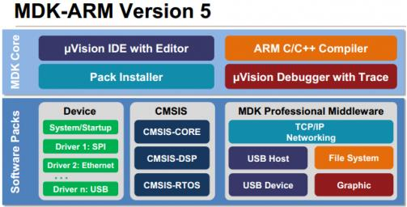

从上图可以看出， MDK Core 又分成四个部分： uVision IDE with Editor（编辑器）， ARM C/C++ Compiler（编译器）， Pack Installer（包安装器），uVision Debugger with Trace（调试跟踪器）。 uVision IDE 从 MDK4.7 版本开始就加入了代码提示功能和语法动态检测等实用功能，相对于以往的 IDE 改进很大。Software Packs（包安装器）又分为： Device（芯片支持）， CMSIS（ARM Cortex 微控制器软件接口标准） 和 Mdidleware（中间库）三个小部分，通过包安装器，我们可以安装最新的组件，从而支持新的器件、提供新的设备驱动库以及最新例程等，加速产品开发进度。  

Software Packs（包安装器）又分为： Device（芯片支持）， CMSIS（ARM Cortex 微控制器软件接口标准） 和 Mdidleware（中间库）三个小部分，通过包安装器，我们可以安装最新的组件，从而支持新的器件、提供新的设备驱动库以及最新例程等，加速产品开发进度。

同以往的 MDK 不同，以往的 MDK 把所有组件到包含到了一个安装包里面，显得十分“笨重”， MDK5 则不一样， MDK Core 是一个独立的安装包，它并不包含器件支持和设备驱动等组件，但是一般都会包括 CMSIS 组件，大小 350M 左右，相对于 MDK4.70A 的 500 多 M，瘦身不少，  器件支持、设备驱动、CMSIS 等组件， 则可以点击 MDK5 的 Build Toolbar 的最后一个图标调出 Pack Installer，来进行各种组件的安装。  

### 2. 官网

官网在这里：[Keil Embedded Development Tools for Arm, Cortex-M, Cortex-R4, 8051, C166, and 251 processor families.](https://www.keil.com/)，可以看一下官网是怎么介绍的：

>[Keil MDK](https://developer.arm.com/Tools and Software/Keil MDK) is the complete software development environment for a range of Arm Cortex-M based microcontroller devices. MDK includes [Keil Studio](https://developer.arm.com/documentation/109350/v6/What-is-MDK-), the [µVision IDE](https://developer.arm.com/documentation/101407/0538/User-Interface/uVision-GUI), and [debugger](https://www.keil.com/debug), [Arm C/C++ compiler](https://developer.arm.com/Tools and Software/Arm Compiler for Embedded), and essential [middleware](https://developer.arm.com/Tools and Software/Keil MDK/MDK-Middleware) components. It supports all silicon vendors with [more than 10,000 devices](https://www.keil.arm.com/devices/) and is easy to learn and use.
>
>翻译过来就是：Keil MDK是一系列基于Arm Cortex-M的微控制器设备的完整软件开发环境。MDK包括Keil Studio、μ Vision IDE、调试器、Arm C/ c++编译器和基本中间件组件。它支持拥有超过10,000个设备的所有硅供应商，并且易于学习和使用。

后来被ARM收购，在ARM官网也可以找到它的身影：[Arm Keil | Development Tools for IoT, ML, and Embedded](https://www.keil.arm.com/)。

## 二、安装Keil

### 1. 下载Keil

我们可以到这里下载：[Keil Product Downloads](https://www.keil.com/download/product/)：

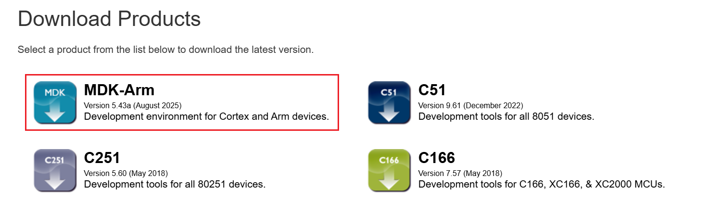

要是进行STM32开发的话下MDK-ARM，要是进行51单片机开发可以下载第二个C51，这两个算是两个软件，但是有一些方法可以让两个软件共存，也就是一个软件可以实现STM32和51单片机的开发。

需要下载其他版本可以点击这里：[ARM Product Updates](https://www.keil.com/update/rvmdk.asp)，但是吧，这里好像下载还要什么PSN，算了网上直接找吧，看到有一些可以直接找规律从下载链接下，例如：

```txt
https://armkeil.blob.core.windows.net/eval/MDK536.EXE
https://armkeil.blob.core.windows.net/eval/MDK518.EXE
```

需要注意的是从5.37版本开始不在默认安装arm compiler v5编译器，而使用最新V6版本编译器可能会出现一些编译不过的问题，所以保险起见，还是安装自带v5的吧，省心！！！建议安装5.36及以下版本，或者最新版本加arm compiler v5编译器。

>网速太慢的话可以点这里 链接: [MDK536](https://pan.baidu.com/s/1LxmTiYM8Qb1yUz75ocHbOw?pwd=cxgy) 提取码: cxgy 

### 2. 安装

这里就不再赘述了，网上的教程太多了，例如：[Keil5 的下载、安装](https://blog.csdn.net/2402_86633703/article/details/149467222)

要注意这个软件并不是免费的，但是个人用的话网上很多教程，大家都懂的。这里的安装路径可以注意一下，它默认是安装在这个路径下：

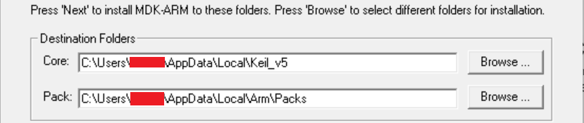

安装完成后打开，会弹出这样一个界面：
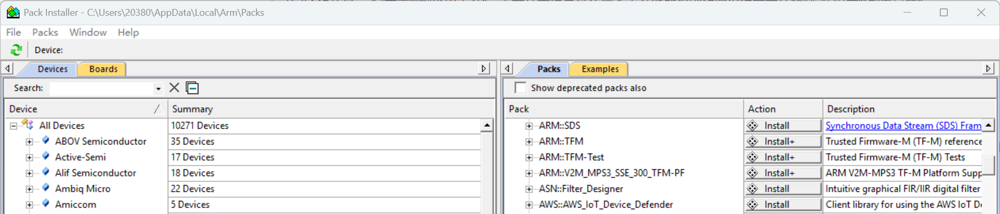

可以理解为 Keil MDK 这个“空壳”或“通用平台”的 “应用商店”或“驱动管理中心” ，可以方便地为我们所要开发的特定芯片安装所有必要的支持文件，在这里我们可以找到要安装的芯片支持包的链接。

> Tips：说是可以在这里直接点installan安装，但是我在右侧面板也没找到想要的啊，左侧可以获取到对应的芯片支持包的下载链接。

### 3. 芯片支持包

#### 3.1 芯片支持包是什么？

> Keil MDK 是一个“空壳”或“通用平台”，而芯片支持包是让这个平台能够识别和编译特定芯片的“驱动程序”和“工具箱”。

可以把 Keil MDK (Microcontroller Development Kit) 想象成一个**空的办公桌**或一个**通用的汽车维修厂**。

- 它提供了所有必要的**基础工具**：代码编辑器、编译器（ARMCC 或 CLANG）、链接器、调试器、项目管理器等。
- 它知道如何处理 ARM 架构的指令集。
- 但是，它**不知道**世界上成千上万种基于 ARM Cortex-M 内核的具体芯片有什么特性。

芯片支持包 (Chip Support Pack, 通常称为 **DFP - Device Family Pack** 或 **PACK**) 就像是为桌子上要组装的那个**特定型号的模型**提供的**专属说明书和专用工具**。一个 DFP 包里通常包含：

- **启动文件 (Startup Files)**：芯片上电后最先运行的汇编代码，负责初始化栈指针、中断向量表等。
- **链接脚本 (Linker Script)**：告诉链接器如何组织代码和数据在芯片内存中的布局。比如 Flash 和 RAM 的起始地址和大小，不同芯片这些参数都不同。
- **外设寄存器定义文件 (SVD / Header Files)**：例如 `stm32f10x.h` 这类文件。它们定义了芯片所有外设（如 GPIO, UART, I2C, SPI等）的寄存器地址和结构体，让你可以用 C 语言像 `GPIOA->ODR = 0x01;` 这样来操作硬件。
- **片上外设系统视图描述文件 (SVD)**：用于在调试时实时查看外设寄存器的值，非常关键。
- **Flash 编程算法**：告诉 Keil 如何擦除和烧写程序到你这款特定的芯片的 Flash 存储器里。
- 示例代码和工程模板。

当我们创建工程的时候发现没有我们的芯片的时候，就说明芯片支持包没有安装，例如：

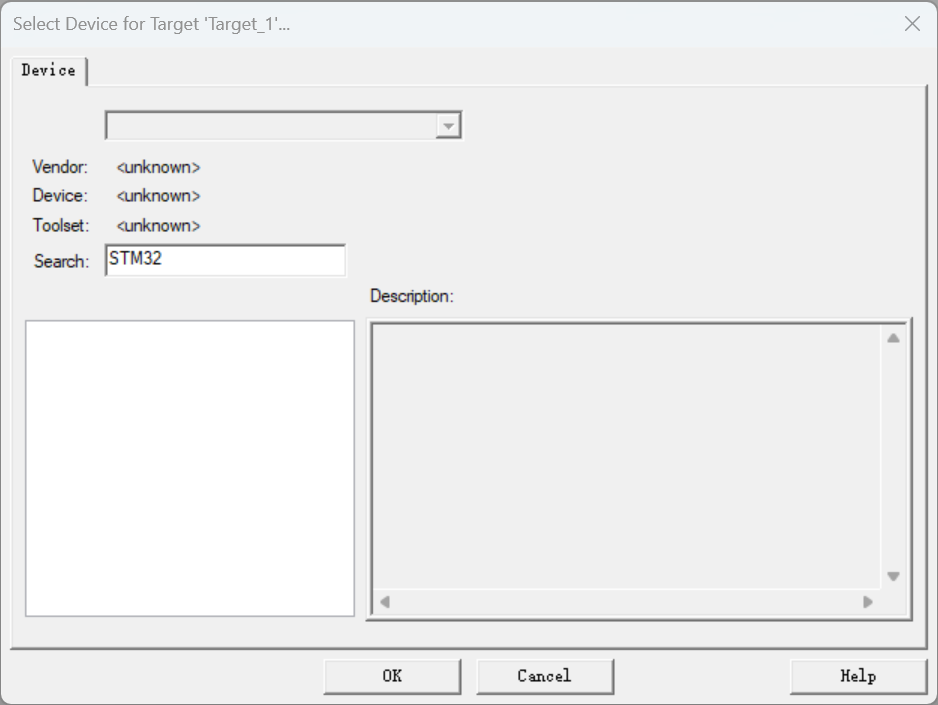

这里就是什么都没有，就无法创建工程。

#### 3.2 为什么这么设计

（1）**减小安装包体积**：Keil 安装包本身只有几百MB。如果要把所有厂商（ST, NXP, Microchip, GD, Nordic...）的所有芯片支持文件都打包进去，安装包可能会大到几十GB，而且绝大多数用户只需要其中一两种芯片的支持。

（2）**便于更新**：半导体厂商会不断推出新芯片、修复旧芯片支持包中的错误。Keil 的 **Pack Installer** 工具可以让你像手机App商店一样，独立、方便地更新某个芯片的支持包，而无需重新安装整个 Keil 软件。

（3）**模块化和灵活性**：Keil 提供了一个开放的平台，各家芯片厂商可以为自己生产的芯片创建和发布支持包，并随时更新，保持了极大的灵活性。

#### 3.3 在哪里下载？

可以在Keil的Package Installer中找到芯片支持包的下载链接：

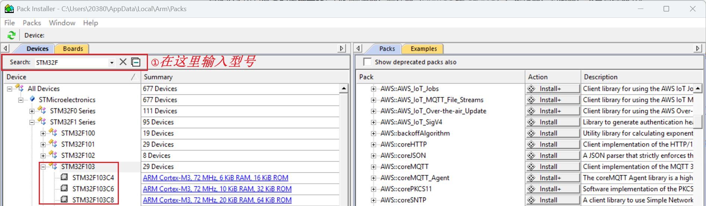

也可以去 [Arm Keil | Devices](https://www.keil.arm.com/devices/) 下载（其实上面的也会直接跳转到这个地址）。后面要用STM32F103ZET6开发，这里安装完后，我们再新建工程就可以找到对应的芯片了：

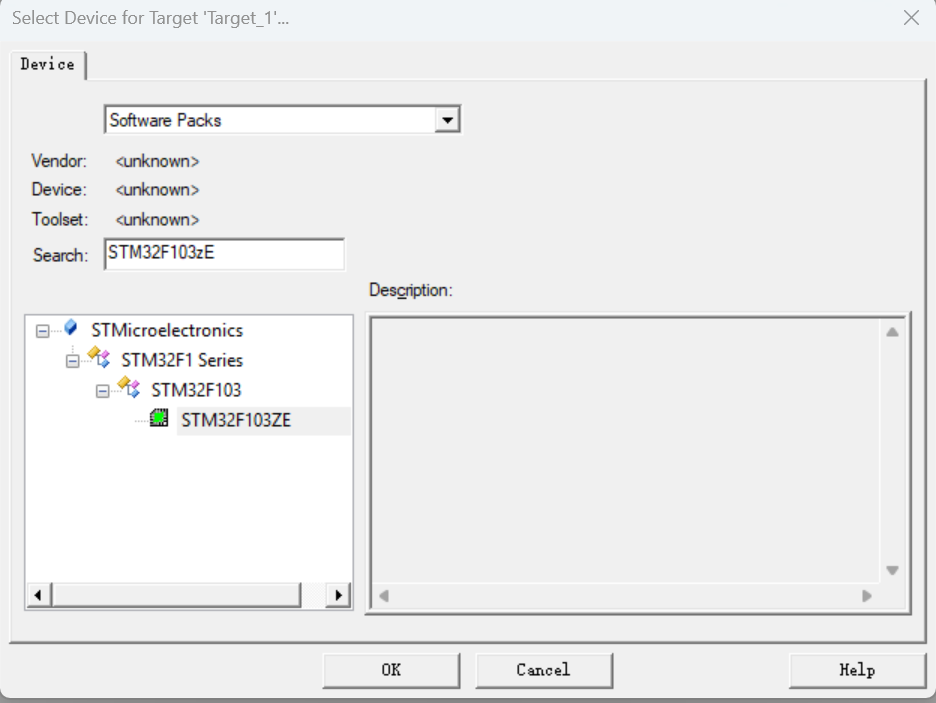

### 4. keil版本

因为后面安装最新版本踩坑，为了省事，安装了最后一个默认安装arm compiler v5编译器的MDK536版本，版本信息如下：


## 三、基本配置

### 1. 文本美化  

文本美化，主要是设置一些关键字、注释、数字等的颜色和字体。MDK 提供了我们自定义字体颜色的功能。我们可以在工具 条上点击扳手的图标，在该对话框中，先设置 Encoding 为:Chinese GB2312(Simplified)，然后设置 Tab size 为： 4。以更好的支持简体中文（否则，拷贝到其他地方的时候，中文可能是一堆的问号），同时 TAB间隔设置为 4 个单位。  

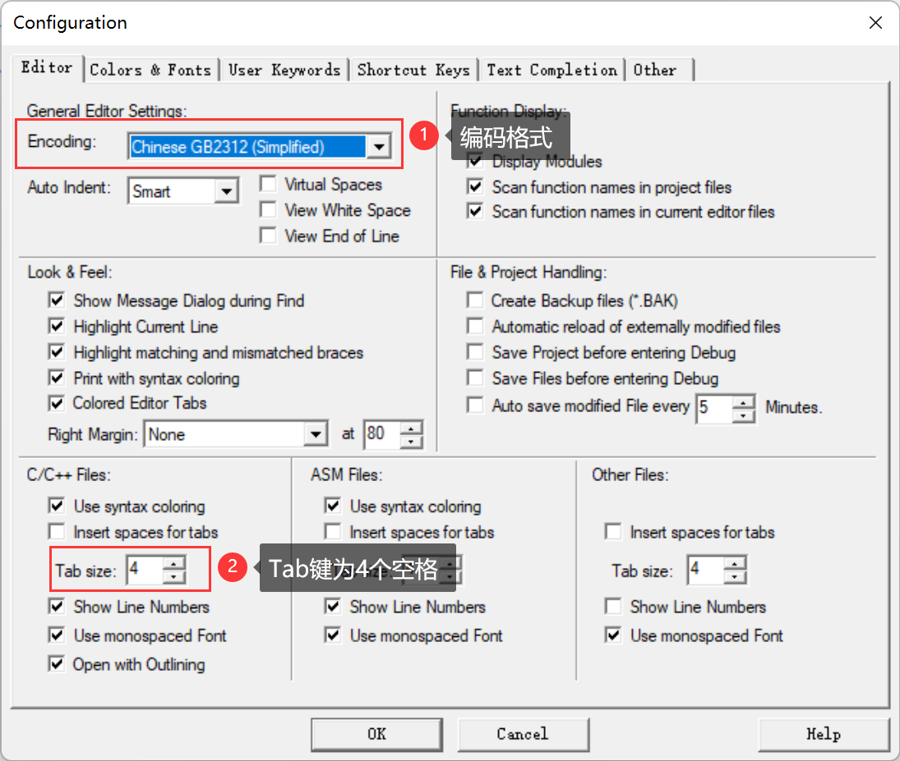

然后我们来到Colors&Fonts 选项卡，在该选项卡内，我们就可以设置自己的代码的子体和颜色了。由于我们使用的是 C 语言，故在 Window 下面选择： C/C++ Editor Files在右边就可以看到相应的元素了。  如下图，我们可以设置背景色：

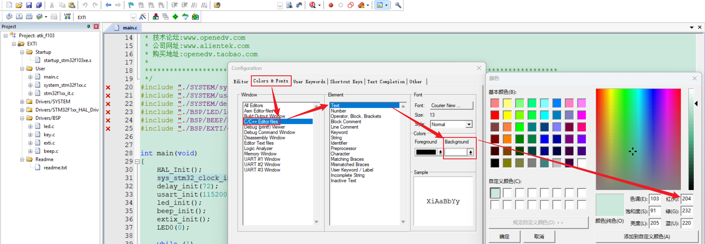

在这里我们也可以自定义关键字美化，比如我们有一个自定义数据类型 u8，我们首先添加用户关键字，然后设置用户关键字的颜色：

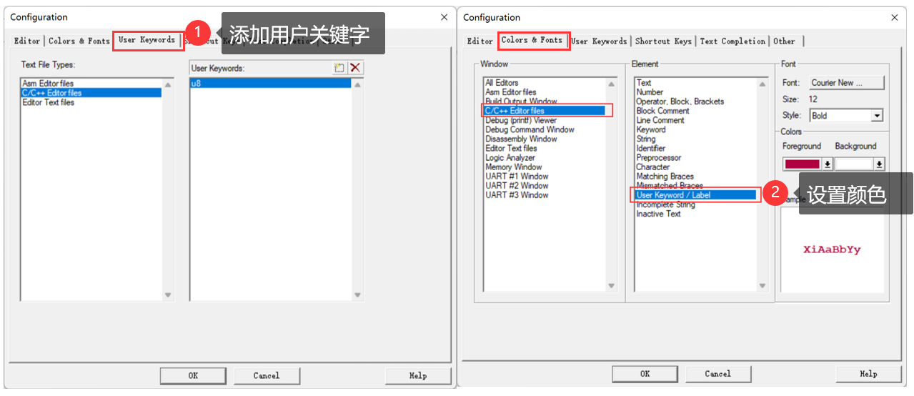

然后就会有以下效果啦：

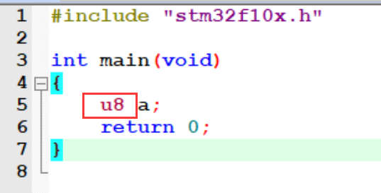

### 2. 语法检测&代码提示  

MDK5 支持代码提示与动态语法检测功能，使得 MDK 的编辑器越来越好用了， 我们打开配置对话框，选择 Text Completion 选项卡 ：

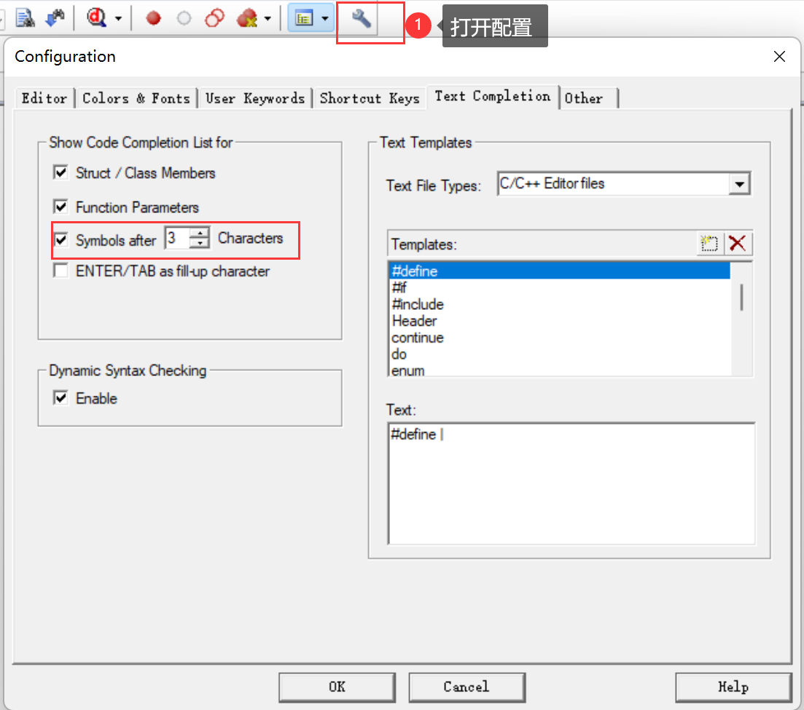

Strut/Class Members，用于开启结构体/类成员提示功能。

Function Parameters，用于开启函数参数提示功能。

Symbols after xx characters，用于开启代码提示功能，即在输入多少个字符以后，提示匹配的内容（比如函数名字、结构体名字、变量名字等），这里默认设置 3 个字符以后，就开始提示。  

Dynamic Syntax Checking，则用于开启动态语法检测，比如编写的代码存在语法错误的时候，会在对应行前面出现 × 图标，如出现警告，则会出现感叹号图标，将鼠标光标放图标上面，则会提示产生的错误/警告的原因，如下图 。

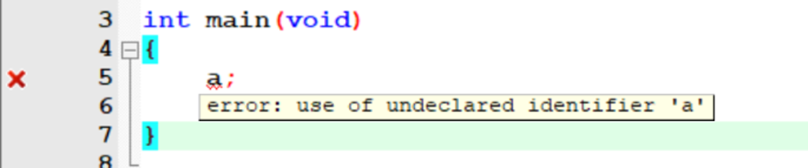

这几个功能，对我们编写代码很有帮助，可以加快代码编写速度，并且及时发现各种问题。不过这里要注意，语法动态检测这个功能， 有的时候会误报，自己确定无关紧要的可以不用理会，只要能编译通过（0 错误， 0 警告），这样的语法误报，一般直接忽略即可。  
