接下来就是工程创建啦。

<!-- more -->

## 一、库文件

在STM32的开发中，ST（意法半导体）提供了多种软件库来帮助开发者简化开发流程，提高开发效率。其中，**标准外设库（Standard Peripheral Library, SPL）** 和 **硬件抽象层库（Hardware Abstraction Layer Library, HAL）** 是最为经典和常用的两种。

### 1. 标准外设库 (Standard Peripheral Library, SPL)

标准库，也称为SPL，是ST早期为STM32F1, F2, F4, L1等系列提供的库函数。它是对STM32芯片底层寄存器操作的一种封装，提供了一组C语言API用于配置和控制所有片上外设（如GPIO, USART, SPI, I2C, TIM等）。

- **中度抽象**：它没有完全隐藏硬件的细节，开发者仍然需要关心部分寄存器配置和时钟使能流程，但避免了直接读写寄存器的繁琐和易错性。
- **流程清晰**：代码结构通常遵循“初始化结构体定义 &rarr; 配置参数 &rarr; 调用初始化函数 &rarr; 使用外设”的模式。
- **与芯片紧密相关**：不同系列的STM32芯片（如F1和F4）其标准库不能直接通用，API和头文件有差异。
- **已停止更新**：ST已于2019年底正式停止更新和维护标准库，新推出的芯片系列（如STM32G0, G4, L4+, L5, H7等）不再提供标准库支持。

>标准库的版本：STM32F10x_StdPeriph_Lib_V3.6.0。下载地址：[STM32标准外设软件库 - 意法半导体STMicroelectronics](https://www.st.com/zh/embedded-software/stm32-standard-peripheral-libraries.html)
>

### 2. 硬件抽象层库 (Hardware Abstraction Layer Library, HAL)

HAL库是ST为了替代标准库而推出的新一代库，旨在提供更高层次的抽象，实现跨STM32产品线的最大限度的可移植性。它是STM32Cube生态系统（包含STM32CubeMX配置工具和STM32CubeIDE）的核心组成部分。

- **高度抽象**：HAL库将硬件底层细节完全封装起来，提供统一的、面向功能的API（如`HAL_UART_Transmit()`）。开发者无需深入研究芯片数据手册和参考手册即可快速上手。
- **跨系列兼容**：HAL库的API在不同系列的STM32芯片上保持一致，极大地简化了项目移植工作。
- **集成STM32CubeMX**：与STM32CubeMX图形化配置工具无缝集成，可以自动生成初始化代码，极大提升了项目搭建和外设配置的效率。
- **功能丰富**：支持高级功能，如DMA、中断、各种通信协议的高级模式等，并且内置了超时管理和错误处理机制。
- **持续维护**：ST持续为所有新产品线开发和维护HAL库，是ST主推的开发方式。

>HAL库的版本：STM32Cube_FW_F1_V1.8.0。下载地址：[STM32CubeF1 - STM32Cube MCU包，用于STM32F1系列（HAL、底层API和CMSIS（CORE、DSP和RTOS）、USB、TCP/IP、File system、RTOS和Graphic - 附带在以下ST板上运行的示例：STM32 Nucleo、探索套件和评估板） - 意法半导体STMicroelectronics](https://www.st.com/zh/embedded-software/stm32cubef1.html#get-software)

### 3. 优劣对比分析

| 特性维度       | 标准库 (SPL)                                                 | HAL库 (HAL)                                                  |
| :------------- | :----------------------------------------------------------- | :----------------------------------------------------------- |
| **抽象层次**   | 中度抽象，接近寄存器                                         | 高度抽象，接近功能                                           |
| **代码效率**   | **高**。代码更精简，执行效率高，资源占用少。                 | **较低**。因通用性而引入更多判断和封装，代码体积大，执行效率相对较低。 |
| **可移植性**   | **差**。高度依赖特定芯片系列，跨系列移植需大量修改。         | **极佳**。统一的API接口，跨系列移植通常只需修改少量硬件相关配置。 |
| **易用性**     | **中等**。需理解外设工作原理和配置流程，上手有门槛。         | **高**。配合CubeMX可“点点鼠标”生成代码，API功能化，新手友好。 |
| **维护性**     | **已停止维护**。无新功能，无对新芯片的支持。                 | **持续维护更新**。Bug修复，新功能添加，支持所有新芯片。      |
| **社区与生态** | 资料丰富（尤其是老项目），但逐渐过时。                       | 当前主流，官方大力推广，新教程和项目多，社区活跃。           |
| **适用场景**   | 1. 资源极度受限的旧项目。<br>2. 对性能和代码尺寸有极致要求的场景。 <br>3. 维护遗留老代码。 | 1. **新项目开发的首选**。 <br>2. 快速原型开发。 <br>3. 需要跨芯片平台移植的项目。 <br>4. 初学者学习和使用。 |

## 二、工程创建

### 1. 工程目录准备

- （1）创建工程目录，我们的工程文件一会可以放在这个目录下。

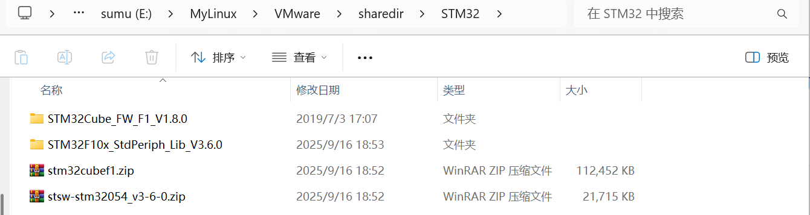

- （2）创建目录，并拷贝相关文件

这里我为了偷懒，我写了一个shell脚本，上边我创建的目录是在在虚拟机的共享目录下，所以我们可以直接在虚拟机中通过执行脚本来创建和拷贝相关文件，最后再chuangjianMDK工程，所需要执行的脚本如下：

```shell
#!/bin/bash

BLACK="\033[1;30m"
RED='\033[1;31m'    # 红
GREEN='\033[1;32m'  # 绿
YELLOW='\033[1;33m' # 黄
BLUE='\033[1;34m'   # 蓝
PINK='\033[1;35m'   # 紫
CYAN='\033[1;36m'   # 青
WHITE='\033[1;37m'   # 白
CLS='\033[0m'       # 清除颜色

# 变量定义
STD_PROJECT_ROOT_NAME=StdPeriph_Lib_Template
STD_LIB_NAME=STM32F10x_StdPeriph_Lib_V3.6.0
STD_STARTUP_NAME=startup_stm32f10x_hd.s
HAL_PROJECT_ROOT_NAME=STM32Cube_FW_F1_Template
HAL_LIB_NAME=STM32Cube_FW_F1_V1.8.0
PROJECT_TYPE="xxx lib project"

STD_PROJECT_DRIVER_DIRNAME="STM32F10x_FWLib"
HAL_PROJECT_DRIVER_DIRNAME="HAL_lib"
PROJECT_DIR_NAME[0]=""                # STM32F10x_FWLib/HAL_lib 存放 ST 官方提供的库函数源码文件
PROJECT_DIR_NAME[1]="CORE"            # CORE 用来存放核心文件和启动文件
PROJECT_DIR_NAME[2]="USER"            # USER 用来放我们的代码工程文件
PROJECT_DIR_NAME[3]="OBJ"             # OBJ  用来存放编译过程文件以及 hex 文件               
PROJECT_DIR_NAME[4]="HARDWARE"        # HARDWARE 存放用户编写的外设驱动文件
declare -A PROJECT_DIR_PATH           # 定义一个字典，后边组合生成键值对，字典必须先声明

CURRENT_PATH=$(pwd)
PROJECT_ROOT_PATH=${CURRENT_PATH}
LIB_PATH=${CURRENT_PATH}

# 提示信息打印函数
function echo_menu()
{
    echo -e "${GREEN}================================================${CLS}"
    echo -e ""
    echo -e "${WHITE}# CURRENT_PATH          : ${CURRENT_PATH}${CLS}"
    echo -e "${WHITE}# STD_PROJECT_ROOT_NAME : ${STD_PROJECT_ROOT_NAME}${CLS}"
    echo -e "${WHITE}# HAL_PROJECT_ROOT_NAME : ${HAL_PROJECT_ROOT_NAME}${CLS}"
    echo -e "${WHITE}# STD_LIB_NAME          : ${STD_LIB_NAME}${CLS}"
    echo -e "${WHITE}# HAL_LIB_NAME          : ${HAL_LIB_NAME}${CLS}"
    echo -e ""
    echo -e "${GREEN}* [0] 拷贝STM32工程所需标准库文件(标准库工程)"
    echo -e "${GREEN}* [1] 拷贝STM32工程所需HAL库文件(HAL库工程)"
    echo -e "${GREEN}================================================${CLS}"

    read -p "选择功能,默认选择0:" choose
    if [ "${choose}" == "0" ] || [ "${choose}" == "" ];then # [0] 拷贝STM32工程所需标准库文件
        PROJECT_ROOT_PATH=${CURRENT_PATH}/${STD_PROJECT_ROOT_NAME}
        LIB_PATH=${CURRENT_PATH}/${STD_LIB_NAME}
        PROJECT_DIR_NAME[0]=${STD_PROJECT_DRIVER_DIRNAME}
        PROJECT_TYPE="STD_lib_project"
    elif [ "${choose}" == "1" ];then                        # [0] 拷贝STM32工程所需HAL库文件
        PROJECT_ROOT_PATH=${CURRENT_PATH}/${HAL_PROJECT_ROOT_NAME}
        LIB_PATH=${CURRENT_PATH}/${HAL_LIB_NAME}
        PROJECT_DIR_NAME[0]=${HAL_PROJECT_DRIVER_DIRNAME}
        PROJECT_TYPE="HAL_lib_project"
    fi

    echo -e "${GREEN}================================================${CLS}"
    echo -e "${GREEN}相关动态参数如下：${CLS}"
    echo -e "${PINK}# PROJECT_TYPE      : ${PROJECT_TYPE}${CLS}"
    echo -e "${PINK}# PROJECT_ROOT_PATH : ${PROJECT_ROOT_PATH}${CLS}"
    echo -e "${PINK}# LIB_PATH          : ${LIB_PATH}${CLS}"
    echo -e "${PINK}# PROJECT_DIR_NAME  : ${PROJECT_DIR_NAME[*]}${CLS}"
    echo -e "${GREEN}================================================${CLS}"
}

function copy_hal_lib_files()
{
    cp -pr ${LIB_PATH}/Drivers/STM32F1xx_HAL_Driver/Inc ${PROJECT_DIR_PATH[${PROJECT_DIR_NAME[0]}]}
    cp -pr ${LIB_PATH}/Drivers/STM32F1xx_HAL_Driver/Src ${PROJECT_DIR_PATH[${PROJECT_DIR_NAME[0]}]}

    cp -p ${LIB_PATH}/Drivers/CMSIS/Device/ST/STM32F1xx/Source/Templates/arm/startup_stm32f103xe.s ${PROJECT_DIR_PATH[${PROJECT_DIR_NAME[1]}]}
    cp -p ${LIB_PATH}/Drivers/CMSIS/Include/cmsis_armcc.h ${PROJECT_DIR_PATH[${PROJECT_DIR_NAME[1]}]}
    cp -p ${LIB_PATH}/Drivers/CMSIS/Include/cmsis_armclang.h ${PROJECT_DIR_PATH[${PROJECT_DIR_NAME[1]}]}
    cp -p ${LIB_PATH}/Drivers/CMSIS/Include/cmsis_compiler.h ${PROJECT_DIR_PATH[${PROJECT_DIR_NAME[1]}]}
    cp -p ${LIB_PATH}/Drivers/CMSIS/Include/cmsis_version.h ${PROJECT_DIR_PATH[${PROJECT_DIR_NAME[1]}]}
    cp -p ${LIB_PATH}/Drivers/CMSIS/Include/core_cm3.h ${PROJECT_DIR_PATH[${PROJECT_DIR_NAME[1]}]}

    cp -p ${LIB_PATH}/Drivers/CMSIS/Device/ST/STM32F1xx/Include/stm32f1xx.h ${PROJECT_DIR_PATH[${PROJECT_DIR_NAME[2]}]}
    cp -p ${LIB_PATH}/Drivers/CMSIS/Device/ST/STM32F1xx/Include/system_stm32f1xx.h ${PROJECT_DIR_PATH[${PROJECT_DIR_NAME[2]}]}
    cp -p ${LIB_PATH}/Drivers/CMSIS/Device/ST/STM32F1xx/Include/stm32f103xe.h ${PROJECT_DIR_PATH[${PROJECT_DIR_NAME[2]}]}

    cp -p ${LIB_PATH}/Projects/STM3210E_EVAL/Templates/Inc/main.h ${PROJECT_DIR_PATH[${PROJECT_DIR_NAME[2]}]}
    cp -p ${LIB_PATH}/Projects/STM3210E_EVAL/Templates/Inc/stm32f1xx_hal_conf.h ${PROJECT_DIR_PATH[${PROJECT_DIR_NAME[2]}]}
    cp -p ${LIB_PATH}/Projects/STM3210E_EVAL/Templates/Inc/stm32f1xx_it.h ${PROJECT_DIR_PATH[${PROJECT_DIR_NAME[2]}]}

    cp -p ${LIB_PATH}/Projects/STM3210E_EVAL/Templates/Src/main.c ${PROJECT_DIR_PATH[${PROJECT_DIR_NAME[2]}]}
    cp -p ${LIB_PATH}/Projects/STM3210E_EVAL/Templates/Src/system_stm32f1xx.c ${PROJECT_DIR_PATH[${PROJECT_DIR_NAME[2]}]}
    cp -p ${LIB_PATH}/Projects/STM3210E_EVAL/Templates/Src/stm32f1xx_it.c ${PROJECT_DIR_PATH[${PROJECT_DIR_NAME[2]}]}
    cp -p ${LIB_PATH}/Projects/STM3210E_EVAL/Templates/Src/stm32f1xx_hal_msp.c ${PROJECT_DIR_PATH[${PROJECT_DIR_NAME[2]}]}
}

function copy_std_lib_files()
{
    cp -pr ${LIB_PATH}/Libraries/STM32F10x_StdPeriph_Driver/src ${PROJECT_DIR_PATH[${PROJECT_DIR_NAME[0]}]} # STM32F10x_FWLib
    cp -pr ${LIB_PATH}/Libraries/STM32F10x_StdPeriph_Driver/inc ${PROJECT_DIR_PATH[${PROJECT_DIR_NAME[0]}]} # STM32F10x_FWLib

    cp -p ${LIB_PATH}/Libraries/CMSIS/CM3/CoreSupport/core_cm3.c ${PROJECT_DIR_PATH[${PROJECT_DIR_NAME[1]}]} # CORE
    cp -p ${LIB_PATH}/Libraries/CMSIS/CM3/CoreSupport/core_cm3.h ${PROJECT_DIR_PATH[${PROJECT_DIR_NAME[1]}]} # CORE
    cp -p ${LIB_PATH}/Libraries/CMSIS/CM3/DeviceSupport/ST/STM32F10x/startup/arm/${STD_STARTUP_NAME} ${PROJECT_DIR_PATH[${PROJECT_DIR_NAME[1]}]} # CORE

    cp -p ${LIB_PATH}/Libraries/CMSIS/CM3/DeviceSupport/ST/STM32F10x/stm32f10x.h ${PROJECT_DIR_PATH[${PROJECT_DIR_NAME[2]}]} # USER
    cp -p ${LIB_PATH}/Libraries/CMSIS/CM3/DeviceSupport/ST/STM32F10x/system_stm32f10x.c ${PROJECT_DIR_PATH[${PROJECT_DIR_NAME[2]}]} # USER
    cp -p ${LIB_PATH}/Libraries/CMSIS/CM3/DeviceSupport/ST/STM32F10x/system_stm32f10x.h ${PROJECT_DIR_PATH[${PROJECT_DIR_NAME[2]}]} # USER

    cp -p ${LIB_PATH}/Project/STM32F10x_StdPeriph_Template/main.c ${PROJECT_DIR_PATH[${PROJECT_DIR_NAME[2]}]} # USER
    cp -p ${LIB_PATH}/Project/STM32F10x_StdPeriph_Template/stm32f10x_conf.h ${PROJECT_DIR_PATH[${PROJECT_DIR_NAME[2]}]} # USER
    cp -p ${LIB_PATH}/Project/STM32F10x_StdPeriph_Template/stm32f10x_it.c ${PROJECT_DIR_PATH[${PROJECT_DIR_NAME[2]}]} # USER
    cp -p ${LIB_PATH}/Project/STM32F10x_StdPeriph_Template/stm32f10x_it.h ${PROJECT_DIR_PATH[${PROJECT_DIR_NAME[2]}]} # USER
    
}

function copy_files_to_project()
{
    if [ ! -d "${PROJECT_ROOT_PATH}" ];then
        mkdir -v ${PROJECT_ROOT_PATH}
    fi

    cd ${PROJECT_ROOT_PATH}
    echo -e "${WHITE}# CURRENT_PATH      : $(pwd)${CLS}"

    # 创建相关目录
    for DIR_NAME in ${PROJECT_DIR_NAME[@]}
        do
            if [ ! -d "${PROJECT_ROOT_PATH}/${DIR_NAME}" ];then
                mkdir -v ${PROJECT_ROOT_PATH}/${DIR_NAME}
            else
                echo -e "${YELLOW}[WARN]${DIR_NAME} 目录已存在!!!${CLS}"
            fi
            PROJECT_DIR_PATH[${DIR_NAME}]=${PROJECT_ROOT_PATH}/${DIR_NAME}
        done
    #打印所有key值
    echo -e "${GREEN}[INFO]${!PROJECT_DIR_PATH[*]}${CLS}"
    #打印所有value
    echo -e "${GREEN}[INFO]${PROJECT_DIR_PATH[*]}${CLS}"
    # 拷贝相关文件
    if [ "${PROJECT_TYPE}" == "STD_lib_project" ];then
        copy_std_lib_files
        exit
    elif [ "${PROJECT_TYPE}" == "HAL_lib_project" ];then
        copy_hal_lib_files
        exit
    fi
    
}

# 功能实现
echo_menu
copy_files_to_project

```

使用脚本的话，我们需要的文件如下：

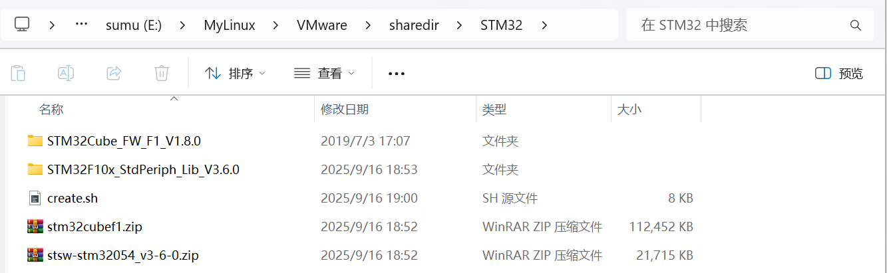

反正这几个目录还有这个脚本放在同一级目录下就可以了，执行完脚本，目录结构如下：

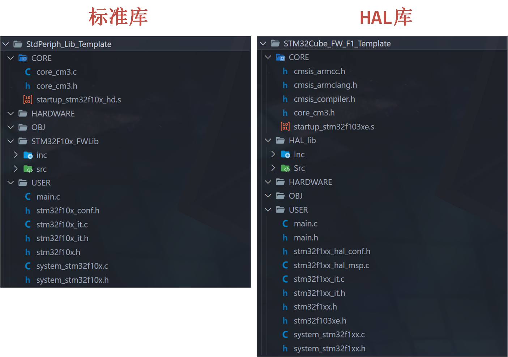

### 2. MDK工程创建

#### 2.1 创建空工程

- （1）创建工程

点击 MDK 的菜单 ：【Project】 &rarr;【New Uvision Project】 ，然后将目录定位到刚才建立的文件夹"Template" 之下，我们的代码工程文件放在 USER 目录，这个目录就看个人喜好了，也可以命名成别的，注意在上一步创建目录的时候改掉就好了。

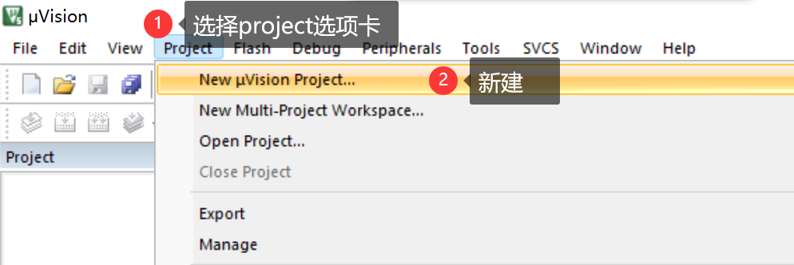

然后定位到 USER 目录下面，我们的工程文件就都保存到 USER 文件夹下面。工程命名为Template，点击保存。  

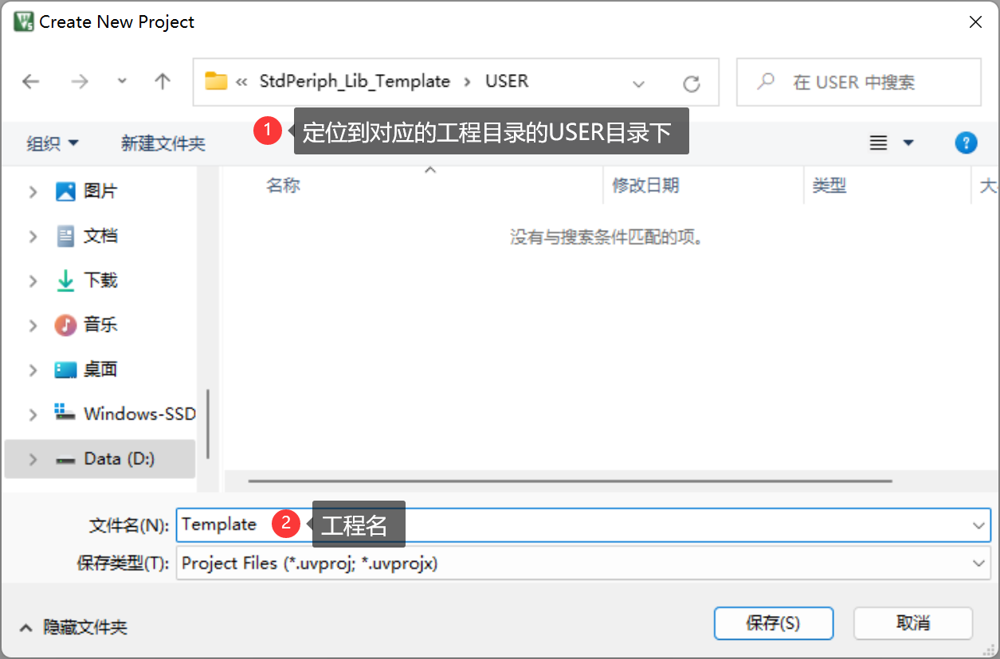

- （2）选择芯片型号

接下来会出现一个选择 CPU 的界面，就是选择我们的芯片型号。  因为我使用的 STM32 型号为 STM32F103ZET6，所以在这里我们选【STMicroelectronics】 &rarr;【STM32F1 Series】&rarr;【STM32F103】&rarr;【STM32F103ZET6】（如果使用的是其他系列的芯片，选择相应的型号就可以了，特别注意： 一定要安装对应的器件 pack 才会显示这些内容。   

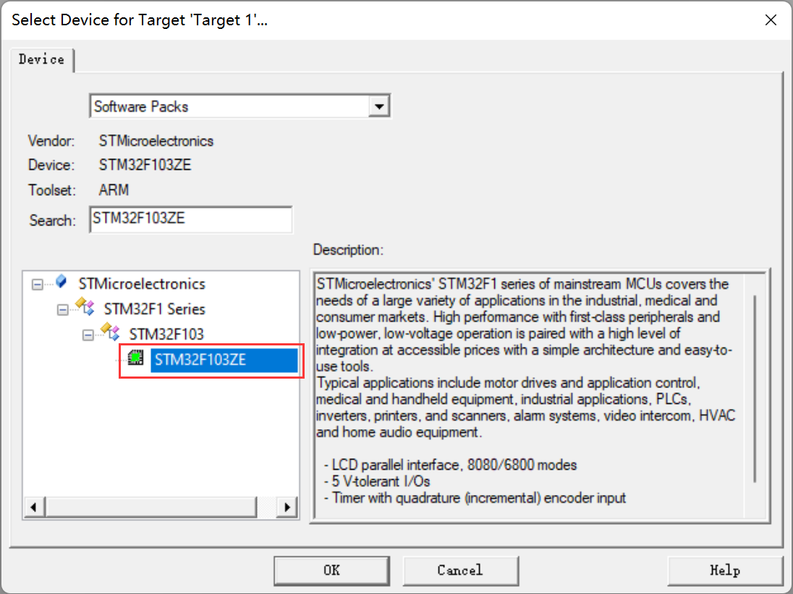

- （3）点击 OK， MDK 会弹出 Manage Run-Time Environment 对话框，  

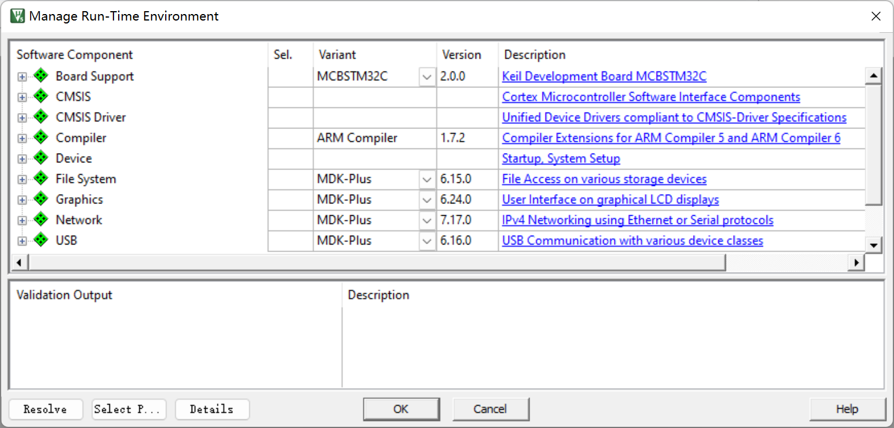


这是 MDK5 新增的一个功能，在这个界面，我们可以添加自己需要的组件，从而方便构建开发环境，我们直接点击 Cancel 即可。然后工程框架就就创建好啦：

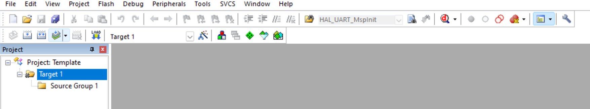

#### 2.2 添加文件到工程

我们按照之前拷贝文件的目录结构，来在工程中创建相应的文件夹来管理代码：


这里以标准库工程为例：

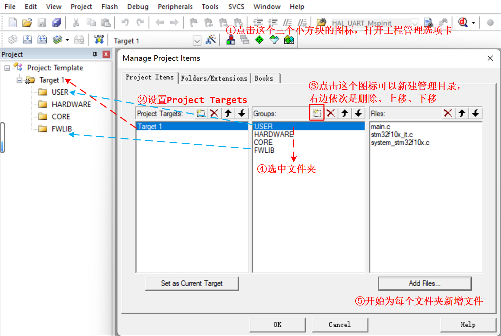


（1）Project Targets 一栏，我们将 Target 名字修改为 Template,然后在 Groups 一栏删掉一个 SourceGroup1，建立三个 Groups： USER,CORE,FWLIB。然后点击 OK，可以看到我们的 Target名字以及 Groups 情况。  

（2）往 Group （USER,CORE,FWLIB）里面添加我们需要的文件。

STM32F10x_FWLib/src 下面，将里面所有的文件选中(Ctrl+A)，然后点击 Add，然后 Close  。这里需要说明一下，对于我们写代码，如果我们只用到了其中的某个外设，我们就可以不用添加没有用到的外设的库文件。例如我只用 GPIO，我可以只用添加 stm32f10x_gpio.c 而其他的可以不用添加。这里我们全部加进来是为了后面方便，不用每次添加，当然这样的坏处是工程太大，编译起来速度慢，用户可以自行选择。  

用同样的方法，将 Groups 定位到 CORE 和 USER 下面，添加需要的文件。这里我们的 CORE 下面需要添加的文件为 core_cm3.c， startup_stm32f10x_hd.s (注意，默认添加的时候文件类型为.c，也就是添加 startup_stm32f10x_hd.s 启动文件的时候，需要选择文件类型为 All files 才能看得到这个文件)， USER 目录下面需要添加的文件为 main.c， stm32f10x_it.c，system_stm32f10x.c。

最终我们的工程目录就如下所示：

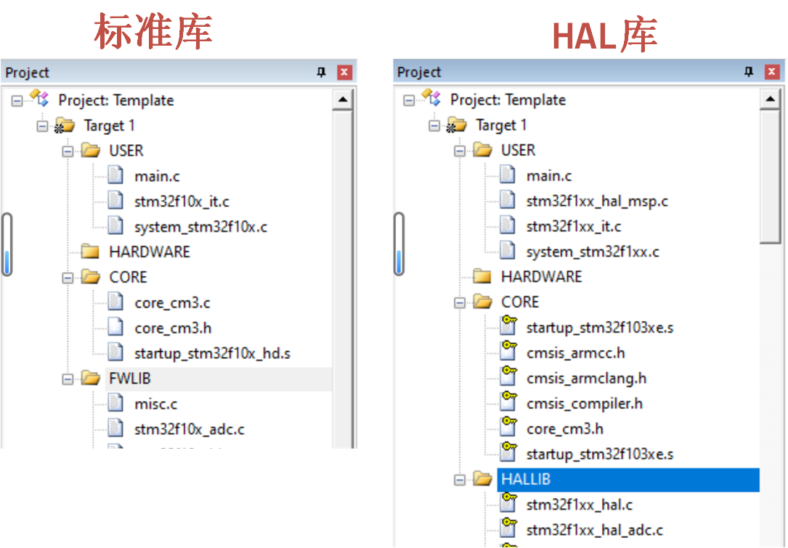

右边的图有些文件为什么带个钥匙标记？因为这些文件是只读的。

#### 2.3 编译中间文件位置

- 设置编译中间文件编译后存放目录  

方法是点击魔术棒，然后选择“Output”选项下面的“Select folder for objects…” ,然后选择目录为我们上面新建的 OBJ 目录。 这里大家注意，如果我们不设置 Output 路径，那么默认的编译中间文件存放目录就是 MDK 自动生成的 Objects 目录和 Listings 目录。  

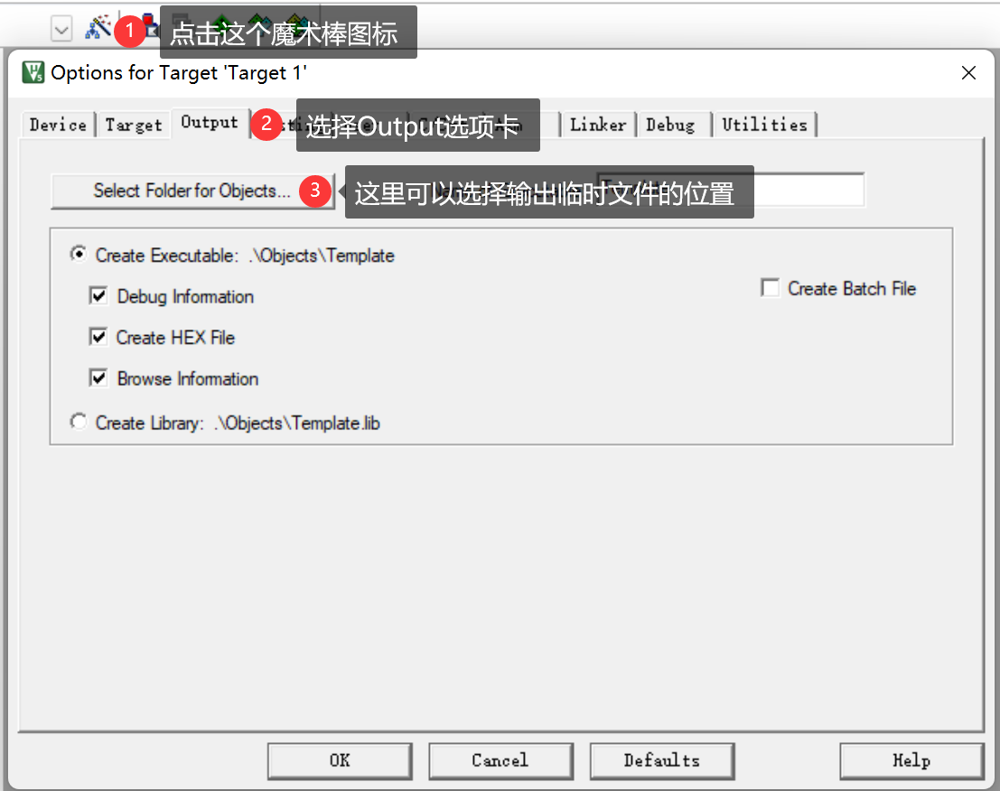

如果我们没有设置的话，将会在工程文件所在的目录生成这个两个目录：

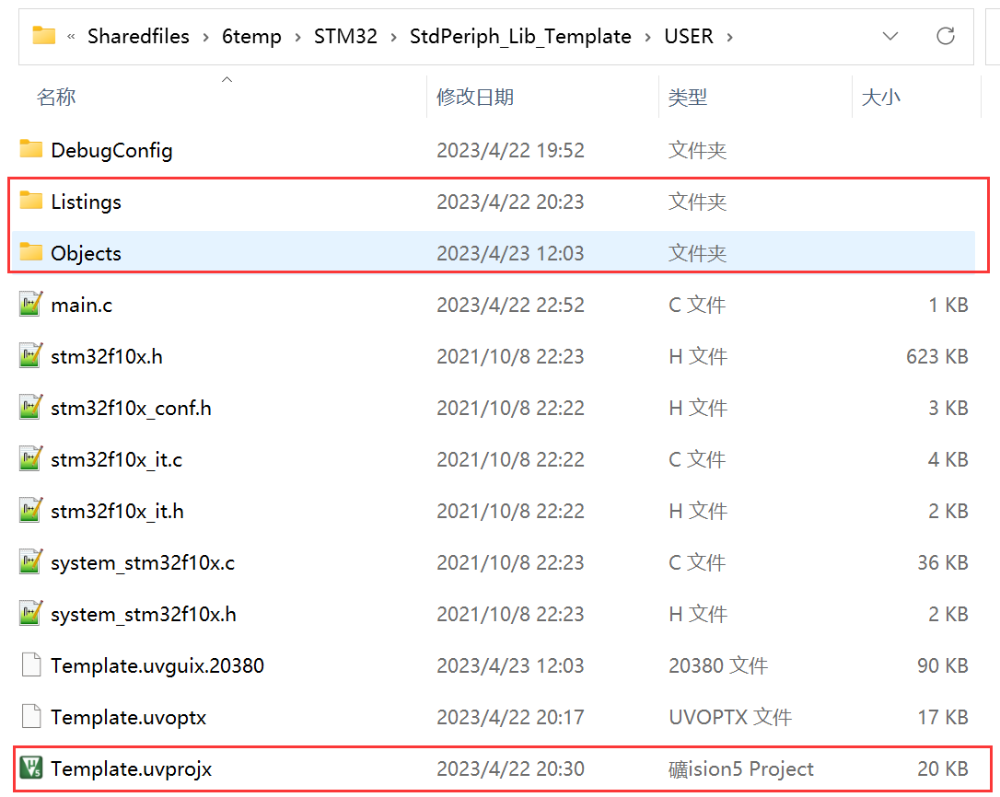

#### 2.4 头文件位置

接下来我们编译一下工程，我们会发现全是这种报错：

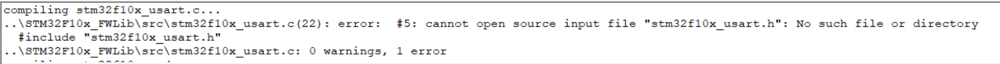

这是因为编译的时候找不到头文件位置导致的，我们要注意对于任何一个工程，我们都需要把工程中引用到的所有头文件的路径都包含到进来。 回到工程主菜单，点击魔术棒图标，会弹出来一个菜单，然后点击 c/c++选项.然后点击Include Paths 右边的按钮。弹出一个添加 path 的对话框，然后我们将图上面的 3 个目录添加进去。记住， **keil 只会在一级目录查找**，所以如果目录下面还有子目录，记得 path一定要定位到最后一级子目录，然后点击 OK。

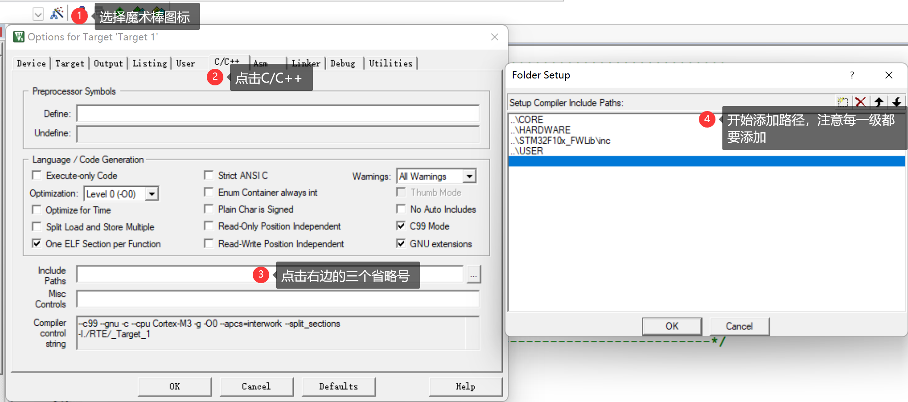

对于HAL库工程也是一模一样的操作。

#### 2.5 全局宏定义与报错解决

- （1）标准库创建的工程

我们再编译程序，会发现还是有很多警告和报错：

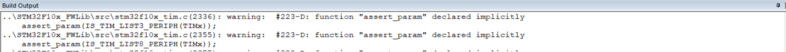

这是因为库函数在配置和选择外设的时候通过宏定义来选择的，所以我们需要配置一个全局的宏定义变量。  我们还是在添加头文件路径的选项卡中，我们定位到 c/c++界面，然后填写

```txt
STM32F10X_HD,USE_STDPERIPH_DRIVER
```

到 Define 输入框里面(请注意，两个标识符中间是逗号不是句号。如果用的是中容量那么STM32F10X_HD 修改为 STM32F10X_MD，小容量修改为 STM32F10X_LD，然后点击 OK。 

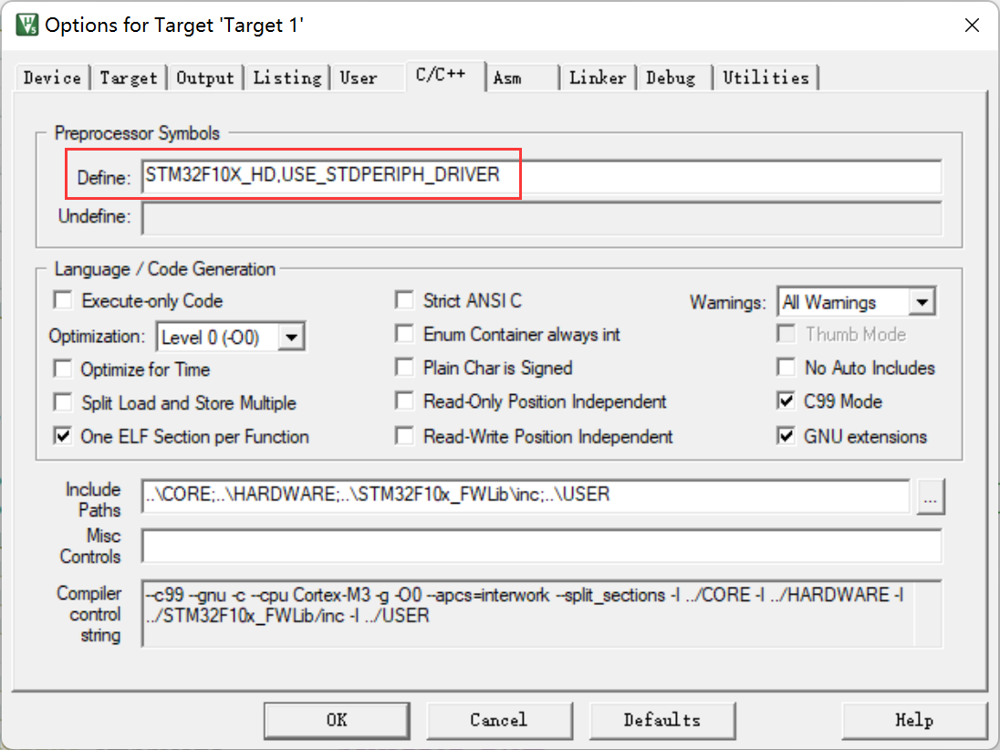

然后我们再编译，会发现，竟然还有一个错，这里明显是说打不开这个头文件，我们双击这个错误，MDK会自动定位到出错的地方。

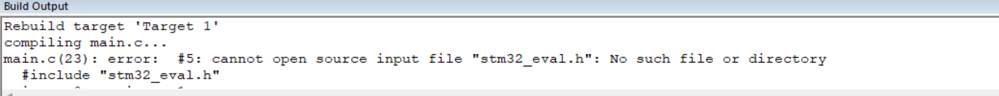

这个错误出现在main.c中，这是因为这个main.c使我们从标准库的模板中复制出来的，主函数中添加了一些对应的评估板的东西，而调用到了这个头文件，但实际上我们并不需要这些，我们吧main.c文件内容改成这样，以后添加自己的代码就好，之前的可以不要：

```c
#include "stm32f10x.h"

int main(void)
{
  return 0;
}
```

然后我们再编译就不会报错啦，这样我们就得到了一个没有error，没有warn的工程模板啦：

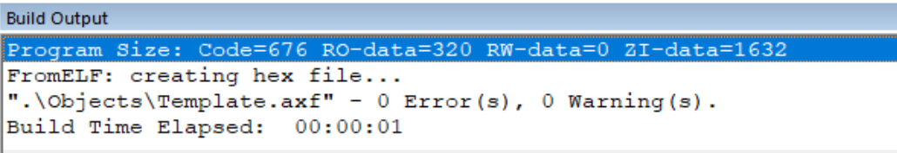


- （2）HAL库创建的工程

上边是标准库的一些问题和解决方法，那么HAL库呢？ 首先对于HAL库的话在 c/c++界面 填写一下宏：

```txt
USE_HAL_DRIVER,STM32F103xE
```

然后我们编译，会看到如下情况：

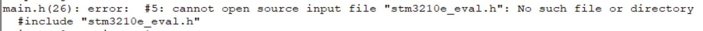

会发现有3个error，全都是打不开这个文件，这个跟标准库，我们其实并没有用到这个文件，这里的引用删掉就好啦，然后我们继续编译，神奇的事情发生了，报错更多了：

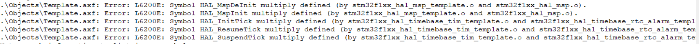

这些都是在报一些个符号重定义，这几个报错涉及到以下三个文件：

stm32f1xx_hal_msp_template.c 文件内容是一些空函数，一般不需要引入到工程中，我们从工程中去掉这个文件。

stm32f1xx_hal_timebase_tim_template.c和stm32f1xx_hal_timebase_rtc_alarm_template.c里边的没有研究过，不过看命名，应该也是一些例子之类的，他们并不是我们需要的驱动文件，我们把这两个文件也去掉。

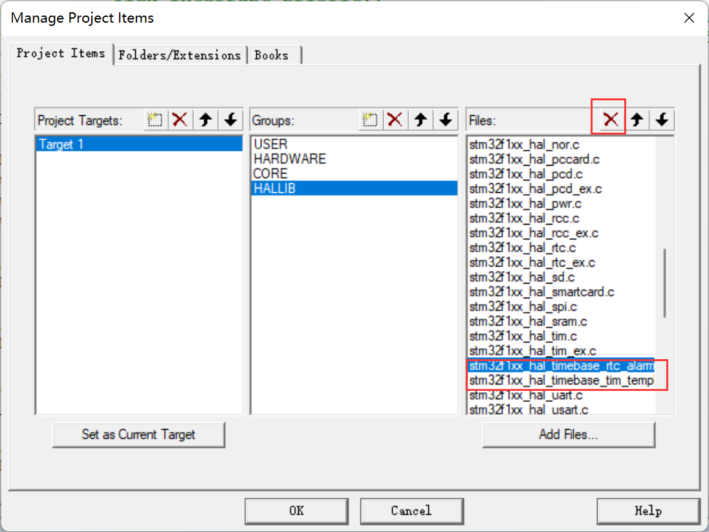

我们将这三个文件从工程中删除，然后重新编译工程，然后我们没啥意外的话，就可以得到一个0error 0warn的工程啦：


### 3. 报错解决

> 下面测试工程是标准库建立的工程。

#### 3.1 问题分析

使用V5版本编译器的MDK，按照上面的步骤就可以创建一个0 Error, 0 Warning的工程，但是，由于我装的版本太新，最终其他报错：

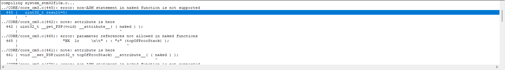

这都是库文件，理论上不应该有问题才对，从网上搜了一下，原来是编译器的问题，这里keil5.37之后使用了V6编译器：

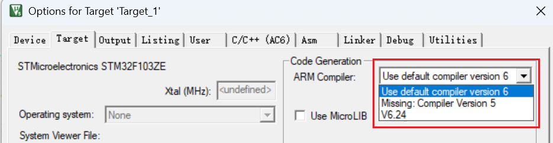

新版本编译器对于之前的标准库可能是有不兼容的地方，具体没有深究，这里需要安装一个V5版本编译器。

#### 3.2 编译器下载

而且keil5.37后没有自带 arm compiler v5版本的编译器，显示miss compiler version 5 ，可以自行在arm官网上下载v5版编译器，我们去官网搜索`ACOMP5`这个关键字，会找到这样一份文档：[Arm Compiler downloads index](https://developer.arm.com/documentation/ka005198/1-0?lang=en)，文档中就有不同编译器版本的下载链接


发现在官网下东西还是有点麻烦的，直接在网上找了个版本，下载完毕后解压：


直接双击安装，一路默认，我使用的是默认安装目录：

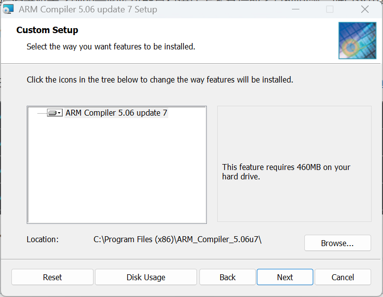

> **注意**：默认目录有坑，后面会提到，这里要安装到Keil的ARM文件夹中。

#### 3.3 keil配置

进入keil5软件界面，点击下图①位置的三个方块图标，在弹出页面中点击 Folders/Extensions，再点击③位置的三个小点，然后点击 Add another ARM Compiler Version to List...

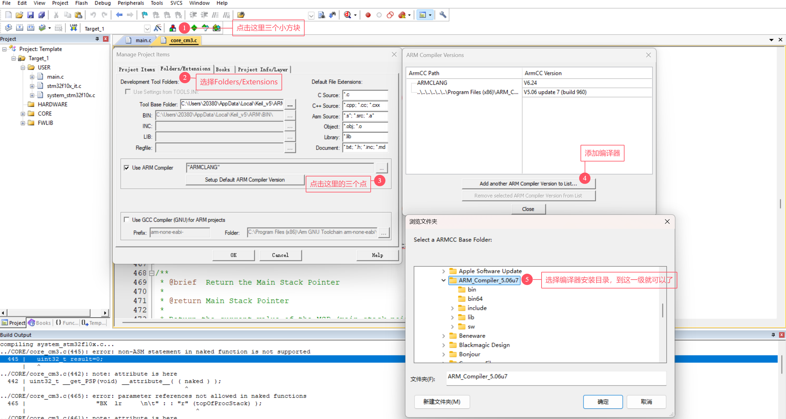

之后可以看到ARMCC Path中多了一条5.06版本ArmCC信息。最后在点击 “魔术棒”图标，进入Target页面，可以看到ARM Compiler的选择中多了Version 5，选择Version 5，点击ok

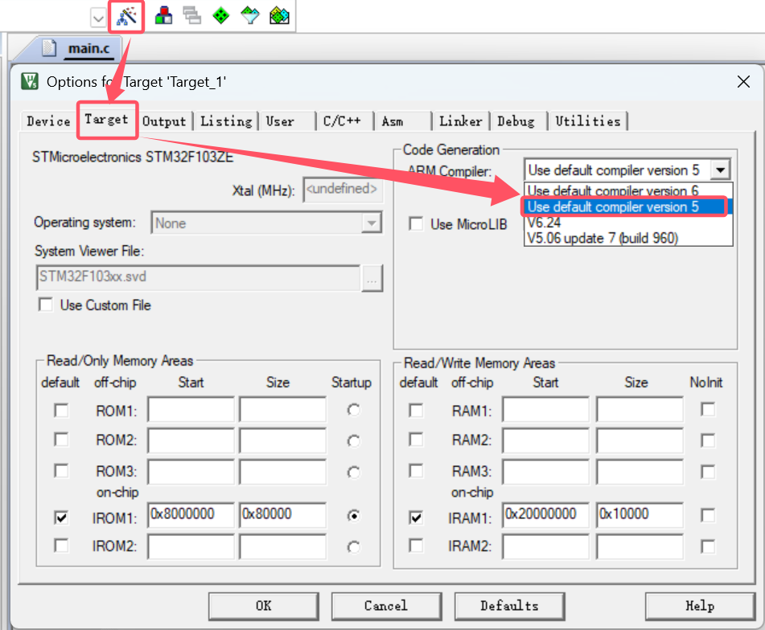

然后重新编译，这个时候，是不是觉得没问题了？其实呢，出现了更多报错：

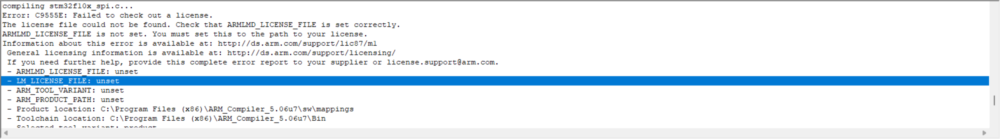

这是因为ARM编译器的安装目录需要安装在Keil的ARM文件夹中，所以这里卸载重装：


然后按照上面的方式重新配置，然后再编译，终于得到了一个0 Error(s), 0 Warning(s).的工程。

```bash
"..\OBJ\Template.axf" - 0 Error(s), 0 Warning(s).
```

### 4. 总结

得出一个结论：不要追求最新版本，不然真有的折腾了！！！

> 参考资料：
>
> [keil5.39版本报错：Start/core_cm3.c(445): error: non-ASM statement in naked function is not supported；-CSDN博客](https://blog.csdn.net/qq_45899177/article/details/135854420)
>
> [ARMLMD_LICENSE_FILE 错误解决方法 - STM32 NUCLEO - 一板网电子技术论坛](https://www.yiboard.com/thread-1922-1-1.html)
