<!-- more -->


## 一、编译过程

### 1. 编译过程简介

我们简单了解下MDK的编译过程，它与其它编译器的工作过程是类似的：

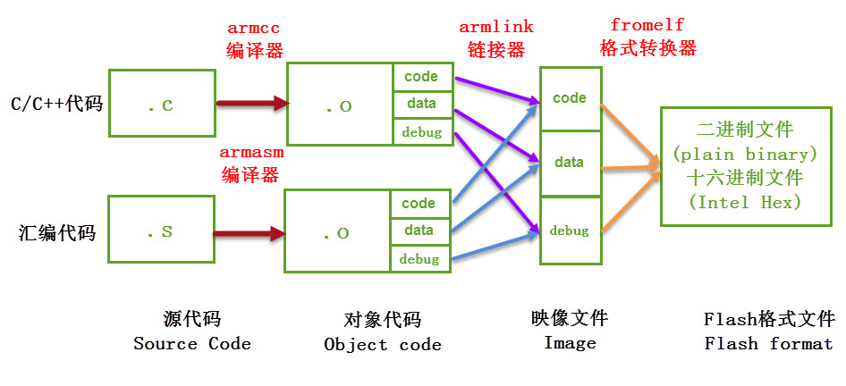

(1) 编译，MDK软件使用的编译器是 armcc 和 armasm ， 它们根据每个C/C++和汇编源文件编译成对应的以“ .o ”为后缀名的对象文件(Object Code，也称目标文件)， 其内容主要是从源文件编译得到的机器码，包含了代码、数据以及调试使用的信息；

(2) 链接， 链接器 armlink 把各个 .o 文件及库文件链接成一个映像文件“ .axf ”或“ .elf ”；

(3) 格式转换，一般来说 Windows 或 Linux 系统使用链接器直接生成可执行映像文件 elf 后，内核根据该文件的信息加载后， 就可以运行程序了，但在单片机平台上，需要把该文件的内容加载到芯片上， 所以还需要对链接器生成的 elf 映像文件利用格式转换器 fromelf 转换成“ .bin ”或“ .hex ”文件，交给下载器下载到芯片的 FLASH 或 ROM 中。

### 2. 具体过程

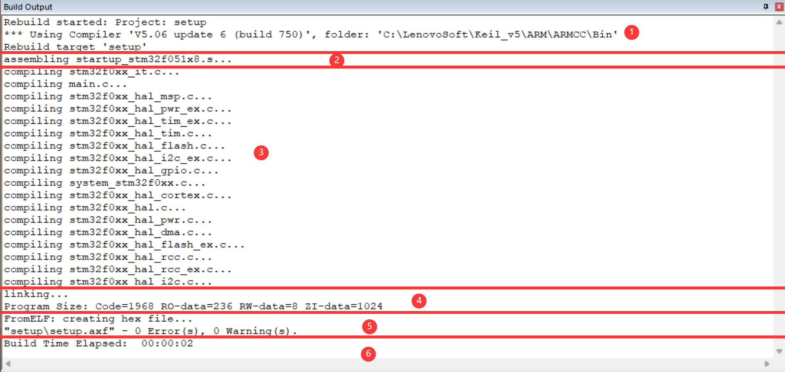

如上图所示，MDK编译工程的输出提示主要可以分为上边6个部分：

(1) 提示信息的第一部分说明构建过程调用的编译器。图中的编译器名字是“ V5.06 update 6 (build 750) ”，后面附带了该编译器所在的文件夹。 在电脑上打开该路径，可看到该编译器包含的各个编译工具，如armar、armasm、armcc、armlink及fromelf， 后面四个工具已在上一小节已讲解，而 armar 是用于把.o文件打包成lib文件的。

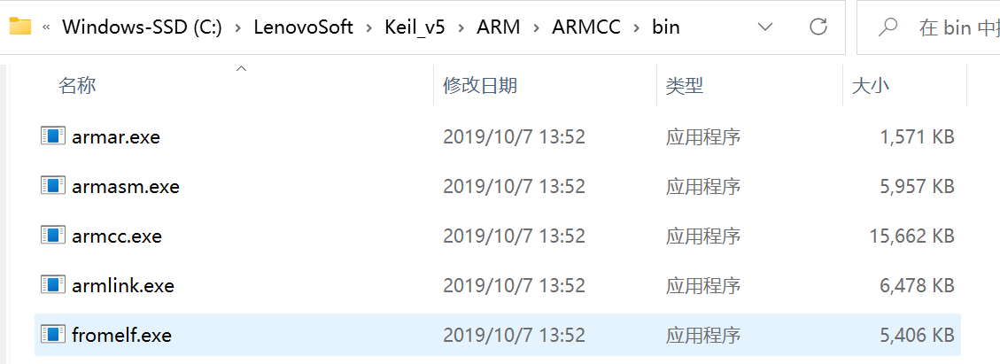

(2) 使用armasm编译汇编文件。图中列出了编译 startup 启动文件时的提示， 编译后每个汇编源文件都对应有一个独立的.o文件。

(3) 使用armcc编译c/c++文件。图中列出了工程中所有的c/c++文件的提示， 同样地，编译后每个c/c++源文件都对应有一个独立的.o文件。

(4) 使用armlink链接对象文件，根据程序的调用把各个.o文件的内容链接起来，最后生成程序的 axf 映像文件， 并附带程序各个域大小的说明，包括Code、RO-data、RW-data及ZI-data的大小。

(5) 使用 fromelf 生成下载格式文件，它根据axf映像文件转化成hex文件， 并列出编译过程出现的错误(Error)和警告(Warning)数量。

(6) 最后一段提示给出了整个构建过程消耗的时间。

构建完成后，可在工程的“Output”及“Listing”目录下找到由以上过程生成的各种文件：

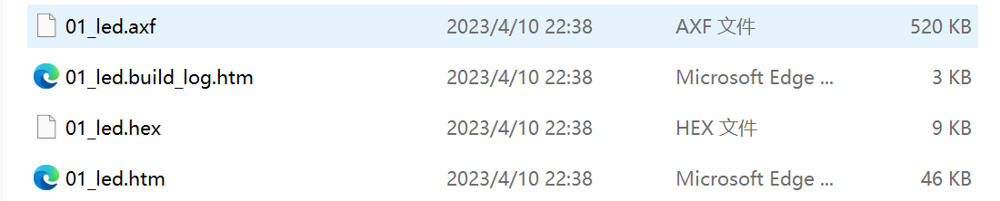

后边的文件省略，这里只列举部分文件，可以看到，每个C源文件都对应生成了.o、.d及.crf后缀的文件，还有一些额外的.dep、.hex、.axf、.htm、.lnp、.sct、.lst及.map文件。

## 二、编译工具链

前面编译过程中，MDK调用了各种编译工具，平时我们直接配置MDK，不需要学习如何使用它们，但了解它们是非常有好处的。例如， 若希望使用MDK编译生成bin文件的，需要在MDK中输入指令控制fromelf工具；在后面讲解AXF及O文件的时候，需要利用fromelf工具查看其文件信息， 这都是无法直接通过MDK做到的。关于这些工具链的说明，在MDK的帮助手册《ARM Development Tools》都有详细讲解， 点击MDK界面的“help->uVision Help”菜单可打开该文件。

### 1. 设置环境变量

用这些编译工具，需要用到Windows的命令行提示符工具，为了让命令行方便地找到这些工具，我们先把工具链的目录添加到系统的环境变量中。 查看本机工具链所在的具体目录可根据上一小节讲解的工程编译提示输出信息中找到，如本机的路径为“C:\\LenovoSoft\\Keil_v5\\ARM\\ARMCC\\bin”。

### 2. 添加路径到PATH环境变量

(1) 右键电脑系统的【此电脑】， 在弹出的菜单中选择“属性”

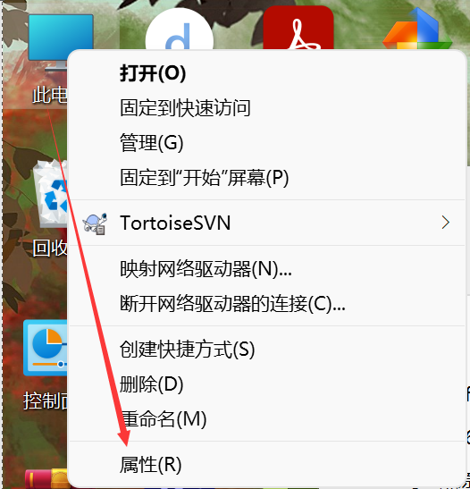

(2) 在弹出的属性页面依次点击【高级系统设置】&rarr;【环境变量】，在用户变量一栏中找到名为“PATH”的变量，若没有该变量， 则新建一个。编辑“PATH”变量，在它的变量值中输入工具链的路径，如本机的是“ C:\\LenovoSoft\\Keil_v5\\ARM\\ARMCC\\bin ”， 注意要使用“ 分号 ; ”让它与其它路径分隔开，输入完毕后依次点确定：

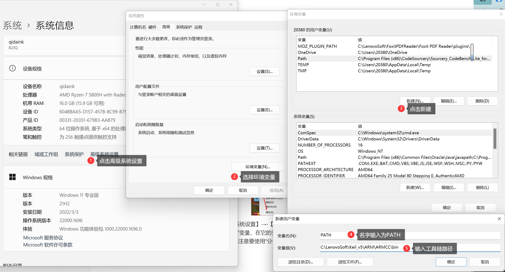

(3) 打开Windows的命令行。

(4) 在弹出的命令行窗口中输入“fromelf”回车，若窗口打印出formelf的帮助说明，那么路径正常，就可以开始后面的工作了； 若提示“不是内部名外部命令，也不是可运行的程序…”信息，说明路径不对，请重新配置环境变量，并确认该工作目录下有编译工具链。

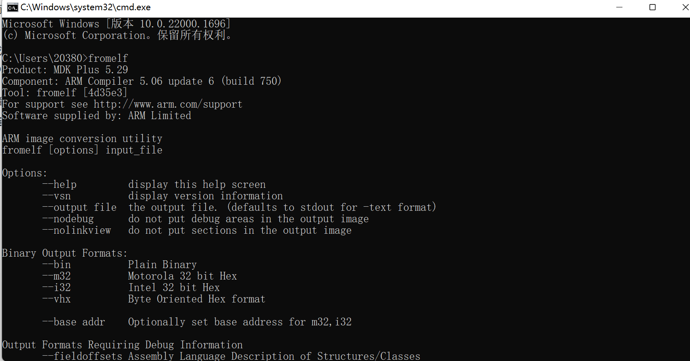

这个过程本质就是让命令行通过“PATH”路径找到“fromelf.exe”程序运行，默认运行“fromelf.exe”时它会输出自己的帮助信息， 这就是工具链的调用过程，MDK本质上也是如此调用工具链的，只是它集成为GUI，相对于命令行对用户更友好。

### 3. armcc、armasm及armlink

#### 3.1 armcc

armcc用于把c/c++文件编译成ARM指令代码，编译后会输出ELF格式的O文件(对象、目标文件)，在命令行中输入“armcc”回车可调用该工具， 它会打印帮助说明：

```shell
C:\Users\20380>armcc
Product: MDK Plus 5.29
Component: ARM Compiler 5.06 update 6 (build 750)
Tool: armcc [4d3637]
For support see http://www.arm.com/support
Software supplied by: ARM Limited

Usage:         armcc [options] file1 file2 ... filen
Main options:

--arm          Generate ARM code
--thumb        Generate Thumb code
--c90          Switch to C mode (default for .c files)
--cpp          Switch to C++ mode (default for .cpp files)
-O0            Minimum optimization
# 中间部分省略......
-D<symbol>     Define <symbol> on entry to the compiler
-g             Generate tables for high-level debugging
-I<directory>  Include <directory> on the #include search path
```

帮助提示中分三部分，第一部分是armcc版本信息，第二部分是命令的用法，第三部分是主要命令选项。

根据命令用法： armcc [options] file1 file2 …filen ， 在[option]位置可输入下面的“–arm”、“–cpu list”选项， 若选项带文件输入，则把文件名填充在file1 file2…的位置，这些文件一般是c/c++文件。

例如根据它的帮助说明，“–cpu list”可列出编译器支持的所有cpu，我们在命令行中输入“armcc –cpu list”， 可查看cpu列表：

```shell
C:\Users\20380>armcc -cpu list
Warning: C3910W: Old syntax, please use '--cpu'.
The following arguments to option 'cpu' can be selected:
 # ... ...
 --cpu=7-R
 --cpu=7-M
 --cpu=7E-M
 --cpu=7-A.security
 --cpu=ARM7EJ-S
 # 后边的省略... ...
```

打开MDK的Options for Targe&rarr;c/c++菜单，可看到MDK对编译器的控制命令：

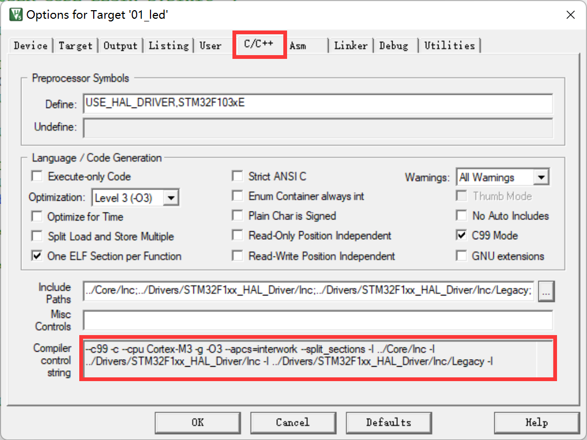

从该图中的命令可看到，它调用了-c、-cpu –D –g –O1等编译选项，当我们修改MDK的编译配置时，可看到该控制命令也会有相应的变化。 然而我们无法在该编译选项框中输入命令，只能通过MDK提供的选项修改。

了解这些，我们就可以查询具体的MDK编译选项的具体信息了，如c/c++选项中的“Optimization：Leve 1（-O1）”是什么功能呢？ 首先可了解到它是“-O”命令，命令后还带个数字，查看MDK的帮助手册（【help】&rarr;【uVision help】），在armcc编译器说明章节：

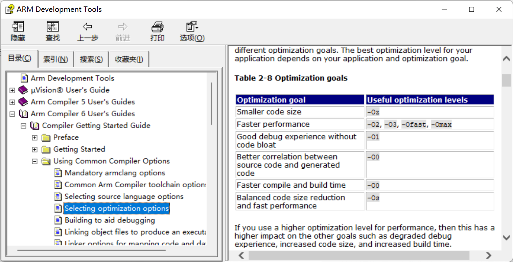

利用MDK，我们一般不需要自己调用armcc工具，但经过这样的过程我们就会对MDK有更深入的认识。

#### 3.2 armasm

armasm 是汇编器，它把汇编文件编译成O文件。与armcc类似， MDK对armasm的调用选项可在“Option for Target&rarr;Asm”页面进行配置：

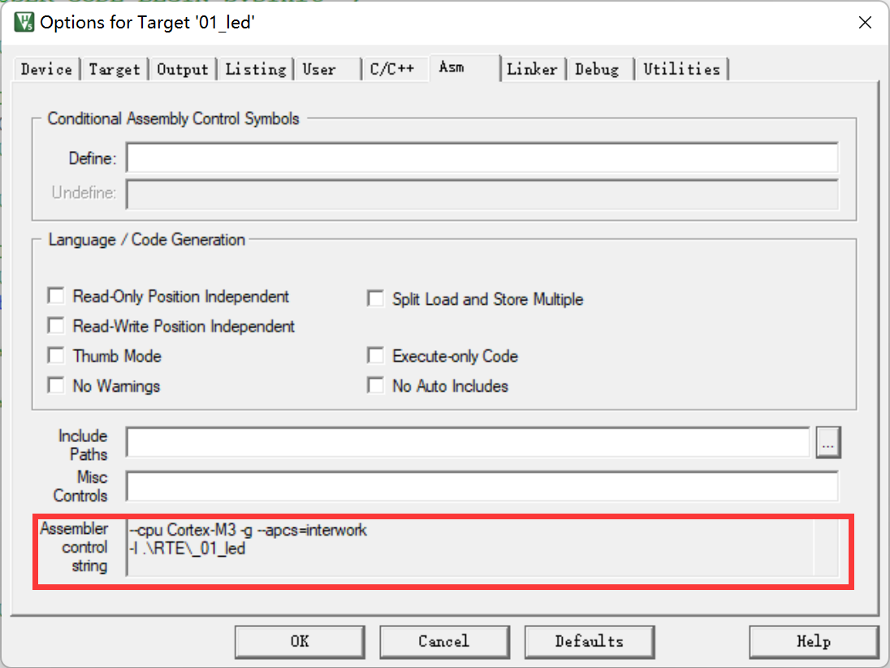

#### 3.3 armlink

armlink是链接器，它把各个O文件链接组合在一起生成ELF格式的AXF文件，AXF文件是可执行的，下载器把该文件中的指令代码下载到芯片后， 该芯片就能运行程序了；利用armlink还可以控制程序存储到指定的ROM或RAM地址。 在MDK中可在“Option for Target&rarr;Linker”页面配置armlink选项：

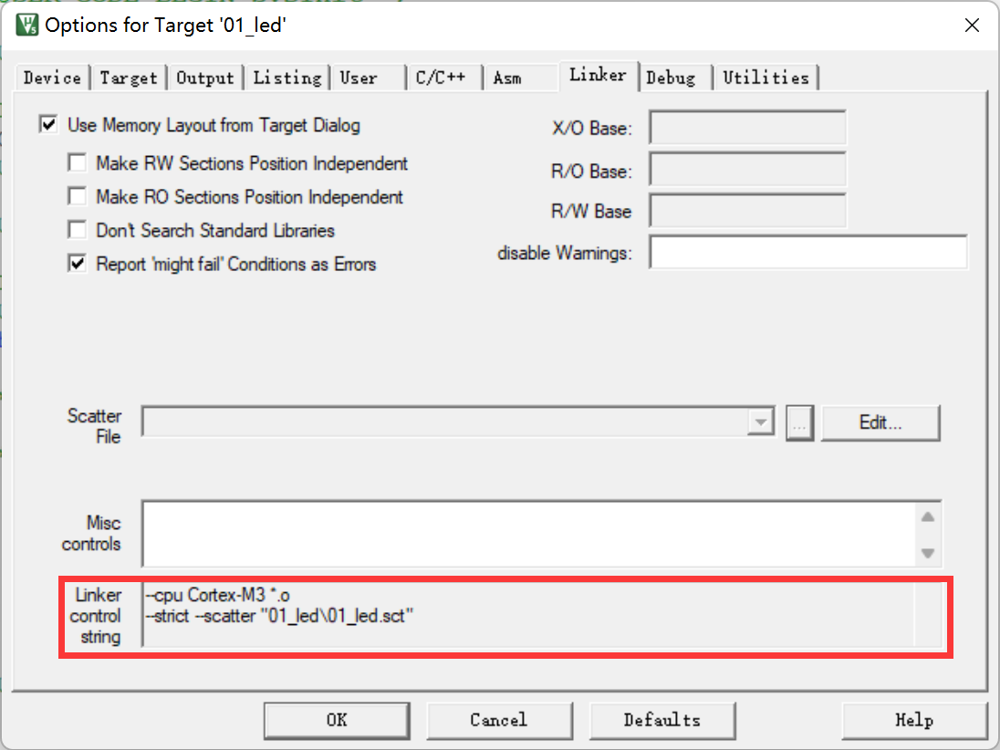

链接器默认是根据芯片类型的存储器分布来生成程序的，该存储器分布被记录在工程里的sct后缀的文件中，有特殊需要的话可自行编辑该文件， 改变链接器的链接方式。

### 4. armar、fromelf及用户指令

armar工具用于把工程打包成库文件，fromelf可根据axf文件生成hex、bin文件，hex和bin文件是大多数下载器支持的下载文件格式。

在MDK中，针对armar和fromelf工具的选项几乎没有，仅集成了生成HEX或Lib的选项：

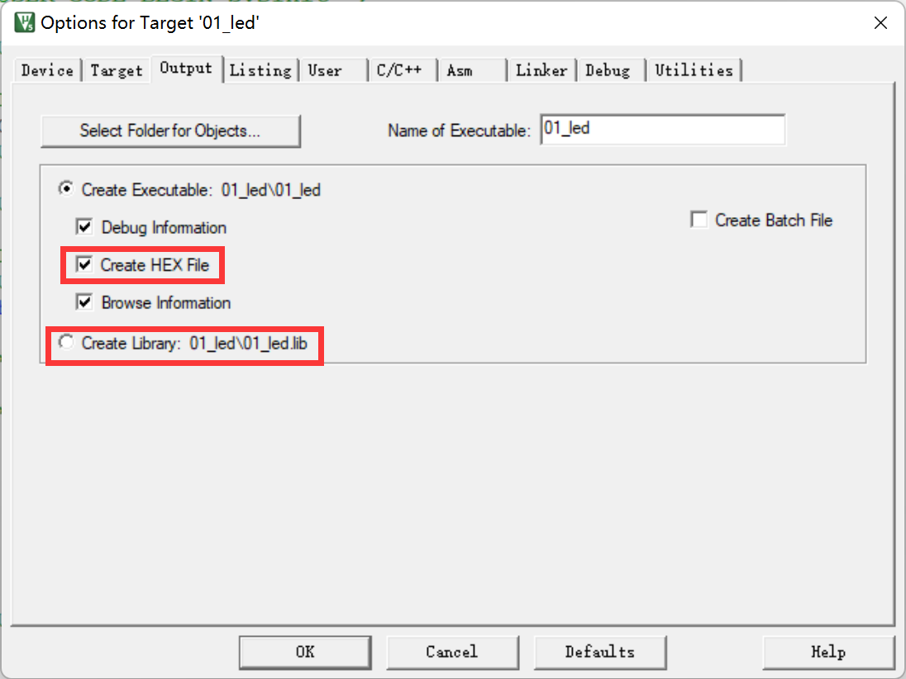

例如如果我们想利用fromelf生成bin文件，可以在MDK的“【Option for Target】&rarr;【User】”页中添加调用fromelf的指令：

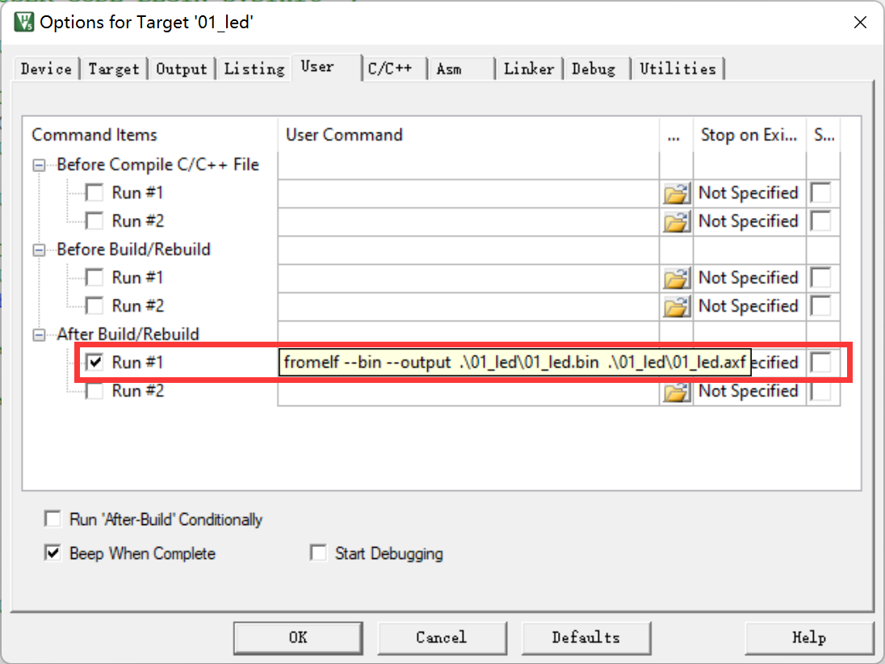

在User配置页面中，提供了三种类型的用户指令输入框，在不同组的框输入指令， 可控制指令的执行时间，分别是编译前 (Before Compile c/c++ file )、 构建前( Before Build/Rebuild )及构建后( AfterBuild/Rebuild )执行。 这些指令并没有限制必须是arm的编译工具链，例如如果自己编写了python脚本， 也可以在这里输入用户指令执行该脚本。

图中的生成bin文件指令调用了 fromelf 工具，紧跟后面的是工具的选项及输出文件名、输入文件名。由于fromelf是根据 axf 文件生成 bin 的， 而 axf 文件又是构建(build)工程后才生成，所以我们把该指令放到“ After Build/Rebuild ”一栏。这里的路径应该是以**工程所在目录为起点**。

当我们重新编译工程，便会调用这条命令：

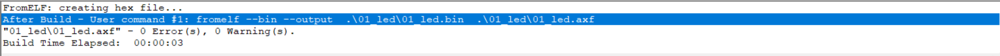

然后我们便会在对应的目录下生成bin文件：

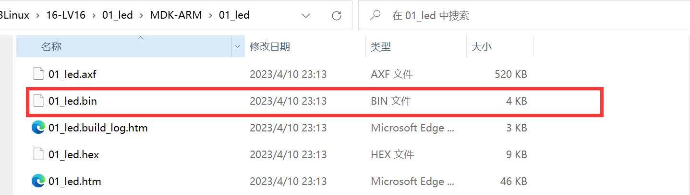

## 三、程序的组成、存储与运行

### 1. C/C++ 程序编译后的存储数据段

6个储存数据段和3个

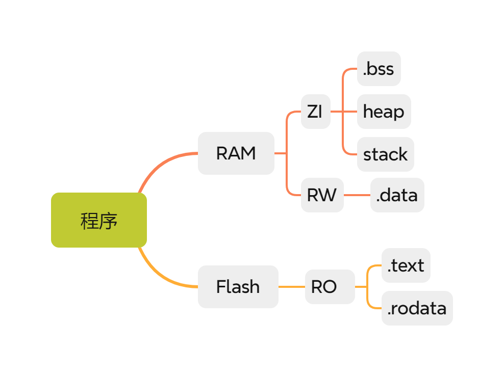

#### 1.1 6个储存数据段

##### 1.1.1 哪6个段？

先来了解一下6个储存数据段的概念，借用一张图：

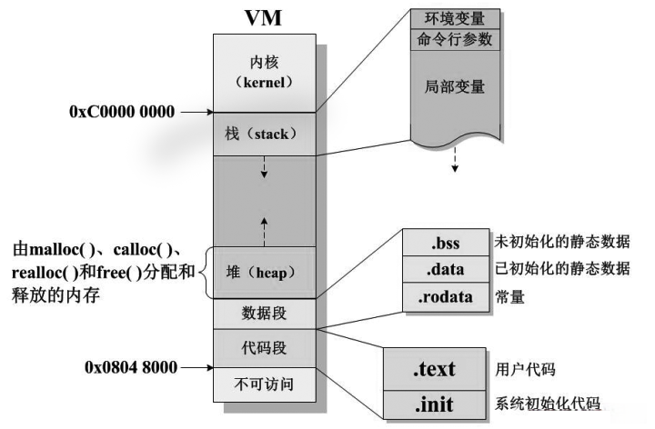

这张图是程序在虚拟内存（VM, Virtual Memory）中的典型布局结构，呈现了内存空间的划分方式及各区域的功能。单片机的程序在内存中也大概就是这几种段：

- **.data**：数据段，储存已初始化且不为0的全局变量和静态变量（全局静态变量和局部静态变量）。static声明的变量放在data段。数据段属于静态内存分配，所以放在RAM里，准确来说，是在程序运行的时候需要在RAM中运行。

- **.BSS**：Block Started by Symbol。储存未初始化的，或初始化为0的全局变量和静态变量。BSS段属于静态内存分配，所以放在RAM里。

- **.text（CodeSegment/Text Segment）**：代码段，储存程序代码。也就是存放CPU执行的机器指令(machineinstructions)。这部分区域的大小在程序运行前就已经确定，并且内存区域通常属于只读(某些架构也允许代码段为可写，即允许修改程序)。在代码段中，也有可能包含一些只读的常数变量，例如字符串常量等。一般会放在Flash里。

- **.rodata**：储存只读常量。const修饰的常量，不管是在局部还是全局放在Flash 里。所以为了节省 RAM，把常量的字符串，数据等 用const声明。

- **heap**（堆）：堆是用于存放进程运行中被动态分配的内存段。他的大小并不固定，可动态扩张或者缩减，由程序员使用malloc()和free()函数进行分配和释放。当调用malloc等函数分配内存时，新分配的内存就被动态添加到堆上（堆被扩张）；当利用free等函数释放内存时，被释放的内存从堆中被剔除（堆被缩减）。放在RAM里，其可用大小定义在启动文件startup_stm32fxx.s中。
- **stack**（栈）：栈又称堆栈，是用户存放程序临时创建的局部变量，由系统自动分配和释放。可存放局部变量、函数的参数和返回值（但不包括static声明的变量，static意味着 放在 data 数据段中）。除此以外，在函数被调用时，其参数也会被压入发起调用的进程栈中，并且待到调用结束后，函数的返回值也会被存放回栈中。**后进先出（LIFO, Last In First Out）**，即最后入栈元素先出栈。所以栈特别方便用来保存/恢复调用现场。从这个意义上讲，我们可以把堆栈看成一个寄存、交换临时数据的内存区。放在RAM里，其大小定义在启动文件startup_stm32fxx.s中。

##### 1.1.2 一个示例

下面是一个实例：

```c
//hello.c
#include <stdio.h>

int globe_var1 = 10;
int globe_var2;
static int globe_static_var1 = 20;
static int globe_static_var2;
const int globe_const_var = 30;

void func(int i)
{
    printf("%d\n", i);
}

int main()
{
    static int static_var1 = 70;
    static int static_var2;
    const int const_var = 40;
    int var1 = 30;
    int var2;
    
    var2 = globe_var1 + globe_static_var1 + globe_const_var + static_var1 + const_var + var1;
    func(var2);
    return 0;
}
```


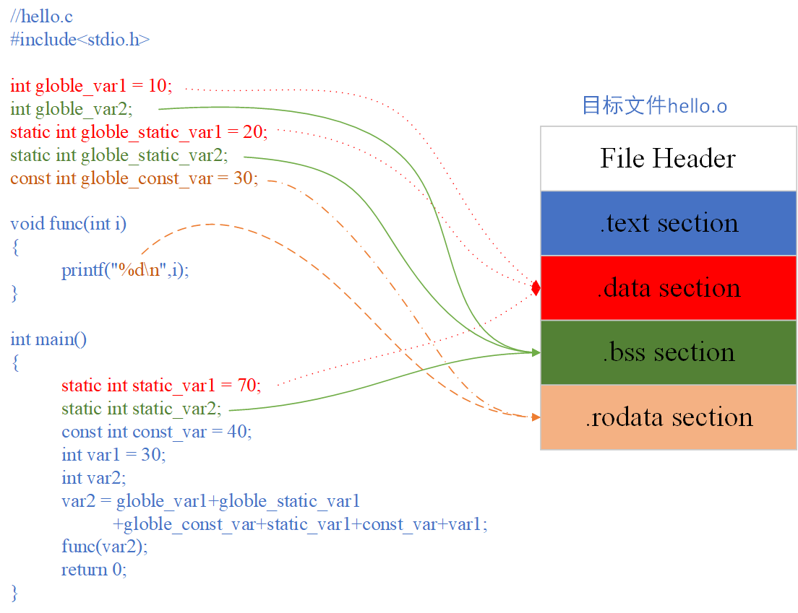

- 为什么把程序的“ 代码段 ”和“ 数据段 ”分开存放?

（1）当程序被装载后，数据和指令分别被映射到两个虚拟内存区域。数据段对进程来讲是可读写的，而代码段对进程来说是只读的，所以这两个虚拟内存区域的权限可以被分别设置为可读写和只读，防止程序的指令被有意和无意地改写。

（2）现代CPU的缓存一般被设计成数据缓存和指令缓存分离，程序的指令和数据被分开存放对CPU的缓存命中率提高有好处。

（3）当系统中运行着多个该程序的副本时，例如多个线程同时都运行同一个程序，它们的代码段指令都是一样的，所以内存中只需要保存一份该程序的代码段，然后将每个副本进程的数据段区域分来，这样可以节省大量空间。

- 为什么数据段还需要分" .data “、” .bss “、” .rodata "这么麻烦？有什么区别？主要根据两个维度进行区分，**是否占内存空间**、**读写权限**。

已经初始化的全局变量和局部静态变量都保存在" .data “段。未初始化的全局变量和局部静态变量一般都放在” .bss "段，因为未初始化的变量默认值为0，本来它们也可以放在.data段，但是因为它们都是0，所以为它们在.data段分配空间并且存放数据0是没有必要的。

" .data"段和" .bss “段都是可读写的数据段，而” .rodata “存放的是只读数据，主要是一些const变量和字符串常量。单独设立” .radata “段的好处是，在程序加载的时候可以将” .rodata “段的属性映射成只读，这样对这个段的任何修改操作都作为非法操作处理。另外在某些平台还可以将” .rodata "段存放在只读存储器，例如ROM，通过硬件保证只读。

所以如果通过命令objdump查看各个段的大小发现，.data段大小为12字节，正好是变量globle_var1、globle_static_var1、static_var1的大小。但是.bss段的大小为8个字节，并不是变量globle_var2、globle_static_var2、static_var2变量的大小，可以看出.bss并没有为变量分配内存。

所以如果通过命令objdump查看各个段的大小发现，.data段大小为12字节，正好是变量globle_var1、globle_static_var1、static_var1的大小。但是.bss段的大小为8个字节，并不是变量globle_var2、globle_static_var2、static_var2变量的大小，可以看出.bss并没有为变量分配内存。我们可以现在linux下编译然后查看：

```bash
lubancat@lubancat-vm:~/test$ gcc hello.c 
lubancat@lubancat-vm:~/test$ gcc -c hello.c -o hello.o
lubancat@lubancat-vm:~/test$ objdump -x -s -d hello.o

hello.o：     文件格式 elf64-x86-64
hello.o
体系结构：i386:x86-64， 标志 0x00000011：
HAS_RELOC, HAS_SYMS
起始地址 0x0000000000000000

节：
Idx Name          Size      VMA               LMA               File off  Algn
  0 .text         0000007d  0000000000000000  0000000000000000  00000040  2**0
                  CONTENTS, ALLOC, LOAD, RELOC, READONLY, CODE
  1 .data         0000000c  0000000000000000  0000000000000000  000000c0  2**2
                  CONTENTS, ALLOC, LOAD, DATA
  2 .bss          00000008  0000000000000000  0000000000000000  000000cc  2**2
                  ALLOC
  3 .rodata       00000008  0000000000000000  0000000000000000  000000cc  2**2
                  CONTENTS, ALLOC, LOAD, READONLY, DATA
  4 .comment      0000002c  0000000000000000  0000000000000000  000000d4  2**0
                  CONTENTS, READONLY
  5 .note.GNU-stack 00000000  0000000000000000  0000000000000000  00000100  2**0
                  CONTENTS, READONLY
  6 .note.gnu.property 00000020  0000000000000000  0000000000000000  00000100  2**3
                  CONTENTS, ALLOC, LOAD, READONLY, DATA
  7 .eh_frame     00000058  0000000000000000  0000000000000000  00000120  2**3
                  CONTENTS, ALLOC, LOAD, RELOC, READONLY, DATA
```

#### 1.2 3种存储属性区

**RO、RW、ZI** 是嵌入式系统和编译链接过程中常用的术语，用于描述程序内存的分布情况：

- RO（Read-Only）：只读区域，包括程序代码和只读数据。对应上面的`.text`段和`.rodata`段。

- RW（Read-Write）：可读可写区域，包括已初始化的全局变量和静态变量。对应上面的`.data`段。

- ZI（Zero-Initialized）：零初始化区域，包括未初始化的全局变量和静态变量，不占用ROM空间（只记录大小信息）。对应上面的`.bss`段。另外, 可翻看Keil工具编译的map文件，Heap和Stack区也进行了Zero的属性标注, 因此，Heap和Stack也可认为是ZI区域。

#### 1.3 总结

RO、RW、ZI 是从**访问权限**和**初始化状态**角度对程序数据的分类，而 `.text`、`.data`、`.bss` 等是具体的**存储段实现**。二者的对应关系本质是：

- 编译时，编译器将代码和数据按 RO/RW/ZI 特性分配到不同存储段；
- 链接和加载时，系统根据存储段类型决定其在存储器（Flash/RAM）中的位置，确保程序正确运行。

### 2. CODE、RO、RW、ZI Data域及堆栈空间

在工程的编译提示输出信息中有一个语句：

```shell
Program Size：Code=xx RO-data=xx RW-data=xx ZI-data=xx
```

它说明了程序各个域的大小，编译后，应用程序中所有具有同一性质的数据(包括代码)被归到一个域，程序在存储或运行的时候， 不同的域会呈现不同的状态，这些域的意义如下：

- Code：即代码域，对应.text 段，它指的是编译器生成的机器指令，这些内容被存储到ROM区。一般就是Flash，需要占用flash空间。
- RO-data：Read Only data，即只读数据域，对应.rodata段，它指程序中用到的只读数据，这些数据被存储在ROM区，因而程序不能修改其内容。 例如C语言中const关键字定义的变量就是典型的RO-data。放在flash里面，需要占用flash空间。
- RW-data：Read Write data，即可读写数据域，对应.data段，它指初始化为“非0值”的可读写数据，程序刚运行时，这些数据具有非0的初始值， 且运行的时候它们会常驻在RAM区，因而应用程序可以修改其内容。例如C语言中使用定义的全局变量，且定义时赋予“非0值”给该变量进行初始化。需要在 RAM里面运行，但是**起初需要保存在 Flash里面，程序运行后复制到 RAM里面运行**，需要占用Flash空间。
- ZI-data：Zero Initialie data，即0初始化数据，对应.bss段，它指初始化为“0值”的可读写数据域， 它与RW-data的区别是程序刚运行时这些数据初始值全都为0， 而后续运行过程与RW-data的性质一样，它们也常驻在RAM区，因而应用程序可以更改其内容。例如C语言中使用定义的全局变量， 且定义时赋予“0值”给该变量进行初始化(若定义该变量时没有赋予初始值，编译器会把它当ZI-data来对待，初始化为0)。ZI的数据全部是0，没必要开始就包含，只要程序运行之前将ZI数据所在的区域（RAM里面）一律清 0，不占用Flash，运行时候占用RAM。
- ZI-data的栈空间(Stack)及堆空间(Heap)：在C语言中，函数内部定义的局部变量属于栈空间，进入函数的时候从向栈空间申请内存给局部变量， 退出时释放局部变量，归还内存空间。而使用malloc动态分配的变量属于堆空间。在程序中的栈空间和堆空间都是属于ZI-data区域的， 这些空间都会被初始值化为0值。编译器给出的ZI-data占用的空间值中包含了堆栈的大小(经实际测试，若程序中完全没有使用malloc动态申请堆空间， 编译器会优化，不把堆空间计算在内)。

综上所述，以程序的组成构件为例，它们所属的区域类别：

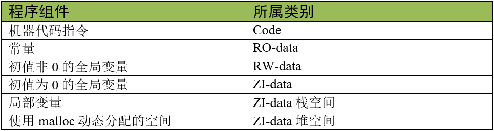

### 2. 程序的存储与运行

RW-data和ZI-data它们仅仅是初始值不一样而已，为什么编译器非要把它们区分开？这就涉及到程序的存储状态了，应用程序具有静止状态和运行状态。

静止态的程序被存储在非易失存储器中，如STM32的内部FLASH，因而系统掉电后也能正常保存。但是当程序在运行状态的时候，程序常常需要修改一些暂存数据， 由于运行速度的要求，这些数据往往存放在内存中(RAM)，掉电后这些数据会丢失。因此，程序在静止与运行的时候它在存储器中的表现是不一样的，如下图：


| 类别 | 包含的存储段       | 存储内容示例                                                 |
| ---- | ------------------ | ------------------------------------------------------------ |
| RO   | `.text`、`.rodata` | - `.text`：函数代码（如 `func()`、`main()` 的指令）- `.rodata`：只读常量（如 `const int globe_const_var = 30`） |
| RW   | `.data`            | 已初始化且非零的全局变量 / 静态变量（如 `int globe_var1 = 10`、`static int static_var1 = 70`） |
| ZI   | `.bss`             | 未初始化或初始化为 0 的全局变量 / 静态变量（如 `int globe_var2`、`static int static_var2`、`static int x = 0`） |

图中的左侧是应用程序的存储状态，右侧是运行状态，而上方是RAM存储器区域，下方是ROM存储器区域。

程序在存储状态时，RO节(RO section)及RW节都被保存在ROM区。当程序开始运行时，内核直接从ROM中读取代码，并且在执行主体代码前， 会先执行一段加载代码，它把RW节数据从ROM复制到RAM， 并且在RAM加入ZI节，ZI节的数据都被初始化为0。加载完后RAM区准备完毕，正式开始执行主体程序。

编译生成的RW-data的数据属于图中的RW节，ZI-data的数据属于图中的ZI节。**是否需要掉电保存，这就是把RW-data与ZI-data区别开来的原因**， 因为在RAM创建数据的时候，默认值为0，但如果有的数据要求初值非0，那就需要使用ROM记录该初始值，**运行时再复制到RAM**。

STM32的RO区域不需要加载到SRAM，内核直接从FLASH读取指令运行。计算机系统的应用程序运行过程很类似，不过计算机系统的程序在存储状态时位于硬盘， 执行的时候甚至会把上述的RO区域(代码、只读数据)加载到内存，加快运行速度，还有虚拟内存管理单元(MMU)辅助加载数据， 使得可以运行比物理内存还大的应用程序。而STM32没有MMU，所以无法支持Linux和Windows系统。

当程序存储到STM32芯片的内部FLASH时(即ROM区)，它占用的空间是Code、RO-data及RW-data的总和，所以如果这些内容比STM32芯片的FLASH空间大， 程序就无法被正常保存了。当程序在执行的时候，需要占用内部SRAM空间(即RAM区)，占用的空间包括RW-data和ZI-data。 应用程序在各个状态时各区域的组成如下表：


> **Code** + **RO data** + **RW data** 的大小也是生成的 **bin** 文件的大小。

在MDK中，我们建立的工程一般会选择芯片型号，选择后就有确定的FLASH及SRAM大小，若代码超出了芯片的存储器的极限， 编译器会提示错误，这时就需要裁剪程序了，裁剪时可针对超出的区域来优化。

> 参考资料：
>
> [STM32的内存管理相关（内存架构，内存管理，map文件分析）-云社区-华为云](https://bbs.huaweicloud.com/blogs/375342)
>
> [STM32内存结构介绍，FreeRTOS内存分配技巧，Stack_Size和Heap_Size大小设置_heap size stack size-CSDN博客](https://blog.csdn.net/xingqingly/article/details/120260398)
>
> [两种存储器，三种内存大小，六段段_6个储存数据段和3种储存属性区-CSDN博客](https://blog.csdn.net/DZRYWYBL/article/details/125703009)
>
> [实例说明代码段(.text)、数据段(.data)、bss段、只读数据段(.rodata)、堆栈的划分依据_rodata 和rosdata-CSDN博客](https://blog.csdn.net/freee12/article/details/108809947)
