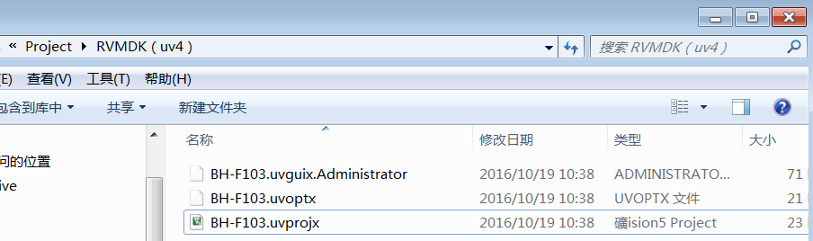
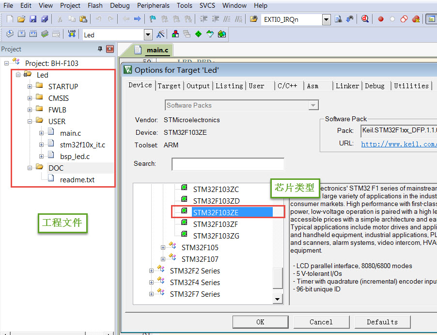
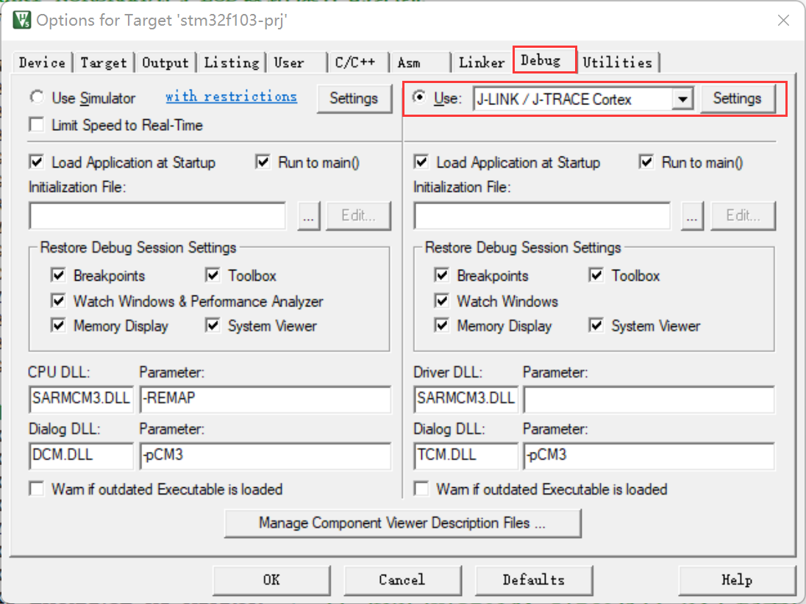
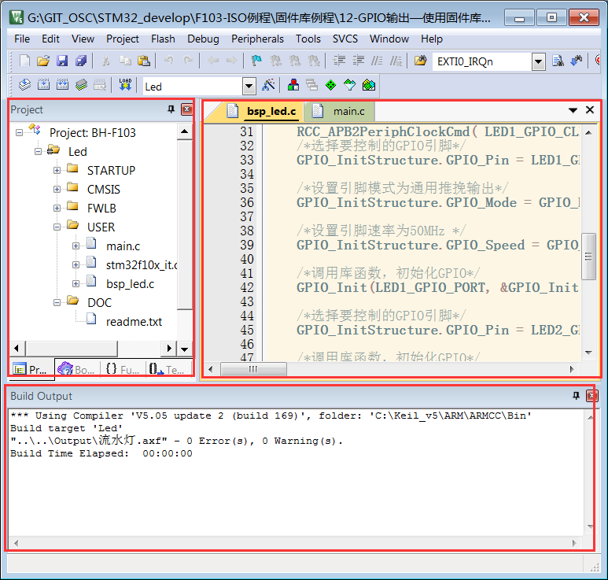
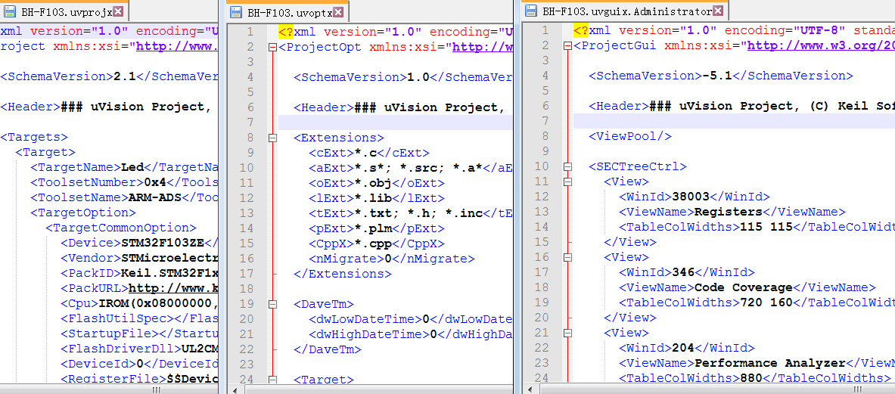

<!-- more -->

本篇笔记主要是参考的野火的文档。使用的工程呢可以去这里下载：[ebf_stm32f103_badao_std_code: 野火STM32F103 霸道开发板 标准库教程配套代码 (gitee.com)](https://gitee.com/Embedfire-stm32f103-badao/ebf_stm32f103_badao_std_code)

> 链接: [程序](https://pan.baidu.com/s/1Uq_kTrjQWxPYFQ00HoxN1Q?pwd=gryg) 提取码: gryg 

## 一、MDK工程文件类型

### 1. Project工程文件

<table>
    <tbody>
        <tr><td align="left">后缀</td><td align="left">说明</td></tr>
        <tr><td align="left">.uvguix</td><td align="left">MDK5工程的窗口布局文件，在MDK4中*.UVGUI后缀的文件功能相同</td></tr>
        <tr><td align="left">.uvprojx</td><td align="left">MDK5的工程文件，它使用了XML格式记录了工程结构，双击它可以打开整个工程，在MDK4中*.UVPROJ后缀的文件功能相同</td></tr>
        <tr><td align="left">.uvoptx</td><td align="left">MDK5的工程配置选项，包含debugger、trace configuration、breakpooints以及当前打开的文件，在MDK4中*.UVOPT后缀的文件功能相同</td></tr>
        <tr><td align="left">.ini</td><td align="left">某些下载器的配置记录文件</td></tr>
    </tbody>
</table>

### 2. 源文件

<table>
    <tbody>
        <tr><td align="left">后缀</td><td align="left">说明</td></tr>
        <tr><td align="left">.c</td><td align="left">C语言源文件</td></tr>
        <tr><td align="left">.cpp</td><td align="left">C++语言源文件</td></tr>
        <tr><td align="left">.h</td><td align="left">C/C++的头文件</td></tr>
        <tr><td align="left">.s</td><td align="left">汇编语言的源文件</td></tr>
        <tr><td align="left">.inc</td><td align="left">汇编语言的头文件(使用“$include”来包含)</td></tr>
    </tbody>
</table>

### 3. Output目录

<table>
	<tbody>
		<tr><td align="left">后缀</td><td align="left">说明</td></tr>
		<tr><td align="left">.dep</td><td align="left">整个工程的依赖文件</td></tr>
		<tr><td align="left">.d</td><td align="left">描述了对应.o的依赖的文件</td></tr>
		<tr><td align="left">.crf</td><td align="left">交叉引用文件，包含了浏览信息(定义、引用及标识符)</td></tr>
		<tr><td align="left">.o</td><td align="left">可重定位的对象文件(目标文件)</td></tr>
		<tr><td align="left">.bin</td><td align="left">二进制格式的映像文件，是纯粹的FLASH映像，不含任何额外信息</td></tr>
		<tr><td align="left">.hex</td><td align="left">Intel Hex格式的映像文件，可理解为带存储地址描述格式的bin文件 </td></tr>
		<tr><td align="left">.elf</td><td align="left">由GCC编译生成的文件，功能跟axf文件一样，该文件不可重定位</td></tr>
		<tr><td align="left">.axf</td><td align="left">由ARMCC编译生成的可执行对象文件，可用于调试，该文件不可重定位</td></tr>
		<tr><td align="left">.sct</td><td align="left">链接器控制文件(分散加载)</td></tr>
		<tr><td align="left">.scr</td><td align="left">链接器产生的分散加载文件</td></tr>
		<tr><td align="left">.lnp</td><td align="left">MDK生成的链接输入文件，用于调用链接器时的命令输入</td></tr>
		<tr><td align="left">.htm</td><td align="left">链接器生成的静态调用图文件</td></tr>
		<tr><td align="left">.build_log.htm</td><td align="left">构建工程的日志记录文件</td></tr>
	</tbody>
</table>

### 4. Listing目录

<table>
	<tbody>
		<tr><td align="left">后缀</td><td align="left">说明</td></tr>
		<tr><td align="left">.lst</td><td align="left">C及汇编编译器产生的列表文件</td></tr>
		<tr><td align="left">.map</td><td align="left">链接器生成的列表文件，包含存储器映像分布</td></tr>
		<tr><td align="left">.ini</td><td align="left">仿真、下载器的脚本文件</td></tr>
		<tr><td align="left">其它</td><td align="left"></td></tr>
	</tbody>
</table>

## 二、Project工程文件

uvprojx、 uvoptx 及 uvguix 都是使用 XML 格式记录的文件，若使用记事本打开可以看到 XML 代码。而当使用 MDK 软件打开时，它根据这些文件的 XML 记录加载工程的各种参数，使得我们每次重新打开工程时，都能恢复上一次的工作环境。

### 1. uvprojx 文件 

uvprojx 文件就是我们平时双击打开的工程文件，它记录了整个工程的结构，如芯片类型、工程包含了哪些源文件等内容 。

### 2. uvoptx 文件

uvoptx 文件记录了工程的配置选项，如下载器的类型、变量跟踪配置、断点位置以及当前已打开的文件等等 。

### 3. uvguix 文件 

uvguix 文件记录了 MDK 软件的 GUI 布局，如代码编辑区窗口的大小、编译输出提示窗口的位置等等。  

### 4. 总结

这些工程参数都是当 MDK 正常退出时才会被写入保存，所以若 MDK 错误退出时 (如使用 Windows 的任务管理器强制关闭)，工程配置参数的最新更改是不会被记录的，重新打开工程时要再次配置。其中 uvprojx 文件是最重要的，删掉它我们就无法再正常打开工程了，而 uvoptx 及 uvguix 文件并不是必须的，可以删除，重新使用 MDK 打开 uvprojx工程文件后，会以默认参数重新创建 uvoptx 及 uvguix 文件。 (所以当使用 Git/SVN 等代码管理的时候，往往只保留 uvprojx 文件)    。

vprojx、uvoptx及uvguix都是使用XML格式记录的文件，若使用记事本打开可以看到XML代码， 而当使用MDK软件打开时，它根据这些文件的XML记录加载工程的各种参数，使得我们每次重新打开工程时，都能恢复上一次的工作环境。

## 三、源文件

源文件是工程中我们最熟悉的内容了，它们就是我们编写的各种源代码，MDK支持c、cpp、h、s、inc类型的源代码文件， 其中c、cpp分别是c/c++语言的源代码，h是它们的头文件，s是汇编文件，inc是汇编文件的头文件，可使用“$include”语法包含。 编译器根据工程中的源文件最终生成机器码。

## 四、Output目录下文件

参考 [01-开发工具/01-keil/LV016-Output目录文件.md](/sdoc/dev-tool/keil/126b091384f9220a0ff9cf1d)

## 五、Listing目录下文件

参考 [01-开发工具/01-keil/LV017-Listing目录文件.md](/sdoc/dev-tool/keil/126b0913865605b5493dc70e)

> 参考资料：
>
> [STM32的内存管理相关（内存架构，内存管理，map文件分析）-云社区-华为云](https://bbs.huaweicloud.com/blogs/375342)
>
> [46. MDK的编译过程及文件类型全解](https://doc.embedfire.com/mcu/stm32/f103badao/std/zh/latest/book/MDK.html)
