<!-- more -->

本篇笔记主要是参考的野火的文档。使用的工程呢可以去这里下载：[ebf_stm32f103_badao_std_code: 野火STM32F103 霸道开发板 标准库教程配套代码 (gitee.com)](https://gitee.com/Embedfire-stm32f103-badao/ebf_stm32f103_badao_std_code)

> 链接: [程序](https://pan.baidu.com/s/1Uq_kTrjQWxPYFQ00HoxN1Q?pwd=gryg) 提取码: gryg 

## 一、Output目录位置选择

Output目录是存放输出文件以及一些中间文件的目录，这个目录是可以配置的：

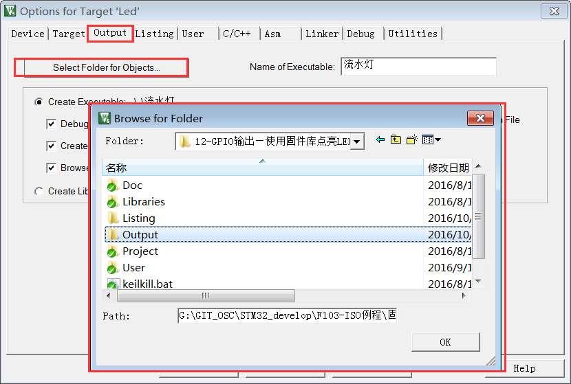

点击 MDK 中的编译按钮，它会根据工程的配置及工程中的源文件输出各种对象和列表文件，在工程的“【Options for Targe】&rarr;【Output】&rarr;【Select Folder for Objects】”中配置输出目录的位置。

## 二、lib库文件

上边好像没有列出，但是可能会用到。在某些情况，我们希望提供给第三方一个可用的代码库，但不希望对方看到源码，这个时候我们就可以把工程生成lib文件(Library file)提供给对方，在MDK中可配置【Options for Target】&rarr;【Create Library】选项把工程编译成库文件，


工程中生成可执行文件或库文件只能二选一，默认编译是生成可执行文件的，可执行文件即我们下载到芯片上直接运行的机器码。得到生成的.lib文件后，可把它像C文件一样添加到其它工程中，并在该工程调用lib提供的函数接口，除了不能看到.lib文件的源码，在应用方面它跟C源文件没有区别。

## 三、dep、d 依赖文件

.dep 和 .d 文件 (Dependency file) 记录的是工程或其它文件的依赖，主要记录了引用的头文件路径，其中 .dep 是整个工程的依赖，它以工程名命名，而.d 是单个源文件的依赖，它们以对应的源文件名命名。这些记录使用文本格式存储，我们可直接使用记事本打开，见图工程的 dep 文件内容：

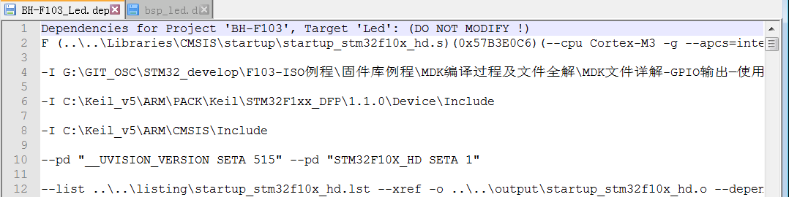

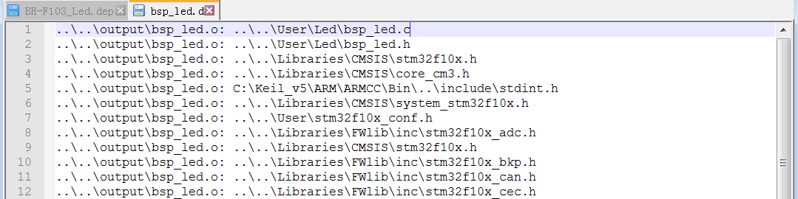

## 四、crf 交叉引用文件

.crf是交叉引用文件(Cross-Reference file)，它主要包含了浏览信息(browse information)，即源代码中的宏定义、变量及函数的定义和声明的位置。我们在代码编辑器中点击【Go To Definition Of ‘xxxx’】可实现浏览跳转，跳转的时候，MDK就是通过 .crf 文件**查找出跳转位置**的。

通过配置MDK中的【Option for Target】&rarr;【Output】&rarr;【Browse Information】选项可以设置编译时是否生成浏览信息。注意只有勾选该选项并编译后，才能实现函数定义，宏定义这些浏览跳转功能。

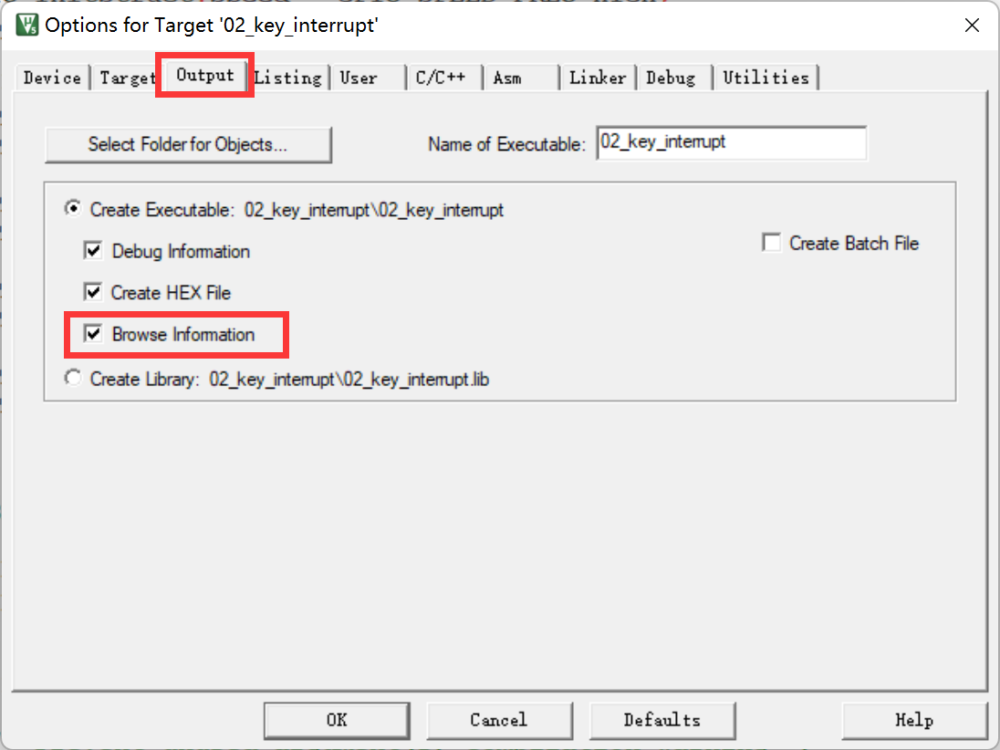

跳转操作如下图：

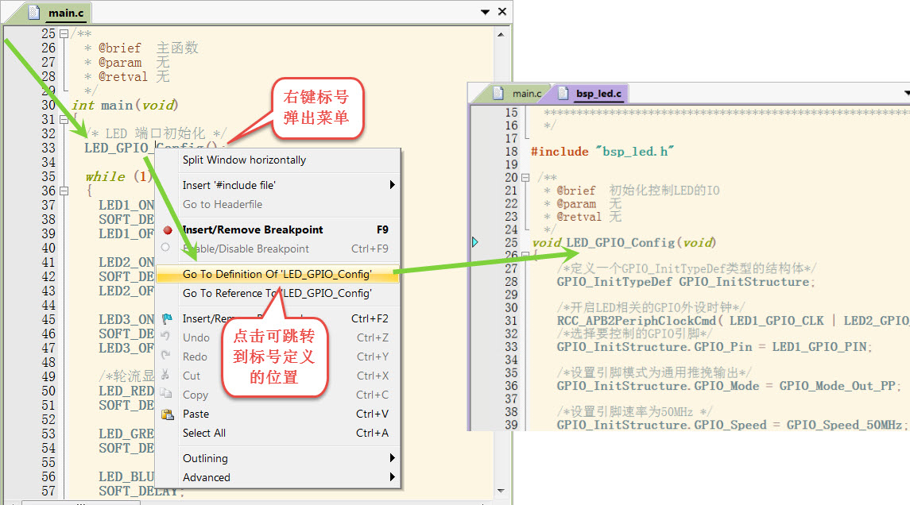

.crf 文件使用了特定的格式表示，直接用文本编辑器打开会看到大部分乱码 ，文件内容的话，这里就不再深究了。

## 五、o、axf

.o、.elf、.axf、.bin及.hex文件都存储了编译器根据源代码生成的机器码，根据应用场合的不同，它们又有所区别。但是我看到MDK的输出目录中其实并没有.elf文件，这里也放在一起学习一下吧。

### 1. 目标文件说明

.o、.elf、.axf以及前面提到的lib文件都是属于目标文件，它们都是使用ELF格式来存储的，关于ELF格式的详细内容，我还没有深究，后边需要学习的话再补充吧，这里简单说明一下。

> Tips：
>
> 链接: [ELF文件格式.pdf](https://pan.baidu.com/s/13OkU6WAuBdkO__ngDKRTYQ?pwd=if56) 提取码: if56 ，或者也可以来这里看：[ELF文件格式分析](https://gitee.com/Embedfire-stm32f103-badao/ebf_stm32f103_badao_std_code/raw/master/46-MDK编译过程及文件全解/参考资料/ELF文件格式.pdf)

ELF是Executable and Linking Format的缩写，译为可执行链接格式，该格式用于记录目标文件的内容。在Linux及Windows系统下都有使用该格式的文件(或类似格式)用于记录应用程序的内容，告诉操作系统如何链接、加载及执行该应用程序。

目标文件主要有如下三种类型：

（1）可重定位的文件(Relocatable File)，包含基础代码和数据，但它的代码及数据都没有指定绝对地址，因此它适合于与其他目标文件链接来创建可执行文件或者共享目标文件。 这种文件一般由编译器根据源代码生成。例如MDK的armcc和armasm生成的.o文件就是这一类，另外还有Linux的.o 文件，Windows的 .obj文件。

（2）可执行文件(Executable File) ，它包含适合于执行的程序，它内部组织的代码数据都有固定的地址(或相对于基地址的偏移)，系统可根据这些地址信息把程序加载到内存执行。这种文件一般由链接器根据可重定位文件链接而成，它主要是组织各个可重定位文件，给它们的代码及数据一一打上地址标号，固定其在程序内部的位置，链接后，程序内部各种代码及数据段不可再重定位(即不能再参与链接器的链接)。

例如MDK的armlink生成的.elf及.axf文件，(使用gcc编译工具可生成.elf文件，用armlink生成的是.axf文件，.axf文件在.elf之外，增加了调试使用的信息，其余区别不大，后面我们仅讲解.axf文件)，另外还有Linux的/bin/bash文件，Windows的.exe文件。

（3）共享目标文件(Shared Object File)， 它的定义比较难理解，我们直接举例，MDK生成的.lib文件就属于共享目标文件，它可以继续参与链接，加入到可执行文件之中。另外，Linux的 .so ，如/lib/ glibc-2.5.so，Windows的DLL都属于这一类。

### 2. o文件与axf文件的关系

.axf文件是由多个.o文件链接而成的，而.o文件由相应的源文件编译而成，一个源文件对应一个.o文件。

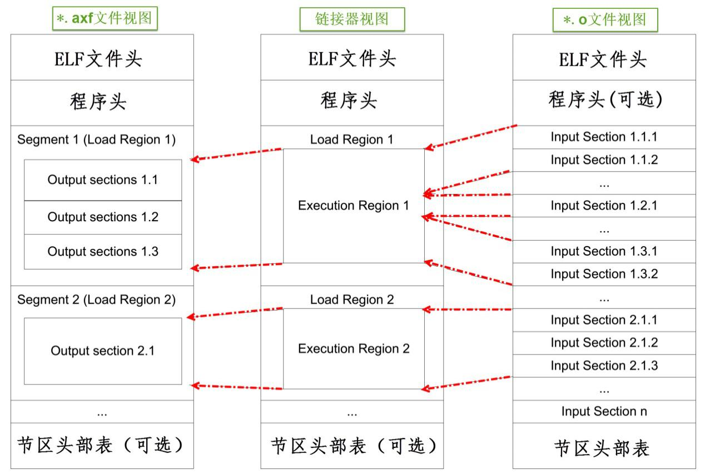

图中的中间代表的是 armlink 链接器，在它的右侧是输入链接器的.o文件，左侧是它输出的.axf文件。可以看到，由于都使用ELF文件格式，.o与.axf文件的结构是类似的，它们包含ELF文件头、程序头、节区(section)以及节区头部表。各个部分的功能说明如下：

<table>
	<tbody>
		<tr><td align="left" width="110">ELF文件头</td><td align="left">用来描述整个文件的组织，例如数据的大小端格式，程序头、节区头在文件中的位置等。</td></tr>
		<tr><td align="left">程序头   </td><td align="left">告诉系统如何加载程序，例如程序主体存储在本文件的哪个位置，程序的大小，程序要加载到内存什么地址等等。 MDK的可重定位文件*.o不包含这部分内容，因为它还不是可执行文件，而armlink输出的*.axf文件就包含该内容了。</td></tr>
		<tr><td align="left">节区     </td><td align="left">是*.o文件的独立数据区域，它包含提供给链接视图使用的大量信息，如指令(Code)、数据(RO、RW、ZI-data)、 符号表(函数、变量名等)、重定位信息等，例如每个由C语言定义的函数在*.o文件中都会有一个独立的节区。</td></tr>
		<tr><td align="left">节区头   </td><td align="left">存储在最后，包含了本文件节区的信息，如节区名称、大小等等。</td></tr>
	</tbody>
</table>


总的来说，链接器把各个.o文件的节区归类、排列，根据目标器件的情况编排地址生成输出，汇总到.axf文件。例如，“流水灯”工程中在“bsp_led.c”文件中有一个LED_GPIO_Config函数，而它内部调用了“stm32f1xx_hal_gpio.c”的GPIO_Init函数，经过 armcc 编译后，LED_GPIO_Config 及 GPIO_Iint 函数都成了指令代码，分别存储在 bsp_led.o 及 stm32f1xx_hal_gpio.o 文件中，这些指令在.o文件都没有指定地址，仅包含了内容、大小以及调用的链接信息，而经过链接器后，链接器给它们都分配了特定的地址，并且把地址根据调用指向链接起来。

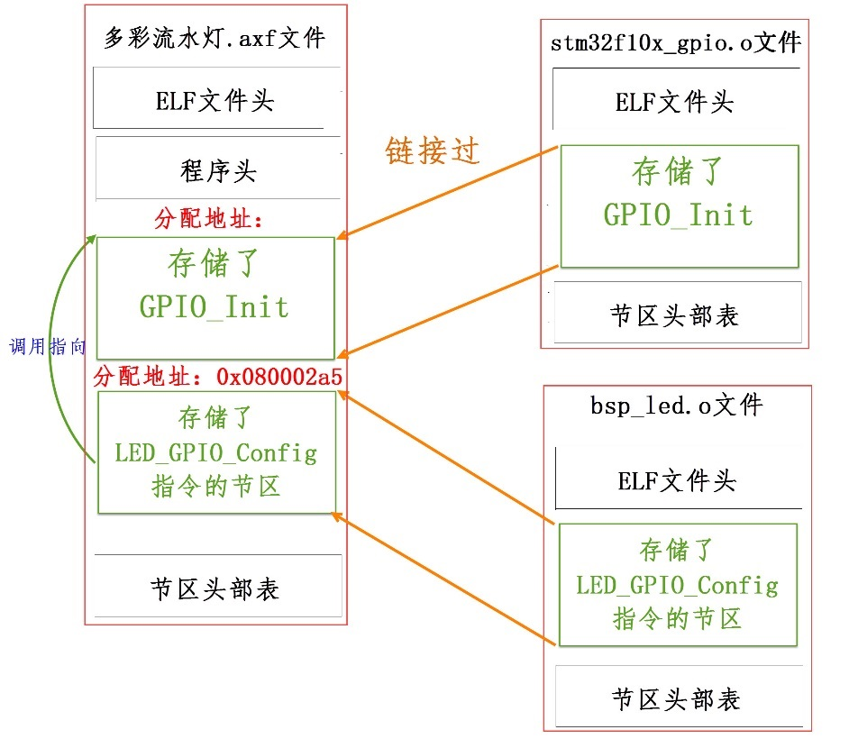

### 3. ELF文件各部分说明

前边知道.o和.axf文件都是ELF格式的，它包含ELF文件头、程序头、节区(section)以及节区头部表，这一部分我们来看一下各部分的说明。

#### 3.1 ELF文件头

> Tips：fromelf 这个工具是keil安装时就自带的，但是下面的命令要使用的话需要加上完整路径，否则就添加到windows的环境变量去。

##### 3.1.1 生成elf信息

接下来我们看看具体文件的内容，使用fromelf文件可以查看.o、.axf及.lib文件的ELF信息。使用命令行，切换到文件所在的目录，输入“fromelf –text –v file_name.o”命令，可控制输出file_name.o的详细信息。这一部分会用到野火的相关例程，可以去这里下载：[ebf_stm32f103_badao_std_code: 野火STM32F103 霸道开发板 标准库教程配套代码 (gitee.com)](https://gitee.com/Embedfire-stm32f103-badao/ebf_stm32f103_badao_std_code)


然后我们打开文件然后解压，进入程序目录，我么可以这样（原来win11下多了一个叫终端的东西，可以通过终端选择是powershell还是命令提示符）：

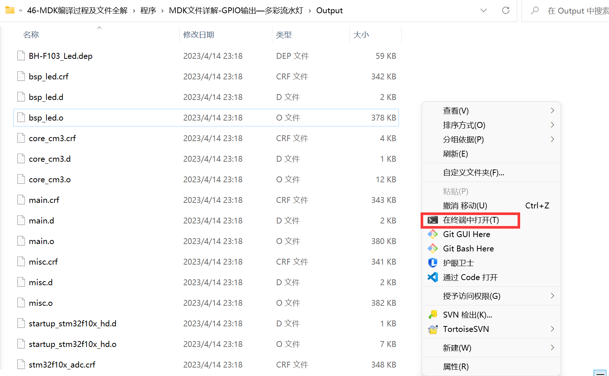

然后就会打开powershell，并且处于这个目录下：

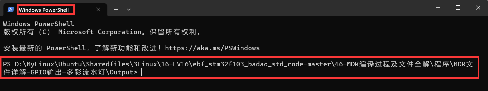

fromelf –text命令还有一些参数，我们使用这些选项来生成对应的文件，我们来了解一下：

| fromelf选项 | 可查看的信息         | 生成到相应的文件        |
| ----------- | -------------------- | ----------------------- |
| -v          | 详细信息             | bsp_led_o_elfInfo_v.txt |
| -a          | 数据的地址           | bsp_led_o_elfInfo_a.txt |
| -c          | 反汇编代码           | bsp_led_o_elfInfo_c.txt |
| -d          | data section的内容   | bsp_led_o_elfInfo_d.txt |
| -e          | 异常表               | bsp_led_o_elfInfo_e.txt |
| -g          | 调试表               | bsp_led_o_elfInfo_g.txt |
| -r          | 重定位信息           | bsp_led_o_elfInfo_r.txt |
| -s          | 符号表               | bsp_led_o_elfInfo_s.txt |
| -t          | 字符串表             | bsp_led_o_elfInfo_t.txt |
| -y          | 动态段内容           | bsp_led_o_elfInfo_y.txt |
| -z          | 代码及数据的大小信息 | bsp_led_o_elfInfo_z.txt |

```shell
# 我这里写了个脚本放在 bsp_led.o 目录下，命名为1.ps1
fromelf --text -v bsp_led.o --output ../elfInfo/bsp_led_o_elfInfo_v.txt
fromelf --text -a bsp_led.o --output ../elfInfo/bsp_led_o_elfInfo_a.txt
fromelf --text -c bsp_led.o --output ../elfInfo/bsp_led_o_elfInfo_c.txt
fromelf --text -d bsp_led.o --output ../elfInfo/bsp_led_o_elfInfo_d.txt
fromelf --text -e bsp_led.o --output ../elfInfo/bsp_led_o_elfInfo_e.txt
fromelf --text -g bsp_led.o --output ../elfInfo/bsp_led_o_elfInfo_g.txt
fromelf --text -r bsp_led.o --output ../elfInfo/bsp_led_o_elfInfo_r.txt
fromelf --text -s bsp_led.o --output ../elfInfo/bsp_led_o_elfInfo_s.txt
fromelf --text -t bsp_led.o --output ../elfInfo/bsp_led_o_elfInfo_t.txt
fromelf --text -y bsp_led.o --output ../elfInfo/bsp_led_o_elfInfo_y.txt
fromelf --text -z bsp_led.o --output ../elfInfo/bsp_led_o_elfInfo_z.txt
```

我们运行这个脚本：

```bash
.\1.ps1
```

然后就可以在上一级目录下自动创建elfInfo文件夹，并在此文件夹下生成上边那些文件。

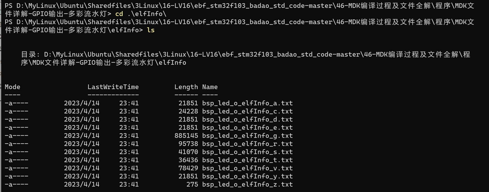

上面的`./1.ps1`命令有可能会报错：

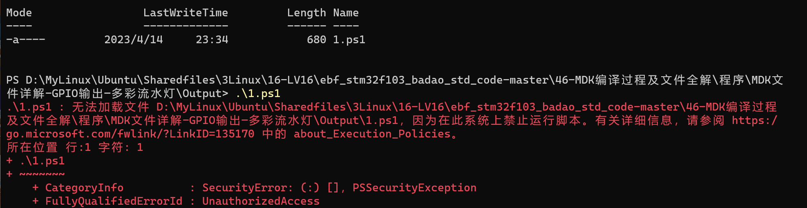

计算机上启动 Windows PowerShell 时，执行策略很可能是 Restricted（默认设置）。Restricted 执行策略不允许任何脚本运行。 AllSigned 和 RemoteSigned 执行策略可防止 Windows PowerShell 运行没有数字签名的脚本。我们使用下边的命令确认：

```shell
 get-executionpolicy
```

会打印出对应的值，这里我是直接改过了，没改富哦的花应该是其他值

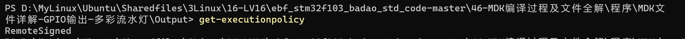

然后我们以管理员身份运行powershell并输入以下命令，并输入Y即可：

```shell
set-executionpolicy remotesigned
```

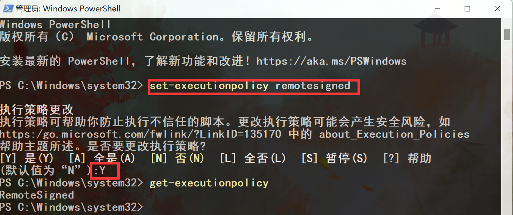


##### 3.1.2 内容分析

我们打开 bsp_led_o_elfInfo_v.txt文件，可以看到文件开头内容如下：

```txt
========================================================================

** ELF Header Information

    File Name: bsp_led.o // bsp_led.o文件

    Machine class: ELFCLASS32 (32-bit)           // 32位机器
    Data encoding: ELFDATA2LSB (Little endian)   // 小端格式 
    Header version: EV_CURRENT (Current version)
    Operating System ABI: none
    ABI Version: 0
    File Type: ET_REL (Relocatable object) (1)  // 可重定位类型
    Machine: EM_ARM (ARM)

    Entry offset (in SHF_ENTRYSECT section): 0x00000000
    Flags: None (0x05000000)

    ARM ELF revision: 5 (ABI version 2)

    Header size: 52 bytes (0x34)
    Program header entry size: 0 bytes (0x0)   // 程序头大小
    Section header entry size: 40 bytes (0x28)

    Program header entries: 0
    Section header entries: 178

    Program header offset: 0 (0x00000000)      // 程序头在文件中的位置(没有程序头)
    Section header offset: 379672 (0x0005cb18) // 节区头在文件中的位置

    Section header string table index: 175

========================================================================
```

在这个.o文件中，它的ELF文件头中告诉我们它的程序头(Program header)大小为“0 bytes”，且程序头所在的文件位置偏移也为“0”，这说明它是没有程序头的。

#### 3.2 程序头

接下来打开“ 流水灯_axf_elfInfo_v.txt”文件，查看工程的 流水灯.axf 文件的详细信息：

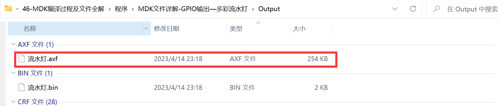

按照相同的方法，我们执行以下命令：

```shell
fromelf --text -v ./流水灯.axf --output ../elfInfo/流水灯_axf_elfInfo_v.txt
```

这样就可以在上一级目录中生成“流水灯_axf_elfInfo_v.txt”文件，我们打开这个文件，文件头部内容如下：

```txt
========================================================================

** ELF Header Information

    File Name: .\流水灯.axf                  //流水灯.axf文件 

    Machine class: ELFCLASS32 (32-bit)         //32位机
    Data encoding: ELFDATA2LSB (Little endian) //小端格式
    Header version: EV_CURRENT (Current version)
    Operating System ABI: none
    ABI Version: 0
    File Type: ET_EXEC (Executable) (2)       //可执行文件类型
    Machine: EM_ARM (ARM)

    Image Entry point: 0x08000131
    Flags: EF_ARM_HASENTRY + EF_ARM_ABI_FLOAT_SOFT (0x05000202)

    ARM ELF revision: 5 (ABI version 2)

    Conforms to Soft float procedure-call standard

    Built with
    Component: ARM Compiler 5.06 update 6 (build 750) Tool: armasm [4d35ec]
    Component: ARM Compiler 5.06 update 6 (build 750) Tool: armlink [4d35ed]

    Header size: 52 bytes (0x34)
    Program header entry size: 32 bytes (0x20)   //程序头大小
    Section header entry size: 40 bytes (0x28)

    Program header entries: 1
    Section header entries: 15

    Program header offset: 258204 (0x0003f09c)  //程序头在文件中的位置
    Section header offset: 258236 (0x0003f0bc)  //节区头在文件中的位置

    Section header string table index: 14

========================================================================

** Program header #0

    Type          : PT_LOAD (1)        //表示这是可加载的内容
    File Offset   : 52 (0x34)          //在文件中的偏移
    Virtual Addr  : 0x08000000         //虚拟地址(此处等于物理地址)
    Physical Addr : 0x08000000         //物理地址
    Size in file  : 1492 bytes (0x5d4) //程序在文件中占据的大小
    Size in memory: 2516 bytes (0x9d4) //若程序加载到内存，占据的内存空间
    Flags         : PF_X + PF_W + PF_R + PF_ARM_ENTRY (0x80000007)
    Alignment     : 8                  //地址对齐


========================================================================
```

对比之下，可发现.axf文件的ELF文件头对程序头的大小说明为非0值，且给出了它在文件的偏移地址，在输出信息之中，包含了程序头的详细信息。

程序头的“Physical Addr”描述了本程序要加载到的内存地址“0x0800 0000”，正好是STM32内部FLASH的首地址。“size in file”描述了本程序占据的空间大小为“1492 bytes”，它正是程序烧录到FLASH中需要占据的空间。这个大小等于在keil中编译时输出信息中的 Code + RO-data 的大小。

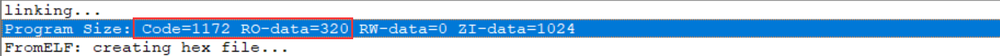

#### 3.3 节区头

在ELF的原文件中，紧接着程序头的一般是节区的主体信息，在节区主体信息之后是描述节区主体信息的节区头，我们来看看节区头中的信息了解概况。 通过对比.o文件及.axf文件的节区头部信息，可以清楚地看出这两种文件的区别：

- .o文件的节区信息(“bsp_led_o_elfInfo_v.txt”文件)

```txt
** Section #1

    Name        : i.LED_GPIO_Config    // 节区名 
    // 此节区包含程序定义的信息，其格式和含义都由程序来解释。
    Type        : SHT_PROGBITS (0x00000001)
    // 此节区在进程执行过程中占用内存。 节区包含可执行的机器指令。
    Flags       : SHF_ALLOC + SHF_EXECINSTR (0x00000006)
    Addr        : 0x00000000           // 地址
    File Offset : 52 (0x34)            // 在文件中的偏移
    Size        : 96 bytes (0x60)      // 大小
    Link        : SHN_UNDEF
    Info        : 0
    Alignment   : 4                    // 字节对齐
    Entry Size  : 0
====================================
```

这个节区的名称为LED_GPIO_Config，它正好是我们在bsp_led.c文件中定义的函数名。**注意**：编译时要勾选“【Options for Target 】&rarr; 【C/C++】&rarr; 【One ELF Section per Function】”中的选项，生成的.o文件内部的代码区域才会与C文件中定义的函数名一致，否则它会把多个函数合成一个代码段， 名字一般跟C文件中的函数名不同。

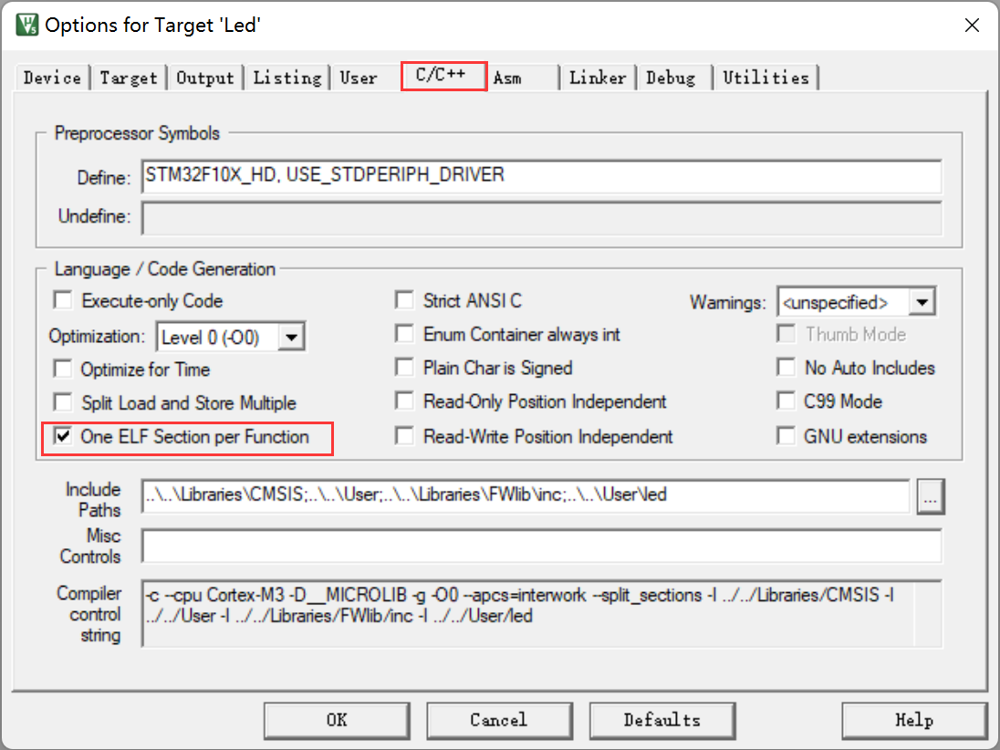

这个节区头描述的是该函数被编译后的节区信息，其中包含了节区的类型(指令类型SHT_PROGBITS)、节区应存储到的地址(0x00000000)、它主体信息在文件位置中的偏移(52)以及节区的大小(96 bytes)。

由于.o文件是可重定位文件，所以它的地址并没有被分配，是0x00000000（假如文件中还有其它函数，该函数生成的节区中，对应的地址描述也都是0）。 当链接器链接时，根据这个节区头信息，在文件中找到它的主体内容，并根据它的类型，把它加入到主程序中，并分配实际地址，链接后生成的.axf文件。

- .axf文件的节区信息（“流水灯_axf_elfInfo_v.txt”）

```txt
** Section #1

    Name        : ER_IROM1                  // 节区名
    // 此节区包含程序定义的信息，其格式和含义都由程序来解释。
    Type        : SHT_PROGBITS (0x00000001)
    // 此节区在进程执行过程中占用内存。 节区包含可执行的机器指令
    Flags       : SHF_ALLOC + SHF_EXECINSTR (0x00000006)
    Addr        : 0x08000000               // 地址
    File Offset : 52 (0x34)           
    Size        : 1492 bytes (0x5d4)       // 大小
    Link        : SHN_UNDEF
    Info        : 0
    Alignment   : 4
    Entry Size  : 0
====================================
** Section #2

    Name        : RW_IRAM1                 // 节区名
    // 包含将出现在程序的内存映像中的为初始化数据。 根据定义，当程序开始执行，系统
    // 将把这些数据初始化为 0。
    Type        : SHT_NOBITS (0x00000008)
    // 此节区在进程执行过程中占用内存。 节区包含进程执行过程中将可写的数据。
    Flags       : SHF_ALLOC + SHF_WRITE (0x00000003)
    Addr        : 0x20000000              // 地址
    File Offset : 1544 (0x608)
    Size        : 1024 bytes (0x400)      // 大小
    Link        : SHN_UNDEF
    Info        : 0
    Alignment   : 8
    Entry Size  : 0
====================================
```

在.axf文件中，主要包含了两个节区，一个名为ER_IROM1，一个名为RW_IRAM1，这些节区头信息中除了具有.o文件中节区头描述的节区类型、文件位置偏移、大小之外，更重要的是它们都有具体的地址描述，其中 ER_IROM1的地址为0x08000000，而RW_IRAM1的地址为0x20000000，它们正好是STM32内部FLASH及SRAM的首地址：

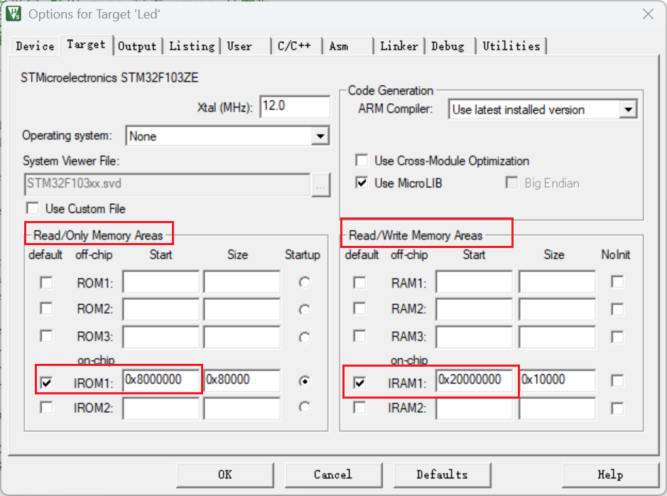

对应节区的大小就是程序需要占用FLASH及SRAM空间的实际大小。

也就是说，经过链接器后，它生成的.axf文件已经汇总了其它.o文件的所有内容，生成的ER_IROM1节区内容可直接写入到STM32内部FLASH的具体位置。例如，前面.o文件中的i.LED_GPIO_Config节区已经被加入到.axf文件的ER_IROM1节区的某地址。

#### 3.4 节区主体及反汇编代码

使用fromelf的 -c 选项可以查看部分节区的主体信息，对于指令节区，可根据其内容查看相应的反汇编代码，我们打开“bsp_led_o_elfInfo_c.txt”文件可查看 这些信息：

```txt
// *.o文件的LED_GPIO_Config节区及反汇编代码(bsp_led_o_elfInfo_c.txt文件)
** Section #1 'i.LED_GPIO_Config' (SHT_PROGBITS) [SHF_ALLOC + SHF_EXECINSTR]
    Size   : 96 bytes (alignment 4)
    Address: 0x00000000

    $t
    i.LED_GPIO_Config
    LED_GPIO_Config
    	//  地址        内容  [ASCII码(无意义)]  内容对应的代码
        0x00000000:    b508        ..      PUSH     {r3,lr}
        0x00000002:    2101        .!      MOVS     r1,#1
        0x00000004:    2008        .       MOVS     r0,#8
        0x00000006:    f7fffffe    ....    BL       RCC_APB2PeriphClockCmd
        0x0000000a:    2020                MOVS     r0,#0x20
        0x0000000c:    f8ad0000    ....    STRH     r0,[sp,#0]
        0x00000010:    2010        .       MOVS     r0,#0x10
        0x00000012:    f88d0003    ....    STRB     r0,[sp,#3]
        0x00000016:    2003        .       MOVS     r0,#3
        0x00000018:    f88d0002    ....    STRB     r0,[sp,#2]
        0x0000001c:    4669        iF      MOV      r1,sp
        0x0000001e:    480f        .H      LDR      r0,[pc,#60] ; [0x5c] = 0x40010c00
        0x00000020:    f7fffffe    ....    BL       GPIO_Init
        0x00000024:    2001        .       MOVS     r0,#1
// 下边的内容省略
```

可看到，由于这是.o文件，它的节区地址还是没有分配的，基地址为0x00000000，接着在LED_GPIO_Config标号之后，列出了一个表，表中包含了地址偏移、相应地址中的内容以及根据内容反汇编得到的指令。细看汇编指令，还可看到它包含了跳转到RCC_APB2PeriphClockCmd及GPIO_Init标号的语句，而且这两个跳转语句原来的内容都是“f7fffffe”，这是因为在.o文件中并没有RCC_APB2PeriphClockCmd及GPIO_Init标号的具体地址索引，在.axf文件中，这是不一样的。

接下来我们打开“流水灯_axf_elfInfo_c.txt”文件，查看.axf文件中，ER_IROM1节区中对应LED_GPIO_Config的内容，我们执行以下命令生成这个文件：

```shell
PS D:\MyLinux\Ubuntu\Sharedfiles\3Linux\16-LV16\ebf_stm32f103_badao_std_code-master\46-MDK编译过程及文件全解\程序\MDK文
件详解-GPIO输出—多彩流水灯\Output> fromelf --text -c .\流水灯.axf --output ../elfInfo/流水灯_axf_elfInfo_c.txt
```

然后我们打开这个文件：

```txt
// *.axf文件的LED_GPIO_Config反汇编代码(流水灯_axf_elfInfo_c.txt文件)
	i.LED_GPIO_Config
    LED_GPIO_Config
        0x080002c4:    b508        ..      PUSH     {r3,lr}
        0x080002c6:    2101        .!      MOVS     r1,#1
        0x080002c8:    2008        .       MOVS     r0,#8
        0x080002ca:    f000f82f    ../.    BL       RCC_APB2PeriphClockCmd ; 0x800032c
        0x080002ce:    2020                MOVS     r0,#0x20
        0x080002d0:    f8ad0000    ....    STRH     r0,[sp,#0]
        0x080002d4:    2010        .       MOVS     r0,#0x10
        0x080002d6:    f88d0003    ....    STRB     r0,[sp,#3]
        0x080002da:    2003        .       MOVS     r0,#3
        0x080002dc:    f88d0002    ....    STRB     r0,[sp,#2]
        0x080002e0:    4669        iF      MOV      r1,sp
        0x080002e2:    480f        .H      LDR      r0,[pc,#60] ; [0x8000320] = 0x40010c00
        0x080002e4:    f7ffff5e    ..^.    BL       GPIO_Init ; 0x80001a4
        0x080002e8:    2001        .       MOVS     r0,#1
// 下边的内容省略
```

可看到，除了基地址以及跳转地址不同之外，LED_GPIO_Config中的内容跟.o文件中的一样。另外，由于.o是独立的文件，而.axf是整个工程汇总的文件，所以在.axf中包含了所有调用到.o文件节区的内容。例如，在“bsp_led_o_elfInfo_c.txt”(bsp_led.o文件的反汇编信息)中不包含RCC_APB2PeriphClockCmd及GPIO_Init的内容，而在“流水灯_axf_elfInfo_c.txt” (流水灯.axf文件的反汇编信息)中则可找到它们的具体信息，且它们也有具体的地址空间。

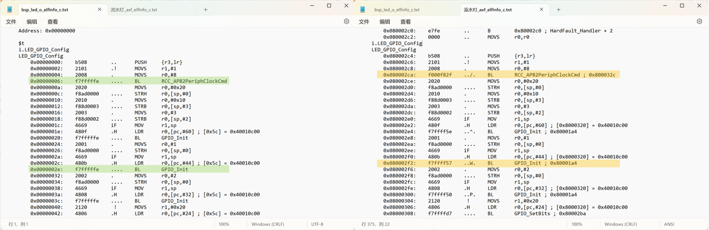

在.axf文件中，跳转到RCC_APB2PeriphClockCmd及GPIO_Init标号的这两个指令后都有注释，分别是“; 0x800032c”及“; 0x80001a4”，它们是这两个标号所在的具体地址，而且这两个跳转语句的跟.o中的也有区别，内容分别为“f000f82f”及“f7ffff5e”（.o中的均为f7fffffe）。这就是链接器链接的含义，它把不同.o中的内容链接起来了。

#### 3.5 分散加载代码

前面提到程序有存储态及运行态，它们之间应有一个转化过程，**把存储在内部FLASH中的RW-data数据拷贝至内部SRAM**。然而我们的工程中并没有编写这样的代码，在汇编文件中也查不到该过程，芯片是如何知道FLASH的哪些数据应拷贝到SRAM的哪些区域呢？

通过查看“流水灯_axf_elfInfo_c.txt”的反汇编信息，可以看到到程序中具有一段名为“__scatterload”的分散加载代码，它是由 armlink 链接器自动生成的

```txt
// 分散加载代码(流水灯_axf_elfInfo_c.txt文件)
    .text
    __scatterload
    __scatterload_rt2
        0x08000168:    4c06        .L      LDR      r4,[pc,#24] ; [0x8000184] = 0x80005c4
        0x0800016a:    4d07        .M      LDR      r5,[pc,#28] ; [0x8000188] = 0x80005d4
        0x0800016c:    e006        ..      B        0x800017c ; __scatterload + 20
        0x0800016e:    68e0        .h      LDR      r0,[r4,#0xc]
        0x08000170:    f0400301    @...    ORR      r3,r0,#1
        0x08000174:    e8940007    ....    LDM      r4,{r0-r2}
        0x08000178:    4798        .G      BLX      r3
        0x0800017a:    3410        .4      ADDS     r4,r4,#0x10
        0x0800017c:    42ac        .B      CMP      r4,r5
        0x0800017e:    d3f6        ..      BCC      0x800016e ; __scatterload + 6
        0x08000180:    f7ffffda    ....    BL       __main_after_scatterload ; 0x8000138
    $d
        0x08000184:    080005c4    ....    DCD    134219204
        0x08000188:    080005d4    ....    DCD    134219220
    $t
// ... ...
    i.__scatterload_copy
    __scatterload_copy
        0x080004a0:    e002        ..      B        0x80004a8 ; __scatterload_copy + 8
        0x080004a2:    c808        ..      LDM      r0!,{r3}
        0x080004a4:    1f12        ..      SUBS     r2,r2,#4
        0x080004a6:    c108        ..      STM      r1!,{r3}
        0x080004a8:    2a00        .*      CMP      r2,#0
        0x080004aa:    d1fa        ..      BNE      0x80004a2 ; __scatterload_copy + 2
        0x080004ac:    4770        pG      BX       lr
    i.__scatterload_null
    __scatterload_null
        0x080004ae:    4770        pG      BX       lr
    i.__scatterload_zeroinit
    __scatterload_zeroinit
        0x080004b0:    2000        .       MOVS     r0,#0
        0x080004b2:    e001        ..      B        0x80004b8 ; __scatterload_zeroinit + 8
        0x080004b4:    c101        ..      STM      r1!,{r0}
        0x080004b6:    1f12        ..      SUBS     r2,r2,#4
        0x080004b8:    2a00        .*      CMP      r2,#0
        0x080004ba:    d1fb        ..      BNE      0x80004b4 ; __scatterload_zeroinit + 4
        0x080004bc:    4770        pG      BX       lr
        0x080004be:    0000        ..      MOVS     r0,r0
```

这段分散加载代码包含了拷贝过程(主要使用LDM复制指令)，如：

```txt
0x08000174:    e8940007    ....    LDM      r4,{r0-r2}
```

而LDM指令的操作数中包含了加载的源地址，这些地址中包含了内部FLASH存储的RW-data数据，执行这些指令后数据就会从FLASH地址加载到内部SRAM的地址。我们再来看一下这个文件的__main的反汇编代码部分：

```txt
//__main的反汇编代码部分（流水灯_axf_elfInfo_c.txt文件）
    .ARM.Collect$$$$00000000
    .ARM.Collect$$$$00000001
    __Vectors_End
    __main
    _main_stk
        0x08000130:    f8dfd00c    ....    LDR      sp,__lit__00000000 ; [0x8000140] = 0x20000400
    .ARM.Collect$$$$00000004
    _main_scatterload
        0x08000134:    f000f818    ....    BL       __scatterload ; 0x8000168
```

可以看最后一行， “\_\_scatterload ”的代码会被“\_\_main”函数调用，__main在启动文件中的“Reset_Handler”会被调用，因而，在主体程序执行前，已经完成了分散加载过程。

## 六、hex文件及bin文件

若编译过程无误，即可把工程生成前面对应的.axf文件，而在MDK中使用下载器(DAP/JLINK/ULINK等)下载程序或仿真的时候，MDK调用的就是.axf文件，它解释该文件，然后控制下载器把.axf中的代码内容下载到STM32芯片对应的存储空间，然后复位后芯片就开始执行代码了。

然而，脱离了MDK或IAR等工具，下载器就无法直接使用.axf文件下载代码了，它们一般仅支持hex和bin格式的代码数据文件。默认情况下MDK都不会生成hex及bin文件，需要配置工程选项或使用fromelf命令。

### 1. 生成hex文件

生成hex文件的配置比较简单，在“【Options for Target】&rarr;【Output】&rarr;【Create Hex File】”中勾选该选项，然后编译工程即可。

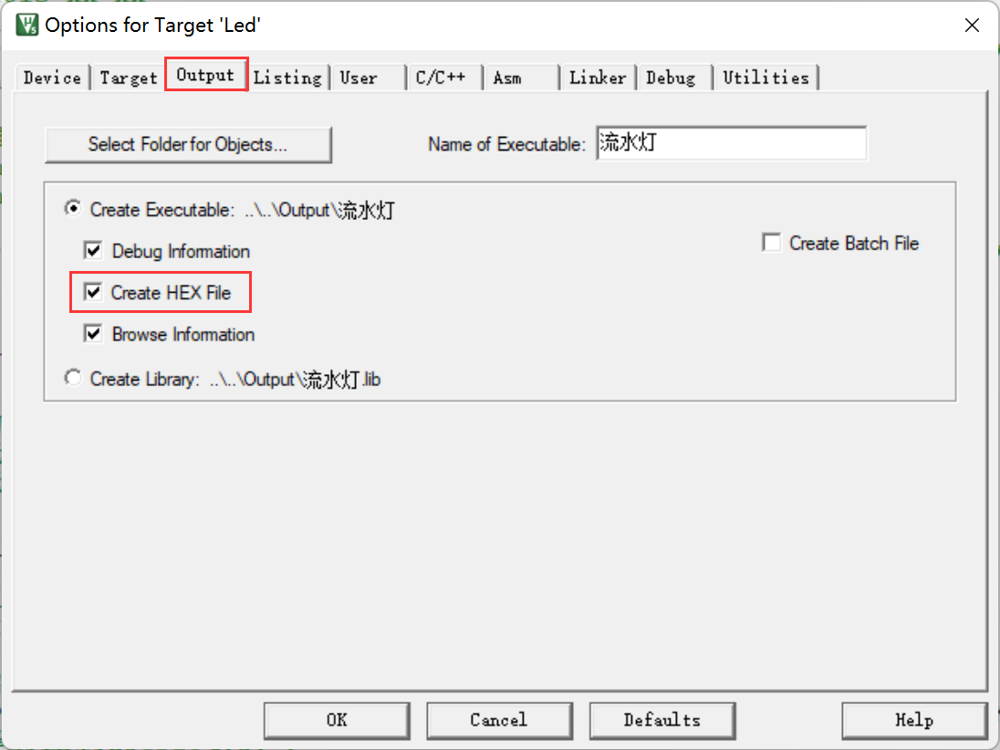

### 2. 生成bin文件

使用MDK生成bin文件需要使用fromelf命令，在MDK的“【Options For Target】&rarr;【Users】”中加入：

```shell
fromelf --bin --output ..\..\Output\流水灯.bin ..\..\Output\流水灯.axf
```

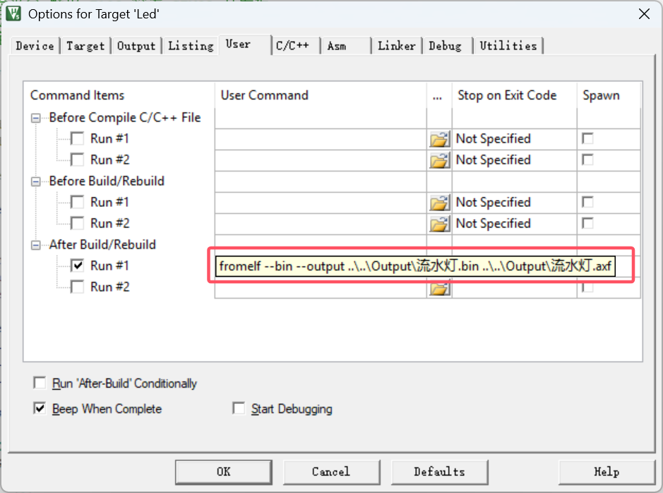

该指令是根据本机及工程的配置而写的，在不同的系统环境或不同的工程中，指令内容都不一样，我们需要理解它， 才能为自己的工程定制指令，首先看看fromelf的帮助（前提是已经将 fromelf 加入环境变量）：

```shell
PS C:\Users\20380> fromelf
Product: MDK Plus 5.29
Component: ARM Compiler 5.06 update 6 (build 750)
Tool: fromelf [4d35e3]
For support see http://www.arm.com/support
Software supplied by: ARM Limited

ARM image conversion utility
fromelf [options] input_file

Options:
       --help         display this help screen
# 中间部分省略.....
Binary Output Formats:
       --bin          Plain Binary
# 中间部分省略.....
Output Formats Requiring Debug Information
       --fieldoffsets Assembly Language Description of Structures/Classes
       --expandarrays Arrays inside and outside structures are expanded

Other Output Formats:
       --elf         ELF
       --text        Text Information
# 中间部分省略.....
```

我们在MDK输入的指令格式是遵守fromelf帮助里的指令格式说明的，其格式为：

```shell
fromelf [options] input_file
```

其中optinos是指令选项，一个指令支持输入多个选项，每个选项之间使用空格隔开，我们的实例中使用“–bin”选项设置输出bin文件，使用“–output file”选项设置输出文件的名字为“..\\..\\Output流水灯.bin”，这个名字是一个相对路径格式，一个“..”表示当前目录的上一层，两个“..”表示上两层 目录（当前目录是指uvprojx工程文件所在的位置）。如果不了解如何使用“..”表示路径，可使用MDK命令输入框后面的文件夹图标打开文件浏览器选择 文件，加入绝对路径，在命令的最后使用“..\\..\\Output流水灯.axf”作为命令的输入文件。


fromelf需要根据工程的.axf文件输入来转换得到bin文件，所以在命令的输入文件参数中要选择本工程对应的.axf文件，于是在MDK命令输入栏中，我们把fromelf指令放置在“After Build/Rebuild”(工程构建完成后执行)一栏，这样设置后，工程构建完成生成了最新的.axf文件，MDK再执行fromelf指令，从而得到最新的bin文件。

设置完成生成hex的选项或添加了生成bin的用户指令后，点击工程的编译(build)按钮，重新编译工程。就会有bin文件生成啦：

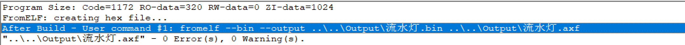

### 3. hex文件格式

hex是Intel公司制定的一种使用ASCII文本记录机器码或常量数据的文件格式，这种文件常常用来记录将要存储到ROM中的数据，绝大多数下载器支持该格式。一个hex文件由多条记录组成，而每条记录由五个部分组成，格式形如“`:llaaaatt[dd…]cc`”记录的各个部分介绍如下：

- “:” ：每条记录的开头都使用冒号来表示一条记录的开始；
- ll ：以16进制数表示这条记录的主体数据区的长度(即后面[dd…]的长度)；
- aaaa:表示这条记录中的内容应存放到FLASH中的起始地址；
- tt：表示这条记录的类型，它包含中的各种类型；

| tt的值 | 代表的类型                                     |
| ------ | ---------------------------------------------- |
| 00     | 数据记录                                       |
| 01     | 本文件结束记录                                 |
| 02     | 扩展地址记录                                   |
| 04     | 扩展线性地址记录(表示后面的记录按个这地址递增) |
| 05     | 表示一个线性地址记录的起始(只适用于ARM)        |


- dd ：表示一个字节的数据，一条记录中可以有多个字节数据，ll区表示了它有多少个字节的数据；
- cc ：表示本条记录的校验和，它是前面所有16进制数据 (除冒号外，两个为一组)的和对256取模运算的结果的补码。

例如，“流水灯”工程生成的hex文件前几条记录如下：

```txt
// Hex文件实例(流水灯.hex文件，可直接用记事本打开)
:020000040800F2
:10000000000400204501000829030008BF02000881
:10001000250300088D0100089D0400080000000071
:100020000000000000000000000000004D03000878
:1000300091010008000000002B03000839040008AB
:100040005F0100085F0100085F0100085F01000810
```

- 第一条记录解释如下：

（1）02：表示这条记录数据区的长度为2字节；

（2）0000：表示这条记录要存储到的地址；

（3）04：表示这是一条扩展线性地址记录；

（4）0800：由于这是一条扩展线性地址记录，所以这部分表示地址的高16位，与前面的“0000”结合在一起，表示要扩展的线性地址为“0x0800 0000”，这正好是STM32内部FLASH的首地址；

（5）F2：表示校验和，它的值为(0x02+0x00+0x00+0x04+0x08+0x00)%256的值再取补码。

- 再来看第二条记录：

（1）10：表示这条记录数据区的长度为2字节；

（2）0000：表示这条记录所在的地址，与前面的扩展记录结合，表示这条记录要存储的FLASH首地址为(0x0800 0000+0x0000)；

（3）00：表示这是一条数据记录，数据区的是地址；

（4）000400204501000829030008BF020008：这是要按地址存储的数据；

（5）81:校验和

为了更清楚地对比bin、hex及axf文件的差异，我们来查看这些文件内部记录的信息来进行对比。

### 4. hex、bin及axf文件的区别与联系

bin、hex及axf文件都包含了指令代码，但它们的信息丰富程度是不一样的。

- bin文件是最直接的代码映像，它记录的内容就是要存储到FLASH的二进制数据(机器码本质上就是二进制数据)， 在FLASH中是什么形式它就是什么形式，没有任何辅助信息，包括大小端格式也没有，因此下载器需要有针对芯片FLASH平台的辅助文件才能正常下载(一般下载器程序会有匹配的这些信息)；
- hex文件是一种使用十六进制符号表示的代码记录，记录了代码应该存储到FLASH的哪个地址，下载器可以根据这些信息辅助下载；
- axf文件，不仅包含代码数据，还包含了工程的各种信息，因此它也是三个文件中最大的。

同一个工程生成的bin、hex及axf文件的大小如下图：

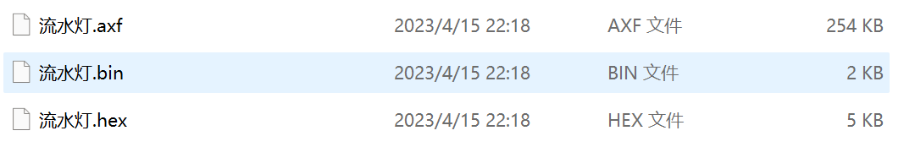

实际上，这个工程要烧写到FLASH的内容总大小为1492字节，然而在Windows中查看的bin文件却比它大( bin文件是FLASH的代码映像，大小应一致)，这是因为Windows文件显示单位的原因，使用右键查看文件的属性，可以查看它实际记录内容的大小

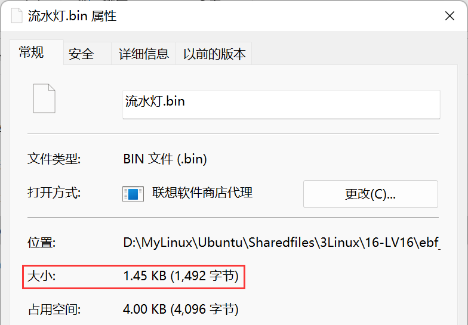

接下来我们打开本工程的“流水灯.bin”、“流水灯.hex”及由“流水灯.axf”使用fromelf工具输出的反汇编文件“流水灯_axf_elfInfo_c.txt” 文件：


在“流水灯_axf_elfInfo_c.txt”文件中不仅可以看到代码数据，还有具体的标号、地址以及反汇编得到的代码，虽然它不是.axf文件的原始内容，但因为它是通过.axf文件fromelf工具生成的，我们可认为.axf文件本身记录了大量这些信息，它的内容非常丰富，熟悉汇编语言的人可轻松阅读。

在hex文件中包含了地址信息以及地址中的内容，而在bin文件中仅包含了内容，连存储的地址信息都没有。观察可知，bin、hex及axf文件中的数据内容都是相同的，它们存储的都是机器码。这就是它们三都之间的区别与联系。

由于文件中存储的都是机器码，该图是根据axf文件的GPIO_Init函数的机器码，在bin及hex中找到的对应位置。 所以经验丰富的人是有可能从bin或hex文件中恢复出汇编代码的，只是成本较高，但不是不可能。


如果芯片没有做任何加密措施，使用下载器可以直接从芯片读回它存储在FLASH中的数据，从而得到bin映像文件，根据芯片型号还原出部分代码即可进行修改，甚至不用修改代码，直接根据目标产品的硬件PCB，抄出一样的板子，再把bin映像下载芯片，直接山寨出目标产品，所以在实际的生产中，一定要注意做好加密措施。由于axf文件中含有大量的信息，且直接使用fromelf即可反汇编代码，所以更不要随便泄露axf文件。lib文件也能反使用fromelf文件反汇编代码，不过它不能还原出C代码，由于lib文件的主要目的是为了保护C源代码，也算是达到了它的要求。

## 七、htm静态调用图文件

在Output目录下，有一个以工程文件命名的后缀为.bulid_log.htm及.htm文件，如“流水灯.bulid_log.htm”及“流水灯.htm”， 它们都可以使用浏览器打开。其中.build_log.htm是工程的构建过程日志，而.htm是链接器生成的静态调用图文件。

在静态调用图文件中包含了整个工程各种函数之间互相调用的关系图，而且它还给出了静态占用最深的栈空间数量以及它对应的调用关系链。

例如下图是“流水灯.htm”文件顶部的说明。

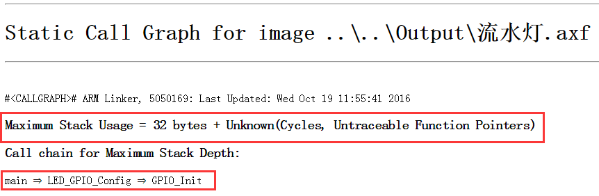

该文件说明了本工程的静态栈空间最大占用32字节(Maximum Stack Usage:32bytes)， 这个占用最深的静态调用为“main->LED_GPIO_Config->GPIO_Init”。注意这里给出的空间只是静态的栈使用统计，链接器无法统计动态使用情况， 例如链接器无法知道递归函数的递归深度。在本文件的后面还可查询到其它函数的调用情况及其它细节。

利用这些信息，我们可以大致了解工程中应该分配多少空间给栈，有空间余量的情况下，一般会设置比这个静态最深栈使用量大一倍， 在STM32中可修改启动文件改变堆栈的大小；如果空间不足，可从该文件中了解到调用深度的信息，然后优化该代码。

> 注意：有一些比较大规模的工程例子， 静态栈调用最大深度都已超出STM32启动文件默认的栈空间大小0x00000400，即1024字节，但在当时的调试过程中却没有发现错误， 所以当时没有修改栈的默认大小(有一些工程调试时已发现问题，它们的栈空间就已经被我们改大了)，虽然这些工程实际运行并没有错误， 但这可能只是因为它使用的栈溢出RAM空间恰好没被程序其它部分修改而已。所以， 建议在实际的大型工程应用中(特别是使用了各种外部库时，如Lwip/emWin/Fatfs等)，要查看本静态调用图文件， 了解程序的栈使用情况，给程序分配合适的栈空间。

## 八、 总结

总结一下bin、hex、axf、elf文件格式有什么区别吧：从存储数据的信息量上看：elf > axf > hex > bin，所以这也就确定了只能将大信息量的文件格式向小信息量的文件格式转换，如只能将 hex 文件转换为 bin 文件，当然如果指定了下载地址，也可以将 bin 转换为 hex 文件。

| 文件类型 | 说明                                                         |
| -------- | ------------------------------------------------------------ |
| BIN文件  | bin文件是纯粹的机器码，没有地址信息，不能使用记事本直接打开，要使用bin文件阅读器才能打开，如果使用bin文件烧录程序时，**需要指定下载地址**。一些下载器只能使用BIN文件进行下载，在进行OTA远程升级时必须使用bin文件。 |
| HEX文件  | 一般是指Intel标准的hex文件，可以使用记事本直接打开，是十六进制数据，包含了基地址、偏移量、校验和、文件开始和结束标志等信息，与bin文件最大的不同就是**包含了下载地址**。由于hex文件是十六进制数据，而bin文件是二进制数据，如十六进制0xFF，用二进制表示为1111 1111，所以hex文件要比bin文件大得多。与axf文件相比，不含调试信息，不能用于调试。 |
| AXF文件  | **包含了调试信息**，如进行在Keil环境使用Debug功能时，就是先将axf文件下载到芯片内，才能进行调试。如使用J-Link的J-Scope功能时，必须使用axf文件。 |
| ELF文件  | 是由GCC编译器生成的。elf文件可以直接转换为hex和bin。         |


> 参考资料：
>
> [STM32的内存管理相关（内存架构，内存管理，map文件分析）-云社区-华为云](https://bbs.huaweicloud.com/blogs/375342)
>
> [46. MDK的编译过程及文件类型全解](https://doc.embedfire.com/mcu/stm32/f103badao/std/zh/latest/book/MDK.html)
