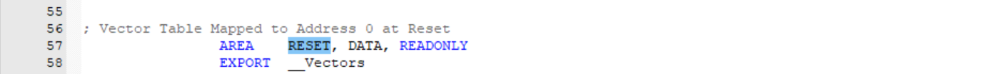

<!-- more -->

本篇笔记主要是参考的野火的文档。使用的工程呢可以去这里下载：[ebf_stm32f103_badao_std_code: 野火STM32F103 霸道开发板 标准库教程配套代码 (gitee.com)](https://gitee.com/Embedfire-stm32f103-badao/ebf_stm32f103_badao_std_code)

> 链接: [程序](https://pan.baidu.com/s/1Uq_kTrjQWxPYFQ00HoxN1Q?pwd=gryg) 提取码: gryg 

在Listing目录下包含了.map及.lst文件，它们都是文本格式的，可使用Windows的记事本软件打开。其中lst文件仅包含了一些汇编符号的链接信息，这些文件中**重点是map文件**。

## 一、Listing目录位置选择

这里存放的都是链接器链接过程中用到的或者生成的文件，我们也是可以自行配置目录位置的：


【Options for Targe】&rarr;【Listing】&rarr;【SelectFolder for Listings】”选项配置这些文件的输出路径 。

## 二、打开map文件

map文件存在于Listing目录中，我们怎么在MDK中打开？我们直接双击这里：


双击之后没打开？这个我也不清楚，但是重新配置一下listing目录的位置就可以双击打开啦，我也不是很明白为什么，可能是需要map文件在某个子目录吧。

## 三、map文件说明

map文件是由链接器生成的，它主要包含交叉链接信息，查看该文件可以了解工程中各种符号之间的引用以及整个工程的Code、RO-data、RW-data以及ZI-data的详细及汇总信息。它的内容中主要包含了“节区的跨文件引用”、“删除无用节区”、“符号映像表”、“存储器映像索引”以及“映像组件大小”，接下来是各部分介绍。

### 1. 节区的跨文件引用

打开“流水灯.map”文件，可看到它的第一部分——节区的跨文件引用(**Section Cross References**)：

```txt
// 节区的跨文件引用部分(流水灯.map文件)
Component: ARM Compiler 5.06 update 6 (build 750) Tool: armlink [4d35ed]

==============================================================================

Section Cross References

    startup_stm32f10x_hd.o(RESET) refers to startup_stm32f10x_hd.o(STACK) for __initial_sp
    startup_stm32f10x_hd.o(RESET) refers to startup_stm32f10x_hd.o(.text) for Reset_Handler
    // 中间省略......
    startup_stm32f10x_hd.o(RESET) refers to stm32f10x_it.o(i.SysTick_Handler) for SysTick_Handler
    // 中间省略......
    main.o(i.main) refers to bsp_led.o(i.LED_GPIO_Config) for LED_GPIO_Config
    main.o(i.main) refers to main.o(i.Delay) for Delay
    bsp_led.o(i.LED_GPIO_Config) refers to stm32f10x_rcc.o(i.RCC_APB2PeriphClockCmd) for RCC_APB2PeriphClockCmd
    bsp_led.o(i.LED_GPIO_Config) refers to stm32f10x_gpio.o(i.GPIO_Init) for GPIO_Init
    bsp_led.o(i.LED_GPIO_Config) refers to stm32f10x_gpio.o(i.GPIO_SetBits) for GPIO_SetBits
    // 后边省略......
```

在这部分中，详细列出了各个.o文件之间的符号引用。由于.o文件是由asm或c/c++源文件编译后生成的，各个文件及文件内的节区间互相独立，链接器根据它们之间的互相引用链接起来，链接的详细信息在这个“Section Cross References”一一列出。

例如，开头部分说明的是startup_stm32f10x.o文件中的“RESET”节区为它使用的“__initial_sp” 符号引用了同文件“STACK”节区。

我们继续浏览，可看到main.o文件的引用说明，如说明main.o文件的i.main节区为它使用的 LED_GPIO_Config 符号引用了 bsp_led.o 文件 i.LED_GPIO_Config 节区。

同样地，下面还有bsp_led.o文件的引用说明，如说明了bsp_led.o文件的i.LED_GPIO_Config节区为它使用的GPIO_Init符号引用了stm32f10x_gpio.o文件的i.GPIO_Init节区。

可以了解到，这些跨文件引用的符号其实就是源文件中的函数名、变量名。有时在构建工程的时候，编译器会输出 “Undefined symbol xxx (referred from xxx.o)” 这样的提示，该提示的原因就是在链接过程中，某个文件无法在外部找到它引用的标号，因而产生链接错误。例如，我们把bsp_led.c文件中定义的函数LED_GPIO_Config改名为LED_GPIO_ConfigA，而不修改main.c文件中的调用，就会出现main文件无法找到LED_GPIO_Config符号的提示（Undefined symbol xxxx from xxx.o）。


### 2. 删除无用节区

map文件的第二部分是删除无用节区的说明(**Removing Unused input sections from the image**)：

```txt
//删除无用节区部分(流水灯.map文件)
Removing Unused input sections from the image.

    Removing startup_stm32f10x_hd.o(HEAP), (512 bytes).
    Removing core_cm3.o(.emb_text), (32 bytes).
    Removing system_stm32f10x.o(i.SystemCoreClockUpdate), (164 bytes).
    Removing system_stm32f10x.o(.data), (20 bytes).
    Removing misc.o(i.NVIC_Init), (112 bytes).
    Removing misc.o(i.NVIC_PriorityGroupConfig), (20 bytes).
    Removing misc.o(i.NVIC_SetVectorTable), (20 bytes).
    // 后边的省略
```

这部分列出了在链接过程它发现工程中未被引用的节区，这些未被引用的节区将会被删除(指不加入到.axf文件，不是指在.o文件删除)，这样可以防止这些无用数据占用程序空间。

例如，上面的信息中说明startup_stm32f10x.o中的HEAP(在启动文件中定义的用于动态分配的“堆”区)以及 stm32f10x_adc.o的各个节区都被删除了，因为在我们这个工程中没有使用动态内存分配，也没有引用任何stm32f10x_adc.c中的内容。由此也可以知道，虽然我们把STM32HAL库的各个外设对应的c库文件都添加到了工程，但不必担心这会使工程变得臃肿，因为未被引用的节区内容不会被加入到最终的机器码文件中。

删除函数功能在MDK的配置中可以设置，勾选以后删除得多，不勾选删除得少，如下图：


在map文件Removing Unused input sections from the image的最下面还会有删除的冗余函数的大小：


### 3. 符号映像表

map文件的第三部分是符号映像表(**Image Symbol Table**)：


#### 3.1 Local Symbols

包括局部标号，用Static声明的全局变量地址和大小，C文件中函数的地址和用static声明的函数代码大小，汇编文件中的标号地址（作用域限本文件）等。

##### 3.1.1 RESET

我们可以看到上面的RESET：


地址在0x0800 0000，占用了304字节，它定义在startup_stm32f10x_hd.s（STM32F103ZET6）中：



> **AREA**：定义代码或数据段的伪指令。
>
> **RESET**：段名称，通常用于标识复位向量段（程序启动时执行的第一段代码）。
>
> **DATA**：段类型属性，表示该段包含数据（而不是代码）。
>
> **READONLY**：段属性，表示该段是只读的。

RESET标识复位向量表区域，用于告诉链接器这个段包含**中断向量表**。在系统启动时，硬件会自动从这个区域读取初始配置。

##### 3.1.2 i.LED_GPIO_Config

接下来看这个 i.LED_GPIO_Config ：


这个表列出了被引用的各个符号在存储器中的具体地址、占据的空间大小等信息。如我们可以查到LED_GPIO_Config符号存储在0x080002c8地址，它属于Thumb Code类型，大小为90字节，它所在的节区为bsp_led.o文件的i.LED_GPIO_Config节区。

##### 3.1.3 static修饰的函数

还有这种 i.xx 后面跟了一个 xx 函数：


这个表示在源文件中这个函数使用了static修饰：


##### 3.1.4 SRAM区

其实这里应该还会有SRAM区，但是我用的这个工程好像没有，网上参考其他教程分析一下：


我们继续看到后面的.bss段，包括了 HEAP 和 STACK区域：


上图中我们可以看到 HEAP 的起始地址为 0x20002338，ram从 0x2000 0000开始存放的依次为 .data、.bss、HEAP、STACK。

HEAP在 startup_stm32fxxx.s 中定义过大小为 0x200，所以结束地址为0x20002538， HEAP 是和 STACK连接在一起的，所以STACK的起始地址为 0x20002538，大小 0X400，结束地址为 0x20002938。最后我们可以看到 __initial_sp 指向的是 0x20002938，入栈从高地址开始入栈，地址越来越小。


#### 3.2 Global Symbols

全局标号，全局变量的地址和大小，C文件中函数的地址及其代码大小，汇编文件中的标号地址（作用域全工程）等。


我们找到Flash地址开始的部分：


在 startup_stm32fxxx.s 能看到对应的部分：


看到最后的 RAM区，注意下图中标出的两行的功能：


### 4. 存储器映像索引

map文件的第四部分是存储器映像索引(**Memory Map of the image**)：


工程的存储器映像索引分为 ER_IROM1 及 RW_IRAM1 部分，它们分别对应STM32内部FLASH及SRAM的空间。相对于符号映像表，这个索引表描述的单位是节区，而且它描述的主要信息中包含了节区的类型及属性，由此可以区分Code、RO-data、RW-data及ZI-data。

- （1）加载域和执行域

我们先来看一下这两个部分：


框中圈出来的，翻译过来就是加载区域和执行区域，加载区域基地址是0x08000000，最大大小为0x0008000，换算一下就是512KB，这就是我们整个内部FLASH，执行区域的基地址为0x08000000，最大也是0x0008000，中间的Size就是两者实际的大小，这两个一般是不一样大的，一般来讲，执行区域的大小是要小于加载区域的大小的，因为RW section在运行的时候会被复制到内部SRAM中去，比如说全局变量就属于这一部分，我们可以定义一个较大的数组,，然后在main.c中更改一下其中的数据然后重新编译，应该就会发现执行区域和加载区域大小发生了变化，我们定义一个大小为10字节的全局数组：


然后我们用执行域大小减去加载域大小，会发现值为0xc，其实已经不仅仅是10字节了，这里就是12个字节，具体还有什么就触及知识盲区了，后边知道了再补充吧。但是我们发现在MDK输出信息窗口的RW-data的大小为12字节，其实这里**执行域大小-加载域大小应该就是等于RW-data**的大小，因为这一部分会被复制到SRAM运行。


- （2）最后两部分

例如，从上面的表中我们可以看到i.LED_GPIO_Config节区存储在内部FLASH的0x080002c4地址，大小为0x00000060，类型为Code，属性为RO。


而程序的STACK节区(栈空间)存储在SRAM的0x20000000地址，大小为0x00000400，类型为Zero，属性为RW（即RW-data）:


### 5. 映像组件大小

map文件的最后一部分是包含映像组件大小的信息(**Image component sizes**)，这也是最常查询的内容：

```txt
// 映像组件大小部分(流水灯.map文件)
Image component sizes

      Code (inc. data)   RO Data    RW Data    ZI Data      Debug   Object Name

        96          6          0          0          0        658   bsp_led.o
         0          0          0          0          0       4524   core_cm3.o
       278          8          0          0          0       1779   main.o
        36          8        304          0       1024        972   startup_stm32f10x_hd.o
       282          0          0          0          0       2887   stm32f10x_gpio.o
        26          0          0          0          0       5038   stm32f10x_it.o
        32          6          0          0          0        701   stm32f10x_rcc.o
       328         28          0          0          0     214261   system_stm32f10x.o
    ----------------------------------------------------------------------
      1084         56        320          0       1024     230820   Object Totals
         0          0         16          0          0          0   (incl. Generated)
         6          0          0          0          0          0   (incl. Padding)
// 中间部分省略
==============================================================================
      Code (inc. data)   RO Data    RW Data    ZI Data      Debug   

      1172         72        320          0       1024     230312   Grand Totals
      1172         72        320          0       1024     230312   ELF Image Totals
      1172         72        320          0          0          0   ROM Totals
==============================================================================
    Total RO  Size (Code + RO Data)                 1492 (   1.46kB)
    Total RW  Size (RW Data + ZI Data)              1024 (   1.00kB)
    Total ROM Size (Code + RO Data + RW Data)       1492 (   1.46kB)
==============================================================================

```

这部分包含了各个使用到的.o文件的空间汇总信息、整个工程的空间汇总信息以及占用不同类型存储器的空间汇总信息，它们分类描述了具体占据的Code、RO-data、RW-data及ZI-data的大小，并根据这些大小统计出占据的ROM总空间。我们仅来看一看分析**最后两部分**信息：


如Grand Totals一项，它表示整个代码占据的所有空间信息，其中Code类型的数据大小为1172字节，这部分包含了72字节的指令数据(inc .data)已算在内，另外RO-data占320字节，RW-data占0字节，ZI-data占1024字节。在它的下面两行有一项ROM Totals信息，它列出了各个段所占据的ROM空间，除了ZI-data不占ROM空间外，其余项都与Grand Totals中相等(RW-data也占据ROM空间，只是本工程中没有RW-data类型的数据而已)。

ELF ImageTotals：可执行链接格式映像文件大小。

ROM Totals：包含映像所需要的ROM的最小大小，这不包括ZI和在ROM中的调试信息。

最后一部分列出了只读数据(RO)、可读写数据(RW)及占据的ROM大小。其中只读数据大小为1492字节，它包含Code段及RO-data段; 可读写数据大小为1024字节，它包含RW-data及ZI-data段；占据的ROM大小为1492字节，它除了Code段和RO-data段，还包含了运行时需要从ROM加载到RAM的RW-data数据（本工程中RW-data数据为0字节）。

### 6. 总结

综合整个map文件的信息，可以分析出，当程序下载到STM32的内部FLASH时，需要使用的内部FLASH是从0x0800 0000地址开始的大小为1492字节的空间；当程序运行时，需要使用的内部SRAM是从0x20000000地址开始的大小为1024字节的空间。

粗略一看，发现这个小程序竟然需要1024字节的SRAM，但仔细分析map文件后，可了解到这1024字节都是STACK节区的空间(即栈空间)，栈空间大小是在启动文件中定义的，这1024字节是默认值(0x00000400)。它是提供给C语言程序局部变量申请使用的空间，若我们确认自己的应用程序不需要这么大的栈，完全可以修改启动文件，把它改小一点，查看前面讲解的htm静态调用图文件可了解静态的栈调用情况，可以用它作为参考。

> 参考资料：
>
> [STM32的内存管理相关（内存架构，内存管理，map文件分析）-云社区-华为云](https://bbs.huaweicloud.com/blogs/375342)
>
> [46. MDK的编译过程及文件类型全解](https://doc.embedfire.com/mcu/stm32/f103badao/std/zh/latest/book/MDK.html)
