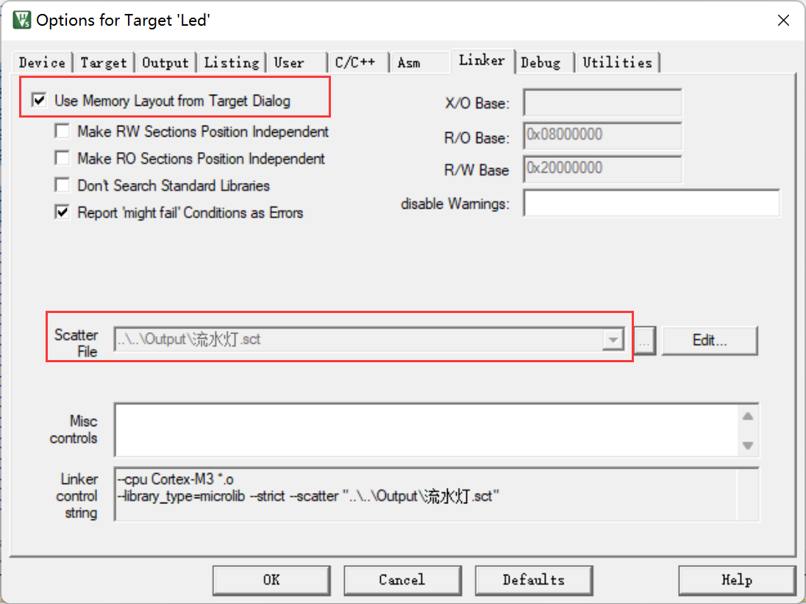
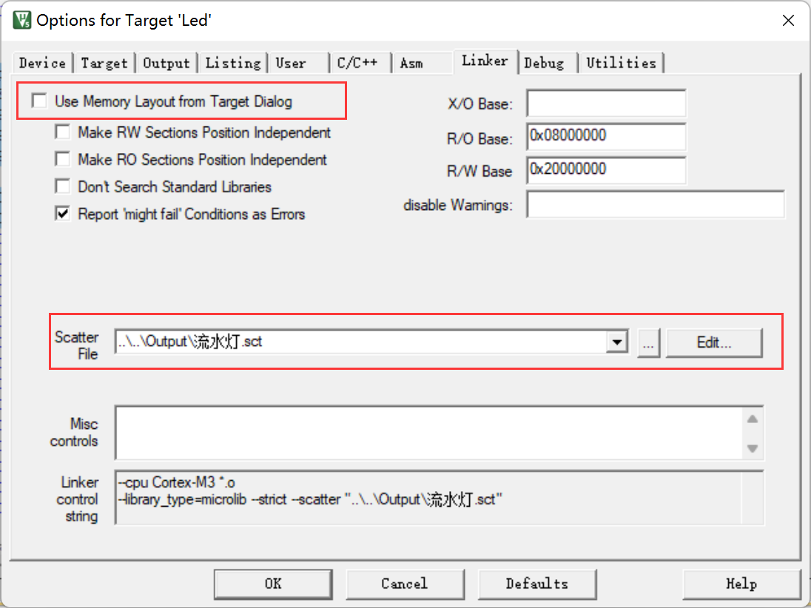
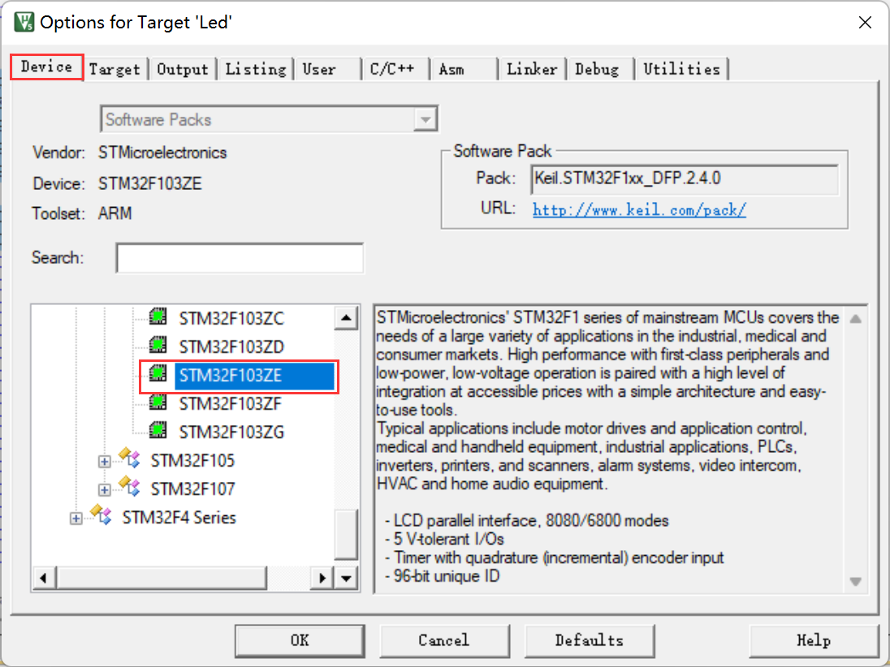
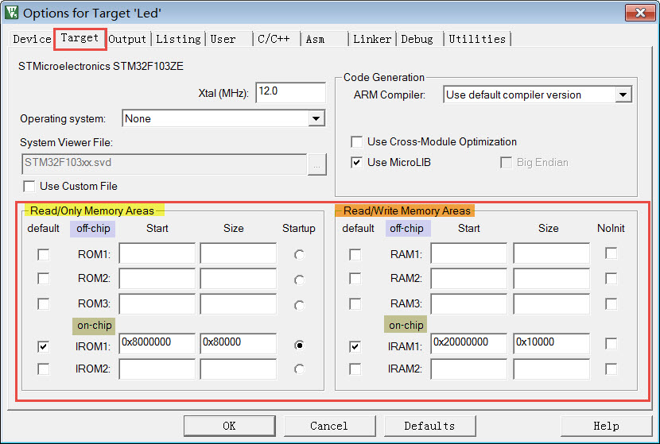
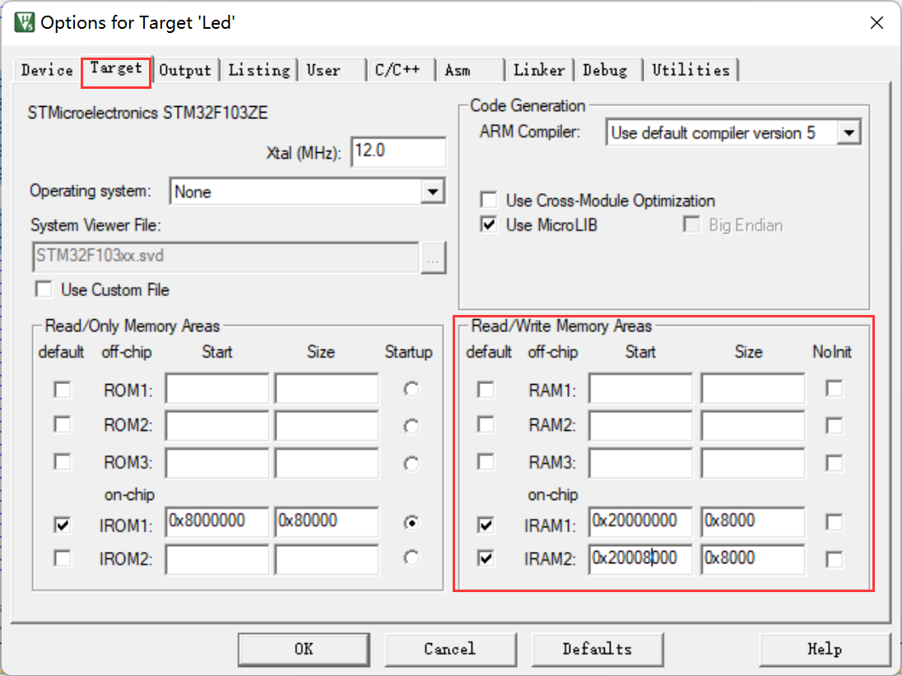
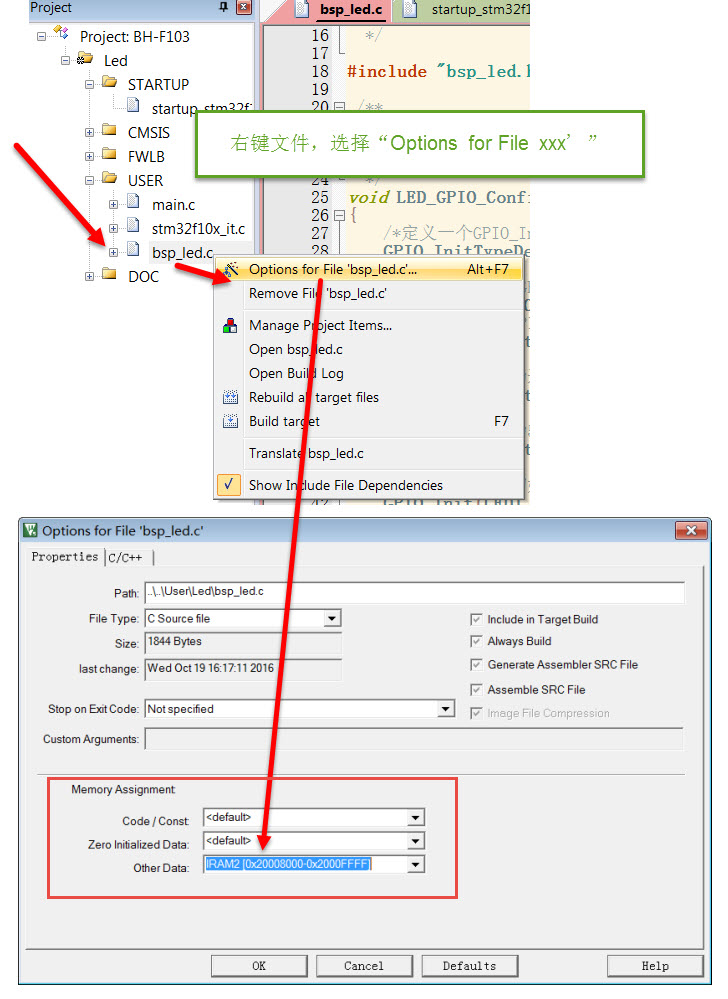
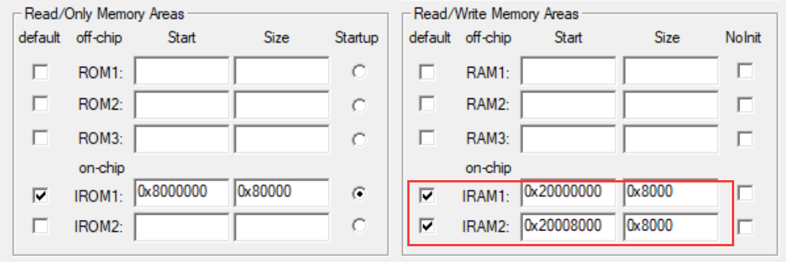
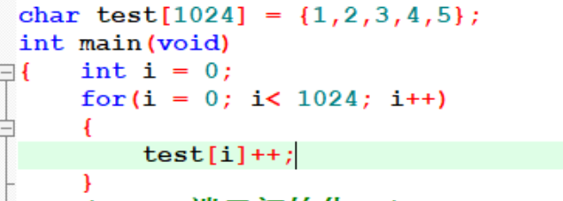
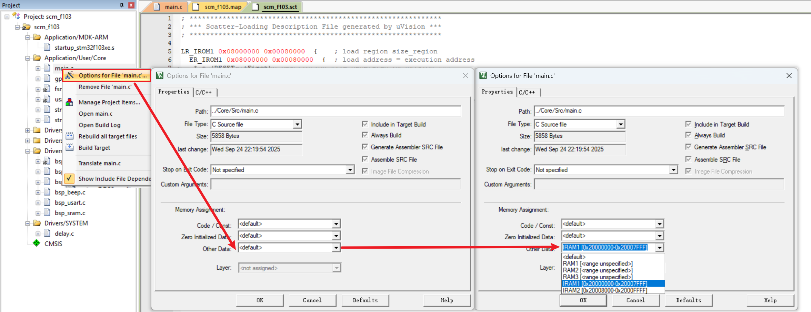

<!-- more -->

这里继续学习MDK的工程文件`*.sct`，使用的工程呢可以去这里下载：[ebf_stm32f103_badao_std_code: 野火STM32F103 霸道开发板 标准库教程配套代码 (gitee.com)](https://gitee.com/Embedfire-stm32f103-badao/ebf_stm32f103_badao_std_code)

>链接: [程序](https://pan.baidu.com/s/1Uq_kTrjQWxPYFQ00HoxN1Q?pwd=gryg) 提取码: gryg 

## 一、sct分散加载文件简介

当工程按默认配置构建时，MDK会根据我们选择的芯片型号，获知芯片的内部FLASH及内部SRAM存储器概况，生成一个以工程名命名的后缀为\*.sct的分散加载文件(Linker Control File，scatter loading)，**链接器根据该文件的配置分配各个节区地址**，生成分散加载代码，因此我们通过修改该文件可以定制具体节区的存储位置。例如，我们可以设置源文件中定义的所有变量自动按地址分配到外部SRAM，这样就不需要再使用关键字“\_\_attribute\_\_”按具体地址来指定了。

利用它还可以控制代码的加载区与执行区的位置，例如可以把程序代码存储到单位容量价格便宜的NAND-FLASH中，但在NAND-FLASH中的代码是不能像内部FLASH的代码那样直接提供给内核运行的，这时可通过修改分散加载文件，把代码加载区设定为NAND-FLASH的程序位置，而程序的执行区设定为SRAM中的位置，这样链接器就会生成一个配套的分散加载代码，该代码会把NAND-FLASH中的代码加载到SRAM中，内核再从SRAM中运行主体代码，大部分运行Linux系统的代码都是这样加载的。

## 二、文件基本格式

### 1. 格式说明

下面先来看看MDK默认使用的sct文件，在Output目录下可找到“流水灯.sct”：

```txt
// 默认的分散加载文件内容(“流水灯.sct”)
; *************************************************************
; *** Scatter-Loading Description File generated by uVision ***
; *************************************************************

LR_IROM1 0x08000000 0x00080000  {    ; load region size_region 加载域，基地址 空间大小
  ER_IROM1 0x08000000 0x00080000  {  ; load address = execution address 载地址 = 执行地址
   *.o (RESET, +First)
   *(InRoot$$Sections)
   .ANY (+RO)
   .ANY (+XO)
  }
  RW_IRAM1 0x20000000 0x00010000  {  ; RW data 可读写数据
   .ANY (+RW +ZI)
  }
}
```

在默认的sct文件配置中仅分配了Code、RO-data、RW-data及ZI-data这些大区域的地址，链接时各个节区(函数、变量等)直接根据属性排列到具体的地址空间。

sct文件中主要包含描述加载域及执行域的部分，一个文件中可包含有多个加载域，而一个加载域可由多个部分的执行域组成。同 等级的域之间使用花括号“{ }”分隔开，最外层的是加载域，第二层“{ }”内的是执行域，其整体结构如下：


### 2. 加载域

sct文件的加载域格式如下：

```txt
//方括号中的为选填内容
加载域名 (基地址 | ("+" 地址偏移)) [属性列表] [最大容量]
"{"
   执行区域描述+
"}"
```

配合前面的分散加载文件内容，各部分介绍如下：

- 加载域名：名称，在map文件中的描述会使用该名称来标识空间。如本例中只有一个加载域，该域名为LR_IROM1。
- 基地址+地址偏移：这部分说明了本加载域的基地址，可以使用+号连接一个地址偏移，算进基地址中， 整个加载域以它们的结果为基地址。如本例中的加载域基地址为0x08000000，刚好是STM32内部FLASH的基地址。
- 属性列表：属性列表说明了加载域的是否为绝对地址、N字节对齐等属性，该配置是可选的。本例中没有描述加载域的属性。
- 最大容量：最大容量说明了这个加载域可使用的最大空间，该配置也是可选的，如果加上这个配置后， 当链接器发现工程要分配到该区域的空间比容量还大，它会在工程构建过程给出提示。本例中的加载域最大容量为0x00080000，即512KB，正是本型号STM32内部FLASH的空间大小，比如我们要是定义一个全局变量，一下子超过了512KB，空间不足的时候，编译器就会报错。

### 3. 执行域

sct文件的执行域格式：

```txt
//方括号中的为选填内容
执行域名 (基地址 | "+" 地址偏移) [属性列表] [最大容量 ]
"{"
   输入节区描述
"}"
```

执行域的格式与加载域是类似的，区别只是输入节区的描述有所不同，在上边流水灯.sct例子中包含了ER_IROM1及RW_IRAM两个执行域，它们分别对应描述了STM32的 内部FLASH及内部SRAM的基地址及空间大小。而它们内部的“输入节区描述”说明了哪些节区要存储到这些空间，链接器会根据它来处理编排这些节区。

### 4. 输入节区描述

配合加载域及执行域的配置，在相应的域配置“输入节区描述”即可控制该节区存储到域中，其格式如下：

```txt
//除模块选择样式部分外，其余部分都可选选填
模块选择样式"("输入节区样式",""+"输入节区属性")"
模块选择样式"("输入节区样式",""+"节区特性")"

模块选择样式"("输入符号样式",""+"节区特性")"
模块选择样式"("输入符号样式",""+"输入节区属性")"
```

配合前面流水灯.sct中的分散加载文件内容，各部分介绍如下：

- 模块选择样式：模块选择样式可用于选择o及lib目标文件作为输入节区，它可以直接使用目标文件名或“\*”通配符， 也可以使用“.ANY”。例如，使用语句“bsp_led.o”可以选择bsp_led.o文件，使用语句“\*.o”可以选择所有o文件，使用“\*.lib”可以选择所有lib文件，使用“\*”或“.ANY”可以选择所有的o文件及lib文件。其中“.ANY”选择语句的优先级是最低的，所有其它选择语句选择完剩下的数据才会被“.ANY”语句选中。
- 输入节区样式：我们知道在目标文件中会包含多个节区或符号，通过输入节区样式可以选择要控制的节区。示例文件中“(RESET，+First)”语句的RESET就是输入节区样式，它选择了名为RESET的节区，并使用后面介绍的节区特性控制字“+First”表示它要存储到本区域的第一个地址。示例文件中的“\*(InRoot\$\$Sections)”是一个链接器支持的特殊选择符号，它可以选择所有HAL库里要求存储到root区域的节区，如\_\_main.o、\_\_scatter\*.o等内容。

- 输入符号样式：同样地，使用输入符号样式可以选择要控制的符号，符号样式需要使用“:gdef:”来修饰。 例如可以使用“\*(:gdef:Value_Test)”来控制选择符号“Value_Test”。
- 输入节区属性：通过在模块选择样式后面加入输入节区属性，可以选择样式中不同的内容，每个节区属性描述符前要写一个“+”号， 使用空格或“，”号分隔开。可以使用的节区属性描述符如下：

| 节区属性描述符 | 说明                    |
| -------------- | ----------------------- |
| RO-CODE及CODE  | 只读代码段              |
| RO-DATA及CONST | 只读数据段              |
| RO及TEXT       | 包括RO-CODE及RO-DATA    |
| RW-DATA        | 可读写数据段            |
| RW-CODE        | 可读写代码段            |
| RW及DATA       | 包括RW-DATA及RW-CODE    |
| ZI及BSS        | 初始化为0的可读写数据段 |
| XO             | 只可执行的区域          |
| ENTRY          | 节区的入口点            |

例如，示例文件中使用“.ANY(+RO)”选择剩余所有节区RO属性的内容都分配到执行域ER_IROM1中，使用“.ANY(+RW +ZI)”选择剩余所有节区RW及ZI属性的内容都分配到执行域RW_IRAM1中。

- 节区特性：节区特性可以使用“+FIRST”或“+LAST”选项配置它要存储到的位置，FIRST存储到区域的头部，LAST存储到尾部。 通常重要的节区会放在头部，比如中断向量表，而CheckSum(校验和)之类的数据会放在尾部。例如流水灯.sct文件中使用“(RESET,+First)”选择了RESET节区，并要求把它放置到本区域第一个位置，而RESET是工程启动代码中定义的向量表，该向量表中定义的堆栈顶和复位向量指针必须要存储在内部FLASH的前两个地址，这样STM32才能正常启动，所以必须使用FIRST控制它们存储到首地址。

```assembly
; Vector Table Mapped to Address 0 at Reset
                AREA    RESET, DATA, READONLY
                EXPORT  __Vectors
                EXPORT  __Vectors_End
                EXPORT  __Vectors_Size

__Vectors       DCD     __initial_sp               ; Top of Stack
                DCD     Reset_Handler              ; Reset Handler
```

总的来说，我们的sct示例文件配置如下：程序的加载域为内部FLASH的0x08000000，最大空间为0x00080000；程序的执行基地址与加载基地址相同，其中RESET节区定义的向量表要存储在内部FLASH的首地址，且所有o文件及lib文件的RO属性内容都存储在内部FLASH中；程序执行时RW及ZI区域都存储在以0x20000000为基地址，大小为0x00010000的空间(64KB)，这部分正好是STM32内部主SRAM的大小。

链接器根据sct文件链接，链接后各个节区、符号的具体地址信息可以在map文件中查看。需要注意，当有多个执行域的时候，STM32在分配变量的时候会优先选择容量较大的执行域进行分配，除非我们直接指定了某些文件必须在某个执行域。

## 三、通过MDK配置选项来修改sct文件

了解sct文件的格式后，可以手动编辑该文件控制整个工程的分散加载配置，但sct文件格式比较复杂，所以MDK提供了相应的配置选项可以方便地修改该文件，这些选项配置能满足基本的使用需求。

### 1. 选择sct文件的产生方式

首先需要选择sct文件产生的方式，选择使用MDK生成还是使用用户自定义的sct文件。在MDK的“【Options for Target】&rarr;【Linker】&rarr;【Use Memory Layout from Target Dialog】”选项即可配置该选择：



该选项为“是否使用Target对话框中的存储器分布配置”，勾选后，它会根据“Options for Target”对话框中的选项生成sct文件，这种情况下，即使我们手动打开它生成的sct文件编辑也是无效的，因为每次构建工程的时候，MDK都会生成新的sct文件覆盖旧文件。该选项在MDK中是默认勾选的，若希望MDK使用我们手动编辑的sct文件构建工程，需要取消勾选，并通过Scatter File框中指定sct文件的路径：



### 2. 通过Target对话框控制存储器分配

若我们在Linker中勾选了“使用Target对话框的存储器布局”选项，那么“Options for Target”对话框中的存储器配置就生效了。主要配置是在Device标签页中选择芯片的类型，设定芯片基本的内部存储器信息以及在Target标签页中细化具体的 存储器配置(包括外部存储器)：



图中Device标签页中选定了芯片的型号为STM32F103ZE，选中后，在Target标签页中的存储器信息会根据芯片更新。



在Target标签页中存储器信息分成只读存储器(Read/Only Memory Areas)和可读写存储器(Read/Write Memory Areas)两类，即ROM和RAM，而且它们又细分成了片外存储器(off-chip)和片内存储器(on-chip)两类。

例如，由于我们已经选定了芯片的型号，MDK会自动根据芯片型号填充片内的ROM及RAM信息，其中的IROM1起始地址为0x80000000，大小为0x80000，正是该STM32型号的内部FLASH地址及大小；而IRAM1起始地址为0x20000000，大小为0x10000，正是该STM32内部主SRAM的地址及大小。图中的IROM1及IRAM1前面都打上了勾，表示这个配置信息会被采用，若取消勾选，则该存储配置信息是不会被使用的。

在某些芯片，会有多个内部SRAM空间，如STM32F429系列。它会在标签页中的IRAM2一栏默认也填写了配置信息，设置STM32F4系列特有的内部高速SRAM(被称为CCM)。

而如果希望设置外部SRAM空间，可以把外部SRAM的信息写到对话框里“off-chip”的“RAM1”配置中。

下面我们尝试修改Target标签页中的这些存储信息，例如，把STM32内部的SRAM分成两等份，按照下图中的配置，把IRAM1的基地址设置为0x20000000，大小改为0x8000，把IRAM2的基地址设置为0x20008000，大小为0x8000：



>[scm-dev: 90-MDK编译过程及文件全解/01-SCT-demo/01-divided-internal-SRAM](https://gitee.com/embedded-devs/scm-dev/tree/master/90-MDK编译过程及文件全解/01-SCT-demo/01-divided-internal-SRAM)

然后编译工程， 查看到工程的sct文件如下所示：

```txt
; *************************************************************
; *** Scatter-Loading Description File generated by uVision ***
; *************************************************************

LR_IROM1 0x08000000 0x00080000  {    ; load region size_region
  ER_IROM1 0x08000000 0x00080000  {  ; load address = execution address
   *.o (RESET, +First)
   *(InRoot$$Sections)
   .ANY (+RO)
   .ANY (+XO)
  }
  RW_IRAM1 0x20000000 0x00008000  {  ; RW data
   .ANY (+RW +ZI)
  }
  RW_IRAM2 0x20008000 0x00008000  {
   .ANY (+RW +ZI)
  }
}
```

虽然修改后IRAM1和IRAM2加起来还是原来的内部SRAM空间，但它演示了对Target选项的修改是如何影响sct文件的，我们也可以尝试其它配置，观察sct文件，以学习sct文件的语法。可以发现，sct文件根据Target标签页做出了相应的改变，除了这种修改外，在Target标签页上还控制同时使用IRAM1和IRAM2、加入外部RAM(如外接的SRAM)，外部FLASH等。当RW_IRAM1空间用完后，会自动使用RW_IRAM2。

### 3. 控制文件分配到指定的存储空间

>[scm-dev: 90-MDK编译过程及文件全解/01-SCT-demo/02-config-file-memory](https://gitee.com/embedded-devs/scm-dev/tree/master/90-MDK编译过程及文件全解/01-SCT-demo/02-config-file-memory)

#### 3.1 操作步骤

设定好存储器的信息后，可以控制各个源文件定制到哪个部分存储器，在MDK的工程文件栏中，选中要配置的文件，右键，并在弹出的菜单中选择“Options for File xxxx”即可弹出一个文件配置对话框，在该对话框中进行存储器定制，如下图，使用右键打开文件配置并把它的RW区配置成使用IRAM2：



在弹出的对话框中有一个“Memory Assignment”区域(存储器分配)，在该区域中可以针对文件的各种属性内容进行分配，如Code/Const内容(RO)、Zero Initialized Data内容(ZI-data)以及Other Data内容(RW-data)，点击下拉菜单可以找到在前面**Target页面配置的IROM1、IRAM1、IRAM2等存储器**。例如图中我们把这个bsp_led.c文件的Other Data属性的内容分配到了IRAM2存储器(在Target标签页中我们勾选了IRAM1及IRAM2)，当在bsp_led.c文件定义了一些RW-data内容时(如初值非0的全局变量)， 该变量将会被分配到IRAM2空间，配置完成后点击OK，然后编译工程，查看到的sct文件内容如下：

```txt
; *************************************************************
; *** Scatter-Loading Description File generated by uVision ***
; *************************************************************

LR_IROM1 0x08000000 0x00080000  {    ; load region size_region
  ER_IROM1 0x08000000 0x00080000  {  ; load address = execution address
   *.o (RESET, +First)
   *(InRoot$$Sections)
   .ANY (+RO)
   .ANY (+XO)
  }
  RW_IRAM1 0x20000000 0x00008000  {  ; RW data
   .ANY (+RW +ZI)
  }
  RW_IRAM2 0x20008000 0x00008000  {
    bsp_led.o (+RW)
   .ANY (+RW +ZI)
  }
}
```

可以看到在sct文件中的RW_IRAM2执行域中增加了一个选择bsp_led.o中RW内容的语句。类似地，我们还可以设置某些文件的代码段被存储到特定的ROM中，或者设置某些文件使用的ZI-data或RW-data存储到外部SRAM中(控制ZI-data到SDRAM时注意还需要修改启动文件设置堆栈对应的地址，原启动文件中的地址是指向内部SRAM的)。

虽然MDK的这些存储器配置选项很方便，但有很多高级的配置还是需要手动编写sct文件实现的，例如MDK选项中的内部ROM选项最多只可以填充两个选项位置，若想把内部ROM分成多片地址管理就无法实现了；另外MDK配置可控的最小粒度为文件，若想控制特定的节区也需要直接编辑sct文件。

不过这个并不能体现出我们定义的一些东西确实被分配到了RW_TRAM2。

【注意】这里我们要是修改了某一个c文件中数据在执行域的位置的话，会有这样的变化，文件左下角会有一个雪花的符号。


#### 3.2 一个实例

- （1）前面我们通过MDK的Target面板修改sct文件如下：



我们重新编译后，生成的sct文件内容如下：

```txt
; *************************************************************
; *** Scatter-Loading Description File generated by uVision ***
; *************************************************************

LR_IROM1 0x08000000 0x00080000  {    ; load region size_region
  ER_IROM1 0x08000000 0x00080000  {  ; load address = execution address
   *.o (RESET, +First)
   *(InRoot$$Sections)
   .ANY (+RO)
   .ANY (+XO)
  }
  RW_IRAM1 0x20000000 0x00008000  {  ; RW data
   .ANY (+RW +ZI)
  }
  RW_IRAM2 0x20008000 0x00008000  {
    bsp_led.o (+RW)
   .ANY (+RW +ZI)
  }
}

```

- （2）我们在main.c中定一个全局数组，并在main.c中使用一下，防止被编译器优化



- （3）我们编译一下，查看map文件中这个全局数组的地址（在Image Symbol Table部分）


可以看到这个数组是存储在0x20008000这个位置的，也就是说这个变量被定义在了RW_IRAM1区域。

``` txt
  RW_IRAM2 0x20008000 0x00008000  {
    bsp_led.o (+RW)
   .ANY (+RW +ZI)
  }
```

- （4）通过【main.c】&rarr;【右键】&rarr;【Options for File main.c】&rarr;【OtherData】&rarr;【IRAM2 [0x20000000-0x20007FFF]】



然后我们重新编译工程，生成的sct文件如下：

```txt
; *************************************************************
; *** Scatter-Loading Description File generated by uVision ***
; *************************************************************

LR_IROM1 0x08000000 0x00080000  {    ; load region size_region
  ER_IROM1 0x08000000 0x00080000  {  ; load address = execution address
   *.o (RESET, +First)
   *(InRoot$$Sections)
   .ANY (+RO)
   .ANY (+XO)
  }
  RW_IRAM1 0x20000000 0x00008000  {  ; RW data
    main.o (+RW)
   .ANY (+RW +ZI)
  }
  RW_IRAM2 0x20008000 0x00008000  {
    bsp_led.o (+RW)
   .ANY (+RW +ZI)
  }
}


```

我们会发现RW_IRAM1多了一个  main.o (+RW)。

- （5）查看map文件，找到test数组的定义地址：


我们发现，这个数组已经被定义到0x20000000为起始的区域中了。


> 参考文档：
>
> [46. MDK的编译过程及文件类型全解](https://doc.embedfire.com/mcu/stm32/f103badao/std/zh/latest/book/MDK.html)
