<!-- more -->

这一篇笔记主要是通过SCT文件来实现变量的分配位置，这里需要后边FSMC驱动SRAM的知识。由于内存管理对应用程序非常重要，若修改 sct 文件，不使用默认配置，对工程影响非常大，容易导致出错，所以我们这里也是跟着教程做了两个实验，来学习 sct 文件的应用细节。

>链接: [程序](https://pan.baidu.com/s/1Uq_kTrjQWxPYFQ00HoxN1Q?pwd=gryg) 提取码: gryg 

## 一、自定义SCT文件

注意这里我们要根据上一节笔记，取消MDK使用默认的SCT文件。

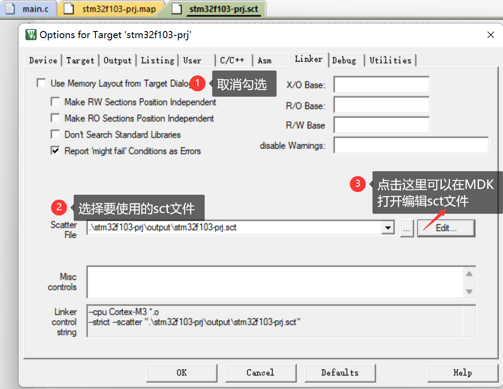

在 MDK 的“【Options for Target】&rarr;【Linker】&rarr;【Use Memory Layout from Target Dialog】”选项被取消勾选，取消勾选后可直接点击“Edit”按钮编辑工程的 sct 文件，也可到工程目录下打开编辑 。我们先回顾一下程序中各部分的类别：

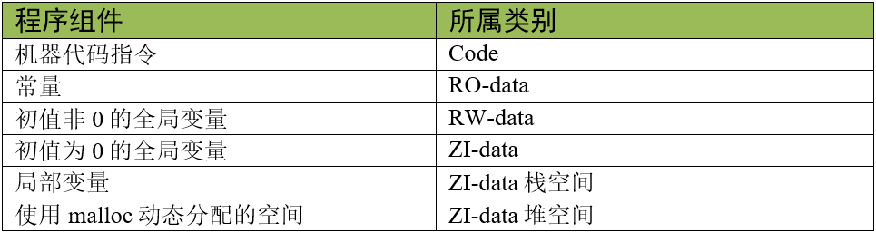

## 二、将内部SRAM一分为二

我们先来做这样一个实验，就是将内部的64KB SRAM分为两部分，然后来将定义的变量分配到指定的地址区间。

### 1. 默认选择最大内存的区域测试

#### 1.1 测试代码

我们定义一个全局变量和数组，还有一个局部变量，还有一个堆区的变量（通过malloc分配），如下所示：

```c
#include <stdlib.h>
uint32_t testValue = 129;
uint8_t testGroup[20] = {45, 65, 78, 54, 121};

int main(void)
{


    HAL_Init();
    SystemClock_Config();
    MX_GPIO_Init();
    MX_USART1_UART_Init();
    MX_FSMC_Init();

    testValue ++;
    testGroup[0]++;
    printf("testValue:0x%0X %d\r\n", (unsigned int)&testValue, testValue);
    printf("testGroup:0x%0X %d\r\n", (unsigned int)testGroup, testGroup[0]);

    uint8_t inerTestValue = 19;
    inerTestValue++;
    printf("inerTestValue:0x%0X %d\r\n", (unsigned int)&inerTestValue, inerTestValue);
	
	uint8_t *p;
	p = (uint8_t *)malloc(20);
	*p = 50;
	printf("p:0x%0X %d\r\n", (unsigned int)p, *p);

    while (1)
    {
        LED0 = !LED0;
        LED1 = !LED1;
        HAL_Delay(500);
    }
}
```

完整工程可以查看:[90-MDK编译过程及文件全解/01-SCT-demo/05-own-divided-internal-SRAM/MDK-ARM/sct/default-divides.sct](https://gitee.com/embedded-devs/scm-dev/blob/master/90-MDK编译过程及文件全解/01-SCT-demo/05-own-divided-internal-SRAM/MDK-ARM/sct/default-divides.sct)

#### 1.2 sct文件修改

我们将sct文件修改成如下内容：

```c
; *************************************************************
; *** Scatter-Loading Description File generated by uVision ***
; *************************************************************

LR_IROM1 0x08000000 0x00080000  {    ; load region size_region
  ER_IROM1 0x08000000 0x00080000  {  ; load address = execution address
   *.o (RESET, +First)
   *(InRoot$$Sections)
   .ANY (+RO)
   .ANY (+XO)
  }
  RW_IRAM1 0x20000000 0x00005000  {  ; RW data 内部 SRAM 区域1 20KB
   .ANY (+RW +ZI)                    ; 所有的 RW/ZI-data 都分配到这里
  }
  RW_IRAM2 0x20005000 0x00007000  {  ; RW data 内部 SRAM 区域2 28KB
   .ANY (+RW +ZI)                    ; 所有的 RW/ZI-data 都分配到这里
  }
}
```

#### 1.3 结果分析

我们的sct文件中执行域是这样的：

```c
  RW_IRAM1 0x20000000 0x00005000  {  ; RW data 内部 SRAM 区域1 20KB
   .ANY (+RW +ZI)                    ; 所有的 RW/ZI-data 都分配到这里
  }
  RW_IRAM2 0x20005000 0x00007000  {  ; RW data 内部 SRAM 区域2 28KB
   .ANY (+RW +ZI)                    ; 所有的 RW/ZI-data 都分配到这里
  }
```

这里没有规定栈区，堆区以及一些特定的变量要分配在哪，而且第二块区域明显比第一块区域大，所以我们分配变量的时候优先在第二块区域，并且栈区和堆区也将会在第二块区域，我们来看一下打印信息：

```c
testValue:0x20005000 130
testGroup:0x20005004 46
inerTestValue:0x20005768 20
p:0x20005188 50
```

可以看到全局变量以及全局变量数组，包括栈区的局部变量还有malloc申请的堆区都被分配在了0x20005000之后的区域了。

#### 1.4 map文件分析

我们再来看看map文件的Memory Map of the image部分，就会发现这里多了一个执行域啦。而且注意RW_IRAM1中没有分配任何东西。

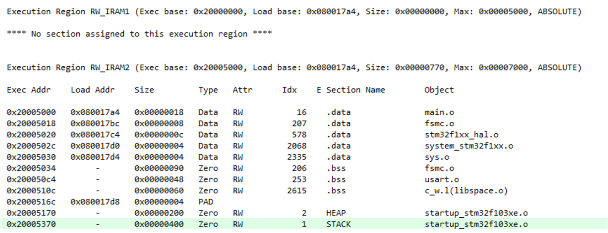

我们可以看到，栈区和堆区也都被自动分配在了较大的RW_IRAM2中。

### 2. 定义栈区到指定内存的区域

#### 2.1 测试代码

栈区的测试主要是通过局部变量的地址来看，如下所示：

```c
#include <stdlib.h>
uint32_t testValue = 129;
uint8_t testGroup[20] = {45, 65, 78, 54, 121};

int main(void)
{


    HAL_Init();
    SystemClock_Config();
    MX_GPIO_Init();
    MX_USART1_UART_Init();
    MX_FSMC_Init();

    testValue ++;
    testGroup[0]++;
    printf("testValue:0x%0X %d\r\n", (unsigned int)&testValue, testValue);
    printf("testGroup:0x%0X %d\r\n", (unsigned int)testGroup, testGroup[0]);

    uint8_t inerTestValue = 19;
    inerTestValue++;
    printf("inerTestValue:0x%0X %d\r\n", (unsigned int)&inerTestValue, inerTestValue);
	
	uint8_t *p;
	p = (uint8_t *)malloc(20);
	*p = 50;
	printf("p:0x%0X %d\r\n", (unsigned int)p, *p);

    while (1)
    {
        LED0 = !LED0;
        LED1 = !LED1;
        HAL_Delay(500);
    }
}
```

完整工程可以查看[90-MDK编译过程及文件全解/01-SCT-demo/05-own-divided-internal-SRAM/MDK-ARM/sct/stack.sct · embedded-devs/scm-dev](https://gitee.com/embedded-devs/scm-dev/blob/master/90-MDK编译过程及文件全解/01-SCT-demo/05-own-divided-internal-SRAM/MDK-ARM/sct/stack.sct)。

#### 2.2 sct文件修改

我们修改sct文件如下：

```c
; *************************************************************
; *** Scatter-Loading Description File generated by uVision ***
; *************************************************************

LR_IROM1 0x08000000 0x00080000  {    ; load region size_region
  ER_IROM1 0x08000000 0x00080000  {  ; load address = execution address
   *.o (RESET, +First)
   *(InRoot$$Sections)
   .ANY (+RO)
   .ANY (+XO)
  }
  RW_IRAM1 0x20000000 0x00005000  {  ; RW data 内部 SRAM 区域1 20KB
   *.o(STACK)                        ; 选择 STACK 节区，栈
   .ANY (+RW +ZI)                    ; 所有的 RW/ZI-data 都分配到这里
  }
  RW_IRAM2 0x20005000 0x00007000  {  ; RW data 内部 SRAM 区域2 28KB
   .ANY (+RW +ZI)                    ; 所有的 RW/ZI-data 都分配到这里
  }
}
```

#### 2.3 结果分析

我们的sct文件中执行域是这样的：

```c
  RW_IRAM1 0x20000000 0x00005000  {  ; RW data 内部 SRAM 区域1 20KB
   *.o(STACK)                        ; 选择 STACK 节区，栈
   .ANY (+RW +ZI)                    ; 所有的 RW/ZI-data 都分配到这里
  }
  RW_IRAM2 0x20005000 0x00007000  {  ; RW data 内部 SRAM 区域2 28KB
   .ANY (+RW +ZI)                    ; 所有的 RW/ZI-data 都分配到这里
  }
```

这里将栈区指定到RW_IRAM1，我们来看一下打印信息：

```c
testValue:0x20005000 130
testGroup:0x20005004 46
inerTestValue:0x200003F8 20
p:0x20005188 50
```

可以看到，局部变量inerTestValue被分配到了0x20000000起始的RW_IRAM1区域了。

#### 2.4 map文件分析

我们来看一下map文件的Memory Map of the image：

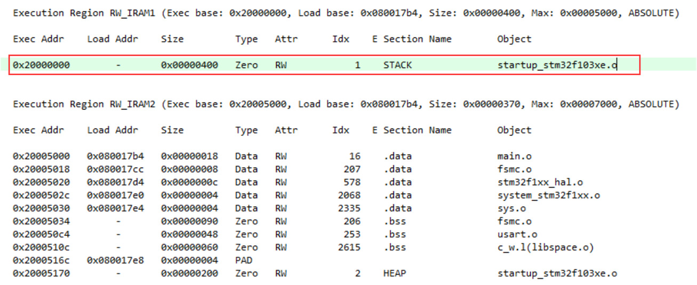

### 3. 定义堆区到指定的内存区域

前边我们已经看过了，当未指定HEAP的分配区域在哪个执行域的话，会优先使用最大的那个执行域。我们接下来看一下指定HEAP所在的执行域的情况。

#### 3.1 测试代码

```c
#include <stdlib.h>
uint32_t testValue = 129;
uint8_t testGroup[20] = {45, 65, 78, 54, 121};

int main(void)
{


    HAL_Init();
    SystemClock_Config();
    MX_GPIO_Init();
    MX_USART1_UART_Init();
    MX_FSMC_Init();

    testValue ++;
    testGroup[0]++;
    printf("testValue:0x%0X %d\r\n", (unsigned int)&testValue, testValue);
    printf("testGroup:0x%0X %d\r\n", (unsigned int)testGroup, testGroup[0]);

    uint8_t inerTestValue = 19;
    inerTestValue++;
    printf("inerTestValue:0x%0X %d\r\n", (unsigned int)&inerTestValue, inerTestValue);
	
	uint8_t *p;
	p = (uint8_t *)malloc(20);
	*p = 50;
	printf("p:0x%0X %d\r\n", (unsigned int)p, *p);

    while (1)
    {
        LED0 = !LED0;
        LED1 = !LED1;
        HAL_Delay(500);
    }
}
```

完整工程可以查看[90-MDK编译过程及文件全解/01-SCT-demo/05-own-divided-internal-SRAM/MDK-ARM/sct/heap.sct · embedded-devs/scm-dev](https://gitee.com/embedded-devs/scm-dev/blob/master/90-MDK编译过程及文件全解/01-SCT-demo/05-own-divided-internal-SRAM/MDK-ARM/sct/heap.sct)。

#### 3.2 sct文件修改

```c
; *************************************************************
; *** Scatter-Loading Description File generated by uVision ***
; *************************************************************

LR_IROM1 0x08000000 0x00080000  {    ; load region size_region
  ER_IROM1 0x08000000 0x00080000  {  ; load address = execution address
   *.o (RESET, +First)
   *(InRoot$$Sections)
   .ANY (+RO)
   .ANY (+XO)
  }
  RW_IRAM1 0x20000000 0x00005000  {  ; RW data 内部 SRAM 区域1 20KB
   *.o(STACK)                        ; 选择 STACK 节区，栈
   *.o(HEAP)                         ; 选择 HEAP 节区，堆
   .ANY (+RW +ZI)                    ; 所有的 RW/ZI-data 都分配到这里
  }
  RW_IRAM2 0x20005000 0x00007000  {  ; RW data 内部 SRAM 区域2 28KB
   .ANY (+RW +ZI)                    ; 所有的 RW/ZI-data 都分配到这里
  }
}
```

#### 3.3 结果分析

我们的sct文件中执行域是这样的：

```c
  RW_IRAM1 0x20000000 0x00005000  {  ; RW data 内部 SRAM 区域1 20KB
   *.o(STACK)                        ; 选择 STACK 节区，栈
   *.o(HEAP)                         ; 选择 HEAP 节区，堆
   .ANY (+RW +ZI)                    ; 所有的 RW/ZI-data 都分配到这里
  }
  RW_IRAM2 0x20005000 0x00007000  {  ; RW data 内部 SRAM 区域2 28KB
   .ANY (+RW +ZI)                    ; 所有的 RW/ZI-data 都分配到这里
  }
```

这里将栈区指定到RW_IRAM1，我们来看一下打印信息：

```c
testValue:0x20005000 130
testGroup:0x20005004 46
inerTestValue:0x200005F8 20
p:0x20000018 50
```

可以看到，malloc申请的内存空间被分配到了0x20000000起始的RW_IRAM1区域了。

#### 3.4 map文件分析

我们再来看一下map文件：

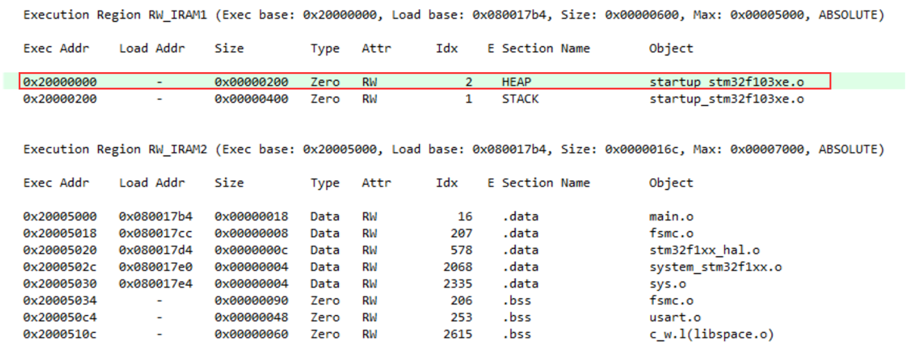

### 4. 自定义一个节区

\_\_attribute\_\_((section("section_name")))的方式可以将指定的变量定义到指定的内存区域去。这个时候我们需要在sct文件中创建一个这样的名为section_name的输入节区样式，需要注意的是当我们sct文件中没有这样一个输入节区的时候，他是会按照默认的情况选择最大的那个执行域的。

#### 4.1 测试代码

我们定义一个全局数组变量，并通过\_\_attribute\_\_((section("section_name")))的方式将其指定到对应的内存区域去。需要注意的是

```c
#include <stdlib.h>
uint32_t testValue = 129;
uint8_t testGroup[20] = {45, 65, 78, 54, 121};
//__attribute__((section("EXRAM")))
uint8_t EXtestGrup[1024] __attribute__((section("my_section"))) ={43,32,3};

int main(void)
{


    HAL_Init();
    SystemClock_Config();
    MX_GPIO_Init();
    MX_USART1_UART_Init();
    MX_FSMC_Init();

    testValue ++;
    testGroup[0]++;
    printf("testValue:0x%0X %d\r\n", (unsigned int)&testValue, testValue);
    printf("testGroup:0x%0X %d\r\n", (unsigned int)testGroup, testGroup[0]);

    uint8_t inerTestValue = 19;
    inerTestValue++;
    printf("inerTestValue:0x%0X %d\r\n", (unsigned int)&inerTestValue, inerTestValue);
	
	uint8_t *p;
	p = (uint8_t *)malloc(20);
	*p = 50;
	printf("p:0x%0X %d\r\n", (unsigned int)p, *p);

	EXtestGrup[0]++;
	printf("EXtestGrup:0x%0X %d\r\n", (unsigned int)EXtestGrup, EXtestGrup[0]);
    while (1)
    {
        LED0 = !LED0;
        LED1 = !LED1;
        HAL_Delay(500);
    }
}
```

完整工程可以查看[90-MDK编译过程及文件全解/01-SCT-demo/05-own-divided-internal-SRAM/MDK-ARM/sct/add_section.sct](https://gitee.com/embedded-devs/scm-dev/blob/master/90-MDK编译过程及文件全解/01-SCT-demo/05-own-divided-internal-SRAM/MDK-ARM/sct/add_section.sct)。

#### 4.2 sct文件修改

##### 4.2.1 默认情况

也就是不在sct文件中指定自定义输入节区的位置：

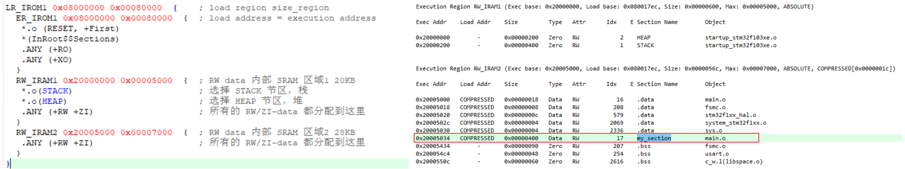

最终的打印结果为：

```c
testValue:0x20005000 130
testGroup:0x20005004 46
inerTestValue:0x200005F8 20
p:0x20000018 50
EXtestGrup:0x20005034 44
```

可以看到最后也是定义到了较大的执行域中。

##### 4.2.2 指定到较小的执行域

```c
; *************************************************************
; *** Scatter-Loading Description File generated by uVision ***
; *************************************************************

LR_IROM1 0x08000000 0x00080000  {    ; load region size_region
  ER_IROM1 0x08000000 0x00080000  {  ; load address = execution address
   *.o (RESET, +First)
   *(InRoot$$Sections)
   .ANY (+RO)
   .ANY (+XO)
  }
  RW_IRAM1 0x20000000 0x00005000  {  ; RW data 内部 SRAM 区域1 20KB
   *.o(STACK)                        ; 选择 STACK 节区，栈
   *.o(HEAP)                         ; 选择 HEAP 节区，堆
   *.o(my_section)                   ; 选择 my_section 节区，自定义节区
   .ANY (+RW +ZI)                    ; 所有的 RW/ZI-data 都分配到这里
  }
  RW_IRAM2 0x20005000 0x00007000  {  ; RW data 内部 SRAM 区域2 28KB
   .ANY (+RW +ZI)                    ; 所有的 RW/ZI-data 都分配到这里
  }
}
```

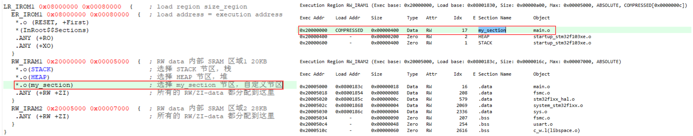

我们来看一下打印结果：

```c
testValue:0x20005000 130
testGroup:0x20005004 46
inerTestValue:0x200009F8 20
p:0x20000418 50
EXtestGrup:0x20000000 44
```

可以看到，自定义节区生效了，我们的数组定义到了较小的RW_IRAM1中。

## 三、选择性使用外部SRAM

我们知道外部SRAM是通过FSMC来驱动的，外部SRAM的访问速度肯定是没有内部SRAM高的，但是我们内部SRAM空间不够的时候，是完全可以使用外部SRAM的，可以选择性的把一些特别大的变量分配到外部。但是默认的情况还是分配到内部SRAM。

在后边我们学习SRAM的时候，需要读写 SRAM 存储的内容时，需要使用指针或者 \_\_attribute\_\_((at(具体地址)))  来指定变量的位置，当有多个这样的变量时，就需要手动计算地址空间了，非常麻烦在这一节中我们将修改 sct 文件，让链接器自动分配全局变量到外部 SRAM的地址并进行管理，这将会使得利用外部 SRAM 的空间就跟内部 SRAM 一样简单。 

### 1. SRAM初始化

在使用外部SRAM之前肯定是初始化外部SRAM啦，按照后边的笔记完成初始化即可。但是可能会有一些问题，我们来分析一下，就是我们知道程序运行的时候，会把ROM中的RW类型的数据拷贝到SRAM中去。

所以我想要把变量定义到外部SRAM去，比如我们定义了一个全局的数据testGroup[1024]，它就会被复制到SRAM中，若是指定它分配在外部的SRAM中的话，它将会被复制到外部的SRAM中。这个时候需要保证，在RW拷贝数据之前就将SRAM初始化好，不然我们都要进行数据拷贝了，但是还没有进行SRAM的初始化，这样我们的数据就会发生错误。所以我们需要在执行数据拷贝之前，就完成外部SRAM的初始化。


复制过程发生在哪里？其实前边我们有了解过，我们通过以下命令获取一个反汇编文件（还是使用野火的流水灯工程：[ebf_stm32f103_badao_std_code: 野火STM32F103 霸道开发板 标准库教程配套代码 (gitee.com)](https://gitee.com/Embedfire-stm32f103-badao/ebf_stm32f103_badao_std_code))：

> 或者用链接: [程序](https://pan.baidu.com/s/1Uq_kTrjQWxPYFQ00HoxN1Q?pwd=gryg) 提取码: gryg 中的流水灯工程也可以

```shell
PS D:\MyLinux\Ubuntu\Sharedfiles\3Linux\16-LV16\ebf_stm32f103_badao_std_code-master\46-MDK编译过程及文件全解\程序\MDK文
件详解-GPIO输出—多彩流水灯\Output> fromelf --text -c .\流水灯.axf --output ../elfInfo/流水灯_axf_elfInfo_c.txt
```

然后我们打开反汇编文件“流水灯\_axf\_elfInfo\_c.txt”的反汇编信息，可以看到到程序中具有一段名为“\_\_scatterload”的分散加载代码，它是由 armlink 链接器自动生成的，里边会有很多LDM指令，这些就是用于复制数据的：

```c
// 分散加载代码(流水灯_axf_elfInfo_c.txt文件)
    .text
    __scatterload
    __scatterload_rt2
        0x08000168:    4c06        .L      LDR      r4,[pc,#24] ; [0x8000184] = 0x80005c4
        0x0800016a:    4d07        .M      LDR      r5,[pc,#28] ; [0x8000188] = 0x80005d4
        0x0800016c:    e006        ..      B        0x800017c ; __scatterload + 20
        0x0800016e:    68e0        .h      LDR      r0,[r4,#0xc]
```

而LDM指令的操作数中包含了加载的源地址，这些地址中包含了内部FLASH存储的RW-data数据，执行这些指令后数据就会从FLASH地址加载到内部SRAM的地址。我们再来看一下这个文件的\_\_main的反汇编代码部分：

```txt
//__main的反汇编代码部分（流水灯_axf_elfInfo_c.txt文件）
    .ARM.Collect$$$$00000000
    .ARM.Collect$$$$00000001
    __Vectors_End
    __main
    _main_stk
        0x08000130:    f8dfd00c    ....    LDR      sp,__lit__00000000 ; [0x8000140] = 0x20000400
    .ARM.Collect$$$$00000004
    _main_scatterload
        0x08000134:    f000f818    ....    BL       __scatterload ; 0x8000168
```

可以看最后一行， “\_\_scatterload ”的代码会被“\_\_main”函数调用，\_\_main在启动文件中的“Reset\_Handler”会被调用，因而，在主体程序执行前，已经完成了分散加载过程。

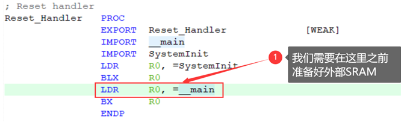

接下来就是修改我们的启动文件了，由于我使用的是STM32CubeMX生成的工程，在FSMC初始化之前就还需要一些时钟啊，之类的初始化，所以我干脆把这些必要的初始化全部移到启动文件中，他们执行完毕后再去main主函数。其实从这里就可以看出，main主函数无非也就是一个函数而已，我们完全可以在进入main之前做一些其他的事情：

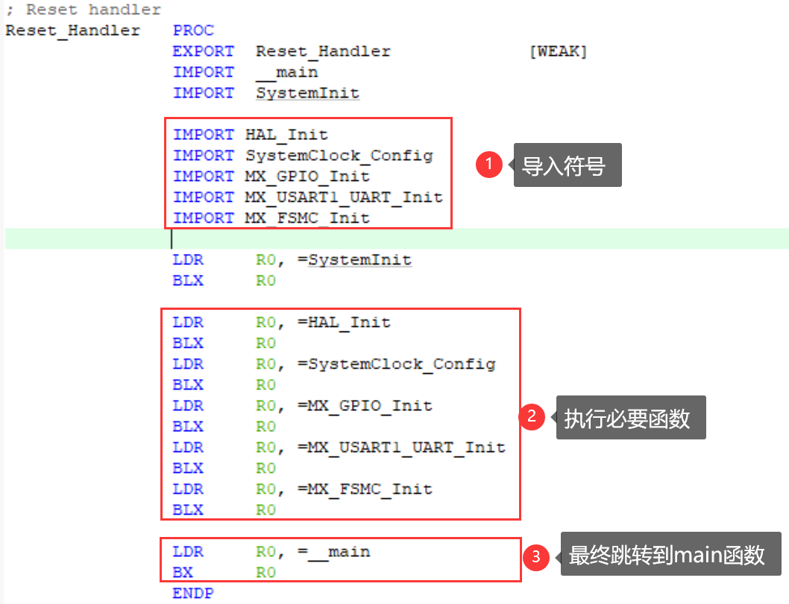

总的来说，芯片启动后，会通过 \_\_main 函数调用分散加载代码 \_\_scatterload，分散加载代码会把存储在 FLASH 中的 RW-data 复制到 RAM 中，然后在 RAM区开辟一块 ZI-data 的空间，并将其初始化为 0 值。所以在外部 SRAM 正常运转之前，分散加载过程复制到外部SRAM 中的数据都丢失了，因而在初始化外部 SRAM 之后，需要重新给变量赋值才能正常使用(即定义变量时的初值无效，在调用 FSMC_SRAM_Init 函数之后的赋值才有效)。  因此，为了保证在程序中定义到外部 SRAM中的变量能被正常初始化，我们需要在系统执行分散加载代码之前使外部 SRAM 存储器正常运转，使它能够正常保存数据。  

在原来的启动文件中增加FSMC初始化的代码（注意要包括完整的初始化过程），增加的代码中使用到汇编语法的 IMPOR引入在 sram.c 文件中定义的 MX_FSMC_Init函数，接着使用 LDR 指令加载函数的代码地址到寄存器 R0，最后使用 BLX R0 指令跳转到 MX_FSMC_Init的代码地址执行。以上代码实现了 Reset_handler 在执行 \_\_main 函数前先调用了我们自定义的 MX_FSMC_Init函数，从而为分散加载代码准备好正常的硬件工作环境。

### 2. 定义一个新的执行域

#### 2.1 不指定栈区

我们先来看这样会不会有问题：

```c
; *************************************************************
; *** Scatter-Loading Description File generated by uVision ***
; *************************************************************

LR_IROM1 0x08000000 0x00080000  {    ; load region size_region
  ER_IROM1 0x08000000 0x00080000  {  ; load address = execution address
   *.o (RESET, +First)
   *(InRoot$$Sections)
   .ANY (+RO)
   .ANY (+XO)
  }
  RW_IRAM1 0x20000000 0x00005000  {  ; RW data 内部 SRAM 区域1 20KB
   ;*.o(STACK)                        ; 选择 STACK 节区，栈
   *.o(HEAP)                         ; 选择 HEAP 节区，堆
   *.o(my_section)                   ; 选择 my_section 节区，自定义节区
   .ANY (+RW +ZI)                    ; 所有的 RW/ZI-data 都分配到这里
  }
  RW_IRAM2 0x20005000 0x00007000  {  ; RW data 内部 SRAM 区域2 28KB
   .ANY (+RW +ZI)                    ; 所有的 RW/ZI-data 都分配到这里
  }
  RW_IRAM3 0x68000000 0x00100000 {   ; RW data 外部 SRAM 区域 1MB
   .ANY (+RW +ZI)                    ; 所有的 RW/ZI-data 都分配到这里
  }
}
```

我们新增一个RW_IRAM3，地址就是我们外部SRAM的起始地址0x68000000，我们不指定栈区的位置，我们看一下map文件：

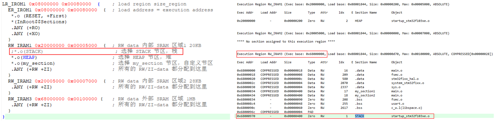

会发现，栈区自动被分配到了最大的执行域RW_IRAM3，而栈区里边都是什么?我们定义的局部变量啊什么的都是存在于栈区的，栈区属于ZI-data类型，它是要放在SRAM中才能正常工作。这样问题就来了，我们在启动文件中做初始化，就拿FSMC初始化为例，我们看一下里边的内容：

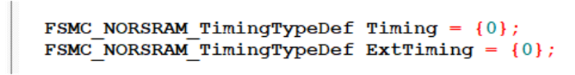

这不也都是大量的局部变量嘛？但是这个时候外部SRAM还没准备好啊，这样栈区就是不可用的，这些初始化直接就挂掉了，所以这样程序根本无法运行。这里就是一个"死循环"：FSMC初始化的时候要使用栈空间，但是栈空间又只能等FSMC初始化完外部SRAM才能分配到外部SRAM，这样就大家都在等，那这样肯定是跑不动的。

#### 2.2 指定栈区

那上边的问题怎么解决？我们知道内部的SRAM是直接就可用的，我们直接将栈区分配到内部SRAM就可以了啊，没必要把栈空间也放到外部SRAM的，所以我们可以这样修改scrt文件：

```c
; *************************************************************
; *** Scatter-Loading Description File generated by uVision ***
; *************************************************************

LR_IROM1 0x08000000 0x00080000  {    ; load region size_region
  ER_IROM1 0x08000000 0x00080000  {  ; load address = execution address
   *.o (RESET, +First)
   *(InRoot$$Sections)
   .ANY (+RO)
   .ANY (+XO)
  }
  RW_IRAM1 0x20000000 0x00005000  {  ; RW data 内部 SRAM 区域1 20KB
   *.o(STACK)                        ; 选择 STACK 节区，栈
   *.o(HEAP)                         ; 选择 HEAP 节区，堆
   *.o(my_section1)                  ; 选择 my_section1 节区，自定义节区
   .ANY (+RW +ZI)                    ; 所有的 RW/ZI-data 都分配到这里
  }
  RW_IRAM2 0x20005000 0x00007000  {  ; RW data 内部 SRAM 区域2 28KB
   .ANY (+RW +ZI)                    ; 所有的 RW/ZI-data 都分配到这里
  }
  RW_IRAM3 0x68000000 0x00100000 {   ; RW data 外部 SRAM 区域 1MB
   *.o(my_section2)                  ; 选择 my_section2 节区，自定义节区
   .ANY (+RW +ZI)                    ; 所有的 RW/ZI-data 都分配到这里
  }
}
```

这样我们将栈空间和自定义的节区my_section1都定义到内部SRAM，然后定义一个新的节区my_section2放到外部SRAM中去。但是这样写还是会有问题的，这里依然跑不动程序，这一掉部分只修改栈区位置，下一部分笔记再解决另一个问题。

【注意】其实我们还有一个办法，那就是直接操作寄存器，因为我们直接去动寄存器的话，就不会有局部变量这些啦。

#### 2.3 只指定特定的变量到外部SRAM

我们看一下上一个指定栈区后的遗留问题：

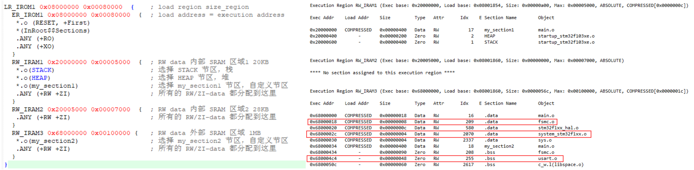

我们看一下这种写法有什么问题，我们在RW_IRAM3中写了.ANY(+RW +ZI)，这就意味着我们的RW-data和ZI-data将会也优先分配到这里，这两种类型里边的都是一些全局变量，我们在调用\_\_main之前还调用了那么多函数，特别是在STM32CubeMX中，它在初始化时钟和串口以及FSMC的时候都在用全局变量，这样的话，不就和栈区一样，陷入死循环了吗？我们其实只是有需要的时候将变量定义到外部SRAM，所以我们完全可以只分配使用我们自定义的节区的变量到外部SRAM区，我们可以修改sct文件如下：

```c
; *************************************************************
; *** Scatter-Loading Description File generated by uVision ***
; *************************************************************

LR_IROM1 0x08000000 0x00080000  {    ; load region size_region
  ER_IROM1 0x08000000 0x00080000  {  ; load address = execution address
   *.o (RESET, +First)
   *(InRoot$$Sections)
   .ANY (+RO)
   .ANY (+XO)
  }
  RW_IRAM1 0x20000000 0x00005000  {  ; RW data 内部 SRAM 区域1 20KB
   *.o(STACK)                        ; 选择 STACK 节区，栈
   *.o(HEAP)                         ; 选择 HEAP 节区，堆
   *.o(my_section1)                  ; 选择 my_section1 节区，自定义节区
   .ANY (+RW +ZI)                    ; 所有的 RW/ZI-data 都分配到这里
  }
  RW_IRAM2 0x20005000 0x00007000  {  ; RW data 内部 SRAM 区域2 28KB
   .ANY (+RW +ZI)                    ; 所有的 RW/ZI-data 都分配到这里
  }
  RW_IRAM3 0x68000000 0x00100000 {   ; RW data 外部 SRAM 区域 1MB
   *.o(my_section2)                  ; 选择 my_section2 节区，自定义节区
  }
}
```

然后我们再看一下map文件：

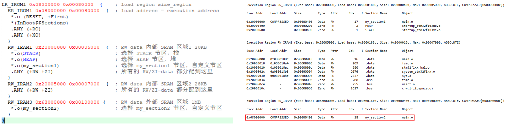

这样我们就只有使用了自定义节区的变量才会定义到外部SRAM中。

#### 2.4 堆空间

我们知道堆空间是通过malloc来分配的，而在我们外部SRAM初始化完成之前的哪些部分中并没有用到堆空间，所以我们完全可以把堆空间直接定义到外部SRAM中去：

```c
; *************************************************************
; *** Scatter-Loading Description File generated by uVision ***
; *************************************************************

LR_IROM1 0x08000000 0x00080000  {    ; load region size_region
  ER_IROM1 0x08000000 0x00080000  {  ; load address = execution address
   *.o (RESET, +First)
   *(InRoot$$Sections)
   .ANY (+RO)
   .ANY (+XO)
  }
  RW_IRAM1 0x20000000 0x00005000  {  ; RW data 内部 SRAM 区域1 20KB
   *.o(STACK)                        ; 选择 STACK 节区，栈
   *.o(my_section1)                  ; 选择 my_section1 节区，自定义节区
   .ANY (+RW +ZI)                    ; 所有的 RW/ZI-data 都分配到这里
  }
  RW_IRAM2 0x20005000 0x00007000  {  ; RW data 内部 SRAM 区域2 28KB
   .ANY (+RW +ZI)                    ; 所有的 RW/ZI-data 都分配到这里
  }
  RW_IRAM3 0x68000000 0x00100000 {   ; RW data 外部 SRAM 区域 1MB
   *.o(my_section2)                  ; 选择 my_section2 节区，自定义节区
   *.o(HEAP)                         ; 选择 HEAP 节区，堆
  }
}
```


### 3. 测试代码

```c
#include <stdlib.h>
uint32_t testValue = 129;
uint8_t testGroup[20] = {45, 65, 78, 54, 121};
//__attribute__((section("EXRAM")))
uint8_t EXtestGrup1[1024] __attribute__((section("my_section1"))) ={43,32,3};

uint8_t EXtestGrup2[1024] __attribute__((section("my_section2"))) ={43,32,3};

int main(void)
{

    testValue ++;
    testGroup[0]++;
    printf("testValue:0x%0X %d\r\n\r\n", (unsigned int)&testValue, testValue);
    printf("testGroup:0x%0X %d\r\n\r\n", (unsigned int)testGroup, testGroup[0]);

    uint8_t inerTestValue = 19;
    inerTestValue++;
    printf("inerTestValue:0x%0X %d\r\n\r\n", (unsigned int)&inerTestValue, inerTestValue);
	
	uint8_t *p;
	p = (uint8_t *)malloc(20);
	*p = 50;
	printf("p:0x%0X %d\r\n\r\n", (unsigned int)p, *p);

	EXtestGrup1[0]++;
	printf("EXtestGrup1:0x%0X %d\r\n\r\n", (unsigned int)EXtestGrup1, EXtestGrup1[0]);
	EXtestGrup2[0]++;
	printf("EXtestGrup2:0x%0X %d\r\n\r\n", (unsigned int)EXtestGrup2, EXtestGrup2[0]);
	
    while (1)
    {
        LED0 = !LED0;
        LED1 = !LED1;
        HAL_Delay(500);
    }
}
```

### 4. 结果分析

我们看一下打印的结果：

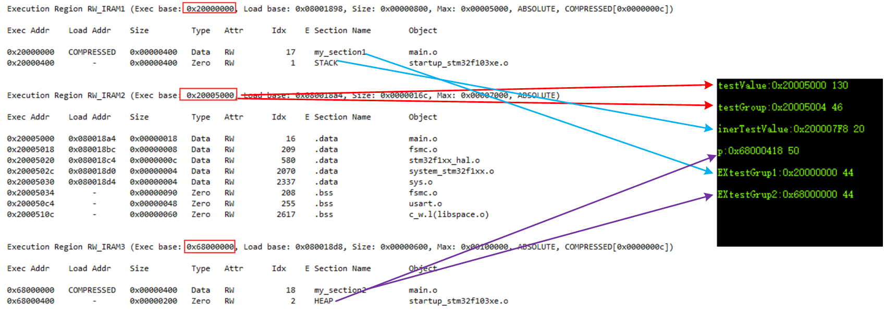

此时我们的sct文件的执行域是这样的：

```c
  RW_IRAM1 0x20000000 0x00005000  {  ; RW data 内部 SRAM 区域1 20KB
   *.o(STACK)                        ; 选择 STACK 节区，栈
   *.o(my_section1)                  ; 选择 my_section1 节区，自定义节区
   .ANY (+RW +ZI)                    ; 所有的 RW/ZI-data 都分配到这里
  }
  RW_IRAM2 0x20005000 0x00007000  {  ; RW data 内部 SRAM 区域2 28KB
   .ANY (+RW +ZI)                    ; 所有的 RW/ZI-data 都分配到这里
  }
  RW_IRAM3 0x68000000 0x00100000 {   ; RW data 外部 SRAM 区域 1MB
   *.o(my_section2)                  ; 选择 my_section2 节区，自定义节区
   *.o(HEAP)                         ; 选择 HEAP 节区，堆
  }
```


> 参考文档：
>
> [46. MDK的编译过程及文件类型全解](https://doc.embedfire.com/mcu/stm32/f103badao/std/zh/latest/book/MDK.html)
