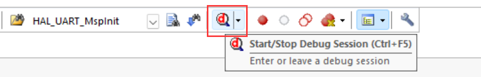
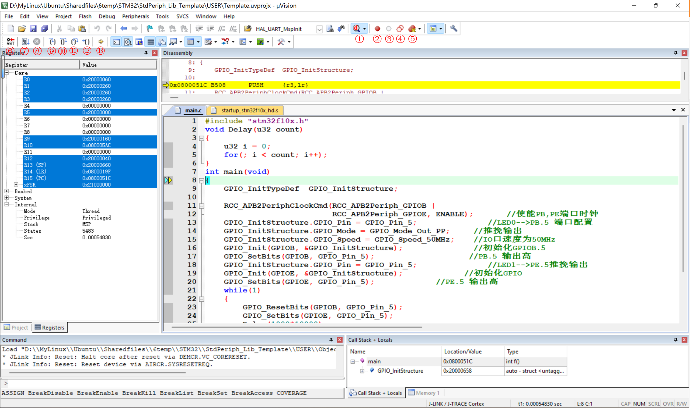
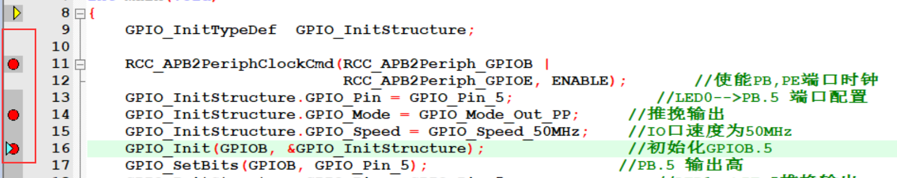

<!-- more -->

有了J-Link或者ST-Link，我们就可以在线调试代码，这里以我我使用的J-Link为例，简单介绍一下界面，后边的功能就自己摸索吧。

## 一、连接与配置

最开始肯定是连接好J-Link、电脑和开发板啦，然后就是MDK工程的配置，这个可以看前边J-Link的使用。

- [01-开发工具/10-下载与调试/LV002-JLink怎么使用.md](/sdoc/dev-tool/burn-and-debug/126b08ab15ee0921c4f7fd64)
- [01-开发工具/10-下载与调试/LV015-STLink怎么使用.md](/sdoc/dev-tool/burn-and-debug/126b08b9c98b11187c20e13a)

## 二、开始在线调试

### 1. 启动

我们可以点击工具栏的这个按钮进入调试，或者就是从菜单栏【Debug】&rarr;【Start/Stop Debug Session】启动：

然后我们就可以开始仿真，如果开发板的代码没被更新过，则会先更新代码（重新下载一遍），再仿真。特别注意：开发板（我使用的正点原子的战舰V3）上的 B0 和 B1 都设置到 GND，否则代码下载后不会自动运行的）。启动仿真后界面如下：

① Start/Stop Debug Seesion：开始/停止调试窗口， 用于进入调试窗口，进入后会新增一系列的按钮；

② Insert/Remove Breakpoint: 插入/移除断点， 在进入调试窗口后， 选中想暂停的代码位置，点击按钮就会在该行出现一个实心的小红点， 在调试时就会在该处暂停运行；

③ Enable/Disable Breakpoint： 使能/去能断点，在有断点的代码行， 点击按钮就会取消该断点功能，再次点击恢复该断点功能；

④ Disable All Breakpoints in current Target： 去能当前工程所有断点，保留了断点的位置，方便再次使能调试；

⑤ Kill All Breakpoints in current Target：清除当前工程所有断点， 整个工程不会再有任何断点；

⑥ Reset： 复位， 让程序从任一状态变为初始状态（ 跳到Reset Handler） ；

⑦ Run： 运行（快捷键F5） ， 让程序正常运行， 遇到断点会暂停在断点所在代码行；

⑧ Stop: 停止， 当程序在运行时，可以点击该按钮停止运行 ；

⑨ Step： 单步调试（快捷键F11） ， 每点击一下， 执行一条代码，遇到函数会跳进函数执行；

⑩ Step Over： 逐行调试（快捷键F10） ， 每点击一下，执行一行代码，遇到函数不会跳进函数执行；

⑪ Step Out： 跳出调试（快捷键Ctrl + F11）， 每点击一下， 跳出当前函数一次，直到跳到最外面的主函数（ main函数） ；

⑫ Run to Cursor Line： 跳到光标所在行调试（快捷键Ctrl + F10），点击一下， 运行到用户代码区的光标位置处停止，前提是光标所在位置能够执行；

⑬ Show Next Statement： 显示下一条语句， 当打开了多个文件，不知道程序暂停到何处，点击该按钮可以跳到暂停处；

注意： 每次修改代码后，都要按下Build（快捷键F7）， 重新编译修改后的代码， 这样调试的才是修改后的代码 。

### 2. 断点

我们可以在代码编辑框的左侧区域打断点，当当程序执行到断点处便会停下。
