<!-- more -->

## 一、STM32CubeMX

### 1. 简介

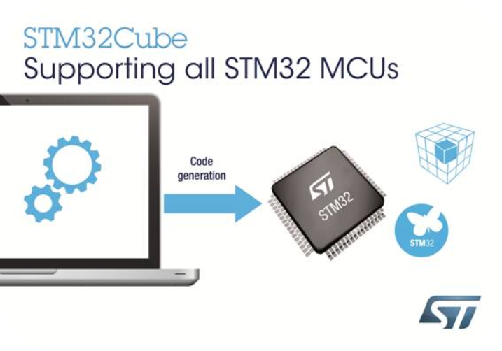

[STM32CubeMX](https://www.st.com.cn/zh/development-tools/stm32cubemx.html)是ST公司出品的一款C代码生成器软件，它是一种图形工具，通过分步过程可以非常轻松地配置STM32微控制器和微处理器，以及为Arm® Cortex®-M内核或面向Arm® Cortex®-A内核的特定Linux®设备树生成相应的初始化C代码。具有以下功能：

- 直观的STM32微控制器和微处理器选择
- 丰富易用的图形用户界面，允许配置：
  - 支持自动冲突解决的引脚分配
  - 支持面向Arm® Cortex®-M内核带参数约束动态验证的外设和中间件功能模式
  - 支持动态验证时钟树配置
  - 带功耗结果估算的功耗序列
- 生成与面向Arm® Cortex®-M内核的IAR Embedded Workbench®、MDK-ARM和STM32CubeIDE（GCC编译器）兼容的初始化C代码
- 生成面向Arm® Cortex®-A内核（STM32微处理器）的部分Linux®设备树
- 借助STM32PackCreator开发增强型STM32Cube扩展包
- 将STM32Cube扩展包集成到项目中
- 作为可在Windows®、Linux®和macOS®（macOS®是苹果公司在美国和其他国家与地区的商标）操作系统和64位Java运行环境上运行的独立软件提供 and other countries.) operating systems and 64-bit Java Runtime environment

相较于Keil创建工程模板， STM32CubeMX步骤少、上手快，但生成的工程模板比较臃肿。

### 2.  STM32CubeMX 和 STM32Cube

对于 STM32CubeMX 和 STM32Cube 的关系这里我们还需要特别说明一下， STM32Cube 包含 STM32CubeMX 图形工具和 STM32Cube 库两个部分，使用 STM32CubeMX 配置生成的代码，是基于 STM32Cube 库的。也就是说，我们使用 STM32CubeMX 配置出来的初始化代码，和STM32Cube 库兼容，例如硬件抽象层代码就是使用的 STM32 的 HAL 库。不同的 STM32 系列芯片，会有不同的 STM32Cube 库支持，而 STM32CubeMX 图形工具只有一种。所以我们配置不同的 STM32 系列芯片，选择不同的 STM32Cube 库即可。两者的关系如下图：

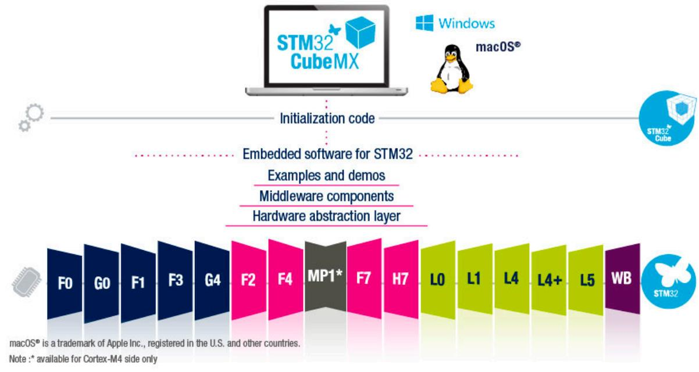


### 3. HAL库

STM32CubeMX生成的代码使用的并不是32单片机的标准库，而是使用的HAL库。HAL，是英文Hardware Abstraction Layer的缩写，翻译是硬件抽象层。

它是内核与芯片内硬件设备的关联层，我们可以容易地在硬件抽象层中编程来操作内核，硬件抽象层的易于移植性也让在不同内核下的编程不再复杂。其实在很多嵌入式平台开发中都诞生了自己的HAL，比如，安卓和微软的内核都有它们自己的HAL，意法半导体也不能落后，它拥有如此多种类的芯片，也有很多的市场份额，为了提高自己在市场中的话语权，牢牢抓住使用ST芯片的老用户，它也开发出了属于自己的HAL库。

首先是多点开发的花样，让开发更容易上手，更加专业，吸引更多新用户；其次也是为了提高库的可移植性，代替标准库。比起标准库，CubeMX使用的HAL库集成度会更加高，很多原本在标准库中要自己手动配置，组合的代码，在HAL库中可能就直接是封装好的函数，非常方便。但同时这样也带来了一些弊端，首先因为要考虑移植性和代码稳定性，HAL库中封装的函数不避免的有很多判断，这样的确影响了代码的效率，但是这仅局限于高速场合，一般情况下，使用HAL库和使用标准库的代码速度差别可以忽略不计。

## 二、安装STM32CubeMX

下边两个软件安装的话一直下一步就是了，没什么难度，需要注意的是安装目录最好不要有中文路径。

### 1. Java运行环境

STM32CubeMX 这个软件本身就是用 Java 语言编写的，而 JRE 是运行所有 Java 程序的“发动机”和“基础环境”。所以要想运行还需要安装Java运行环境。下载地址：[Download Java for Windows](https://www.java.com/zh-CN/download/)（尽量安装最新版 64 位的Java）

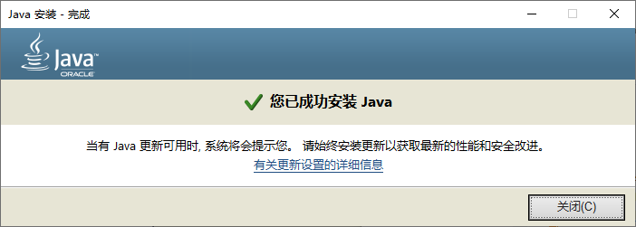

安装完 Java 运行环境之后，为了检测是否正常安装，我们可以打开 Windows 的命令输入框，输入：` java -version` 命令，如果显示 Java 版本信息，则安装成功。提示信息如下图：  

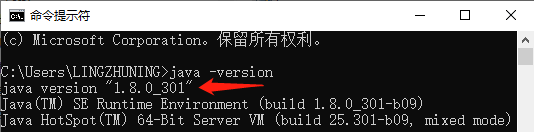

> Tips：但是我没安装，好像也能直接安装和运行STM32CubeMX，后面要是有什么问题的话可以注意下这里，安装上试一下。

### 2. STM32CubeMX

文档地址：[STM32CubeMX - STM32Cube initialization code generator - STMicroelectronics](https://www.st.com/en/development-tools/stm32cubemx.html)

下载地址：[STM32CubeMX - STM32Cube initialization code generator - STMicroelectronics](https://www.st.com/en/development-tools/stm32cubemx.html#get-software)

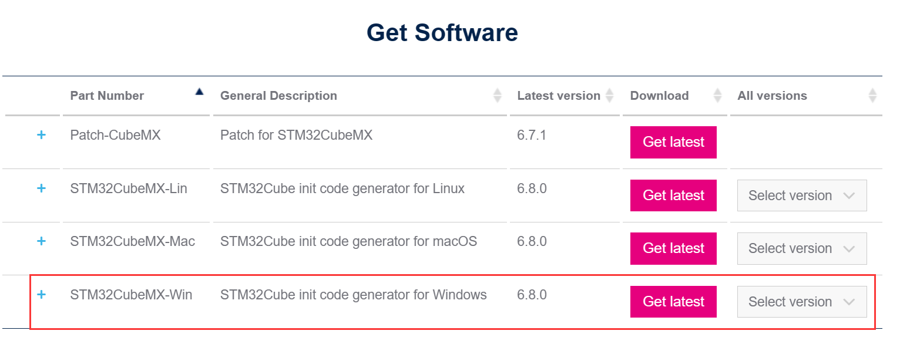

解压后直接双击安装即可，我是默认路径安装：

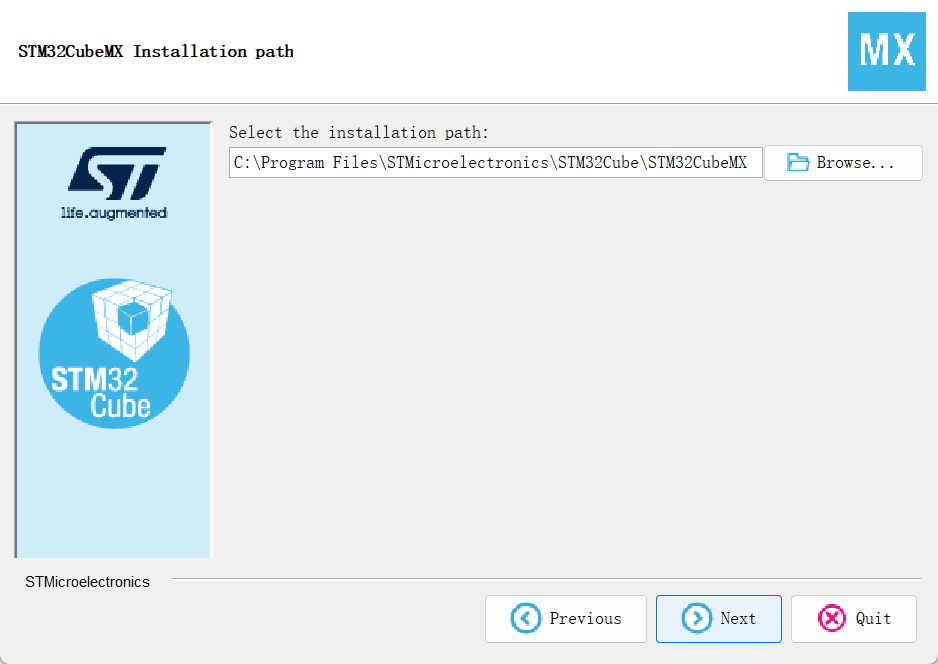

## 三、基本使用

### 1. 加载软件包

【Help】&rarr;【Manage embedded software packages】

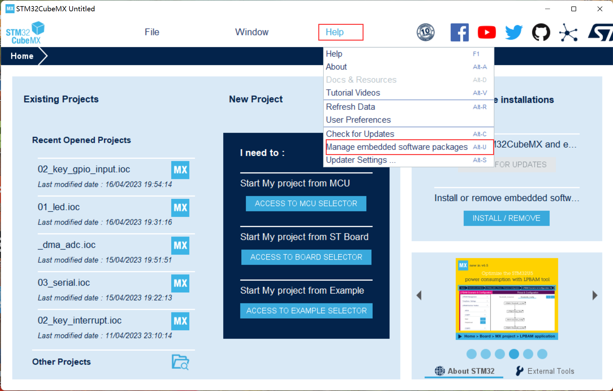

然后我们便会打开如下弹窗，然后我们按照图中提示安装相关的包即可：

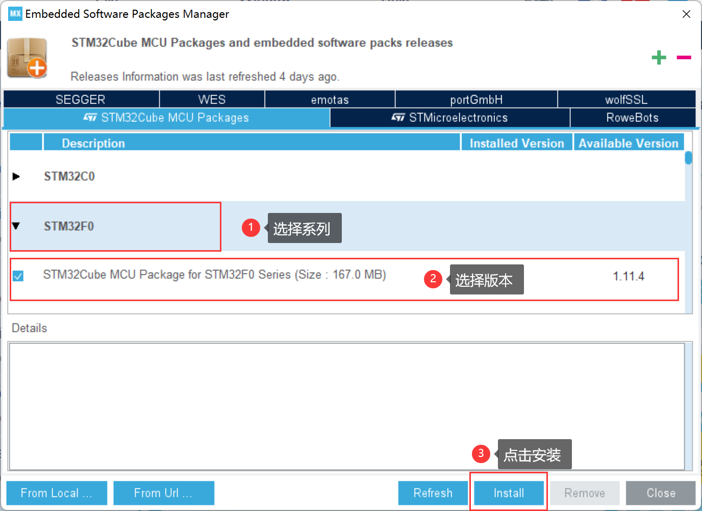

若是安装完毕，并且安装成功，前边会变成如下的小绿色方框：

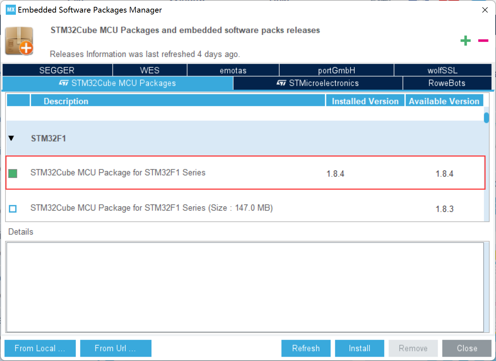

其实也可以离线下载支持包，然后离线加载，这里暂时还未尝试，后边需要的话再补充。

### 2. 库安装在哪？

STM32CubeMX使用的是HAL库，都安装在哪里？一般是在如下路径

```bash
C:\Users\用户名\STM32Cube\Repository
```

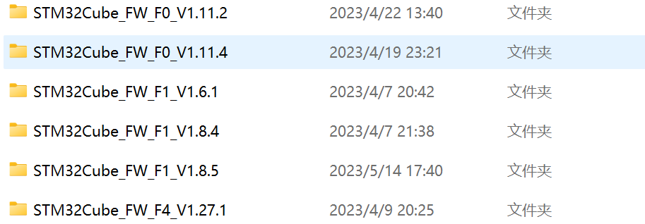

压缩包也存在于这里：

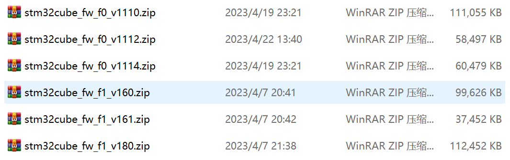
