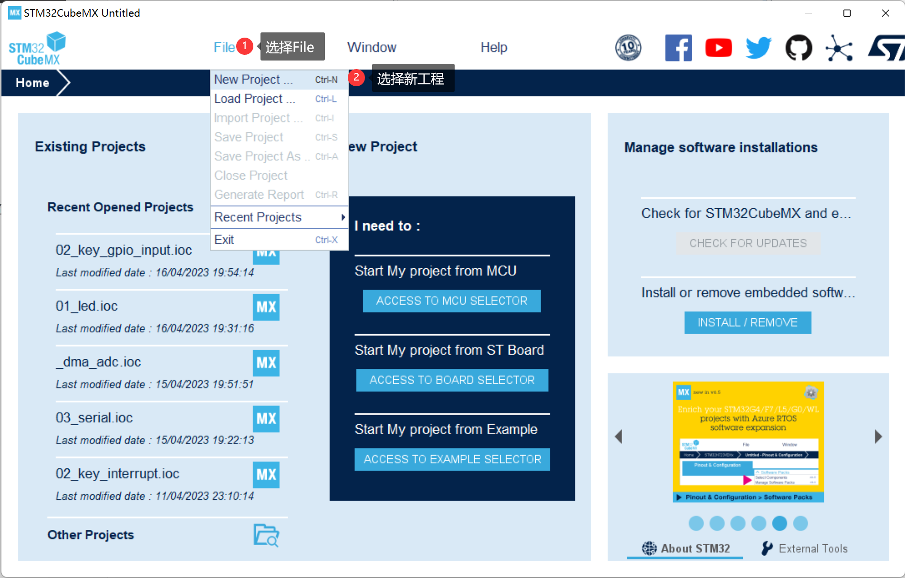

<!-- more -->

## 一、工程创建

### 1. 芯片型号选择

这个创建工程就比较简单了：

- 【File】&rarr;【New Project】



- 【选择芯片型号】&rarr;【Start Project】


双击要使用的芯片型号，就会开始生成工程，然后打开这样一个界面：


这里就是对芯片的引脚，外设做配置的地方。

### 2. 配置引脚

我用的是正点原子的战舰V3开发板，两个LED是接在PB5和PE5上，所以这里配置一下PB5：


### 3. 工程配置

- 【Project Manager】&rarr;【Project】


- 【Project Manager】&rarr;【Code Generator】


- 点击右上角的全大写的【GENERATE CODE】然后等待生成工程即可


### 4. 生成的工程

生成的工程大概结构如下：

```bash
E:\MyLinux\VMware\sharedir\STM32\test> tdoc tree . -L 2
.
├── .mxproject
├── Core
│   ├── Inc
│   └── Src
├── Drivers
│   ├── CMSIS
│   └── STM32F1xx_HAL_Driver
├── MDK-ARM
│   ├── startup_stm32f103xe.s
│   ├── test.uvoptx
│   └── test.uvprojx
└── test.ioc

7 directories, 5 files
```

MDK-ARM中就是生成的Keil工程。

## 二、Keil打开工程

我们直接进入MDK-ARM目录，然后双击打开，打开的时候好像提示缺少一个支持包，直接安装即可：


然后就可以看到生成的Keil工程啦：


需要知道的是，生成的工程中有大量的这种注释：

```c
  /* USER CODE BEGIN SysInit */

  /* USER CODE END SysInit */

  /* Initialize all configured peripherals */
  MX_GPIO_Init();
  /* USER CODE BEGIN 2 */

  /* USER CODE END 2 */
```

我们可以通过STM32CubeMX随时修改GPIO或者其他外设的配置，这个时候就会重新生成工程，但是我们肯定要实现自己的逻辑的，这个时候我们要是吧自己的逻辑写在BEGIN和END中间，那么中间这部分代码就不会受到影响了。
