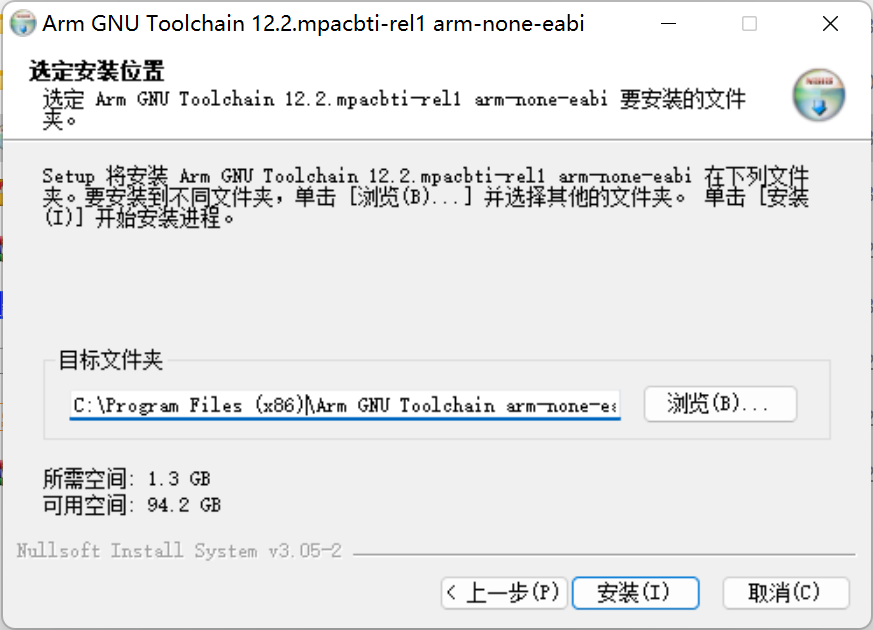
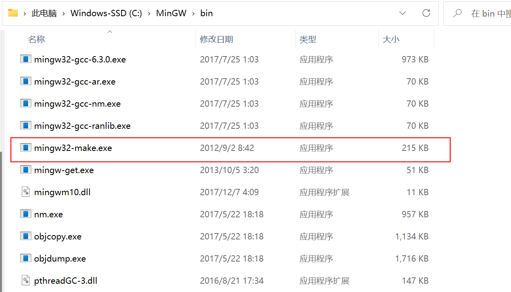

<!-- more -->


## 一、STM32CubeMX生成工程

### 1. 生成Makefile

前边我们已经熟悉了一下STM32CubeMX软件的使用方法，以及创建和导出MDK工程的过程，接下来我们创建一个含有Makefile文件的工程。

- （1）【File】&rarr;【New Project】


- （2）【选择芯片型号】&rarr;【Start Project】


- （3）【Project Manager】&rarr;【Project】


- （4）【Project Manager】&rarr;【Code Generator】


- （5）点击右上角的全大写的【GENERATE CODE】然后等待生成工程即可，生成的工程文件如下图所示：


### 2. 修改Makefile

工程导出的Makefile文件只包含工程自动生成的文件及目录位置，我们要是有自定义的源文件和头文件怎么办？

- 源文件添加位置

```makefile
######################################
# source
######################################
# C sources
C_SOURCES =  \
```

在这个最后边追加就可以了，当我们在STM32CubeMX中增加或者删除功能的时候不会影响到我们自己添加的这些。

- 头文件添加位置

```c
# C includes
C_INCLUDES =  \
```

我们加到这个后边就可以了。我们只需要修改这两个地方即可，其他的保持默认。我尝试了一下，我们添加在这两个变量后边的内容不受STM32CubeMX软件的影响，不管是在哪个位置，可以放心添加。

## 二、编译工具

我们可以参考下这篇文档：[Introduction to cross-compiling for Linux (landley.net)](http://landley.net/writing/docs/cross-compiling.html)

### 1. 什么是交叉编译

- 本地编译

本地编译可以理解为，在当前编译平台下，编译出来的程序只能放到当前平台下运行。平时我们常见的软件开发，都是属于本地编译。比如，我们在 x86 平台上，编写程序并编译成可执行程序。这种方式下，我们使用 x86 平台上的工具，开发针对 x86 平台本身的可执行程序，这个编译过程称为本地编译。

- 交叉编译

交叉编译可以理解为，在当前编译平台下，编译出来的程序能运行在体系结构不同的另一种目标平台上，但是编译平台本身却不能运行该程序。比如，我们在 x86 平台上，编写程序并编译成能运行在 ARM 平台的程序，编译得到的程序在 x86 平台上是不能运行的，必须放到 ARM 平台上才能运行。


### 2. 为什么会有交叉编译

主要原因有以下几点：

（1）Speed： 目标平台的运行速度往往比主机慢得多，许多专用的嵌入式硬件被设计为低成本和低功耗，没有太高的性能.

（2）Capability： 整个编译过程是非常消耗资源的，嵌入式系统往往没有足够的内存或磁盘空间。

（3）Availability： 即使目标平台资源很充足，可以本地编译，但是第一个在目标平台上运行的本地编译器总需要通过交叉编译获得。

（4）Flexibility： 一个完整的Linux编译环境需要很多支持包，交叉编译使我们不需要花时间将各种支持包移植到目标板上。


### 3. 交叉编译链

我们来看看什么是交叉编译链。首先编译过程是按照不同的子功能，依照先后顺序组成的一个复杂的流程，如下图：


编译过程包括了预处理、编译、汇编、链接等功能。每个过程都是一个单独的工具来实现，它们合在一起形成了一个完整的工具集。

同时编译过程又是一个有先后顺序的流程，它必然牵涉到工具的使用顺序，每个工具按照先后关系串联在一起，这就形成了一个链式结构。

因此，交叉编译链就是为了编译跨平台体系结构的程序代码而形成的由多个子工具构成的一套完整的工具集。同时，它隐藏了预处理、编译、汇编、链接等细节，当我们指定了源文件(.c)时，它会自动按照编译流程调用不同的子工具，自动生成最终的二进制程序映像(.bin)。

注意：严格意义上来说，交叉编译器，只是指交叉编译的gcc，但是实际上为了方便，我们常说的交叉编译器就是交叉工具链。本文对这两个概念不加以区分，都是指编译链。

### 4. 交叉编译链的命名规则

我们使用交叉编译链时，常常会看到这样的名字：

```shell
arm-none-linux-gnueabi-gcc
arm-cortex_a8-linux-gnueabi-gcc
mips-malta-linux-gnu-gcc
```


其中，对应的前缀为：

```shell
arm-none-linux-gnueabi-
arm-cortex_a8-linux-gnueabi-
mips-malta-linux-gnu-
```

这些交叉编译链的命名规则似乎是通用的，有一定的规则：

```shell
arch-core-kernel-system
arch： 用于哪个目标平台。
core： 使用的是哪个CPU Core，如Cortex A8，但是这一组命名好像比较灵活，在其它厂家提供的交叉编译链中，有以厂家名称命名的，也有以开发板命名的，或者直接是none或cross的。
kernel： 所运行的OS，见过的有Linux，uclinux，bare（无OS）。
system：交叉编译链所选择的库函数和目标映像的规范，如gnu，gnueabi等。其中gnu等价于glibc+oabi；gnueabi等价于glibc+eabi。
```

注意：这个规则是一个总结的规律罢了，并没有在哪份官方资料上看到过，而且有些编译链的命名确实没有按照这个规则。

### 5. 我们的工程用什么？

那我们的工程用哪个交叉编译工具链呢？我们来看一下Makefile文件：

```makefile
#######################################
# binaries
#######################################
PREFIX = arm-none-eabi-
# The gcc compiler bin path can be either defined in make command via GCC_PATH variable (> make GCC_PATH=xxx)
# either it can be added to the PATH environment variable.
ifdef GCC_PATH
CC = $(GCC_PATH)/$(PREFIX)gcc
AS = $(GCC_PATH)/$(PREFIX)gcc -x assembler-with-cpp
CP = $(GCC_PATH)/$(PREFIX)objcopy
SZ = $(GCC_PATH)/$(PREFIX)size
else
CC = $(PREFIX)gcc
AS = $(PREFIX)gcc -x assembler-with-cpp
CP = $(PREFIX)objcopy
SZ = $(PREFIX)size
endif
```

我们可以看到有上边这一段，这里就指明了默认使用的交叉编译工具链的名称：arm-none-eabi-

### 6. 交叉编译工具安装

#### 6.1 工具下载

我们直接百度搜索一下，就会看到这个编译工具链的官网，其实我们再ARM的官网也可以找得到：[Arm GNU Toolchain](https://developer.arm.com/Tools and Software/GNU Toolchain)


我们来到下载页面：[Arm GNU Toolchain Downloads – Arm Developer](https://developer.arm.com/downloads/-/arm-gnu-toolchain-downloads)


我们选这个把，因为看上去，只需要双击就可以啦。我们好像也可以在这里下载：[GNU Arm Embedded Toolchain project files : GNU Arm Embedded Toolchain (launchpad.net)](https://launchpad.net/gcc-arm-embedded/+download)


感觉差不多，我是在ARM官网那个链接里边下载的。

#### 6.2 工具安装

我们下载完毕后，会得到这样一个可执行文件：


我们双击进行安装，一路默认就是了，这一步注意一下，就是安装路径，后边我们还要添加环境变量，这里的路径可以记一下安装在哪。



我是按照默认的路径安装的：

```shell
C:\Program Files (x86)\Arm GNU Toolchain arm-none-eabi\12.2 mpacbti-rel1
```

最后等待安装完成就是了，安装完成后，我们会看到这样一个界面：


注意这里有把软件加进环境变量的选项，我们可以勾选上，这样后边就不用手动添加了。安装完毕后，我们来到安装目录，看一下我们安装的工具都有哪些：


这便是我们安装的工具啦。

#### 6.3 环境变量

安装完毕后，我们在命令行是无法直接使用命令的，我们还要将命令的路径告诉系统，这个时候就需要添加环境变量啦。当然，前边安装的时候勾选了添加环境变量的话，这里应该就不用手动添加了：

- （1）找到此电脑图标，【右键】&rarr;【属性】&rarr;【高级系统设置】


- （2）【环境变量】&rarr;【用户环境变量】&rarr;【PATH】&rarr;【新建】


我们新建一个环境变量，填入刚才的路径：

```shell
C:\Program Files (x86)\Arm GNU Toolchain arm-none-eabi\12.2 mpacbti-rel1\bin
```

然后依次选择确认或者OK即可。

- （3）是否设置成功？

我们随便找一个目录，然后【右键】&rarr;【在终端打开（win11才有）】，若是没有在终端打开的选项，我们也可以win+r调出运行窗口，然后输入cmd后按回车，打开命令行也行，打开后我们输入以下命令：

```shell
PS C:\Users\20380> arm-none-eabi-gcc -v
```

若有以下打印信息，则说明安装和添加环境变量成功：

```shell
PS C:\Users\20380> arm-none-eabi-gcc -v
Using built-in specs.
COLLECT_GCC=C:\Program Files (x86)\Arm GNU Toolchain arm-none-eabi\12.2 mpacbti-rel1\bin\arm-none-eabi-gcc.exe
COLLECT_LTO_WRAPPER=c:/program\ files\ (x86)/arm\ gnu\ toolchain\ arm-none-eabi/12.2\ mpacbti-rel1/bin/../libexec/gcc/arm-none-eabi/12.2.1/lto-wrapper.exe
Target: arm-none-eabi
Configured with: /data/jenkins/workspace/GNU-toolchain/arm-12-mpacbti/src/gcc/configure --target=arm-none-eabi --prefix=/data/jenkins/workspace/GNU-toolchain/arm-12-mpacbti/build-mingw-arm-none-eabi/install --with-gmp=/data/jenkins/workspace/GNU-toolchain/arm-12-mpacbti/build-mingw-arm-none-eabi/host-tools --with-mpfr=/data/jenkins/workspace/GNU-toolchain/arm-12-mpacbti/build-mingw-arm-none-eabi/host-tools --with-mpc=/data/jenkins/workspace/GNU-toolchain/arm-12-mpacbti/build-mingw-arm-none-eabi/host-tools --with-isl=/data/jenkins/workspace/GNU-toolchain/arm-12-mpacbti/build-mingw-arm-none-eabi/host-tools --disable-shared --disable-nls --disable-threads --disable-tls --enable-checking=release --enable-languages=c,c++,fortran --with-newlib --with-gnu-as --with-gnu-ld --with-sysroot=/data/jenkins/workspace/GNU-toolchain/arm-12-mpacbti/build-mingw-arm-none-eabi/install/arm-none-eabi --with-multilib-list=aprofile,rmprofile --with-libiconv-prefix=/data/jenkins/workspace/GNU-toolchain/arm-12-mpacbti/build-mingw-arm-none-eabi/host-tools --host=i686-w64-mingw32 --with-pkgversion='Arm GNU Toolchain 12.2.MPACBTI-Rel1 (Build arm-12-mpacbti.34)' --with-bugurl=https://bugs.linaro.org/
Thread model: single
Supported LTO compression algorithms: zlib
gcc version 12.2.1 20230214 (Arm GNU Toolchain 12.2.MPACBTI-Rel1 (Build arm-12-mpacbti.34))
```

【注意】若是没有任何信息，可能是环境变量未生效，我们可以重启电脑再试。

### 7. make工具安装

我们在linux下基本都会安装make工具，但是windows下不一样，我们大概率是没有安装的。

#### 7.1 官网下载安装(暂时放弃)

这个比较坑，我尝试了从GNU官网安装make，结果在生成的时候报下边的错，我也看不懂，感觉挺复杂，就放弃啦，转而使用另一种方式。

```shell
PS D:\BaiduNetdiskDownload\make-4.4\make-4.4> .\build_w32.bat

Creating GNU Make for Windows 9X/NT/2K/XP/Vista/7/8/10

No MSVC compiler available.
Please run vcvarsall.bat and/or configure your Path.
```

这里还是记一下官网的位置吧，万一以后知道怎么解决了呢。

- GNU官网：[软件 - GNU 工程 - 自由软件基金会](https://www.gnu.org/software/software.html)
- Make：[Make - GNU Project - Free Software Foundation](https://www.gnu.org/software/make/)

#### 7.2 MinGW

MinGW是一个GNU编译器集合(GCC)的本机Windows端口，具有可自由分发的导入库和头文件，用于构建本机Windows应用程序;包括对MSVC运行时的扩展，以支持C99功能。MinGW的所有软件都将在64位Windows平台上运行，安装后，默认会有make工具，所以win下使用make的话，就通过这种方式喽。

##### 7.2.1 下载

网上发现MinGW里边含有make，所以我们只要转而用这个里边的make啦。我们可以在这里下载MinGW：[MinGW - Minimalist GNU for Windows - Browse /Installer at SourceForge.net](https://sourceforge.net/projects/mingw/files/Installer/)，另外还有一个地址，这里也能找到下载的地方：[MinGW - Minimalist GNU for Windows - Browse /MinGW at SourceForge.net](https://sourceforge.net/projects/mingw/files/MinGW/)


##### 7.2.2 安装

下载完成后我们会得到这样一个可执行文件：


我们双击运行，后边一路下一步就是了，这里可以注意记一下安装目录，我是安装在默认的目录下

```shell
C:\MinGW
```


然后安装完毕后就会进入一个包的安装管理界面：


这里会打开MinGW Installer（后续我们也可以打开这个软件来管理我们的工具包）让我们选择要安装的包，我一般就选择的第二个（mingw32-base），然后左上角选择【Installation】&rarr;【Apply Changes】


后边会开始安装我们选择的包，安装完毕后如下图，点击close即可：


然后我们就可以在安装目录下找到一个make工具啦：



但是它的名字并不是make，为了后边方便使用，我们可以复制一个可执行文件，并命名为`make.exe`


##### 7.2.3 添加环境变量

步骤与上边添加交叉编译工具的环境变量的步骤一样，这里就不写了，环境变量的路径为：

```shell
C:\MinGW\bin
```


然后我们随便找一个位置打开终端，输入以下命令：

```shell
make -v
```

若有以下输出，则说明我们安装成功啦，并且环境变量已生效。


## 三、编译工程

### 1. 编译

我们已经安装好make和交叉编译工具链了，接下来就是编译工程和验证啦。我们进入工程目录，然后右键打开终端，并执行make命令：


随后便开始编译整个工程，编译完成后如下图所示：


我们来看一下这个build文件夹，发现生成了一系列的文件，有没有很眼熟呢？


哈哈，这个hex文件我们可以烧到STM32里边看一下能不能跑。

### 2. 烧写

这里就不写过程了，我们直接用J-Link的J-Flash工具烧写生成的hex文件就好啦：


我这里是更换了一个LED的例子，不然烧写进去也没什么效果，经过验证，程序可以正常跑。

### 3. 一个错误

们想要清理中间文件呢？我们可以执行下边的命令：

```shell
make clean
```

但是吧用本地的终端似乎会有问题，会有如下报错：


这个命令按理说是要删除掉由make执行后生成的build目录的，但是看上边就报错了，似乎是执行失败了，也许是这个终端终究linux不太一样把，由于我装了git版本控制工具，它自带一个终端，这个git bash终端就可以正常执行上边的命令并清理相应的文件：


我们后边可以使用这个终端，以及后边使用vscode来作为编辑器编辑工程的时候使用的终端也是这一个。

## 四、VSCode

### 1. VSCode是什么？

VS Code的全称是Visual Studio Code，但这全名实在是太长了，很多用户喜欢叫它 VS Code。说起VS Code，官方定义它是一个免费的、开源的跨平台**编辑器**。之所以强调“编辑器”，应该是是因为 VS Code 并无意成为一个全尺寸的集成开发环境，也就是IDE。它是Microsoft在2015年4月30日Build开发者大会上正式宣布一个运行于Mac OS X、Windows和Linux之上的，针对于编写现代Web和云应用的跨平台源代码编辑器，可在桌面上运行，并且可用于Windows，macOS和Linux。

编辑器并等同于IDE。IDE 更为关注开箱即用的编程体验、对代码往往有很好的智能理解，同时侧重于工程项目，为代码调试、测试、工作流等都有图形化界面的支持，因此相对笨重，Java程序员常用的Eclipse定位就是IDE；而编辑器则相对更轻量，侧重于文件或者文件夹，语言和工作流的支持更丰富和自由，VS Code 把自己定位在编辑器这个方向上，但又不完全局限于此。

2011 年底，微软从 IBM 请来了 Erich Gamma。Erich Gamma 是《设计模式》一书的作者之一，曾和肯特·贝克（Kent Beck） 一起发明了 JUnit，并且在 IBM 领导 Java 开发工具的开发工作。微软把他请过来，就是希望他能够打造一款在线的开发工具，让开发者们能够在浏览器里获得 IDE 般的开发体验，这也就是之后为人所知的 Monaco Editor。

Erich Gamma 见证了 Eclipse 从崛起到逐渐臃肿，再逐渐式微的整个历程，他深刻认识到 Eclipse 成功的一部分原因是极度的可定制化特性，任何功能在Eclipse中都可以用插件来实现；但是由于 Eclipse 的插件跟核心代码运行在同一个进程内，随着插件的增多，核心功能经常会被插件拖累，也就更加让人觉得笨重。因此，在打造 Monaco Editor 时，开发团队非常注重核心功能的性能，尽可能地保持轻量，而对资源和性能消耗较大的功能，则运行在其他的进程之中。

2015 年，Erich Gamma 带领团队把 Monaco Editor 移植到桌面平台上，也就是这个专栏的主角 Visual Studio Code，即 VS Code。VS Code 继承了 Monaco Editor 的设计原则，其核心是做一个高性能的轻量级编辑器；个性化的功能，则交给插件系统来完成。这一点可以说是师承 Eclipse，但同时又吸取了 Eclipse 的教训，把插件系统运行在主进程之外，高度可定制但同时又是可控的。与此同时，VS Code 也有自己的使命，那就是让开发者在编辑器里拥有 IDE 那样的开发体验，比如对源代码有智能的理解、图形化的调试工具、版本管理等等。

不难发现，VS Code 希望在编辑器和 IDE 之间找到一个平衡。在这样的设计思路下，打开编辑器，不需要创建任何的项目工程文件就可以开始使用，并高效便捷地操作文本；同时在编程语言插件的支持下能够得到语法检查、智能提示；还可以借助丰富的插件 API 拓展 VS Code 以满足自己的需求。

要达成这样的目标，难度可以说是非常大的，但 VS Code 取得了不错的成果。

### 2. Visual Studio？

Visual Studio（简称VS）是美国微软公司的开发工具包系列产品，是一个集成的开发环境，相对来说比较完整，它包括了整个软件生命周期中所需要的大部分工具，如代码完成工具、编译器、图形设计器、UML工具、代码管控工具、集成开发环境(IDE)等等，以简化开发人员构建应用程序的过程。通俗的讲，是一款编译器。

VS是微软面向Windows和MacOS的首选IDE，Visual Studio 出色的编辑和调试功能使其与竞争对手区分开来，Visual Studio 旨在成为用于构建应用程序的功能丰富、强大且全面的解决方案。

在Windows上，Visual Studio 目前支持17种工作负载，这些工作负载是针对不同开发目标的一致的工具和组件安装包。工作负载是对Visual Studio安装过程所作的重要改进，Visual Studio 的整个下载和安装很可能耗时数小时，会可能会塞满磁盘。

Visual Studio 2019有三种SKU：社区版(免费，不支持企业使用)，专业版(第一年1199美元/ 799美元续订)和企业版(第一年5999美元/2569美元续订)。企业版拥有面向架构师的功能、高级调试和测试，这些功能是另两种SKU所没有的。

Visual Studio旨在成为世界上最好的IDE（集成开发环境），它提供完整的堆栈开发工具集，包括一个名为IntelliSense的强大代码完成组件，一个可以调试源代码和机器代码的调试器

### 3. Visual Studio 与 VSCode差异？

| Visual Studio                                                | VS Code                                                      |
| ------------------------------------------------------------ | ------------------------------------------------------------ |
| Visual Studio 是一种集成开发环境，也称为 IDE。               | Visual Studio Code 是一个代码编辑器。 开发人员可以轻松地编辑他们的代码。 |
| 在跨不同平台执行时，VS 速度较慢。处理速度较慢。              | VS Code 相对较快。                                           |
| Visual Studio 有一个免费的编辑器供开发人员使用 但也提供了更好的付费 IDE 版本。 | VS Code 完全免费并且是开源的。                               |
| VS 采用最好和最先进的 IntelliSense。                         | IntelliSense 在 VS Code 中相对不合格。                       |
| 整体下载大小相当大。                                         | 与 Visual Studio 相比，Visual Studio Code 非常轻量级。 它不需要大量或大量下载。 |
| VS 需要更多空间才能更好、更流畅地工作。                      | VS Code 相对来说不需要很多空间来运行。 它可以轻松地在 300 MB 的内存上运行。 |
| Visual Studio 仅在 macOS 和 Windows 上运行。                 | VS Code 可以在 macOS、Windows 和 Linux 上运行。              |
| 没有多少专业开发的插件可用于 Visual Studio。                 | VS Code 附带了广泛的专业策划插件和扩展，生态丰富。 以满足各种编辑和编译需求。 |

### 4. VSCode安装

#### 1. VSCode下载

我们可以到VSCode的官网去：[Visual Studio Code - Code Editing. Redefined](https://code.visualstudio.com/)


找到下载界面：[Download Visual Studio Code - Mac, Linux, Windows](https://code.visualstudio.com/Download)


我们会发现VSCode为我们提供了多种平台，多种安装方式，我们这里在windows下使用，所以选择windows版本的即可。

#### 2. VSCode安装

看我们下载的是哪一种包了，若是.zip的，那我们解压后直接运行即可，若是下载的Syatem Installer或者User Installer的，那下载后我们双击安装就可以啦，这里就不写过程了，VScode的安装还是很简单的，没什么坑。安装完毕后界面如下，这个不重要，因为这是我后边加了背景图的，第一次打开若是英文的话，可以安装中文插件，一般都有提示，后来好像直接内置到VSCode里边了，这不是本节笔记重点，就不详写了，可以多百度。


#### 3. 插件安装

VSCode为我们提供了很丰富的插件，常用的如下，还有一些插件后边需要了再安装，有一些可能已经是VSCode的内置功能了，如下面的多彩括号：

<table>
    <tbody>
    <tr>
        <td align="center" width=200px>插件名称</td>
        <td align="center">插件用途</td>
    </tr>
    <tr>
        <td align="left" width=200px>Bracket Pair Colorizer</td>
        <td align="left">多彩括号，不同层级的代码块的括号展现不同颜色(后来好像内置到VScode了)。</td>
    </tr>
    <tr>
        <td align="left" width=200px>Material Icon Theme</td>
        <td align="left">文件导航窗格不同文件图标样式。</td>
    </tr>
    <tr>
        <td align="left" width=200px>background-cover</td>
        <td align="left">设置VScode背景图片(需要对VScode有可执行权限，所以安装后可以找到安装目录，修改一下权限)。</td>
    </tr>
    <tr>
        <td align="left" width=200px>LinkerScript</td>
        <td align="left">GCC汇编链接文件语法高亮插件(后缀 .lds)。</td>
    </tr>
    <tr>
        <td align="left" width=200px>One Dark Pro</td>
        <td align="left">VScode编辑器主题插件。</td>
    </tr>
    <tr>
        <td align="left" width=200px>Arm Assembly</td>
        <td align="left">ARM GNU汇编语法高亮插件。</td>
    </tr>
    <tr>
        <td align="left" width=200px>Setting Sync</td>
        <td align="left">VScode配置文件同步插件。(有时候内置的有点不好用，这个时候就可以通过这个插件来实现同步，只是这个插件要跟Github一起使用)</td>
    </tr>
    <tr>
        <td align="left" width=200px>Remnote-SSH</td>
        <td align="left">远程连接服务器的SSH工具</td>
    </tr>
	</tbody>
</table>

另外还有一个插件，一般打开C语言源文件的时候都会提示安装，就是C/C++扩展工具，我们找到这个 C/C++ Extension Pack插件，安装即可，会自动安装另外两个。


### 5. 打开工程文件夹

【文件】&rarr;【打开文件夹】


### 6. 配置VSCode

#### 6.1 报错示例

我们前边要是安装了C/C++插件的话，它自带的语法检测会给我们报很多的错误，这些错误并不是语法错误，我们的工程没有任何问题的，只是VSCode中没有配置头文件路径以及没有设置 HAL 使用的相关宏定义，所以就会报。


#### 6.2 处理报错

##### 6.2.1 方式一：界面配置

- （1）打开UI界面配置：【Ctrl+Shift+p】&rarr;【输入C/C++】&rarr;【C/C++：编辑配置（UI）】

我们在VSCode中按下Ctrl+Shift+p打开配置搜索栏，并输入 C/C++ ：


我们点击第二个，编辑配置（UI），然后会来到这样一个界面：


这就是C/C++的配置界面。

- （2）配置包含路径：


这里就是配置包含路径的地方，要包含哪些路径？我们打开Makefile文件，找到以下部分：

```makefile
# C includes
C_INCLUDES =  \
-ICore/Inc \
-IDrivers/STM32F1xx_HAL_Driver/Inc \
-IDrivers/STM32F1xx_HAL_Driver/Inc/Legacy \
-IDrivers/CMSIS/Device/ST/STM32F1xx/Include \
-IDrivers/CMSIS/Include
```

这里就告诉我们头文件的目录啦，我们在上图的框中添加以下内容：

```shell
Core/Inc
Drivers/STM32F1xx_HAL_Driver/Inc
Drivers/STM32F1xx_HAL_Driver/Inc/Legacy
Drivers/CMSIS/Device/ST/STM32F1xx/Include
Drivers/CMSIS/Include
```


- （3）宏定义：

接下来是配置全局的宏：


这里我们怎么填呢？这就要去Makefile文件里寻找答案啦，我们打开Makefile文件，找到这一部分：

```makefile
# C defines
C_DEFS =  \
-DUSE_HAL_DRIVER \
-DSTM32F103xE
```

这里就告诉了我们如何配置全局的宏定义，我们在上图VSCode C/C++ UI配置的定义框中添加以下内容：

```shell
USE_HAL_DRIVER
STM32F103xE
```

- （4）查看效果

然后我们重新打开刚才的gpio.c文件，拉到相同的位置，会发现，已经没有报错啦：


- （5）多了个文件夹？

我们往旁边一看，就会发现，当我们编辑过 C/C++：编辑配置（UI）界面后，在我们打开的文件夹目录下生成了一个.vscode目录，随之生成了一个名为 c_cpp_properties.json 的文件：


文件内容如下：

```json
{
    "configurations": [
        {
            "name": "Win32",
            "includePath": [
                "${workspaceFolder}/**",
                "Core/Inc",
                "Drivers/STM32F1xx_HAL_Driver/Inc",
                "Drivers/STM32F1xx_HAL_Driver/Inc/Legacy",
                "Drivers/CMSIS/Device/ST/STM32F1xx/Include",
                "Drivers/CMSIS/Include"
            ],
            "defines": [
                "_DEBUG",
                "UNICODE",
                "_UNICODE",
                "USE_HAL_DRIVER",
                "STM32F103xE"
            ],
            "compilerPath": "C:\\LenovoSoft\\mingw64\\bin\\gcc.exe",
            "cStandard": "c17",
            "cppStandard": "gnu++17",
            "intelliSenseMode": "windows-gcc-x64"
        }
    ],
    "version": 4
}
```

我们刚才配置的两个地方刚好就是includePath和defines。

##### 6.2.2 方式二：直接配置JSON文件

我们在VSCode中按下Ctrl+Shift+p打开配置搜索栏，并输入 C/C++ ：


我们点击第一个，编辑配置（JSON），然后便会在当前目录下生成一个.vscode 目录，目录中会有一个名为 c_cpp_properties.json 的文件：


我们打开这个文件，文件默认内容如下所示：

```json
{
    "configurations": [
        {
            "name": "Win32",
            "includePath": [
                "${workspaceFolder}/**"
            ],
            "defines": [
                "_DEBUG",
                "UNICODE",
                "_UNICODE"
            ],
            "compilerPath": "C:\\LenovoSoft\\mingw64\\bin\\gcc.exe",
            "cStandard": "c17",
            "cppStandard": "gnu++17",
            "intelliSenseMode": "windows-gcc-x64"
        }
    ],
    "version": 4
}
```

我们直接修改成如下内容，可以达到一样的效果：

```json
{
    "configurations": [
        {
            "name": "Win32",
            "includePath": [
                "${workspaceFolder}/**",
                "Core/Inc",
                "Drivers/STM32F1xx_HAL_Driver/Inc",
                "Drivers/STM32F1xx_HAL_Driver/Inc/Legacy",
                "Drivers/CMSIS/Device/ST/STM32F1xx/Include",
                "Drivers/CMSIS/Include"
            ],
            "defines": [
                "_DEBUG",
                "UNICODE",
                "_UNICODE",
                "USE_HAL_DRIVER",
                "STM32F103xE"
            ],
            "compilerPath": "C:\\LenovoSoft\\mingw64\\bin\\gcc.exe",
            "cStandard": "c17",
            "cppStandard": "gnu++17",
            "intelliSenseMode": "windows-gcc-x64"
        }
    ],
    "version": 4
}
```

#### 6.3 其他配置

这里我们配置的时候我就直接修改JSON文件了。

##### 6.3.1 compilerPath

"compilerPath"这个标签必须指定，否则会出现程序中的基础依赖文件找不到或者宏控制异常，导致全部文件的基础数据类型（例如int8_t/uint8_t等）找不到定义，如果只是简单地将编译器的依赖文件夹“include/”路径添加到普通的工程头文件路径"includePath"下，仍然会出现问题（应该是编译器的自身控制宏导致的）。我们使用的是交叉编译工具链，这里就配置为我们使用的就行：

```json
 "compilerPath": "C:\\Program Files (x86)\\Arm GNU Toolchain arm-none-eabi\\12.2 mpacbti-rel1\\bin\\arm-none-eabi-gcc.exe",
```

##### 6.3.2 intelliSenseMode

要使用的 IntelliSense 模式，该模式映射到 MSVC、gcc 或 Clang 的平台和体系结构变体。如果未设置或设置为 \${default}，则扩展将选择该平台的默认值。Windows 默认为 windows-msvc-x64，Linux 默认为 linux-gcc-x64，macOS 默认为 macos-clang-x64。我们可以选择特定 IntelliSense 模式以替代 \${default} 模式。这里一般就默认就好啦：

```js
"intelliSenseMode": "windows-msvc-x64",
```
