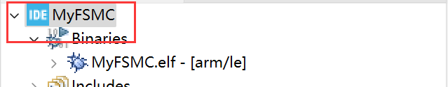

<!-- more -->


## 一、STM32CubeIDE简介

偶然看到STM32CubeIDE这个么一个软件，它是ST官方推出的IDE，它已经集成了芯片选型，外设配置，代码生成，代码编译，程序烧录和程序调试等一系列功能，可以说STM32CubeMX是它的其中一个功能而已。这里对这个软件做一个简单的了解。

### 1. 简介

STM32CubeIDE是一种高级C/C++开发平台，具有STM32微控制器和微处理器的外设配置、代码生成、代码编译和调试功能。它基于Eclipse®/CDT™框架和用于开发的GCC工具链，以及用于调试的GDB。它支持集成数以百计的现有插件，正是这些插件使Eclipse® IDE的功能趋于完整。

STM32CubeIDE集成了STM32CubeMX的STM32配置与项目创建功能，以便提供一体化工具体验，并节省安装与开发时间。在通过所选板卡或示例选择一个空的STM32 MCU或MPU，或者预配置微控制器或微处理器之后，将创建项目并生成初始化代码。在开发过程的任何时间，用户均可返回外设或中间件的初始化和配置阶段，并重新生成初始化代码，期间不会影响用户代码。

### 2. 特点

- 通过STM32CubeMX来集成服务：STM32微控制器、微处理器、开发平台和示例项目选择引脚排列、时钟、外设和中间件配置项目创建和初始化代码生成具有增强型STM32Cube扩展包的软件和中间件
- 基于Eclipse®/CDT™，支持Eclipse®插件、GNU C/C++ for Arm®工具链和GDB调试器
- STM32MP1 系列：支持OpenSTLinux项目：Linux支持Linux
- 其他高级调试功能包括：CPU内核、外设寄存器和内存视图实时变量查看视图系统分析与实时跟踪(SWV)CPU故障分析工具支持RTOS感知调试，包括Azure
- 支持ST-LINK（意法半导体）和J-Link (SEGGER)调试探头
- 从Atollic® TrueSTUDIO®和AC6 System Workbench for STM32 (SW4STM32)导入项目
- 支持多种操作系统：Windows®、Linux®和macOS®，仅限64位版本

## 二、STM32CubeIDE安装与使用

### 1. Java运行环境

安装这个软件之前肯定还是要安装Java运行环境的，可以在官网下载：[Download Java for Windows](https://www.java.com/zh-CN/download/)（尽量安装最新版 64 位的Java），这个下载好后一直默认就可以了，安装完成后如下：


### 2. STM32CubeIDE安装

我们来到官网下载安装包：[STM32CubeIDE - STM32的集成开发环境 - 意法半导体STMicroelectronics](https://www.st.com/zh/development-tools/stm32cubeide.html)


下载完成后解压安装即可，这个安装挺简单的，可以自己定一个安装路径，然后就是这两个勾选：


剩下的就是一路默认就可以了，中途可能会弹出安装相关驱动的选项卡，点安装就行了，没什么大问题。一直等待安装完成即可。安装完成后我们双击桌面上的快捷方式打开，会弹出如下界面：


这是让新建一个工作空间，后边放我们的工程，我们自定义一个目录就可以啦，然后点击Launch就可以啦，启动后界面如下图所示：


### 3. 基本使用

#### 3.1 STM32CubeIDE创建工程

接下来就是使用STM32CubeIDE创建工程啦。如下图所示步骤：


第一次打开的话可能会下载芯片的一些信息，就会比较慢，等下载安装完成后，会打开如下界面：


是不是很熟悉，就跟我们的STM32CubeMX一样【③搜索我们的芯片系列】&rarr;【④选中我们的芯片型号】&rarr;【⑤点击下一步】，然后会让我们输入工程的名称：


在这个界面我们输入工程名字就好啦，其他的可以保持默认就行，然后点击finish即可，然后会弹出这样一个弹窗：


我们选择Yes就可以啦，然后静静等待工程创建完成就是啦。创建完毕后界面如下：


这就没啥好说的了，跟我们的STm32CubeMX界面一毛一样，不过就是多了工程文件管理的一些东西。然后最后生成的工程目录有以下文件夹：


#### 3.2 配置外设

我们可以跟在STM32CubeMX中一样，配置所有的外设，这里就不多余写了，跟STM32CubeMX一模一样。当我们配置完成后，按下Ctrl+s组合键会有如下弹窗，推荐是勾选①，然后点击②Yes，这样下次在我们更新了外设配置的时候再按Ctrl+s就会自动生成代码。


若是我们选择了no，那么我们后边还可以手动生成代码，在工具栏点击这个图标即可：


上边那个弹窗选择完毕后，还有一个是关于要不要跳转到C/C++编辑界面的选项卡，如下图操作即可，勾选选项，然后点击Yes：


然后等一会就会跳转到工程代码编辑界面：


#### 3.3 编译与下载

##### 3.3.1 编译工程

我们点击工具栏的锤子图标就可编译整个工程：


编译完成后会有如下提示信息：


##### 3.3.2 配置调试工具

我使用的是Jlink所以就配置为Jlink了，我们点击【①调试】&rarr;【②Debug Configurations】


然后回来到调试的配置界面：


③、这里是我们的工程使用的调试文件；

④、我们选择默认的这个MyFsmc；

⑤、选择调试器选项；

⑥、调试探头选择JLink；

⑦、接口选择SWD或者JTAG

剩下的我都保持默认了，然后选择Apply，然后Close关闭即可。

##### 3.3.3 下载程序

我们连接好JLink和开发板，然后点击工具栏的运行按钮：


首次运行的话会弹出配置窗口：


我们勾选框中的Enable auto build，这样每次下载的时候，就会自动编译编译工程。但是吧，不习惯，我还是喜欢先编译，确保没错了再下载，看个人喜好啦。然后就会将生成的可执行文件下载到开发板啦，提示信息如下：


#### 3.4 导入自己的文件

工程中都是默认生成的文件，我们有时候需要添加自己的文件，那么如何导入呢？

（1）将我们要添加的文件添加到工程的顶层目录下：


（2）【工程名】&rarr;【右键】&rarr;【Refresh】


然后我们就会看到我们添加的目录出现在工程中了：


（3）配置文件路径【工程名】&rarr;【右键】&rarr;【Properties】


然后我们就可以来到配置界面，按照下边的标号操作即可。这里包含头文件和源文件，所有会有两个标号③，注意头文件和源文件的路径都需要添加。


不过源文件的添加步骤没有头文件那么多，选择选项卡后直接Add Folder，然后选择文件夹就可以了。


注意最后要选Apply and Close，这样才能生效。

#### 3.5 新建文件

上边是导入文件，那么我们想新建文件呢？

（1）【工程名】&rarr;【右键】&rarr;【New】&rarr;【Head File或者Source File]


（2）选择一下源文件要放的目录，以及源文件名和要使用的模板，选择Finish即可，头文件和源文件都是这样。


### 4. 生成hex文件

我们编译完成后其实会发现，这个STM32CubeIDE生成和使用的是.elf格式的文件


那么我们若是需要hex文件呢？

（1）【Project】&rarr;【Properties】打开工程配置选项卡，或者在这里右键也可以：



（2）按如下图所示的顺序进行配置


然后我们重新编译工程，就会发现在工程目录的Debug目录下生成了对应的bin和hex文件：


### 5. Makefile文件

我们其实可以看到在工程创建的时候会直接在工程目录的Debug目录下创建一个Makefile文件，这个文件就是编译整个工程的。


但是我们似乎不能直接使用make来编译，后边反正试了一下，没什么用，只会清除一下文件，想要使用正常的Makefile文件，还是用STM32CubeMX来生成吧。

### 6. 转成MDK工程？

我们创建完工程后，在这个地方发现按钮是灰色的，我们无法选择生成的工程类型：


有时候想用MDK怎么办呢？不得不承认，人的需求总是在变化，转成MDK的话，在这个IDE软件内是莫得办法的，但是呢，会发现我们创建工程的时候，生成了这样一个文件：


这不就是我们之前用STM32CubeMX生成的STM32CubeMX工程嘛，我们双击打开，前提是我们安装得有STM32CubeMX，然后就会使用STM32CubeMX打开一个STM32CubeMX工程，不幸的是，我的版本不一致，报错了：


后边我就没试了，感觉没必要，后边有需求的话，再转一下看看吧，按理说是可以按这种方式转成MDK工程的。

## 三、OpenOCD

### 1. 简介

OpenOCD是用于对STM32进行下载和仿真的工具，需要搭配debug adapter（比如JLink，ST-Link，DAP-Link）和GDB（或Telnet）一起使用，它是一个开源软件包。


### 2. 下载与安装

windows版本下载地址是：[Download OpenOCD for Windows (gnutoolchains.com)](https://gnutoolchains.com/arm-eabi/openocd/)


我是选择的最新版本安装，下载完成后发现它是免安装版本，所以可以直接解压后使用，不过我们要添加一下环境变量，将西边的路径添加到环境变量，这里具体过程就不再说了：

```c
D:\BaiduNetdiskDownload\OpenOCD-20230202-0.12.0\bin
```

我是直接解压到当前目录了，所以这里就是这个路径，主要是要将 openocd.exe 所在上网目录添加到环境变量，添加完成后，我们在终端执行以下命令看是否可以直接使用openocd.exe软件：

```c
PS C:\Users\20380> openocd -v
Open On-Chip Debugger 0.12.0 (2023-02-02) [https://github.com/sysprogs/openocd]
Licensed under GNU GPL v2
libusb1 09e75e98b4d9ea7909e8837b7a3f00dda4589dc3
For bug reports, read
        http://openocd.org/doc/doxygen/bugs.html
```

### 3. 基本使用

#### 3.1 连接目标芯片

```c
openocd -f <接口配置文件> -f <目标芯片配置文件>
```

注意：接口配置文件和目标芯片配置文件需要使用绝对路径。

其中接口配置文件是openOCD支持的下载接口，在 openocd安装目录\scripts\interface 文件夹下，目标芯片配置文件是openOCD支持的目标芯片，在 openocd安装目录\scripts\target 文件夹下：


然后我们在终端尝试一下下载程序到我们的开发板：

```c
openocd -f D:\BaiduNetdiskDownload\OpenOCD-20230202-0.12.0\share\openocd\scripts\interface\jlink.cfg -f D:\BaiduNetdiskDownload\OpenOCD-20230202-0.12.0\share\openocd\scripts\target/stm32f1x.cfg
```

会发现，报错啦：

```c
PS C:\Users\20380> openocd -f D:\BaiduNetdiskDownload\OpenOCD-20230202-0.12.0\share\openocd\scripts\interface\jlink.cfg -f D:\BaiduNetdiskDownload\OpenOCD-20230202-0.12.0\share\openocd\scripts\target/stm32f1x.cfg
Open On-Chip Debugger 0.12.0 (2023-02-02) [https://github.com/sysprogs/openocd]
Licensed under GNU GPL v2
libusb1 09e75e98b4d9ea7909e8837b7a3f00dda4589dc3
For bug reports, read
        http://openocd.org/doc/doxygen/bugs.html
Info : auto-selecting first available session transport "jtag". To override use 'transport select <transport>'.
Info : Listening on port 6666 for tcl connections
Info : Listening on port 4444 for telnet connections
Warn : Failed to open device: LIBUSB_ERROR_NOT_SUPPORTED
Warn : Failed to open device: LIBUSB_ERROR_NOT_FOUND
Error: No J-Link device found
```

这个后边再说怎么解决。当通过后边的操作解决报错后，重新执行命令，会有如下打印：

```c
PS C:\Users\20380> openocd -f D:\BaiduNetdiskDownload\OpenOCD-20230202-0.12.0\share\openocd\scripts\interface\jlink.cfg -f D:\BaiduNetdiskDownload\OpenOCD-20230202-0.12.0\share\openocd\scripts\target/stm32f1x.cfg
Open On-Chip Debugger 0.12.0 (2023-02-02) [https://github.com/sysprogs/openocd]
Licensed under GNU GPL v2
libusb1 09e75e98b4d9ea7909e8837b7a3f00dda4589dc3
For bug reports, read
        http://openocd.org/doc/doxygen/bugs.html
Info : auto-selecting first available session transport "jtag". To override use 'transport select <transport>'.
Info : Listening on port 6666 for tcl connections
Info : Listening on port 4444 for telnet connections
Warn : Failed to open device: LIBUSB_ERROR_NOT_SUPPORTED
Warn : Failed to open device: LIBUSB_ERROR_NOT_SUPPORTED
Info : J-Link V9 compiled May  7 2021 16:26:12
Info : Hardware version: 9.20
Info : VTarget = 3.219 V
Info : clock speed 1000 kHz
Info : JTAG tap: stm32f1x.cpu tap/device found: 0x3ba00477 (mfg: 0x23b (ARM Ltd), part: 0xba00, ver: 0x3)
Info : JTAG tap: stm32f1x.bs tap/device found: 0x06414041 (mfg: 0x020 (STMicroelectronics), part: 0x6414, ver: 0x0)
Info : [stm32f1x.cpu] Cortex-M3 r1p1 processor detected
Info : [stm32f1x.cpu] target has 6 breakpoints, 4 watchpoints
Info : starting gdb server for stm32f1x.cpu on 3333
Info : Listening on port 3333 for gdb connections
```


#### 3.2 连接＋下载

```c
openocd -f <接口配置文件> -f <目标芯片配置文件> -c <要执行的命令>
```

所以我们可以这样实现一键下载：

```c
// 下载bin文件
openocd -f D:\BaiduNetdiskDownload\OpenOCD-20230202-0.12.0\share\openocd\scripts\interface\jlink.cfg -f D:\BaiduNetdiskDownload\OpenOCD-20230202-0.12.0\share\openocd\scripts\target/stm32f1x.cfg -c init -c halt -c "flash write_image erase D:/MyLinux/Ubuntu/Sharedfiles/6temp/STM32/MyFSMC/build/debug/build/MyFSMC.bin 0x08000000" -c reset -c shutdown
    
// 下载hex文件
openocd -f D:\BaiduNetdiskDownload\OpenOCD-20230202-0.12.0\share\openocd\scripts\interface\jlink.cfg -f D:\BaiduNetdiskDownload\OpenOCD-20230202-0.12.0\share\openocd\scripts\target/stm32f1x.cfg -c init -c halt -c "flash write_image erase D:/MyLinux/Ubuntu/Sharedfiles/6temp/STM32/MyFSMC/build/debug/build/MyFSMC.hex" -c reset -c shutdown
```

完成下载后会有如下提示：

```c
PS C:\Users\20380> openocd -f D:\BaiduNetdiskDownload\OpenOCD-20230202-0.12.0\share\openocd\scripts\interface\jlink.cfg -f D:\BaiduNetdiskDownload\OpenOCD-20230202-0.12.0\share\openocd\scripts\target/stm32f1x.cfg -c init -c halt -c "flash write_image erase D:/MyLinux/Ubuntu/Sharedfiles/6temp/STM32/MyFSMC/build/debug/build/MyFSMC.bin 0x08000000" -c reset -c shutdown
Open On-Chip Debugger 0.12.0 (2023-02-02) [https://github.com/sysprogs/openocd]
Licensed under GNU GPL v2
libusb1 09e75e98b4d9ea7909e8837b7a3f00dda4589dc3
For bug reports, read
        http://openocd.org/doc/doxygen/bugs.html
Info : auto-selecting first available session transport "jtag". To override use 'transport select <transport>'.
Warn : Failed to open device: LIBUSB_ERROR_NOT_SUPPORTED
Warn : Failed to open device: LIBUSB_ERROR_NOT_SUPPORTED
Info : J-Link V9 compiled May  7 2021 16:26:12
Info : Hardware version: 9.20
Info : VTarget = 3.217 V
Info : clock speed 1000 kHz
Info : JTAG tap: stm32f1x.cpu tap/device found: 0x3ba00477 (mfg: 0x23b (ARM Ltd), part: 0xba00, ver: 0x3)
Info : JTAG tap: stm32f1x.bs tap/device found: 0x06414041 (mfg: 0x020 (STMicroelectronics), part: 0x6414, ver: 0x0)
Info : [stm32f1x.cpu] Cortex-M3 r1p1 processor detected
Info : [stm32f1x.cpu] target has 6 breakpoints, 4 watchpoints
Info : starting gdb server for stm32f1x.cpu on 3333
Info : Listening on port 3333 for gdb connections
Warn : [stm32f1x.cpu] target was in unknown state when halt was requested
Info : device id = 0x10036414
Info : flash size = 512 KiB
Warn : Adding extra erase range, 0x080012c4 .. 0x080017ff
auto erase enabled
wrote 4804 bytes from file D:/MyLinux/Ubuntu/Sharedfiles/6temp/STM32/MyFSMC/build/debug/build/MyFSMC.bin in 0.385953s (12.155 KiB/s)

Info : JTAG tap: stm32f1x.cpu tap/device found: 0x3ba00477 (mfg: 0x23b (ARM Ltd), part: 0xba00, ver: 0x3)
Info : JTAG tap: stm32f1x.bs tap/device found: 0x06414041 (mfg: 0x020 (STMicroelectronics), part: 0x6414, ver: 0x0)
shutdown command invoked
```


### 4. 报错解决

#### 4.1 报错原因

当我们使用 openocd + j-link 进行烧录和调试时，会接收到这样的警告：Warn : Failed to open device: LIBUSB_ERROR_NOT_SUPPORTED，最后发现找不到 j-link：Error: No J-Link device found，尽管我们能使用 j-scope，j-flash 等工具，在 KEIL 中也可以正常识别 j-link 。在 SEGGER 的维基中提到了原因：

```c
In general, it is possible to use J-Link with OpenOCD. OpenOCD handles J-Link as a dumb JTAG/SWD/… probe and only uses the very low level logic to output JTAG/SWD/… sequences. It does not make use of any high level logic etc. and therefore is much slower than the proprietary SEGGER J-Link DLL / GDBServer / … implementation. In order to use J-Link with OpenOCD the standard J-Link USB driver must be replaced with the WinUSB driver, using 3rd party utilities. There are lots of walkthroughs available on the internet.
```

简单来说就是 openocd 使用 jlink 的方式很低级，所以我们需要把 j-link 原来的驱动更换为 WinUSB 驱动才可以被 openocd 识别。

zadig 和 USBDriverTool 都可以更换驱动，网上绝大部分的教程都推荐使用 zadig，但是其实 USBDriverTool 在这个场景下更适用，原因是 USBDriverTool 不但可以将 j-link usb 驱动转为 WinUSB 驱动，还可以再转换回去，这个是 zadig 做不到的。

SEGGER 的维基中还提到了一点:

```c
Note: Once the J-Link USB driver has been replaced, no SEGGER software from the J-Link software package will be able to communicate with J-Link anymore. To use SEGGER J-Link software again, the USB driver needs to be switched back to its default.
```

也就是说，我们把 j-link 的驱动转换成 openocd 可以识别的 WinUSB 驱动之后，j-scope，j-flash 等软件都无法使用，也无法在 KEIL 中使用 j-link 烧录和调试程序了。如果想使用这些工具，就必须把驱动还原回去，这时候 USBDriverTool 就派上用场了。看到这里，我还是觉得使用 openocd + j-link 是一种比较低效的方式，如果使用 j-link 作为调试器，那么使用 j-link gdb server 或者强大的 ozone 可能更为合适一些。其实这样还不如直接使用J-Link自带的烧写软件。虽然以后也不用这种方式，但是还是折腾一下，了解一下吧。

#### 4.2 zadig 

官网在这里：[Zadig - USB driver installation made easy (akeo.ie)](https://zadig.akeo.ie/)，我们可以在直接在这个主页找到下载的地方：


下载完成后安装即可。

（1）插好 j-link ，并选择【options】&rarr;【List All Devices】


（2）找到J-Link设备：


最后设备选择 j-link ，要更换的驱动选择 WinUSB ，最后点击【Replace Driver】即可完成驱动的替换。值得一提的是，这里可以看到 j-link原来的驱动被识别为 jlink CDC，我们如果要把驱动换回去，就要恢复成现在界面的样子。但是这个软件是做不到的，还是要靠另一款。

#### 4.3 USBDriverTool 

我后边没用这种方式调试，所以还需要转换回去，这里就是用这个软件啦，我们可以来这里下载：[Automatic USB driver installer for FTDI and LibUSB drivers (visualgdb.com)](https://visualgdb.com/UsbDriverTool/)


（1）先插好 j-link 然后在 j-link 设备上单击右键，选择【Install WinUSB】即可完成驱动的转换。


（2）转换完成后如下图所示：


这个时候我们看一下MDK，发现现在已经无法识别JLink了：


（3）如果想要恢复回原来的驱动，【右键】然后选择【Restore default driver】：


## 四、VScode插件与使用

### 1. 安装插件

我们需要安装这个ST官方出的VScode插件：


直接点击安装即可，它会附带安装一些其他自己需要的插件，安装完成后在VScode侧边栏会有这样一个图标：


我们来看一下附带安装了哪些插件，印象中是多了这些，反正都是一起安装的，也没办法选择不安装什么，应该都是有用的吧。


其中Cortex-Debug是用于调试STM32的插件，CMake是用于配置和管理工程编译的插件。

### 2. 导入工程

我们点击侧边栏的蝴蝶图标，然后点击Import a local project：


然后我们选择前边用STM32CubeIDE创建的工程目录下的这个.cproject文件，然后打开，我们会看到直接帮我们生成了一系列的文件用于帮我们分析工程。


上方有一个让我们选择的选项，但是似乎没选的话一会就调过去了，这个好像是让选择CMake的模式的。然后我们打开主函数所在的main.c文件：


会发现里边有大量的报错，我是因为我们没有配置编译器路径以及也没有对CMake进行配置导致的。


### 3. 配置工程

#### 3.1 编译器路径配置

配置编译器路径：【Ctrl+Shift+p】&rarr;【输入C/C++】&rarr;【C/C++：编辑配置（UI）】&rarr;【我们点击第二个，编辑配置（UI）】就可打开下边的界面啦


这里填交叉编译工具的路径，我们可使用STM32CubeIDE中的交叉编译工具，若是STM32CubeIDE是按默认路径安装，那么这里和填：

```c
C:\ST\STM32CubeIDE_1.12.1\STM32CubeIDE\plugins\com.st.stm32cube.ide.mcu.externaltools.gnu-tools-for-stm32.10.3-2021.10.win32_1.0.200.202301161003\tools\bin\arm-none-eabi-gcc.exe
```

#### 3.2 IntelliSense 模式

Ctrl+Shift+p】&rarr;【输入C/C++】&rarr;【C/C++：编辑配置（UI）】&rarr;【我们点击第二个，编辑配置（UI）】：


#### 3.3 CMake

（1）【CMakeLists.txt】&rarr;【右键】&rarr;【清理所有项目】

（2）【CMakeLists.txt】&rarr;【右键】&rarr;【配置所有项目】&rarr;【Debug】，VSCode上方的信息栏会弹出三个选项，一般选Debug就可以了。


（3）【CMakeLists.txt】&rarr;【右键】&rarr;【生成所有项目】，然后就会在 build/debug/build 目录下重新生成elf文件，另外的hex和bin文件也会被更新。


### 4. 配合OpenOCD一键下载

我们是导入的工程，并且通过前边的配置，在我们的工程目录下是有一个tasks.json的文件的，里边默认的内容如下：

```json
{
  "version": "2.0.0",
  "tasks": [
    {
      "label": "Build",
      "type": "cmake",
      "command": "build",
      "problemMatcher": "$gcc",
      "group": {
        "kind": "build",
        "isDefault": true
      }
    }
  ]
}

```

这是我们使用CMake编译工程的任务，我们把上边的复制一份，然后改成如下的样子：

```c
{
  "version": "2.0.0",
  "tasks": [
    {
      "label": "Build",
      "type": "cmake",
      "command": "build",
      "problemMatcher": "$gcc",
      "group": {
        "kind": "build",
        "isDefault": true
      }
    },
    {
      "label": "OpenOCD下载",
      "type": "shell",
      "command": "openocd",
      "args":[
        "-f",
        "D:/BaiduNetdiskDownload/OpenOCD-20230202-0.12.0/share/openocd//scripts/interface/jlink.cfg",
        "-f",
        "D:/BaiduNetdiskDownload/OpenOCD-20230202-0.12.0/share/openocd/scripts/target/stm32f1x.cfg",
        "-c",
        "init",
        "-c",
        "halt",
        "-c",
        "flash write_image erase D:/MyLinux/Ubuntu/Sharedfiles/6temp/STM32/MyFSMC/build/debug/build/MyFSMC.hex",
        "-c",
        "reset",
        "-c",
        "shutdown"
      ],
      "problemMatcher": "$gcc",
      "group": {
        "kind": "build",
        "isDefault": true
      }
    }
  ]
}
```

这样，我们按下Ctrl+Shift+p，调出搜索窗口，然后搜索运行，就会出现运行窗口了，后边的话，不用输入关键词，就也会有这个：


下图就是我们在tasks.json文件中添加的两个任务，我们点击第一个，就会执行对应的下载命令，将代码下载到我们的开发板啦。


### 5. 说明

额，其实并没有想象中那么简单，打开后就能直接用，主要是自己不想折腾了，毕竟keil还是比较方便的，也可以用VSCode开发，然后make编译，jlink下载，这个VSCode+STM32CubeIDE的开发方式暂时我就折腾到这步，只能完成编译和下载，对于调试功能还要配置一系列其他的文件，暂时没去折腾，后边有空了再补充到这里吧。
