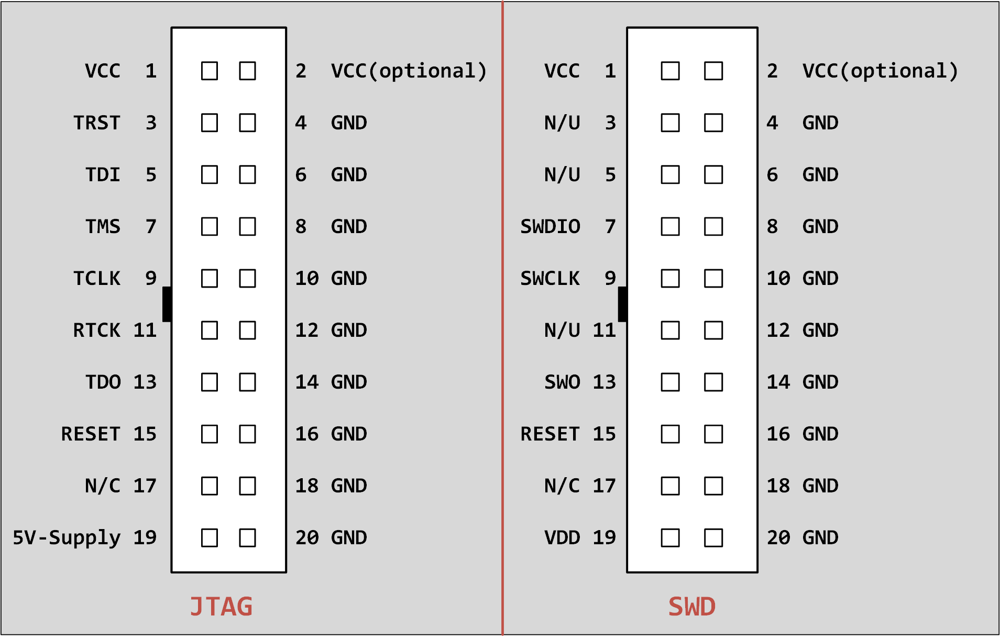
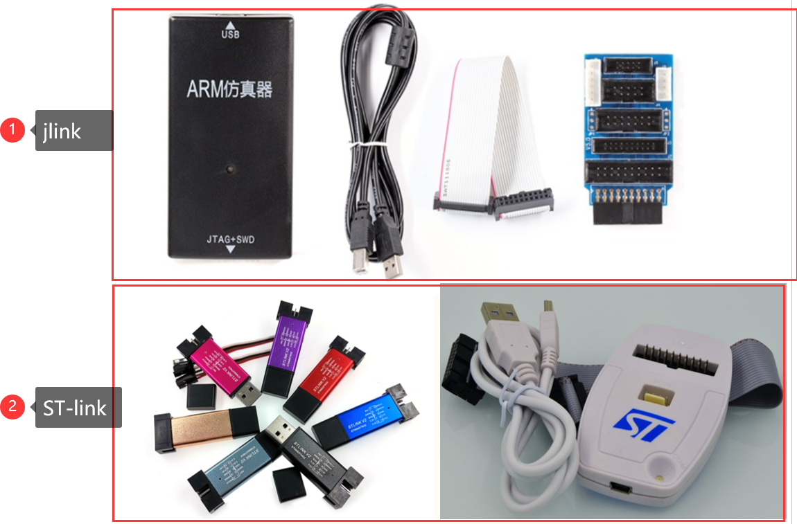
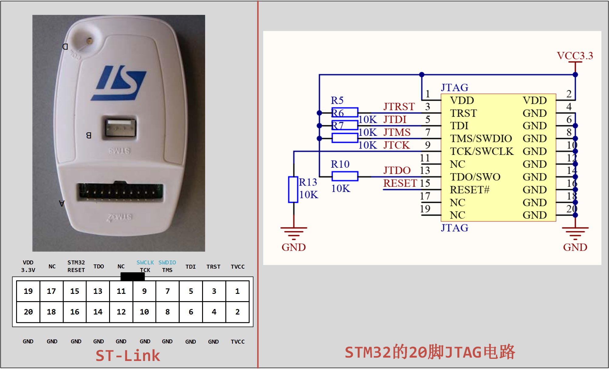

<!-- more -->


## 一、调试通信协议简介

### 1. 两种协议

> Tips：这里有一篇文档可以参考：[ARM Debug Interface v5 Architecture Specification](https://developer.arm.com/documentation/ihi0031/a/Introduction/About-the-ARM-Debug-Interface-version-5--ADIv5-?lang=en)

#### 1.1 JTAG

JTAG（Joint Test Action Group，联合测试行动小组）是一种国际标准测试协议（IEEE 1149.1兼容），主要用于芯片内部测试。现在多数的高级器件都支JTAG协议，如ARM、DSP、FPGA器件等。标准的JTAG接口是4线：TMS、 TCK、TDI、TDO，分别为模式选择、时钟、数据输入和数据输出线。 相关JTAG引脚的定义为：

```txt
TMS：测试模式选择，TMS用来设置JTAG接口处于某种特定的测试模式；
TCK：测试时钟输入；
TDI：测试数据输入，数据通过TDI引脚输入JTAG接口；
TDO：测试数据输出，数据通过TDO引 脚从JTAG接口输出；
```

JTAG接口的数据传输是双向串行传输。通过TDI接口，仿真器将数据一位位的送入MCU的JTAG电路中；通过TDO接口，MCU将JTAG内部的数据一位位的输出；数据的输入输出均是在TCK信号的上升沿/下降沿进行同步的。具体来说就是MCU的JTAG电路在TCK的上升沿采样TDI的信号，在下降沿在TDO输出数据。

目前JTAG已经作为一种常用的调试接口集成了各种单片机和嵌入式处理器上。PC机：运行IDE软件，将相应的单步、全速等调试命令发送至JTAG仿真器；JTAG仿真器：将调试命令转换成相应的JTAG时序信号传送至目标板的JTAG接口；目标板：运行应用程序，被调试和控制的目标。更为形像化的一点说法是， IDE和仿真器都相当于一种协议转换器：IDE将开发人员的各种调试操作转变了调试命令；JTAG将调试命令转换成JTAG时序。最终实现了应用程序在目标板上的实时调试。

#### 1.2 SWD

SWD，串行调试（Serial Wire Debug），是ARM公司开发的一种两线式调试接口协议，2006年首次随Cortex-M3推出。它专门用于Cortex-M系列微控制器的调试和编程。与 JTAG 相比，SWD只要两根线，分别为：SWCLK和SWDIO，减少了对单片机GPIO口的占用：

```txt
SWDIO :串行数据线，用于数据的读出和写入
SWDCLK:串行时钟线，提供所需要的时钟信号
```

SWD 模式比 JTAG 在高速模式下面更加可靠。 在大数据量的情况下面 JTAG 下载程序会失败, 但是 SWD 发生的几率会小很多。基本使用 JTAG 仿真模式的情况下是可以直接使用 SWD 模式的, 只要仿真器支持。


### 2. 引脚定义

市面上大多为20脚的JTAG和SWD，这里说一下他们的引脚排布，图中的小黑块就表示缺口的一侧：



市面上多数仿真器都是20脚并且同时支持JTAG和SWD的。

## 二、硬件调试工具

> JLINK和STLINK是实现了上述协议的硬件调试工具。它们的关系是：JLINK和STLINK这类调试器，使用JTAG或SWD这类协议，与目标芯片进行通信，从而完成调试和编程任务。

### 1. 概述

我们平时在市面上会看到两种往STM32下载程序的工具，如下图：



如果代码工程比较大，难免存在一些 bug，这时，就有必要通过硬件调试来解决问题了。串口只能下载代码，并不能实时跟踪调试，而利用调试工具，比如 ST-LINK， JLINK 和ULINK 等就可以实时跟踪程序， 从而找到程序中的 bug， 使开发事半功倍，其实他们也叫作仿真器。在MDK中有一个下载按钮，可以一键下载程序：


就是这个按钮，所以使用 J-Link 和 ST-Link 不仅可以很方便的烧写程序，还可以进行硬件调试。

### 2. J-Link

J-Link是最著名的ARM开发调试工具，由SEGGER公司生产。提供对市面上几乎**所有ARM内核芯片的支持**。我看目前市面上最新版本的 J-Link 产品有V9版本，它支持JTAG和SWD模式。并且对主要的IDE环境如KEIL、IAR都有良好的支持。优点很多，因此也是首选的调试工具。

### 3. ST-Link

STLink 是由意法半导体公司推出的在线调试编程器，采用5V的**USB2.0**全速接口进行供电与数据传输，可以方便的对内部固件进行升级，同时支持以 **JTAG** 或 **SWD** 模式连接至 STM32 系列微控制器，或者以 **SWIM** 模式连接至 STM8 系列微控制器，操作温度介于0 ~ 50℃之间。由于 ST 公司极为重视中国市场，因此 ST-Link 的销售价格相对其它国外大厂的在线仿真设备要实惠许多，基本成为国内嵌入式工程师人手上必备的工具。ST-LINK见得多的版本目前为ST-LINK V2。

**其实了解到这就，我们可以知道 J-Link 支持所有 ARM 芯片的仿真调试，而 ST-Link 仅仅支持 ST 公司的相关芯片。**

市面上多数仿真器都是20脚并且同时支持JTAG和SWD的，我们以一款常见的ST-Link为例，说明一下实际引脚：



### 4. 总结

为什么有这样的工具出现？

> JTAG协议在定义时，当时的计算机（PC机）普遍带有并口，因而在连接计算机端是定义使用的并口。而计算机到了今天，不要说笔记本电脑，现在台式计算机上面有并口的都很少了，取而代之的是越来越多的USB接口。那么能不能让JTAG支持USB协议，用USB接口来调试ARM呢？出现了JLINK和ULINK了。
>
> Keil、IAR、DS-5、ADS等开发工具软件等都有一个公共的调试接口RDI，那么我们如何完成 RDI &rarr;JTAG调试协议的转换呢？有两种做法：
>
> （1）在电脑上写一个服务程序，把Keil、IAR、DS-5中的RDI命令解析成相关的JTAG协议，然后通后一个物理转换接口（注意，这个转换只是电气物理层上的转换，就像RS232那样的作用）发送你的的目标板。H-JTAG就是这样的。H-JTAG的硬件就仅是一个物理电平的转换接口，所以很简单。而电脑中装的H-JTAG软件就是前面说到的服务程序，负责协议转换的。
>
> （2）做一个板，用此板直接接收来自Keil、IAR、DS-5等软件的调试命令，由此板做RDIJTAG协议的转换。然后与目标板通信，这就是JLINK、ULINK2等仿真器的工作原理。
>
> 由上可以看出，H-JTAG由于是软件作协议转换的，所以速度较慢，但是硬件简单。而第二种方法的JLINK一般带一个强劲的CPU，作硬件协议转换，把以硬件复杂，但速度快。

目前，市场上的JTAG接口仿真器有**14引脚和20引脚**两种。其中，以20引脚为主流标准，但也有少数的目标板采用14引脚。经过简单的信号转换后，可以将它们通用。

## 三、参考资料

了解到这里，我们应该到哪里找 J-Link 和 ST-Link 的资料呢？一般来说我们买了对应的仿真器的话，都会附带赠送一些文档，比如接线图，驱动什么的，当然我们也可以去官网查找资料。

### 1. J-Link

官网地址：[Software Development Tools by SEGGER – The Embedded Experts](https://www.segger.com/)

驱动下载：[SEGGER - The Embedded Experts - Downloads - J-Link / J-Trace](https://www.segger.com/downloads/jlink/)

用户指南：[UM08001 J-Link / J-Trace User Guide - SEGGER Wiki](https://wiki.segger.com/UM08001_J-Link_/_J-Trace_User_Guide)

### 2. ST-Link

官网地址：[意法半导体-STMicroelectronics](https://www.st.com/content/st_com/zh.html)（ST出的，那自然就是ST官网啦）

ST-Link相关资源地址：[ST-LINK/V2 - STM8和STM32的ST-LINK/V2在线调试器/编程器 - 意法半导体STMicroelectronics](https://www.st.com/zh/development-tools/st-link-v2.html#overview)

驱动下载：[STSW-LINK009 - 为Windows 7、Windows 8、Windows 10签署的ST-LINK、ST-LINK/V2、ST-LINK/V2-1 USB驱动 - 意法半导体STMicroelectronics](https://www.st.com/zh/development-tools/stsw-link009.html)

用户文档：[ST-LINK/V2 in-circuit debugger/programmer for STM8 and STM32 - User manual](https://www.st.com/resource/en/user_manual/um1075-stlinkv2-incircuit-debuggerprogrammer-for-stm8-and-stm32-stmicroelectronics.pdf)


> 参考文档：
> [深入解析JTAG调试接口及边界扫描技术-CSDN博客](https://blog.csdn.net/worf1234/article/details/7312184)
