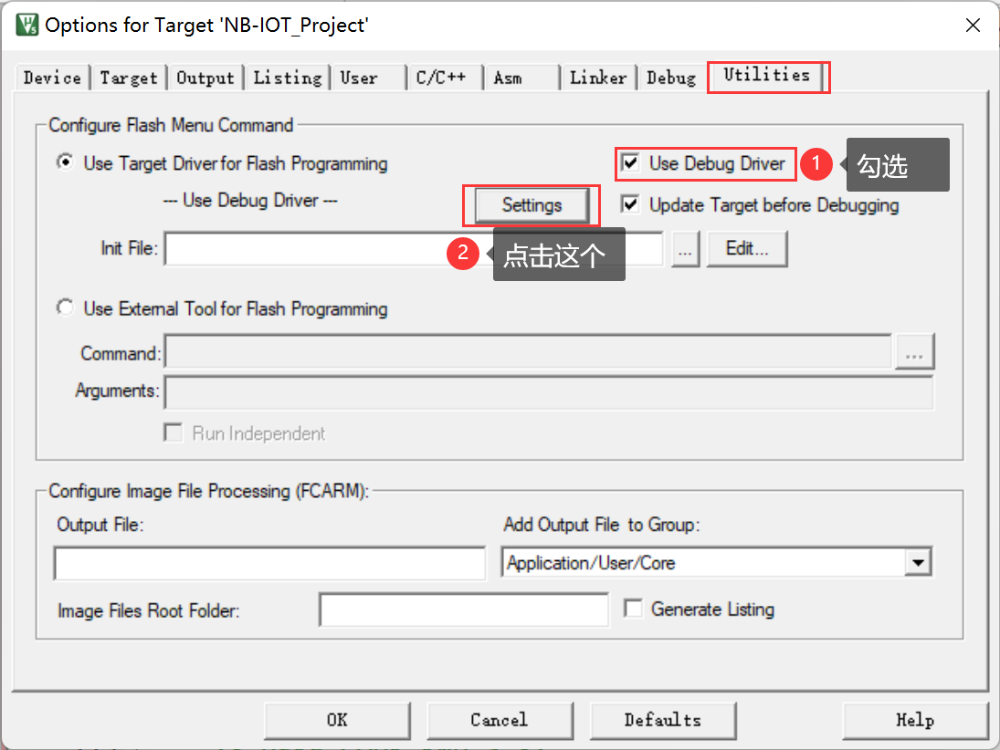
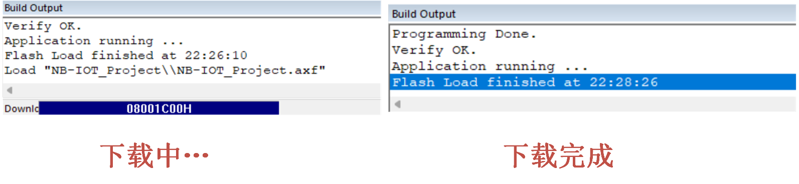

<!-- more -->

## 一、驱动安装

### 1. 在哪里下载？

我们到官网去下载一个：[SEGGER - The Embedded Experts - Downloads - J-Link / J-Trace](https://www.segger.com/downloads/jlink/)，可以选一个版本使用，我这里选的V7.86h，后我们可得到一个JLink_Windows_V786h_x86_64.exe可执行文件。

### 2. 安装驱动

这个由于我之前安装过，这里就不记录未安装J-Link驱动时的样子了，我们双击可执行文件，一路下一步就是了。安装过程如下图：

要是勾选了在桌面创建快捷方式，那么这里会生成这两个快捷方式：

- J-Flash V7.86h 是一个烧写软件，可以让我们使用J-Link直接烧写代码到STM32的Flash中去。

- J-Link Commander V7.86h是一个命令行，没仔细研究，但是看情况应该是跟J-Flash V7.86h是一样的功能，只是一个是图形界面，一个是终端界面。

## 二、MDK配置

我们打开一个工程，然后点击【魔术棒按钮】&rarr;【Debug】&rarr;【Use】&rarr;【选择ST-Link Debugger】

最后我们点击Settings，会有如下弹窗（注意在这里可能会提示让更新J-Link固件，一直按照提示下一步就是了，一般没什么坑）：

（1）Port：这里可以选择使用SWD或者JTAG，一般我们的J-Link是支持两种方式的，这里更推荐SWD，毕竟占用的引脚更少，产生冲突的可能性更小。

（2）Max：这里选择最大时钟速率，我们设置为默认的 5Mhz（需要更新固件，否则最大只能到 1.8Mhz），这里，如果 USB 数据线比较差，那么可能会出问题，此时，可以通过降低这里的速率来试试 。

（3）这里是识别到的J-Link，出现这个才表示J-Link被MDK正确识别了。

接下来我们还需要在 Utilities 选项卡里面设置下载时的目标编程器：  我们直接勾选 Use Debug Driver，即和调试一样，选择 J-LINK 来给目标器件的 FLASH 编程：

然后在上边这个图中点击 Settings， 进入 FLASH 算法设置 ：

这里 MDK5 会根据我们新建工程时选择的目标器件，自动设置 flash 算法。我们使用的是STM32F103ZET6， FLASH 容量为 512K 字节， 所以 Programming Algorithm 里面默认会有 512K  型号的 STM32F10x High-density Flash 算法。 特别提醒： 这里的 512K flash 算法，不仅仅针对512K 容量的 STM32F103，对于小于 512K FLASH 的型号，也是采用这个 flash 算法的。最后，选中 Reset and Run 选项，以实现在编程后自动运行，其他默认设置即可。

## 三、下载到单片机

设置完成后，我们编译工程，然后点击这个按钮一键下载：

下载过程如下：

