<!-- more -->

## 一、JFlash简介

我们有源码的时候可以使用MDK编译，然后一键下载，那我们要是没有源码怎么办？用串口吗？当然可以，还有别的办法吗？有啊，下边我们就来了解一下吧。

J-Flash 是单独的Flash ISP烧写软件，是一种独立Flash编程软件了，可以把单独的bin文件或者hex文件烧写到单片机的flash里面去。它是在安装 J-Link 驱动时自带的一款Flash ISP软件，支持bin格式、hex格式、srec格式（Motorola的）。

## 二、安装jFlash

这个软件一般是随着J-Link驱动安装一起自动安装的，所以在我们安装好J-Link驱动的时候，这个软件就已经被安装好了，没有必要再单独安装，我们找到后直接双击打开使用就好，打开后界面如下：

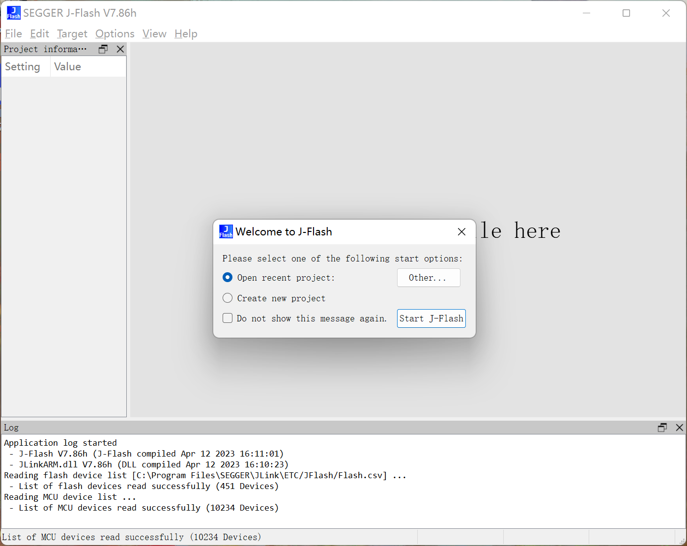

>[J-Link Flash Download](https://www.segger.com/products/debug-probes/j-link/technology/flash-download/)

## 三、基本使用

### 1. 创建工程

- （1）【Create new project】&rarr;【Start J-Flash】

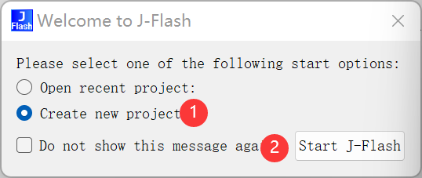

① 创建新工程；

② 开始创建。

### 2. 配置工程

- （2）配置工程

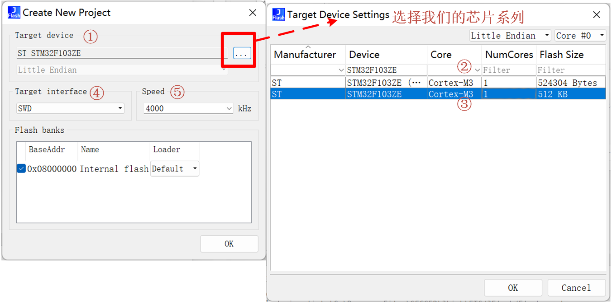

① 选择目标芯片设备；

② 过滤框，可以添加一系列的过滤条件，快速找到我们的芯片；

③ 选择我们使用的芯片系列，然后点击OK即可；

④ 这里可以选择使用SWD或者是JTAG，我们还是选择引脚较少的SWD；

⑤ 选择下载的速率，我一般都是填的默认。

最后点击OK，就可以进入我们新创建的工程啦：

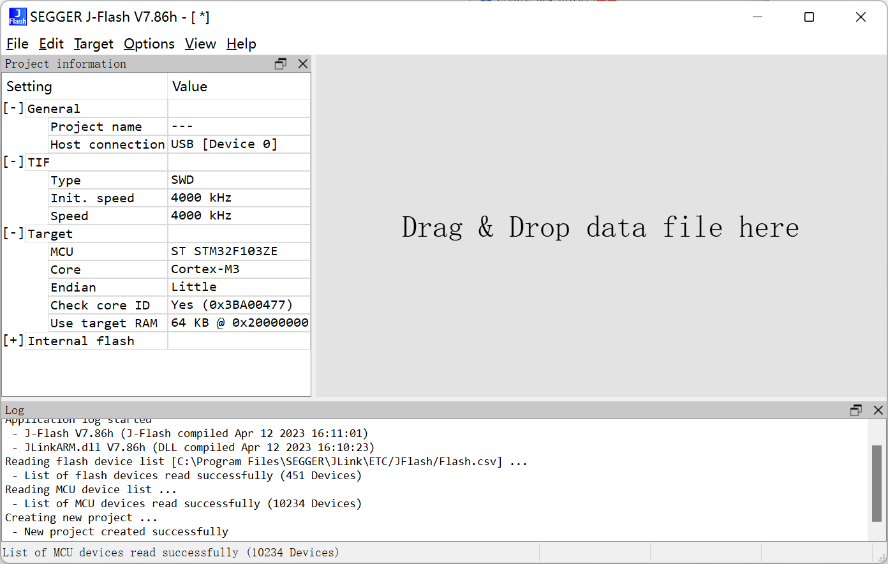

### 3. 连接设备

- （3）连接设备

如果选择的是SWD模式，就要连接SWDIO、SWCLK、GND这三根线，连接好之后，点击【Target】&rarr;【Connect】，如果连接成功，在下面的LOG窗口会显示连接成功。

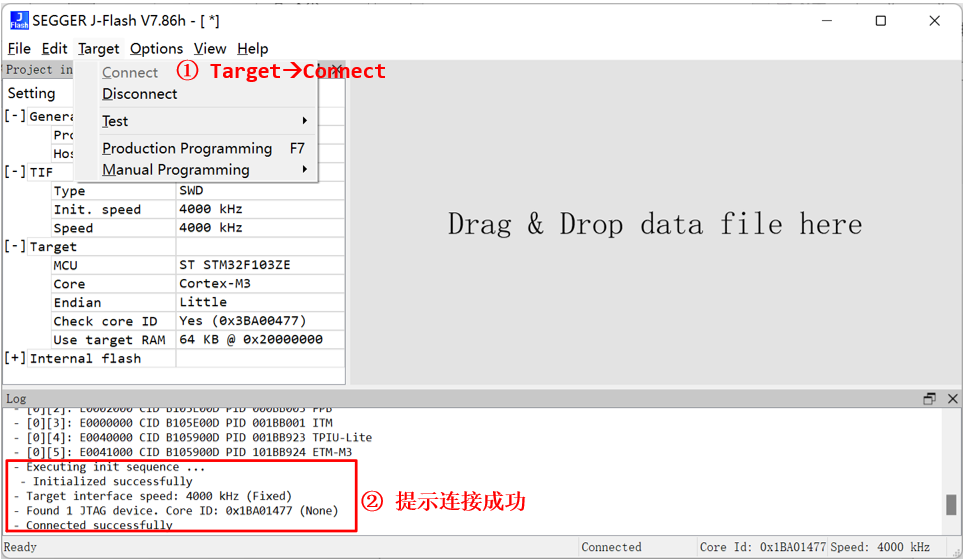

### 4. 打开烧写的文件

- （4）打开烧写的文件

JLink支持Hex、Bin等多种文件类型，【File】&rarr;【Open data file】

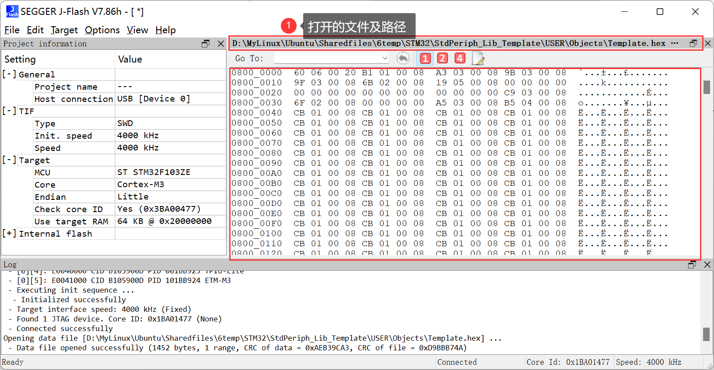

注意：这里如果选择的是bin文件，还需要指定烧写的起始地址（Flash的起始地址，一般就是0x8000 0000），因为bin文件是不包含烧写地址的，而hex文件是包含的。

### 5. 开始烧写

- （5）开始烧写

打开Hex文件之后，点击【Target】&rarr;【Producion Programming】，或者使用快捷键F7，等待几秒之后，程序就下载进去了，下载成功后，会在底部窗口显示烧写成功。

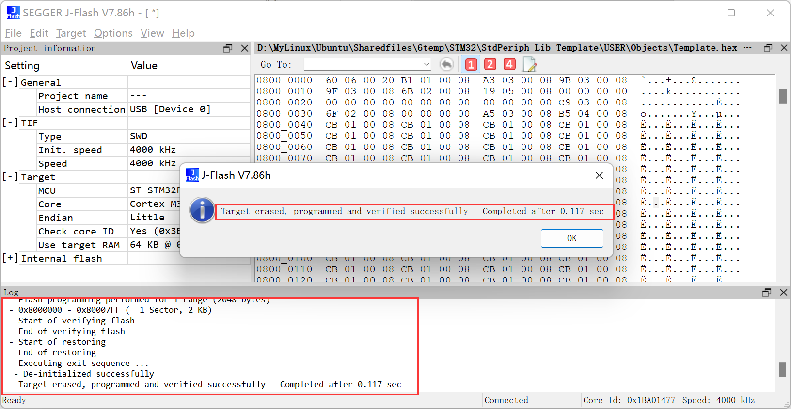

### 6. 运行程序

- （6）运行程序

烧写成功之后，此时程序还没有运行，点击【Target】&rarr;【Manual Programming】&rarr;【Start Application】，或者按快捷键F9，程序才开始运行，或者按复位键也可以让程序运行。

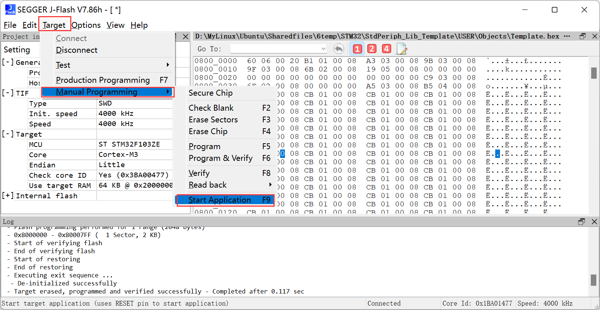

### 7. 保存工程

- （7）保存工程

退出的时候会提示我们保存工程，我们可已经这个工程保存到一个指定的目录，下一次再为这个芯片烧写的时候就不用再进行工程配置了，工程文件的后缀名为 .jflas 。

## 四、程序自动运行

- 程序自动运行：如果想让每次下载完成后，程序自动运行，而不用复位。可以使用工程配置下的自动运行选项。打开【Option】&rarr;【Project Setting】，切换到【Production】选项，勾选【Start Application】，就可以让程序自动运行。

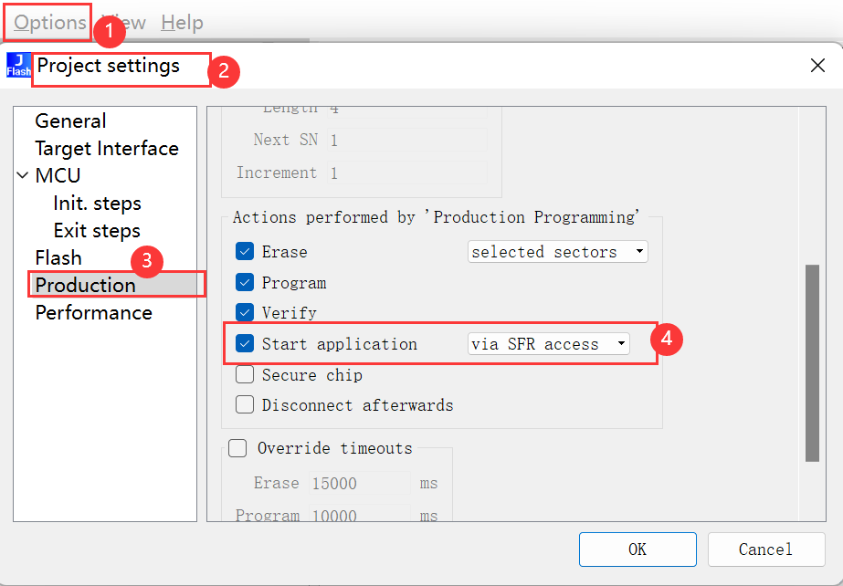

## 五、读取单片机内部程序

选择【Target】&rarr;【Manual Programming】&rarr;【Read Back】，一共有三个选项，用于读取不同的Flash地址范围。

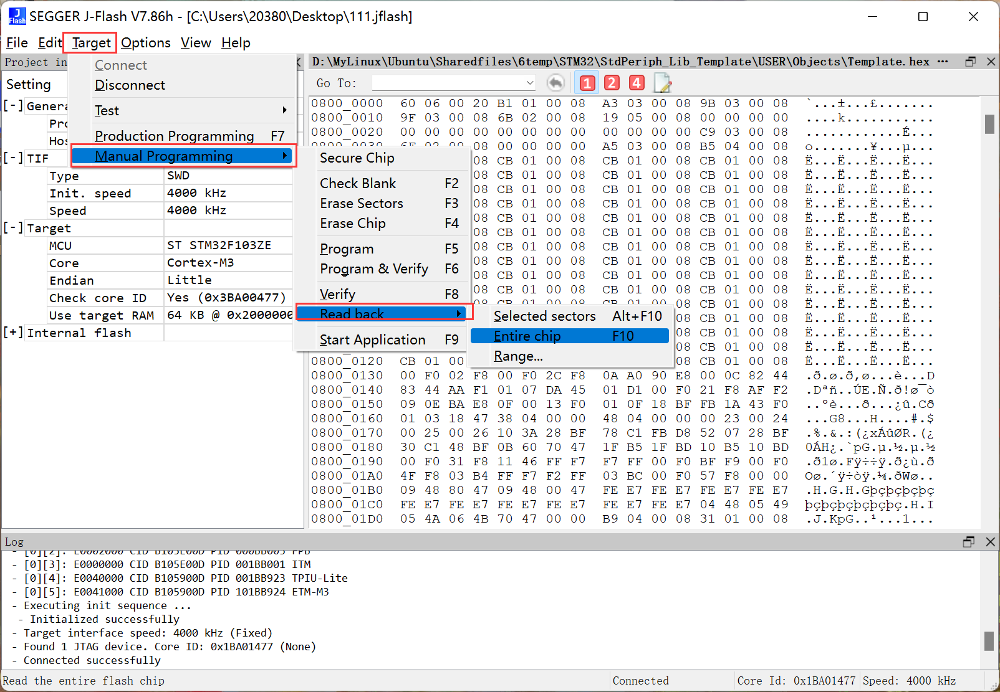

- Selected sectors

意思是被选择的扇区，可以在工程配置选项【Project settings】 &rarr; 【Flash】，查看哪些扇区被选择了。

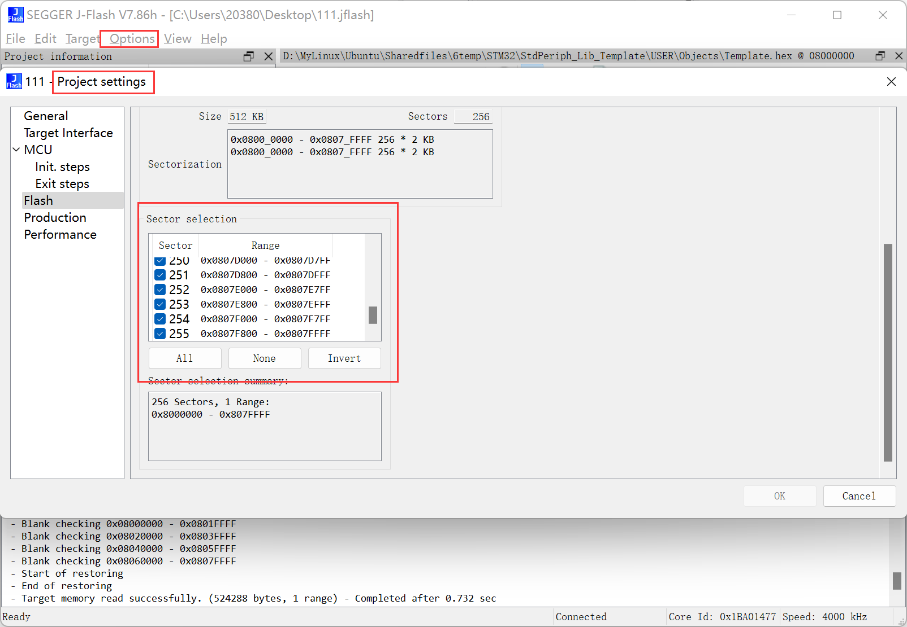

- Entire chip：整个Flash区域，一般选择这个选项，读取整个Flash区域的程序。

- Range：手动指定读取的Flash地址范围：

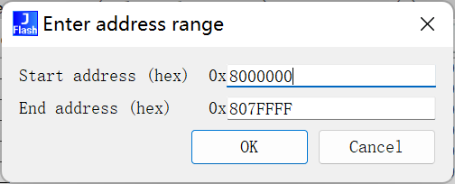

一般来说，这里我们选择Entire chip就可以了，读取整个Flash区域，地址范围：0x8000000~0x807FFFF

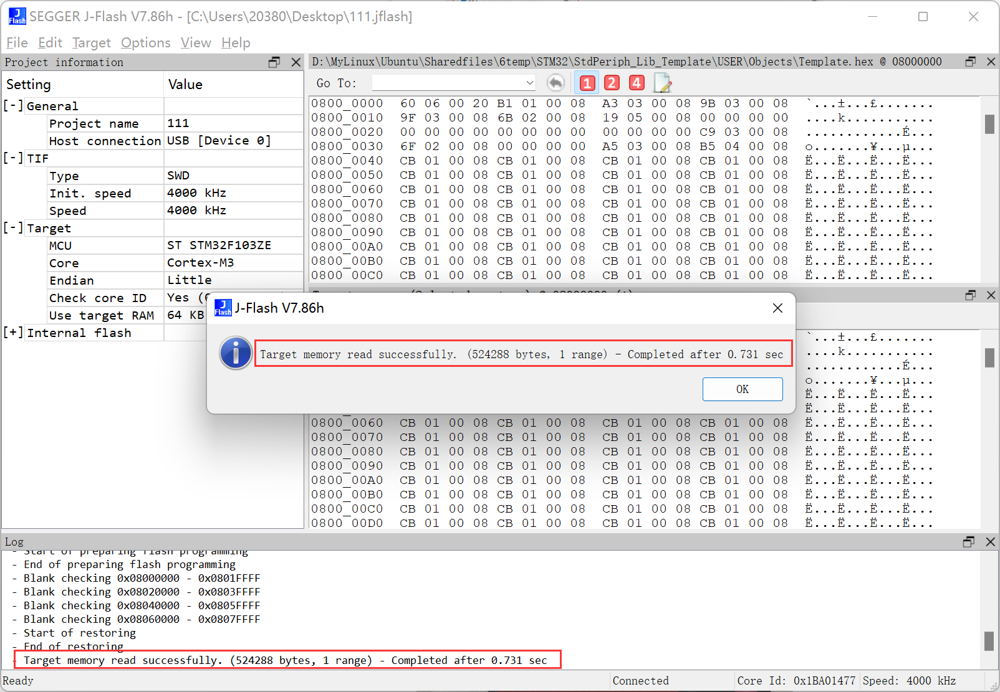

等几秒钟，就可以看到底部窗口显示读取成功的信息。然后我们点击OK，就会看到在数据区域出现了我们读出来的数据，我们可以看一下，读取的数据跟我们烧写进去的数据是一样的。

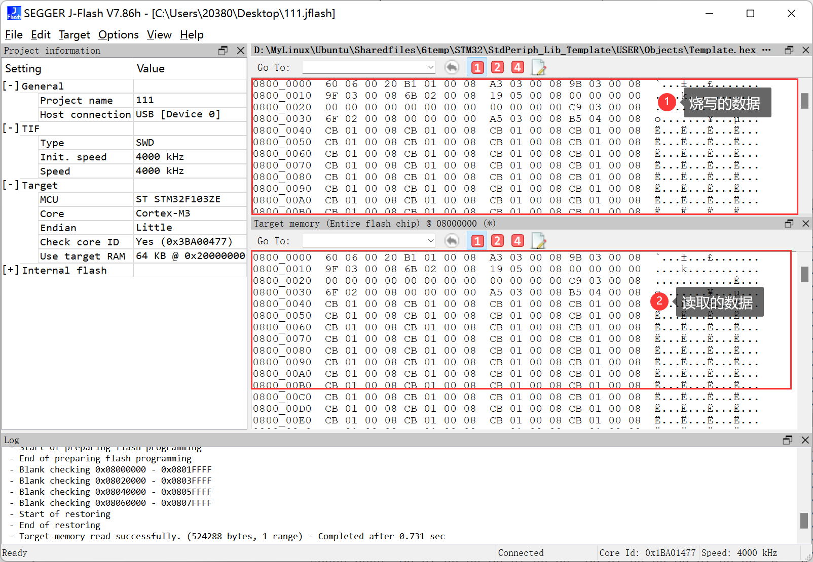

然后我们也可以保存读取到的数据，选项【File】&rarr; 【Save data file】（当是我们读取到的数据的时候这里才可选，不然是灰色的，无法使用，将光标放在我们读取的数据的区域即可）或者是【Save data file as】，保存类型根据需要选择，建议选择Hex格式，已经包含了地址信息。保存好数据后，我使用beyond compare比较工具比较一下读取的和烧写的数据，结果发现还是有很大的不同的，这个不清楚是为什么，可能还是地址信息的问题导致的，但是从软件中看到的信息说明我们烧写进去的数据与读回的数据是一致的。我们也可以将读取的hex文件重新烧写到板子上，看看是不是一样的现象就可以确定我们读取的数据是否与烧写的一致。

既然能这么简单的读取到单片机的程序，那么我们自己的程序应该如何保护起来呢？很显然，我们可以对Flash设置读保护功能，即大家说的“加密”功能，可以防止对Flash的非法访问，这里的加密是针对整个Flash区域的，如果设置了读保护功能，那么程序只能正常的从RAM中加载运行，而不能通过调试器读出来，那么别人就不能破解了。在ST提供的固件库中已经有相关函数了，后边学习到的时候再说。
