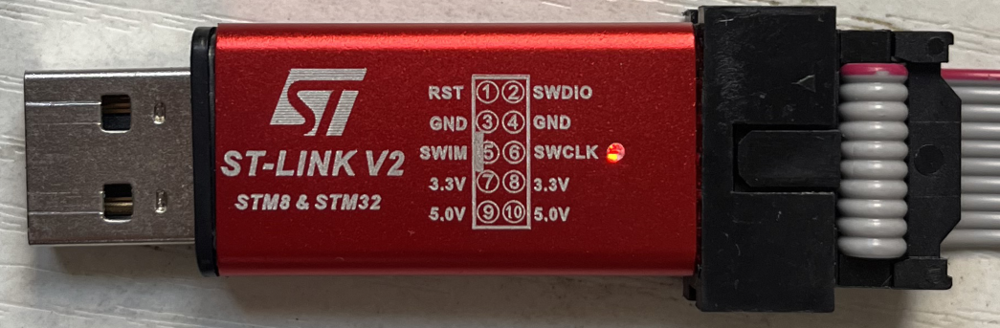
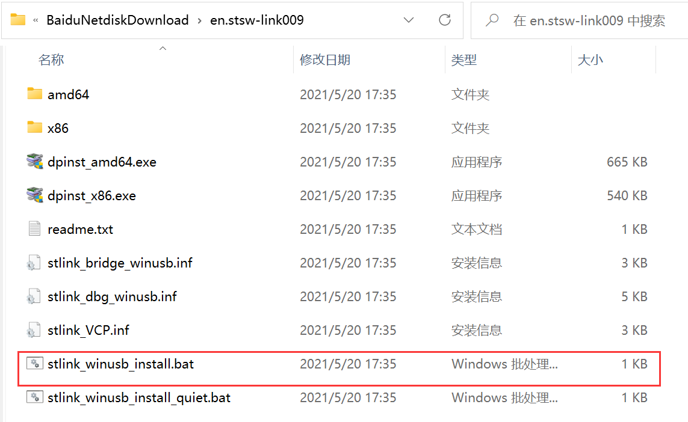
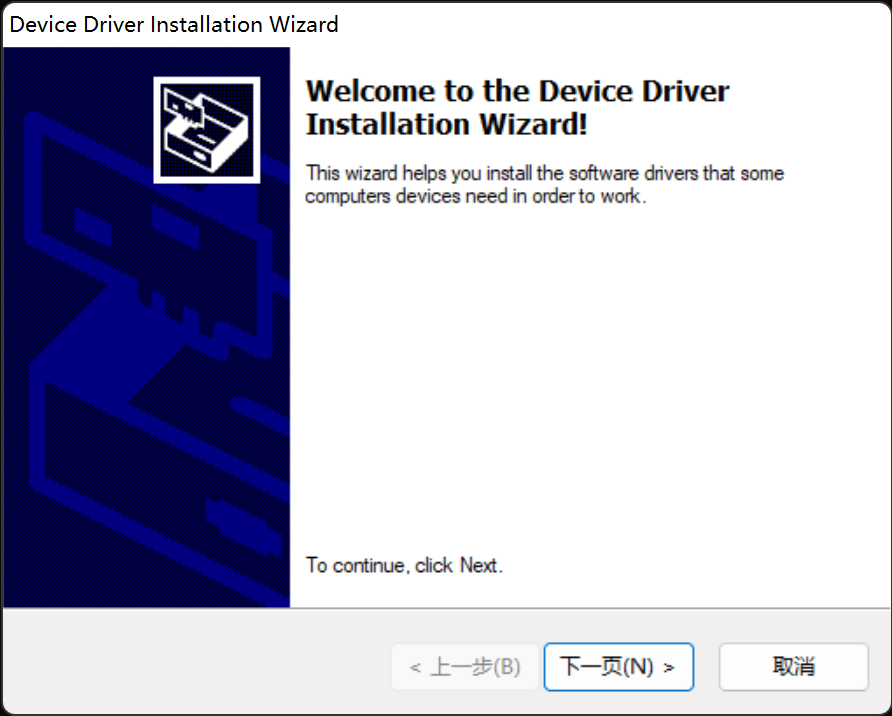
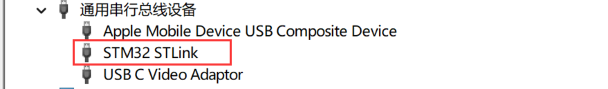
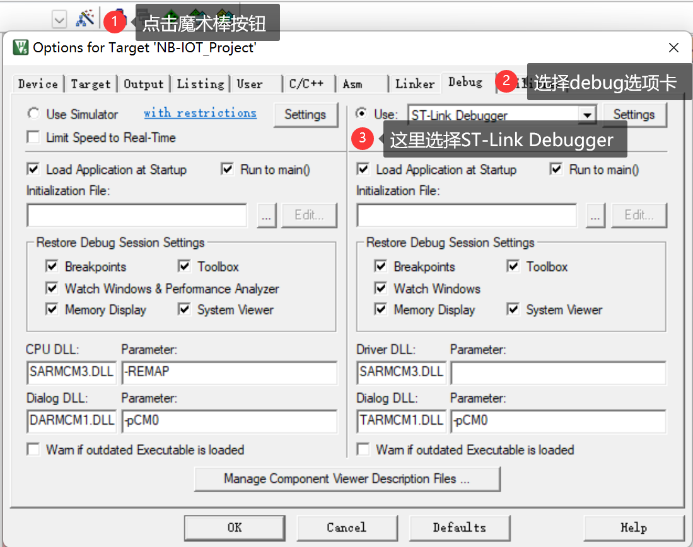
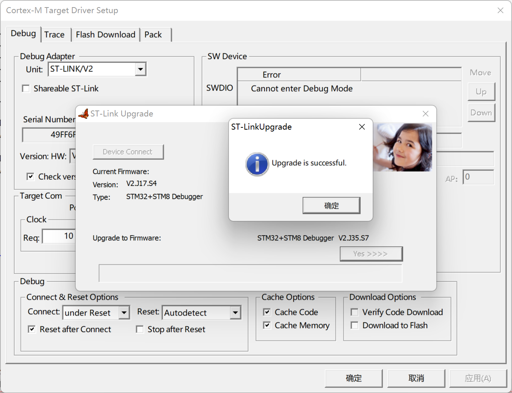
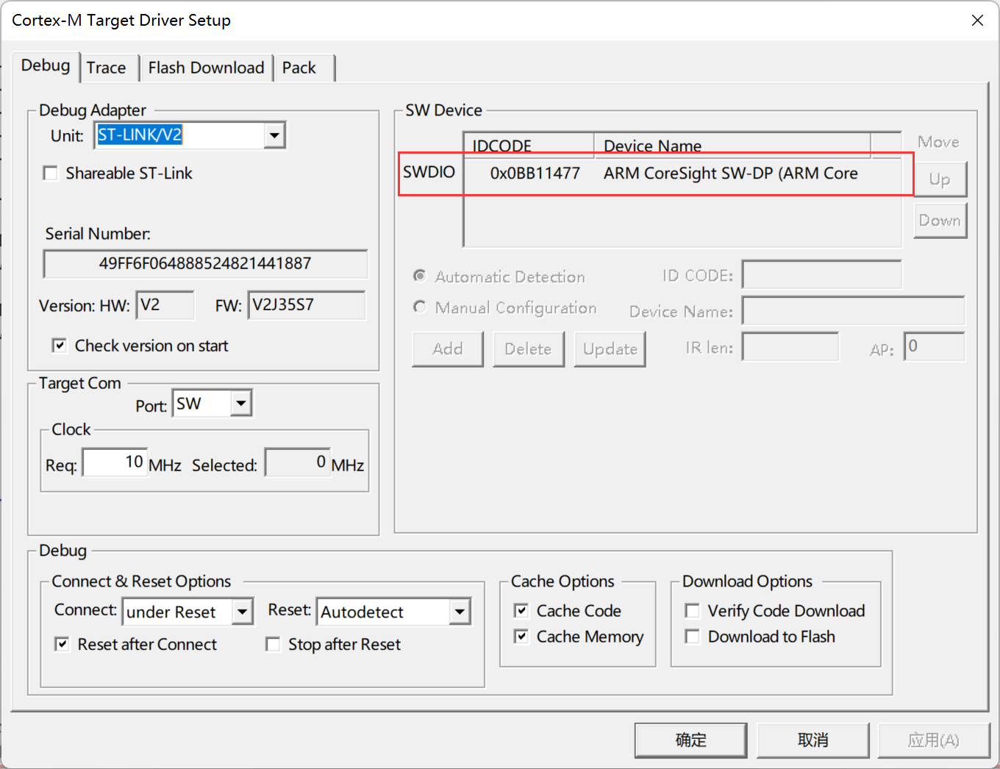
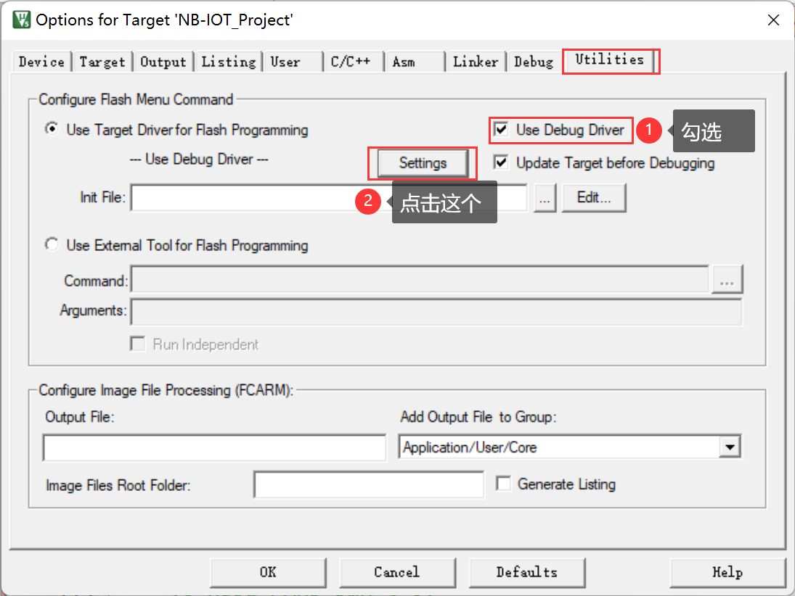
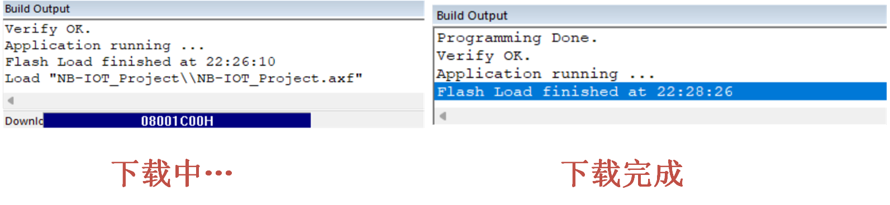

<!-- more -->

我这有一款ST-Link，这个是10脚的，引脚图直接画在正面了，如下图所示，按照排线的孔插入对应底座就可以啦。

## 一、驱动安装

### 1. 驱动下载

我们到官网去下载一个：[STSW-LINK009 - 为Windows 7、Windows 8、Windows 10签署的ST-LINK、ST-LINK/V2、ST-LINK/V2-1 USB驱动 - 意法半导体STMicroelectronics](https://www.st.com/zh/development-tools/stsw-link009.html#get-software)

下载最新版的之后，我们解压后会得到如下一系列的文件，可能跟老版本的驱动安装有些不一样：

### 2. 安装驱动

我们将ST-Link插入电脑USB，并且另一端要连接开发板，没有安装驱动前，我们的设备管理器可以识别到这个STLink但是会有一个感叹号，说明我们还没有安装驱动。

我们选中刚解压出来的 stlink_winusb_install.bat 文件，然后右键，以管理员身份运行，然后会有下边这样一个弹窗，我们直接点击下一页就是了，后边需要安装的点安装，需要下一步的选下一步，最后完成就是了。

安装驱动完成后，我们重新插拔一次ST-Link，再看设备管理器，会发现一次，被电脑识别了：

这就表示我们安装驱动成功了。

## 二、MDK工程配置

我们打开一个工程，然后点击【魔术棒按钮】&rarr;【Debug】&rarr;【Use】&rarr;【选择ST-Link Debugger】

最后我们点击Settings，会有如下弹窗，若是第一次使用ST-Link，可能会进入ST-Link固件升级界面，先点击“ Device Connect”连接设备， 连接成功后会显示当前设备的版本号、类型信息。 然后点击“ Yes”即可自动升级，待升级进度条完成。

更新完毕后，我们重新插拔一次ST-Link，重新进入Debug选项卡，选好调试工具后，再次点击Setting，然后就会如下图所示，识别到我们的ST-Link啦

我们使用 ST-LINK 的 SW 模式调试，因为我们 JTAG 需要占用比 SW 模式多很多的 IO 口，而在开发板上这些 IO 口可能被其他外设用到，可能造成部分外设无法使用。所以， 建议在调试的时候，一定要选择 SW 模式。 Max Cloc我们设置为最大： 4Mhz（需要更新固件，否则最大只能到 1.8Mhz），这里，如果USB 数据线比较差，那么可能会出问题，此时，可以通过降低这里的速率来试试。新版本的这里可能是跟上图一样，是一个Req，我一般都是默认。单击确定，完成此部分设置。

接下来我们还需要在 Utilities 选项卡里面设置下载时的目标编程器：  我们直接勾选 Use Debug Driver，即和调试一样，选择 ST-LINK 来给目标器件的 FLASH 编程：

然后在上边这个图中点击 Settings， 进入 FLASH 算法设置 ：

这里 MDK5 会根据我们新建工程时选择的目标器件，自动设置 flash 算法。我们使用的是STM32F103ZET6， FLASH 容量为 512K 字节， 所以 Programming Algorithm 里面默认会有 512K  型号的 STM32F10x High-density Flash 算法。 特别提醒： 这里的 512K flash 算法，不仅仅针对512K 容量的 STM32F103，对于小于 512K FLASH 的型号，也是采用这个 flash 算法的。最后，选中 Reset and Run 选项，以实现在编程后自动运行，其他默认设置即可。

## 三、下载代码

设置完成后，我们编译工程，然后点击这个按钮一键下载：

下载过程如下：

