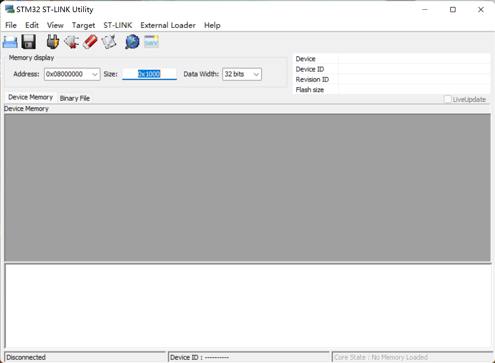
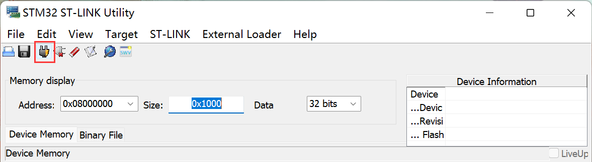
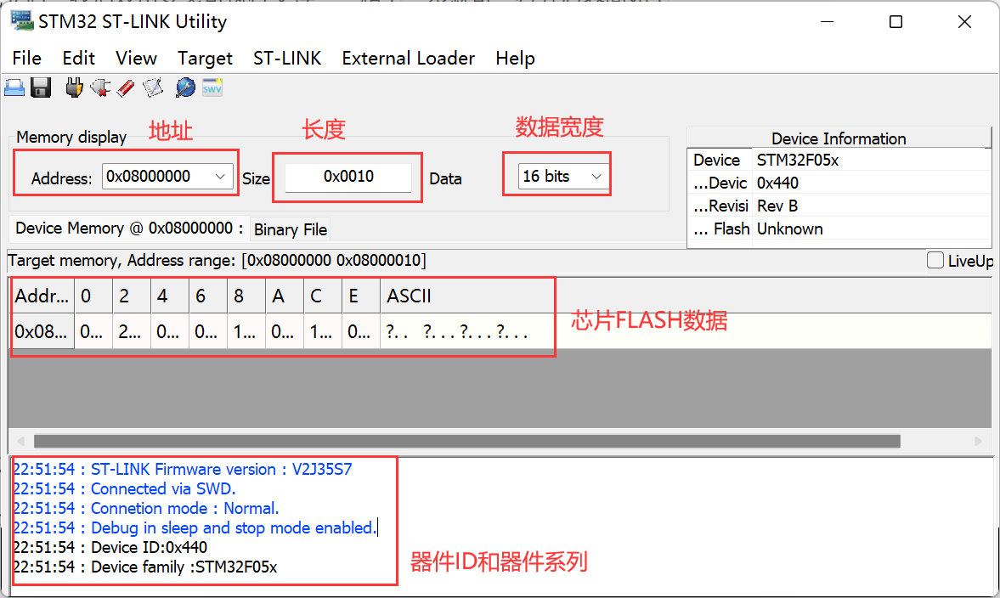
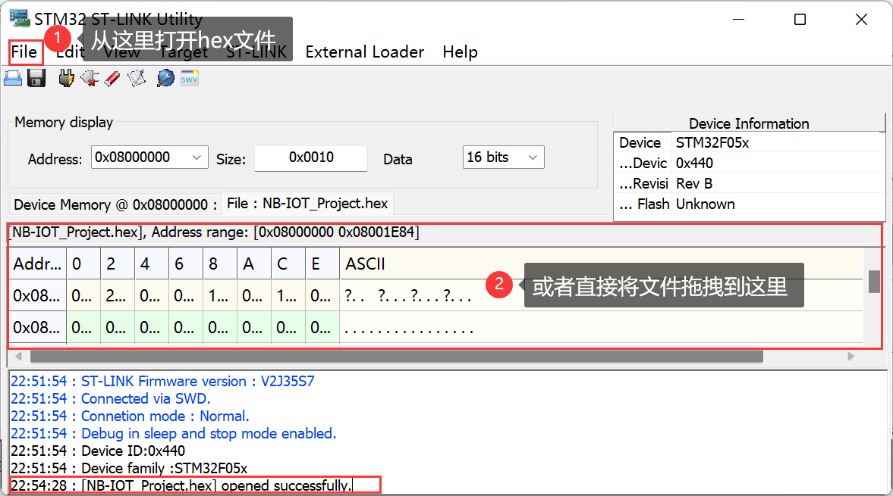
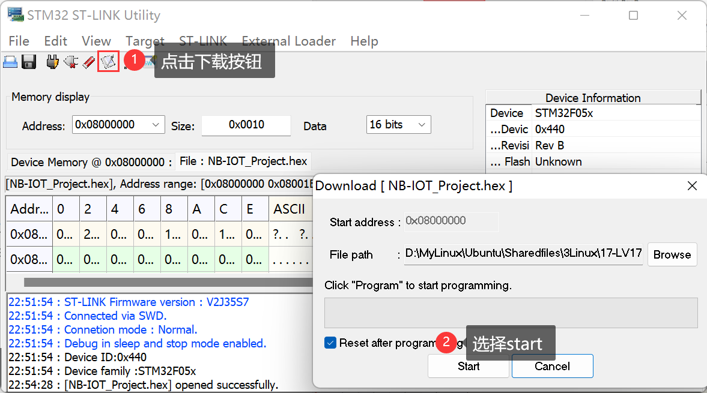
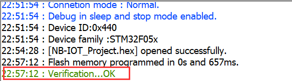
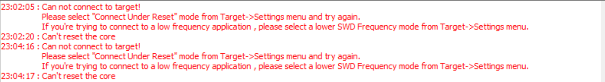
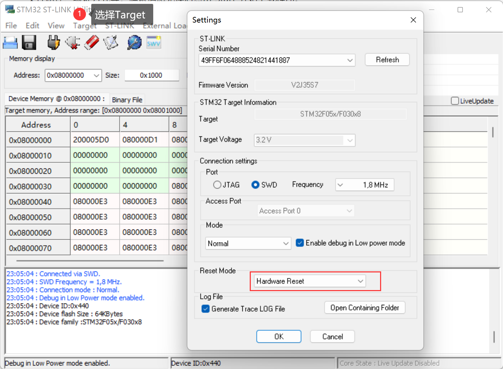
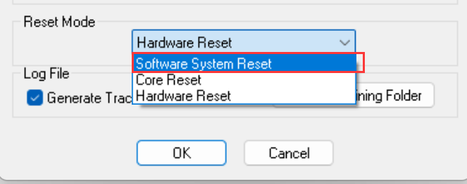
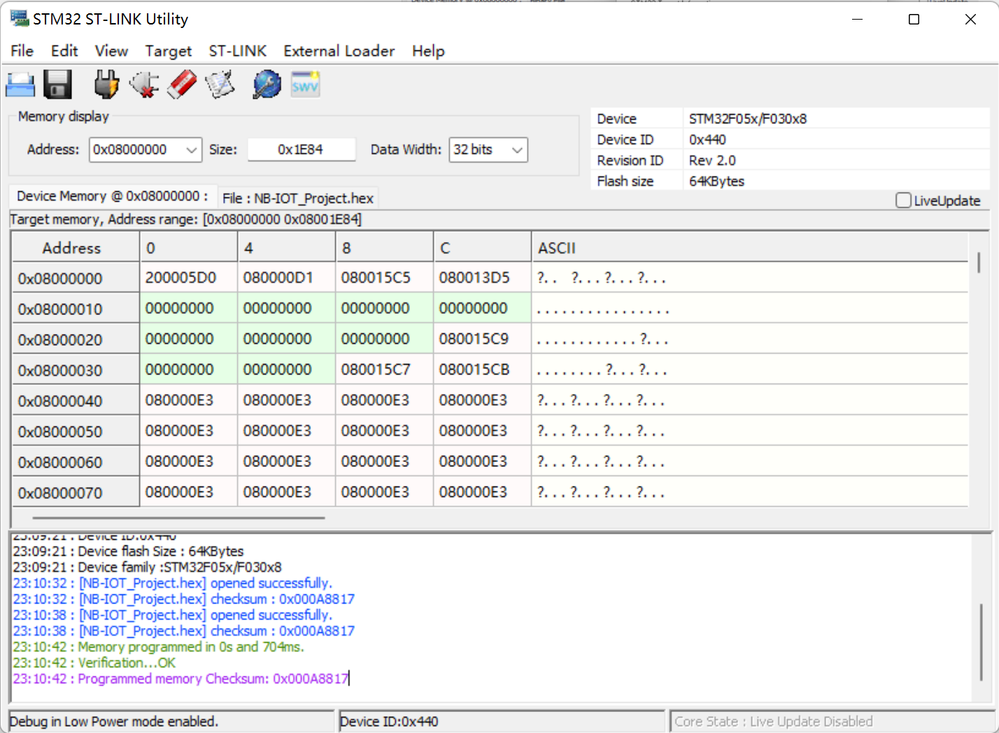

<!-- more -->

## 一、简介

我们有源码的时候可以使用MDK编译，然后一键下载，那我们要是没有源码怎么办？用串口吗？当然可以，还有别的办法吗？有啊，下边我们就来了解一下吧。

STM32 ST-LINK Utility这个软件工具其实主要就是配套“ST-LINK”这个下载工具一起使用的上位机软件。因此使用STM32 ST-LINK Utility上位机软件需要有一个ST-LINK工具才行。它的功能和J-Link对应的工具类似，用于烧写代码。

STM32 ST-LINK Utility工具在产品开发过程中测试一些其他版本的代码，可以直接下载hex，而不用打开工程再编译去下载。 当开发完一个STM32产品，需要量产的时候，就可以用这个工具直接**下载hex代码**，对**代码加密**（读保护）。它也是比较实用的一个工具，当我们需要查看芯片FLASH数据时，可以很快定位查找到想要的数据（前提是没有添加保护）。另外它还可快速读取STM32芯片型号、ID、版本等信息。

STM32 ST-LINK Utility软件包含ST-Link驱动。若安装了STM32 ST-LINK Utility软件，ST-Link就不用单独安装驱动了，可以直接使用（比如Keil、IAR在线调试、下载等）。

## 二、下载安装

我们可以在这里下载这个软件：[STSW-LINK004 - STM32 ST-LINK Utility - 意法半导体STMicroelectronics](https://www.st.com/zh/development-tools/stsw-link004.html#get-software)

下载完后，我们双击安装可执行文件，一路下一步就可。打开后界面如下：

## 三、下载代码

接下来就是烧写代码啦，我们还是要首先通过MDK生成一个hex文件，然后再开始烧写。

- （1）连接STM32并读取相关信息

使用ST-Link连接硬件（STM32芯片），打开STM32 ST-LINK Utility软件，连接芯片：【Tarage】  &rarr; 【connect】或直接点击连接快捷按钮（如下图）。

然后若是可以正确连接，我们将会得到以下信息：

- （2）打开程序 hex 文件

在上一步连接好芯片，并正确识别芯片之后，打开需要下载的程序（hex）文件。打开hex文件可以从菜单栏（【File】 &rarr; 【Open File】）打开，也可以直接讲hex文件**拖动**到FLASH区域（就像从电脑复制文件到U盘一样）。

打开后，会有上图的提示信息。

- （3）下载程序

在上一步打开hex文件完成之后，点击“**下载**”（可以【Taraget】&rarr; 【Program】，也可以直接点击下载快捷按钮，如下图）然后会弹出信息确认窗口，如hex文件路径、验证方式等，确认信息无误后点击“Start”开始下载程序。

下载过程时间长短与程序大小有关，一般都很快，出现“Verification...OK”，说明下载成功。

## 四、问题解决

最开始我下载了最新版本，结果连接不上，一直报下边的错：

后来查阅资料发现，问题在这里：

注意这里一定要正常连接好ST-Link后这些选项才是可选的。这里的 Reset Mode模式是 Hardware Reset，所以我们点击 connect 之后需要按一下板子的 reset 按钮，手动对芯片复位，才可以正常连接到 ST-Link ，识别到芯片信息，但是这样一点都不方便，我们可以将这里改为软件系统复位（Software System Reset）。

然后再重新连接，就不用操作什么了，软件会自己去复位芯片，就可以很快连接上啦：

# 
