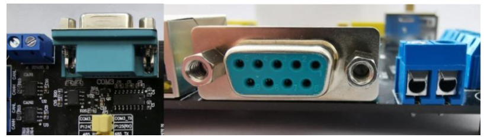
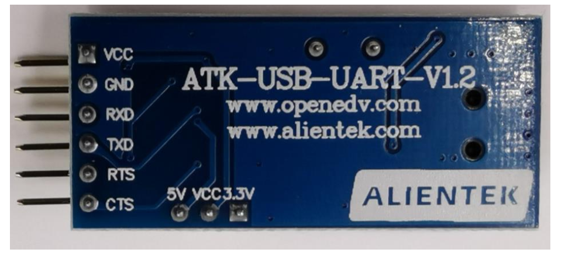
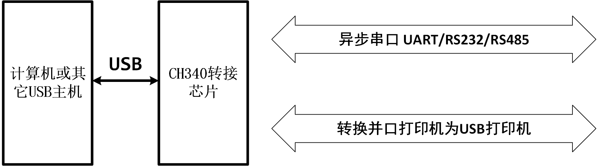
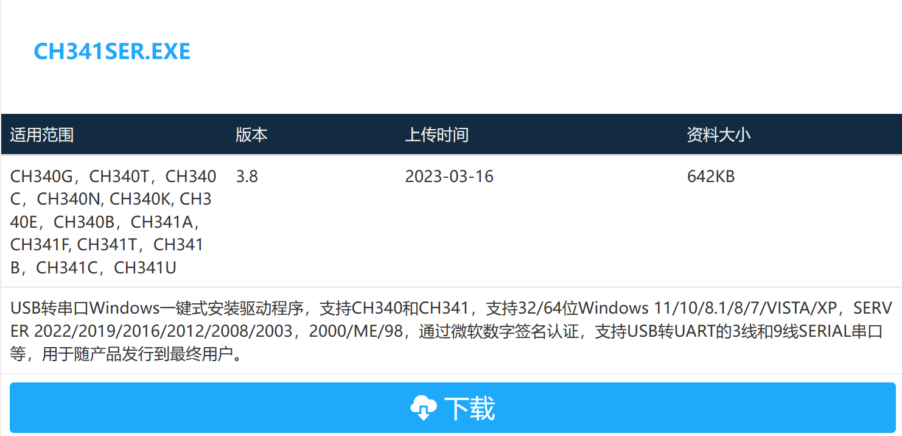
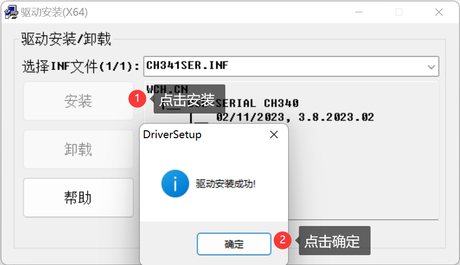
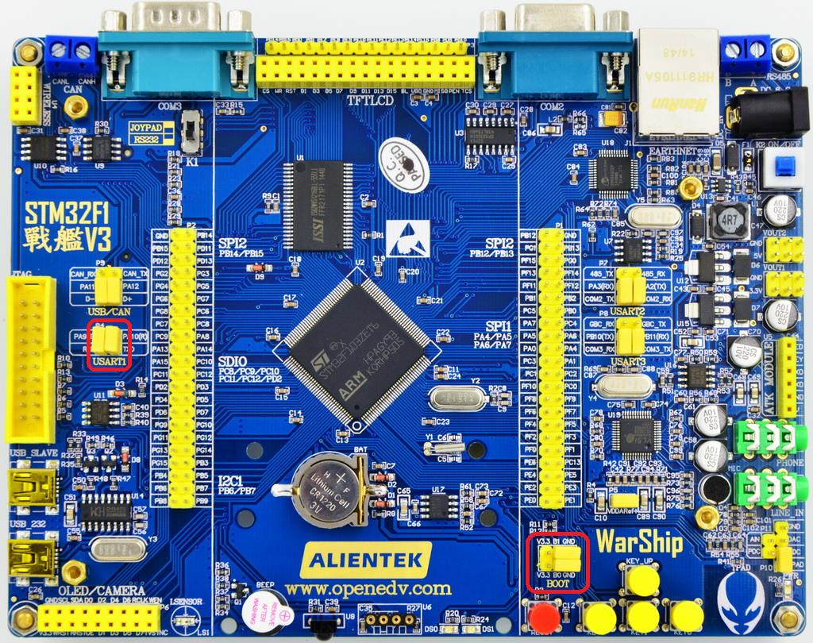
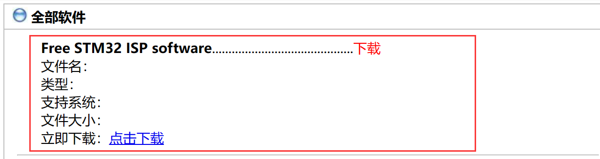
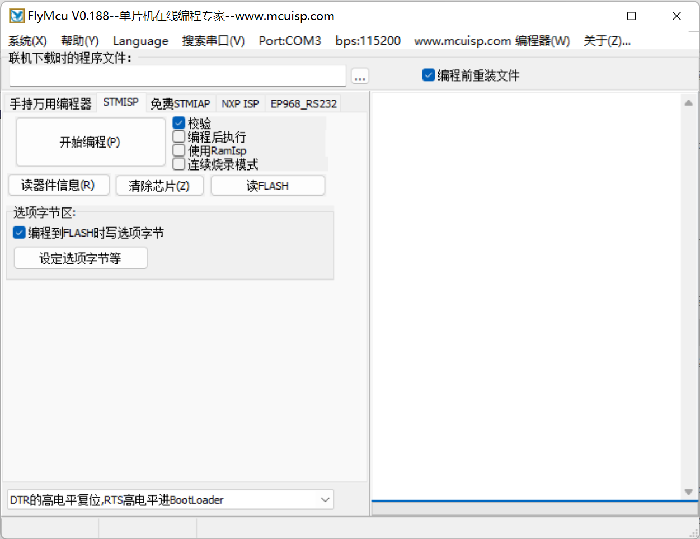
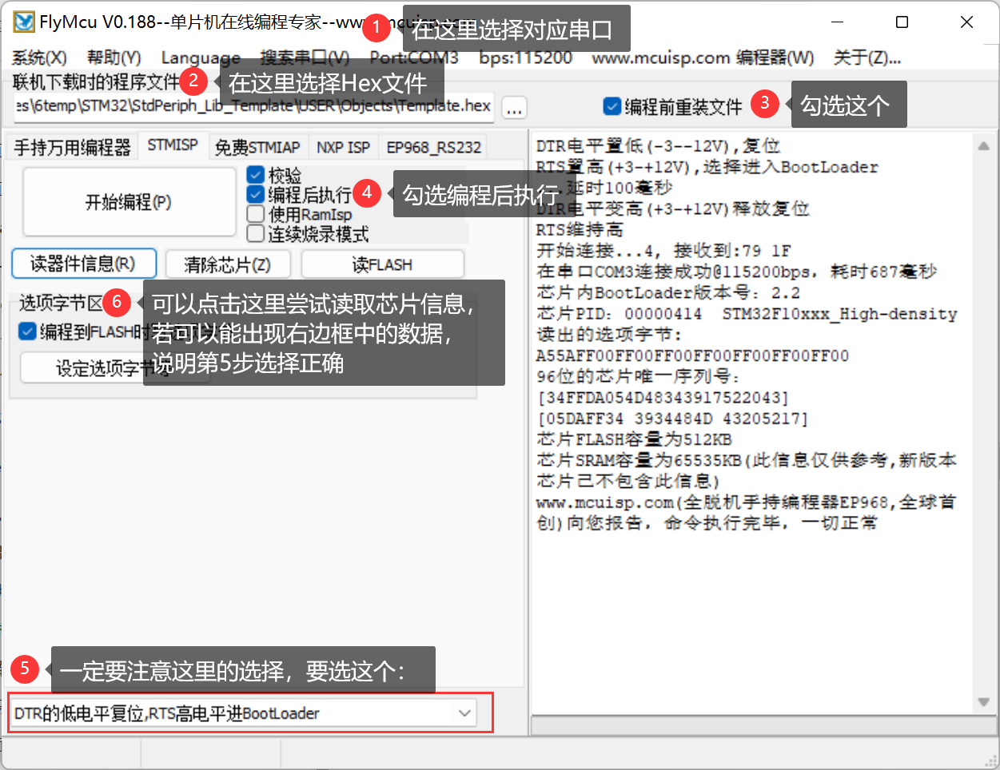
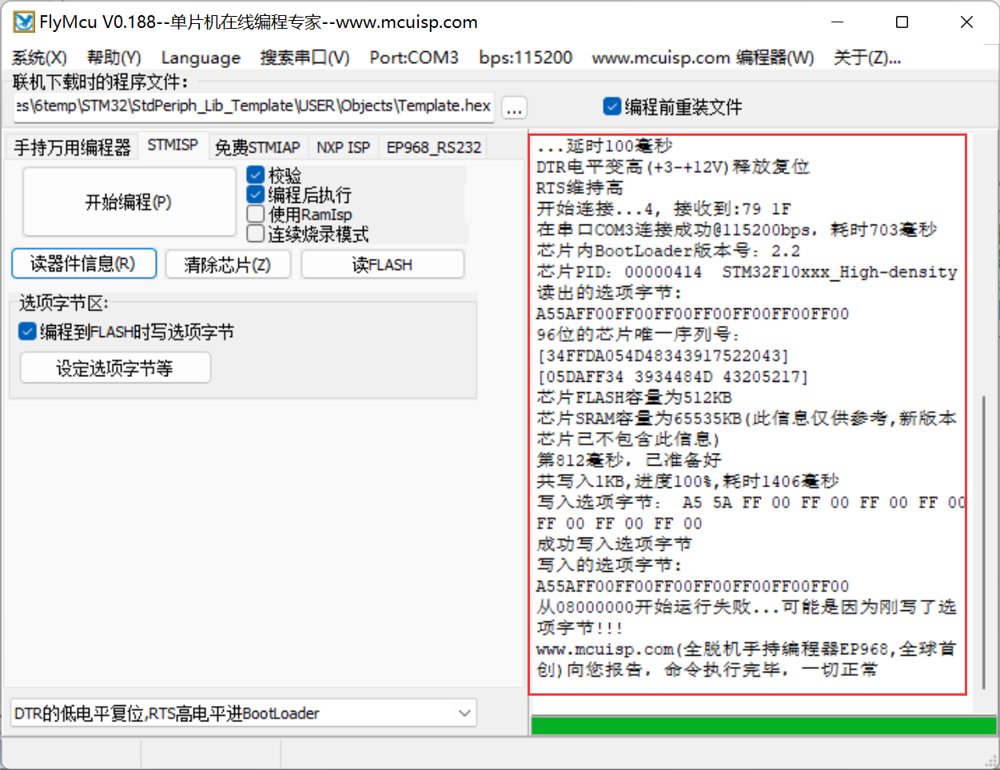

单片机开可以用串口下载程序，这部分来了解一下。

<!-- more -->

## 一、CH340驱动

### 1. CH340简介

一般来说我们通过电脑连接到开发板的串口是用的RS232：

而RS-232 电平需要 DB9 接口 （也就是常说的 COM口）。现在的电脑很多都没有 DB9 接口了，取而代之的是 USB 接口，所以就催生出了很多 USB 转串口 TTL 芯片，比如 CH340、PL2303 等。通过这些芯片就可以实现串口 TTL 转 USB。  

CH340 是一个USB 总线的转接芯片，实现USB 转串口、USB 转IrDA 红外或者USB 转打印口。 在串口方式下，CH340 提供常用的MODEM联络信号，用于计算机扩展异步串口，或者将普通的串口设备直接升级到USB 总线。在红外方式下，CH340 外加红外收发器即可构成USB 红外线适配器，实现SIR 红外线通讯。

主要有以下特点：

- 全速USB设备接口，兼容USB V2.0。
- 仿真标准串口，用于升级原串口外围设备，或者通过USB增加额外串口。
- 计算机端Windows操作系统下的串口应用程序完全兼容，无需修改。
- 硬件全双工串口，内置收发缓冲区，支持通讯波特率50bps～2Mbps。
- 支持常用的MODEM联络信号RTS、DTR、DCD、RI、DSR、CTS。
- 通过外加电平转换器件，提供RS232、RS485、RS422等接口。
- CH340R芯片支持IrDA规范SIR红外线通讯，支持波特率2400bps到115200bps。
- 内置固件，软件兼容CH341，可以直接使用CH341的VCP驱动程序。
- 支持5V电源电压和3.3V电源电压。
- CH340C/N/K/E及CH340B内置时钟，无需外部晶振，CH340B还内置EEPROM用于配置序列号等。
- 提供SOP-16、SOP-8和SSOP-20以及ESSOP-10、MSOP-10无铅封装，兼容RoHS。

### 2.  驱动下载与安装

我们经常使用的就是CH340芯片来完成串口的转换，要想让电脑识别串口，我们还需要安装CH340的驱动。驱动在哪下？在这里：[CH341SER.EXE - 南京沁恒微电子股份有限公司](https://www.wch.cn/downloads/CH341SER_EXE.html)

> 蓝奏云：https://wwyy.lanzouu.com/iZb7H36ezo8b（密码:cgte）

我们下载windows版本的就可以了，**在安装驱动前，我们连接好开发板的串口线**，可以先看下一小节怎么连接的。，然后打开电脑设备管理器就会发现一个无法被识别的串口

接下来我们安装驱动，双击刚才下载的驱动可执行程序会看到如下弹窗，然后我们点击安装即可：

在驱动安装成功之后，拔掉 USB 线，然后重新插入电脑，此时电脑就会自动给其安装驱动了。在安装完成之后，可以在电脑的设备管理器里面找到 USB 串口（如果找不到，则重启下电脑） ，会发现这里可以识别到串口了，这样便是安装成功了。

可以看到 USB 串口被识别为 COM3，这里需要注意的是：不同电脑可能不一样，不同的usb口可能也不一样，也可能是 COM4、 COM5 等，但是 USB-SERIAL CH340，这个一定是一样的。如果没找到 USB 串口，则有可能是安装有误，或者系统不兼容。  

## 二、串口下载

### 1. 下载前的准备

首先要在板子上设置一下，在板子上把 RXD 和 PA9（STM32 的 TXD）， TXD 和 PA10(STM32的 RXD)通过跳线帽连接起来，这样我们就把 CH340G 和 MCU 的串口 1 连接上了。这里由于ALIENTEK 这款开发板自带了一键下载电路，所以我们并不需要去关心 BOOT0 和 BOOT1 的状态，但是为了让下下载完后可以按复位执行程序，建议把 BOOT1 和 BOOT0 都设置为 0。设置完成 后如下图：

这里简单说明一下一键下载电路的原理，STM32 串口下载的标准方法是两个步骤：

（1）把 B0 接 V3.3（保持 B1 接 GND）。

（2） 按一下复位按键。  

通过这两个步骤，我们就可以通过串口下载代码了，下载完成之后，如果没有设置从0X08000000 开始运行，则代码不会立即运行，此时，还需要把 B0 接回 GND，然后再按一次复位，才会开始运行刚刚下载的代码。所以整个过程，得跳动 2 次跳线帽，还得按 2 次复位，比较繁琐。而板子上的一键下载电路，则利用串口的 DTR 和 RTS 信号，分别控制 STM32的复位和 B0，配合上位机软件（flymcu），设置： **DTR 的低电平复位， RTS 高电平进 BootLoader**，这样， B0 和 STM32 的复位，完全可以由下载软件自动控制，从而实现一键下载。 

接着我们在 **USB_232** 处插入 USB 线，并接上电脑，如果之前没有安装 CH340G 的驱动（如果已经安装过了驱动，则应该能在设备管理器里面看到 USB 串口，如果不能则要先卸载之前的驱动，卸载完后重启电脑，再重新安装我们提供的驱动），则需要先安装 CH340G 的驱动，可以看上一小节。

### 2. 烧写代码

在前边安装了 USB 串口驱动之后，我们就可以开始串口下载代码了，这里我们的串口下载软件选择的是 flymcu，该软件是 mcuisp 的升级版本 ，我们可以在这里下载：[单片机在线编程网 (mcuisp.com)](http://www.mcuisp.com/chinese%20mcuisp%20web/ruanjianxiazai-chinese.htm)

>蓝奏云：https://wwyy.lanzouu.com/b004iw1t5g（密码:ghzn）

下载完成后打开是这个样子的：

然后我们选择要下载的 Hex 文件，以前面我们新建的工程为例，因为我们前面在工程建立的时候，就已经设置了生成 Hex 文件，所以编译的时候已经生成了 Hex 文件，我们只需要找到这个 Hex 文件下载即可。用 flymcu 软件打开文件夹，找到对应的 hex 文件 Template.hex，打开并进行相应如下图设置：

（1）我们要下载代码还需要选择串口，这里 flymcu 有智能串口搜索功能。每次打开 flymcu 软件，软件会自动去搜索当前电脑上可用的串口，然后选中一个作为默认的串口（一般是最后一次关闭时所选择的串口）。也可以通过点击菜单栏的搜索串口，来实现自动搜索当前可用串口。 串口波特率则可以通过 bps那里设置，对于 STM32F103， 可以设置为最高： 460800，而如果是 F4，则建议最高设置为： 76800 即可，图中忘记改了，其实可以设置为76800。 然后， 找到 CH340 虚拟的串口，如上图所示。

（2）选择我们要下载的Hex文件。

（3）编程前重装文件，该选项也比较有用，当选中该选项之后， flymcu 会在每次编程之前，将hex 文件重新装载一遍，这对于代码调试的时候是比较有用的。特别提醒： 不要选择使用 RamIsp，否则，可能没法正常下载 。

（4）编程后执行，这个选项在无一键下载功能的条件下是很有用的，当选中该选项之后，可以在下载完程序之后自动运行代码。否则，还需要按复位键，才能开始运行刚刚下载的代码。  

（5）最后，我们选择的 DTR 的低电平复位， RTS 高电平进 BootLoader，这个选择项选中， flymcu就会通过 DTR 和 RTS 信号来控制板载的一键下载功能电路，以实现一键下载功能。如果不选择，则无法实现一键下载功能。这个是必要的选项（在 BOOT0 接 GND 的条件下）。 

（6）读一下器件信息，我们可以知道刚才第5步有没有选对，要是没选对吗，这里什么都读不到。

（7）最后可以通过按开始编程（P） 这个按钮，一键下载代码到 STM32 上，下载成 功如下图所示，并且下载成功后，会有“共写入 xxxxKB，耗时 xxxx 毫秒”的提示，并且从 0X80000000处开始运行了的相关信息。

# 
