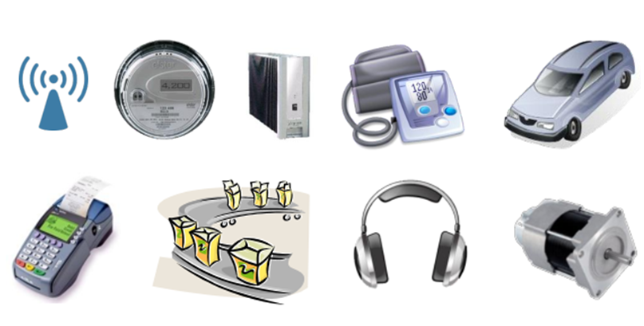
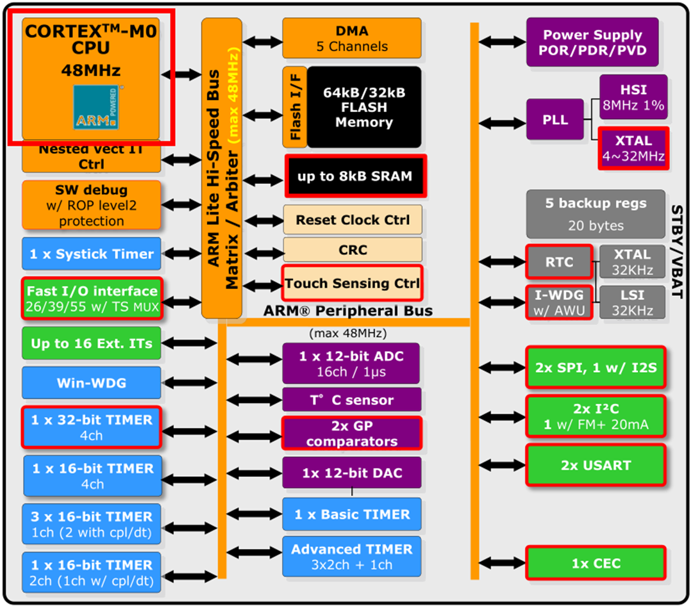
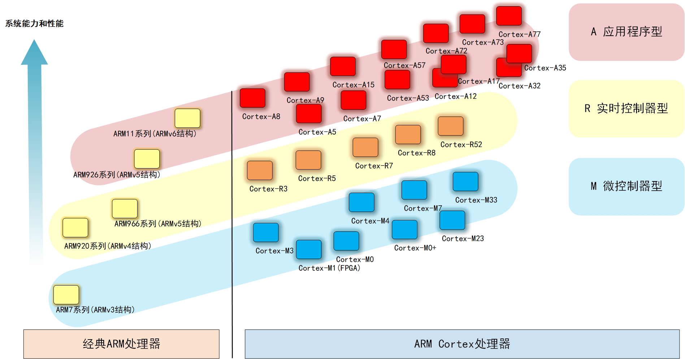
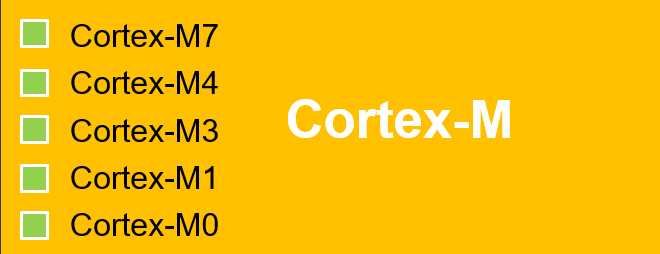
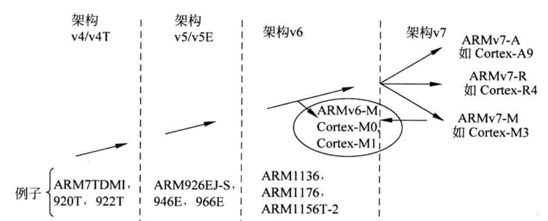
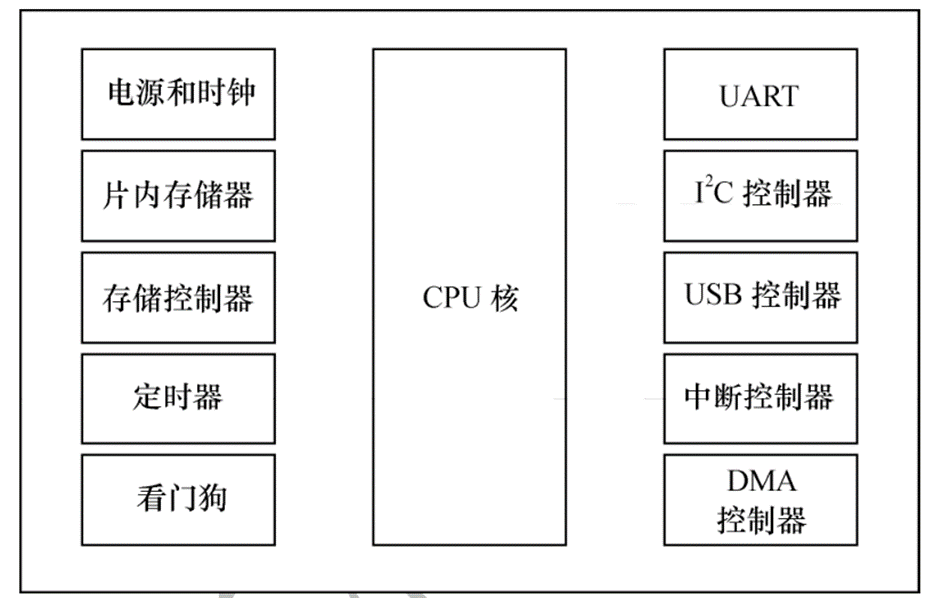
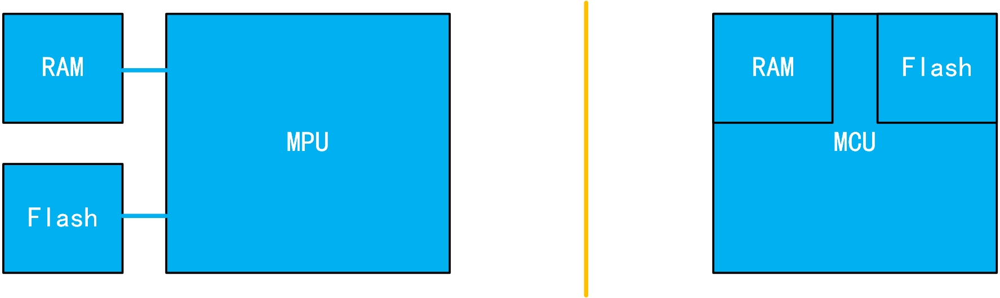
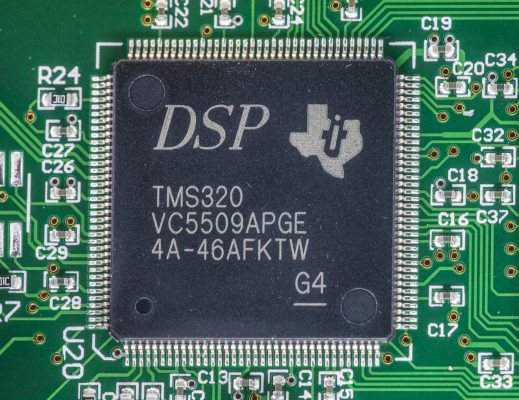
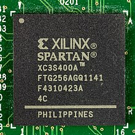
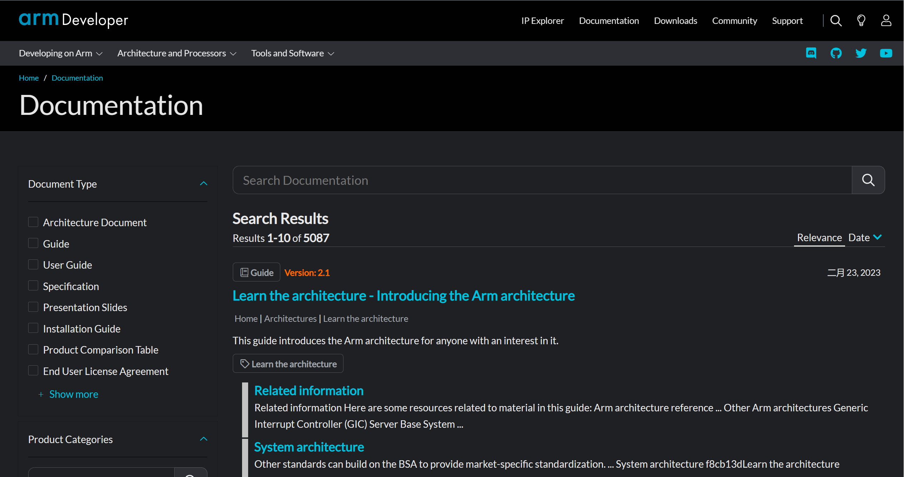

<!-- more -->

## 一、 ARM简介

### 1. 为什么要学习ARM?

在我们的生活中，STM32的应用得很广泛，像下边这些产品，可能都会用到STM32：

而STM32是一个微处理器，也就是MCU，它的结构一般如下：

STM32的核心部件CPU是 Cortex-M 系列处理器，这个处理器就是ARM公司进行设计的。

### 2. ARM公司简介

ARM（Advanced RISC Machines）有三种含义：它是一个公司的名称、它是一类微处理器的通称、它是一种技术的名称。

ARM 公司是微处理器行业的一家知名企业：

- 知识产权供应商

- 设计基于ARM体系的处理器
- 公司并不生产芯片，也不出售芯片

- 转让设计方案给半导体厂商，由半导体厂商生产soc，并销售

- 提供一些其他设计服务，比如物理IP，图形内核和开发工具的设计

### 3. ARM处理器家族

- 早先经典处理器

包括ARM7、ARM9、ARM11家族。例如：

- Cortex-M 系列

为单片机驱动的系统提供的低成本优化方案，应用于传统的微控制器市场，智能传感器，汽车周边部件等。例如：

| 处理器    | 描述                                                         |
| --------- | ------------------------------------------------------------ |
| Cortex-M0 | 面向低成本、超低功耗的微控制器和深度嵌入应用                 |
| Cortex-M1 | 针对FPGA优化设计的处理器                                     |
| Cortex-M3 | 面向低功耗、低成本设计的处理器， 具有较高计算性能和快速响应能力 |
| Cortex-M4 | 在M3基础上， 增加数据信号处理(DSP)指令集， 具有较高的信号处理能力 |
| Cortex-M7 | 在M4基础上， 加强性能， 针对高端控制器和数据处理密集的应用开发 |

- Cortex-A 系列

针对开放式操作系统的高性能处理器；应用于智能手机，数字电视，智能本等高端运用。 例如：

- Cortex-R 系列

针对实时系统、满足实时性的控制需求；应于汽车制动系统，动力系统等。例如：

### 4. ARM处理器架构

体系结构定义指令集和基于这一体系结构下处理器的编程模型（基本数据类型、工作模型、寄存器组）。基于同种体系结构可以有多种处理器、每个处理器的性能不同，面向的应用领域也不同。

ARM体系结构发展：

 　目前ARM体系架构共定义了8个版本V1-V8。V1-V3 最早的版本，目前已废弃； V4-V6 经典处理器中运用的比较多； V7 目前Cortex系列处理器主要是这种架构、支持Thumb-2的32位指令集；V8 兼容ARMv7架构的特性，并支持64位数据处理。

## 二、指令集

### 1. 指令集的概念

- 处理器能够识别并执行的指令集合；

- 每一条指令可处理一个简单或复杂操作（加、加乘…）；

- 每一条指令对应一条或几条汇编指令。

### 2. 指令集常见分类

- 复杂指令集（CISC）：包含处理复杂操作的特定指令，指令长度不固定，执行需要多个周期。

- 精简指令集（RISC）：指令简单而有效，格式和长度通常是固定的，大多数指令在一个周期内可以执行完毕，

> 【说明】ARM的内核是基于RISC体系结构的。

### 3. ARM的CPU和指令数据的关系

#### 3.1 哈佛结构和冯诺依曼结构

- 冯·诺依曼结构

冯·诺依曼结构（von Neumann architecture）又称作普林斯顿体系结构（Princetion architecture）。冯·诺依曼结构的处理器使用同一个存储器，经由同一个总线传输。冯·诺依曼结构处理器具有以下几个特点：

（1）必须有一个存储器；

（2）必须有一个控制器；

（3）必须有一个运算器，用于完成算术运算和逻辑运算；

（4）必须有输入和输出设备，用于进行人机通信。

- 哈佛结构

哈佛结构是一种将**程序指令存储**和**数据存储**分开的存储器结构。中央处理器首先到程序指令存储器中读取程序指令内容，解码后得到数据地址，再到相应的数据存储器中读取数据，并进行下一步的操作（通常是执行）。程序指令存储和数据存储分开，可以使**指令和数据有不同的数据宽度**，如Microchip公司的PIC16芯片的程序指令是14位宽度，而数据是8位宽度。

哈佛结构的微处理器通常具有较高的执行效率。其程序指令和数据指令分开组织和存储的，执行时可以预先读取下一条指令。哈佛结构是指程序和数据空间独立的体系结构， 目的是为了减轻程序运行时的访存瓶颈。哈佛结构能基本上解决取指和取数的冲突问题。

- 两种总线体系的区别

二者的区别就是程序空间和数据空间是否是一体的。冯·诺依曼结构数据空间和地址空间不分开，哈佛结构数据空间和地址空间是分开的。

#### 3.2 ARM是什么结构？

ARM是哈佛结构。

## 三、几个概念

### 1. SOC（System on Chip）

SOC(片上系统)：指的是在单个芯片上集成一个完整的计算机系统，所谓完整的系统一般包括中央处理器(CPU)、存储器、以及外围电路等。整体的一个电路系统，完成一个具体功能的东西。

### 2. CPU（Central Processing Unit）

CPU(Central Processing Unit)，是一台计算机的运算核心和控制核心。CPU由运算器、控制器和寄存器及实现它们之间联系的数据、控制及状态的总线构成。众所周知的三级流水线：取址、译码、执行的对象就是CPU，差不多所有的CPU的运作原理可分为四个阶段：提取(Fetch)、解码(Decode)、执行(Execute)和写回(Writeback)。 CPU从存储器或高速缓冲存储器中取出指令，放入指令寄存器，并对指令译码，并执行指令。所谓的计算机的可编程性主要是指对CPU的编程。

### 3. MPU (Micro Processor Unit)

微处理器(Micro-Processor Unit， MPU)。通常代表一个功能强大的CPU(暂且理解为增强版的CPU吧)，但不是为任何已有的特定计算目的而设计的芯片。类似通用计算机的CPU，主要负责处理计算，需要外加RAM、Flash、电源等电路。  这种芯片往往是个人计算机和高端工作站的核心CPU。例如Intel 的X86，ARM的一些Cortex-A芯片如飞思卡尔i.MX6、全志A20、TI AM335X等都属于MPU。

MCU和MPU的本质区别是因为应用场景的定位不同。 MPU注重通过相对强大的运算/处理能力，执行复杂多样的大型程序，因此常需要外挂运行内存(RAM)、存储器(Flash)等。 MCU注重功能较为单一、价格敏感的应用场景，不需要相对强大的运算/处理能力，更多的是对设备管理/控制，因此不需要大容量的RAM、 Flash来运行大型程序， 于是将RAM、 Flash全集成在一起，大家也就俗称“单片机” 。  

随着技术的发展，市场及需求的变化， MPU和MCU的界限日趋模糊。 高端的32位MCU主频越来越高， 已经反超低端MPU主频， MCU也有外挂RAM和Flash的场景，依靠硬件结构去区分逐渐困难。 可以简单的认为，嵌入式微处理器MPU， 通常运行Linux、 Android等非实时操作系统，应用在高端应用市场，比如智能手机、 路由器等消费电子市场领域，而嵌入式微控制器MCU， 常用运行裸机或实时性操作系统，应用在中、低端应用市场， 比如家电控制领域、工业控制领域等。  

### 4. MCU（Micro Control Unit）

微控制器 (Micro-Controller Unit ， MCU) ， 俗称单片机 。 之所以称之为单片机 (Single Chip Microcomputer)， 是因为不同于其它处理器，它将CPU、 RAM(随机存储器)、 ROM(只读存储器)、 I/O、中断系统、定时器等各种功能外设资源集中到一个芯片上。 这个芯片就是一个完整的微型计算机， 只需要供电或加上极少的外围电路即可工作（运行代码）。

单片机有处理器，有各种接口，所有的开发都是基于已经存在的系统架构，应用者要做的就是开发软件程序和加外部设备。而像ARM（Cortex-A系列）直接放代码是运行不了的，因为它本质上只是增强版的CPU，必须添加相应的RAM和ROM。

常见的MCU有80C51系列单片机、 Atmel公司的AVR系列单片机、 Microchip公司的PIC系列单片机、 TI公司的MSP430系列单片机、 ST公司的STM32系列单片机、 NXP公司的LPC1700系列单片机。早期的MCU主要是8位，后面发展出16位，再到现在主流的已经是32位。 此外， 主频不断提高、 ROM不断增大、外设不断增多，单片机的应用领域和场合越来越大。  

### 5. DSP

DSP通常有两个含义。

- 数字信号处理（ Digital Signal  Processing， DSP），是一门学科技术， 使用数值计算的方式对信号进行加工处理的理论和技术。
- 数字信号处理器（ Digital Signal Processor， DSP）， 是一种专门用于数字信号处理领域的微处理器芯片。如下图，就是TI公司的DSP芯片TMS320VC5509A。    

DSP芯片为了达到快速处理数字信号处理的目的， 采用了许多特殊软硬件结构。 首先是采用哈佛结构，将程序和数据分开，同时为处理器提供指令和数据。 然后采用多级流水线技术，在指令周期内可以执行更多指令。 加上专用的硬件乘法器、特殊的DSP指令， 使得DSP芯片在计算处理上，远超同主频的MCU或MPU。DSP芯片拥有强大的数据处理能力， 在数字信号处理领域，如调制/解调、数据加密/解密、图形处理、数字滤波、音频处理等计算密集型的场景广泛应用。  

### 6. FPGA

现场可编程门阵列（ Field－ Programmable Gate Array， FPGA）， 由可编程互连连接的可配置逻辑块(CLB) 矩阵构成的半导体器件。 

通俗地说， FPGA就是一个可以通过编程改变内部硬件结构，实现所需功能的芯片。 前面的MCU、 DSP等都是硬件资源固定，只能通过修改软件实现所需功能。而FPGA是通过硬件描述语言或其它方式修改硬件，将FPGA变为CPU或专用芯片，来实现控制或算法。 因此， MCU、 DSP能够实现的功能， FPGA理论上都可以实现，反之则不一定。 如图为Xilinx公司的FPGA芯片XC3S400A。  

FPGA主要有两大优势： 高速和灵活。 FPGA使用硬件处理数据，采用并发和流水技术，多个模块之间可以同时并行执行。 FPGA可以根据现场情况配置器件功能，能够在技术和需求变化时重新配置，实现系统优化升级。在某些通信领域，需要处理高速的通信协议，同时通信协议随时都可能修改，不适合做成专门的芯片，FPGA的高速、灵活就便成了首选。虽然FPGA功能强大，但实际工程项目中，还需考虑硬件成本、开发难度和市场需求等因素。 一些简单的控制场合， 尽管FPGA和MCU都能胜任，但MCU价格低廉和研发简单，更划算。  

## 三、资料查找

### 1. ARM相关的官网

我们可以直接搜索arm便可以找到ARM的官网，我们主要是要到文档的搜索界面去：[Documentation – Arm Developer](https://developer.arm.com/documentation)

我们可以直接在这里搜索我们需要的文档。
