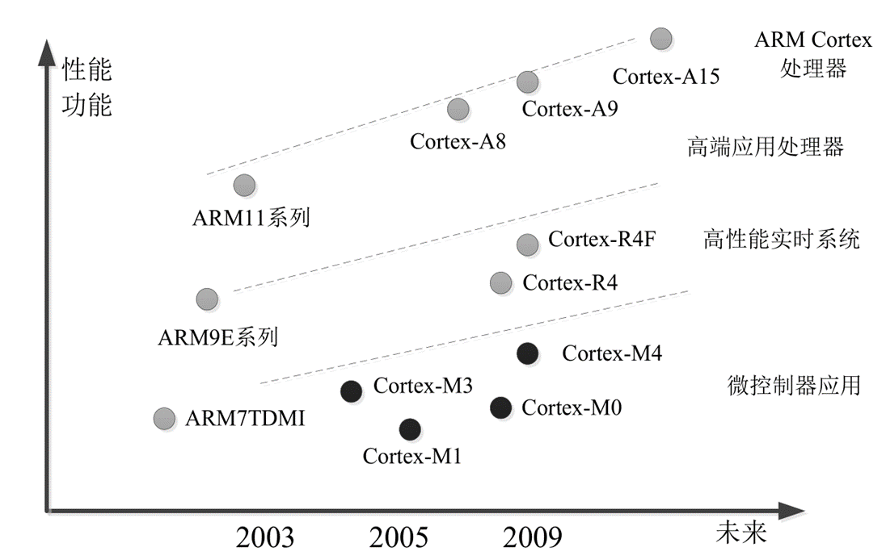
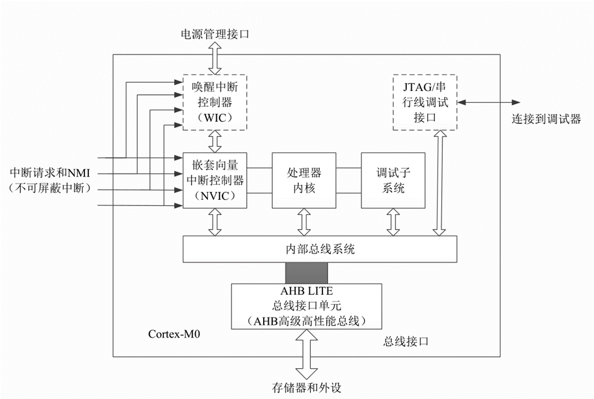
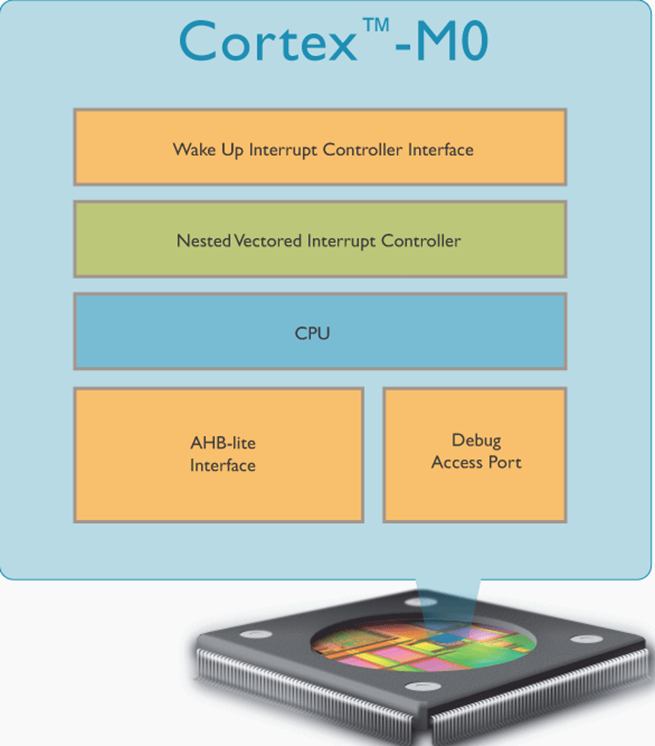
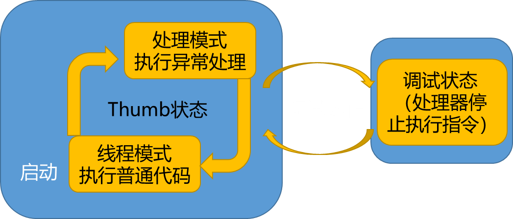
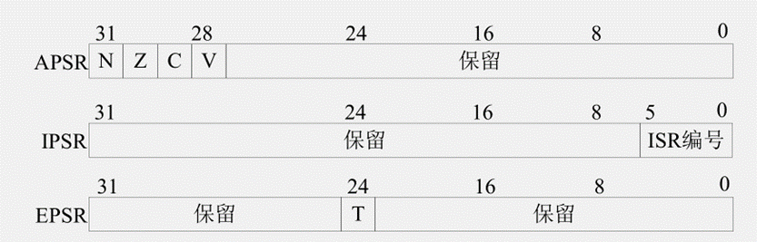
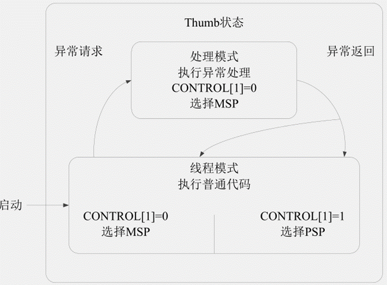
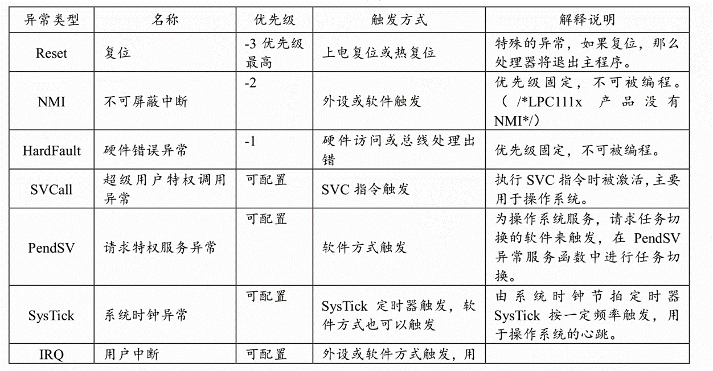
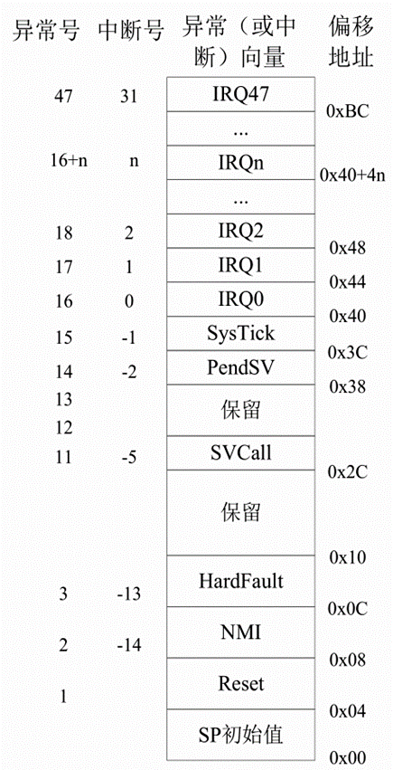

<!-- more -->

课程中使用的是STM32F0系列的芯片，用的是Cortex-M0的内核，所以这里的笔记是关于Cortex-M0的，对于我后来使用Cortex-M3内核大体上的的知识是基本通用的。

## 一、Cortex-M0处理器简介

### 1. Cortex-M 系列产品

Cortex-M 系列产品主要包括 Cortex-M0、Cortex-M1、Cortex-M3、Cortex-M4、Cortex-M7 等，其中 Cortex-M0 主打低功耗和混合信号的处理，M3 主要用来替代 ARM7,重点侧重能耗与性能的平衡，而 M7 则重点放在高性能控制运算领域。

### 2. Cortex-M0结构框图

Cortex-M0 微处理器主要包括处理器内核、嵌套向量中断控制器（NVIC）、调试子系统、内部总线系统构成。Cortex-M0 微处理器通过精简的高性能总线（AHB-LITE）与外部进行通信。

## 二、Cortex-M0特性

- Thumb 指令集，高效、高代码密度；

- 高性能，使用ARMv6-M的体系架构；

- 中断数量可配置（1~32 个），4 级中断优先级，低中断切换时延，提供不可屏蔽中断（NMI）输入保障高可靠性系统；

- 门电路少，低功耗，处理器可在休眠状态下掉电以降低功耗，还可被 WIC 唤醒；

- 与 Cortex-M1 处理器兼容，向上兼容 Cortex-M3 和 Cortex-M4 处理器，可以很容易地升级到 Cortex-M3。Cortex-M3 和 Cortex-M4 移植到 Cortex-M0 也非常简单。
- 支持多种嵌入式操作系统，也被多种开发组件支持，包括 MDK（ARM Keil 微控制器开发套件）、RVDS（ARM RealView 开发组件）、IAR C 编译器等。

## 三、Cortex-M0工作模式

- Cortex-M0有两种工作模式

（1）线程模式（Thread Mode）：芯片复位后，即进入线程模式，执行用户程序；

（2）处理模式（Handler Mode）：当处理器发生了异常或者中断，则进入处理模式进行处理、处理完成后返回线程模式。

- Cortex-M0有两种工作状态：

（1）Thumb状态：正常运行时处理器的状态。

（2）调试状态：调试程序时处理器的状态。

## 四、Cortex-M0寄存器组

Cortex-M0 处理器内核有 13 个通用寄存器以及多个特殊寄存器，如图所示。具体介绍如下：

- 通用寄存器

（1）R0-R12：通用寄存器。其中 R0-R7 为低端寄存器，可作为 16 位或 32 位指令操作数，R8-R12 为高端寄存器，只能用作 32 位操作数

（2）R13：堆栈指针 SP，Cortex-M0 在不同物理位置上存在两个栈指针，主栈指针 MSP，进程栈指针 PSP。在处理模式下，只能使用主堆栈，在线程模式下，可以使用主堆栈也可以使用进程堆栈，这主要是由 CONTROL 寄存器控制完成。系统上电的默认栈指针是MSP。

（3）R14：连接寄存器(LR)，用于存储子程序或者函数调用的返回地址

（4）R15：程序计数器（PC），存储下一条将要执行的指令的地址。

- 特殊寄存器

（1）xPSR：组合程序状态寄存器，该寄存器由三个程序状态寄存器组成：应用PSR（APSR）， 包含前一条指令执行后的条件标志；中断PSR（IPSR）， 包含当前ISR的异常编号；执行PSR（EPSR）， 包含Thumb状态位。

（2）PRIMSK：中断屏蔽特殊寄存器。

（3）CONTROL：控制寄存器，控制处理器处于线程模式是，使用哪个堆栈。CONTROL[1]=0使用MSP，CONTROL[1]=1使用PSP。 处理器模式时，固定使用MSP

## 五、Cortex-M0异常和中断

Cortex-M0 处理器最多支持 32 个外部中断（通常称为 IRQ）和一个不可屏蔽中断（NMI），另外 Cortex-M0 还支持许多系统异常（Reset、HardFault、SVCall、PendSV、SysTick），它们主要用于操作系统和错误处理，参见下表：

## 六、Cortex-M0指令集

ARM 处理器支持两种指令集：ARM 和 Thumb。EPSR 寄存器的 T 标志位负责指令集的切换，Cortex-M0只支持Thumb指令。

- ARM指令集特点

（1）32位精简指令集；

（2）指令长度固定；

（3）降低编码数量产生的耗费，减轻解码和流水线的负担；

- Thumb指令集特点

（1）Thumb指令集是ARM指令集的一个子集；

（2）指令宽度16位；

（3）与32位指令集相比，大大节省了系统的存储空间；

（4）Thumb指令集不完整，所以必须配合ARM指令集一同使用。

注意：Thumb 与 ARM 相比，代码体积小了 30%，但性能也低了 20%。2003 年，ARM 公司引入了 Thumb-2 技术，具备了一些 32 位的 Thumb 指令，使得原来很多只有 ARM 指令能够完成的功能，用 Thumb 指令也可以完成了。Cortex-M0 基于的 ARMv6-M 体系结构，该体系结构的处理器只是用了16位Thumb指令和部分32位Thumb指令
