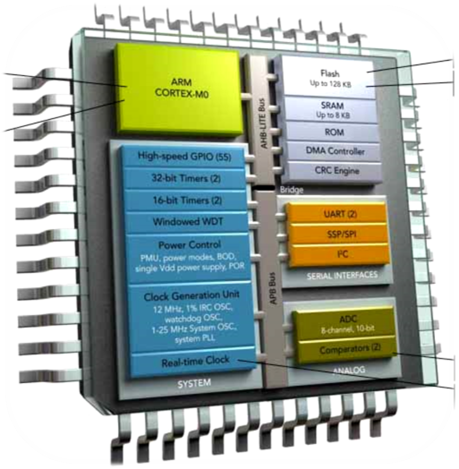
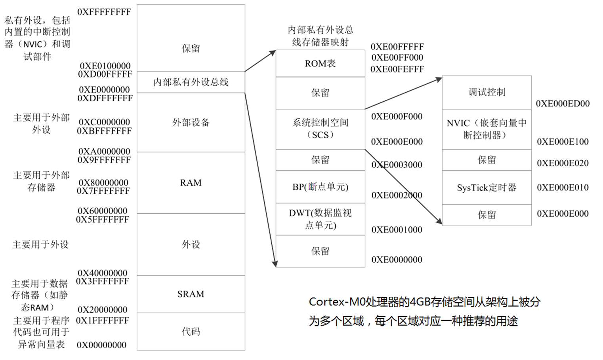
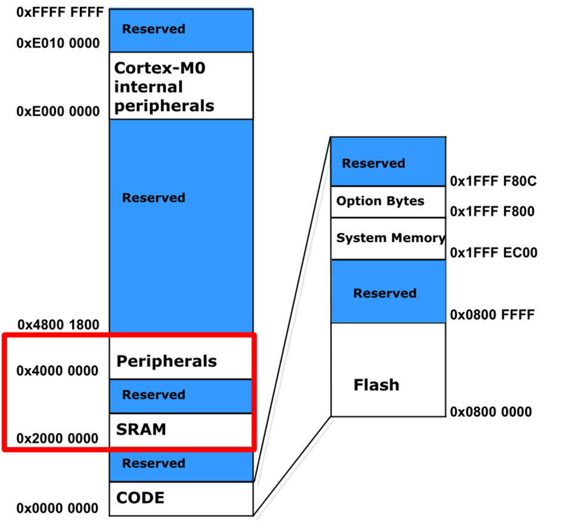
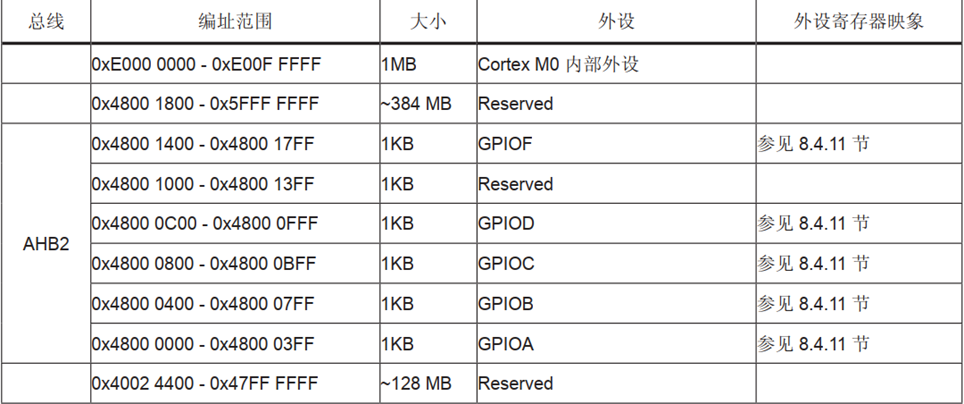

<!-- more -->

## 一、存储器映射

后面学习STM32的存储器映射的时候，有用到过M0架构的STM32F05x系列芯片，部分笔记记录在这里：



被控单元的FLASH，RAM和AHB到APB的桥（即片上外设），这些功能部件共同排列在一个 4GB 的地址空间内。我们在编程的时候，可以通过他们的地址找到他们，然后来操作他们。存储器本身没有地址，给存储器分配地址的过程叫存储器映射。



## 二、STM32F05x实际映射

### 1. 存储器映射



STM32F05x 存储器映像和外设寄存器编址部分截图如下，详情可以看STM32F0参考手册的 存储器组织 一节。



### 2. 如何访问寄存器

以GPIOA寄存器组为例、如何读写ODR寄存器？

```c
以知GPIOA的起始地址为0x48000000,各寄存器的偏移地址如下：
MODER;      /* Address offset: 0x00 */
OTYPER; 	/* Address offset: 0x04 */
OSPEEDR; 	/* Address offset: 0x08 */
PUPDR;	 	/* Address offset: 0x0C */
IDR; 		/* Address offset: 0x10 */
ODR; 		/* Address offset: 0x14 */
BSRR; 		/* Address offset: 0x18 */
LCKR; 		/* Address offset: 0x1C */
```

- 第一种方式

```c
#define GPIOA_BASE ( (unsigned int ) 0x48000000 )
#define GPIOA_ODR ( GPIOA_BASE  +  0x14 )

// 读操作
val  = *(unsigned int *) GPIOA_ODR;

// 写操作
*(unsigned int *)  GPIOA_ODR = val;

//==================================
//改进后的样子
#define     GPIOA_ODR    （ *(unsigned int *) ( GPIOA_BASE  +  0x14 )）

val  = GPIOA_ODR  ;    //读
GPIOA_ODR = val  ;     //写

```

- 第二种方式

用上面的方法去定义地址，还是稍显繁琐、根据我们每一类外设对应的寄存器组地址都是连续增长的特点，我们引入 C 语言中的结构体语法对寄存器进行封装、

```c
typedef struct 
{
    uint32_t		MODER;      /* Address offset: 0x00 */
    uint32_t		OTYPER; 	/* Address offset: 0x04 */
    uint32_t		OSPEEDR; 	/* Address offset: 0x08 */
    uint32_t		PUPDR;	 	/* Address offset: 0x0C */
    uint32_t		IDR; 		/* Address offset: 0x10 */
    uint32_t		ODR; 		/* Address offset: 0x14 */
    uint32_t		BSRR; 		/* Address offset: 0x18 */
    uint32_t		LCKR; 		/* Address offset: 0x1C */
} GPIO_TypeDef;

#define GPIOA_BASE ( (unsigned int ) 0x48000000 )
#define GPIOA      ((GPIO_TypeDef *) GPIOA_BASE)

```

我们访问 GPIOA 的控制寄存器组时、直接使用宏定义好 GPIO_TypeDef 类型的指针，而且指针指向 GPIOA 端口的首地址，这样我们直接用宏 GPIOA 访问改外设的任意一个寄存器：

```c
GPIOA->MODER   = 0x20;
GPIOA->OSPEEDR = 0x16;
```
