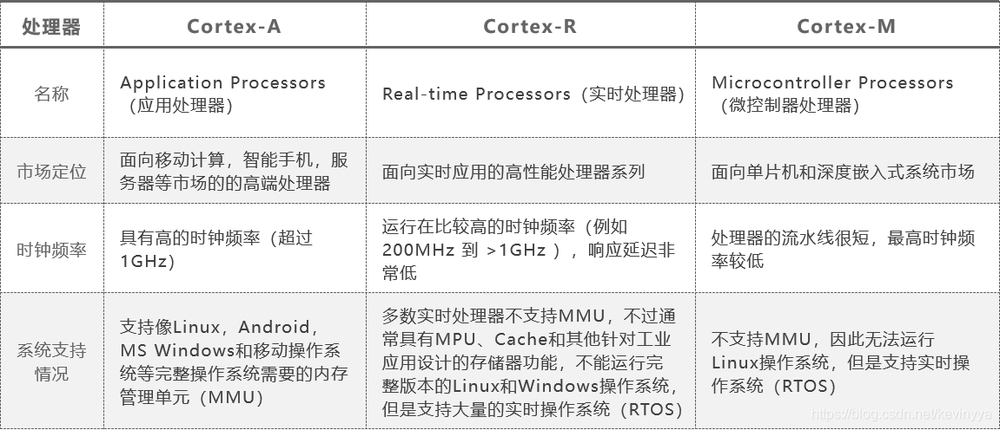

<!-- more -->

## 一、概述

ARM（Advanced RISC Machine）是一个32位精简指令集（RISC）处理器架构，应用于许多嵌入式系统设计中。其中，自从ARMv7系列架构开始，ARM公司推出了Cortex系列，并根据不同的应用场景推出了Cortex-M，Cortex-A和Cortex-R三款不同方向的产品。

ARM代表了一种**芯片标准**，体现了芯片的架构设计，而具体涉及到存储器容量，片上外设，IO引脚数等实现，则是由不同的芯片厂商进行设计的。

## 二、内核与芯片

ARM公司提供内核（如Cortex M3，简称CM3，下同）授权，完整的MCU还需要很多其他组件。芯片公司（ST、 NXP、 TI、 GD、华大等）在得到CM3内核授权后，就可以把CM3内核用在自己的硅片设计中，添加：存储器，外设， I/O以及其它功能块。

不同厂家设计出的单片机会有不同的配置，包括存储器容量、类型、外设等都各具特色，因此才会有市面上各种不同应用的ARM芯片。 

Cortex-M3是一个32位处理器内核，属于ARMv7架构，哈佛体系结构，其内部数据存取路径、寄存器、存储器接口均是32位，如STM32F1系列。Cortex M3内核和芯片的关系如图5.3.1.1所示：  

这里有一篇M3的参考文档：[Cortex-M3 权威指南](https://picture.iczhiku.com/resource/upload/6820519db1f84e7faaf51c573c48e013.pdf)

## 三、Cortex-M3简介

### 1. 简介

Cortex-M3 是一个32位处理器内核。内部的数据路径是32位的，寄存器是32位的，存储器 接口也是 32 位的。CM3 采用了**哈佛结构**，拥有独立的指令总线和数据总线，可以让取指与数据访 问并行不悖。这样一来数据访问不再占用指令总线，从而提升了性能。为实现这个特性， CM3内部 含有好几条总线接口，每条都为自己的应用场合优化过，并且它们可以并行工作。但是另一方面， 指令总线和数据总线共享同一个存储器空间（一个统一的存储器系统）。换句话说，不是因为有两 条总线，可寻址空间就变成8GB了。 

### 2. 寄存器组

Cortex-M3 处理器拥有R0-R15的寄存器组。其中R13作为堆栈指针SP。SP有两个，但在同 一时刻只能有一个可以看到，这也就是所谓的“banked”寄存器。

#### 2.1 R0-R12：通用寄存器 

R0-R12 都是32位通用寄存器，用于数据操作。但是注意：绝大多数16位Thumb指令只能访 问R0-R7，而32位Thumb-2指令可以访问所有寄存器。 

#### 2.2 Banked R13: 两个堆栈指针 

Cortex-M3 拥有两个堆栈指针，然而它们是banked，因此任一时刻只能使用其中的一个。  

- 主堆栈指针（MSP）：复位后缺省使用的堆栈指针，用于操作系统内核以及异常处理例程（包 括中断服务例程） 。系统的“后勤总管”，它管理着**主堆栈**的顶部位置。堆栈用于存放临时数据、函数调用时的返回地址和局部变量等。它指向**数据区（RAM）**。

- 进程堆栈指针（PSP）：由用户的应用程序代码使用。

堆栈指针的最低两位永远是0，这意味着堆栈总是4字节对齐的。在ARM编程领域中，凡是打断程序顺序执行的事件，都被称为异常(exception)。除了外部中断外，当有指令 执行了“非法操作”，或者访问被禁的内存区间，因各种错误产生的fault，以及不可屏蔽中断发生时，都会打断程 序的执行，这些情况统称为异常。在不严格的上下文中，异常与中断也可以混用。另外，程序代码也可以主动请求 进入异常状态的（常用于系统调用）。 

>有时候会说SP指针，SP 是MSP/PSP的统称，具体在执行时，CPU使用的要么是MSP，要么是PSP。

#### 2.3 R14：连接寄存器(LR)

当呼叫一个子程序时，由R14存储返回地址 

> 不像大多数其它处理器，ARM为了减少访问内存的次数（访问内存的操作往往要3个以上指令周期，带MMU和 cache 的就更加不确定了），把返回地址直接存储在寄存器中。这样足以使很多只有1级子程序调用的代码无需访问 内存（堆栈内存），从而提高了子程序调用的效率。如果多于1级，则需要把前一级的R14值压到堆栈里。在ARM 上编程时，应尽量只使用寄存器保存中间结果，迫不得以时才访问内存。在 RISC 处理器中，为了强调访内操作越过了处理器的界线，并且带来了对性能的不利影响，给它取了一个专业的术语：溅出。 

#### 2.4  R15：程序计数寄存器(PC)

指向当前的程序地址。如果修改它的值，就能改变程序的执行流（很多高级技巧就在这里面— —译注）。 程序的“导游”，它告诉CPU**下一步要去哪里（哪个内存地址）取指令执行**。它指向**代码区**。

程序计数器（PC 指针）每次移动的字节数取决于当前执行的指令长度。Cortex-M3 采用 Thumb-2 指令集架构，该架构支持两种长度的指令：

- 16 位 Thumb 指令：执行这类指令时，PC 指针每次移动2 字节。
- 32 位 Thumb-2 指令：执行这类指令时，PC 指针每次移动4 字节。

因此，PC 指针的步长并非固定值，而是由当前正在执行的指令长度决定，在 2 字节和 4 字节之间动态变化。这是 Thumb-2 混合指令集的典型特征，兼顾了代码密度（16 位指令）和性能（32 位指令）。

#### 2.5  特殊功能寄存器

Cortex-M3 还在内核水平上搭载了若干特殊功能寄存器，包括程序状态字寄存器组（PSRs）  中断屏蔽寄存器组（PRIMASK, FAULTMASK, BASEPRI）  控制寄存器（CONTROL） 

| 寄存器    | 功能                                                         |
| --------- | ------------------------------------------------------------ |
| xPSR      | 记录 ALU 标志（θ 标志，进位标志，负数标志，溢出标志），执行状态，以及当前正服务的中断号 |
| PRIMASK   | 除能所有的中断 —— 当然了，不可屏蔽中断（NMI）才不甩它呢。    |
| FAULTMASK | 除能所有的 fault——NMI 依然不受影响，而且被除能的 faults 会 “上访”，见后续章节的叙述。 |
| BASEPRI   | 除能所有优先级不高于某个具体数值的中断。                     |
| CONTROL   | 定义特权状态，并且决定使用哪一个堆栈指针                     |
