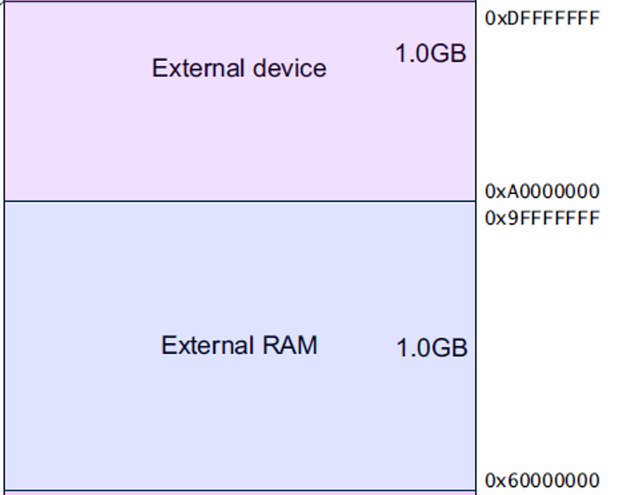

<!-- more -->

本篇笔记主要来自于《[Cortex-M3 权威指南](https://picture.iczhiku.com/resource/upload/6820519db1f84e7faaf51c573c48e013.pdf)》的第五章存储器系统。其实有一部分概念在后边一篇笔记中才有所体现，比如什么是寄存器？。

## 一、存储器映射

CM3 只有一个单一固定的存储器映射。这一点极大地方便了软件在各种 CM3 单片机间的移植。举个简单的例子，各款 CM3 单片机的 NVIC 和 MPU 都在相同的位置布设寄存器，使得它们变得通用。尽管如此， CM3 定出的条条框框是粗线条的，它依然允许芯片制造商灵活地分配存储器空间，以制造出各具特色的单片机产品。存储空间的一些位置用于调试组件等私有外设，这个地址段被称为“ 私有外设区”。私有外设区的组件包括：  

（1）闪存地址重载及断点单元(FPB)

（2）数据观察点单元(DWT)

（3）指令跟踪宏单元(ITM)

（4）嵌入式跟踪宏单元(ETM)

（5）跟踪端口接口单元(TPIU)

（6）ROM 表

### 1. 预定义的存储器映射

Cortex-M3是32位的单片机，因此其PC指针可以指向2^32=4G的地址空间，也就是图中的 0x00000000到0xFFFFFFFF的区间，也就是将程序存储器、数据存储器、寄存器和输入输出端口被组织在同一个4GB的线性地址空间内，数据字节以小端格式存放在存储器中。Cortex-M3 预定义的存储器映射如下：


这个存储器映射只是个粗线条的模板，半导体厂家会提供更展开的图示，来表明芯片中片上外设的具体分布， RAM 与 ROM 的容量和位置信息。  

### 2. 代码区域512M

CM3 的地址空间是 4GB, 程序可以在代码区，内部 SRAM 区以及外部 RAM 区中执行。但是因为指令总线与数据总线是分开的， 最理想的是把程序放到代码区， 从而使取指和数据访问各自使用自己的总线，并行不悖。


### 3. 内部SRAM区域512M

内部 SRAM 区的大小是 512MB，用于让芯片制造商连接片上的 SRAM，这个区通过系统总线来访问。在这个区的下部，有一个 1MB 的位带区：


该位带区还有一个对应的 32MB 的“位带别名(alias)区”，容纳了 8M 个“位变量”（对比 8051 的只有 128 个位）。位带区对应的是最低的 1MB 地址范围，而位带别名区里面的每个字对应位带区的一个比特。位带操作只适用于数据访问，不适用于取指。通过位带的功能，可以把多个布尔型数据打包在单一的字中，却依然可以从位带别名区中，像访问普通内存一样地使用它们。位带别名区中的访问操作是原子的，消灭了传统的“读－改－写”三步曲。位带操作的细节后边再说。  

### 4. 片上外设区域 512M

地址空间的另一个 512MB 范围由片上外设（的寄存器）使用。这个区中也有一条 32MB的位带别名，以便于快捷地访问外设寄存器。例如，可以方便地访问各种控制位和状态位。要注意的是，外设内不允许执行指令。  


### 5. 两个1GB



这两个 1GB 的范围，分别用于连接外部 RAM 和外部设备，它们之中没有位带。两者的区别在于外部 RAM 区允许执行指令，而外部设备区则不允许。  

### 6. 最后的512M

最后还剩下 0.5GB 的隐秘地带， CM3 内核的闺房就在这里面，包括了系统级组件，内部私有外设总线 s，外部私有外设总线 s，以及由提供者定义的系统外设。  


私有外设总线有两条：  

- AHB 私有外设总线，只用于 CM3 内部的 AHB 外设，它们是： NVIC, FPB, DWT 和 ITM。

- APB 私有外设总线，既用于 CM3 内部的 APB 设备，也用于外部设备（这里的“外部”是对内核而言）。 CM3 允许器件制造商再添加一些片上 APB 外设到 APB 私有总线上，它们通过 ABP 接口来访问。  

NVIC 所处的区域叫做“系统控制空间（ SCS）”，在 SCS 里的还有 SysTick、 MPU 以及代码调试控制所用的寄存器：


最后，未用的提供商指定区也通过系统总线来访问，但是不允许在其中执行指令。CM3 中的 MPU 是选配的，由芯片制造商决定是否配上。

## 二、存储器访问属性

CM3 在定义了存储器映射之外，还为存储器的访问规定了 4 种属性，分别是：
（1）可否缓冲(Bufferable)

（2）可否缓存(Cacheable)

（3）可否执行(Executable)

（4）可否共享(Sharable)  

如果配了 MPU，则可以通过它配置不同的存储区，并且覆盖缺省的访问属性。 CM3 片内没有配备缓存，也没有缓存控制器，但是允许在外部添加缓存。通常，如果提供了外部内存，芯片制造商还要附加一个内存控制器，它可以根据可否缓存的设置，来管理对片内和片外 RAM 的访问操作。  

地址空间可以通过另一种方式分为 8 个 512MB 等份：  

（1）代码区（ 0x0000_0000‐ 0x1FFF_FFFF）。该区是可以执行指令的，缓存属性为 WT（“写通”，Write Through），即不可以缓存。此区亦可写数据。在此区上的数据操作是通过数据总线接口的（读数据使用 D‐Code，写数据使用 System），且在此区上的写操作是缓冲的。

（2）SRAM 区（ 0x2000_0000 – 0x3FFF_FFFF）。此区用于片内 SRAM，写操作是缓冲的，并且可以选择 WB‐WA(Write Back, Write Allocated)缓存属性。此区亦可以执行指令，以允许把代码拷贝到内存中执行——常用于固件升级等维护工作。

（3）片上外设区(0x4000_0000 – 0x5FFF_FFFF)。该区用于片上外设，因此是不可缓存的，也不可以在此区执行指令（这也称为 eXecute Never, XN。 ARM 的参考手册大量使用此术语）。

（4）外部 RAM 区的前半段（ 0x6000_0000 ‐ 0x7FFF_FFFF）。该区用于片外 RAM，可缓存（缓存属性为 WB‐WA），并且可以执行指令。

（5）外部RAM区的后半段(0x8000_0000 - 0x9FFF_FFFF)。除了不可缓存(WT)外，同前半段。

（6）外部外设区的前半段(0xA000_0000 - 0xBFFF_FFFF)。用于片外外设的寄存器，也用于多核系统中的共享内存（需要严格按顺序操作，即不可缓冲)。该区也是个不可执行区。

（7）外部外设区的后半段(0xC000_0000 - 0xDFFF_FFFF)。目前与前半段的功能完全一致。

（8）系统区(0xE000_0000 - 0xFFFF_FFFF)。此区是私有外设和供应商指定功能区。此区不可执行代码。系统区涉及到很多关键部位，因此访问都是严格序列化的(不可缓存，不可缓冲)。而供应商指定功能区则是可以缓存和缓冲的。

> 写通，写回，与写时申请：
>
> 写回(Write Back)：写入的数据先逗留在缓存中，待到必要时再落实到最终目的地，这也是cache 的最基本职能，用于改善数据传送的效率。
>
> 写通(Write Through)：写操作“穿透”中途的缓存，直接落入最终的目的地中。可见，写通操作架空了cache，但它使写操作的结果立即生效。这常用于和片上外设或其它处理器共享的内存中，如显卡的显存，片上外设寄存器，以及双核系统中的共享内存。写通操作和C中的“volatile"”有密切的联系。
>
> 写时申请(Write Allocate)：译者也不太清楚啦~

## 三、存储器的缺省访问许可

CM3有一个缺省的存储访问许可，它能防止使用户代码访问系统控制存储空间，保护NVIC、MPU等关键部件。缺省访问许可在下列条件时生效：

（1）没有配备MPU

（2）配备了MPU，但是MPU被除能

如果启用了MPU，则 MPU可以在地址空间中划出若干个regions，并为不同的 region规定不同的访问许可权限。缺省的存储器访问许可权限如下表：


当一个用户级访问被阻止时，会立即产生一个总线fault。

## 四、位带操作

### 1. 位带区与位带别名区关系

支持了位带操作后，可以使用普通的加载/存储指令来对单一的比特进行读写。在CM3中，有两个区中实现了位带，其中一个是 SRAM 区的最低 1MB 范围  第二个则是片内外设区的最低 1MB 范围。这两个区中的地址除了可以像普通的 RAM 一样使用外，它们还都有自己的“位带别名区”，位带别名区把每个比特膨胀成一个 32 位的字。当通过位带别名区访问这些字时，就可以达到访问原始比特的目的 。

- 位带区与位带别名区的膨胀关系图  


- 下图从另一个侧面演示比特的膨胀对应关系  


### 2. 位带操作举例

#### 2.1 位带写操作

举例：我们要是想要设置地址 0x2000_0000 中的比特 2，则使用位带操作的设置过程如下图所示：  


对应的汇编如下：


#### 2.2 位带读操作

位带读操作相对简单些  


对应的汇编为：


### 3. 基本原理

位带操作的概念其实多年前就有了，  那还是8051单片机开创的先河。CM3 使用如下术语来表示位带存储的相关地址 ：

- 位带区： 支持位带操作的地址区  
- 位带别名： 对别名地址的访问最终作用到位带区的访问上（注意：这中间有一个地址映射过程）  

在位带区中，每个比特都映射到别名地址区的一个字——这是只有LSB有效的字。当一个别名地址被访问时，会先把该地址变换成位带地址。对于读操作，读取位带地址中的一个字，再把需要的位右移到LSB，并把 LSB返回。对于写操作，把需要写的位左移至对应的位序号处，然后执行一个原子的“读一改一写”过程。支持位带操作的两个内存区的范围是：

- 0x2000_0000‐0x200F_FFFF（ SRAM 区中的最低 1MB）


对 SRAM 位带区的某个比特，记它所在字节地址为 A，位序号为n（0≤ n ≤ 7）则该比特位在别名区的地址为：  

```c
// “*4”表示一个字为 4 个字节，“*8”表示一个字节中有 8 个比特。
AliasAddr = 0x22000000 + ((A - 0x2000000) * 8 + n) * 4 = 0x22000000 + (A - 0x20000000) * 32 + n * 4
```

- 0x4000_0000‐0x400F_FFFF（片上外设区中的最低 1MB）  


对 片上外设区的某个比特，记它所在字节地址为 A，位序号为n（0≤ n ≤ 7）则该比特位在别名区的地址为：  

```c
// “*4”表示一个字为 4 个字节，“*8”表示一个字节中有 8 个比特。
AliasAddr = 0x42000000 + ((A - 0x4000000) * 8 + n) * 4 = 0x42000000 + (A - 0x40000000) * 32 + n * 4
```

### 4. 位带别名重映射

#### 4.1 SRAM区

| 位带区        | 等效别名地址 |
| ------------- | ------------ |
| 0x2000000.0   | 0x2200000.0  |
| 0x2000000.1   | 0x2200004.0  |
| 0x2000000.2   | 0x2200008.0  |
| ......        | ......       |
| 0x2000000.31  | 0x220007C.0  |
| 0x2000004.0   | 0x2200080.0  |
| 0x2000004.1   | 0x2200084.0  |
| 0x2000004.2   | 0x2200088.0  |
| ......        | ......       |
| 0x200FFFFC.31 | 0x23FFFFFC.0 |

#### 4.2 片上外设区

| 位带区        | 等效别名地址 |
| ------------- | ------------ |
| 0x4000000.0   | 0x4200000.0  |
| 0x4000000.1   | 0x4200004.0  |
| 0x4000000.2   | 0x4200008.0  |
| ......        | ......       |
| 0x4000000.31  | 0x420007C.0  |
| 0x4000004.0   | 0x4200080.0  |
| 0x4000004.1   | 0x4200084.0  |
| 0x4000004.2   | 0x4200088.0  |
| ......        | ......       |
| 0x400FFFFC.31 | 0x43FFFFFC.0 |

#### 4.3 一个实例

（1）在地址0x20000000处写入0x3355AACC

（2）读取地址0x22000008。本次读访问将读取0x20000000，并提取比特2，值为1。

（3）往地址0x22000008处写0。本次操作将被映射成对地址0x20000000的“读一改一写”操作（原子的)，把比特⒉清 0。

（4）现在再读取0x20000000，将返回0x3355AAC8 ( bit[2]已清零)。

位带别名区的字只有LSB有意义。另外，在访问位带别名区时，不管使用哪一种长度的数据传送指令(字/半字/字节)，都把地址对齐到字的边界上，否则会产生不可预料的结果。

### 5. 位带操作的好处

位带操作有什么优越性呢?最容易想到的就是通过GPIO的管脚来单独控制每盏LED的点亮与熄灭。另一方面,也对操作串行接口器件提供了很大的方便(典型如74HC165，CD4094)。总之位带操作对于硬件I/O密集型的底层程序最有用处了。

CM3中还有一个称为“bit-bang”的概念，它通常是通过“bit-band”实现的，但是它俩在学术上是两个不同的概念。位带操作还能用来化简跳转的判断。当跳转依据是某个位时，以前必须这样做:（1）读取整个寄存器（2）掩蔽不需要的位（3）比较并跳转。现在只需:（1）从位带别名区读取状态位（2）比较并跳转。使代码更简洁 。

这只是位带操作优越性的初等体现，位带操作还有一个重要的好处是在多任务中，**用于实现共享资源在任务间的“互锁”访问**。多任务的共享资源必须满足一次只有一个任务访问它——亦即所谓的“原子操作”。以前的读一改一写需要3条指令，导致这中间留有两个能被中断的空当。于是可能会出现如下图所示的紊乱危象:


同样的紊乱危象可以出现在多任务的执行环境中。其实，上图所演示的情况可以看作是多任务的一个特例：主程序是一个任务， ISR 是另一个任务，这两个任务并发执行。

通过使用 CM3 的位带操作，就可以消灭上例中的紊乱危象。 CM3 把这个“读－改－写”做成一个硬件级别支持的原子操作，不能被中断，如下图：


### 6. 在C语言中使用位带

不幸的是，在 C 编译器中并没有直接支持位带操作。比如， C 编译器并不知道同一块内存能够使用不同的地址来访问，也不知道对位带别名区的访问只对 LSB 有效。欲在 C 中使用位带操作，最简单的做法就是#define 一个位带别名区的地址。例如：  

```c
#define DEVICE_REG0      ((volatile unsigned long *) (0x40000000))
#define DEVICE_REG0_BIT0 ((volatile unsigned long *) (0x42000000))
#define DEVICE_REG0_BIT1 ((volatile unsigned long *) (0x42000004))

*DEVICE_REG0 = 0xAB; // 地址访问寄存器

*DEVICE_REG0 = *DEVICE_REG0 | 0x2; // 使用传统方法设置 bit1
*DEVICE_REG0_BIT1 = 0x1;           // 通过位带别名地址设置 bit1
```

为简化位带操作，也可以定义一些宏。比如，我们可以建立一个把”位带地址+位序号“转换成别名地址的宏，再建立一个把别名地址转换成指针类型的宏：

```c
//把“位带地址＋位序号”转换成别名地址的宏
#define BITBAND(addr, bitnum) ((addr & 0xF0000000) + 0x2000000 + ((addr & 0xFFFFF) << 5) + (bitnum << 2))

//把该地址转换成一个指针
#define MEM_ADDR(addr) *((volatile unsigned long *) (addr))
```

 在此基础上，我们就可以如下改写代码：

```c
MEM_ADDR(DEVICE_REG0) = 0xAB; //使用正常地址访问寄存器
MEM_ADDR(DEVICE_REGO) = MEM_ADDR(DEVICE_REGO) | 0x2;// 传统做法
MEM_ADDR(BITBAND(DEVICE_REGO, 1)) = 0x1;            // 使用位带别名地址
```

注意：当使用位带功能时，要访问的变量必须用 volatile 来定义。因为 C 编译器并不知道同一个比特可以有两个地址。所以就要通过volatile，使得编译器每次都如实地把新数值写入存储器，而不再会出于优化的考虑，在中途使用寄存器来操作数据的复本，直到最后才把复本写回（这和 cache的原理是一样的)。

> 参考资料：
>
> [STM32的内存管理相关（内存架构，内存管理，map文件分析）-云社区-华为云](https://bbs.huaweicloud.com/blogs/375342)
