<!-- more -->

## 一、常见缩略语含义

| 缩写 | 说明                               |
| ---- | ---------------------------------- |
| IRQ  | 中断请求（通常是指外部中断的请求） |
| ISR  | 中断服务例程                       |
| NMI  | 不可屏蔽中断                       |
| NVIC | 嵌套向量中断控制器                 |
| PSP  | 进程堆栈指针                       |

## 二、异常

### 1. 什么是异常？

正常情况下，微处理器根据代码内容，按顺序执行指令。执行过程中，如果遇到其它紧急的事件需要处理，则先暂停当前任务，执行紧急事件，待紧急事件处理完后，再恢复到刚才暂停的地方继续执行。这个产生的紧急事件就叫做**中断或异常**  。

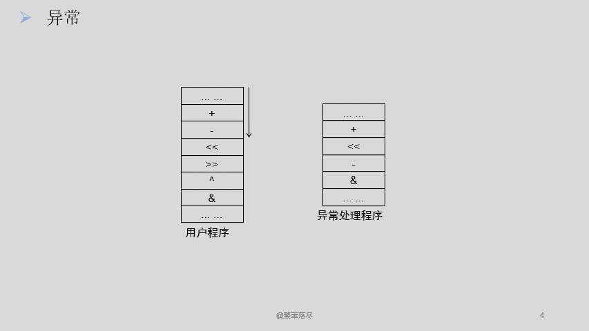

我们可以看一张更加详细的图片：

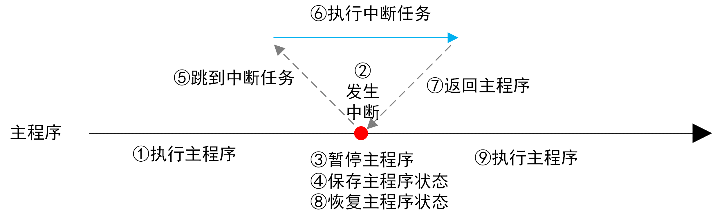

通常， 把CPU内部产生的紧急事件叫做异常，比如非法指令（除零） 、 地址访问越界等； 把来自CPU外部的片上外设产生的紧急事件叫做中断，比如GPIO引脚电平变化、 定时器溢出等。 异常和中断的效果基本一致，都是暂停当前任务， 优先执行紧急事件，因此一般将中断和异常统称为中断。

ARM公司设计了Cortex-M3内核，这个内核就包含了中断系统框架，对应资料“ [Cortex-M3 权威指南](https://picture.iczhiku.com/resource/upload/6820519db1f84e7faaf51c573c48e013.pdf)”，后简称《CM3权威指南》。ST公司根据该内核， 因地制宜的设计了STM32系列产品， 对应资料“ [STM32F10xx CortexM3编程手册.pdf](https://www.st.com/resource/en/programming_manual/pm0056-stm32f10xxx20xxx21xxxl1xxxx-cortexm3-programming-manual-stmicroelectronics.pdf)”，后简称《CM3编程手册》。  

### 2. 异常的类型

Cortex‐M3 在内核水平上搭载了一个异常响应系统， 支持为数众多的系统异常和外部中断。其中，编号为 1~15的对应系统异常，大于等于 16 的则全是外部中断。

除了个别异常的优先级被定死外， 其它异常的优先级都是可编程的（所有能打断正常执行流的事件都称为异常）。

因为芯片设计者可以修改 CM3 的硬件描述源代码，所以做成芯片后，支持的中断源数目常常不到 240 个，并且优先级的位数也由芯片厂商最终决定。

- 类型编号为 1－15 的系统异常如下表所示（注意： 没有编号为 0 的异常）

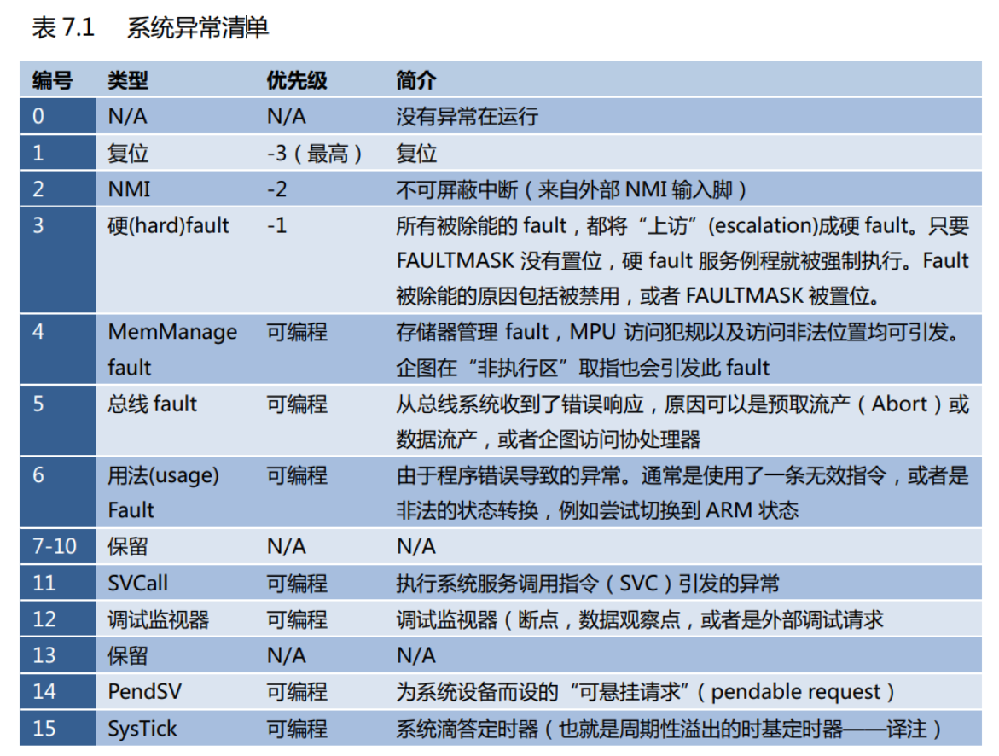

- 从 16 开始的外部中断类型如表 7.2 所示。  

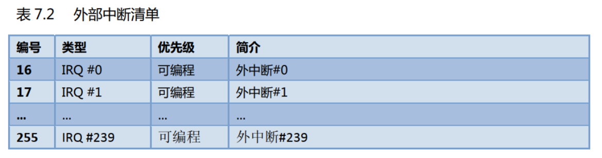

Reset（ 复位） 、 NMI（ Non Maskable Interrupt，不可屏蔽中断）、 HardFault（ 硬件异常） 的优先级是固定的， 且优先级是负数，也就是最高的（优先级数字越小，优先级越高）。 剩下的异常或中断，都是可以通过修改NVIC的寄存器调整优先级（ 但不能设置为负数），后边会提到 。 

在 NVIC（后边会学到）的中断控制及状态寄存器中，有一个 VECTACTIVE 位段；另外，还有一个特殊功能寄存器 IPSR。在它们二者的里面，都记录了当前正服务异常的编号。需要注意：这里所讲的中断号，都是指 NVIC 所使用的中断号。另一方面，芯片一些管脚的名字也可能被取为类似”IRQ #”的名字，这两者不能混淆，它们没有必然联系。

常见的情况是，编号最靠前的几个中断源被指定到片上外设，接下来的中断源才给外部中断引脚使用，因此还是要参阅芯片的数据手册来弄清楚。

如果一个发生的异常不能被即刻响应，就称它被**“悬起**” (pending)。不过，少数 fault 异常是不允许被悬起的。一个异常被悬起的原因，可能是系统当前正在执行一个更高优先级异常的服务例程，或者因相关掩蔽位的设置导致该异常被除能。对于每个异常源，在被悬起的情况下，都会有一个对应的“悬起状态寄存器”保存其异常请求，直到该异常能够执行为止，这与传统的 ARM 是完全不同的。在以前，是由产生中断的设备保持住请求信号。现在NVIC 的悬起状态寄存器的出现解决了这个问题，即使后来设备已经释放了请求信号，曾经的中断请求也不会错失。  

### 3. 优先级

从上一小节我们知道有256个中断，那么如此多的中断， 导致了一些新问题。 比如两个中断同时发生，应该先执行哪个中断任务？又比如一个中断发生了，又来了一个更紧急的中断，是该继续执行原来的中断，还是执行新的紧急中断？  于是就有了优先级的概念。

#### 3.1 表示优先级的位数

在 CM3 中，优先级对于异常来说很关键的，它会影响一个异常是否能被响应，以及何时可以响应。**优先级的数值越小，则优先级越高**。 CM3 支持中断嵌套，使得高优先级异常会抢占(preempt)低优先级异常。

有 3 个系统异常：复位， NMI 以及硬 fault，它们有固定的优先级，并且它们的优先级号是负数，从而高于所有其它异常。所有其它异常的优先级则都是可编程的（但不能编程为负数）。

原则上， CM3 支持 3 个固定的高优先级和多达 256 级的可编程优先级，并且支持 128 级抢占（128 的来历请见下文）。但是，绝大多数 CM3 芯片都会精简设计，以致实际上支持的优先级数会更少，如 8 级， 16 级， 32 级等。它们在设计时会**裁掉表达优先级的几个低端有效位，以达到减少优先级数的目的**（可见，不管使用多少位，优先级号是以MSB 对齐的）。举例来说，如果只使用了 3 个位来表达优先级，则优先级配置寄存器的结构会如图所示：  

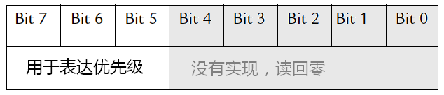

在图中， [4:0]没有被实现，所以读它们总是返回零，写它们则忽略写入的值。因此，对于 3 个位的情况，我们能够使用的 8 个优先级为： 0x00（最高）， 0x20， 0x40， 0x60， 0x80，0xA0， 0xC0 以及 0xE0。

如果使用更多的位来表达优先级，则能够使用的值也更多，同时需要的门也更多——带来更多的成本和功耗。CM3 允许的**最少使用位数为 3 个位**，也就是说**至少要支持 8 级优先级**。下图给出 3 个优先级位和 4 个优先级位的对比：  

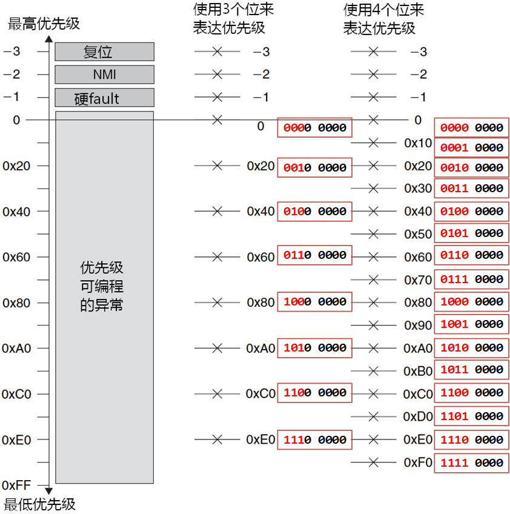

通过让优先级以 MSB 对齐，可以简化程序的跨器件移植。比如，如果一个程序早先在支持 4 位优先级的器件上运行，在移植到只支持 3 位优先级的器件后，其功能不受影响。但若是对齐到 LSB，则会使 MSB 丢失，导致数值大于 7 的低优先级一下子升高了，甚至会反转小于等于 7 的高优先级。如， 8 号优先级（1000 0000）因为损失了 MSB（高位的1丢掉了的话），现在反而变成 0 号了 。

那么当使用了 3 位、 5 位及 8 位来表达优先级时，各是什么情况呢？  

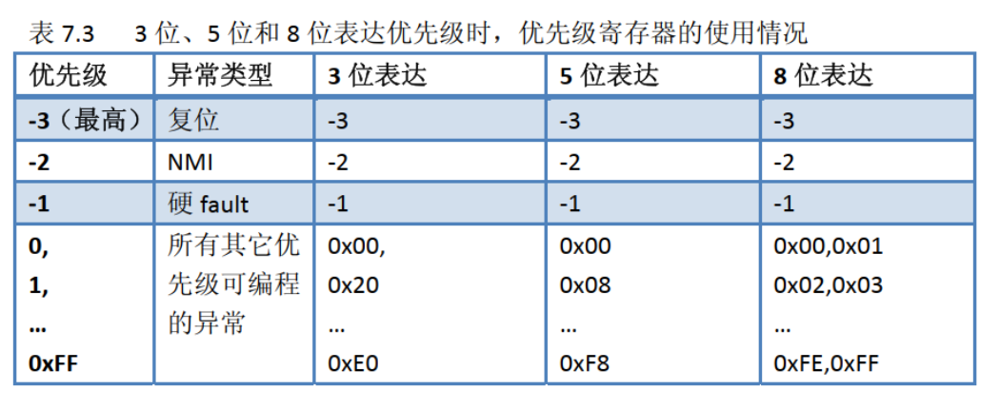

#### 3.2 为什么只剩128个抢占优先级？

明明支持 256 个优先级，为啥只有 128 个抢占级，剩下一半哪儿去了？原来，为了使抢占机能变得更可控， CM3 还把 256 级优先级按位分成高低两段，分别是**抢占优先级**和**亚优先级**。

NVIC 中有一个寄存器是“应用程序中断及复位控制寄存器”：

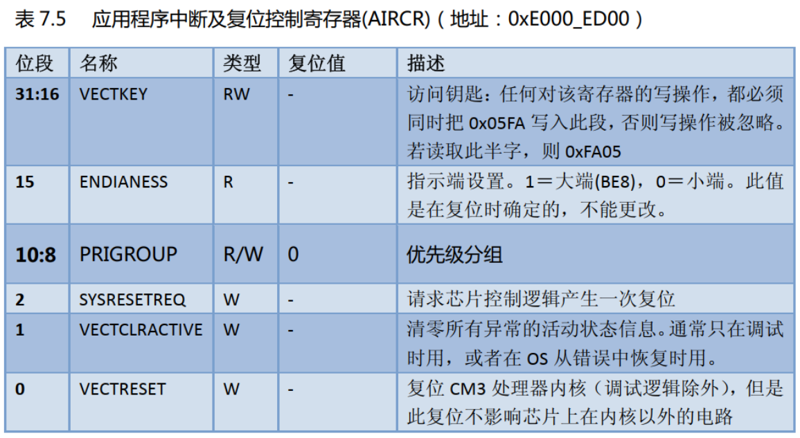

它里面有一个位段名为“优先级组”。该位段的值对每一个优先级可配置的异常都有影响——把其优先级分为个位段： MSB 所在的位段（左边的）对应抢占优先级，而 LSB 所在的位段（右边的）对应亚优先级 ：

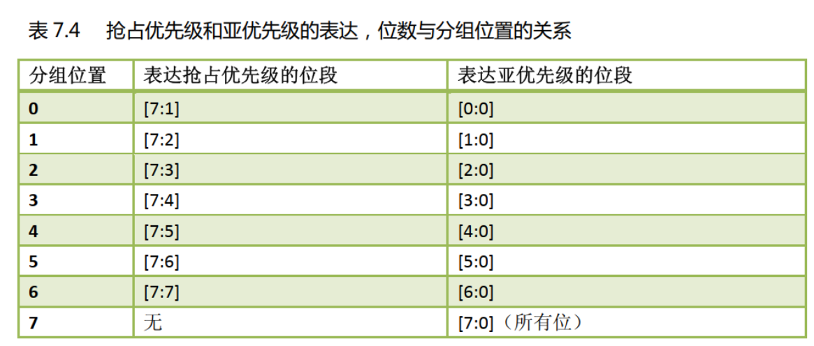

抢占优先级决定了抢占行为：当系统正在响应某异常 L 时，如果来了抢占优先级更高的异常 H，则 H 可以抢占 L。亚优先级则处理“内务”：当抢占优先级相同的异常有不止一个悬起时，就优先响应亚优先级最高的异常。这种优先级分组规定：**亚优先级至少是 1 个位**。因此**抢占优先级最多是 7 个位，造成了最多只有 128 级抢占的现象**。    

但是 CM3 允许从比特 7 处分组，此时所有的位都表达亚优先级，没有任何位表达抢占优先级，因而所有优先级可编程的异常之间就不会发生抢占——相当于在它们之中除能了CM3 的中断嵌套机制。当然还有凌架于法律之上的三位老大：复位， NMI 和硬 fault。它们无论何时出现，都立即无条件抢占所有优先级可编程的“平民异常”。  

在计算抢占优先级和亚优先级的有效位数时，必须先求出下列值 :

- 芯片实际使用了多少位来表达优先级。
- 优先级组是如何划分的。

举个例子，如果只使用 3 个位来表达优先级（[7:5]有效，剩下的[4:0]无效，全为0），那么此时的优先级组的值是 5（从比特 5 处分组），这样我们得到 4 级抢占优先级，且在每个抢占优先级的内部有 2 个亚优先级，如下图所示。  

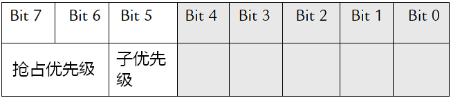

那么这种情况之下，其可用优先级的具体情况如下所示：  

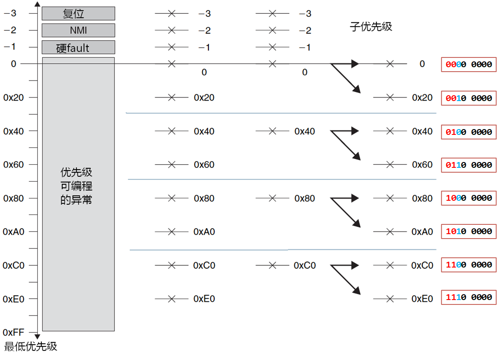

注意：虽然[4:0]未使用，却允许从它们中分组。例如，如果优先级组为 1 ，则所有可用的 8 个优先级（因为目前分析的是只有3个位表示优先级，也就是最高3位 [7:5] 才表示有效的优先级）都是抢占优先级，如下图（3 位优先级，从比特 1 处分组  ）:

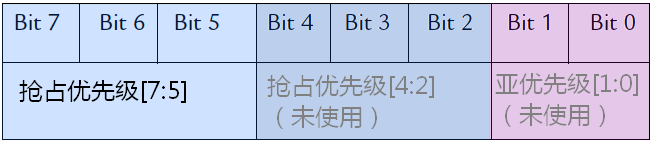

那么 3 位优先级，从比特 1 处分组，详细情况 如下图，即便是从位 1 处分组，理论上有4个亚优先级，32个抢占优先级，但是由于只有最高三位表示优先级，这就导致了只会有8个抢占优先级，0个亚优先级的情况：

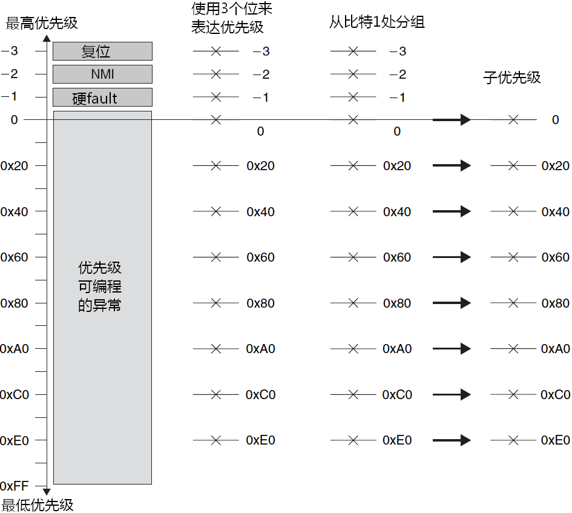

如果优先级完全相同的多个异常同时悬起，则先响应异常编号最小的那一个。如 IRQ #3 会比 IRQ #5 先得到响应。  

虽然优先级分组的功能很强大，但是粗心地更改会使它变得很暴力，尤其是在设计硬实时系统的时候，这常常会改变系统的响应特性，导致某些关键任务有可能得不到及时响应，凶多吉少的意外随时可能猛烈发作。其实在绝大多数情况下，优先级的分组都要预先经过计算论证，并且在开机初始化时一次性地设置好，以后就再也不动它了。只有在绝对需要且绝对有把握时，才小心地更改，并且要经过尽可能充分的测试。另外，优先级组所在的寄存器 AIRCR也基本上是“一次成型”，只是需要手工产生复位时才写里面相应的位。  

### 4. 向量表

当发生了异常并且要响应它时， CM3 需要定位其处理例程的入口地址。这些入口地址存储在所谓的“（异常）向量表”中。缺省情况下， CM3 认为该表位于零地址处，且各向量占用 4 字节，因此每个表项占用 4 字节，如下表所示。  

|    地址     | 异常编号 | 值（32 位整数）             |
| :---------: | :------: | --------------------------- |
| 0x0000_0000 |    ‐     | MSP 的初始值                |
| 0x0000_0004 |    1     | 复位向量（PC 初始值）       |
| 0x0000_0008 |    2     | NMI 服务例程的入口地址      |
| 0x0000_000C |    3     | 硬 fault 服务例程的入口地址 |
|      …      |    …     | 其它异常服务例程的入口地址  |

因为地址 0 处应该存储引导代码，所以它通常是 Flash 或者是 ROM 器件，并且它们的值不得在运行时改变。然而，为了动态重分发中断， CM3 允许向量表重定位——从其它地址处开始定位各异常向量。这些地址对应的区域可以是代码区，但也可以是 RAM 区。

在 RAM区就可以修改向量的入口地址了。为了实现这个功能， NVIC 中有一个寄存器，称为“向量表偏移量寄存器”（在地址 0xE000_ED08 处），通过修改它的值就能定位向量表。

**【注意】**向量表的起始地址是有要求的：必须先求出系统中共有多少个向量，再把这个数字向上增大到是 2 的整次幂，而起始地址必须对齐到后者的边界上。例如，如果一共有 32 个中断，则共有 32+16（系统异常） = 48 个向量，向上增大到 2 的整次幂后值为 64，因此地址地址必须能被 64\*4=256 整除，从而合法的起始地址可以是： 0x0, 0x100, 0x200 等。向量表偏移量寄存器的定义如下表所示。  

| 位段 | 名称      | 类型 | 复位值 | 描述                                        |
| ---- | --------- | ---- | ------ | ------------------------------------------- |
| 29   | TBLBASE   | RW   | 0      | 向量表是在 Code 区（0），还是在 RAM 区（1） |
| 15   | ENDIANESS | R    | ‐      | 向量表的起始地址                            |

如果需要动态地更改向量表，则对于任何器件来说，向量表的起始处都必须包含以下向量：

（1）主堆栈指针（MSP）的初始值

（2）复位向量

（3）NMI（不可屏蔽中断）

（4）硬 fault 服务例程

后两者也是必需的，因为有可能在引导过程中发生这两种异常。我们可以在 SRAM 中开出一块用于存储向量表。然后在引导完成后，就可以启用内存中的向
量表，从而实现向量可动态调整的功能。 
