<!-- more -->

## 一、开发方式

这篇笔记是已经对STM32有了一定的了解后才写的，其实STM32的开发大概有四种方式

- （1）汇编，强的一批，我们可以直接使用内部寄存器和STM32的寄存器来使用汇编开发，难度可想而知。
- （2）C语言+寄存器开发，这种相对容易，毕竟C语言我们都学过，无非是寄存器超级多。
- （3）C语言+标准库，这个是我入门STM32的时候最先使用的库，一般都用这个。
- （4）C语言+HAL库，HAL库配合STM32CubeMX软件使用，由于图形化的配置界面，这个HAL库据说是ST以后主推的库。

## 二、库开发与寄存器开发的关系  

一般我们都是从学 51 单片机开发转而学习 STM32 开发，习惯了 51 单片机的寄存器开发方式，突然一个 ST 官方库摆在面前会一头雾水，不知道从何下手。

下那么STM32 固件库到底是什么，和寄存器开发有什么关系？其实一句话就可以概括：固件库就是函数的集合，固件库函数的作用是向下负责与寄存器直接打交道，向上提供用户函数调用的接口（API）。  

在 51 的开发中我们常常的作法是直接操作寄存器，比如要控制某些 IO 口的状态，我们直接操作寄存器：  

```c
P0 = 0x11;
```

而在 STM32 的开发中，我们同样可以操作寄存器：  

```c
GPIOx->BRR = 0x0011;
```

这种方法当然可以，但是这种方法的劣势是我们需要去掌握每个寄存器的用法，才能正确使用STM32，而对于 STM32 这种级别的 MCU，数百个寄存器记起来又是谈何容易。于是 ST(意法半导体)推出了官方固件库，固件库将这些寄存器底层操作都封装起来，提供一整套接口（API）供开发者调用，大多数场合下，我们不需要去知道操作的是哪个寄存器，我们只需要知道调用哪些函数即可 ，比如上面的控制 BRR 寄存器实现电平控制，官方库封装了一个函数：  

```c
void GPIO_ResetBits(GPIO_TypeDef* GPIOx, uint16_t GPIO_Pin)
{
	GPIOx->BRR = GPIO_Pin;
}
```

这个时候我们不需要再直接去操作 BRR 寄存器了，只需要知道怎么使用 GPIO_ResetBits()这个函数就可以了。 在对外设的工作原理有一定的了解之后，再去看固件库函数，基本上函数名字能告诉我们这个函数的功能是什么，该怎么使用， 这样是不是开发会方便很多？

任何处理器，不管它有多么的高级，归根结底都是要对处理器的寄存器进行操作。但是固件库不是万能的，如果想要把 STM32 学透， 光读 STM32 固件库是远远不够的。还是要了解一下 STM32 的原理，而这些原理了解了，在进行固件库开发过程中才可能得心应手游刃有余。  

库函数的引入，大大降低了 STM 主控芯片开发的难度。 ST 公司为了方便用户开发 STM32芯片开发提供了三种库函数，从时间产生顺序是：标准库、 HAL 库和 LL 库。目前 ST 已经逐渐暂停对部分标准库的支持， ST 的库函数维护重点对象已经转移到 HAL 库和 LL 库上。 

## 三、STM32 固件库与 CMSIS 标准

### 1. CMSIS的来历

STM32 固件库就是函数的集合，那么对这些函数有什么要求呢？这里就涉及到一个 CMSIS 标准的基础知识，这部分知识可以从《[Cortex-M3 权威指南](https://picture.iczhiku.com/resource/upload/6820519db1f84e7faaf51c573c48e013.pdf)》中了解到，这里大概提一下。

 STM32 和 ARM 以及 ARM7是什么关系？其实 ARM 是一个做芯片标准的公司，它负责的是芯片内核的架构设计，而 TI， ST 这样的公司，他们并不做标准，他们是芯片公司，他们是根据 ARM 公司提供的芯片内核标准设计自己的芯片。所以，任何一个做 Cortex-M3 芯片，他们的内核结构都是一样的，不同的是他们的存储器容量， 片上外设， IO 以及其他模块的区别。所以我们会发现，不同公司设计的 Cortex-M3 芯片他们的端口数量，串口数量，控制方法这些都是有区别的， 这些资源他们可以根据自己的需求理念来设计。同一家公司设计的多种 Cortex-m3 内核芯片的片上外设也会有很大的区别，比如 STM32F103RBT 和 STM32F103ZET，他们的片上外设就有很大的区别。我们可以通过《Cortex-M3 权威指南》中的一个图来了解一下：  

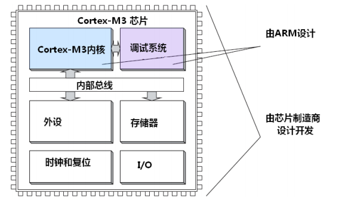

从上图可以看出，芯片虽然是芯片公司设计，但是内核却要服从 ARM 公司提出的 Cortex-M3内核标准了，理所当然，芯片公司每卖出一片芯片，需要向 ARM 公司交一定的专利费。既然大家都使用的是 Cortex-M3 核，也就是说，本质上大家都是一样的，这样 ARM 公司为了能让不同的芯片公司生产的 Cortex-M3 芯片能在软件上基本兼容，和芯片生产商共同提出了一套标准 CMSIS 标准(Cortex Microcontroller Software Interface Standard) ,翻译过来是“ARM Cortex™ 微控制器软件接口标准”。 ST 官方库就是根据这套标准设计的。这里我们来看看基于 CMSIS 应用程序基本结构：  

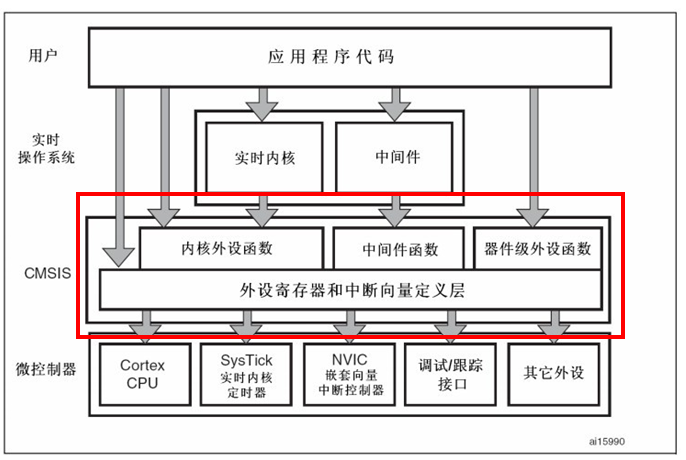

CMSIS 分为 3 个基本功能层：

（1）核内外设访问层： ARM 公司提供的访问，定义处理器内部寄存器地址以及功能函数。

（2）中间件访问层:定义访问中间件的通用 API,也是 ARM 公司提供。

（3）外设访问层：定义硬件寄存器的地址以及外设的访问函数。

从图中可以看出， CMSIS 层在整个系统中是处于中间层，向下负责与内核和各个外设直接打交道，向上提供实时操作系统用户程序调用的函数接口。如果没有 CMSIS 标准，那么各个芯片公司就会设计自己喜欢的风格的库函数，而 CMSIS 标准就是要强制规定，芯片生产公司设计的库函数必须按照 CMSIS 这套规范来设计。

### 2. CMSIS 标准  

根据一些调查研究表明， 软件开发已经被嵌入式行业公认为最主要的开发成本,为了降低这个成本， ARM 与 Atmel、 IAR、 KEIL、 SEGGER 和 ST 等诸多芯片和软件工具厂商合作， 制定了一个将所有 Cortex 芯片厂商的产品的软件接口标准化的标准 CMSIS（Cortex Microcontroller Software Interface Standard）。下面来看 ARM 官方提供的 CMSIS 规范架构， 如图 ：

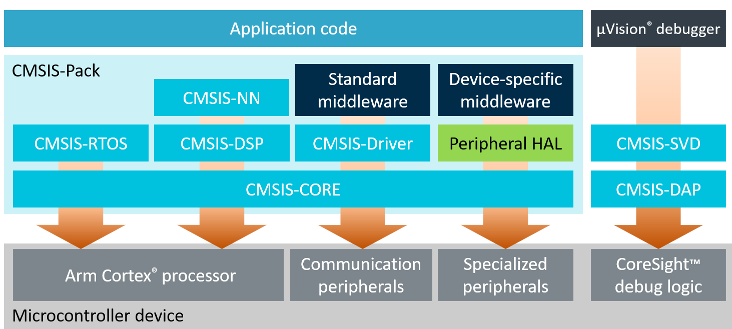

从图中可以看出这个标准分级明显， 从用户程序到内核底层实现做了分层。按照这个分级，HAL 库属于 CMSIS-Pack 中的“Peripheral HAL”层。CMSIS 规定的最主要的 3 个部分为：核内外设访问层（由 ARM 负责实现）、 片上外设访问层和外设访问函数（后面两个由芯片厂商负责实现）。ARM 整合并提供了大量的模版，各厂商根据自己的芯片差异修改模版， 这其中包括汇编文件 startup\_device.s、 system\_.h 和 system\_.c 这些与初始化和系统相关的函数。  

结合 STM32F1 的芯片来说，其 CMSIS 应用程序的简单结构框图，不包括实时操作系统和中间设备等组件，CMSIS 分级下的 stm32f1 的文件分布  结构如图 :

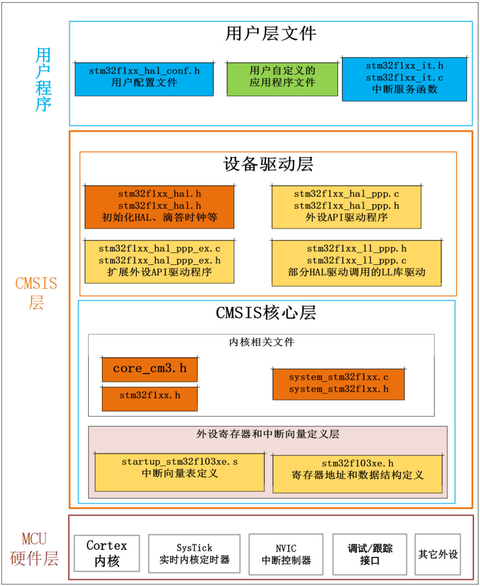


一个简单的例子，我们在使用 STM32 芯片的时候首先要进行系统初始化， CMSIS 规范就规定， 系统初始化函数名字必须为 SystemInit，所以各个芯片公司写自己的库函数的时候就必须用 SystemInit 对系统进行初始化。 CMSIS 还对各个外设驱动文件的文件名字规范化，以及函数名字规范化等等一系列规定。上一节讲的函数GPIO_ResetBits 这个函数名字也是不能随便定义的，是要遵循 CMSIS 规范的。至于 CMSIS 的具体内容就不多说了，网上资料很多。

## 四、三种官方库

ST 先后提供了两套固件库：**标准库和 HAL 库**。 

STM32 芯片面市之初只提供了丰富全面的标准库，大大便利了用户程序开发，为广大开发板所推崇，同时也为 ST 积累了大量标准库用户。

大约到 2014 年左右， ST 在标准库的基础上又推出了 HAL 库。实际上， HAL 库和标准库本质上是一样的，都是提供底层硬件操作 API，而且在使用上也是大同小异。

据说 ST 官方之所以这几年大力推广 HAL 库，是因为 HAL 的结构更加容易整合 STM32Cube，而 STM32CubeMX 是 ST 这几年极力推荐的程序生成开发工具。所以后来新出的 STM32 芯片， ST 直接只提供 HAL 库。

那么是使用 HAL 库还是标准库好呢？其实 HAL库和标准库都非常强大，对于目前标准库支持的芯片采用标准库开发也非常方便实用。不需要纠结自己学的是 HAL 库还是标准库，无论使用哪种库，只要理解了 STM32 本质，任何库都是一种工具，使用起来都非常方便。学会了一种库，另外一种库也非常容易上手，程序开发思路转变也非常容易。  

### 1. 标准外设库

标准外设库（Standard Peripherals Library）是对 STM32 芯片的一个完整的封装，包括所有标准器件外设的器件驱动器， 是 ST 最早推出的针对 STM 系列主控的库函数。标准库的设计的初衷是减少用户的程序编写时间，进而降低开发成本。几乎全部使用 C 语言实现并严格按照“Strict ANSI-C”、 MISRA-C 2004 等多个 C 语言标准编写。但标准外设库仍然接近于寄存器操作，主要就是将一些基本的寄存器操作封装成了 C 函数。开发者仍需要关注所使用的外设是在哪个总线之上，具体寄存器的配置等底层信息。  

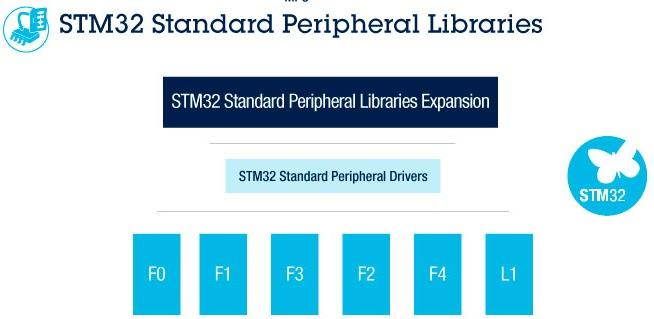

ST 为各系列提供的标准外设库稍微有些区别。例如， STM32F1x 的库和 STM32F3x 的库在文件结构上就有些不同，此外，在内部的实现上也稍微有些区别，这个在具体使用（移植）时，需要注意一下！但是，不同系列之间的差别并不是很大，而且在设计上是相同的。 STM32 的标准外设库涵盖以下 3 个抽象级别：

- 包含位域和寄存器在内的完整的寄存器地址映射

- 涵盖所有外围功能（具有公共 API 的驱动器）的例程和数据结构的集合。

- 一组包含所有可用外设的示例，其中包含最常用的开发工具的模板项目。

关于更详细的信息，可以参考 ST 的官方文档《STM32 固件库使用手册中文翻译版》，文档中对于标准外设库函数命名、文件结构等都有详细的说明， 这里就不多介绍了。值得一提的是由于 STM32 的产品性能及标准库代码的规范和易读性以及例程的全覆盖性，使 STM32 的开发难度大大下降。 但 ST 从 L1 以后的芯片 L0、 L4 和 F7 等系列就没有再推出相应的标准库支持包了。  

#### 1.1 文件下载

我们下载一个标准库，我们来这个STM32标准外设库下载：[STM32标准外设软件库 - 意法半导体STMicroelectronics](https://www.st.com/zh/embedded-software/stm32-standard-peripheral-libraries.html)

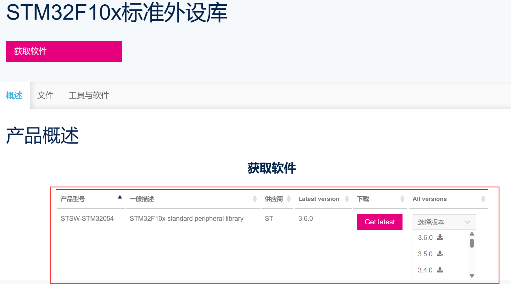

#### 1.2 标准库介绍

接下来我们来看一下目录结构，前面我们下载完解压，大概的目录结构如下所示：

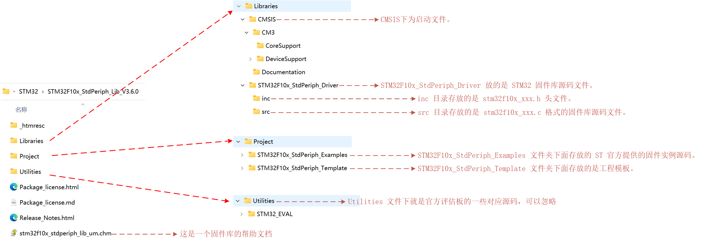

（1）Libraries 文件夹下面有 CMSIS 和 STM32F10x_StdPeriph_Driver 两个目录，这两个目录包含固件库核心的所有子文件夹和文件。其中CMSIS目录下面是启动文件 ，STM32F10x_StdPeriph_Driver 放的是 STM32 固件库源码文件。源文件目录下面的 inc 目录存放的是 stm32f10x_xxx.h 头文件,无需改动。 src 目录下面放的是 stm32f10x_xxx.c 格式的固件库源码文件。每一个.c 文件和一个相应的.h 文件对应。这里的文件也是固件库的核心文件，每个外设对应一组文件。Libraries 文件夹里面的文件在我们建立工程的时候都会使用到。

（2）Project 文件夹下面有两个文件夹。顾名思义， STM32F10x_StdPeriph_Examples 文件夹下面存放的 ST 官方提供的固件实例源码，在以后的开发过程中，可以参考修改这个官方提供的实例来快速驱动自己的外设，很多开发板的实例都参考了官方提供的例程源码。 STM32F10x_StdPeriph_Template 文件夹下面存放的是工程模板。

（3）Utilities 文件下就是官方评估板的一些对应源码，这个可以忽略不看。

（4）根目录中还有一个 stm32f10x_stdperiph_lib_um.chm 文件，直接打开可以知道，这是一个固件库的帮助文档，这个文档非常有用，只可惜是英文的，在开发过程中，这个文档会经常被使用到。  

#### 1.3 关键文件介绍

主要是Libraries 目录下面几个重要的文件：

- CoreSupport 目录

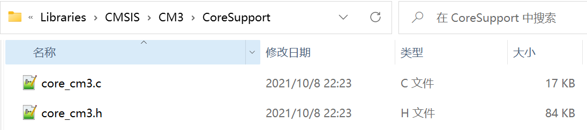

core_cm3.c 和 core_cm3.h 文件位于Libraries\CMSIS\CM3\CoreSupport 目录下面的，这个就是 CMSIS 核心文件，提供进入 M3 内核接口，这是 ARM 公司提供，对所有 CM3 内核的芯片都一样。我们永远都不需要修改这个文件。  

- DeviceSupport目录 

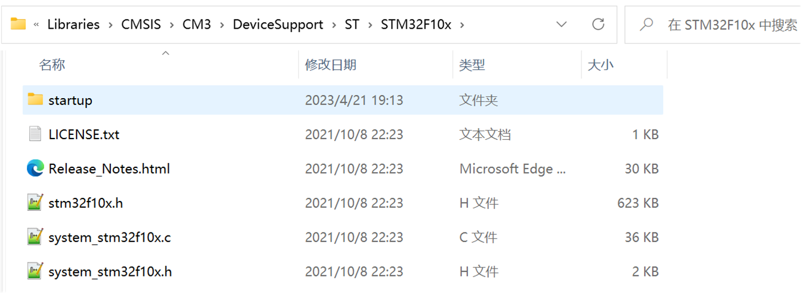

这个目录下面有三个文件： system_stm32f10x.c, system_stm32f10x.h 以及 stm32f10x.h 文件。

（1）system_stm32f10x.c 和对应的头文件 system_stm32f10x.h 文件的功能是设置系统以及总线时钟，这个里面有一个非常重要的 SystemInit()函数，这个函数在我们系统启动的时候都会调用，用来设置系统的整个时钟系统。 

（2）stm32f10x.h 这个文件就相当重要了，只要做 STM32 开发，几乎时刻都要查看这个文件相关的定义。这个文件打开可以看到，里面非常多的结构体以及宏定义。 这个文件里面主要是系统寄存器定义申明以及包装内存操作， 对于这里是怎样申明以及怎样将内存操作封装起来的。 

（3） DeviceSupport\ST\STM32F10x 同一级还有一个 startup 文件夹，这个文件夹里面放的文件是启动文件。在\startup\arm 目录下，我们可以看到 8 个 startup 开头的.s 文件。  

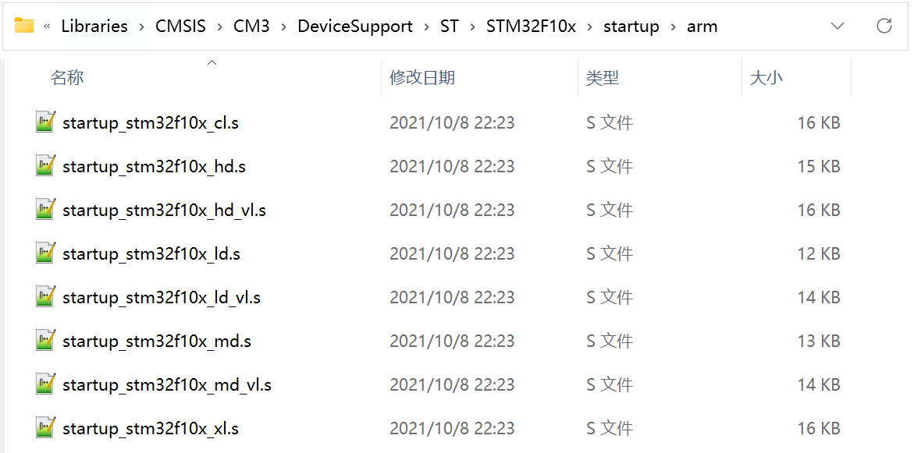

这里之所以有 8 个启动文件，是因为对于不同容量的芯片启动文件不一样。对于 103 系列，主要是用其中 3 个启动文件：  

```txt
startup_stm32f10x_ld.s ： 适用于小容量 产品
startup_stm32f10x_md.s ： 适用于中等容量产品
startup_stm32f10x_hd.s ： 适用于大容量产品
```

> 这里的容量是指 FLASH 的大小.判断方法如下：
>
> 小容量： FLASH ≤ 32K
> 中容量： 64K≤FLASH ≤ 128K
> 大容量： 256K ≤ FLASH


STM32F103ZET6和stm32F103RCT6芯片都属于大容量产品，所以我们的启动文件选择 startup_stm32f10x_hd.s，对于中等容量芯片请要选择 startup_stm32f10x_md.s 启动文件，小容量芯片选择 startup_stm32f10x_ld.s。启动文件到底什么作用，其实我们可以打开启动文件进去看看。启动文件主要是进行堆栈之类的初始化， 中断向量表以及中断函数定义。启动文件要引导进入 main 函数。 Reset_Handler中断函数是唯一实现了的中断处理函数，其他的中断函数基本都是死循环，启动文件我们后边会详细的去分析。   

- 其他几个文件

还有其他几个文件 stm32f10x_it.c,stm32f10x_it.h 以及 stm32f10x_conf.h 等文件。 stm32f10x_it.c 里面是用来编写中断服务函数，中断服务函数也可以随意编写在工程里面的任意一个文件里面。stm32f10x_conf.h 文件打开可以看到一堆的#include，这里建立工程的时候，可以注释掉一些不用的外设头文件。

### 2. HAL库  

HAL 是 Hardware Abstraction Layer 的缩写，即硬件抽象层。是 ST 为可以更好的确保跨STM32 产品的最大可移植性而推出的 MCU 操作库。这种程序设计由于抽离应用程序和硬件底层的操作， 更加符合跨平台和多人协作开发的需要。

HAL 库是基于一个非限制性的 BSD 许可协（Berkeley Software Distribution）而发布的开源代码。 ST 制作的中间件堆栈（USB 主机和设备库， STemWin）带有允许轻松重用的许可模式，只要是在 ST 公司的 MCU 芯片上使用，库中的中间件(USB 主机/设备库,STemWin)协议栈即被允许修改，并可以反复使用。至于基于其它著名的开源解决方案商的中间件（ FreeRTOS，FatFs， LwIP 和 PolarSSL）也都具有友好的用户许可条款。

HAL 库是从 ST 公司从自身芯片的整个生产生态出发，为了方便维护而作的一次整合， 以改变标准外设库带来各系列芯片操作函数结构差异大、分化大、不利于跨系列移植的情况。相比标准外设库， STM32Cube HAL 库表现出更高的抽象整合水平， HAL 库的 API 集中关注各外设的公共函数功能，这样便于定义一套通用的用户友好的 API 函数接口，从而可以轻松实现从一个 STM32 产品移植到另一个不同的 STM32 系列产品。但由于封闭函数为了适应最大的兼容性， HAL 库的一些代码实际上的执行效率要远低于寄存器操作。但即便如此， HAL 库仍是 ST未来主推的库。  

STM32Cube 目前几乎支持 STM32 全系列，我主要是使用的STM32F1系列，所以这里主要写STM32CubeF1 相关知识。如果使用的是其他系列的 STM32 芯片，请到ST 官网下载对应的 STM32Cube 包即可。  

#### 2.1 HAL库能做什么

使用标准库可以忽略很多芯片寄存器的细节，根据提供的接口函数快速配置和使用一个 STM32 芯片， 使用 HAL 库也是如此。 不论何种库， 本质都是配置指定寄存器使芯片工作在我们需要的工作模式下。 HAL 库在设计的时候会更注重软硬件分离。HAL 库的 API 集中关注各个外设的公共函数功能，便于定义通用性更好、更友好的 API 函数接口，从而具有更好的可移植性。 HAL 库写的代码在不同的 STM32 产品上移植，非常方便。

我们需要学会调用 HAL 库的 API 函数，配置对应外设按照我们的要求工作，这就是 HAL库能做的事。但是无论库封装得多高级，最终还是要通过配置寄存器来实现。所以我们学习 HAL库的同时，也建议同时学习外设的工作原理和寄存器的配置。

HAL 库还可以和 STM32CubeMX（图形化软件配置工具）配套一起使用，开发者可以使用该工具进行可视化配置，并且自动生成配置好的初始化代码，大大的节省开发时间。  

#### 2.2 文件下载

在哪下载？还是在官网：[STM32CubeF1 - STM32Cube MCU包，用于STM32F1系列（HAL、底层API和CMSIS（CORE、DSP和RTOS）、USB、TCP/IP、File system、RTOS和Graphic - 附带在以下ST板上运行的示例：STM32 Nucleo、探索套件和评估板） - 意法半导体STMicroelectronics](https://www.st.com/zh/embedded-software/stm32cubef1.html#get-software)

网页登陆：[st.com/content/st_com/en.html](https://www.st.com/content/st_com/en.html)，在打开的页面中依次选择：“【Tools & Software】&rarr;【Ecosystem】&rarr;【STM32Cube】 &rarr;【新页面】&rarr;【Prodcut selector】， 如图  

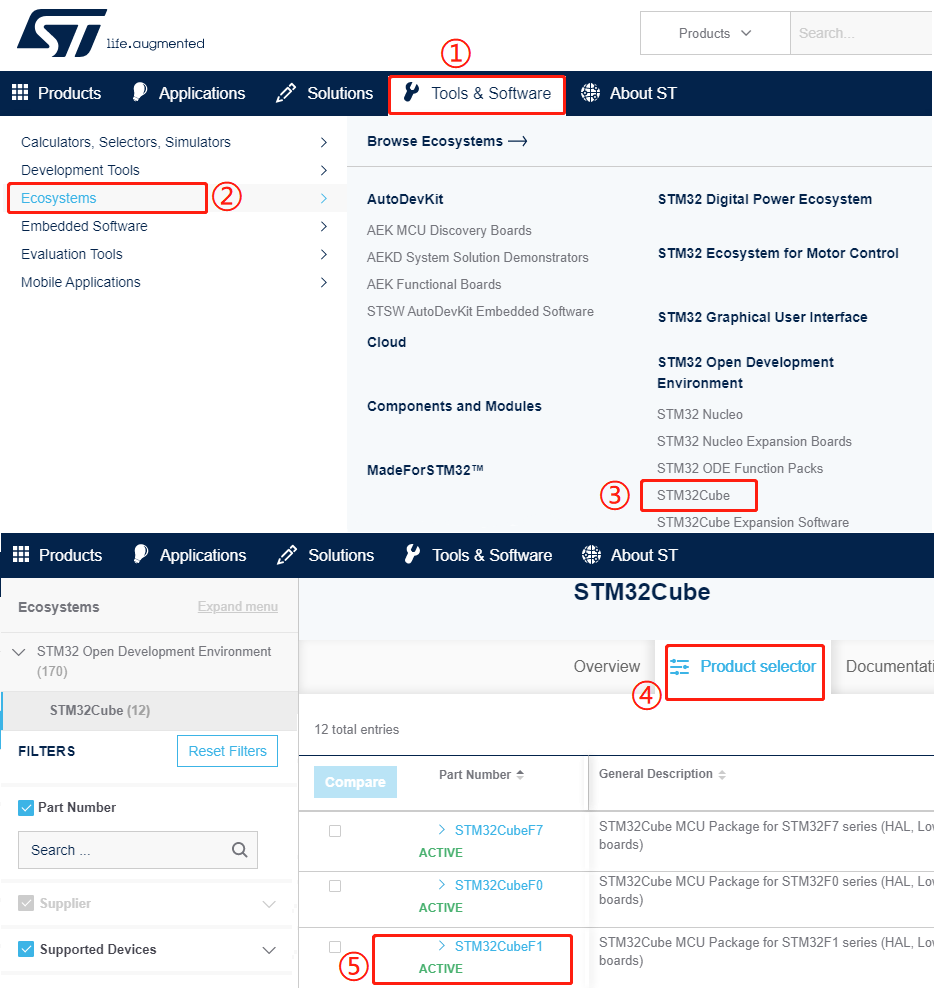

在展开的页面中选择我们需要和固件，这展开“STM32CubeF1”即可看到我们需要的 F1 的安装包， 按下图操作， 在新的窗口中拉到底部，选择适合自己的下载方式， 注册帐号即可获取相应的驱动包。  

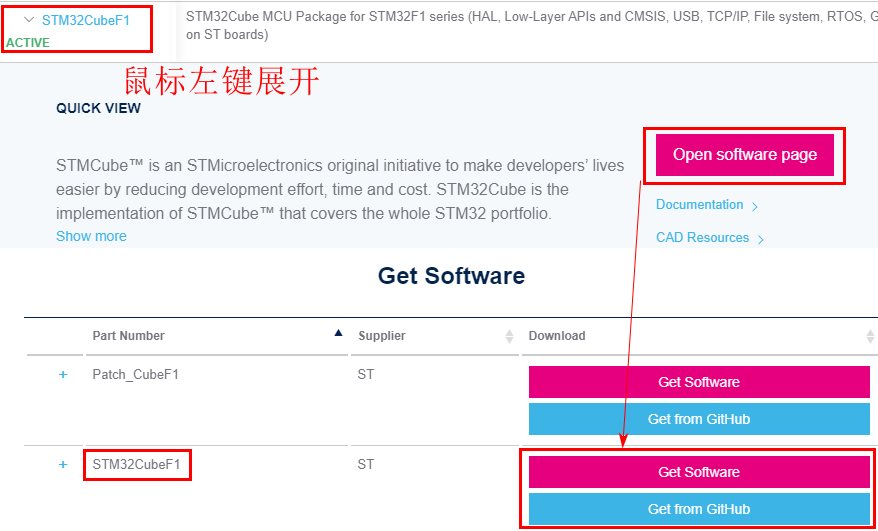

官网同时还未我们提供了一个git仓库：[GitHub - STMicroelectronics/STM32CubeF1: STM32Cube MCU Full Package for the STM32F1 series - (HAL + LL Drivers, CMSIS Core, CMSIS Device, MW libraries plus a set of Projects running on all boards provided by ST (Nucleo, Evaluation and Discovery Kits))](https://github.com/STMicroelectronics/STM32CubeF1)

通过这两种途径，我们都可以下载。

#### 2.3 HAL库介绍

我们通过这种途径下载的固件包其实是HAL库，后边再介绍这个库与标准库的关系，现在我们看一下这个固件包的目录结构：

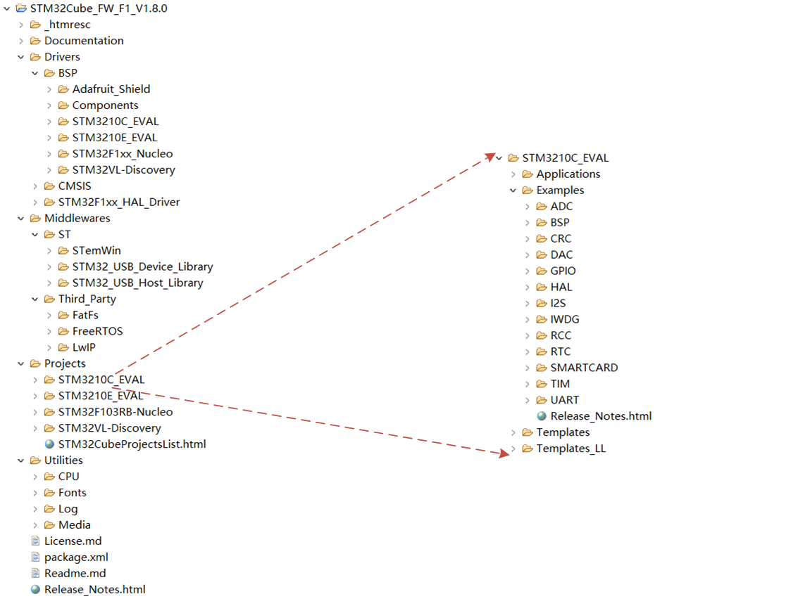

这里就看一下大概结构，详细的可以看后面的笔记，会单独再详细学习。

### 3. LL库

LL 库（Low Layer）目前与 HAL 库捆绑发布，它设计为比 HAL 库更接近于硬件底层的操作，代码更轻量级， 代码执行效率更高的库函数组件， 可以完全独立于 HAL 库来使用，但 LL库不匹配复杂的外设，如 USB 等。所以 LL 库并不是每个外设都有对应的完整驱动配置程序。使用 LL 库需要对芯片的功能有一定的认知和了解,它可以：    

- 独立使用，该库完全独立实现，可以完全抛开 HAL 库，只用 LL 库编程完成。
- 混合使用，和 HAL 库结合使用。  

对于 HAL 库和 LL 库的关系， 如下图的软件框架所示， 可以看出它们设计为彼此独立的分支， 但又同属于 HAL 库体系。

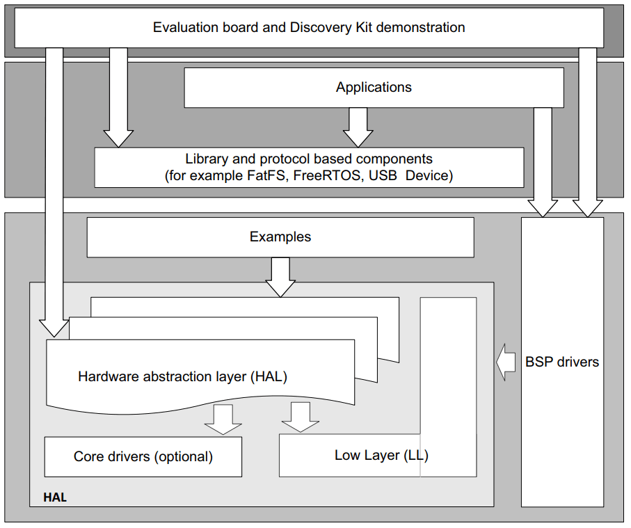
