HAL，英文全称 Hardware Abstraction Layer，即硬件抽象层。 HAL 库是 ST 公司提供的外设驱动代码的驱动库，用户只需要调用库的 API 函数，便可间接配置寄存器。我们要写程序控制 STM32 芯片，其实最终就是控制它的寄存器，使之工作在我们需要的模式下， HAL 库将大部分寄存器的操作封装成了函数，我们只需要学习和掌握 HAL 库函数的结构和用法，就能方便地驱动 STM32 工作， 以节省开发时间。  

>主要是ST官网主推的现在就是这个HAL库，而且STM32CubeMX软件生成工程也是用的这个，所以还是有必要学习一下。

<!-- more -->

## 一、HAL库驱动包

### 1. 下载STM32CubeF1固件

直接来这里下载：[STM32CubeF1 | Product - 意法半导体STMicroelectronics](https://www.st.com.cn/zh/embedded-software/stm32cubef1.html)或者直接Github：[STMicroelectronics/STM32CubeF1](https://github.com/STMicroelectronics/STM32CubeF1)

### 2. 固件包分析

#### 2.1 整体目录结构

我们通过这种途径下载的固件包其实是HAL库，看一下这个固件包的目录结构：

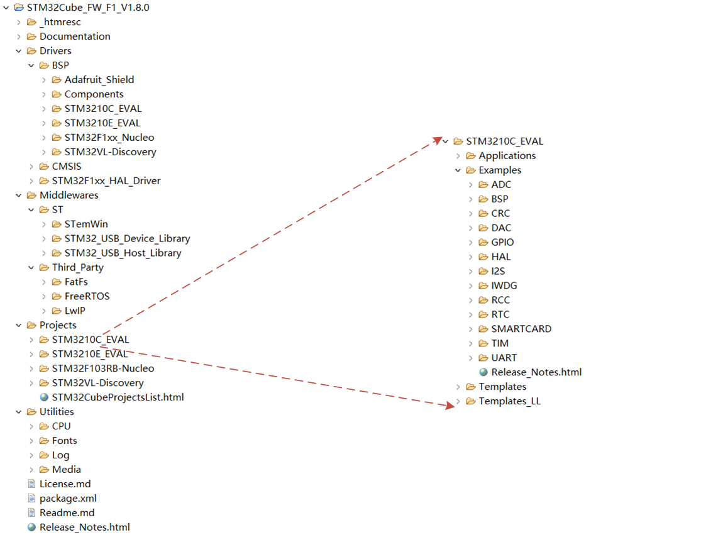


- “ Documentation”： 里面是固件包的详细说明文档；

- “ Drivers”：Drivers 文件夹包含 BSP， CMSIS 和 STM32F1xx_HAL_Driver 三个子文件夹。  

<table>
	<thead>
		<tr>
			<th style="width: 15%;">主文件夹</th>
			<th style="width: 20%;">子文件夹</th>
			<th style="width: 65%;">说明</th>
		</tr>
	</thead>
	<tbody>
		<tr>
			<td rowspan="3" class="main-folder">Drivers 文件夹</td>
			<td class="folder-name">BSP 文件夹</td>
			<td>也叫板级支持包，用于适配 ST 官方对应的开发板的硬件驱动程序，每一种开发板对应一个文件夹。例如触摸屏， LCD， SRAM 以及 EEPROM 等板载硬件资源等驱动。这些文件针只匹配特定 的开发板使用， 不同开发板可能不能直接使用。</td>
		</tr>
		<tr>
			<td class="folder-name">CMSIS 文件夹</td>
			<td>Cortex微控制器软件接口标准（ Cortex Microcontroller Software Interface Standard） ，包含STM32F1符合CMSIS标准的软件抽象层相关文件。文件夹内部文件比较多。主要包括 DSP 库(DSP_LIB 文件夹)， Cortex-M 内核及其设备文件 （Include 文件夹）， 微控制器专用头文件/启动代码/ 专用系统文件等(Device 文件夹)。</td>
		</tr>
		<tr>
			<td class="folder-name">STM32F1xx_HAL_Driver 文件夹</td>
			<td>这个文件夹非常重要，它包含了所有的 STM32F1xx 系列 HAL 库头文件和源文件，也就是所有底层硬件 抽象层 API 声明和定义。它的作用是屏蔽了复杂的硬件寄存器操作，统一了外设的接口函数。该文件夹包含 Src 和 Inc 两个子文件夹，其中 Src 子文件夹 存放的是.c 源文件， Inc 子文件夹存放的是与之对应 的.h 头文件。每个.c 源文件对应一个.h 头文件。比如gpio相关的 API 的声明和定义在文 件 stm32f1xx_hal_gpio.h 和 stm32f1xx_hal_gpio.c 中。</td>
		</tr>
	</tbody>
</table>

- “ Middlewares”：该文件夹下面有 ST 和 Third_Party 两个子文件夹。  ST 文件夹下面存放的是 STM32 相关的一些文件，包括 STemWin 和 USB 库等。Third_Party 文件夹是第三方中间件，这些中间件都是非常成熟的开源解决方案。 

<table>
	<thead>
		<tr>
			<th style="width: 15%;">主文件夹</th>
			<th style="width: 15%;">一级子文件夹</th>
			<th style="width: 20%;">二级子文件夹</th>
			<th style="width: 50%;">说明</th>
		</tr>
	</thead>
	<tbody>
		<tr>
			<td rowspan="8" class="main-folder">Middlewares 文件夹</td>
			<td rowspan="4" class="sub-folder">ST 子文件夹</td>
			<td colspan="2">ST 文件夹下面存放的是 STM32 相关的一些文件，包括 STemWin 和 USB 库等。</td>
		</tr>
		<tr>
			<td>STemWin 文件夹</td>
			<td>ST提供的图形GUI库" STemWin" 。</td>
		</tr>
		<tr>
			<td>STM32_USB_Device_Library 文件夹</td>
			<td>USB 从机设备支持包。</td>
		</tr>
		<tr>
			<td>STM32_USB_Host_Library 文件夹</td>
			<td>USB 主机设备支持包。</td>
		</tr>
		<tr>
			<td rowspan="4" class="sub-folder">Third_Party 子文件夹</td>
			<td colspan="2">Third_Party 文件夹是第三方中间件，这些中间价都是非常成熟的开源解决方案。</td>
		</tr>
		<tr>
			<td>FatFs 文件夹</td>
			<td>FAT 文件系统支持包。采用的 FATFS 文件系统。</td>
		</tr>
		<tr>
			<td>FreeRTOS 文件夹</td>
			<td>FreeRTOS 实时系统支持包。</td>
		</tr>
		<tr>
			<td>LwIP 文件夹</td>
			<td>LwIP 网络通信协议支持包。</td>
		</tr>
	</tbody>
</table>

- “ Projects”： 以ST官方公板为载体，提供的外设应用示例，比如GPIO、 UART、 ADC、 RTC等。这些实例工程是可以直接编译的，每个文件夹对应一个 ST 官方的 Demo板。每个工程下面都有一个 MDK-ARM子文件夹，该子文件夹内部会有名称为 Project.uvprojx 的工程文件，我们只需要点击它就可以
  在 MDK 中打开工程。  例如，下图就是Project目录下的一个UART的串口例程，我们双击下边的Project.uvprojx文件就可以打开这个工程。

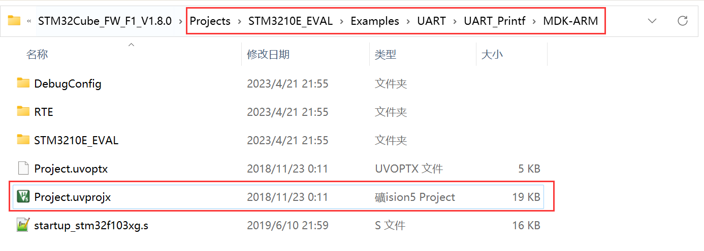

-  “ Utilities”：一些字体、日志、多媒体等杂项示例，日常使用的并不多。
-  其它几个文件  

文件夹中还有几个单独的文件， 用于声明软件版本或者版权信息， 我们使用 ST 的芯片已经默认得到这个软件的版权使用授权，可以简单了解一下各文件的内容，实际项目中我们一般不添加。

License.md：用于声明软件版权信息的文件。

package.xml： 描述固件包版本信息的文件。

Release_Notes.html：超文本文件，用浏览器打开可知它是对固件包的补充描述和固件版本更新的记录说明。  

#### 2.2 CMSIS 文件夹关键文件  

##### 2.2.1 Drivers/CMSIS

我们来分析一下 CMSIS 文件夹：由命名可知， 该文件夹和前面提到的 CMSIS 标准是一致的， CMSIS 为软件包的内容制定了标准， 包括文件目录的命名和内容构成， 5.7.0 版本CMSIS 规定软件包目录如表：

<table>
  <thead>
    <tr>
      <th colspan="2">文件/目录</th>
      <th>描述</th>
    </tr>
  </thead>
  <tbody>
    <tr>
      <td colspan="2">LICENSE.txt</td>
      <td>Apache 2.0 授权的许可文件</td>
    </tr>
    <tr>
      <td colspan="2">Device</td>
      <td>基于 Arm Cortex-M 处理器设备的 CMSIS 参考实现</td>
    </tr>
    <tr>
      <td colspan="2">ARM.CMSIS.pdsc</td>
      <td>描述该 CMSIS 包的文件</td>
    </tr>
    <tr>
      <td rowspan="16">CMSIS 组件</td>
      <td>Documentation</td>
      <td>
        这个数据包的描述文档
      </td>
    </tr>
    <tr>
      <td>Core</td>
      <td>
        CMSIS-Core（Cortex-M）相关文件的用户代码模板，在 ARM.CMSIS.pdsc 中引用
      </td>
    </tr>
    <tr>
      <td>Core_A</td>
      <td>CMSIS-Core（Cortex-A）相关文件的用户代码模板，在 ARM.CMSIS.pdsc 中引用</td>
    </tr>
    <tr>
      <td>DAP</td>
      <td>CMSIS-DAP 调试访问端口源代码和参考实现</td>
    </tr>
    <tr>
      <td>Driver</td>
      <td>CMSIS 驱动程序外设接口 API 的头文件</td>
    </tr>
    <tr>
      <td>DSP_Lib</td>
      <td>CMSIS-DSP 软件库源代码</td>
    </tr>
    <tr>
      <td>NN</td>
      <td>CMSIS-NN 软件库源代码</td>
    </tr>
    <tr>
      <td>Include</td>
      <td>CMSIS-Core(Cortex-M)和 CMSIS-DSP 需要包括的头文件等。</td>
    </tr>
    <tr>
      <td>Lib</td>
      <td>包括 CMSIS 核心（Cortex-M）和 CMSIS-DSP 的文件</td>
    </tr>
    <tr>
      <td>Pack</td>
      <td>CMSIS-Pack 示例， 包含包含设备支持、板支持和软件组件的软件包示例。</td>
    </tr>
    <tr>
      <td>RTOS</td>
      <td>CMSIS-RTOS 版本 1 以及 RTX4 参考实现</td>
    </tr>
    <tr>
      <td>RTOS2</td>
      <td>CMSIS-RTOS 版本 2 以及 RTX5 参考实现</td>
    </tr>
    <tr>
      <td>SVD</td>
      <td>
        CMSIS-SVD 样例，规定开发者、制造商、工具制造商的分工和职能
      </td>
    </tr>
    <tr>
      <td>Utilities</td>
      <td>
        PACK.xsd(CMSIS-Pack 架构文件),PackChk.exe(检查软件包的工具),CMSIS-SVD.xsd(MSIS-SVD 架构文件),SVDConv.exe(SVD 文件的转换工具)
      </td>
    </tr>
  </tbody>
</table>
知道了 CMSIS 规定的组件及其文件目录的大概内容后，我们再来看看 ST 提供的 CMSIS文件夹，如上节提到的， 它的位置是“ STM32Cube_FW_F1_V1.8.0/Drivers/CMSIS”。打开文件夹内容如下图所示， 可以发现它的目录结构完全按照 CMSIS 标准执行， 仅仅是作了部分删减。  

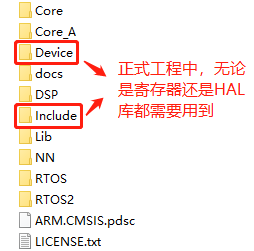

CMSIS 文件夹中的 Device 和 Include 这两个文件夹中的文件是我们工程中最常用到的。

##### 2.2.2 Drivers/CMSIS/Device

| 文件                                                         | 描述                                                         |
| ------------------------------------------------------------ | ------------------------------------------------------------ |
| stm32f1xx.h<br>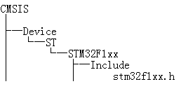 | 包含了很多条件定义和常用的枚举变量类型，与宏定义配合， 选择性包含某一特定的 STM32F1 系列芯片的头文件。这个文 件使我们在使用 STM32F1 系列的不同型号芯片时， 不需要每 次都修改工程头文件，只需要修改宏定义并增加特定型号芯 片的头文件即可快速选择使用不同类型的 F1 芯片。 |
| stm32f103xg.h<br>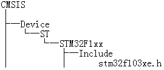 | STM32F1 大容量系列芯片通用的片上外设访问层头文件。 In clude 目录下有多个这样具体到型号的名字类似的头文件， 我 们具体使用哪个文件时需要根据实际使用的型号来确定。 这 个文件的主要作用是定义声明寄存器以及封装内存操作，以 结构体和宏定义标识符的形式。 |
| startup_stm32f103xe.s<br>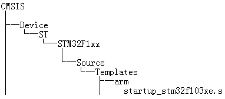 | STM32F103 系列芯片的启动文件，每个系列都有与之对应的 启动文件。启动文件的作用主要是进行堆栈的初始化，中断向 量表以及中断函数定义等。启动文件有一个很重要的作用就 是系统复位后引导进入 main 函数。后面会细讲。 |
| system_stm32f1xx.h system_stm32f1xx.c<br>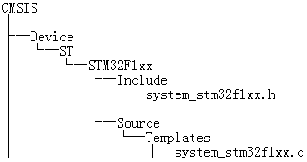 | 主要是声明和定义系统初始化函数 SystemInit 以及系统时钟 更新函数 SystemCoreClockUpdate。 SystemInit 函数的作用是 进行时钟系统的一些初始化操作以及中断向量表偏移地址设 置，但它并没有设置具体的时钟值，这是与标准库的最大区 别，在使用标准库的时候， SystemInit 函数会帮我们配置好系 统 时 钟 配 置 相 关 的 各 个 寄 存 器 。 在 启 动 文 件 startup_stm32103xe.s 中会设置系统复位后，直接调用 System Init 函数进行系统初始化。 SystemCoreClockUpdate 函数是在 系 统 时 钟 配 置 进 行 修 改 后 ， 调 用 这 个 函 数 来 更 新 SystemCoreClock 的值，变量 SystemCoreClock 是一个全局变 量，开放这个变量可以方便我们在用户代码中直接使用这个 变量来进行一些时钟运算。 |

##### 2.2.3 Drivers/CMSIS/Include

Include 文件夹存放了符合 CMSIS 标准的 Cortex-M 内核头文件。 对于 STM32F1 的工程，我们只要把我们需要的添加到工程即可，需要的头文件有： cmsis_armcc.h、 cmsis_armclang.h、 cmsis_compiler.h、 cmsis_version.h、core_cm3.h 和 mpu_armv7.h。这几个头文件，对比起来，我们会比较多接触的是 core_cm3.h。core_cm3.h 是内核底层的文件，由 ARM 公司提供，包含一些 AMR 内核指令， 如软件复位， 开关中断等功能。今后在需要的例程再去讲解其程序，现在要提到的是它包含了一个重要的头文件 stdint.h。  

stdint.h 是从 c99 中引进的一个标准 C 库的文件。在 2000 年 3 月， ANSI 采纳了 C99 标准。 ANSI C 被几乎所有广泛使用的编译器（如： MDK、 IAR） 支持。多数 C 代码是在 ANSI C基础上写的。任何仅使用标准 C 并且不和硬件相关的代码， 在任意平台上用遵循 ANSI C 标准的编译器下能编译成功。 就是说这套标准不依赖硬件，独立于任何硬件，可以跨平台。stdint.h 可以在 MDK 安装目录下找到，如 MDK5 安装在 C 盘时，可以在路径：C:\Keil_v5\ARM\ARMCC\include 找到。 stdint.h 的作用就是提供了类型定义，其部分类型定义代码如下：    

```c
/* exact-width signed integer types */
typedef signed char int8_t;
typedef signed short int int16_t;
typedef signed int int32_t;
typedef signed __INT64 int64_t;
/* exact-width unsigned integer types */
typedef unsigned char uint8_t;
typedef unsigned short int uint16_t;
typedef unsigned int uint32_t;
typedef unsigned __INT64 uint64_t;
```

## 二、框架结构  

### 1. HAL 库文件夹结构  

HAL 库头文件和源文件在 STM32Cube 固件包的 STM32F1xx_HAL_Driver 文件夹中，打开该文件夹，如图  

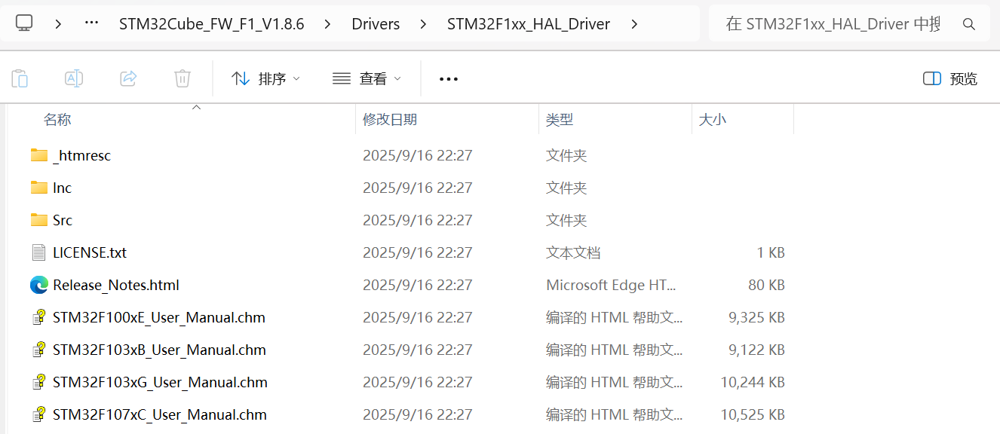

STM32F1xx_HAL_Driver 文件夹下的 Src（Source 的简写）文件夹存放是所有外设的驱动程序源码， Inc（Include 的简写）文件夹存放的是对应源码的头文件。 Release_Notes.html 是HAL 库的版本更新信息。最后三个是库的用户手册， 方便我们查阅对应库函数的使用。

打开 Src 和 Inc 文件夹，会发现基本都是 stm32f1xx\_hal\_和 stm32f1xx\_ll\_开头的.c 和.h 文件。这里的stm32f1xx_ll_开头的文件是 LL 库。  

### 2. HAL 库文件介绍  

#### 2.1 重要文件

| 文件                                              | 描述                                                         |
| ------------------------------------------------- | ------------------------------------------------------------ |
| sm32f1xx_hal.c<br>stm32f1xx_hal.h                 | 初始化 HAL 库，（比如 HAL_Init,HAL_DeInit,HAL_Delay 等），主要实现 HLA 库的初始化、系统滴答， HAL 库延 时函数、 IO 重映射和 DBGMCU 功能。 |
| stm32f1xx_hal_conf.h                              | HAL 库中本身没有这个文 件， 可以自行定义，也可以直 接使用《Inc》 文件夹下 stm32f1xx_hal_conf_template.h 的内容作为参考模版。<br><br>HAL 的用户配置文件， stm32f1xx_hal.h 引用了这个文 件，用来对 HAL 库进行裁剪。由于 Hal 库的很多配置都 是通过预编译的条件宏来决定是否使用这一 HAL 库的功能， 这也是当前的主流库如 LWIP/FreeRTOS 等的做法， 无需修改库函数的源码，通过使能/不使能一些宏来实现 库函数的裁剪。 |
| stm32f1xx_hal_def.h                               | 通用 HAL 库资源定义，包含 HAL 的通用数据类型定义， 声明、枚举，结构体和宏定义。如 HAL 函数操作结果返 回值类型 HAL_StatusTypeDef 就是在这个文件中定义的。 |
| stm32f1xx_hal_cortex.h<br/>stm32f1xx_hal_cortex.c | 它是一些 Cortex 内核通用函数声明和定义，例如中断优先 级 NVIC 配置， MPU，系统软复位以及 Systick 配置等， 与前面 core_cm3.h 的功能类似。 |
| stm32f1xx_hal_ppp.c<br/>stm32f1xx_hal_ppp.h       | 外设驱动函数。对于所有的 STM32 该驱动名称都相同， ppp 代表一类外设， 包含该外设的操作 API 函数。例如： 当 ppp 为 adc 时，这个函数就是 stm32f1xx_hal_adc.c/h， 可以分别在 Src/Inc 目录下找到。 |
| stm32f1xx_hal_ppp_ex.c<br/>stm32f1xx_hal_ppp_ex.h | 外设特殊功能的 API 文件， 作为标准外设驱动的功能补充 和扩展。针对部分型号才有的特殊外设作功能扩展，或外 设的实现功能与标准方式完全不同的情况下作重新初始化 的备用接口。 ppp 的含义同标准外设驱动 |
| stm32f1xx_II_ppp.c<br/>stm32f1xx_II_ppp..h        | LL 库文件，在一些复杂外设中实现底层功能，在部分 stm32f1xx_hal_ppp.c 中被调用 |

#### 2.2 函数与变量命名规则

不止文件命名有一定规则， stm32f1xx_hal_ppp (c/h)中的函数和变量命名也严格按照命名规则， 如下表所示的命名规则在大部分情况下都是正确的：

| 文件名            | stm32f1xx_hal_ppp (c/h)                      | stm32f1xx_hal_ppp_ex (c/h)                        |
| ----------------- | -------------------------------------------- | ------------------------------------------------- |
| 函数名            | HAL_PPP_Function HAL_PPP_FeatureFuntion_MODE | HAL_PPPEx_Function HAL_PPPEx_FeatureFunction_MODE |
| 外设句柄          | PPP_HandleTypedef                            | 无                                                |
| 初始化参数结构 体 | PPP_InitTypeDef                              | PPP_InitTypeDef                                   |
| 枚举类型          | HAL_PPP_StructnameTypeDef                    | 无                                                |

对于 HAL 的 API 函数， 常见的有以下几种：

（1）初始化/反初始化函数:HAL_PPP_Init(), HAL_PPP_DeInit()

（2）外设读写函数:HAL_PPP_Read(),HAL_PPP_Write(),HAL_PPP_Transmit(),HAL_PPP_Receive()

（3）控制函数:HAL_PPP_Set (),HAL_PPP_Get ().

（4）状态和错误:HAL_PPP_GetState (), HAL_PPP_GetError ().  

#### 2.3 函数参数规则

HAL 库封装的很多函数都是通过定义好的结构体将参数一次性传给所需函数， 参数也有一定的规律，主要有以下三种：

- 配置和初始化用的结构体:

一般为 PPP_InitTypeDef 或 PPP_ConfTypeDef 的结构体类型，根据外设的寄存器设计成易于理解和记忆的结构体成员。

- 特殊处理的结构体

专为不同外设而设置的， 带有“Process”的字样， 实现一些特异化的中间处理操作等。

- 外设句柄结构体

HAL 驱动的重要参数， 可以同时定义多个句柄结构以支持多外设多模式。 HAL 驱动的操作结果也可以通过这个句柄获得。 有些 HAL 驱动的头文件中还定义了一些跟这个句柄相关的一些外设操作。如用外设结构体句柄与 HAL 定义的一些宏操作配合，即可实现一些常用的寄存器位操作。 比较常见的 HAL 库寄存器操作如表 7.3.2.3 所示:  

| 宏定义结构                                            | 用途               |
| ----------------------------------------------------- | ------------------ |
| `__HAL_PPP_ENABLE_IT(__HANDLE__, __INTERRUPT__)`        | 使能外设中断       |
| `__HAL_PPP_DISABLE_IT(__HANDLE__,__INTERRUPT__)`       | 禁用外设中断       |
| `__HAL_PPP_GET_IT (__HANDLE__, __ INTERRUPT __)`        | 获取外设某一中断源 |
| `__HAL_PPP_CLEAR_IT (__HANDLE__, __ INTERRUPT __)`      | 清除外设中断       |
| `__HAL_PPP_GET_FLAG (__HANDLE__, __FLAG__)`             | 获取外设的状态标记 |
| `__HAL_PPP_CLEAR_FLAG (__HANDLE__, __FLAG__)`           | 清除外设的状态标记 |
| `__HAL_PPP_ENABLE(__HANDLE__)`                          | 使能某一外设       |
| `__HAL_PPP_DISABLE(__HANDLE__)`                         | 禁用某一外设       |
| `__HAL_PPP_XXXX (__HANDLE__, __PARAM__)`                | 针对外设的特殊操作 |
| `__HAL_PPP_GET_ IT_SOURCE (__HANDLE__, __INTERRUPT __)` | 检查外设的中断源   |

但对于 SYSTICK/NVIC/RCC/FLASH/GPIO 这些内核外设或共享资源，不使用PPP_HandleTypedef 这类外设句柄进行控制，如HAL_GPIO_Init() 只需要初始化的 GPIO 编号和具体的初始化参数。
```c
HAL_StatusTypeDef HAL_GPIO_Init(GPIO_TypeDef* GPIOx, GPIO_InitTypeDef *Init)
{
    /*GPIO 初始化程序……*/
}
```

#### 2.4 回调函数

再来看一下HAL 库的回调函数，这部分允许用户重定义， 并在其中实现用户自定义的功能， 也是我们使用 HAL 库的最常用的接口之一：

| 回调函数                    | 举例                                                         |
| --------------------------- | ------------------------------------------------------------ |
| HAL_PPP_MspInit()/_DeInit() | 举例: HAL_USART_MspInit() 由 HAL_PPP_Init()这个 API 调用， 主要在这个 函数中实现外设对应的 GPIO、 时钟、 DMA， 和中断开启的配置和操作。 |
| HAL_PPP_ProcessCpltCallback | 举例: HAL_USART_TxCpltCallback 由外设中断 或 DMA 中断调用， 调用时 API 内部已经实现 中断标记的清除的操作，用户只需要专注于自 己的软件功能实现即可。 |
| HAL_PPP_ErroCallback        | 举例: HAL_USART_ErrorCallback 外设或 DMA 中断中发生的错误，用于作错误处理。 |

## 三、参考文档

ST 官方给我们提供了快速查找 API 函数的帮助文档。 我们如果解压了 stm32cubef1 的固件包后， 在路径“STM32Cube_FW_F1_V1.8.6\Drivers\STM32F1xx_HAL_Driver”下可以找到几个chm 格式的文档，根据我们开发板主控芯片 STMF103ZE 我们没有找到直接可用的， 但可以查看型号接近的： STM32F103xG_User_Manual.chm(因为 G 系列比 E 系列引脚功能更多， 只是查看 API 函数不响应使用的)。双击打开后，可以看到左边目录下有四个主题，我们来查看 Modules。

以外设 GPIO 为例，讲一下怎么使用这个文档。点击 GPIO 外设的主题下的 IO operation functions / functions 看看里面的 API 函数接口描述： 

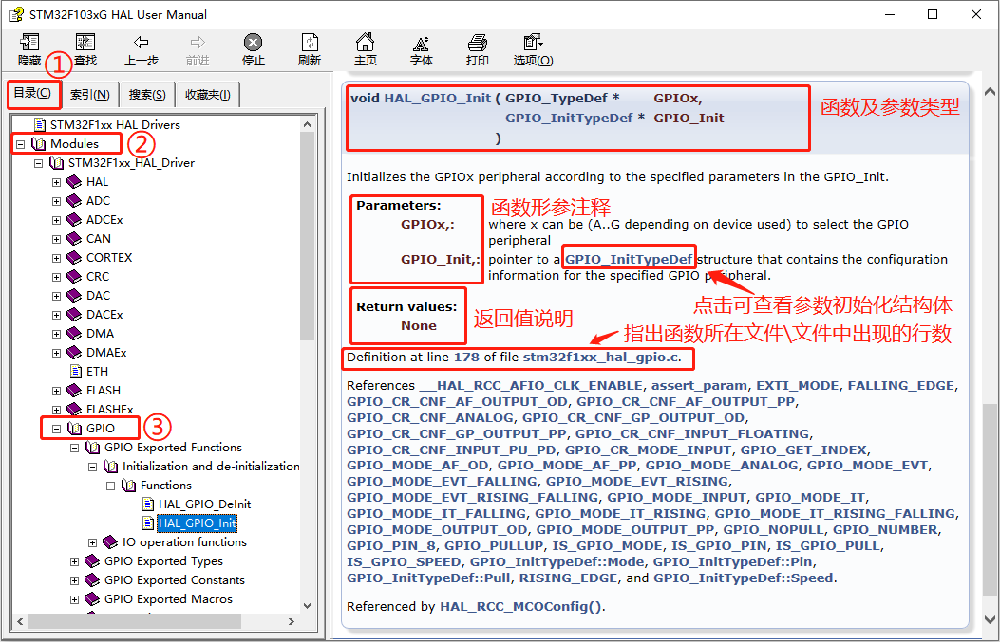

个文档提供的信息很全，不看源码都可以直接使用它来编写代码，还给我们指示源码位置，非常方便。  

## 四、使用HAL库

我们需要按照芯片使用手册建议的步骤去配置芯片。 HAL 库驱动提供了芯片的驱动接口，但我们需要强调一个概念是使用 HAL 库的开发是对芯片功能的开发， 而不是开发这个库，也不是有这个库能就直接开发。如果我们对芯片的功能不作了解的话， 仍然不知道按照怎样的步骤和寻找哪些可用的接口去实现想要实现的功能。 ST 提供芯片使用手册《STM32F1xx 参考手册.pdf》告诉我们使用某一外设功能时如何具体地去操作每一个用到的寄存器的细节。

嵌入式的软件开发流程总遵循以下步骤： 组织工具链、编写代码、生成可执行文件、烧录到芯片、芯片根据内部指令执行我们编程生成的可执行代码。  

### 1. 应用程序文件结构  

下面是一个根据我们后续要学习的工程梳理出来的基于 CMSIS 的一个 HAL 库应用程序文件结构 ：

<table>
  <tbody>
  <tr>
    <th>类别</th>
    <th>文件名</th>
    <th>描述</th>
    <th>是否必须</th>
  </tr>
  <tr>
    <td rowspan="6">用户程序文件</td>
    <td>main.c</td>
    <td>存放 main 函数，不一定要在这个文件</td>
    <td>否</td>
  </tr>
  <tr>
    <td>main.h</td>
    <td>包含头文件、声明等作用，已删除</td>
    <td>否</td>
  </tr>
  <tr>
    <td>stm32f1xx_it.c</td>
    <td rowspan="2">用户中断服务函数存放文件，不一定放到这个文件，可删除</td>
    <td>否</td>
  </tr>
  <tr>
    <td>stm32f1xx_it.h</td>
    <td>否</td>
  </tr>
  <tr>
    <td>stm32f1xx_hal_conf.h</td>
    <td>用户配置文件</td>
    <td>是</td>
  </tr>
  <tr>
    <td>stm32f1xx_hal_msp.c</td>
    <td>回调函数存放文件，已删除</td>
    <td>否</td>
  </tr>
  <tr>
    <td rowspan="9">设备驱动层</td>
    <td>sm32f1xx_hal.c</td>
    <td rowspan="2">HAL 库的初始化、系统滴答，HAL 库延时函数等功能</td>
    <td>是</td>
  </tr>
  <tr>
    <td>stm32f1xx_hal.h</td>
    <td>是</td>
  </tr>
  <tr>
    <td>stm32hxx_hal_def.h</td>
    <td>通用 HAL 库资源定义</td>
    <td>是</td>
  </tr>
  <tr>
    <td>stm32f1xx_hal_ppp.c</td>
    <td rowspan="2">外设的操作 API 函数文件</td>
    <td>是</td>
  </tr>
  <tr>
    <td>stm32f1xx_hal_ppp.h</td>
    <td>是</td>
  </tr>
  <tr>
    <td>stm32f1xx_hal_ppp_ex.c</td>
    <td rowspan="2">拓展外设特性的 API 函数文件</td>
    <td>是</td>
  </tr>
  <tr>
    <td>stm32f1xx_hal_ppp_ex.h</td>
    <td>是</td>
  </tr>
  <tr>
    <td>stm32f1xx_II_ppp.c</td>
    <td rowspan="2">LL 库文件，在一些复杂外设中实现底层功能</td>
    <td>是</td>
  </tr>
  <tr>
    <td>stm32f1xx_II_ppp.h</td>
    <td>是</td>
  </tr>
  <tr>
    <td rowspan="11">CMSIS 核心层</td>
    <td>stm32f1xx.h</td>
    <td>STM32F1 系列的顶层头文件</td>
    <td>是</td>
  </tr>
  <tr>
    <td>stm32f103xe.h</td>
    <td>STM32F103E 系列片上外设头文件</td>
    <td>是</td>
  </tr>
  <tr>
    <td>system_stm32f1xx.c</td>
    <td rowspan="2">主要存放系统初始化函数 SystemInit</td>
    <td>是</td>
  </tr>
  <tr>
    <td>system_stm32f1xx.h</td>
    <td>是</td>
  </tr>
  <tr>
    <td>startup_stm32f1xx.s</td>
    <td>启动文件，运行到 main 函数前的准备</td>
    <td>是</td>
  </tr>
  <tr>
    <td>core_cm3.h</td>
    <td>内核寄存器定义，如 Systick、 SCB 等</td>
    <td>是</td>
  </tr>
  <tr>
    <td>cmsis_armcc.h</td>
    <td rowspan="5">内核头文件，一般都不需要去了解</td>
    <td rowspan="5">是</td>
  </tr>
  <tr>
    <td>cmsis_armclang.h</td>
  </tr>
  <tr>
    <td>cmsis_compiler.h</td>
  </tr>
  <tr>
    <td>cmsis_version.h</td>
  </tr>
  <tr>
    <td>mpu_armv7.h</td>
  </tr>
  </tbody>
</table>

#### 1.1 stm32f1xx_hal_conf.h  

stm32f1xx_hal_conf.h 用于裁剪 HAL 库和定义一些变量，官方没有直接提供这个文件， 但在 下面找个路径提供了一个模版文件 《 stm32f1xx_hal_conf_template.h 》

```txt
STM32Cube_FW_F1_V1.8.6\Drivers\STM32F1xx_HAL_Driver\Inc
```

我们可以直接复制这个文件重命名为stm32f1xx_hal_conf.h， 做一些简单的修改即可， 也可以从在官方的例程中直接复制过来。 我们开发板使用的芯片是 STM32F103 的 E 系列，所以也可以从下面的路径获取这个配置文件：

```txt  
STM32Cube_FW_F1_V1.8.6\Projects\STM3210E_EVAL\Templates\Inc
```

##### 1.1.1 配置外部高速晶振的频率

HSE_VALUE 这个参数表示我们的外部高速晶振的频率。这个参数请务必根据板子外部焊接的晶振频率来修改，官方默认是 25M。正点原子 STM32F103 开发板外部高速晶振的频率是 8MHZ。 我们没有在代码的其它地方定义过 HSE_VALUE 这个值，所以编译器最终会引用这里的值 8MHz 作为外部调整晶振的频率值。  

注意： 使用官方的开发板需要定义 USE_STM3210C_EVAL 这个宏， 我们没有在代码的其它位置中或者编译器的预编译选项中定义过这个宏。  

```c
#if !defined (HSE_VALUE)
#if defined(USE_STM3210C_EVAL)
#define HSE_VALUE 25000000U /*!< Value of the External oscillator in Hz */
#else
#define HSE_VALUE 8000000U /*!< Value of the External oscillator in Hz */
#endif
#endif /* HSE_VALUE */还可以把上面的代码直接精简为一行， 效果是一样的：  
```

##### 1.1.2 外部低速晶振频率

还有一个参数就是外部低速晶振频率， 这个用于 RTC 时钟，这个官方默认是 32.768KHZ，我们开发板的低速晶振也是这个频率，所以不用修改。  

```c
#if !defined (LSE_VALUE)
#define LSE_VALUE ((uint32_t)32768) /* 外部低速振荡器的值，单位 HZ */
#endif /* LSE_VALUE */
```

##### 1.1.3 外设使能

用户配置文件可以用来选择使能何种外设  

```c
/* ########################## Module Selection ############################# */
/**
* @brief This is the list of modules to be used in the HAL driver
*/
#define HAL_MODULE_ENABLED
#define HAL_ADC_MODULE_ENABLED
#define HAL_CEC_MODULE_ENABLED
#define HAL_COMP_MODULE_ENABLED
#define HAL_CORTEX_MODULE_ENABLED
//...中间省略...
#define HAL_USART_MODULE_ENABLED
#define HAL_WWDG_MODULE_ENABLED
#define HAL_MMC_MODULE_ENABLED
```

比如不使用 GPIO 的功能，就可以把这个宏注释掉，具体如下。  

```c
/* #define HAL_GPIO_MODULE_ENABLED */
```

结合同样在《stm32f1xx_hal_conf.h》 中的头文件引入部分代码：  

```c
#ifdef HAL_GPIO_MODULE_ENABLED
#include "stm32f1xx_hal_gpio.h"
#endif /* HAL_GPIO_MODULE_ENABLED */
```

这是一个条件编译符，与#endif 配合使用。这里的要表达的意思是，只要工程中定义了HAL_GPIO_MODULE_ENABLED 这个宏， 就会包含 stm32f1xx_hal_gpio.h 这个头文件到我们的工程， 同时 stm32f1xx_hal_gpio.c 中的#ifdef 到#endif 之间的程序就会参与编译，否则不编译。所以只要我们屏蔽了 stm32f1xx_hal_conf.h 文件中的HAL_GPIO_MODULE_ENABLED宏， GPIO的驱动代码就不被编译。也就起到选择使能何种外设的功能，其他外设同理。使用时定义，否则不定义。 这样就可以在不修改源码的前提下方便地裁剪 HAL 库代码的体积了。  

这里需要注意第一个宏定义：  

```c
#define HAL_MODULE_ENABLED
```

它决定了《stm32f1xx_hal.c》 中与HAL相关的一些代码是否能使用， 也是根据条件编译来实现的。 其中包含 HAL_Init()、HAL_Delay()、 HAL_GetTick()这些其它驱动函数可能需要引用的函数， 所以这个宏也是必须要定义的。

官方的示范例程，就是通过屏蔽外设的宏的方法来选择使能何种外设。表现上就是编译时间会变短，因为屏蔽了不使用的 HAL 库驱动，编译时间自然就短了。我们也可以选择另外一种方法，就是工程中只保留需要的 stm32f1xx_hal_ppp.c，不需要的不添加到工程里，由于找不到源文件且没有引用这些文件，同样编译器不会去编译这些代码。

##### 1.1.4 滴答定时器的优先级

```c
#define TICK_INT_PRIORITY ((uint32_t)0x0F) /*!< tick interrupt priority */
```

宏定义 TICK_INT_PRIORITY 是滴答定时器的优先级。这个优先级很重要，因为如果其它的外设驱动程序的延时是通过滴答定时器提供的时间基准，实现延时的话，又由于实现方式是滴答定时器对寄存器进行计数，所以当我们在其它中断服务程序里调用基于此时间基准的延
迟函数 HAL_Delay，那么假如该中断的优先级高于滴答定时器的优先级，就会导致滴答定时器中断服务函数一直得不到运行，程序便会卡死在这里，所以滴答定时器的中断优先级一定要比这些中断高。

请注意这个时间基准可以是滴答定时器提供，也可以是其他的定时器，默认是用滴答定时器。  

##### 1.1.5 断言  

断言这个功能我们在使程中不使用。断言这个功能用来判断 HAL 函数的形参是否有效，并在参数错误时启用这个断言功能， 告诉开发者代码错误的位置，断言功能由用户自己决定。这个功能的使能开关代码是一个宏，默认是关闭的 ：

```c
/* #define USE_FULL_ASSERT 1 */
```

通过宏 USE_FULL_ASSERT 来选择功能:

```c
#ifdef USE_FULL_ASSERT
/**
* @brief The assert_param macro is used for function's parameters check.
* @param expr If expr is false, it calls assert_failed function
* which reports the name of the source file and the source
* line number of the call that failed.
* If expr is true, it returns no value.
* @retval None
*/
#define assert_param(expr) ((expr)? (void)0U : \
assert_failed((uint8_t *)__FILE__, __LINE__))
/* Exported functions --------------------------------------------------- */
void assert_failed(uint8_t* file, uint32_t line);
#else
#define assert_param(expr) ((void)0U)
#endif /* USE_FULL_ASSERT */
```

也是通过条件编译符来选择对应的功能。当用户自己需要使用断言功能，怎么做呢？首先需要定义宏 USE_FULL_ASSERT 来使能断言功能，即把源码的对应地方的注释去掉即可。然后看到源码中 assert_failed()这个函数。根据这个宏定义，我们还需要去定义这个函数的功
能， 可以按以下格式自定义这个函数， 出错后使代码停留在这里：  

```c
#ifdef USE_FULL_ASSERT
/**
 * @brief 当编译提示出错的时候此函数用来报告错误的文件和所在行
 * @param file：指向源文件
 * line：指向在文件中的行数
 * @retval 无
 */
void assert_failed(uint8_t* file, uint32_t line)
{
  while (1)
  { 
  }
}
#endif
```

可以看到这个函数里面没有实现如何功能，就是一个什么不做的死循环，具体功能请根据自己的需求去实现。 file 是指向源文件的指针， line 是指向源文件的行数。 `__FILE__`是表示源文件名， `__LINE__`是表示在源文件中的行数。比如我们可以实现打印出这个错误的两个信息等等， 但前提是已经学会了如何使芯片输出打印信息这些功能。  

总的来说断言功能就是，在 HAL 库中，如果定义了 USE_FULL_ASSERT 这个宏，那么所有的 HAL 库函数将会检查函数的形参是否正确。如果错误将会调用 assert_failed()这个函数，程序就会停留在这里，用户可以定位到出错的函数。 这个功能实际上是在芯片上运行的时候的增加错误提示信息的功能， 属于调试功能的一部分， 实际我们的编译器就可以帮助定位到参数错误的问题并提示信息。

#### 1.2 [stm32f1xx_hal.c](https://github.com/STMicroelectronics/stm32f1xx-hal-driver/blob/master/Src/stm32f1xx_hal.c)

这个文件内容比较多，包括 HAL 库的初始化、系统滴答、基准电压配置、 IO 补偿、低功耗、 EXTI 配置等都集合在这个文件里面。  

##### 1.2.1 HAL_Init()函数  

简化函数如下：

```c
HAL_StatusTypeDef HAL_Init(void)
{
    /* 配置 Flash 的预取控制器 */
    #if (PREFETCH_ENABLE != 0)
    #if defined(STM32F101x6) || defined(STM32F101xB) || defined(STM32F101xE) || defined(STM32F101xG) || \ defined(STM32F102x6) || defined(STM32F102xB) || \
    defined(STM32F103x6) || defined(STM32F103xB) || defined(STM32F103xE) || defined(STM32F103xG) || \ defined(STM32F105xC) || defined(STM32F107xC)
    /* Prefetch buffer is not available on value line devices */
    __HAL_FLASH_PREFETCH_BUFFER_ENABLE();
    #endif
    #endif /* 使能 Flash 的预取控制器 */
    /* 配置中断优先级顺序 */
    HAL_NVIC_SetPriorityGrouping(NVIC_PRIORITYGROUP_4);
    /* 使用滴答定时器作为时钟基准，配置 1ms 滴答（重置后默认的时钟源为 HSI） */
    HAL_InitTick(TICK_INT_PRIORITY);
    /* 初始化其它底层硬件（如果必要） */
    HAL_MspInit();
    /* 返回函数状态 */
    return HAL_OK;
}
```

该函数是 HAL 库的初始化函数，原则上在程序中必须优先调用，其主要实现如下功能：  

（1）使能 Flash 的预取缓冲器（根据闪存编程手册，打开预取指令可以提高对 I-Code 总线  的访问效率，且 AHB 时钟的预分频系数不为1 时，必须打开预取缓冲器）

（2） 设置 NVIC 优先级分组为 4。

（3） 配置滴答定时器每 1ms 产生一个中断。在这个阶段，系统时钟还没有配置好，因此系统还是默认使用内部高速时钟源 HSI 在跑
程序。对于 F1 来说， HSI 的主频是 8MHZ。所以如果用户不配置系统时钟的话，那么系统将会使用 HSI 作为系统时钟源。

（4）调用 HAL_MspInit 函数初始化底层硬件， HAL_MspInit 函数在 STM32F1xx_hal.c 文件里面做了弱定义。关于弱定义这个概念，后面会有学习，现在不理解没关系。用户可以根据自己的需求选择是否重新定义该函数来初始化自己的硬件。

##### 1.2.2 HAL_DeInit ()函数  

```c
HAL_StatusTypeDef HAL_DeInit(void)
{
    /* 重置所有外设 */
    __HAL_RCC_APB1_FORCE_RESET();
    __HAL_RCC_APB1_RELEASE_RESET();
    __HAL_RCC_APB2_FORCE_RESET();
    __HAL_RCC_APB2_RELEASE_RESET();
    /* 对底层硬件初始化 */
    HAL_MspDeInit();
    /* 返回函数状态 */
    return HAL_OK;
}
```

该函数取消初始化 HAL 库的公共部分，并且停止 systick，是一个可选的函数。该函数做了一下的事：

（1）复位了 APB1、 APB2 的时钟。

（2）调用 HAL_MspDeInit 函数，对底层硬件初始化进行复位。 HAL_MspDeInit 也在STM32F1xx _hal.c 文件里面做了弱定义，并且与 HAL_MspInit 函数是一对存在。 HAL_MspInit函数负责对底层硬件初始化， HAL_MspDeInit 函数则是对底层硬件初始化进行复位。这两个函数都是需要用户根据自己的需求去实现功能，也可以不使用。  

##### 1.2.3 嘀嗒定时器相关函数

- HAL_InitTick ()函数  

```c
__weak HAL_StatusTypeDef HAL_InitTick(uint32_t TickPriority)
{
    /* 配置滴答定时器 1ms 产生一次中断 */
    if (HAL_SYSTICK_Config(SystemCoreClock /(1000UL / (uint32_t)uwTickFreq))> 0U) {
    	return HAL_ERROR;
    }
    /* 配置滴答定时器中断优先级 */
    if (TickPriority < (1UL << __NVIC_PRIO_BITS)) {
    	HAL_NVIC_SetPriority(SysTick_IRQn, TickPriority, 0U);
    	uwTickPrio = TickPriority;
    }
    else{
    	return HAL_ERROR;
    }
    /* 返回函数状态 */
    return HAL_OK;
}
```

该函数用于初始化滴答定时器的时钟基准，主要功能如下：

（1）配置滴答定时器 1ms 产生一次中断。

（2）配置滴答定时器的中断优先级。

（3）该函数是\_\_weak 修饰的函数，如果在关联工程中的其它地方没有定义\_\_weak 后面的函数， 这里是 HAL_InitTick()， 则使用此处的定义， 否则就使用其它地方定义好的函数功能。我们可以通过重定义这个函数来选择其它的时钟源（如定时器） 作为 HAL 库函数的时基或者通过重定义不开启 Systick 的功能和中断等。

该函数可以通过 HAL_Init()或者 HAL_RCC_ClockConfig()重置时钟。 在默认情况下， 滴答定时器是时间基准的来源。 如果其他中断服务函数调用了 HAL_Delay()，必须小心， 滴答定时器中断必须具有比调用了 HAL_Delay()函数的其他中断服务函数的优先级高(数值较低)，否则会导致滴答定时器中断服务函数一直得不到执行，从而卡死在这里。  

- HAL_IncTick()  函数

```c
/* 该函数在滴答定时器时钟中断服务函数中被调用，一般滴答定时器 1ms 中断一次，
所以函数每 1ms 让全局变量 uwTick 计数值加 1 */
__weak void HAL_IncTick(void)
{
	uwTick += (uint32_t)uwTickFreq;
}
```

- 其他相关函数

```c
/* 获取全局变量 uwTick 当前计算值 */
__weak uint32_t HAL_GetTick(void)
{
	return uwTick;
}
/* 获取滴答时钟优先级 */
uint32_t HAL_GetTickPrio(void)
{
	return uwTickPrio;
}
/* 设置滴答定时器中断频率 */
HAL_StatusTypeDef HAL_SetTickFreq(HAL_TickFreqTypeDef Freq)
{
    HAL_StatusTypeDef status = HAL_OK;
    HAL_TickFreqTypeDef prevTickFreq;
    assert_param(IS_TICKFREQ(Freq));
    if (uwTickFreq != Freq)
    {
        /* 备份滴答定时器中断频率 */
        prevTickFreq = uwTickFreq;
        /* 更新被 HAL_InitTick()调用的全局变量 uwTickFreq */
        uwTickFreq = Freq;
        /* 应用新的滴答定时器中断频率 */
        status = HAL_InitTick(uwTickPrio);
        if (status != HAL_OK)
        {
            /* 恢复之前的滴答定时器中断频率 */
            uwTickFreq = prevTickFreq;
        }
    }
    return status;
}
/* 获取滴答定时器中断频率 */
HAL_TickFreqTypeDef HAL_GetTickFreq(void)
{
	return uwTickFreq;
}
/*HAL 库的延时函数，默认延时单位 ms */
__weak void HAL_Delay(uint32_t Delay)
{
    uint32_t tickstart = HAL_GetTick();
    uint32_t wait = Delay;
    /* Add a freq to guarantee minimum wait */
    if (wait < HAL_MAX_DELAY)
    {
    	wait += (uint32_t)(uwTickFreq);
    }
    while ((HAL_GetTick() - tickstart) < wait)
    { 
    }
}
/* 挂起滴答定时器中断，全局变量 uwTick 计数停止 */
__weak void HAL_SuspendTick(void)
{
    /* 禁止滴答定时器中断 */
    CLEAR_BIT(SysTick->CTRL, SysTick_CTRL_TICKINT_Msk);
}

/* 恢复滴答定时器中断，恢复全局变量 uwTick 计数 */
__weak void HAL_ResumeTick(void)
{
    /* 使能滴答定时器中断 */
    SET_BIT(SysTick->CTRL, SysTick_CTRL_TICKINT_Msk);
}
```

##### 1.2.4 HAL 库版本相关的函数  

```c
uint32_t HAL_GetHalVersion(void); /* 获取 HAL 库驱动程序版本 */
uint32_t HAL_GetREVID(void); /* 获取设备修订标识符 */
uint32_t HAL_GetDEVID(void); /* 获取设备标识符 */
uint32_t HAL_GetUIDw0(void); /* 获取唯一设备标识符的第一个字 */
uint32_t HAL_GetUIDw1(void); /* 获取唯一设备标识符的第二个字 */
uint32_t HAL_GetUIDw2(void); /* 获取唯一设备标识符的第三个字 */
```

##### 1.2.5 调试功能相关函数  

```c
void HAL_DBGMCU_EnableDBGSleepMode(void);
void HAL_DBGMCU_DisableDBGSleepMode(void);
void HAL_DBGMCU_EnableDBGStopMode(void);
void HAL_DBGMCU_DisableDBGStopMode(void);
void HAL_DBGMCU_EnableDBGStandbyMode(void);
void HAL_DBGMCU_DisableDBGStandbyMode(void);
```

这六个函数用于调试功能，默认调试器在睡眠模式下无法调试代码， 开发过程中配合这些函数， 可以在不同模式下(睡眠模式、停止模式和待机模式)，使能或者失能调试器，当我们使用到时再详细学习。  

#### 1.3 stm32f1xx\_it.c/h

stm32f1xx_it.h 中主要是一些中断服务函数的申明。stm32f1xx_it.h 中是这些中断服务函数定义，而这些函数定义除了 Systick 中断服务函数SysTick_Handler 外基本都是空函数，没有任何控制逻辑。一般情况下，我们可以去掉这两个文件，然后把中断服务函数写在工程中的任何一个可见文件中。  

#### 1.4 stm32f1xx.h

头文件 stm32f1xx.h 是所有 stm32f1 系列的顶层头文件。使用 STM32F1 任何型号的芯片，都需要包含这个头文件。同时，因为 stm32f1 系列芯片型号非常多， ST 为每种芯片型号定义了一个特有的片上外设访问层头文件，比如 STM32F103系列， ST 定义了一个头文件 stm32f103xx.h，然后 stm32f1xx.h 顶层头文件会根据工程芯片型号，来选择包含对应芯片的片上外设访问层头文件。我们可以打开 stm32f1xx.h 头文件可以看到，里面有如下几行代码：  

```c
#if defined(STM32F100xB)
#include "stm32f100xb.h"
// ... ...
#elif defined(STM32F101xE)
#include "stm32f101xe.h"
// ... ...
#else
#error "Please select first the target STM32F1xx device used in your application(in stm32f1xx.h file)"
#endif
```

我们以 stm3f103 为例，如果定义了宏定义标识符 STM32F103xx，那么头文件 stm32f1xx.h 将会包含头文件 stm32f103xx.h。所以头文件 stm32f103xx.h 一定会被整个工程所引用。  

stm32f103xx.h 是 stm32f103 系列芯片通用的片上外设访问层头文件，只要我们进行 stm32f103 开发，就必然要使用到该文件。打开该文件我们可以看到里面主要是一些结构体和宏定义标识符。这个文件的主要作用是寄存器定义声明以及封装内存操作。

#### 1.5 system_stm32f1xx.c/h

头文件system_stm32f1xx.h和源文件system_stm32f1xx.c主要是声明和定义了系统初始化函数 SystemInit 以及系统时钟更新函数SystemCoreClockUpdate。 SystemInit 函数的作用是进行时钟系统的一些初始化操作以及中断向量表偏移地址设置，但它并没有设置具体的时钟值，**这是与标准库的最大区别**，在使用标准库的时候， SystemInit 函数会帮我们配置好系统时钟配置相关的各个寄存器。在启动文件 startup_stm32f103xx.s 中会设置系统复位后，直接调用 SystemInit 函数进行系统初始化。 SystemCoreClockUpdate 函数是在系统时钟配置进行修改后，调用这个函数来更新全局变量 SystemCoreClock 的值，变量 SystemCoreClock 是一个全局变量，开放这个变量可以方便我们在用户代码中直接使用这个变量来进行一些时钟运算。  

#### 1.6 stm32f1xx_hal_msp.c

MSP，全称为 MCU support package，这里大家只需要知道，函数名字中带有 MspInit 的函数，它们的作用是进行 MCU 级别硬件初始化设置，并且它们通常会被上一层的初始化函数所调用，这样做的目的是为了把MCU相关的硬件初始化剥夺出来，方便用户代码在不同型号的MCU上移植。 

stm32f1xx_hal_msp.c 文件定义了两个函数 HAL_MspInit 和 HAL_MspDeInit。这两个函数分别被文件 stm32f1xx_hal.c 中的 HAL_Init 和 HAL_DeInit 所调用。 HAL_MspInit 函数的主要作用是进行 MCU 相关的硬件初始化操作。例如我们要初始化某些硬件，我们可以硬件相关的初始化配置写在 HAL_MspDeinit 函数中。这样的话，在系统启动后调用了 HAL_Init之 后 ， 会自动调用硬件初始化函数 。实际上，我们在工程模板中直接删掉stm32f1xx_hal_msp.c 文件也不会对程序运行产生任何影响。

#### 1.7 startup_stm32f10xx.s 启动文件

STM32 系列所有芯片工程都会有一个.s 启动文件。对于不同型号的 stm32 芯片启动文件也是不一样的。我们的开发板是 STM32F103 系列，所以我们需要使用与之对应的启动文件startup_stm32f103xe.s。启动文件的作用主要是进行堆栈的初始化，中断向量表以及中断函数定义等。启动文件有一个很重要的作用就是系统复位后引导进入 main 函数。打开启动文件 startup_stm32f103xe.s，可以看到下面几行代码：  

```assembly
; Reset handler
Reset_Handler PROC
    EXPORT Reset_Handler [WEAK]
    IMPORT __main
    IMPORT SystemInit
    LDR R0, =SystemInit
    BLX R0
    LDR R0, =__main
    BX R0
    ENDP
```

Reset_Handler 在我们系统启动的时候会执行，这几行代码的作用是在系统启动之后，首先调用 SystemInit 函数进行系统初始化，然后引导进入 main 函数执行用户代码。  

### 2. \_\_weak 修饰符  

在 HAL 库中，很多回调函数前面使用\_\_weak 修饰符，weak 顾名思义是“弱”的意思，所以如果函数名称前面加上\_\_weak 修饰符，我们一般称这个函数为“弱函数”。加上了\__\weak 修饰符的函数，用户可以在用户文件中重新定义一个同名函数，最终编译器编译的时候，会选择用户定义的函数，如果用户没有重新定义这个函数，那么编译器就会执行\_\_weak 声明的函数，并且编译器不会报错。

比如我们打开工程模板（后边再建），找到并打开文件stm32f1xx_hal.c 文件，里面定义了一个函数 HAL_MspInit，定义如下：  

```c
__weak void HAL_MspInit(void)
{
    
}
```

可以看出， HAL_MspInit 函数前面有加修饰符\_\_weak。同时，在该文件的前面有定义函数HAL_Init，并且 HAL_Init 函数中调用了函数 HAL_MspInit。  

```c
HAL_StatusTypeDef HAL_Init(void)
{
    //此处省略部分代码
    HAL_MspInit();
    return HAL_OK;
}
```

如果我们没有在工程中其他地方重新定义 HAL_MspInit()函数，那么 HAL_Init 初始化函数执行的时候，会默认执行 stm32f1xx_hal.c 文件中定义的 HAL_MspInit 函数，而这个函数没有任何控制逻辑。如果用户在工程中重新定义函数 HAL_MspInit，那么调用 HAL_Init 之后，会执行用户自己定义的 HAL_MspInit 函数而不会执行 stm32f1xx_hal.c 默认定义的函数。也就是说，表面上我们看到函数 HAL_MspInit 被定义了两次，但是因为有一次定义是弱函数，使用了\_\_weak修饰符，所以编译器不会报错。  

\_\_weak 在回调函数的时候经常用到。这样的好处是，系统默认定义了一个空的回调函数，保证编译器不会报错。同时，如果用户自己要定义用户回调函数，那么只需要重新定义即可，不需要考虑函数重复定义的问题，使用非常方便，在 HAL 库中\_\_weak 关键字被广泛使用。  

### 3. Msp 回调函数执行过程  

我们打开一个下载的固件库包中的工程，看一下工程长啥样，我们选择下边路径中的这个UART串口工程实例：

```c
STM32Cube_FW_F1_V1.8.0\Projects\STM3210E_EVAL\Examples\UART\UART_Printf\MDK-ARM
```

我们来看一下串口的初始化：

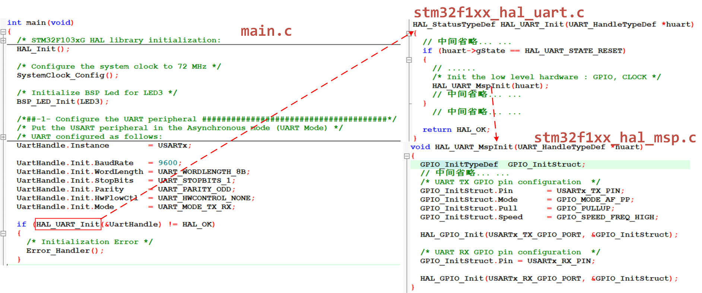

用户在main函数中直接初始化串口，设置串口 相关参数，包括波特率，停止位，奇偶校验位等，并且最终是通过调用 HAL_UART_Init 函数进行参数设置。在函数 HAL_UART_Init 内部，通过判断逻辑判断如果串口还没有进行初始话，那么会调用函数HAL_UART_MspInit 进行相关初始化设置 。同时，我们可以看到，在文件 stm32f1xx_hal_uart.c 内部，有定义一个弱函数 HAL_UART_MspInit：

```c
// stm32f1xx_hal_uart.c
/**
  * @brief  UART MSP Init.
  * @param  huart  Pointer to a UART_HandleTypeDef structure that contains
  *                the configuration information for the specified UART module.
  * @retval None
  */
__weak void HAL_UART_MspInit(UART_HandleTypeDef *huart)
{
  /* Prevent unused argument(s) compilation warning */
  UNUSED(huart);
  /* NOTE: This function should not be modified, when the callback is needed,
           the HAL_UART_MspInit could be implemented in the user file
   */
}
```

 而在 stm32f1xx_hal_msp.c 文件中对此函数进行了重写，重写后的函数 HAL_UART_MspInit 则主要进行串口 GPIO 引脚初始化设置。

这里定义的弱函数 HAL_UART_MspInit 是一个空函数，没有任何实际的控制逻辑。\_\_weak 修饰符定义的弱函数如果用户自己重新定义了这个函数，那么会优先执行用户定义函数。所以，实际上在函数 HAL_UART_Init 内部调用的 HAL_UART_MspInit()函数，最终执行的是用户在 stm32f1xx_hal_msp.c  中自定义的HAL_UART_MspInit()函数。  

那么整个串口初始化的过程为： 【main.c】 &rarr; 【HAL_UART_Init()】&rarr; 【HAL_UART_MspInit()】。

> 为什么串口相关初始化不在 HAL_UART_Init 函数内部一次初始化而还要调用函数 HAL_UART_MspInit()呢？
>
> 这实际就是 HAL 库的一个优点，它通过开放一个回调函数 HAL_UART_MspInit()，让用户自己去编写与串口相关的 MCU 级别的硬件初始化，而与 MCU 无关的串口参数相关的通用配置则放在 HAL_UART_Init。
>
> 我们要初始化一个串口，首先要设置和 MCU 无关的东西，例如波特率，奇偶校验，停止位等，这些参数设置和 MCU 没有任何关系，可以用STM32F1，也可以是 STM32F2/F3/F4/F7上的串口。而一个串口设备它需要一个 MCU 来承载，例如用 STM32F1 来做承载， PA9 做为发送， PA10 做为接收， MSP 就是要初始化 STM32F1 的 PA9，PA10，配置这两个引脚。 所以 HAL驱动方式的初始化流程就是： HAL_USART_Init()&rarr;HAL_USART_MspInit() ， 先初始化与 MCU无关的串口协议 ，再初始化 与 MCU 相关的串口引脚 。在 STM32 的 HAL 驱动中HAL_PPP_MspInit()作为回调， 被 HAL_PPP_Init()函数所调用。 当我们需要移植程序到 STM32F1平台的时候，我们只需要修改 HAL_XXX_MspInit 函数内容而不需要修改 HAL_XXX_Init 入口参
> 数内容。
>
> 所以在 STM32 的 HAL 库中，大部分外设都有回调函数 HAL_MspInit()。  

### 4. HAL库中断处理

中断是 STM32 开发的一个很重要的概念，这里我们可以简单地理解为： STM32 暂停了当前手中的事并优先去处理更重要的事务。而这些“更重要的事务”是由软件开发人员在软件中定义的。关于 STM32 中断的概念。由于 HAL 库中断处理的逻辑比较统一，我们将这个处理过程抽象为下图所表示的业务逻辑：  

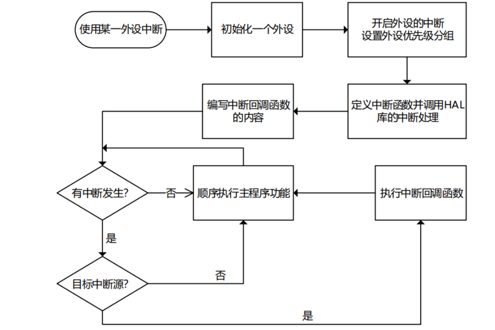

以上的流程大概就是： 设置外设的控制句柄结构体PPP_HandleType 和初始化 PPP_InitType 结构体的参数， 然后调用 HAL 库对应这个驱动的初始化 HAL_PPP_Init()，由于这个 API 中有针对外设初始化细节的接口 Hal_PPP_Mspinit()， 我们需要重新实现这个函数并完成外设时钟、 IO 等细节差异的设置，完成各细节处理后，使用HAL_NVIC_SetPriority()、 HAL_NVIC_EnableIRQ()来使能我们的外设中断；定义中断处理函数 PPP_IRQHandler ，并在中断函数中调用 HAL_ppp_function_IRQHandler()来判断和处理中断标记； HAL 库中断处理完成后，根据对应中的调用我们需要自定义的中断回调接口 HAL_PPP_ProcessCpltCallback();如串口接收函数 HAL_UART_RxCpltCallback()， 我们在这个函数中实现我们对串口接收数据想做的处理;中断响应处理完成后， stm32 芯片继续顺序执行我们定义的主程序功能，按照以上处理的标准流程完成了一次中断响应。  
