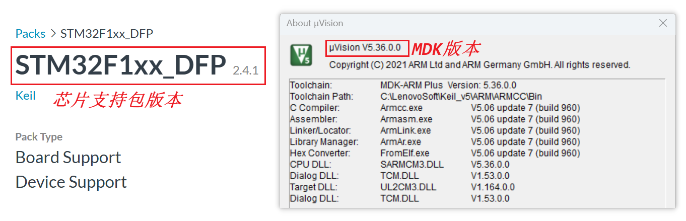
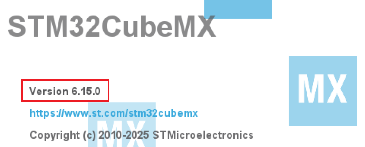
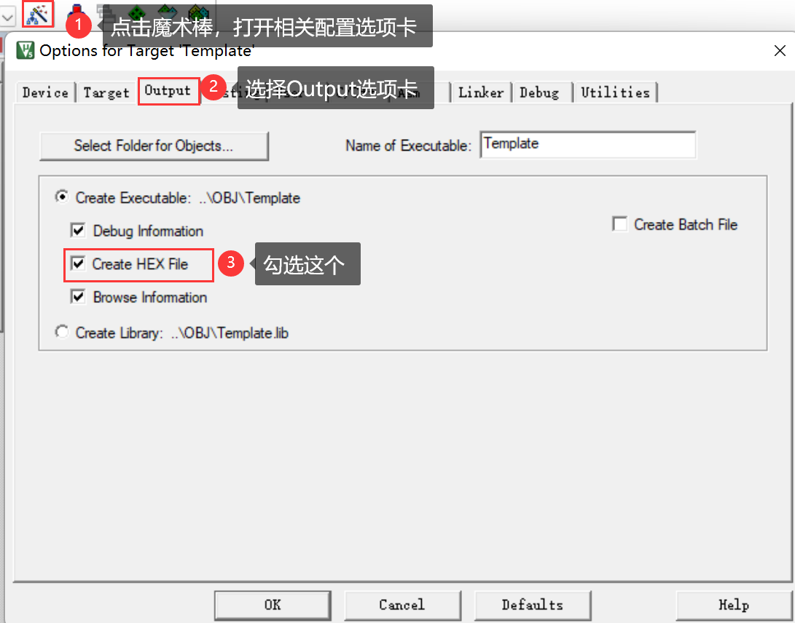
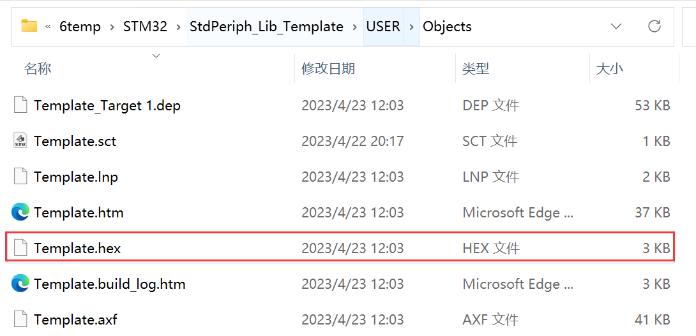

<!-- more -->

## 一、创建MDK工程

- 参考：[01-开发工具/01-keil/LV002-工程创建.md](/sdoc/dev-tool/keil/126b08aa5e32382c0ab32a01)

其中MDK版本和芯片支持包的版本如下：

- 参考：[01-开发工具/02-STM32Cube/LV002-STM32CubeMX工程创建.md](/sdoc/dev-tool/stm32cube/126b08aaf7c11b6e19f8d60a)

STM32CubeMX的版本如下：

## 二、生成hex文件

首先当然是生成成果物文件啦，我们使用MDK编写完程序后，要生成一个可以下载到开发板中的hex文件，这个文件是什么？后边再说，这里先说怎么生成怎么下载。如下图所示：

然后我们重新编译工程，就会在Objects目录中生成对应的 hex 文件。

## 三、下载到STM32

### 1. 串口下载

- [01-开发工具/10-下载与调试/LV030-串口下载.md](/sdoc/dev-tool/burn-and-debug/126b08b9cea618afd74b243b)

### 2. J-Link

- [01-开发工具/10-下载与调试/LV002-JLink怎么使用.md](/sdoc/dev-tool/burn-and-debug/126b08ab15ee0921c4f7fd64)

- [01-开发工具/10-下载与调试/LV010-JFlash简介.md](/sdoc/dev-tool/burn-and-debug/126b08b7f6ce25a6c770f3b5)

### 4. ST-Link

- [01-开发工具/10-下载与调试/LV015-STLink怎么使用.md](/sdoc/dev-tool/burn-and-debug/126b08b9c98b11187c20e13a)

- [01-开发工具/10-下载与调试/LV020-ST-LINK-Utility简介.md](/sdoc/dev-tool/burn-and-debug/126b08b9cb90276fafba387f)
