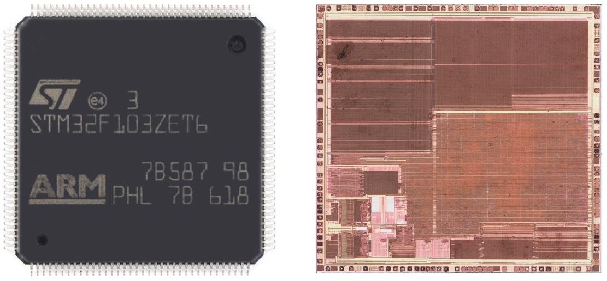
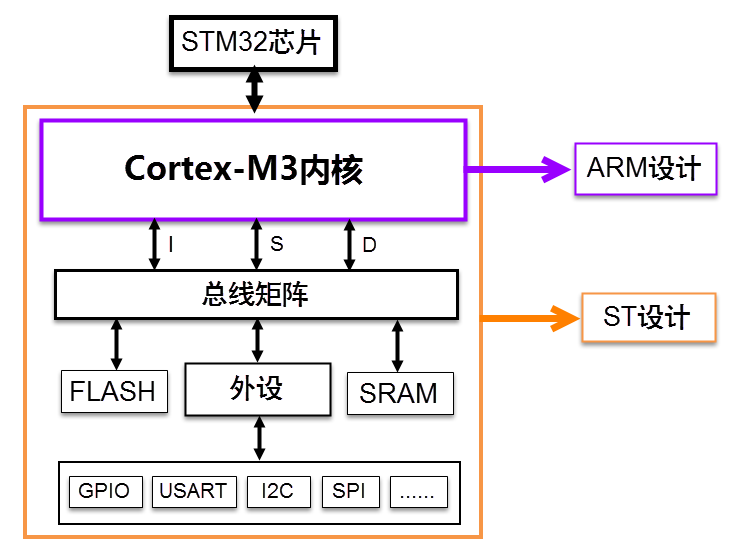
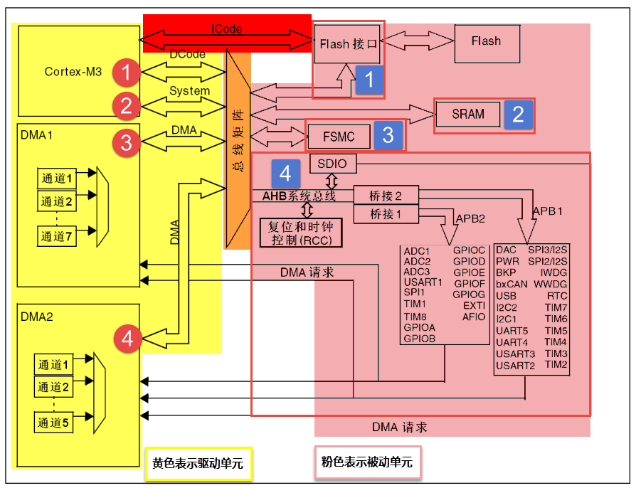
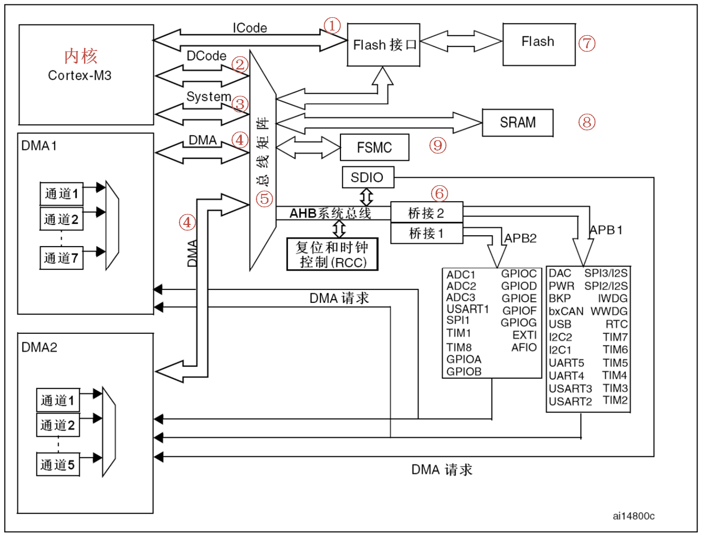

<!-- more -->

## 一、STM32简介

### 1. 回顾

2007 年 6 月， ST 在北京发布了全球第一款基于 ARM Cortex M3 内核的 32 位通用微控制器芯片： STM32F103，以优异的性能，丰富的资源，超高的性价比，迅速占领市场，从此一鸣惊人，一发不可收拾，截止到 2020 年 6 月， STM32 累计出货量超过 45 亿颗。  

后面学习的STM32就是用的下图中的STM32F103ZET6：

上图中，左侧是 STM32F103ZET6 芯片，右侧则是芯片开盖后的图片，即芯片内部视图，可以看到外观看上去平平无奇，但是内部是有很多东西的 。

### 2. 芯片内部有什么？

我们看到的STM32芯片是已经封装好的成品，主要由内核和片上外设组成。若与电脑类比，内核与外设就如同电脑上的CPU与主板、内存、显卡、硬盘的关系。

STM32F103采用的是Cortex-M3内核，内核即CPU，由ARM公司设计。ARM公司并不生产芯片，而是出售其芯片技术授权。 芯片生产厂商(SOC) 如ST、TI、NXP等，负责在内核之外设计部件并生产整个芯片，这些内核之外的部件被称为核外外设或片上外设。 如GPIO、USART（串口）、I2C、SPI等都叫做片上外设。

芯片（这里指内核，或者叫CPU）和外设之间通过各种总线连接，其中驱动单元有4个，被动单元也有4个。为了方便理解，我们都可以把驱动单元理解成是CPU部分，被动单元都理解成外设。

## 二、系统架构

### 1. 整体架构图

STM32 的系统架构比 51 单片机就要强大很多了。 STM32 系统架构的知识可以在《STM32中文参考手册 V10》的 P25~28 有讲解。这里的内容基本也是从中文参考手册中参考过来的， 这里所说的 STM32 系统架构主要针对的 STM32F103 这些非互联型芯片。首先我们看看 STM32 的系统架构图：  

在小容量、中容量和 大容量产品中，主系统由以下部分构成，下边的这些都是通过一个多级的AHB总线构架相互连接的

- 四个驱动单元：Cortex™-M3内核DCode总线(D-bus)、系统总线(S-bus)、通用DMA1、通用DMA2

- 四个被动单元：内部SRAM、内部闪存存储器、FSMC、AHB到APB的桥(AHB2APBx)，它连接所有的APB设备

### 2. 各个部分简介

#### 2.1 ICode总线

ICode中的 I 表示 Instruction，即指令。我们写好的程序经过编译之后都是一条条指令，存放在FLASH中，内核要读取这些指令来执行程序就必须通过ICode总线，它几乎每时每刻都需要被使用，它是专门用来取指的。

#### 2.2 驱动单元

##### 2.2.1 DCode总线

DCode中的 D 表示 Data，即数据，那说明这条总线是用来取数的。我们在写程序的时候，数据有常量和变量两种， 常量就是固定不变的，用C语言中的const关键字修饰，是放到内部的FLASH当中的，变量是可变的，不管是全局变量还是局部变量都放在内部的SRAM。 因为数据可以被Dcode总线和DMA总线访问，所以为了避免访问冲突，在取数的时候需要经过一个总线矩阵来仲裁，决定哪个总线在取数。

##### 2.2.2 System系统总线

系统总线主要是访问外设的寄存器，我们通常说的寄存器编程，即读写寄存器都是通过这根系统总线来完成的。

##### 2.2.3 DMA总线

DMA总线也主要是用来传输数据，这个数据可以是在某个外设的数据寄存器，可以在SRAM，可以在内部的FLASH。 因为数据可以被Dcode总线和DMA总线访问，所以为了避免访问冲突，在取数的时候需要经过一个总线矩阵来仲裁，决定哪个总线在取数。

#### 2.3 被动单元

##### 2.3.1 内部的闪存存储器

内部的闪存存储器即FLASH，我们编写好的程序就放在这个地方。内核通过ICode总线来取里面的指令。

##### 2.3.2 内部的SRAM

内部的SRAM，即我们通常说的RAM，程序的变量，堆栈等的开销都是基于内部的SRAM。内核通过DCode总线来访问它。

##### 2.3.3 FSMC

FSMC的英文全称是Flexible static memory controller，叫灵活的静态的存储器控制器，是STM32F10xx中一个很有特色的外设，通过FSMC，我们可以扩展内存，如外部的SRAM，NANDFLASH和NORFLASH。但有一点我们要注意的是，FSMC只能扩展静态的内存，即名称里面的S：static，不能是动态的内存，比如SDRAM就不能扩展。

##### 2.3.4 AHB到APB的桥

从AHB总线延伸出来的两条APB2和APB1总线，上面挂载着STM32各种各样的特色外设。我们经常说的GPIO、串口、I2C、SPI这些外设就挂载在这两条总线上，这个是我们学习STM32的重点，就是要学会编程这些外设去驱动外部的各种设备。

## 三、总线总结

① ICode 总线：该总线将Cortex™-M3   内核指令总线和闪存指令接口相连，指令的预取在该总线上面完成。

② DCode 总线：该总线将 Cortex™-M3   内核的 DCode 总线与闪存存储器的数据接口相连接，常量加载和调试访问在该总线上面完成。

③ 系统总线：此总线连接 Cortex™-M3  内核的系统总线（外设总线）到总线矩阵，总线矩阵协调内核和 DMA 间访问。

④ DMA 总线：此总线将 DMA 的 AHB 主控接口与总线矩阵相联 ， 总线矩阵协调 CPU 的DCode 和 DMA 到 SRAM，闪存和外设的访问。

⑤ 总线矩阵：总线矩阵协调内核系统总线和 DMA 主控总线之间的访问仲裁，仲裁利用轮换算法。在互联型产品中，总线矩阵包含5个驱动部件(CPU 的DCode、系统总线、以太网DMA、 DMA1总线和DMA2总线)和3个从部件(闪存存储器接口(FLITF)、 SRAM和AHB2APB桥)。在其它产品中总线矩阵包含4个驱动部件(CPU的DCode、系统总线、 DMA1总线和DMA2总线)和4个被动部件(闪存存储器接口(FLITF)、 SRAM、 FSMC和AHB2APB桥)。AHB外设通过总线矩阵与系统总线相连，允许DMA访问。  

⑥ AHB/APB 桥：这两个桥在 AHB 和 2 个 APB 总线间提供同步连接， APB1 操作速度限于36MHz，APB2 操作速度全速(最高72MHz)。在每一次复位以后，所有除SRAM和FLITF以外的外设都被关闭，在**使用一个外设之前，必须设置寄存器 RCC_AHBENR 来打开该外设的时钟**。

**【注意】**当对APB寄存器进行8位或者16位访问时，该访问会被自动转换成32位的访问：桥会自动将8位或者32位的数据扩展以配合32位的向量。  
