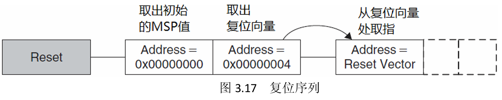
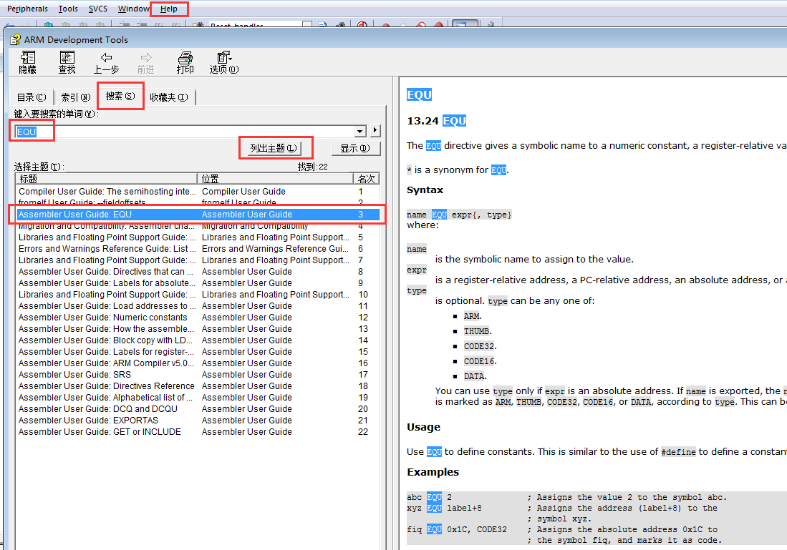
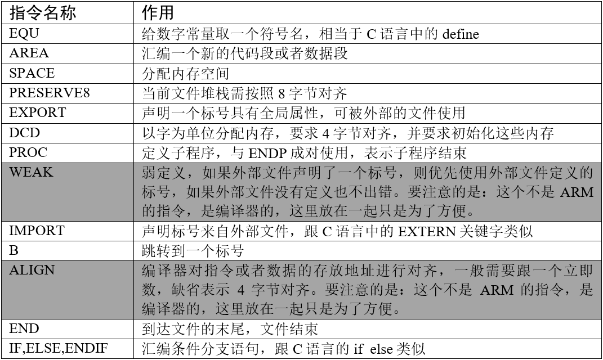
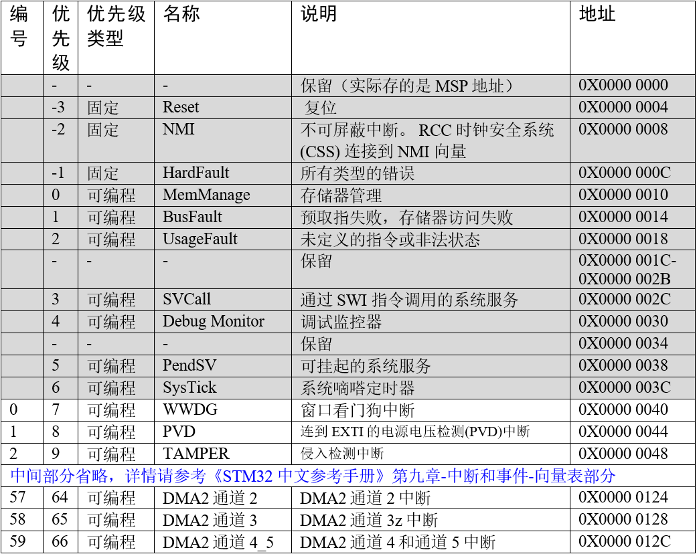
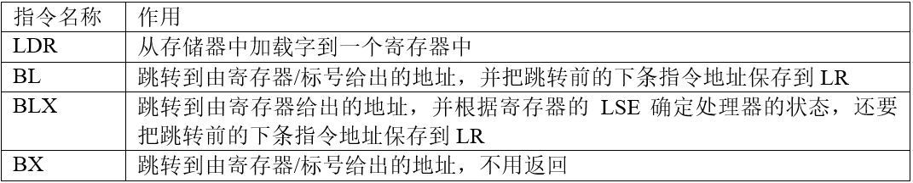
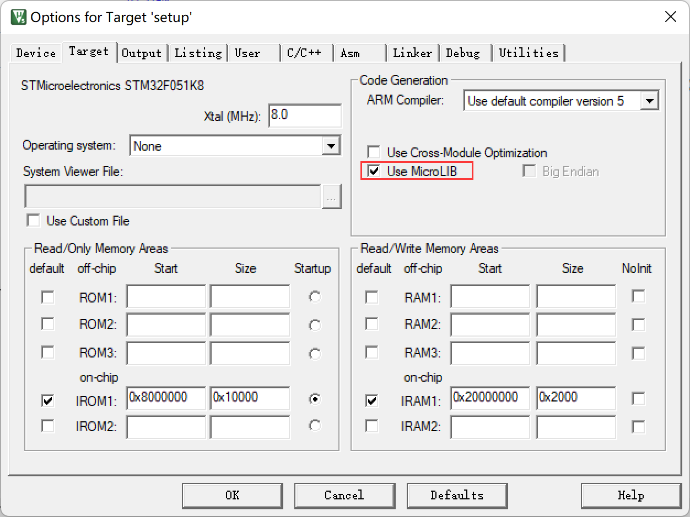
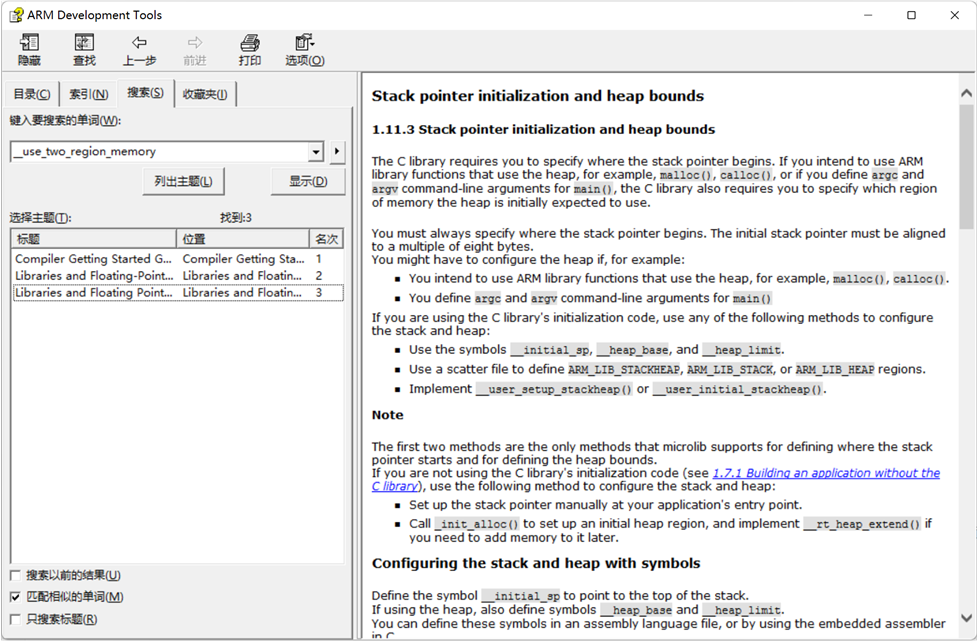
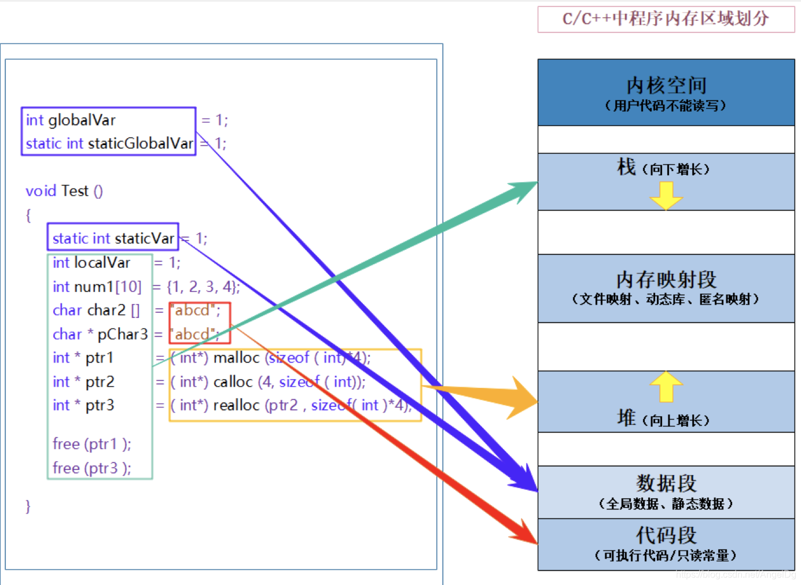

<!-- more -->

这一节我们来分析一下MDK工程中的STM32启动文件。

## 一、启动方式

- 参考[10-基础篇/20-STM32的启动/LV005-启动过程.md](/sdoc/basic/stm32setup/126b08e78de70b59cd9ba362)和[Cortex-M3 权威指南](https://picture.iczhiku.com/resource/upload/6820519db1f84e7faaf51c573c48e013.pdf)的3.8 复位序列

在离开复位状态后，CM3做的第一件事就是读取下列两个32位整数的值：

（1）从地址0x0000,0000处取出MSP的初始值。 

（2）从地址0x0000,0004 处取出PC的初始值——这个值是复位向量，LSB必须是1。然后从这个值所对应的地址处取指。 



这与传统的ARM架构不同——其实也和绝大多数的其它单片机不同。传统的ARM架 构总是从0地址开始执行第一条指令。它们的0地址处总是一条跳转指令。在CM3中，**在 0地址处 提供MSP的初始值**，然后**紧跟着就是向量表**（向量表在以后还可以被移至其它位置） 。 向量表中的数值是 32 位的地址，而不是跳转指令。向量表的第一个条目指向复位后应执行的第一条指令。

## 二、启动文件分析

### 1. 启动文件简介

启动文件由汇编编写，是系统上电复位后第一个执行的程序。主要做了以下工作：  

（1）初始化堆栈指针 SP=_initial_sp

（2）初始化 PC 指针 =Reset_Handler

（3）初始化中断向量表

（4）配置系统时钟

（5）调用 C 库函数 \_\_main 初始化用户堆栈，从而最终调用 main 函数去到 C 的世界 。

### 2. 启动文件在哪？

我是用的STM32CubeMX来生成的工程，启动文件就存在于 MDK-ARM/startup_stm32f103xe.s ，它的内容后边再分析。

### 3. 查找ARM汇编指令资料

学习启动代码的时候，会涉及到 ARM 的汇编指令和 Cortex 内核的指令，有关 Cortex 内核的指令我们可以参考[Cortex-M3 权威指南](https://picture.iczhiku.com/resource/upload/6820519db1f84e7faaf51c573c48e013.pdf)第四章：指令集。剩下的 ARM 的汇编指令我们可以在【MDK】&rarr;【Help】&rarr;【Uvision Help】 中搜索到 ：



检索出来的结果会有很多，我们只需要看 Assembler User Guide 这部分即可。下面列出了启动文件中使用到的 ARM 汇编指令，该列表的指令全部从 ARM Development Tools 这个帮助文档里面检索而来。其中编译器相关的指令 WEAK 和 ALIGN 为了方便也放在同一个表格了。  



## 三、启动文件分析

### 1. Stack——栈

```assembly
Stack_Size	 EQU     0x400
             AREA    STACK, NOINIT, READWRITE, ALIGN=3
Stack_Mem    SPACE   Stack_Size
__initial_sp
```

（1）第1行：EQU，宏定义的伪指令，相当于等于，类似与C中的define。这里定义栈的大小为0x400，也就是1KB；

（2）第2行：AREA 是定义一个段，它将告诉汇编器汇编一个新的代码段或者数据段。此处定义的是栈段，没有初始化的段。STACK 表示段名，这个可以任意命名 ，NOINIT即不初始化，READWRITE表示可读可写，ALIGN是说段的起始地址应该是8（2^3）的倍数，也就是8字节对齐；

（3）第3行：SPACE，用于分配一定大小的内存空间，单位为字节。这里指定大小等于Stack_Size，也就是开辟栈空间大小为0x400。

（4）第4行：\_\_initial\_sp是个标号，这个标号指向栈的栈顶，它紧挨着SPACE语句放置，表示栈的结束地址，即栈顶地址，栈是**由高向低生长**，后进先出。

栈的作用是用于局部变量，函数调用，函数形参等的开销，**栈的大小不能超过内部SRAM的大小**。如果编写的程序比较大， 定义的局部变量很多，那么就需要修改栈的大小。如果某一天，我们写的程序出现了莫名奇怪的错误，并进入了硬fault的时候，这时我们就要考虑下是不是栈不够大，溢出了。

### 2. Heap——堆

```assembly
Heap_Size      EQU     0x200								;定义堆的大小 512B
                AREA    HEAP, NOINIT, READWRITE, ALIGN=3
__heap_base													;堆的起始地址
Heap_Mem        SPACE   Heap_Size							;堆的大小
__heap_limit												;堆的结束地址
```

（1）第1行：定义堆的大小为0x200，也就是512B；

（2）第2行：AREA 是定义一个段，此处定义的是堆段，没有初始化的堆，NOINIT即不初始化，READWRITE表示可读可写，align是8字节对齐；

（3）第3行：\_\_heap\_base，表示堆的起始地址。

（4）第4行：SPACE，用于分配一定大小的内存空间，单位为字节。这里指定大小等于Heap_Size，也就是开辟堆空间大小为0x200。

（5）第5行：\_\_heap\_limit是个标号，堆的结束地址。堆**是由低向高生长的**，跟栈的生长方向相反。

堆主要用来动态内存的分配，像malloc()函数申请的内存就在堆上面。这个在STM32里面用的比较少。

### 3. 堆栈对齐

```assembly
                PRESERVE8
                THUMB
```

（1）PRESERVE8：指定当前文件的堆栈按照8字节对齐。

（2）THUMB：表示后面指令兼容THUMB指令。THUBM是ARM以前的指令集，16bit，现在Cortex-M系列的都使用THUMB-2指令集， THUMB-2是32位的，兼容16位和32位的指令，是THUMB的超集。

### 4. 向量表

```assembly
; Vector Table Mapped to Address 0 at Reset
                AREA    RESET, DATA, READONLY
                EXPORT  __Vectors
                EXPORT  __Vectors_End
                EXPORT  __Vectors_Size
```

（1）第2行：定义一个数据段，名字为RESET，可读。  数据段放的是中断向量。

（2）第3~5行：EXPORT在程序中声明一个全局的标号，声明 \_\_Vectors、\_\_Vectors\_End和\_\_Vectors\_Size这三个标号具有全局属性，**可供外部的文件调用**。如果是IAR编译器，则使用的是GLOBAL这个指令。

当内核响应了一个发生的异常后，对应的异常服务例程(ESR)就会执行。为了决定 ESR 的入口地址， 内核使用了“向量表查表机制”。 这里使用一张向量表。向量表其实是一个 WORD（ 32 位整数）数组，每个下标对应一种异常，该下标元素的值则是该 ESR的入口地址。 向量表在地址空间中的位置是可以设置的，通过 NVIC 中的一个重定位寄存器来指出向量表的地址。在复位后，该寄存器的值为 0。因此， 在地址 0 （即FLASH 地址0）处必须包含一张向量表，用于初始时的异常分配。要注意的是这里有个另类： 0 号类型并不是什么入口地址， 而是给出了复位后 MSP 的初值。



```assembly
__Vectors       DCD     __initial_sp               ; Top of Stack 存放__initial_sp，也就是堆栈栈顶的地址
                DCD     Reset_Handler              ; Reset Handler
                DCD     NMI_Handler                ; NMI Handler
                DCD     HardFault_Handler          ; Hard Fault Handler
                DCD     MemManage_Handler          ; MPU Fault Handler
                DCD     BusFault_Handler           ; Bus Fault Handler
                DCD     UsageFault_Handler         ; Usage Fault Handler
                DCD     0                          ; Reserved
                DCD     0                          ; Reserved
                DCD     0                          ; Reserved
                DCD     0                          ; Reserved
                DCD     SVC_Handler                ; SVCall Handler
                DCD     DebugMon_Handler           ; Debug Monitor Handler
                DCD     0                          ; Reserved
                DCD     PendSV_Handler             ; PendSV Handler
                DCD     SysTick_Handler            ; SysTick Handler

                ; External Interrupts
                DCD     WWDG_IRQHandler            ; Window Watchdog
                DCD     PVD_IRQHandler             ; PVD through EXTI Line detect
				; 中间的部分省略
                DCD     DMA2_Channel3_IRQHandler   ; DMA2 Channel3
                DCD     DMA2_Channel4_5_IRQHandler ; DMA2 Channel4 & Channel5
__Vectors_End

__Vectors_Size  EQU  __Vectors_End - __Vectors
```

（1）\_\_Vectors为向量表起始地址，\_\_Vectors\_End 为向量表结束地址，两个相减即可算出向量表大小。

（2）向量表从FLASH的0地址开始放置，以4个字节为一个单位，**地址0一定存放的是栈顶地址**，0X04存放的是复位程序的地址，以此类推。 从代码上看，向量表中存放的都是中断服务函数的函数名，可我们知道C语言中的函数名就是一个地址。

> **DCD**：分配一个或者多个以字为单位的内存，要求四字节对齐，并要求初始化这些内存。在向量表中，DCD分配了一堆内存，并且以ESR的入口地址初始化它们。

### 5. 复位程序

```assembly
                AREA    |.text|, CODE, READONLY		 ;text  一般代表代码段
```

第1行：定义一个名称为 .text 的代码段，可读。

```assembly
; Reset handler routine
Reset_Handler    PROC
                 EXPORT  Reset_Handler                 [WEAK]     
                 IMPORT  __main									 
                 IMPORT  SystemInit  
                 LDR     R0, =SystemInit			;复位子程序是系统上电后第一个执行的程序，调用 SystemInit 函数初始化系统时钟
                 BLX     R0
                 LDR     R0, =__main                ;__main 是一个标准的 C 库函数，主要作用是初始化用户堆栈，并在函数的最后调用main 函数去到 C 的世界
                 BX      R0
                 ENDP
```

这个复位子程序是系统上电后第一个执行的程序，调用SystemInit函数初始化系统时钟，然后调用C库函数\_\_mian，最终调用main函数去到C的世界。

（1）第 2 行：**PROC、ENDP**这一对伪指令把程序分为若干个过程，是程序结构更加清晰。

（2）第3行：[WEAK]表示是一个弱符号声明，就是告诉编译器，我这里声明的标号的优先权低于其它同名的标号，也就是说如果在工程中还有别的函数和我同名，那么你就调用和我同名的其它函数，如果没有同名的，那你就调用我。

（3）第4行：IMPORT，表示该标号来自外部文件，跟C语言中的EXTERN关键字类似。这里表示SystemInit和\_\_main这两个函数均来自外部的文件。SystemInit()是一个标准的库函数，在system_stm32f0xx.c这个库文件总定义。主要作用是配置系统时钟，这里调用这个函数之后，单片机的系统时钟配将会被配置。\_\_main是一个标准的C库函数，主要作用是初始化用户堆栈，并在函数的最后调用main函数去到C的世界。这就是为什么我们写的程序都有一个main函数的原因。

LDR、 BLX、 BX 是 CM4 内核的指令，可在[Cortex-M3 权威指南](https://picture.iczhiku.com/resource/upload/6820519db1f84e7faaf51c573c48e013.pdf)第四章-指令集里面查询到，具体作用见下表 ：



### 6. 中断服务程序

```assembly
; Dummy Exception Handlers (infinite loops which can be modified)

NMI_Handler     PROC ; 系统异常
                EXPORT  NMI_Handler                    [WEAK]  
                B       .
                ENDP
; 中间部分省略
SysTick_Handler PROC
                EXPORT  SysTick_Handler                [WEAK]
                B       .
                ENDP

Default_Handler PROC ;外部中断
                EXPORT  WWDG_IRQHandler                [WEAK]
                EXPORT  PVD_IRQHandler                 [WEAK]
                EXPORT  RTC_IRQHandler                 [WEAK]
				; 中间部分省略

WWDG_IRQHandler
PVD_IRQHandler
RTC_IRQHandler
;中间部分省略

                B       .

                ENDP
```

在启动文件里面已经帮我们写好所有中断的中断服务函数，跟我们平时写的中断服务函数不一样的就是这些函数都是空的，真正的中断复服务程序需要我们在外部的 C 文件里面重新实现，这里只是提前占了一个位置而已。  

如果我们在使用某个外设的时候，开启了某个中断，但是又忘记编写配套的中断服务程序或者函数名写错，那当中断来临的时，程序就会跳转到启动文件预先写好的空的中断服务程序中，并且在这个空函数中无限循环，即程序就死在这里。  

> **B**：跳转到一个标号。这里跳转到一个‘ . ’，即表示无限循环。

上面的这些不管是系统的中断服务程序还是外设的中断服务程序，都是_WEAK申明，其实我们写中断服务函数的时候，都会自己实现，比如F1中，我们在`stm32f1xx_it.c`文件中实现使用到的中断服务函数：

```c
/**
  * @brief  This function handles Hard Fault exception.
  * @param  None
  * @retval None
  */
void HardFault_Handler(void)
{
  /* Go to infinite loop when Hard Fault exception occurs */
  while (1)
  {
  }
}
```

### 7. 用户堆栈初始化

```assembly
                ALIGN
```

第1行：ALIGN，对指令或者数据存放的地址进行对齐，后面会跟一个立即数。缺省表示4字节对齐。

```assembly
;*******************************************************************************
; User Stack and Heap initialization
;*******************************************************************************
                 IF      :DEF:__MICROLIB       ;检查是否定义了__MICROLIB,如果定义了则条件成立。用户可以在配置软件中勾选。
				;用户栈和堆初始化,由C库函数_main来完成
                 EXPORT  __initial_sp		  ;栈顶地址
                 EXPORT  __heap_base		  ;堆起始地址
                 EXPORT  __heap_limit         ;堆结束地址

                 ELSE					

                 IMPORT  __use_two_region_memory 	  
                 EXPORT  __user_initial_stackheap   ;用户自己来初始化堆栈

__user_initial_stackheap

                 LDR     R0, =  Heap_Mem
                 LDR     R1, = (Stack_Mem + Stack_Size)
                 LDR     R2, = (Heap_Mem +  Heap_Size)
                 LDR     R3, =  Stack_Mem
                 BX      LR

                 ALIGN

                 ENDIF

                 END
```

第4行：首先判断是否定义了\_\_MICROLIB ，如果定义了这个宏则赋予标号\_\_initial\_sp（栈顶地址）、 \_\_heap_base（堆起始地址）、\_\_heap\_limit（堆结束地址）全局属性，可供外部文件调用。 有关这个宏我们在KEIL里面配置，具体见下图。然后堆栈的初始化就由C库函数\_\_main来完成。



如果没有定义\_\_MICROLIB，则插入标号\_\_use\_two\_region\_memory，这个函数需要用户自己实现， 具体要实现成什么样，可在KEIL的帮助文档里面查询到：



（2）第15行：声明标号 \_\_user\_initial\_stackheap 具有全局属性，可供外部文件调用，并实现这个标号的内容。  

（3）IF、ELSE、ENDIF：汇编的条件分支语句，跟 C 语言的 if ,else 类似，END：文件结束 。

## 三、为什么要初始化堆栈

这个嘛，我就按自己的理解先写这里，其实也不一定对，有错误的话欢迎指出，后边看到更权威的说明了，再补充。我们来看一下C语言程序的内存分布：



> 上图是**现代多任务操作系统（如 Linux、Windows 等）环境下，C/C++ 程序的内存区域划分**，其核心特点是基于虚拟内存机制，将内存划分为 “内核空间” 和 “用户空间”，并在用户空间中进一步细分出栈、堆、数据段、代码段等区域。这种划分的前提是：程序运行在具备完整内存管理单元（MMU）的处理器上，且依赖操作系统的虚拟内存管理功能。
>
> 单片机中**无 “内核空间” 与 “用户空间” 的划分**，单片机通常是单任务系统（或简单 RTOS），没有复杂的内核与用户态隔离，内存直接使用物理地址，不存在虚拟内存映射。也**无 “内存映射段”**，单片机通常不支持动态库加载或文件映射（缺乏对应的操作系统机制），因此不存在图中的 “内存映射段”。其他部分都是一样的了。

- 栈的作用是用于局部变量，函数调用，函数形参等的开销。
- 堆主要用来动态内存的分配。

单片机的硬件在上电时是“空白”的，它不知道把堆栈放在哪里。而没有堆栈，任何函数调用、中断服务程序甚至局部变量都无法正常工作，程序会立刻崩溃。

单片机芯片在复位上电的那一刻，其内部的寄存器（包括**堆栈指针寄存器 SP**）的值是**不确定的**（可能是0，也可能是随机值）。想象一下，如果不对堆栈指针（SP）进行初始化，会发生什么：

（1）SP 指向了一个随机的位置，比如地址 `0x00000000`（可能是启动地址），或者 `0xFFFFFFFF`（非法地址），或者片内RAM中的某个未知数据区。

（2）程序开始运行，一旦发生任何函数调用或中断，CPU就会尝试把返回地址或寄存器值写入 SP 所指向的那个随机地址。

（3）如果这个地址是**只读的**（比如程序存储器Flash），写入操作会失败，导致硬件错误，程序崩溃。

（4）如果这个地址是**可写的但内容重要**（比如覆盖了其他变量或代码），数据会被破坏，程序运行结果不可预测，同样会崩溃。

（5）果这个地址是**根本不存在**的，访问会直接导致总线错误。

初始化堆栈的根本目的就是：告诉CPU，那片内存区域是专门用来做堆栈的，请把SP指针指到那片区域的顶部（通常是最高地址），从此以后所有的压栈(Push)和出栈(Pop)操作都在这个划定的安全区域内进行。

> 参考资料：
>
> [C/C++：内存分配，详解内存分布（P：图解及代码示例）_内存是从底到高存储吗-CSDN博客](https://blog.csdn.net/AngelDg/article/details/104871782)
>
> [STM32的启动过程 — startup_xxxx.s文件解析（MDK和GCC双环境）-云社区-华为云](https://bbs.huaweicloud.com/blogs/375425)
>
> 
