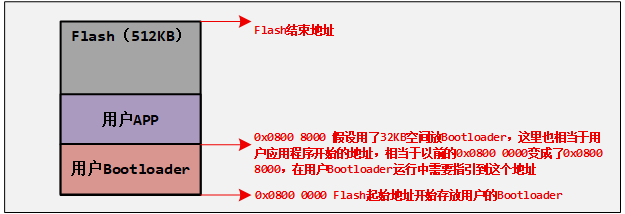

<!-- more -->

这一部分主要是分析STM32的启动流程，我们将会接触到内部FLASH的相关内容。

## 一、内部FLASH

这里了解一下内部Flash的一些内容，并不涉及对内部Flash读写等相关操作。

### 1. FLASH简介

flash是存储芯片的一种，通过特定的程序可以修改里面的数据。FLASH在电子以及半导体领域内往往表示 Flash Memory 的意思，即平时所说的“闪存”，全名叫 Flash EEPROM Memory。它结合了ROM和RAM的长处，不仅具备电子可擦除可编程（EEPROM）的性能，还可以快速读取数据（NVRAM的优势），使数据不会因为断电而丢失。

在STM32芯片内部有一个FLASH存储器，它主要用于存储代码，我们在电脑上编写好应用程序后，使用下载器把编译后的代码文件烧录到该内部FLASH中， 由于FLASH存储器的内容在掉电后不会丢失，芯片重新上电复位后，**内核可从内部FLASH中加载代码并运行**。

除了使用外部的工具（如下载器）读写STM32的内部FLASH外，STM32芯片在运行的时候，也能对自身的内部FLASH进行读写，因此， 若内部FLASH存储了应用程序后还有剩余的空间，我们可以把它像外部SPI-FLASH那样利用起来，**存储一些程序运行时产生的需要掉电保存的数据**。

由于访问内部FLASH的速度要比外部的SPI-FLASH快得多，所以在紧急状态下常常会使用内部FLASH存储关键记录；为了防止应用程序被抄袭， 有的应用会禁止读写内部FLASH中的内容，或者在第一次运行时计算加密信息并记录到某些区域，然后删除自身的部分加密代码，这些应用都涉及到内部FLASH的操作。

### 2. 去哪找资料？

关于STM32的内部Flash的相关资料是没有在[STM32中文参考手册](https://www.stmcu.com.cn/Designresource/detail/localization_document%20/710001)中有所体现的，关于Flash的相关资料，ST官方有另外的文档，叫做STM32F10xxx闪存编程手册，英文版在这里：[STM32F10xxx Flash memory microcontrollers](https://www.st.com/resource/en/programming_manual/pm0075-stm32f10xxx-flash-memory-microcontrollers-stmicroelectronics.pdf)，这个手册也有中文版，但是我在中文社区没找到，那就看个本地版的吧：[STM32F10xxx闪存编程参考手册](STM32开发相关资料/04STM32资料/STM32F10xxx闪存编程参考手册.pdf)

### 3. 内部FLASH构成

#### 3.1 有哪些部分？

STM32 的内部FLASH（闪存模块）由：**主存储器**、**信息块**和**闪存存储器接口寄存器**等 3 部分组成。  这一部分的相关说明我们需要查看[STM32F10xxx闪存编程参考手册](STM32开发相关资料/04STM32资料/STM32F10xxx闪存编程参考手册.pdf)，这个中文版本的1.2 闪存模块组织，也有英文版本的（[STM32F10xxx Flash memory microcontrollers](https://www.st.com/resource/en/programming_manual/pm0075-stm32f10xxx-flash-memory-microcontrollers-stmicroelectronics.pdf)），其实在[STM32中文参考手册](https://www.stmcu.com.cn/Designresource/detail/localization_document%20/710001)的2.3.3 嵌入式闪存这一节也有这个表。在ST官网上可以找到相应的英文版本。如下图为STM32F1系列芯片大容量产品的闪存模块组织图：

注意上表中的主存储器是本实验板使用的 STM32ZET6 型号芯片的参数，即 STM32F1 大容量产品。若使用超大容量、中容量或小容量产品，它们主存储器的页数量、页大小均有不同，使用的时候要注意区分。  

需要知道的是主存储器和信息块的写入，由内嵌的闪存编程/擦除控制器(FPEC)管理，编程与擦除的高电压由内部产生。在执行闪存写操作时，任何对闪存的读操作都会锁住总线，在写操作完成后读操作才能正确地进行，即在进行写或擦除操作时，不能进行代码或数据的读取操作。 

#### 3.2 主存储器

一般我们说STM32内部FLASH的时候，都是指这个主存储器区域，它是**存储用户应用程序的空间**， 芯片型号说明中的256K FLASH、512K FLASH都是指这个区域的大小。

主存储器分为256页，每页大小为2KB，共512KB。这个分页的概念，实质就是FLASH存储器的扇区，与其它FLASH一样，在写入数据前，要先按页（扇区）擦除。从上图可以看出主存储器的起始地址就是 0X08000000。

**【注意】**上表中的主存储器是STM32F103ZET6型号芯片的参数，芯片型号中的E就表示这是STM32F1系列的大容量产品，并且容量为512KB。若使用超大容量、中容量或小容量产品， 它们主存储器的页数量、页大小均有不同，使用的时候要注意区分。芯片型号各部分代表的含义其实可以查看芯片手册的《7 Part numbering  》这一节，在芯片手册上有对芯片型号的详细说明。

#### 3.3 信息块

该部分分为 2 个小部分，分别是启动程序代码和用户选择字节。

（1）启动程序代码：这部分是用来存储 ST 芯片出厂时已经固化了的启动代码，用于实现串口、USB以及CAN等ISP烧录功能。这个好像也可以叫系统存储器，都是一个意思，[STM32F10xxx Flash memory microcontrollers](https://www.st.com/resource/en/programming_manual/pm0075-stm32f10xxx-flash-memory-microcontrollers-stmicroelectronics.pdf)的1.2 Flash module organization一节中，这个地方是叫system memory，个人觉得还是叫系统存储器更符合原版手册。

（2）选项字节：用于配置FLASH的读写保护、待机/停机复位、软件/硬件看门狗等功能，这部分共16字节。可以通过修改FLASH的选项控制寄存器修改。

#### 3.4 接口寄存器

闪存存储器接口寄存器，该部分用于控制闪存读写等，是整个闪存模块的控制机构。  这部分其实就包含了STM32的 FPEC（闪存编程和擦除控制器）模块，我们对FLASH的操作就是通过这个模块来实现的，这个模块包含了 7 个32位寄存器，分别是：

| 寄存器名称    | 地址                      | 说明             |
| ------------- | ------------------------- | ---------------- |
| FLASH_KEYR    | 0x4002_2004 – 0x4002_2007 | FPEC 键寄存器    |
| FLASH_OPTKEYR | 0x4002_2008 – 0x4002_200B | 选择字节键寄存器 |
| FLASH_SR      | 0x4002_200C – 0x4002_200F | 闪存状态寄存器   |
| FLASH_CR      | 0x4002_2010 – 0x4002_2013 | 闪存控制寄存器   |
| FLASH_AR      | 0x4002_2014 – 0x4002_2017 | 闪存地址寄存器   |
| FLASH_OBR     | 0x4002_201C – 0x4002_201F | 选择字节寄存器   |
| FLASH_WRPR    | 0x4002_2020 – 0x4002_2023 | 写保护寄存器     |

【说明】其中FPEC总共有3个键值：RDPRT键=0X000000A5；KEY1=0X45670123；KEY2=0XCDEF89AB

## 二、STM32的启动方式

### 1. 资料参考

关于STM32的启动方式，我们可以参考的资料有：

- STM32中文参考手册：[STM32中文参考手册](https://www.stmcu.com.cn/Designresource/detail/localization_document%20/710001)的2.4 启动配置 
- AN2606 STM32微控制器系统内存启动模式：[STM32单片机系统内存启动方式](https://www.stmcu.com.cn/Designresource/detail/localization_document/711401)的4 STM32F100xx、 STM32F101xx、 STM32F102xx、STM32F103xx 中容量和大容量超值型自举程序  

### 2. 自举过程

Cortex-M3 内核在离开复位状态后的工作过程如下（参考[Cortex-M3 权威指南](https://picture.iczhiku.com/resource/upload/6820519db1f84e7faaf51c573c48e013.pdf)的3.8 复位序列 ） ：

> 当选择相应的启动方式时，对应的存储器空间被映射到启动空间(0x00000000)。从闪存存储器启动：主闪存存储器被映射到启动空间(0x0000 0000) ,也就是0x08000000被映射到0x00000000。从内部SRAM启动 ：SRAM起始地址 0x2000 0000 被映射到0x00000000。从系统存储器启动：系统存储器被映射到启动空间(0x0000 0000)，也就是0x1FFF F000被映射到0x00000000。
>
> 为什么是0x1FFF F000 可以看 STM32 的存储器映射分析，STM32互联型产品这个地址不一样，此地址由ST官方写入了一段BootLoader代码，可以通过官方BootLoader升级MCU固件，无法修改）。

我们知道的复位方式有三种：上电复位，硬件复位和软件复位。这里我们从上电复位开始分析。

- 第一阶段：上电复位与硬件自动初始化 (Hardware Auto-Initialization)

上电复位时，电源电压逐渐上升到稳定值。芯片内部的复位电路会保持CPU处于复位状态，直到电压稳定。电压稳定后，复位信号被释放，CPU核心开始工作。

然后处理器首先读取向量表中的前两个字数据（8 个字节），第一个字存入 MSP，第二个字为复位向量，它表示程序执行的起始地址（复位处理），也就是以下两个过程：

(1) 从地址 0x00000000 处取出读取4个字节的数据，作为栈指针 MSP 的初始值，该值就是栈顶的地址。**这是MSP的第一次初始化，由硬件完成。**

(2) 从地址 0x00000004 处取出程序指针 PC 的初始值，该值指向复位后应执行的第一条指令。  

>Cortex-M内核设计为从内存地址 **`0x0000_0000`** 开始寻找一个称为“向量表”的结构。

MSP就是主堆栈指针，堆栈指针的作用就是指向栈顶元素的，还可以对栈顶元素进行出栈操作。当堆栈中的元素进行出栈或入栈操作时，都会使栈顶元素发生变化，堆栈指针sp就需要重新赋值，让其指向新的栈顶元素。PC就是程序计数器，用于存储当前**取址指令的地址**。

此时的状态：MSP 已经指向了一个有效的、由链接器预先定义好的RAM地址（通常是RAM的末端）。PC 已经指向了复位后应执行的第一条指令。 

经过上边两个过程，内核就知道了栈顶的地址，为什么需要知道栈顶？因为我们在执行c语言函数这些的时候，会定义很多的局部变量，这些局部变量都是存放于栈空间的，内核要是不知道栈顶地址的话，那就很容易会发生溢出。接下来是PC指针，由于我们把中断向量表中的Reset放在0x00000004这个地址：

所以程序执行的第一条指令就是到这个Reset中断中执行指令，之后就从Reset这个子程序中开始执行。

- 第二阶段：启动文件执行 (Startup File Execution)

现在CPU开始执行`Reset_Handler`的代码（通常写在`.s`启动文件中）。这里是软件开始接管的地方。

虽然硬件已经初始化了MSP，但启动代码通常会显式地再次设置一次。这是一种良好的编程习惯，确保绝对可靠，特别是在有Bootloader的复杂系统中。

接下来初始化系统时钟和Flash：调用一个`SystemInit()`函数（通常用C语言编写）。这个函数负责配置时钟树、配置Flash等待状态（当CPU时钟速度很高时，访问Flash需要插入等待周期，否则会读取错误）、初始化其他关键外设。

然后复制数据段 (.data) 和清零BSS段 (.bss)：这是构建C语言运行环境的关键一步。.data段存放已初始化的全局变量和静态变量。它们的初始值存储在Flash中，但运行时需要存在于可写的RAM里。启动代码负责将这些初始值从Flash**复制**到RAM中对应的地址。.bss段：存放未初始化的全局变量和静态变量。启动代码需要将这块RAM区域**全部清零**。这是C语言标准的要求，确保这些变量初始值为0。

> *注意：简单的启动文件可能用汇编完成此操作，但更常见的做法是调用C库函数`__main`来处理。*

- 第三阶段：C环境构建与跳转至main()

在启动文件的最后，会执行一条跳转指令，指向C标准库中的`__main`函数（注意，这不是我们的`main`函数）。`__main`函数会完成上述的数据段复制和BSS段清零工作，并更复杂地设置C运行时环境。

最终调用到用户编写的main主函数中去。这个过程由内核自动设置运行环境并执行主体程序，因此它被称为**自举过程**。  

### 3. 启动方式

#### 3.1 启动方式说明

虽然内核是固定访问 0x00000000 和 0x00000004 地址的，但实际上这两个地址可以被重映射到其它地址空间。例如：我们将 0x0800 0000 映射到 0x0000 0000，即从内部 FLASH 启动，那么内核会从地址 0x0800 0000 处取出堆栈指针 MSP 的初始值，从地址 0x0800 0004 处取出程序计数器指针PC 的初始值。 CPU 会从 PC 寄存器指向的地址空间取出的第 1 条指令开始执行程序，就是开始执行复位中断服务程序 Reset_Handler。将0x0000 0000 和 0x0000 0004 两个地址重映射到其他的地址空间，就是启动模式选择。  

以 STM32F103 为例，根据芯片引出的 BOOT0 及 BOOT1 引脚的电平情况，这两个地址可以被映射到内部 FLASH、内部 SRAM 以及系统存储器中 。我们可以看一下[STM32中文参考手册](https://www.stmcu.com.cn/Designresource/detail/localization_document%20/710001)的2.4 启动配置 或者[STM32单片机系统内存启动方式](https://www.stmcu.com.cn/Designresource/detail/localization_document/711401)的 3.1 自举程序激活 ，他们都会有这样一张表：

内核在**离开复位状态**后**会从映射的地址中取值给栈指针 MSP 及程序指针 PC**，然后**执行指令**，我们一般以存储器的类型来区分自举过程，例如内部 FLASH 启动方式、内部 SRAM 启动方式以及系统存储器启动方式。 我们看一下这三种方式对应的存储器地址分别都是哪？我们来看一下[STM32F103xx数据手册](https://www.st.com/resource/en/datasheet/stm32f103ze.pdf)的4 Memory mapping一节：

(1) 内部 FLASH 启动方式

当芯片上电后采样到 BOOT0 引脚为低电平时， 0x00000000 和 0x00000004 地址被映射到内部FLASH 的首地址 0x08000000 和 0x08000004。因此，内核离开复位状态后，读取内部 FLASH 的 0x08000000 地址空间存储的内容，赋值给栈指针 MSP，作为栈顶地址，再读取内部 FLASH 的 0x08000004 地址空间存储的内容，赋值给程序指针 PC，作为将要执行的第一条指令所在的地址。具备这两个条件后，内核就可以开始从 PC 指向的地址中读取指令执行了。

(2) 内部 SRAM 启动方式

类似地，当芯片上电后采样到 BOOT0 和 BOOT1 引脚均为高电平时， 0x00000000 和 0x00000004地址被映射到内部 SRAM 的首地址 0x20000000 和0x20000004，内核从 SRAM 空间获取内容进行自举。

(3) 系统存储器启动方式

当芯片上电后采样到 BOOT0 引脚为高电平， BOOT1 为低电平时，内核将从系统存储器（它其实位于内部Flash的信息块部分）的0x1FFFF000 及0x1FFFF004 获取 MSP 及 PC 值进行自举。系统存储器是一段特殊的空间，**用户不能访问**， ST 公司在芯片出厂前就在系统存储器中固化了一段代码。因而使用系统存储器启动方式时，内核会执行该代码，该代码运行时，会为 ISP 提供支持 (In System Program)，如检测USART1/2、 CAN2 及 USB 通讯接口传输过来的信息，并根据这些信息更新自己内部 FLASH 的内容，达到升级产品应用程序的目的，因此这种启动方式也称为 **ISP 启动方式**。  这就是前边为什么可以通过串口使用flymcu软件往单片机中烧录程序的原因。

**【注意】**在实际应用中，由启动文件 starttup_stm32f10x.s 决定了 0x00000000 和 0x00000004 地址存储什么内容，链接时，由分散加载文件 (sct) 决定这些内容的绝对地址，即分配到内部 FLASH 还是内部SRAM。

#### 3.2 启动方式选择

上边我们知道不同的启动方式主要是由BOOT[1:0]两个引脚来决定的，我们来看一下这两个引脚的描述，我们在[STM32F103xx数据手册](https://www.st.com/resource/en/datasheet/stm32f103ze.pdf)中搜索这两个引脚，如下图：

会发现BOOT0是只能作为BOOT0引脚使用，但是BOOT1的话可以作为普通的GPIO使用，也就是PB2。我们看一下我使用的正点原子的战舰V3开发板原理图中BOOT[1:0]是怎么接的：

可以看到，这里其实是两个排针，我们通过跳线帽就可以将BOOT[1:0]两个引脚接到不同的电平，一般来讲，都是将两个跳线帽接在GND，也就是说BOOT1和BOOT0都接的GND，系统默认从主闪存存储器启动，我们想要从别的地方启动的话，只需要更改跳线帽的连接方式就可以啦。

#### 3.3 启动地址和Bootloader

通过上面的内容，我们现在知道STM32 从Flash程序启动以后会从 0X08000000 开始运行，那么他这个地址是否可以修改，答案是当然的！但是单独的改他的启动地址，没有任何意义，一般都是需要使用到 Bootloader 才会使得应用程序的地址发生变化。

在 0x1FFF F000 这个地址上官方写入了一段 BootLoader 用户使用，我们也可以自己写一段 BootLoader 程序方便自己使用，因为是自己写的，他还是用户程序，只是我们自己把程序分成了 BootLoader部分和 应用程序部分，大概的意思如下图所示：

为什么要使用用户 BootLoader？

在有些项目中，可能因为某些原因需要经常更换 程序，如果每次都是重新烧录，特别的麻烦，那么我们就可以自己设计一个 BootLoader，通过 SD卡进行升级：上电后先运行 BootLoader，BootLoader主要工作是检测是否有SD卡，SD卡中是否有需要的BIn文件，如果检测到就将其复制到 应用程序区域 使得程序得以更新，更新结束以后跳转到应用程序执行；如果没检测到相应的SD卡，就说明程序不需要更新，也跳转到应用程序执行。这也就是后面要学习的IAP在线编程了。

### 4. 内部 FLASH 的启动过程  

下面我们以内部 FLASH 启动方式来分析自举过程，主要理解 MSP 和 PC 内容是怎样被存储到 0x08000000 和 0x08000004 这两个地址的。  

这是 STM32F103 默认的启动文件的代码，启动文件的开头定义了一个大小为 0x400 的栈空间，且栈顶的地址使用标号“\_\_initial\_sp”来表示；在图下方定义了一个名为“Reset_Handler”的子程序，它就是我们总是提到的在芯片启动后第一个执行的代码。在汇编语法中，程序的名字和标号都包含它所在的地址，因此，我们的目标是把“\_\_initial_sp”和“Reset\_Handler”赋值到 0x08000000 和 0x08000004 地址空间存储，这样内核自举的时候就可以获得栈顶地址以及第一条要执行的指令了。在启动代码的中间部分，使用了汇编关键字 “DCD” 把 “\_\_initial\_sp” 和 “Reset\_Handler” 定义到了最前面的地址空间。

在启动文件中把设置栈顶及首条指令地址到了最前面的地址空间，但这**并没有指定绝对地址**，**各种内容的绝对地址是由链接器根据分散加载文件** (\*.sct)分配的， STM32F103 的默认分散加载文件配置如下：

分散加载文件把加载区和执行区的首地址都设置为 0x08000000，正好是内部 FLASH 的首地址，因此汇编文件中定义的栈顶及首条指令地址会被存储到0x08000000 和 0x08000004 的地址空间。类似地，如果我们修改分散加载文件，把加载区和执行区的首地址设置为内部 SRAM 的首地址0x20000000，那么栈顶和首条指令地址将会被存储到 0x20000000 和 0x20000004 的地址空间了。  

我们可以查看反汇编代码及 map 文件信息来了解各个地址空间存储的内容，这是多彩流水灯工程编译后的信息，它的启动文件及分散加载文件都按默认配置。其中反汇编代码是使用 fromelf 工具从 axf 文件生成的 ：

从反汇编代码可了解到，这个工程的 0x08000000 地址存储的值为 0x20000400， 0x08000004 地址存储的值为 0x08000145，查看 map 文件，这两个值正好是栈顶地址 \_\_initial\_sp 以及首条指令Reset\_Handler 的地址。下载器会根据 axf 文件 (bin、 hex 类似) 存储相应的内容到内部 FLASH 中。

由此可知， BOOT0 为低电平时，内核复位后，从 0x08000000 读取到栈顶地址为 0x20000400，了解到子程序的栈空间范围，再从 0x08000004 读取到第一条指令的存储地址为 0x08000145，于是跳转到该地址执行代码，即从 Reset\_Handler 开始运行，运行 SystemInit、 \_\_main(包含分散加载代码)，最后跳转到 C 语言的 main 函数。  

### 5. ISP启动分析

我们先来分析一下ISP启动方式，这种启动方式其实就是从系统存储器启动。每种STM32芯片（M0、M3、M4)，它们的主存储器结构可能不一样，但是他们都有一个叫“系统存储器”的区域，此区域是留给ST自己用来存放芯片的bootloader程序，此程序在芯片出厂的时候已经固化在芯片内部。系统存储器的 Bootloader 程序会通过 串口1 接受应用程序。

也就是说，我们要是选择了从系统存储器启动的话，我们当前在STM32中跑的程序就是系统存储器中固化的代码，这段代码会将STM32的 串口1 初始化好，这个时候我们可以通过 串口1 接收可执行文件的数据，并写入到Flash的指定区域去。当然也就仅限于此，我们此时是**无法运行**通过 串口1 接收的程序的。但是我们接收完程序后，再复位一下开发板的话就会执行我们烧录进来的代码了，这是为什么？

我们来看一下正点原子战舰V3的一键下载电路原理图：

我们看一下左侧电路中有两个三极管，Q2为S8050，是一个NPN管，高电平导通，Q3为S8550，是一个PNP管，低电平导通。还需要知道的一点，就是我们开发板的BOOT0和BOOT1是默认都接的GND，芯片复位后，会从主闪存存储器启动。我们可以看到BOOt0还接在了Q3这里，我们喜爱flymcu下载的时候的配置是这样的：

我们看一下最下边的DTR低电平复位，RTS高电平进BootLoader，我们看一下右侧的信息：

（1）第一行：DTR电平置底，此时会将DTR引脚拉低，这时候芯片就复位；

（2）第二行：RTS置高，此时Q3导通，BOOT0被拉高，而BOOT1为低，此时复位释放后系统将从系统存储器启动；

（3）第四行：DTR电平变高，复位释放，内核开始执行启动流程；

（4）第五行：RTS维持高，系统启动的时候从存储器启动，执行ST官方固化的BootLoader程序；

（5）后边就开始连接串口，然后通过串口发送数据，并写入到Flash

（6）当下载结束后，我们按下复位，BOOT1和BOOT0还是接在GND，这个时候从主闪存存储器启动，就开始执行我们下载的程序啦。

## 三、cpu运行时程序是在哪里？

对于x86的pc机和单片机等嵌入式开发系统程序的存储是截然相反的， 即： **x86的pc机cpu在运行的时候程序是存储在RAM中的，而单片机等嵌入式系统则是存于flash中**

- x86cpu和单片机读取程序的具体途径：pc机在运行程序的时候将程序从外存（硬盘）中，调入到RAM中运行，cpu从RAM中读取程序和数据 
- 单片机读取程序：单片机的程序则是固化在flash中，cpu运行时直接从flash中读取程序，从RAM中读取数据 

为什么有这种差别？**x86构架的cpu是基于冯 · 诺依曼体系的**，即数据和程序存储在一起，而且pc机的RAM资源相当丰富，从几十M到几百M甚至是几个G，客观上能够承受大量的程序数据。 **单片机的构架大多是哈弗体系的**，即程序和数据分开存储，而且单片的片内RAM资源是相当有限的，内部的RAM过大会带来成本的大幅度提高。 

>冯.诺依曼体系与哈佛体系二者的区别就是程序空间和数据空间是否是一体的。 早期的微处理器大多采用冯诺依曼结构，典型代表是Intel公司的X86微处理器。取指令和取操作数都在同一总线上，通过分时复用的方式进行的。缺点是在高速运行时，不能达到同时取指令和取操作数，从而形成了传输过程的瓶颈。 
>
>哈佛总线技术应用是以DSP和ARM为代表的。采用哈佛总线体系结构的芯片内部程序空间和数据空间是分开的，这就允许同时取指令和取操作数，从而大大提高了运算能力。

单片机的程序能存储在RAM中吗 ？单片机的程序能存储于flash中是基于两点考虑，即体系结构和RAM资源的多少。因此，在技术不但进步片内RAM容量不断增多的今天，RAM资源已经不再是制约这种差别的主要因素，而对于体系机构我们只要更改cpu读取程序的方式就可以。 具体怎么做？后面再学习。

> 参考资料：
>
> [cpu运行时程序是在flash中还是在RAM呢？_cpu flash-CSDN博客](https://blog.csdn.net/farrellcn/article/details/7956781)
>
> [STM32的内存管理相关（内存架构，内存管理，map文件分析）-云社区-华为云](https://bbs.huaweicloud.com/blogs/375342)
