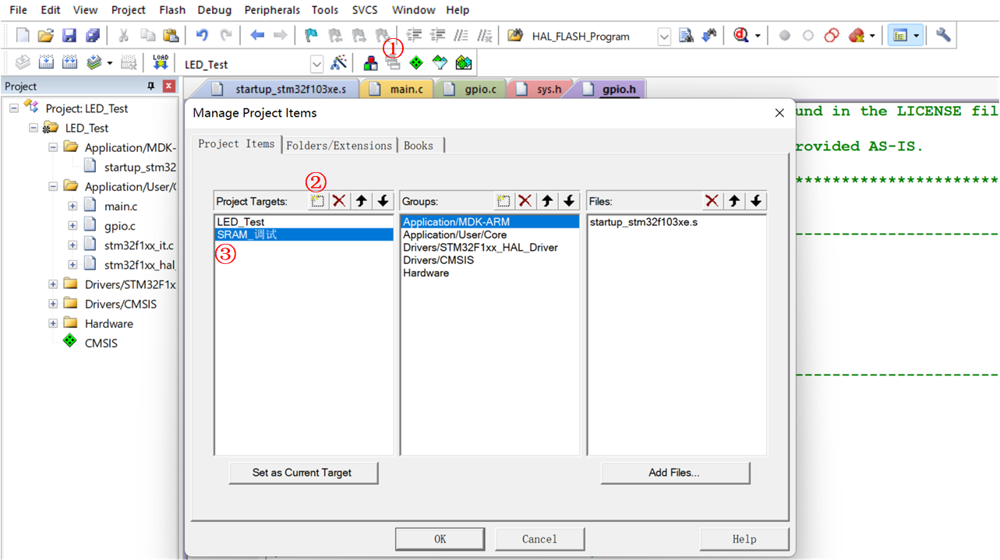
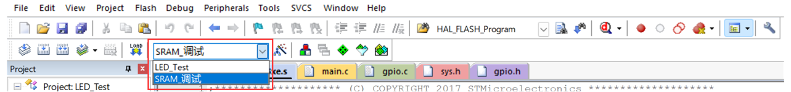
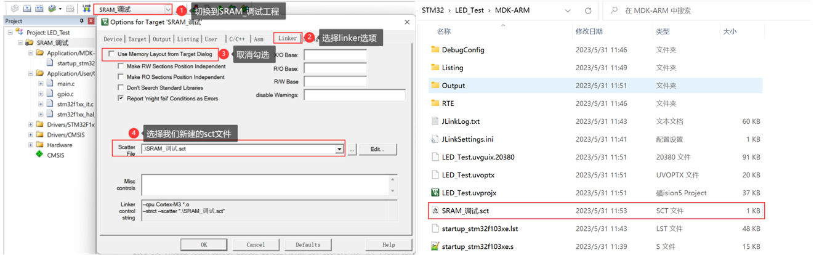
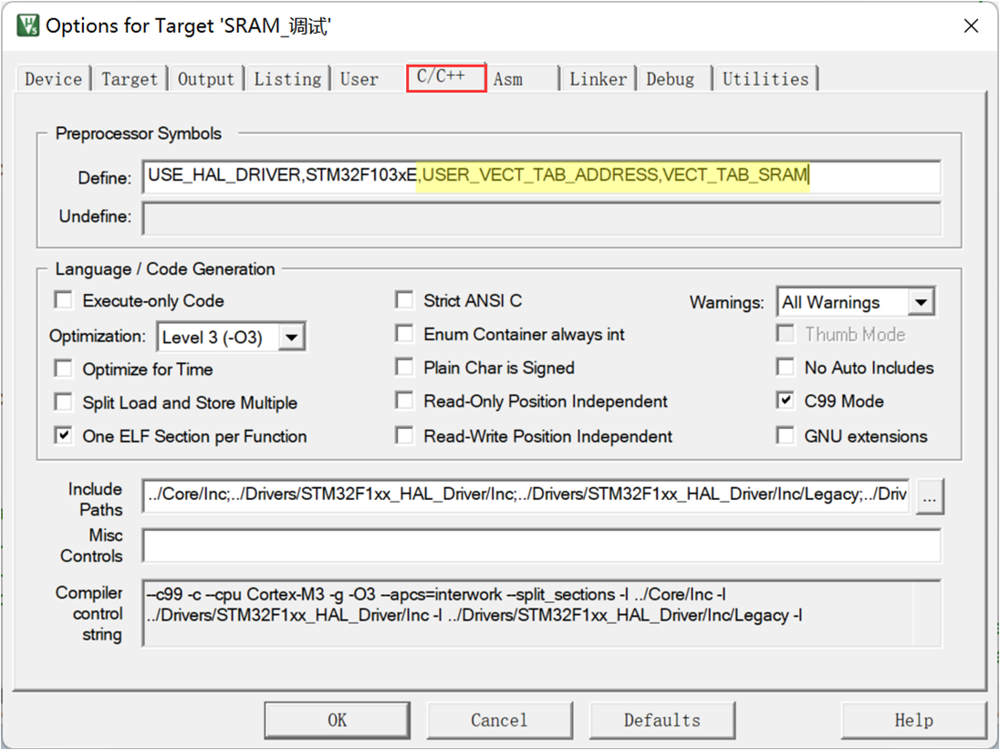
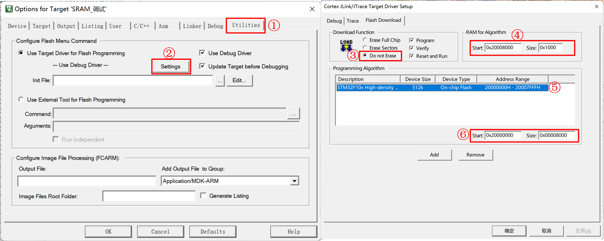
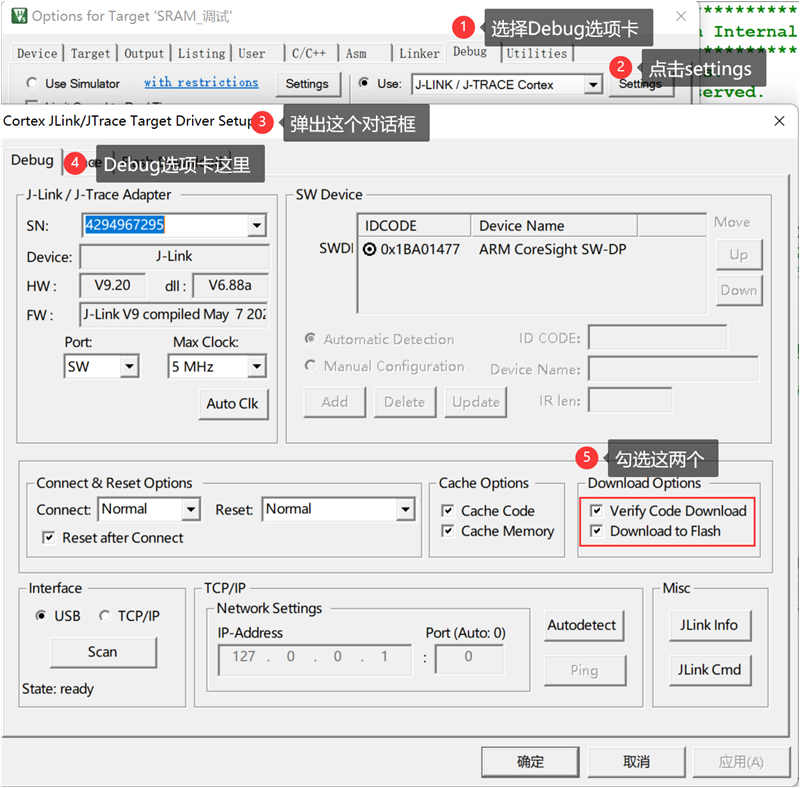
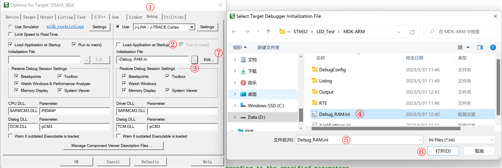
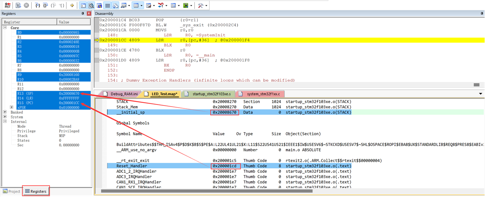
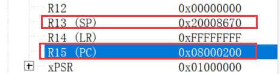

<!-- more -->

## 一、在RAM中调试代码

### 1. 简介

一般情况下，我们在 MDK 中编写工程应用后，调试时都是把程序下载到芯片的内部 FLASH 运行测试的，代码的 CODE 及 RW-data 的内容被写入到内部 FLASH 中存储。但在某些应用场合下却不希望或不能修改内部 FLASH 的内容，这时就可以使用 RAM 调试功能了，它的本质是把原来存储在内部 FLASH 的代码 (CODE 及 RW-data 的内容) 改为存储到 SRAM 中 (内部 SRAM 或外部 SDRAM 均可)，芯片复位后从 SRAM 中加载代码并运行。 

### 2. 优缺点

把代码下载到 RAM 中调试有如下优点 ：

（1）下载程序非常快。 RAM 存储器的写入速度比在内部 FLASH 中要快得多，且没有擦除过程，因此在 RAM 上调试程序时程序几乎是秒下的，对于需要频繁改动代码的调试过程，能节约很多时间，省去了烦人的擦除与写入 FLASH 过程。另外， STM32 的内部 FLASH 可擦除次数为 1 万次，虽然一般的调试过程都不会擦除这么多次导致 FLASH 失效，但这确实也是一个考虑使用 RAM 的因素。

（2）不改写内部 FLASH 的原有程序。

（3）对于内部 FLASH 被锁定的芯片，可以把解锁程序下载到 RAM 上，进行解锁。

相对地，把代码下载到 RAM 中调试有如下缺点：

（1）存储在 RAM 上的程序掉电后会丢失，不能像 FLASH 那样保存。

（2）若使用 STM32 的内部 SRAM 存储程序，程序的执行速度与在 FLASH 上执行速度无异，但SRAM 空间较小，所以应用程序的大小受到一定的限制。  

（3）若使用外部扩展的 SRAM 存储程序，程序空间非常大，但 STM32 读取外部 SRAM 的速度比读取内部 FLASH 慢，这会导致程序总执行时间增加，因此在外部 SRAM 中调试的程序无法完美仿真在内部 FLASH 运行时的环境。另外，由于 STM32 无法直接从外部 SRAM 中启动且应用程序复制到外部 SRAM 的过程比较复杂 (下载程序前需要使 STM32 能正常控制外部 SRAM)，所以在很少会在 STM32 的外部 SRAM 中调试程序。  

## 二、在RAM中调试实现

实现在RAM中调试的主要步骤如下：

（1）在原工程的基础上创建一个调试版本；

（2）修改分散加载文件，使链接器把代码分配到内部 SRAM 空间；

（3）添加宏修改 STM32 的向量表地址；

（4）修改仿真器和下载器的配置，使程序能通过下载器存储到内部 SRAM；

（5）根据使用情况选择是否需要使用仿真器命令脚本文件 *.ini；

（6）尝试给 SRAM 下载程序或仿真调试。  

### 1. 创建工程的调试版本  

由于在 SRAM 中运行的代码一般只是用于调试，调试完毕后，在实际生产环境中仍然使用在内部 FLASH 中运行的代码，因此我们希望能够便捷地在调试版和发布版代码之间切换。 MDK 的“Manage Project Items”可实现这样的功能，使用它可管理多个不同配置的工程，如下图：



点击“Manage Project Items”按钮，在弹出对话框左侧的“Project Target”一栏包含了原工程的名字，如图中的原工程名为“stm32f103-prj”，右侧是该工程包含的文件。为了便于调试，我们在左侧的“Project Target”一栏添加一个工程名，如图中输入“SRAM\_调试”，输入后点击 OK 即可，这个“SRAM\_调试”版本的工程会复制原“LED\_Test”工程的配置，后面我们再进行修改。  

当需要切换工程版本时，点击 MDK 工程名的下拉菜单可选择目标工程，在不同的工程中，所有**配置都是独立的**，例如芯片型号、下载配置等等，但**如果两个工程共用了同一个文件，对该文件的修改会同时影响两个工程**，例如这两个工程都使用同一个 main 文件，我们在 main 文件修改代码，两个工程都会被修改。  



### 2. 配置分散加载文件  

这一部分配置的是SRAM\_调试工程的sct文件。本工程的分散加载只使用手动编辑的 sct 文件配置，不使用 MDK 的对话框选项配置，在“【Options for Target】&rarr;【linker】”的选项  



为了防止“LED_Test”工程的分散加载文件被影响，我们在工程新建了一个名为“SRAM\_调试.sct”的文件，并在上图中把它配置为“SRAM\_调试”工程专用的分散加载文件，该文件的内容如下：

```c
; *************************************************************
; *** Scatter-Loading Description File generated by uVision ***
; *************************************************************

LR_IROM1 0x20000000 0x00008000{   ; load region size_region
  ER_IROM1 0x20000000 0x00008000{ ; load address = execution address
   *.o (RESET, +First)
   *(InRoot$$Sections)
   .ANY (+RO)
  }
  RW_IRAM1 0x20008000 0x00008000{ ; RW data
   .ANY (+RW +ZI)
  } 
}
```

在这个分散加载文件配置中，把原本分配到内部 FLASH 空间的加载域和执行域改到了以地址0x20000000 开始的 32KB(0x00008000) 空间，而 RW data 空间改到了以地址 0x20008000 开始的32KB 空间 (0x00008000)。也就是说，它把 STM32 的内部 SRAM 分成了虚拟 ROM 区域以及 RWdata 数据区域，链接器会根据它的配置给工程中的各种内容分配到 SRAM 地址。

在具体的应用中，虚拟 ROM 及 RW 区域的大小可根据自己的程序定制，配置完毕编译工程后可在 map 文件中查看具体的空间地址分配。    

### 3. 配置中断向量表

这一部分SRAM\_调试工程的中断向量表。由于 startup_stm32f13xe.s 文件中的启动代码不是指定到绝对地址的，经过它由链接器决定应存储到内部 FLASH 还是 SRAM，所以 SRAM 版本工程中的启动文件不需要作任何修改。

重点在于启动文件定义的中断向量表被存储到内部 FLASH 和内部 SRAM 时，这两种情况对内核的影响是不同的，内核会根据它的“向量表偏移寄存器 VTOR”配置来获取向量表，即中断服务函数的入口。 VTOR 寄存器是由启动文件中 Reset_Handle 中调用的库函数 SystemInit 配置的：

```c
void SystemInit (void)
{
#if defined(STM32F100xE) || defined(STM32F101xE) || defined(STM32F101xG) || defined(STM32F103xE) || defined(STM32F103xG)
  #ifdef DATA_IN_ExtSRAM
    SystemInit_ExtMemCtl(); 
  #endif /* DATA_IN_ExtSRAM */
#endif 

  /* Configure the Vector Table location -------------------------------------*/
#if defined(USER_VECT_TAB_ADDRESS)
  SCB->VTOR = VECT_TAB_BASE_ADDRESS | VECT_TAB_OFFSET; /* Vector Table Relocation in Internal SRAM. */
#endif /* USER_VECT_TAB_ADDRESS */
}
```

我们全局搜索一下宏USER_VECT_TAB_ADDRESS，这个宏是决定是否配置中断向量表位置的，全局搜索一下发现这个宏在工程中并没有定义，所以要想在代码中更改中断向量表，首先要定义这个宏。而上边的SCB&rarr;VTOR就是配置中断向量表的位置的，我们看一下决定它的值的几个宏：

```c
#if defined(USER_VECT_TAB_ADDRESS)
/*!< Uncomment the following line if you need to relocate your vector Table
     in Sram else user remap will be done in Flash. */
/* #define VECT_TAB_SRAM */
#if defined(VECT_TAB_SRAM)
#define VECT_TAB_BASE_ADDRESS   SRAM_BASE       /*!< Vector Table base address field.
                                                     This value must be a multiple of 0x200. */
#define VECT_TAB_OFFSET         0x00000000U     /*!< Vector Table base offset field.
                                                     This value must be a multiple of 0x200. */
#else
#define VECT_TAB_BASE_ADDRESS   FLASH_BASE      /*!< Vector Table base address field.
                                                     This value must be a multiple of 0x200. */
#define VECT_TAB_OFFSET         0x00000000U     /*!< Vector Table base offset field.
                                                     This value must be a multiple of 0x200.
```

从这里可以看到，VECT_TAB_BASE_ADDRESS是中断向量表的基地址，它受到宏VECT_TAB_SRAM的影响，若定义了VECT_TAB_SRAM，那么中断向量表的基地址就从SRAM开始，要是没有定义这个宏，那么中断向量表基地址就在FLASH中。代码中根据是否有宏定义 VECT_TAB_SRAM 来决定 VTOR 的配置，默认情况下代码中没有定义宏 VECT_TAB_SRAM，所以 VTOR 默认情况下指示向量表是存储在内部 FLASH 空间的。

由于本工程的分散加载文件配置，在启动文件中定义的中断向量表会被分配到 SRAM 空间，所以我们要定义这个宏，使得 SystemInit 函数修改 VTOR 寄存器，向内核指示向量表被存储到内部SRAM 空间了，如下图：



在“【Options for Target】&rarr;【 c/c++ ->Define】”框中输入宏 USER_VECT_TAB_ADDRESS和VECT_TAB_SRAM，注意它与其它宏之间要使用英文逗号分隔开。  

```c
USE_HAL_DRIVER,STM32F103xE,USER_VECT_TAB_ADDRESS,VECT_TAB_SRAM
```

配置完成后重新编译工程，即可生成存储到 SRAM 空间地址的代码指令。相对于直接在文件中定义宏，使用这种方式定义该宏的好处是，若切换回 FLASH 版本的 LED 工程，该工程不受影响，若把宏定义到文件中，那么由于两个版本共用文件而受到影响。 

### 4. 修改下载配置  

#### 4.1 下载配置

得到 SRAM 版本的代码指令后，为了把它下载到芯片的 SRAM 中，还需要修改下载器的配置，【Options for Target】&rarr;【Utilities】&rarr;【Settings】”中的选项。    



这个配置对话框原本是用于设置芯片内部 FLASH 信息的，当我们点击 MDK 的  Download （LOAD下载）按钮或者 Start/Stop Debug Session（Debug调试）按钮的时候，它会从此处加载配置然后下载程序到 FLASH 中，而在上图中我们把它的配置修改成下载到内部 SRAM 了，各个配置的解释如下：  

③、把“Download Function”中的擦除选项配置为“Do not Erase”。这是因为数据写入到内部SRAM 中不需要像 FLASH 那样先擦除后写入。在本工程中，如果我们不选择“Do not Erase”的话，会因为擦除过程导致下载出错。  

④、“RAM for Algorithm”一栏是指“编程算法” (Programming Algorithm) 可使用的 RAM 空间，下载程序到 FLASH 时运行的编程算法需要使用 RAM 空间，在默认配置中它的首地址为0x20000000，即内部 SRAM 的首地址，但由于我们的分散加载文件配置， 0x20000000 地址开始的 32KB 实际为虚拟 ROM 空间，实际的 RAM 空间是从地址 0x20008000 开始的，所以这里把算法 RAM 首地址更改为本工程中实际作为 RAM 使用的地址。若编程算法使用的 RAM 地址与虚拟 ROM 空间地址重合的话，会导致下载出错。   

⑤和⑥、“Programming Algorithm”一栏中是设置内部 FLASH 的编程算法，编程算法主要描述了FLASH 的地址、大小以及扇区等信息， MDK 根据这些信息把程序下载到芯片的 FLASH中，不同的控制器芯片一般会有不同的编程算法。由于 MDK 没有内置 SRAM 的编程算法，所以我们直接在原来的基础上修改它的基地址和空间大小，把它改成虚拟 ROM 的空间信息。  

从这个例子可了解到，这里的配置是跟我们的分散加载文件的实际 RAM 空间和虚拟 ROM 空间信息是一致的，若分散加载文件采用不同的配置，这个下载选项也要作出相应的修改。  

这个配置是针对程序下载的，配置完成后点击 MDK 的 按钮（下载、 LOAD），程序会被下载到 STM32 的内部 SRAM 中。根据前面介绍的理论知识，若给 STM32 的 BOOT0 和 BOOT1 引脚都接到高电平，那么 STM32 将被设置为 SRAM 启动，按下板子的复位键后，程序会从内部 SRAM中加载运行。

野火的文档中有这样一段说明：

> **注意**：非常遗憾的是，我们在各种平台做了大量测试，发现程序虽然被下载到 SRAM 了，但复位后 STM32 的程序 PC 指针和 SP 指针却莫名奇妙地指向非预设的 ResetHandler 及栈顶位置，导致程序无法正常运行（测试时，均有使用电压表直接测量 STM32 芯片 BOOT 引脚的电压确认它们都是高电平，后面小节有给出测试得的不正常情况下， PC 和 SP 指针的值）。另外，当使用STM32F429 芯片时，根据前面介绍的理论作类似的配置，程序下载到 SRAM 后，完全能正常运行，而在 STM32F1 系列各型号的芯片上，均无法实现。 

 我自己测试了一下，确实如此，我使用的是STM32F103ZET6的芯片，下载后无法运行。

#### 4.2 仿真器调试辅助

由于直接下载到芯片上复位运行的方式无法正常工作，所以下面介绍一种解决办法，即使用仿真器强制设置 PC 指针及 SP 指针。  

##### 4.2.1 指定 PC 及 SP 指针值的仿真器配置  

前面介绍的下载配置主要指定了程序的下载位置，使得程序能够加载到 SRAM，而由于实际应用在 SRAM 启动方式时 PC 和 SP 指针加载不正常，因此需要使用仿真器辅助修改 PC 及 SP 指针，然后在仿真器的控制下在 SRAM 中调试运行，即在 MDK 中使用 Start/Stop Debug Session 按钮 (调试、 debug) 时进行的硬件在线调试、单步运行等功能，该功能与在 FLASH 中的硬件调试一样，但针对本实验的在SRAM 运行环境，需要对配置进行修改。   

- （1）添加“Download options”配置

在“【Options for Target】&rarr;【Debug】&rarr;【Settings】”中进行勾选“Verify Code Download”及“Download to FLASH”配置：



- （2）添加仿真器加载指令

在“【Options for Target】&rarr;【Debug】”对话框中取消勾选“LoadApplication at startup”选项。点击“Initialization File”文本框右侧的文件浏览按钮，在弹出的对话框中新建一个名为“Debug_RAM.ini”的文件，新建好后，我们选中打开即可。 



打开后，我么可以点击图中的⑦ Edit按钮，然后就会在MDK中打开这个Debug文件，打开后我们修改为如下内容：

```ini
/******************************************************************************/
/* Debug_RAM.ini: Initialization File for Debugging from Internal RAM         */
/******************************************************************************/
/* This file is part of the uVision/ARM development tools.                    */
/* Copyright (c) 2005-2014 Keil Software. All rights reserved.                */
/* This software may only be used under the terms of a valid, current,        */
/* end user licence from KEIL for a compatible version of KEIL software       */
/* development tools. Nothing else gives you the right to use this software.  */
/******************************************************************************/

FUNC void Setup (void) {
  SP = _RDWORD(0x20000000);         // 设置栈指针SP，把0x20000000地址中的内容赋值到SP。
  PC = _RDWORD(0x20000004);         // 设置程序指针PC，把0x20000004地址中的内容赋值到PC。
  _WDWORD(0xE000ED08, 0x20000000);  // Setup Vector Table Offset Register
}

LOAD %L INCREMENTAL                 // 下载axf文件到RAM
Setup();                            // 调用上面定义的setup函数设置运行环境		

//g, main                           // 跳转到main函数，本示例调试时不需要从main函数执行，注释掉了，程序从启动代码开始执行

```

上述配置过程是控制 MDK 执行仿真器的脚本文件 Debug_RAM.ini，而该脚本文件在下载了程序到 SRAM 后，初始化了 SP 指针 (即 MSP) 和 PC 指针分别指向了 0x20000000 和 0x20000004，这样的操作强制芯片上电后从该地址获取 SP 和 PC 的内容，而根据程序配置，该地址分别存储了栈顶和 ResetHandler 的地址值。    

有了这样的配置，就能解决 STM32F1 系列芯片 SRAM 启动方式 SP 和 PC 指针乱指的问题了，点击调试按钮即可启动仿真过程，由于强制配置了指针，所以即使 BOOT0 和 BOOT1 引脚不设置为 SRAM 启动也能正常仿真，但点击下载按钮把程序下载到 SRAM 然后**按复位依然是不能全速运行的** (这种运行方式脱离了仿真器的控制， SP 和 PC 指针无法被初始化指向正确的位置)。  

经过这样的配置后，**硬件仿真时与在 FLASH 仿真程序基本无异、单步运行、全速运行以及查看各种变量值等**，但由于上述仿真加载的指令只在点击调试按钮后才会运行一次，所以在调试时如果点击复位，程序的 SP 和 PC 仍然会指向错误的位置，所以每次希望复位程序时，都需要重新点击调试按钮加载调试。  

上述 Debug_RAM.ini 文件是从 STM32F1 的 MDK 芯片包里复制过来的，感兴趣的话可以到 MDK安装目录搜索该文件名，该文件的语法可以从 MDK 的帮助手册的“【µVision User’ s Guide】&rarr;【DebugCommands】”章节学习。  

##### 4.2.2 关于复位后 PC 和 SP 指针的调试情况  

为了更好地了解 RAM 调试的运行情况，在仿真时，可以点击 MDK 仿真环境左栏底部的“Registers”按钮查看内核寄存器的情况。当仿真器配置用 “ Debug_RAM.ini ”文件强制设置 SP 和 PC 寄存器的加载地址时，它们都获取到了正常的栈顶和 ResetHandler 的地址值：



从图中的 map 文件可以了解到， Reset_Handler 程序存储的地址值为 0x200001cd（PC 指针加载时会减 1，即从 0x200001cc 可加载到正常的 ResetHandler 代码），栈顶指针 \_\_initial\_sp 的地址值为0x20008670。查看图中左栏的 PC 与 SP 寄存器的值，正好是 0x200001CC 和 0x20008670，也正因如此，使用这种方式调试时， SRAM 中的程序能正常运行。 

这个时候我们点击一下调试界面左上角的 RST 按钮，我们会发现PC指针直接跳到了FLASH中的地址：



所以我们在SRAM中调试的时候，通过Debug来运行下载到SRAM中的代码的时候，我们不可以使用RST来让程序回到刚启动的时候。

我们在刚启动调试界面的时候，点击一下全速运行，看一下会有什么现象。我自己的测试结果就是点击完全速运行后，单片机开始跑编写的流水灯程序，可以正常运行，我们点击一下左上角的RST复位一下程序，然后再全速运行的话，这个时候就会变成FLASH中的代码了，要想重新运行SRAM中的代码，只能退出仿真，重新进入Debug界面。

### 5. 运行SRAM中程序

这里来总结一下吧，总结一下那些要做，哪些不能做。

- 我们需要做的事

（1）按照上边4.1进行下载配置；

（2）设置仿真器调试辅助，自定义一个调试脚本并加载；

（3）点击Debug按钮，进入调试界面，此时工程代码会**自动被烧录**到STM32的内部SRAM中，然后我们**点击全速运行，或者直接退出调试界面**，STM32就会开始运行SRAM中的程序。

- 我们不能做的事

（1）进入调试界面后，不要点击RST，想要重新运行，那就关闭调试，重新再打开，否则就会运行FLASH中的代码。

（2）手动按复位按键，这个我们也不能做，因为一旦按了，SRAM中的程序就会丢失，即便是我把BOOT[1:0]设置为从SRAM启动，也一样跑不起来SRAM中的程序。这个具体原因不清楚哎，因为复位（reset）是向MCU的复位引脚输入一个高或低电平，然后触发MCU中断。这个中断的作用就是停止跳出当前运行的程序，然后强制将MCU内部所有寄存器复写为默认状态。复位中断都是硬件中断，而且优先级是最高的。而对于断电重启，掉电以后寄存器SRAM里面的数据就会自动丢失，上电后回复默认状态。因此看上去和复位的作用是一样的。但是MCU不能用断电重启代替复位。

- 不需要做的事

（1）更改BOOT[1:0]，由于上边是通过仿真器来辅助运行SRAM中的程序，所以，这里就没必要更改BOOT[1:0]的状态了。反而改了之后就跑不动了，很神奇。

我尝试了多种途径，其实也没有发现为什么不能正常运行SRAM中的程序，总之一句话，做了上边的1、2、3、4这几个步骤后，什么都不要动，就加载自定义的调试脚本，然后点击Debug，需要调试的话，就单步调试运行，不需要调试就直接退出调试，这样就可以正常运行下载到SRAM中的代码。别的多余的操作就先不要做了，防止踩坑，跑不起来。
