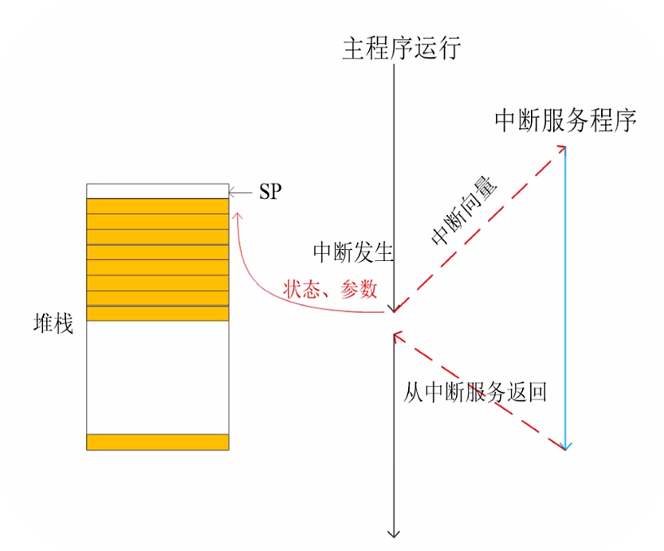
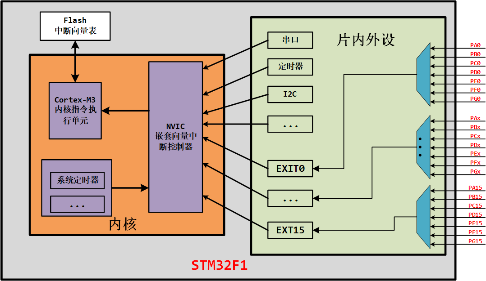
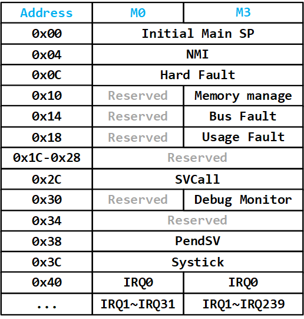
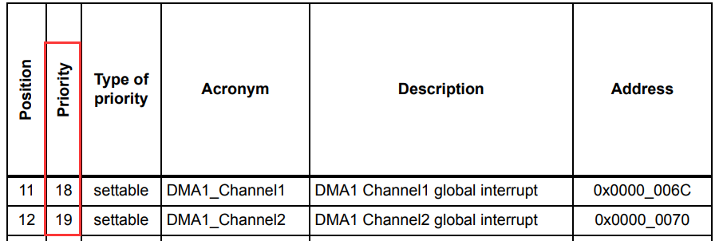

<!-- more -->

## 一、基本概念

生活中，有这样一个场景，我现在正在看电视剧，然后这个时候突然有人敲门，我该怎么做？正常我们应该是暂停电视剧，然后去开门，处理有人敲门这件事，这件事处理完后，回到电视机前，继续看电视剧，这就是一个中断。

在处理器中，中断是一个过程，即CPU在正常执行程序的过程中，遇到外部/内部的紧急事件需要处理，暂时中止当前程序的执行，转而去为处理紧急的事件，待处理完毕后再返回被打断的程序处继续往下执行。中断在计算机多任务处理，尤其是即时系统中尤为重要。比如uCOS，FreeRTOS等。

中断存在的意义就在于中断能提高CPU的效率，同时能对突发事件做出实时处理。实现程序的并行化，实现嵌入式系统进程之间的切换

## 二、中断的处理过程



- 进入中断 

（1）处理器自动保存现场到堆栈里；

（2）`{PC, xPSR, R0-R3, R12, LR}`；

（3）一旦入栈结束，ISR便可开始执行；

（4）晚到的中断会重新取ISR地址，但无需再次保存现场；

- 退出中断

（1）中断前的现场被自动从堆栈中恢复；

（2）一旦出栈完成，继续执行被中断打断的指令；

（3） 出栈的过程也可被打断，使得随时可以响应新的中断，而不再进行现场保存。

## 三、STM32F1中断体系结构




## 四、中断和优先级

### 1. 支持的中断

从[10-基础篇/01-概述/LV040-CortexM3异常.md](/sdoc/basic/overview/126b08e5d7b911b28ed9ee4c)我们知道Cortex-M3设计有256种中断，但大多数MCU都用不到这么多中断，比如STM32F103系列就只有70种异常和中断，其中前10个是系统异常， 后面60个是外部中断（我们可以查看[STM32英文参考手册](https://www.st.com/resource/en/reference_manual/rm0008-stm32f101xx-stm32f102xx-stm32f103xx-stm32f105xx-and-stm32f107xx-advanced-armbased-32bit-mcus-stmicroelectronics.pdf)的10.1.2 Interrupt and exception vectors）：

| 中断号 | 名称            | 优先级   | 优先级类 型 | 说明                                                |
| ------ | --------------- | -------- | ----------- | --------------------------------------------------- |
| -      | N/A             | N/A      | 保留        |                                                     |
| -      | Reset           | -3(最高) | 固定        | 复位                                                |
| -      | NMI             | -2       | 固定        | RCC时钟安全系统（ CSS）连接到NMI向量，不可屏蔽 中断 |
| -13    | HardFault       | -1       | 固定        | 所有类型的失效                                      |
| -12    | MemManageFault  | 0        | 可编程      | 存储器管理                                          |
| -11    | BusFault        | 1        | 可编程      | 预取指失败、存储器访问失败                          |
| -10    | UsageFault      | 2        | 可编程      | 未定义的指令和非法状态                              |
| -      | Reserved        | N/A      | N/A         | 保留                                                |
| -5     | SVCall          | 3        | 可编程      | 执行系统服务调用指令（ SVC）引发的异常              |
| -4     | Debug Monitor   | 4        | 可编程      | 调试监视器（断点、数据观察点或外部调试请求）        |
| -      | Reserved        | N/A      | N/A         | N/A                                                 |
| -2     | PendSV          | 5        | 可编程      | 为系统设备而设置的“可挂起请求”                      |
| -1     | SysTick         | 6        | 可编程      | 系统滴答定时器                                      |
| 0      | WWDG            | 7        | 可编程      | 窗口看门狗中断                                      |
| 1      | PVD             | 8        | 可编程      | 连接EXTI的电源电压检测（ PVD）中断                  |
| …      | …               | …        | 可编程      | …                                                   |
| 58     | DMA2_Channel3   | 65       | 可编程      | DMA2通道3全局中断                                   |
| 59     | DMA2_Channel4_5 | 66       | 可编程      | DMA2通道4、 5全局中断                               |

#### 4.2 中断和异常向量表

Cortex-M0内核可以处理15个内部异常，和19个外部中断。STM32F103实际上只使用了6个内部异常和19个外部中断。对于互联型产品，可以有20个。当异常或中断发生时，处理器会把PC设置为一个特定地址，这一地址就称为异常向量。每一类异常源都对应一个特定的入口地址，这些地址按照优先级排列以后就组成一张异常向量表。



当异常或中断发生时，处理器会把PC设置为一个特定地址，这一地址就称为异常向量。每一类异常源都对应一个特定的入口地址，这些地址按照优先级排列以后就组成一张异常向量表。

在 HAL 库工程中的 startup_stm32f103xe.s 启动文件中，定义了中断向量表：

```assembly
__Vectors       DCD     __initial_sp               ; Top of Stack
                DCD     Reset_Handler              ; Reset Handler
                DCD     NMI_Handler                ; NMI Handler
                DCD     HardFault_Handler          ; Hard Fault Handler
                DCD     MemManage_Handler          ; MPU Fault Handler
                DCD     BusFault_Handler           ; Bus Fault Handler
                DCD     UsageFault_Handler         ; Usage Fault Handler
                DCD     0                          ; Reserved
                DCD     0                          ; Reserved
                DCD     0                          ; Reserved
                DCD     0                          ; Reserved
                DCD     SVC_Handler                ; SVCall Handler
                DCD     DebugMon_Handler           ; Debug Monitor Handler
                DCD     0                          ; Reserved
                DCD     PendSV_Handler             ; PendSV Handler
                DCD     SysTick_Handler            ; SysTick Handler

                ; External Interrupts
                DCD     WWDG_IRQHandler            ; Window Watchdog
                DCD     PVD_IRQHandler             ; PVD through EXTI Line detect
                DCD     TAMPER_IRQHandler          ; Tamper
                DCD     RTC_IRQHandler             ; RTC
                ; 中间部分省略
                DCD     DMA2_Channel4_5_IRQHandler ; DMA2 Channel4 & Channel5
__Vectors_End
```

可以看到第2~6行，为10个系统异常，剩下的全为外部中断。 同时这里还定义了所有的中断处理函数名字， 当外设产生中断时，则跳到中断向量表中对应中断处理函数位置，比如发生RTC中断事件，则跳到第22行执行“ RTC_IRQHandler()”函数内容。STM32F103的异常和中断，基于Cortex-M3修改而来，前面的系统异常部分几乎没有变化，外部中断则对应不同的外设。 

> 向量化处理中断的好处
>
> 处理方式需要软件去完成，采用向量表处理异常，M0处理器会从存储器的向量表中，自动定位异常的程序入口。从发生异常到异常的处理中间的时间被缩减。

> 中断和异常的区别：
>
> ​    中断是微处理器外部发送的，通过中断通道送入处理器内部，一般是硬件引起的，比如串口接收中断，而异常通常是微处理器内部发生的，大多是软件引起的，比如除法出错异常，特权调用异常等待。不管是中断还是异常，微处理器通常都有相应的中断/异常服务程序。

#### 4.3 优先级分组与设置

同样， STM32F103 也继承了 Cortex-M3 的中断优先级规则，因为中断少了很多， 中断优先级也用不了那么多， 只使用了 PRI_n 的 Bits[7:0] 中的 Bits[7:4] 设置优先级， 因此优先级分组为下表所示。

| PRIGROUP | 抢占优先级位 | 子优先级位 | 抢占优先级级数 | 子优先级级数 |
| :------: | :----------: | :--------: | :------------: | :----------: |
|    3     |    [7:4]     |    None    |       16       |     None     |
|    4     |    [7:5]     |    [4]     |       8        |      2       |
|    5     |    [7:6]     |   [5:4]    |       4        |      4       |
|    6     |     [7]      |   [6:4]    |       2        |      8       |
|    7     |     None     |   [7:4]    |      None      |      16      |

可见STM32F103系列最多有16级可编程优先级， STM32F103不使用PRIGROUP来命名分组， 而采用 NVIC_PRIORITYGROUP_x  的方式命名，即NVIC_PRIORITYGROUP_0 对 应 PRIGROUP 为 7 ， 在“ stm32f1xx_hal_cortex.h ”有相关定义 ：

```c
/** @defgroup CORTEX_Exported_Constants CORTEX Exported Constants
  * @{
  */

/** @defgroup CORTEX_Preemption_Priority_Group CORTEX Preemption Priority Group
  * @{
  */
#define NVIC_PRIORITYGROUP_0         0x00000007U /*!< 0 bits for pre-emption priority
                                                      4 bits for subpriority */
#define NVIC_PRIORITYGROUP_1         0x00000006U /*!< 1 bits for pre-emption priority
                                                      3 bits for subpriority */
#define NVIC_PRIORITYGROUP_2         0x00000005U /*!< 2 bits for pre-emption priority
                                                      2 bits for subpriority */
#define NVIC_PRIORITYGROUP_3         0x00000004U /*!< 3 bits for pre-emption priority
                                                      1 bits for subpriority */
#define NVIC_PRIORITYGROUP_4         0x00000003U /*!< 4 bits for pre-emption priority
  
```

通常中断优先级分组只会设置一次， 它针对的是系统中所有的中断。 后续设置某个中断的中断优先级时， 只需要在这个组规定的抢占优先级数和子优先级级数范围内分配优先级级数。 后续代码中，不应该再修改中断优先级分组，否则导致中断顺序不按预期触发。STM32CubeMX生成的工程，默认将设置中断优先级分组放在了“ HAL_Init()”里， 如下所示，调用“HAL_NVIC_SetPriorityGrouping()”函数设置中断优先级分组。  

```c
HAL_StatusTypeDef HAL_Init(void)
{
  // 中间部分省略
  /* Set Interrupt Group Priority */
  HAL_NVIC_SetPriorityGrouping(NVIC_PRIORITYGROUP_4);
  // 中间部分省略
  return HAL_OK;
}
```

这里默认设置的优先级分组为 NVIC_PRIORITYGROUP_4 ， 则后续使用“ HAL_NVIC_SetPriority() ”函数设置优先级时，抢占优先级的范围是 0~15 ， 子优先级的值只能选择 0 。  

“ HAL_NVIC_SetPriority() ”函数需要传入三个参数， 参数IRQn是中断号。后两个是抢占优先级级数和子优先级级数，注意结合中断分组设置范围。   

```c
void HAL_NVIC_SetPriority(IRQn_Type IRQn, uint32_t PreemptPriority, uint32_t SubPriority)
{ 
  uint32_t prioritygroup = 0x00U;
  
  /* Check the parameters */
  assert_param(IS_NVIC_SUB_PRIORITY(SubPriority));
  assert_param(IS_NVIC_PREEMPTION_PRIORITY(PreemptPriority));
  
  prioritygroup = NVIC_GetPriorityGrouping();
  
  NVIC_SetPriority(IRQn, NVIC_EncodePriority(prioritygroup, PreemptPriority, SubPriority));
}
```

中断号我们可以查看[STM32英文参考手册]([STM32F101xx, STM32F102xx, STM32F103xx, STM32F105xx and STM32F107xx advanced Arm®-based 32-bit MCUs - Reference manual](https://www.st.com/resource/en/reference_manual/rm0008-stm32f101xx-stm32f102xx-stm32f103xx-stm32f105xx-and-stm32f107xx-advanced-armbased-32bit-mcus-stmicroelectronics.pdf))的10.1.2 Interrupt and exception vectors一节中Table 61 - Table 63中的中断号：



#### 4.4 优先级执行情况

在设置好优先级之后，不同优先级的中断同时到来的时候，STM32是怎么执行的？

（1）假设中断A的抢占优先级比中断B的抢占优先级高，两个中断同时发生，那么中断A优先执行。

（2）假设中断A的抢占优先级和中断B的抢占优先级一样，两个中断同时发生，那么子优先级高的中断优先执行。

（3）假设中断A的抢占优先级比中断B的抢占优先级高，中断B先发生，随后A也发生，那么将暂停中断B，先执行中断A， A执行完后，再回来执行中断B，最后执行主程序，这种效果即中断嵌套。

（4）假设中断A的抢占优先级和中断B的抢占优先级一样，中断A的子优先级比中断B的子优先级高，中断B先发生，随后A也发生，那么中断A将等待中断B执行完后，才会执行中断A，即**子优先级不能中断嵌套**。

（5）假设中断A的抢占优先级和中断B的抢占优先级一样，且子优先级也一样，两个中断同时发生，那么根据[STM32英文参考手册](https://www.st.com/resource/en/reference_manual/rm0008-stm32f101xx-stm32f102xx-stm32f103xx-stm32f105xx-and-stm32f107xx-advanced-armbased-32bit-mcus-stmicroelectronics.pdf)的10.1.2 Interrupt and exception vectors一节中Table 61 - Table 63中中断排布的顺序，排在前面的先执行。

总结中断是否会优先执行依据：**首先是抢占先式优先级等级，其次是子优先级等级，只有抢占优先级才可能出现中断嵌套**。  
