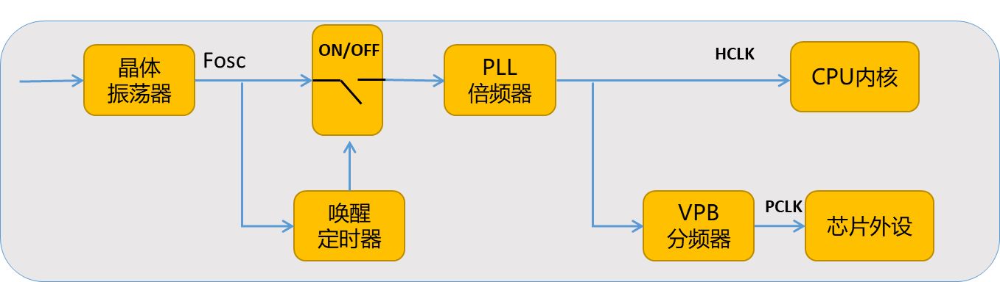
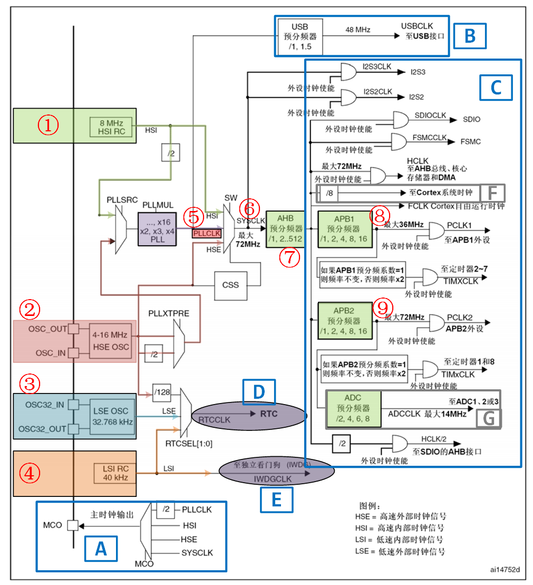
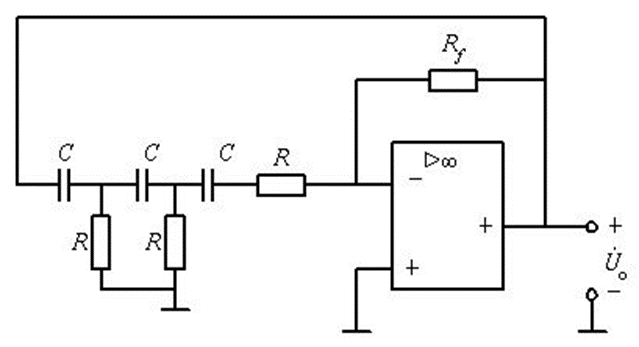
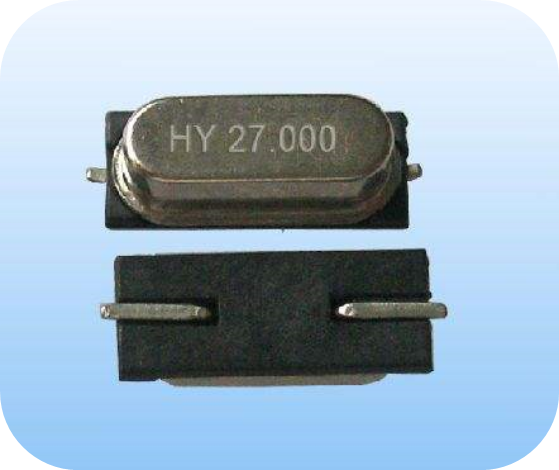

<!-- more -->

## 一、STM32时钟树概述

### 1. 时钟系统

时钟系统是由振荡器（信号源）、定时唤醒器、分频器等组成的电路。常用的信号源有晶体振荡器和RC振荡器。

时钟是嵌入式系统的脉搏，处理器内核在时钟驱动下完成指令执行，状态变换等动作，外设部件在时钟的驱动下完成各种工作，比如串口数据的发送、A/D转换、定时器计数等等。因此时钟对于计算机系统是至关重要的，通常时钟系统出现问题也是致命的，比如振荡器不起振、振荡不稳、停振等。

### 2. 多时钟源？

时钟系统是 CPU 的脉搏，就像人的心跳一样。所以时钟系统的重要性就不言而喻了。 STM32F103的时钟系统比较复杂，不像简单的51单片机一个系统时钟就可以解决一切。那么采用一个系统时钟不是很简单吗？为什么 STM32 要有多个时钟源呢？ 首先 STM32 本身非常复杂，外设非常的多，但是并不是所有外设都需要系统时钟这么高的频率，比如看门狗以及 RTC 只需要几十 k 的时钟即可。同一个电路，时钟越快功耗越大，同时抗电磁干扰能力也会越弱，所以对于较为复杂的 MCU 一般都是采取多时钟源的方法来解决这些问题。  

在 [STM32中文参考手册](https://www.stmcu.com.cn/Designresource/detail/localization_document%20/710001) 的 6.2 时钟 这一节中详细介绍了STM32的时钟系统以及各个相关寄存器。

### 3. 锁相环

锁相环是自动控制系统中常用的一个反馈电路， 在 STM32 主控中，锁相环的作用主要有两个部分：输入时钟净化和倍频。 前者是利用锁相环电路的反馈机制实现，后者我们用于使芯片在更高且频率稳定的时钟下工作。  具体的原理这里就先不深究了。

## 二、时钟树分析

### 1. 整体框图

 [STM32中文参考手册](https://www.stmcu.com.cn/Designresource/detail/localization_document%20/710001) 的 6.2 时钟 这一节的 图8 时钟树：

对于 STM32F1，输入时钟源（Input Clock）主要包括 HSI， HSE， LSI， LSE。其中，从时钟频率来分可以分为高速时钟源和低速时钟源，其中 HSI、 HSE 高速时钟， LSI 和 LSE 是低速时钟。从来源可分为外部时钟源和内部时钟源，外部时钟源就是从外部通过接晶振的方式获取时钟源，其中 HSE 和 LSE 是外部时钟源；其他是内部时钟源，芯片上电即可产生，不需要借助外部电路。 下面我们看看 STM32 的时钟源。  

- 2 个外部时钟源：  

（1）高速外部振荡器 HSE (High Speed External Clock signal)  ：外接石英/陶瓷谐振器，频率为 4MHz~16MHz。本开发板使用的是 8MHz。  

（2）低速外部振荡器 LSE (Low Speed External Clock signal)  ：外接 32.768kHz 石英晶体，主要作用于 RTC 的时钟源。  

- 2 个内部时钟源：  

（1）高速内部振荡器 HSI(High Speed Internal Clock signal)：由内部 RC 振荡器产生，频率为 8MHz

（2）低速内部振荡器 LSI(Low Speed Internal Clock signal)： 由内部 RC 振荡器产生，频率为 40kHz，可作为独立看门狗的时钟源。

> Tips：芯片上电时默认由内部的 HSI 时钟启动，如果用户进行了硬件和软件的配置，芯片才会根据用户配置调试尝试切换到对应的外部时钟源。  

### 2. 序号编号的时钟

我们先来分析序号①~⑨（①~⑥属于是分析各个时钟源的去向，⑦~⑨是在分析各总线时钟的来源）：

① 、HSI 是高速内部时钟， RC 振荡器， 频率为 8MHz ，我们使用STM32CubeMX来创建工程时若未选择时钟，那么默认使用的就是这个。

②、 HSE 是高速外部时钟，可接石英/陶瓷谐振器，或者接外部时钟源，可以由有源晶振或者无源晶振提供。频率范围为 4MHz~16MHz。我使用的战舰V3的开发板接的是 8M 的晶振。当使用有源晶振时， 时钟从OSC_IN引脚进入，OSC_OUT引脚悬空，当选用无源晶振时，时钟从OSC_IN和OSC_OUT进入，并且要配谐振电容。HSE最常使用的就是8M的无源晶振。当确定PLL时钟来源的时候，HSE可以不分频或者2分频， 这个由时钟配置寄存器CFGR的位17：PLLXTPRE设置，我们一般设置为HSE不分频。  

③、LSE 是低速外部时钟，接频率为 32.768kHz 的石英晶体， 这个主要是 RTC 的时钟源。  

④、LSI 是低速内部时钟， RC 振荡器，频率为 40kHz。 独立看门狗的时钟源只能是 LSI，同时 LSI 还可以作为 RTC 的时钟源。

⑤、PLL 为锁相环倍频输出，其时钟输入源可选择为 HSI/2、 HSE 或者 HSE/2。倍频可选择为2~16 倍，但是其输出频率最大不得超过 72MHz。 从这里经过倍频后输出的时钟为PLLCLK。具体用哪个由时钟配置寄存器CFGR的位16：PLLSRC设置。 HSI是内部高速的时钟信号，频率为8M，根据温度和环境的情况频率会有漂移，一般不作为PLL的时钟来源。这里我们选HSE作为PLL的时钟来源。通过设置PLL的倍频因子，可以对PLL的时钟来源进行倍频，倍频因子可以是:[2, 3, ... ,16]， 具体设置成多少，由时钟配置寄存器CFGR的位21-18：PLLMUL[3:0]设置。我们这里一般设置为9倍频， 若上一步我们设置PLL的时钟来源为HSE=8M，那么经过PLL倍频之后的PLL时钟：PLLCLK = 8M \* 9 = 72M。 72M是ST官方推荐的稳定运行时钟，如果想超频的话，增大倍频因子即可，最高为128M。 我们这里一般设置PLL时钟：PLLCLK = 8M \* 9 = 72M。

 ⑥、SYSCLK表示系统时钟，从图中可以看出，系统时钟最高为72MHz， 从图中左侧的选择器SW可以看到来源有三个， 分别是:①内部高速时钟HSI（绿色） 、 ⑤锁相环时钟PLLCLK（紫色）和②外部高速时钟HSE（浅红） ，而锁相环时钟PLLCLK由内部高速时钟HSI或者外部高速时钟HSE， 经过分频和PLL锁相环倍频而来 。内部高速时钟HSI可直接经过选择器SW给系统时钟SYSCLK，此时系统时钟SYSCLK为8MHz； 内部高速时钟HSI先2分频，再经过选择器PLLSRC进入锁相环PLLMUL，最大倍频为16倍，得到64MHz的锁相环时钟PLLCLK给系统时钟SYSCLK。 当外部高速时钟HSE（假设外接晶振为8MHz时） 直接给选择器SW，则系统时钟SYSCLK为8MHz； 当外部高速时钟HSE（假设外接晶振为8MHz时） 直接经过选择器PLLXTPRE给PLLSRC，再经过PLLMUL 9倍频，得到72MHz的PLLCLK给系统时钟SYSCLK。具体的时钟配置寄存器CFGR的位1-0：SW[1:0]设置。 我们这里一般设置系统时钟：SYSCLK = PLLCLK = 72M。  

⑦、AHB，高速接口总线 ，由⑥SYSCLK系统时钟分频得到，最高是系统时钟的72MHz。系统时钟SYSCLK经过AHB预分频器分频之后得到时钟叫APB总线时钟，即HCLK，分频因子可以是:[1, 2, 4，...，512]， 具体的由时钟配置寄存器CFGR的位7-4 ：HPRE[3:0]设置。片上大部分外设的时钟都是经过HCLK分频得到， 至于AHB总线上的外设的时钟设置为多少，得等到我们使用该外设的时候才设置， 我们这里一般只需要设置好APB的时钟即可。我们这里一般是设置为1分频，即HCLK=SYSCLK=72M。  

⑧、APB1，外设总线1，来源于⑦高速接口总线AHB， APB1经过预分频器后输出，最终的输出时钟最高是36MHz  。APB1总线时钟PCLK1由HCLK经过低速APB预分频器得到，分频因子可以是:[1，2，4，8，16]，具体的由时钟配置寄存器CFGR的位10-8：PRRE1[2:0]决定。 PLCK1属于低速的总线时钟，最高为36M，片上低速的外设就挂载到这条总线上，比如USART2/3/4/5、SPI2/3，I2C1/2等。 至于APB1总线上的外设的时钟设置为多少，得等到我们使用该外设的时候才设置，我们这里一般就设置好APB1的时钟即可。 我们这里一般设置为2分频，即PCLK1 = HCLK/2 = 36M。

⑨、APB2，外设总线2，来源于⑦高速接口总线AHB， APB1经过预分频器后输出，最终的输出时钟最高是72MHz  。APB2总线时钟PCLK2由HCLK经过高速APB2预分频器得到，分频因子可以是:[1，2，4，8，16]，具体由时钟配置寄存器CFGR的位13-11：PPRE2[2:0]决定。 PLCK2属于高速的总线时钟，片上高速的外设就挂载到这条总线上，比如全部的GPIO、USART1、SPI1等。至于APB2总线上的外设的时钟设置为多少， 得等到我们使用该外设的时候才设置，我们这里一般就设置好APB2的时钟即可。我们这里一般设置为1分频，即PCLK2 = HCLK = 72M。

### 3. 字母编号的时钟

接着我们再来看外设的时钟，字母A~G：

A、MCO 是 STM32 的一个时钟输出 IO(PA8)，它可以选择一个时钟信号输出， 可以选择为 PLL 输出的 2 分频、 HSI、 HSE、或者系统时钟。这个时钟可以用来给外部其他系统提供时钟源。MCO是microcontroller clock output的缩写，是微控制器时钟输出引脚，在STM32 F1系列中 由 PA8复用所得， 主要作用是可以对外提供时钟，相当于一个有源晶振。MCO的时钟来源可以是：PLLCLK/2、HSI、HSE、SYSCLK， 具体选哪个由时钟配置寄存器CFGR的位26-24：MCO[2:0]决定。除了对外提供时钟这个作用之外， 我们还可以通过示波器监控MCO引脚的时钟输出来验证我们的系统时钟配置是否正确。

B、 从图中可以看出 B 处 USB 的时钟是来自 PLL 时钟源。 STM32 中有一个全速功能的 USB 模块，其串行接口引擎需要一个频率为 48MHz 的时钟源。该时钟源只能从 PLL 输出端获取（也就是只能使用PLLCLK），可以选择为 1.5 分频或者 1 分频，也就是，当需要使用 USB模块时， PLL 必须使能，并且时钟频率配置为 48MHz 或 72MHz。USB时钟是由PLLCLK经过USB预分频器得到，分频因子可以是：[1,1.5]，具体的由时钟配置寄存器CFGR的位22：USBPRE配置。 USB的时钟最高是48M，根据分频因子反推过来算，PLLCLK只能是48M或者是72M。一般我们设置PLLCLK=72M，USBCLK=48M。 USB对时钟要求比较高，所以PLLCLK只能是由HSE倍频得到，不能使用HSI倍频。  

C、这里的 C 处是指其他所有外设了。从时钟图上可以看出，其他所有外设的时钟最终来源都是 SYSCLK。 SYSCLK 通过 AHB 分频器分频后送给各模块使用。这些模块包括： 

（1）AHB 总线、内核、内存和 DMA 使用的 HCLK 时钟。

（2）通过 8 分频后送给 Cortex 的系统定时器时钟，也就是 systick 了。

（3）直接送给 Cortex 的空闲运行时钟 FCLK。

（4）送给 APB1 分频器。 APB1 分频器输出一路供 APB1 外设使用(PCLK1，最大频率 36MHz)，另一路送给定时器(Timer)2、 3、 4 倍频器使用。

（5）送给 APB2 分频器。 APB2 分频器分频输出一路供 APB2 外设使用(PCLK2，最大频率 72MHz)，另一路送给定时器(Timer)1 倍频器使用。   

D、这里是 RTC 时钟源，从图上可以看出， RTC 的时钟源可以选择 LSI， LSE，以及HSE 的 128 分频。RTC时钟可由HSE/128分频得到，也可由低速外部时钟信号LSE提供，频率为32.768KHZ，也可由低速内部时钟信号LSI提供， 具体选用哪个时钟由备份域控制寄存器BDCR的位9-8：RTCSEL[1:0]配置。

E、WDGCLK（独立看门狗） 的时钟，它来源于④内部低速时钟LSI的40kHz（橙色） 。独立看门狗的时钟由LSI提供， 且只能是由LSI提供，LSI是低速的内部时钟信号，频率为30~60KHZ直接不等，一般取40KHZ。    

F、这里其实也算是外设的时钟了，但是这里还是单独写详细一点，毕竟是笔记吗。Cortex系统时钟由HCLK 8分频得到，等于9M， Cortex系统时钟用来驱动内核的系统定时器SysTick，SysTick一般用于操作系统的时钟节拍，也可以用做普通的定时。

G、ADC时钟由PCLK2经过ADC预分频器得到，分频因子可以是[2,4,6,8]，具体的由时钟配置寄存器CFGR的位15-14：ADCPRE[1:0]决定。 很奇怪的是怎么没有1分频。ADC时钟最高只能是14M，如果采样周期设置成最短的1.5个周期的话，ADC的转换时间可以达到最短的1us。 如果真要达到最短的转换时间1us的话，那ADC的时钟就得是14M，反推PCLK2的时钟只能是：28M、56M、84M、112M， 鉴于PCLK2最高是72M，所以只能取28M和56M。

### 4. APB1与APB2

我们需要注意的是 APB1 上面连接的是低速外设，包括电源接口、备份接口、 CAN、 USB、 I2C1、 I2C2、 UART2、 UART3 等等， APB2 上面连接的是高速外设包括 UART1、 SPI1、 Timer1、 ADC1、 ADC2、所有普通 IO 口(PA~PE)、第二功能 IO 口等。居宁老师的《稀里糊涂玩 STM32》资料里面教大家的记忆方法是 2>1， APB2 下面所挂的外设的时钟要比 APB1 的高。

## 三、常见振荡器

### 1. 基本概念

振荡器是用来产生重复电子讯号的电子元件。其构成的电路叫振荡电路，能将直流电转换为具有一定频率交流信号输出的电子电路或装置。

振荡器主要分为RC，LC振荡器和晶体振荡器。RC振荡器是采用RC网络作为选频移相网络的振荡器。LC振荡器是采用LC振荡回路作为移相和选频网络的正反馈振荡器。晶体振荡器的振荡频率受石英晶体控制。

### 2. RC振荡器

RC振荡器是又电阻电容构成的振荡电路，能将直流电转换为具有一定频率交流信号输出的电子电路或装置。

**优点**：实现的成本比较低，毕竟就是一个电阻电容。

**缺点**：是由于电阻电容的精度问题所以RC振荡器的震荡频率会有误差，同时受到温度、湿度的影响。

### 3. 晶体振荡器

石英晶体振荡器，就是我们平时说的晶振，是高精度和高稳定度的振荡器，被广泛应用于彩电、计算机、遥控器等各类振荡电路中，以及通信系统中用于频率发生器、为数据处理设备产生时钟信号和为特定系统提供基准信号

**优点**：是相对来说震荡频率一般都比较稳定,同时精度也较高。

**缺点**：就是价格要稍微高点了，还有用晶体振荡器一般还需要接两个15-33pF起振电容。
