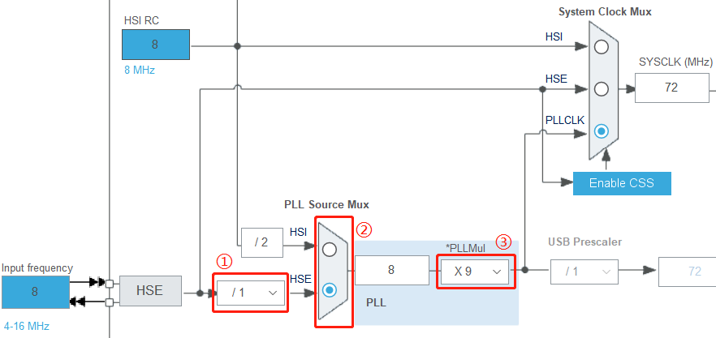
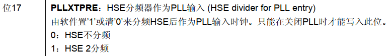
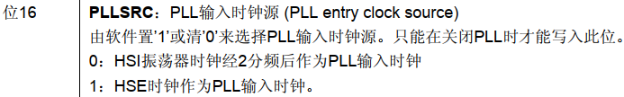
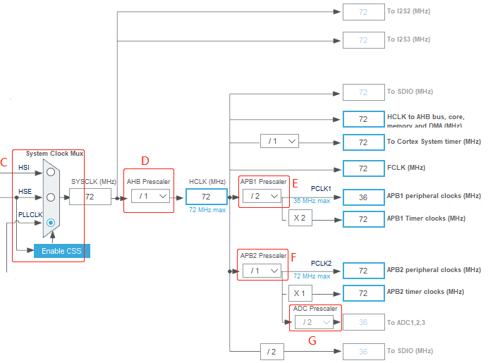
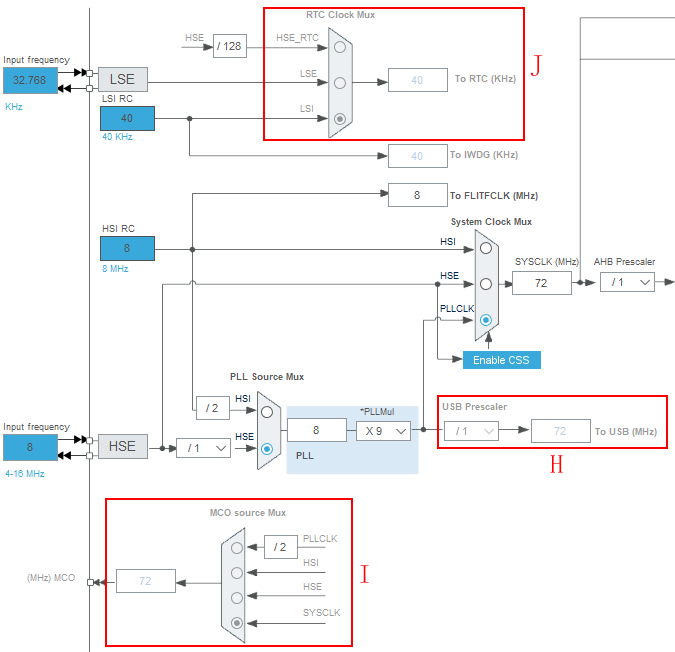
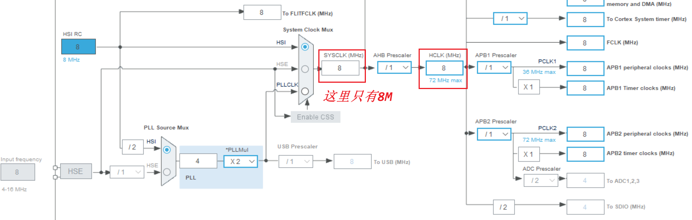
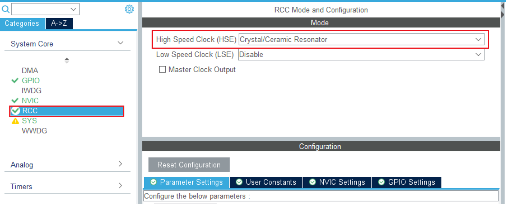
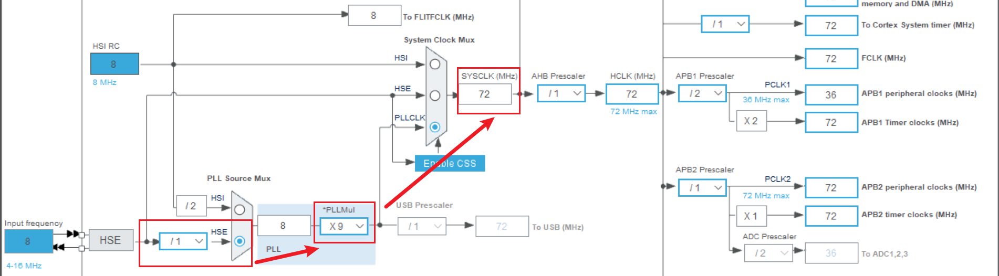

这一部分我们来详细了解一下系统时钟SYSCLK。

<!-- more -->

## 一、PLL 作为系统时钟源  

在 STM32 中， 锁相环的输出也可以作为芯片系统的时钟源。 根据STM32F1的时钟结构，使用锁相环时只需要进行三个部分的配置。为了方便查看，这里直接截取STM32CubeMX中时钟树中使用 PLL 作为系统时钟源的配置部分，  



- PLLXTPRE： HSE 分频器作为 PLL 输入 (HSE divider for PLL entry)  

即图 11.1.2.1 在标注为①的地方， 它专门用于 HSE， ST 设计它有两种方式，并把它的控制功能放在 RCC_CFGR 寄存器中， 我们引用如图：



从 F103 参考手册可知它的值有两个：一是 2 分频， 另一种是 1 分频（不分频）。  经过 HSE 分频器处理后的输出振荡时钟信号比直接输入的时钟信号更稳定。  

- PLLSRC： PLL 输入时钟源 (PLL entry clock source)  

中②表示的是 PLL 时钟源的选择器， 同样的，参考 F103 参考手册：  



它有两种可选择的输入源：设计为 HSI 的二分频时钟，或者 PLLXTPRE 处理后的 HSE 信号。  

- PLLMUL： PLL 倍频系数 (PLL multiplication factor)  

图中③所表示的配置锁相环倍频系数，同样地可以查到在 STM32F1 系列中， ST 设置它的有效倍频范围为 2~16 倍。  

结合上图，要实现 72MHz 的主频率，我们通过选择 HSE 不分频作为 PLL 输入的时钟信号， 即输入 8Mhz，通过标号③选择倍频因子,可选择 2-16 倍频，我们选择 9 倍频，这样可以得到时钟信号为 8x9=72MHz。  这样计算出来时钟周期为 1/72MHz，大概就是**13.89 纳秒 (ns)**

## 二、系统时钟 SYSCLK  

STM32 的系统时钟 SYSCLK 为整个芯片提供了时序信号。我们已经大致知道 STM32 主控是时序电路链接起来的。对于相同的稳定运行的电路，时钟频率越高，指令的执行速度越快，单位时间能处理的功能越多。 STM32 的系统时钟是可配置的，在 STM32F1 系列中，它可以为HSI、 PLLCLK、 HSE 中的一个，通过 CFGR 的位 SW[1:0]设置。  

前面 PLL 作为系统时钟时，根据我们开发板的资源，可以把主频通过 PLL 设置为 72MHz。仍使用 PLL 作为系统时钟源，如果使用 HSI/2，那么可以得到最高主频 8MHz/2*16=64MHz。从时钟树图可知， AHB、 APB1、 APB2、内核时钟等时钟通过系统时钟分频得到。

根据得到的这个系统时钟，下面我们结合外设来看一看各个外设时钟源。  



标号 C 为系统时钟输入选择，可选时钟信号有外部高速时钟 HSE(8M)、内部高速时钟 HSI(8M)和经过倍频的 PLL CLK(72M)，选择 PLL CLK 作为系统时钟，此时系统时钟的频率为 72MHz。系统时钟来到标号 D 的 AHB 预分频器，其中可选择的分频系数为 1， 2， 4， 8， 16， 32， 64， 128， 256，我们选择不分频，所以 AHB 总线时钟达到最大的 72MHz。    

下面看一下由 AHB 总线时钟得到的时钟：  

APB1 总线时钟，由 HCLK 经过标号 E 的低速 APB1 预分频器得到，分频因子可以选择 1，2， 4， 8， 16，这里我们选择的是 2 分频，所以 APB1 总线时钟为 36M。由于 APB1 是低速总线时钟，所以 APB1 总线最高频率为 36MHz，片上低速的外设就挂载在该总线上，例如有看门狗定时器、定时器 2/3/4/5/6/7、 RTC 时钟、 USART2/3/4/5、 SPI2(I2S2)与 SPI3(I2S3)、 I2C1 与 I2C2、CAN、 USB 设备和 2 个 DAC。  

APB2 总线时钟，由 HCLK 经过标号 F 的高速 APB2 预分频器得到，分频因子可以选择 1，2， 4， 8， 16，这里我们选择的是 1 即不分频，所以 APB2 总线时钟频率为 72M。与 APB2 高速总线链接的外设有外部中断与唤醒控制、 7 个通用目的输入/输出口(PA、 PB、 PC、 PD、 PE、 PF和 PG)、定时器 1、定时器 8、 SPI1、 USART1、 3 个 ADC 和内部温度传感器。其中标号 G 是ADC 的预分频器在后面 ADC 学习时再详细说明。  

此外， AHB 总线时钟直接作为 SDIO、 FSMC、 AHB 总线、 Cortex 内核、存储器和 DMA 的HCLK 时钟，并作为 Cortex 内核自由运行时钟 FCLK。  



标号 H 是 USBCLK，是一个通用串行接口时钟，时钟来源于 PLLCLK。 STM32F103 内置全速功能的 USB 外设，其串行接口引擎需要一个频率为 48MHz 的时钟源。该时钟源只能从PLL 输出端获取，可以选择为 1.5 分频或者 1 分频，也就是，当需要使用 USB 模块时， PLL 必须使能，并且时钟频率配置为 48MHz 或 72MHz。  

标号 I 是 MCO 输出内部时钟， STM32 的一个时钟输出 IO(PA8)，它可以选择一个时钟信号输出，可以选择为 PLL 输出的 2 分频、 HSI、 HSE、或者系统时钟。这个时钟可以用来给外部其他系统提供时钟源。  

标号 J 是 RTC 定时器，其时钟源为 HSE/128、 LSE 或 LSI。  

## 三、主频修改

STM32F103 默认的情况下（比如：串口 IAP 时或者是未初始化时钟时），使用的是内部 8M的 HSI 作为时钟源，所以不需要外部晶振也可以下载和运行代码的。  

### 1. STM32F1 时钟系统配置  

这里使用的是HAL库，可以用STM32CubeMX来创建和分析工程。

#### 1.1 配置 HSE_VALUE  

STM32F1xx_hal_conf.h 中的宏定义 HSE_VALUE 匹配我们实际硬件的高速晶振频率(这里是 8MHZ)，代码中通过使用宏定义的方式来选择 HSE_VALUE 的值是 25M 或者 8M，这里我们不去定义 USE_STM3210C_EVAL 这个宏或者全局变量即可，选择定义 HSE_VALUE 的值为 8M。代码如下：  

```c
#if !defined (HSE_VALUE)
#if defined(USE_STM3210C_EVAL)
	#define HSE_VALUE 25000000U /*!< Value of the External oscillator in Hz */
#else
	#define HSE_VALUE 8000000U /*!< Value of the External oscillator in Hz */
#endif
#endif /* HSE_VALUE */
```

#### 1.2 调用 SystemInit 函数  

我们学习启动文件的时候就知道，在系统启动之后，程序会先执行 SystemInit 函数，进行系统一些初始化配置。启动代码调用 SystemInit 函数如下：  

```assembly
Reset_Handler PROC
    EXPORT Reset_Handler [WEAK]
    IMPORT SystemInit
    IMPORT __main
    LDR R0, =SystemInit
    BLX R0
    LDR R0, =__main
    BX R0
    ENDP
```

下面我们来看看 system_stm32f1xx.c 文件下定义的 SystemInit 程序，简化函数如下：

```c
void SystemInit (void)
{
    #if defined(STM32F100xE) || defined(STM32F101xE) || defined(STM32F101xG) || defined(STM32F103xE) || defined(STM32F103xG)
    #ifdef DATA_IN_ExtSRAM
    	SystemInit_ExtMemCtl();
    #endif /* 配置扩展 SRAM */
    #endif
    /* 配置中断向量表 */
    #if defined(USER_VECT_TAB_ADDRESS)
    	SCB->VTOR = VECT_TAB_BASE_ADDRESS | VECT_TAB_OFFSET; /* Vector Table Relocation in Internal SRAM. */
    #endif /* USER_VECT_TAB_ADDRESS */
}

```

从上面代码可以看出， SystemInit 主要做了如下两个方面工作：

（1）外部存储器配置

（2）中断向量表地址配置

然而我们的代码中实际并没有定义 DATA_IN_ExtSRAM 和 USER_VECT_TAB_ADDRESS这两个宏，实际上 SystemInit 对于我们并没有起作用，但我们保留了这个接口。从而避免了去修改启动文件。另外，是可以把一些重要的初始化放到 SystemInit 这里，在 main 函数运行前就把重要的一些初始化配置好（如 ST 这里是在运行 main 函数前先把外部的 SRAM 初始化），这个我们一般用不到，直接到 main 函数中处理即可，但也有厂商（如 RT-Thread）就采取了这样的做法，使得 main 函数更加简单。

HAL 库的 SystemInit 函数并没有任何时钟相关配置，所以后续的初始化步骤，我们还必须编写自己的时钟配置函数。  

#### 1.3 在 main 函数里配置时钟

然后我们看一下工程中用户的main.c，就会发现其实在main函数中调用了SystemClock_Config()，而这个函数就是配置时钟的：

```c
void SystemClock_Config(void)
{
  RCC_OscInitTypeDef RCC_OscInitStruct = {0};
  RCC_ClkInitTypeDef RCC_ClkInitStruct = {0};

  /** Initializes the RCC Oscillators according to the specified parameters
  * in the RCC_OscInitTypeDef structure.
  */
  RCC_OscInitStruct.OscillatorType = RCC_OSCILLATORTYPE_HSI; // 选择HSI作为振荡器类型
  RCC_OscInitStruct.HSIState = RCC_HSI_ON;                   // 使能HSI
  RCC_OscInitStruct.HSICalibrationValue = RCC_HSICALIBRATION_DEFAULT; // 使用默认校准值
  RCC_OscInitStruct.PLL.PLLState = RCC_PLL_NONE;             // 禁用PLL
  if (HAL_RCC_OscConfig(&RCC_OscInitStruct) != HAL_OK)
  {
    Error_Handler();
  }

  /** Initializes the CPU, AHB and APB buses clocks
  */
  // 同时配置系统时钟、HCLK、PCLK1和PCLK2
  RCC_ClkInitStruct.ClockType = RCC_CLOCKTYPE_HCLK|RCC_CLOCKTYPE_SYSCLK
                              |RCC_CLOCKTYPE_PCLK1|RCC_CLOCKTYPE_PCLK2;
  RCC_ClkInitStruct.SYSCLKSource = RCC_SYSCLKSOURCE_HSI; // 选择HSI作为系统时钟源
  RCC_ClkInitStruct.AHBCLKDivider = RCC_SYSCLK_DIV1;     // AHB预分频器=1（不分频）
  RCC_ClkInitStruct.APB1CLKDivider = RCC_HCLK_DIV1;      // APB1预分频器=1（不分频）
  RCC_ClkInitStruct.APB2CLKDivider = RCC_HCLK_DIV1;      // APB2预分频器=1（不分频）

  if (HAL_RCC_ClockConfig(&RCC_ClkInitStruct, FLASH_LATENCY_0) != HAL_OK)
  {
    Error_Handler();
  }
}
```

（1）**HSI时钟源**：固定为8MHz（内部RC振荡器）

（2）**系统时钟(SYSCLK)**：8MHz（直接采用HSI，未分频）

（3）**AHB总线时钟(HCLK)**：8MHz（与系统时钟同频）

（4）**APB1总线时钟(PCLK1)**：8MHz（通常用于低速外设）

（5）**APB2总线时钟(PCLK2)**：8MHz（通常用于高速外设）

对应的时钟树是这样的：



### 2. 修改主频为72M

我们在STM32CubeMX中配置如下:

#### 2.1 开启HSE



#### 2.2 设置时钟树

注意APB1最高36M，前面主频提高了，后面可能会报错，注意修改：



#### 2.3 生成代码

这个时候，时钟配置函数就会变成下面这样：

```c
void SystemClock_Config(void)
{
  RCC_OscInitTypeDef RCC_OscInitStruct = {0};
  RCC_ClkInitTypeDef RCC_ClkInitStruct = {0};

  /** Initializes the RCC Oscillators according to the specified parameters
  * in the RCC_OscInitTypeDef structure.
  */
  RCC_OscInitStruct.OscillatorType = RCC_OSCILLATORTYPE_HSE;
  RCC_OscInitStruct.HSEState = RCC_HSE_ON;
  RCC_OscInitStruct.HSEPredivValue = RCC_HSE_PREDIV_DIV1;
  RCC_OscInitStruct.HSIState = RCC_HSI_ON;
  RCC_OscInitStruct.PLL.PLLState = RCC_PLL_ON;
  RCC_OscInitStruct.PLL.PLLSource = RCC_PLLSOURCE_HSE;
  RCC_OscInitStruct.PLL.PLLMUL = RCC_PLL_MUL9;
  if (HAL_RCC_OscConfig(&RCC_OscInitStruct) != HAL_OK)
  {
    Error_Handler();
  }

  /** Initializes the CPU, AHB and APB buses clocks
  */
  RCC_ClkInitStruct.ClockType = RCC_CLOCKTYPE_HCLK|RCC_CLOCKTYPE_SYSCLK
                              |RCC_CLOCKTYPE_PCLK1|RCC_CLOCKTYPE_PCLK2;
  RCC_ClkInitStruct.SYSCLKSource = RCC_SYSCLKSOURCE_PLLCLK;
  RCC_ClkInitStruct.AHBCLKDivider = RCC_SYSCLK_DIV1;
  RCC_ClkInitStruct.APB1CLKDivider = RCC_HCLK_DIV2;
  RCC_ClkInitStruct.APB2CLKDivider = RCC_HCLK_DIV1;

  if (HAL_RCC_ClockConfig(&RCC_ClkInitStruct, FLASH_LATENCY_2) != HAL_OK)
  {
    Error_Handler();
  }
}
```

### 3. 主频修改验证

8M的主频下，一个时钟周期为 1/8MHz = 0.000000125s，我们可以写一个指令延时的函数，在8M时可以延迟9s

```c
// 空指令延时函数
void delay_cycles(uint32_t cycles)
{
    // 注意，这里应该考虑循环开销，每循环大约需要4个额外周期
    for(uint32_t i = 0; i < cycles; i++)
    {
        __NOP(); // 执行空指令
    }
}

// 在8MHz下大约延时9秒的函数
void delay_approx_9s_8mhz(void)
{
    // 在8MHz下，大约需要执行72,000,000条指令来实现9秒延时
    // (8MHz * 9秒 = 72,000,000周期)
    delay_cycles(72000000);
}
```

这里一共大概执行72000000次空指令，大约为9秒，但是只是理论，其实我用秒表测了一下，大概要45s左右才结束，要等很久很久，我们用作LED闪烁，然后切换为72M，这个时候，APB1可以达到最大的36M，我们再观察闪烁频率是否加快来查看是否真正修改了主频。我实际测了一下，大概9秒左右，可能这里不精确，但是主要是演示时钟的配置。
