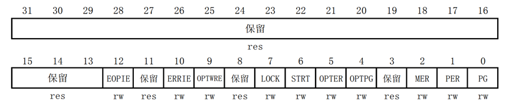
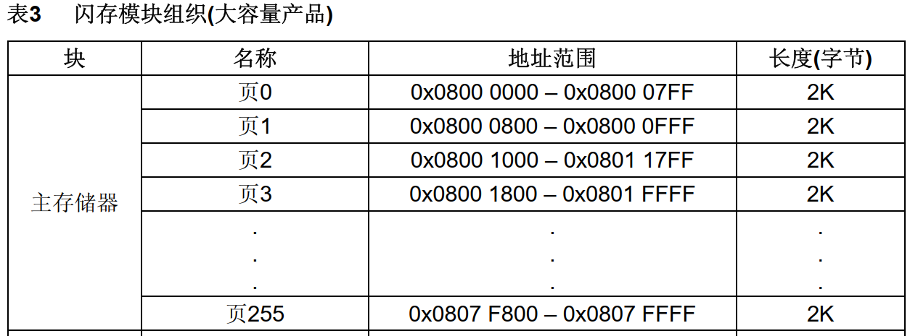

<!-- more -->

## 一、内部FLASH

这里了解一下内部Flash的一些内容，并不涉及对内部Flash读写等相关操作。

### 1. FLASH

### 简介

flash是存储芯片的一种，通过特定的程序可以修改里面的数据。FLASH在电子以及半导体领域内往往表示 Flash Memory 的意思，即平时所说的“闪存”，全名叫 Flash EEPROM Memory。它结合了ROM和RAM的长处，不仅具备电子可擦除可编程（EEPROM）的性能，还可以快速读取数据（NVRAM的优势），使数据不会因为断电而丢失。

在STM32芯片内部有一个FLASH存储器，它主要用于存储代码，它是一种nor flash。我们在电脑上编写好应用程序后，使用下载器把编译后的代码文件烧录到该内部FLASH中， 由于FLASH存储器的内容在掉电后不会丢失，芯片重新上电复位后，**内核可从内部FLASH中加载代码并运行**。

除了使用外部的工具（如下载器）读写STM32的内部FLASH外，STM32芯片在运行的时候，也能对自身的内部FLASH进行读写，因此， 若内部FLASH存储了应用程序后还有剩余的空间，我们可以把它像外部SPI-FLASH那样利用起来，**存储一些程序运行时产生的需要掉电保存的数据**。

由于访问内部FLASH的速度要比外部的SPI-FLASH快得多，所以在紧急状态下常常会使用内部FLASH存储关键记录；为了防止应用程序被抄袭， 有的应用会禁止读写内部FLASH中的内容，或者在第一次运行时计算加密信息并记录到某些区域，然后删除自身的部分加密代码，这些应用都涉及到内部FLASH的操作。

### 2. 资料查找

关于STM32的内部Flash的相关资料是没有在[STM32中文参考手册](https://www.stmcu.com.cn/Designresource/detail/localization_document%20/710001)中有所体现的，关于Flash的相关资料，ST官方有另外的文档，叫做STM32F10xxx闪存编程手册，英文版在这里：[STM32F10xxx Flash memory microcontrollers](https://www.st.com/resource/en/programming_manual/pm0075-stm32f10xxx-flash-memory-microcontrollers-stmicroelectronics.pdf)，这个手册也有中文版：[STM32F10xxx闪存编程参考手册](https://picture.iczhiku.com/resource/eetop/WhkWowqdUaYYwcnv.pdf)

### 3. STM32内部Flash框图

我们可以看一下[STM32中文参考手册](https://www.stmcu.com.cn/Designresource/detail/localization_document%20/710001)的2.1 系统构架：


除了使用外部的工具（如下载器）读写内部 FLASH 外， STM32 芯片在运行的时候，也能对自身的内部 FLASH 进行读写，因此，若内部 FLASH 存储了应用程序后还有剩余的空间，我们可以把它像外部 SPI-FLASH 那样利用起来，存储一些程序运行时产生的需要掉电保存的数据。

由于访问内部 FLASH 的速度要比外部的 SPI-FLASH 快得多，所以在紧急状态下常常会使用内部FLASH 存储关键记录；为了防止应用程序被抄袭，有的应用会禁止读写内部 FLASH 中的内容，或者在第一次运行时计算加密信息并记录到某些区域，然后删除自身的部分加密代码，这些应用都涉及到内部 FLASH 的操作。  

### 4. 内部FLASH构成

#### 4.1 组成

STM32 的内部FLASH（闪存模块）由：**主存储器**、**信息块**和**闪存存储器接口寄存器**等 3 部分组成。  这一部分的相关说明我们需要查看[STM32F10xxx闪存编程参考手册](https://picture.iczhiku.com/resource/eetop/WhkWowqdUaYYwcnv.pdf)，这个中文版本的1.2 闪存模块组织，也有英文版本的（[STM32F10xxx Flash memory microcontrollers](https://www.st.com/resource/en/programming_manual/pm0075-stm32f10xxx-flash-memory-microcontrollers-stmicroelectronics.pdf)），其实在[STM32中文参考手册](https://www.stmcu.com.cn/Designresource/detail/localization_document%20/710001)的2.3.3 嵌入式闪存这一节也有这个表。在ST官网上可以找到相应的英文版本。如下图为STM32F1系列芯片大容量产品的闪存模块组织图：


注意上表中的主存储器是本实验板使用的 STM32F103ZET6 型号芯片的参数，即 STM32F1 大容量产品。若使用超大容量、中容量或小容量产品，它们主存储器的页数量、页大小均有不同，使用的时候要注意区分。  

需要知道的是主存储器和信息块的写入，由内嵌的闪存编程/擦除控制器(FPEC)管理，编程与擦除的高电压由内部产生。在执行闪存写操作时，任何对闪存的读操作都会锁住总线，在写操作完成后读操作才能正确地进行，即在进行写或擦除操作时，不能进行代码或数据的读取操作。 

#### 4.2 主存储器

一般我们说STM32内部FLASH的时候，都是指这个主存储器区域（主闪存存储器），它是**存储用户应用程序的空间**， 芯片型号说明中的256K FLASH、512K FLASH都是指这个区域的大小。

对于STM32F103ZET6型号芯片，主存储器分为**256页，每页大小为2KB，共512KB**。这个分页的概念，实质就是FLASH存储器的扇区，与其它FLASH一样，在写入数据前，要先按页（扇区）擦除。从上图可以看出主存储器的起始地址就是 0X08000000，当启动引脚BOOT0为低电平时，系统将从0x08000000地址开始读取代码，也就是从
主存储器（ Main Flash memory）启动。  

**【注意】**上表中的主存储器是STM32F103ZET6型号芯片的参数，芯片型号中的E就表示这是STM32F1系列的大容量产品，并且容量为512KB。若使用超大容量、中容量或小容量产品， 它们主存储器的页数量、页大小均有不同，使用的时候要注意区分。芯片型号各部分代表的含义其实可以查看芯片手册的《7 Part numbering  》这一节，在芯片手册上有对芯片型号的详细说明。


#### 4.3 信息块

该部分分为 2 个小部分，分别是启动程序代码和用户选择字节。

（1）系统存储器：这部分是用来存储 ST 芯片出厂时已经固化了的启动代码，用于实现串口、USB以及CAN等ISP烧录功能。这个也可以叫系统存储器，都是一个意思，[STM32F10xxx Flash memory microcontrollers](https://www.st.com/resource/en/programming_manual/pm0075-stm32f10xxx-flash-memory-microcontrollers-stmicroelectronics.pdf)的1.2 Flash module organization一节中，这个地方是叫system memory，个人觉得还是叫系统存储器更符合原版手册。当启动引脚BOOT0为高电平， BOOT1为低电平时， 系统将从0x1FFFF000地址开始读取代码， 该代码将从UART收到的数据写到主存储器。也就是通过UART实现程序的下载。  

（2）选项字节：用于配置FLASH的读写保护、待机/停机复位、软件/硬件看门狗等功能，这部分共16字节。可以通过修改FLASH的选项控制寄存器修改。

#### 4.4 接口寄存器

闪存存储器接口寄存器，该部分用于控制闪存读写等，是整个闪存模块的控制机构。  这部分其实就包含了STM32的 FPEC（闪存编程和擦除控制器）模块，我们对FLASH的操作就是通过这个模块来实现的，这个模块包含了 7 个32位寄存器，分别是：

| 寄存器名称    | 地址                      | 说明             |
| ------------- | ------------------------- | ---------------- |
| FLASH_KEYR    | 0x4002_2004 – 0x4002_2007 | FPEC 键寄存器    |
| FLASH_OPTKEYR | 0x4002_2008 – 0x4002_200B | 选择字节键寄存器 |
| FLASH_SR      | 0x4002_200C – 0x4002_200F | 闪存状态寄存器   |
| FLASH_CR      | 0x4002_2010 – 0x4002_2013 | 闪存控制寄存器   |
| FLASH_AR      | 0x4002_2014 – 0x4002_2017 | 闪存地址寄存器   |
| FLASH_OBR     | 0x4002_201C – 0x4002_201F | 选择字节寄存器   |
| FLASH_WRPR    | 0x4002_2020 – 0x4002_2023 | 写保护寄存器     |

【说明】其中FPEC总共有3个键值：RDPRT键=0X000000A5；KEY1=0X45670123；KEY2=0XCDEF89AB

### 5. 为什么要先擦除？

我们写入FLASH的时候，需要先擦除才能写，这是为什么？是由其底层物理结构——**NOR Flash** 存储单元的工作原理决定的。

每个存储单元可以看作一个微小的、带有“陷阱”的晶体管。这个“陷阱”就是浮栅。**状态“1”（已擦除状态）**：浮栅上没有电子。此时晶体管的阈值电压较低，容易导通。**状态“0”（已写入状态）**：通过编程（写入）操作，向浮栅注入电子。这使得晶体管的阈值电压变高，难以导通。

**写入**（编程）：是通过 沟道热电子注入 或 F-N 隧穿的方式，强行将电子“推”进浮栅。这个过程相对精确且缓慢。**擦除**是通过 **F-N隧穿** 的方式，施加一个强反向电场，将电子从浮栅上“拉”出来。这个过程是以**整个扇区**为单位同时进行的，非常“暴力”，且耗时较长。

核心原因：**只能从“1”变为“0”，不能从“0”变为“1”**。写入操作 的本质是 将比特位从‘1’改变为‘0’。我们无法通过写入操作将‘0’变回‘1’。擦除操作 的本质是将整个扇区的所有比特位一次性重置为‘1’。

举个例子：

假设一个存储单元当前的值是 `0`（已写入，浮栅有电子）。现在想把它改成 `1`。

**如果直接尝试“写入1”**，电路会尝试向浮栅注入电子，但浮栅上本来就有电子，这个操作是无效的，甚至可能损坏单元。最终，该单元的值**仍然会是 `0`**。无法实现从 `0` 到 `1` 的翻转。正确的流程是我们必须先执行**擦除**操作，将整个扇区的单元都强制重置为 `1`。然后，再执行**写入**操作，精确地将需要为 `0` 的位从 `1` 翻转为 `0`。

## 二、FLASH相关寄存器

这一部分我们就需要参考[STM32F10xxx闪存编程参考手册](https://picture.iczhiku.com/resource/eetop/WhkWowqdUaYYwcnv.pdf)的3 寄存器说明啦。这里只简单介绍几个，主要我们还是用库函数操作，这里简单了解下。

### 1. FPEC键寄存器(FLASH_KEYR) 


该寄存器主要用来解锁 FPEC，必须在该寄存器写入特定的序列（KEY1 和 KEY2）解锁后，才能对 FLASH_CR 寄存器进行写操作。  

### 2. 闪存控制寄存器(FLASH_CR)



（1）LOCK 位，该位用于指示 FLASH_CR 寄存器是否被锁住，该位在检测到正确的解锁序列后，硬件将其清零。在一次不成功的解锁操作后，在下次系统复位之前，该位将不再改变。

（2）STRT 位，该位用于开始一次擦除操作。在该位写入 1 ，将执行一次擦除操作。

（3）PER 位，该位用于选择页擦除操作，在页擦除的时候，需要将该位置 1。

（4）PG 位，该位用于选择编程操作，在往 FLASH 写数据的时候，该位需要置 1。  

其他的位可以看参考手册。

### 3. 闪存状态寄存器(FLASH_SR)


该寄存器主要用来指示当前 FPEC 的操作编程状态。  各位描述如下：


### 4. 闪存地址寄存器(FLASH_AR) 


这些位由硬件修改为当前/最后使用的地址。在页擦除操作中，软件必须修改这个寄存器以指定要擦除的页。

FAR：闪存地址 当进行编程时选择要编程的地址，当进行页擦除时选择要擦除的页。 注意：当FLASH_SR中的BSY位为’1’时，不能写这个寄存器。

## 三、选项字节与读写保护  

在实际发布的产品中，在 STM32 芯片的内部 FLASH 存储了控制程序，如果不作任何保护措施的话，可以使用下载器直接把内部 FLASH 的内容读取回来，得到 bin 或 hex 文件格式的代码拷贝，别有用心的厂商会利用该方法山寨产品。为此， STM32 芯片提供了多种方式保护内部 FLASH 的程序不被非法读取，但在默认情况下该保护功能是不开启的，若要开启该功能，需要改写内部FLASH 选项字节 (Option Bytes) 中的配置。  

### 1. 选项字节的内容  

#### 1.1 选项字节的构成

选项字节是一段特殊的 FLASH 空间， STM32 芯片会根据它的内容进行读写保护配置，选项字节的构成见下表，可以参考[STM32F10xxx闪存编程参考手册](https://picture.iczhiku.com/resource/eetop/WhkWowqdUaYYwcnv.pdf)的2.5 选择字节说明：


STM32F103 系列芯片的选项字节有 8 个配置项，即上表中的 USER、 RDP、 DATA0/1 及 WRP0/1/2/3，而表中带 n 的同类项是该项的反码，即 nUSER 的值等于 (~USER)、 nRDP 的值等于 (~RDP)， STM32利用反码来确保选项字节内容的正确性。  选项字节的 8 个配置项具体的数据位配置说明如下


我们主要学习选项字节配置中的 RDP 位和 WRPx 位，它们分别用于配置读保护和写保护。  

#### 1.2 RDP读保护

##### 1.2.1 读保护说明

修改选项字节的 RDP 位的值可设置内部 FLASH 为以下保护级别：  

（1）0xA5：无保护，这是 STM32 的默认保护级别，它没有任何读保护，读取内部 FLASH 的内容都没有任何限制。也就是说，第三方可以使用调试器等工具，获取该芯片 FLASH 中存储的程序，然后可以把获得的程序以 bin 和 hex 的格式下载到另一块 STM32 芯片中，加上PCB 抄板技术，轻易复制出同样的产品。  

（2）其它值：使能读保护 ，把 RDP 配置成除 0xA5 外的任意数值，都会使能读保护。在这种情况下，若使用调试功能 (使用下载器、仿真器) 或者从内部 SRAM 自举时都不能对内部 FLASH 作任何访问 (读写、擦除都被禁止)；而如果 STM32 是从内部 FLASH 自举时，它允许对内部FLASH 的任意访问。也就是说，任何尝试从外部访问内部 FLASH 内容的操作都被禁止。例如，无法通过下载器读取它的内容，或编写一个从内部 SRAM 启动的程序，若该 SRAM 启动的程序读取内部 FLASH，会被禁止。而如果是芯片原本的内部 FLASH程序自己访问内部 FLASH（即从 FLASH 自举的程序），是完全没有问题的，例如芯片本身的程序，若包含有指针对内部 FLASH 某个地址进行的读取操作，它能获取正常的数据。  

另外，被设置成读保护后， FLASH 前 4K 字节的空间会强制加上写保护，也就是说，即使是从 FLASH 启动的程序，也无法擦写这 4K 字节空间的内容；而对于前 4K 字节以外的空间，读保护并不影响它对其它空间的擦除/写入操作。利用这个特性，可以编写 IAP 代码 (In Application Program) 更新 FLASH 中的程序，它的原理是通过某个通讯接口获取将要更新的程序内容，然后利用内部 FLASH 擦写操作把这些内容烧录到自己的内部 FLASH 中，实现应用程序的更新，该原理类似串口 ISP 程序下载功能，只不过 ISP 这个接收数据并更新的代码由 ST 提供，且存放在系统存储区域，而 IAP 是由用户自行编写的，存放在用户自定义的 FLASH 区域，且通讯方式可根据用户自身的需求定制，如 IIC、 SPI 等，只要能接收到数据均可。

 芯片被配置成读保护后根据不同的使用情况，访问权限不同，如下表：


  ##### 1.2.2 解除读保护

当需要解除芯片的读保护时，要把选项字节的 RDP 位重新设置为 0xA5。在解除保护前，芯片会自动触发擦除主 FLASH 存储器的全部内容，即解除保护后原内部 FLASH的代码会丢失，从而防止降级后原内容被读取到。 

#### 1.3 WRP写保护

##### 1.3.1 写保护说明

使用选项字节的 WRP0/1/2/3 可以设置主 FLASH 的写保护，防止它存储的程序内容被修改。写保护的配置一般以 4K 字节为单位，除 WRP3 的最后一位比较特殊外，每个 WRP选项字节的一位用于控制 4K 字节的写访问权限，把对应 WRP 的位置 0 即可把它匹配的空间加入写保护。被设置成写保护后，主 FLASH 中的内容使用任何方式都不能被擦除和写入，写保护不会影响读访问权限，读访问权限完全由前面介绍的读保护设置限制 。

对于大容量产品，选择字节WRPx中的每一个比特位用于保护主存储器中2个存储页(2K字节/ 页)，但是WRP3的位7用于保护第62~255页。WRP0：第0~15页的写保护，WRP1：第16~31页的写保护，WRP2：第32~47页的写保护，WRP3：位0~6提供第48~61页的写保护，位7提供第62~255页的写保护。

##### 1.3.2 解除写保护

解除写保护是逆过程，把对应 WRP 的位置 1 即可把它匹配的空间解除写保护。解除写保护后，主 FLASH 中的内容不会像解读保护那样丢失，它会被原样保留。  

### 2. 修改选项字节的过程

修改选项字节的内容可修改读写保护配置，不过选项字节复位后的默认状态是始终可以读但被写保护的，因此它具有类似前面提到的 FLASH_CR 寄存器的访问限制，要想修改，需要先对 FLASH_OPTKEYR 寄存器写入解锁编码。由于修改选项字节时也需要访问 FLASH_CR 寄存器，所以同样也要对 FLASH_KEYR 写入解锁编码。修改选项字节的整个过程总结如下：

- 1、解除 FLASH_CR 寄存器的访问限制

（1）往 FPEC 键寄存器 FLASH_KEYR 中写入 KEY1 = 0x45670123

（2）再往 FPEC 键寄存器 FLASH_KEYR 中写入 KEY2 = 0xCDEF89AB

- 2、解除对选项字节的访问限制

（1）往 FLASH_OPTKEYR 中写入 KEY1 = 0x45670123

（2）再往 FLASH_OPTKEYR 中写入 KEY2 = 0xCDEF89AB  

- 3、配置 FLASH_CR 的 OPTPG 位，准备修改选项字节

- 4、直接使用指针操作修改选项字节的内容，根据需要修改 RDP、 WRP 等内容
- 5、对于读保护的解除，由于它会擦除 FLASH 的内容，所以需要检测状态寄存器标志位以确认FLASH 擦除操作完成。
- 6、若是设置读保护及其解除，需要给芯片重新上电复位，以使新配置的选项字节生效；对于设置写保护及其解除，需要给芯片进行系统复位，以使新配置的选项字节生效。  

## 四、可读写空间计算

其实我们读写FLASH的时候会有问题的，因为我们写好的代码也是保存在FLASH中的，万一我们不小心擦除了我们的代码存储区域，这不就完了，那怎么确保我们要进行读写的FLASH地址空间不会跟我们程序使用的FLASH区域产生冲突呢？下边就一起来了解一下把。

### 1. 整个工程的空间分布

在使用内部FLASH存储其它数据前需要了解哪一些空间已经写入了程序代码，存储了程序代码的扇区都不应作任何修改。 通过查询应用程序编译时产的 .map 后缀文件，可以了解程序存储到了哪些区域， 我们可以到工程目录中的 Listing 文件夹中找到，也可以通过下图提示找到：


打开map文件后，查看文件最后部分的区域，可以看到一段以 Memory Map of the image 开头的记录：

```c
==============================================================================

Memory Map of the image  //存储分布映像

  Image Entry point : 0x08000131
  /* 程序 ROM 加载空间 */
  Load Region LR_IROM1 (Base: 0x08000000, Size: 0x00000a38, Max: 0x00080000, ABSOLUTE, COMPRESSED[0x00000648])
    /* 程序 ROM 执行空间 */
    Execution Region ER_IROM1 (Exec base: 0x08000000, Load base: 0x08000000, Size: 0x00000638, Max: 0x00080000, ABSOLUTE)
	/* 地址分布列表 */
    Exec Addr    Load Addr    Size         Type   Attr      Idx    E Section Name        Object

    0x08000000   0x08000000   0x00000130   Data   RO            3    RESET               startup_stm32f10x_hd.o
    0x08000130   0x08000130   0x00000000   Code   RO         3210  * .ARM.Collect$$$$00000000  mc_w.l(entry.o)
// 中间部分省略......
      
    Execution Region RW_IRAM1 (Exec base: 0x20000000, Load base: 0x08000638, Size: 0x00000800, Max: 0x00010000, ABSOLUTE, COMPRESSED[0x00000010])

    Exec Addr    Load Addr    Size         Type   Attr      Idx    E Section Name        Object

    0x20000000   COMPRESSED   0x00000400   Data   RW         3110    .data               main.o
    0x20000400        -       0x00000400   Zero   RW            1    STACK               startup_stm32f10x_hd.o


==============================================================================
```

这一段是就是之前分析MDK工程文件使用的[90-MDK编译过程及文件全解/MDK文件详解-GPIO输出—多彩流水灯](https://gitee.com/embedded-devs/scm-dev/tree/master/90-MDK编译过程及文件全解/MDK文件详解-GPIO输出—多彩流水灯)的 ROM 存储器分布映像，在 STM32 芯片中， ROM 区域的内容就是指存储到内部 FLASH 的代码。  其中 Memory Map of the image 表示这是存储分布映像部分。

### 2. 程序ROM的加载与执行空间

前边我们打开的 map 文件中中有两段分别以“Load Region LR_ROM1”及“Execution Region ER_IROM1”开头的内容：


Load Region LR_ROM1 描述的是程序的加载空间，Execution Region ER_IROM1 描述的是程序的执行空间。在芯片刚上电运行时，会加载程序及数据。例如，它会从程序的存储区域加载到程序的执行区域，还把一些已初始化的全局变量从 ROM 复制到 RAM 空间， 以便程序运行时可以修改变量的内容。加载完成后，程序开始从执行区域开始执行。

在上面 map 文件的描述中，我们了解到加载及执行空间的基地址(Base)都是 0x08000000 ，它正好是STM32内部FLASH的首地址， 即STM32的**程序存储空间就直接是执行空间**；它们的大小(Size)分别为 0x00000638 及 0x00000a38 ，我们会发现执行空间的大小比加载空间的大小要小，执行空间的ROM比较小的原因就是因为部分 RW-data 类型的变量被拷贝到 RAM 空间了； 它们的最大空间(Max)均为0x00080000，即 512K 字节，它指的是内部FLASH的最大空间。

计算程序占用的空间时，需要**使用加载区域的大小进行计算**，本例子中应用程序使用的内部FLASH是从 0x08000000 至( 0x08000000 + 0x00000a38 )地址的空间区域。

### 3. ROM空间分布表

在加载及执行空间总体描述之后，紧接着一个 ROM 详细地址分布表，它列出了工程中的各个段(如函数、常量数据)所在的地址BaseAddr 及占用的空间 Size：

```c
	/* 地址分布列表 */
    Exec Addr    Load Addr    Size         Type   Attr      Idx    E Section Name        Object

    0x08000000   0x08000000   0x00000130   Data   RO            3    RESET               startup_stm32f10x_hd.o
    0x08000130   0x08000130   0x00000000   Code   RO         3210  * .ARM.Collect$$$$00000000  mc_w.l(entry.o)
// 中间部分省略......
    0x080004f6   0x080004f6   0x00000002   PAD
    0x080004f8   0x080004f8   0x00000120   Code   RO         3109    i.main              main.o
    0x08000618   0x08000618   0x00000020   Data   RO         3229    Region$$Table       anon$$obj.o
```

列表中的 Type说明了该段的类型，CODE表示代码，DATA表示数据，而PAD表示段之间的填充区域，它是无效的内容， PAD区域往往是为了解决地址对齐的问题。观察表中的最后一项，它的基地址是 0x08007398 ，大小为 0x00000020 ，可知它占用的最高的地址空间为:

```shell
0x08000618  + 0x00000020 = 0x08000638
```

我们发现跟执行区域的最高地址 0x08000638 一样， 但它们比加载区域说明中的最高地址 0x00000a38 要小，所以我们**以加载区域的大小为准**。

### 4.我们可用空间

经过上边的分析，我们知道了从 0x08000000 开始，0x00000a38 大小的区域存储了我们的应用程序，我们计算一下这大概就是 2616 字节的数据，一共就是 2.55 KB，而在我们的FLASH中，每一页是 2 KB，所以说，此应用程序将会占用 2 页（4KB）。对比STM32大容量产品内部FLASH的构成的内部FLASH页地址分布表：



我们可以知道可知使用 页 0 至 页 3 就可以完全存储本应用程序，所以从页 4后的存储空间都可以作其它用途，使用这些存储空间时不会篡改应用程序空间的数据。

### 5. 相关计算

#### 5.1 页起始地址计算

比如说，页4地址怎么计算？

```c
page_addr = 0x0800 0000 + 0x800 * num
```

比如页2的起始地址就等于0x0800 0000 + 0x800 x 2 = 0x0800 1000。

#### 5.2 页数怎么计算？

假设我们现在要写入7000个字节的数据，那么它需要占多少页呢？我们直接对2048取模就可以得到整数页，但是可能还会有余数，这些也是要占一整个页面的，所以只要余数不是0，都需要再增加一个页，所以计算方式就是：

```c
page_count = (len / sector_size) + ((len % sector_size)?1:0)
```

比如刚才的7000字节：

```c
page_count = (7000 / 2048) + ((7000 % 2048)?1:0) = 3 + (0.42?1:0) = 3 + 1 = 4
```

#### 5.3 从地址获取是第几页

我们要是从指定地址开始写数据，那么这个地址是属于第几页？我们可以这样来计算：

```c
page_num = (addr - 0x0800 0000)/sector_size // 取整数部分即可
```

比如0x08001900是第几页？我们带入上边的计算公式，可以得到：

```c
page_num = (0x0800 1900 - 0x0800 0000)/2048 = 3
```

这样我们就得到是第三页啦。
