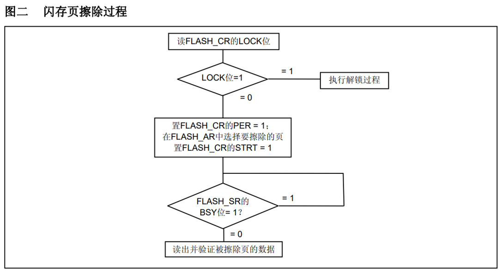
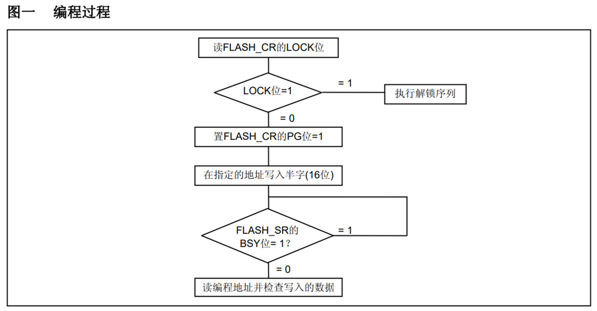

<!-- more -->

我这里使用的是STM32CubeMX来配置生成工程，使用的就是HAL库，由于内部Flash不需要我们来做初始化，所以软件不用配置，我们直接调用相应的驱动函数即可。这些可以操作内部Flash的函数声明都存在于 以下几个文件中：

```c
stm32f1xx_hal_flash_ex.h
stm32f1xx_hal_flash.h 
stm32f1xx_hal_flash_ex.c
stm32f1xx_hal_flash.c 
```

关于Flash的相关资料，ST官方有另外的文档，叫做STM32F10xxx闪存编程手册，英文版在这里：[STM32F10xxx Flash memory microcontrollers](https://www.st.com/resource/en/programming_manual/pm0075-stm32f10xxx-flash-memory-microcontrollers-stmicroelectronics.pdf)，这个手册也有中文版，但是只有本地可看：[STM32F10xxx闪存编程参考手册](https://picture.iczhiku.com/resource/eetop/WhkWowqdUaYYwcnv.pdf)

## 一、对内部Flash的读写过程

### 1. 解锁

#### 1.1 解锁步骤

由于内部 FLASH 空间主要存储的是应用程序，是非常关键的数据，为了防止误操作修改了这些内容，芯片复位后默认会给控制寄存器 FLASH_CR 上锁，这个时候不允许设置 FLASH 的控制寄存器，从而不能修改 FLASH 中的内容。  我们可以参考[STM32F10xxx闪存编程参考手册](https://picture.iczhiku.com/resource/eetop/WhkWowqdUaYYwcnv.pdf)的2.3.2 解除闪存锁。所以对 FLASH 写入数据前，需要先给它解锁，也就是通过写入特定的序列到 FLASH_KEYR 寄存器可以打开 FPEC 模块（即写入 KEY1 和 KEY2）。解锁的操作步骤如下  ：

(1) 往 FPEC 键寄存器 FLASH_KEYR 中写入 KEY1 = 0x45670123

(2) 再往 FPEC 键寄存器 FLASH_KEYR 中写入 KEY2 = 0xCDEF89AB  

只有在写保护被解除后，我们才能操作相关寄存器，这 叫Unlock。需要注意的是键值不正确会产生总线错误。

#### 1.2 解锁函数

```c
/**
  * @brief  Unlock the FLASH control register access
  * @retval HAL Status
  */
HAL_StatusTypeDef HAL_FLASH_Unlock(void);
```

### 2. 上锁

#### 2.1 上锁步骤

当我们操作完成后，我们还可以将内部FLASH上锁，我们向FLASH的CR寄存器的LOCK位写1即可完成上锁。

#### 2.2 上锁函数

```c
/**
  * @brief  Locks the FLASH control register access
  * @retval HAL Status
  */
HAL_StatusTypeDef HAL_FLASH_Lock(void);
```

### 3. 页擦除

#### 3.1 页擦除步骤

在写入新的数据前，需要先擦除存储区域， STM32 提供了页（扇区）擦除指令和整个 FLASH 擦除 (批量擦除) 的指令，批量擦除指令仅针对主存储区。我们可以看一下[STM32F10xxx闪存编程参考手册](https://picture.iczhiku.com/resource/eetop/WhkWowqdUaYYwcnv.pdf)的2.3.4 闪存擦除一节，这里有一个流程图：



（1）检查FLASH_CR的LOCK是否解锁，如果没有则先解锁

（2）检查 FLASH_SR 寄存器中的“忙碌寄存器位 BSY”，也就是 bit[0]，以确认当前未执行任何 Flash 操作；

（3）在 FLASH_CR 寄存器中，将“激活页擦除寄存器位PER ”置 1，也就是将bit[1]置 1 ；

（4）用FLASH_AR寄存器选择要擦除的页（该寄存器表示了要操作的地址，也叫闪存地址寄存器）；

（5）将 FLASH_CR 寄存器中的“开始擦除寄存器位 STRT ”置 1，也就是将 bit[6] 置 1 ，然后就会开始擦除；

（6）等待 BSY 位被清零时，表示擦除完成。

（7）读出被擦除的页并做验证。

#### 3.2 页擦除函数

```c
/**
  * @brief  Perform a mass erase or erase the specified FLASH memory pages
  * @note   To correctly run this function, the @ref HAL_FLASH_Unlock() function
  *         must be called before.
  *         Call the @ref HAL_FLASH_Lock() to disable the flash memory access 
  *         (recommended to protect the FLASH memory against possible unwanted operation)
  * @param[in]  pEraseInit pointer to an FLASH_EraseInitTypeDef structure that
  *         contains the configuration information for the erasing.
  *
  * @param[out]  PageError pointer to variable  that
  *         contains the configuration information on faulty page in case of error
  *         (0xFFFFFFFF means that all the pages have been correctly erased)
  *
  * @retval HAL_StatusTypeDef HAL Status
  */
HAL_StatusTypeDef HAL_FLASHEx_Erase(FLASH_EraseInitTypeDef *pEraseInit, uint32_t *PageError)
```

本函数包含两个输入参数，分别是擦除flash初始化结构体和返回擦除出错编码，FLASH_EraseInitTypeDef 擦除 flash 初始化结构体主要包含擦除的方式，是扇区擦除还是批量擦除，选择不同电压时实质是选择不同的数据操作位数，并且确定擦除首地址即擦除的扇区个数。函数根据输入参数配置 PSIZE 位，然后擦除扇区，擦除扇区的时候需要等待一段时间，它使用 FLASH_WaitForLastOperation 等待，擦除完成的时候才会退出 HAL_FLASHEx_Erase 函数。  

### 4. 写入数据

#### 4.1 写入步骤

擦除完毕后即可写入数据，写入数据的过程并不是仅仅使用指针向地址赋值，赋值前还还需要配置一系列的寄存器， 我们可以参考[STM32F10xxx闪存编程参考手册](https://picture.iczhiku.com/resource/eetop/WhkWowqdUaYYwcnv.pdf)的2.3.3 主闪存编程一节：



对主闪存编程每次可以写入16位。当FLASH_CR寄存器的PG位为’1’时，在一个闪存地址写入 一个半字将启动一次编程；**写入任何非半字的数据，FPEC都会产生总线错误**。在编程过程中 (BSY位为’1’)，任何读写闪存的操作都会使CPU暂停，直到此次闪存编程结束。

（1）检查FLASH_CR的LOCK是否解锁，如果没有则先解锁。

（2）检查FLASH_SR寄存器的BSY位，以确认没有其他正在进行的编程操作。

（3）设置FLASH_CR寄存器的PG位为 1 在指定的地址写入要编程的**半字**，也就是每次只能以 16 位（32位处理器下，一个字是32位，半字就是16位，也就是2个字节）的方式写入。

（4）等待BSY位变为 0 。

（5）读出写入的地址并验证数据。

#### 4.2 写入函数

```c
/**
  * @brief  Program halfword, word or double word at a specified address
  * @note   The function HAL_FLASH_Unlock() should be called before to unlock the FLASH interface
  *         The function HAL_FLASH_Lock() should be called after to lock the FLASH interface
  *
  * @note   If an erase and a program operations are requested simultaneously,    
  *         the erase operation is performed before the program one.
  *  
  * @note   FLASH should be previously erased before new programmation (only exception to this 
  *         is when 0x0000 is programmed)
  *
  * @param  TypeProgram:  Indicate the way to program at a specified address.
  *                       This parameter can be a value of @ref FLASH_Type_Program
  * @param  Address:      Specifies the address to be programmed.
  * @param  Data:         Specifies the data to be programmed
  * 
  * @retval HAL_StatusTypeDef HAL Status
  */
HAL_StatusTypeDef HAL_FLASH_Program(uint32_t TypeProgram, uint32_t Address, uint64_t Data);
```

形参依次设置了数据操作宽度，写入数据地址，写入的数据。在赋值操作后，调用了 FLASH_WaitForLastOperation 函数等待写操作完毕。 

### 5. 读取数据

#### 5.1 读取步骤

读取数据就比较简单了，我们直接定义一个指针，指针指向想要读的地址，就可以直接读取了。

#### 5.2 读取函数

在HAL库或者标准库中是没有提供读内部Flash数据的函数的，我们可以自己封装一个.

- 读取半字数据（16位）

```c
uint16_t internalFLASH_ReadHalfWord(uint32_t faddr)
{
	return *(__IO unit16_t* )faddr; 
}
```

### 6. 读写实例

具体的可以看[scm-dev: 35-FLASH/01-internal-flash](https://gitee.com/embedded-devs/scm-dev/tree/master/35-FLASH/01-internal-flash)

#### 6.1 相关宏定义

```c
// 用户根据自己的需要设置
#define internalFLASH_SIZE 512    // 所选STM32的FLASH容量大小(单位为K)
#define internalFLASH_WREN 1      // 使能FLASH写入(0，不是能;1，使能)
#define FLASH_WAITETIME    50000  // FLASH等待超时时间
//FLASH起始地址
#define internalFLASH_BASE 0x08000000 //STM32 FLASH的起始地址

```

#### 6.2 读取半字数据

```c
/**
  * @brief  读取指定地址的半字(16位) 数据
  * @note   32位单片机的话，一个字是32位，半字是16位
  * @param  faddr 要读取的地址，32位地址 
  * @retval 返回一个16位数据
  */
uint16_t internalFLASH_ReadHalfWord(uint32_t faddr)
{
	return *(__IO uint16_t*)faddr; 
}
```

#### 6.3 不检查擦除的写入

```c
/**
  * @brief  不检查是否擦除，直接写入半字数据
  * @note   注意：数据个数按半字(16位)计算
  * @param  WriteAddr 起始地址
  * @param  pBuffer 数据指针
  * @param  NumToWrite 要写入的数据的半字(16位)数，字节数x2   
  * @retval 
  */
void internalFLASH_Write_NoCheck(uint32_t WriteAddr, uint16_t *pBuffer, uint16_t NumToWrite)
{
    uint16_t i;
    for (i = 0; i < NumToWrite; i++)
    {
        HAL_FLASH_Program(FLASH_TYPEPROGRAM_HALFWORD, WriteAddr, pBuffer[i]);
        WriteAddr += 2; // 地址增加2，每次写入16位数据
    }
}
```

#### 6.4 写入指定半字数的数据

```c
#if internalFLASH_SIZE < 256
#define internalFLASH_SECTOR_SIZE 1024 // 字节
#else
#define internalFLASH_SECTOR_SIZE 2048
#endif
uint16_t internalFLASH_BUF[internalFLASH_SECTOR_SIZE / 2]; // 最多是2K字节,每个数据是16位，所以大小定义为扇区的一半
/**
  * @brief  从指定地址开始写入指定长度的数据
  * @note   注意：数据个数按半字(16位)计算
  * @param  WriteAddr 起始地址(此地址必须为2的倍数!!)
  * @param  pBuffer 数据指针
  * @param  NumToWrite 要写入的半字(16位)数(就是要写入的16位数据的个数)
  * @retval 
  */
void internalFLASH_Write(uint32_t WriteAddr, uint16_t *pBuffer, uint16_t NumToWrite)
{
    uint32_t secpos;    // 扇区地址
    uint16_t secoff;    // 扇区内偏移地址(16位字计算)
    uint16_t secremain; // 扇区内剩余地址(16位字计算)
    uint16_t i;
    uint32_t offaddr;   //去掉 0X08000000 后的地址，也就是相对于 0X08000000 的偏移地址

    if (WriteAddr < internalFLASH_BASE || (WriteAddr >= (internalFLASH_BASE + 1024 * internalFLASH_SIZE)))
        return; // 非法地址

    HAL_FLASH_Unlock();                                 // 解锁
    offaddr = WriteAddr - internalFLASH_BASE;           // 计算实际偏移地址，要写入的地址 - 0x0800 0000
    secpos = offaddr / internalFLASH_SECTOR_SIZE;       // 计算要写的地址是哪个扇区，也就是页，偏移地址/2048即可。扇区地址 0~255 for STM32F103ZET6
    secoff = (offaddr % internalFLASH_SECTOR_SIZE) / 2; // 在扇区内的偏移(2个字节为基本单位.)
    secremain = internalFLASH_SECTOR_SIZE / 2 - secoff; // 计算扇区剩余空间大小
    if (NumToWrite <= secremain)                        // 判断整个页中剩下的空间是否足够写入我们要写入的数据
        secremain = NumToWrite; // 要写的数据长度不大于该扇区范围的话，我们将剩余长度设置为要写入的长度
    while (1)
    {
        internalFLASH_Read(secpos * internalFLASH_SECTOR_SIZE + internalFLASH_BASE, internalFLASH_BUF, internalFLASH_SECTOR_SIZE / 2); // 读出整个扇区的内容
        for (i = 0; i < secremain; i++)     //校验数据，判断我们要写的区域中的数据是否都是0xFFFF                                                                                            // 校验数据
        {
            if (internalFLASH_BUF[secoff + i] != 0XFFFF)
                break; // 需要擦除
        }
        if (i < secremain) // 需要擦除
        {
            // 这里的擦除操作也可以使用 HAL_FLASHEx_Erase() 函数，它包含了下边的三个步骤
            FLASH_PageErase(secpos * internalFLASH_SECTOR_SIZE + internalFLASH_BASE); // 擦除这个扇区
            FLASH_WaitForLastOperation(FLASH_WAITETIME);                              // 等待上次操作完成
            CLEAR_BIT(FLASH->CR, FLASH_CR_PER);                                       // 清除CR寄存器的PER位，此操作应该在FLASH_PageErase()中完成！
                                                                                      // 但是HAL库里面并没有做，因为HAL库一般使用HAL_FLASHEx_Erase()来擦除
            for (i = 0; i < secremain; i++) /// 复制要写入的数据到缓冲区
            {
                internalFLASH_BUF[i + secoff] = pBuffer[i]; // 直接从偏移的位置复制数据，保护了其他不需要被覆盖的数据
            }
            internalFLASH_Write_NoCheck(secpos * internalFLASH_SECTOR_SIZE + internalFLASH_BASE, internalFLASH_BUF, internalFLASH_SECTOR_SIZE / 2); // 写入整个扇区
        }
        else
        {
            FLASH_WaitForLastOperation(FLASH_WAITETIME);                // 等待上次操作完成
            internalFLASH_Write_NoCheck(WriteAddr, pBuffer, secremain); // 写已经擦除了的,直接写入扇区剩余区间.
        }
        if (NumToWrite == secremain)
            break; // 写入结束了
        else       // 写入未结束
        {
            secpos++;                   // 扇区地址增1
            secoff = 0;                 // 偏移位置为0
            pBuffer += secremain;       // 指针偏移
            WriteAddr += secremain * 2; // 写地址偏移(16位数据地址,需要*2)
            NumToWrite -= secremain;    // 字节(16位)数递减
            if (NumToWrite > (internalFLASH_SECTOR_SIZE / 2))
                secremain = internalFLASH_SECTOR_SIZE / 2; // 下一个扇区还是写不完
            else
                secremain = NumToWrite; // 下一个扇区可以写完了
        }
    }
    HAL_FLASH_Lock(); // 上锁
}
#endif
```

#### 6.5 读取指定半字数的数据

```c
/**
  * @brief  从指定地址开始读出指定长度的数据
  * @note   注意：数据个数按半字(16位)计算
  * @param  ReadAddr 起始地址
  * @param  pBuffer 数据指针
  * @param  NumToWrite 半字(16位)数
  * @retval 
  */
void internalFLASH_Read(uint32_t ReadAddr, uint16_t *pBuffer, uint16_t NumToRead)
{
    uint16_t i;
    for (i = 0; i < NumToRead; i++)
    {
        pBuffer[i] = internalFLASH_ReadHalfWord(ReadAddr); // 读取2个字节.
        ReadAddr += 2;                                     // 偏移2个字节.
    }
}
```

#### 6.6 测试函数

```c
void internalFlash_Test(void)
{
    const uint8_t TEXT_Buffer[] = {"STM32F103 FLASH TEST!!!!"};
    uint16_t datatemp[32];
    uint32_t FLASH_SAVE_ADDR = 0X08070000;
    internalFLASH_Write(FLASH_SAVE_ADDR, (uint16_t *)TEXT_Buffer, sizeof(TEXT_Buffer)/2+((sizeof(TEXT_Buffer)%2)?1:0));
    internalFLASH_Read(FLASH_SAVE_ADDR, (uint16_t *)datatemp, sizeof(TEXT_Buffer)/2+((sizeof(TEXT_Buffer)%2)?1:0));
    printf("TEXT_Buffer:%d, %d, data:%s\r\n", sizeof(TEXT_Buffer), sizeof(TEXT_Buffer)/2+((sizeof(TEXT_Buffer)%2)?1:0), (char *)datatemp);
}
```

## 二、内部Flash的读写保护

### 1. 库函数说明

#### 1.1 选项字节上锁、解锁

```c
/**
  * @brief  Lock the FLASH Option Control Registers access.
  * @retval HAL Status 
  */
HAL_StatusTypeDef HAL_FLASH_OB_Lock(void)

/**
  * @brief  Unlock the FLASH Option Control Registers access.
  * @retval HAL Status
  */
HAL_StatusTypeDef HAL_FLASH_OB_Unlock(void);
```

解锁的时候，它对 FLASH_OPTCR 寄存器写入两个解锁参数，上锁的时候，对 FLASH_OPTCR 寄存器的 FLASH_OPTCR_OPTLOCK 位置 1。  

#### 1.2 设置选项字节函数  

解锁后设置选项字节寄存器可以先初始化 FLASH_OBProgramInitTypeDef 结构体，然后调用 HAL_FLASHEx_OBProgram 完成。  

```c
/**
  * @brief  Program option bytes
  * @note   The function @ref HAL_FLASH_Unlock() should be called before to unlock the FLASH interface
  *         The function @ref HAL_FLASH_OB_Unlock() should be called before to unlock the options bytes
  *         The function @ref HAL_FLASH_OB_Launch() should be called after to force the reload of the options bytes
  *         (system reset will occur)
  *
  * @param  pOBInit pointer to an FLASH_OBInitStruct structure that
  *         contains the configuration information for the programming.
  *
  * @retval HAL_StatusTypeDef HAL Status
  */
HAL_StatusTypeDef HAL_FLASHEx_OBProgram(FLASH_OBProgramInitTypeDef *pOBInit);
```

该函数根据输入选项字节结构体 FLASH_OBProgramInitTypeDef 参数设置寄存器响应的位，特别注意，其注释警告了若 RDPLevel 位配置成 OB_RDP_LEVEL_2 会无法恢复。  

#### 1.3 写入选项字节  

```c
/**
  * @brief  Launch the option byte loading.
  * @note   This function will reset automatically the MCU.
  * @retval None
  */
void HAL_FLASH_OB_Launch(void);
```

该函数设置 FLASH_OPTCR_OPTSTRT 位后调用了 FLASH_WaitForLastOperation 函数等待写入完成，并返回写入状态，若操作正常，它会返回 FLASH_COMPLETE。  

### 2. 读写保护测试

这里就没实际操作了，后边有需要再补充吧。
