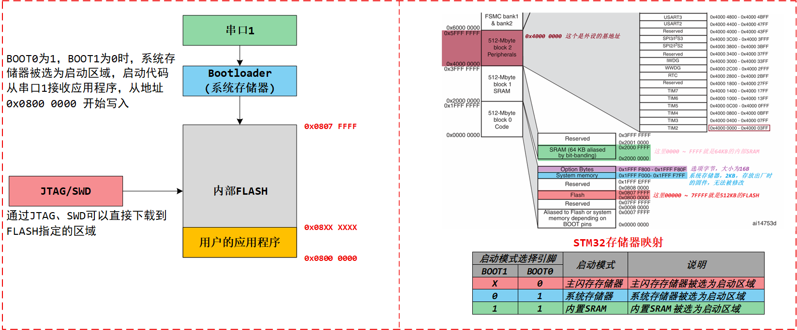
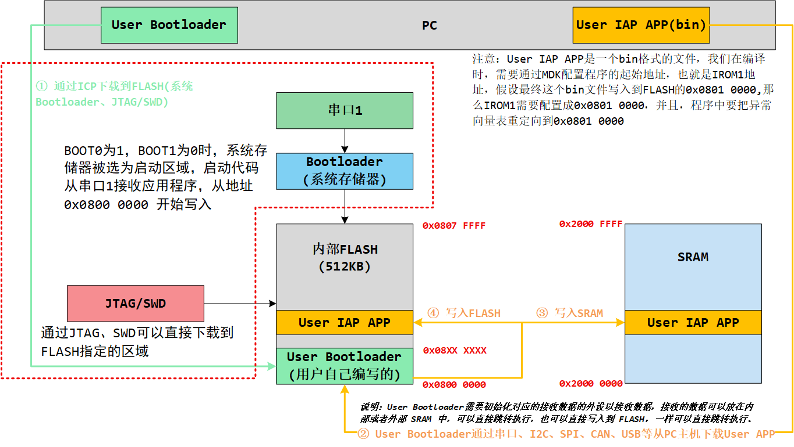
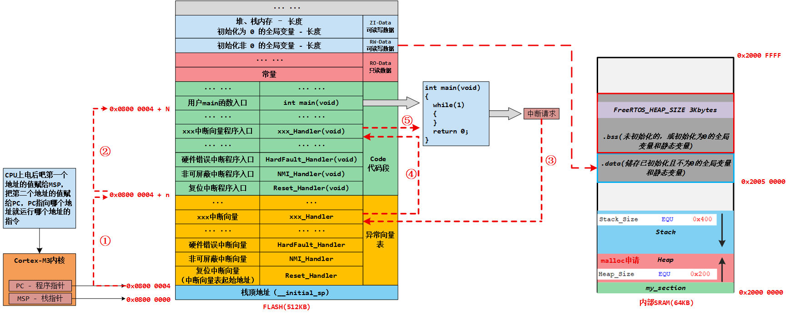

<!-- more -->

## 一、STM32编程方式

### 1. 在线编程

#### 1.1 基本概念

ICP，全称为In-Circuit Programming，即在线编程。是通过 JTAG或者SWD 协议或者系统加载程序(Bootloader)下载用户应用程序到微控制器中。这种方式就是我们平时用的下载程序方式，就是通过JTAG下载器将我们通过Keil生成的hex文件下载到STM32开发板中。

注意：这里我也不知道教程为什么叫这个，前边学习启动方式的时候也有提到过，它其实也可以称为 In System Program，也就是ISP，主要依靠ST官方在芯片内固化的BootLoader来接收来自串口的程序。

#### 1.2 下载流程

从串口下载过来的程序会通过ST固化在系统存储器的Bootloader程序写入到对应的Flash地址中，但是JTAG或者SWD可以直接将程序烧写到指定的Flash地址中。

### 2.应用编程

#### 2.1基本概念

IAP，全称为In Application Programming，即在应用程序中编程，就是应用编程。它是通过任何一种通信接口（如IO口、USB、CAN、UART、I2C、或者SPI等）下载程序或者应用数据到存储器中。也就是说，STM32允许用户在应用程序中重新烧写闪存存储器中的内容。但是，IAP 需要至少有一部分程序已经使用 ICP 方式烧到闪存存储器中（Bootloader)。通过这种方式可以在不需要操作硬件平台的情况下实现升级（远程）。

#### 2.2下载流程

（1）编写一个用户自己的Bootloader，通过ICP的方式下载到FLASH中。

（2）编写一个用于IAP应用编程的APP程序，这个程序是用户的Bootloader来进行接收，可以是串口、I2C、SPI、CAN、USB等，接收的数据可以写入SRAM或者FLASH，比较常用的就是先写入SRAM进行缓存，接收完毕后校验是否完整，然后再决定是否要写入FLASH中。这整个过程都是用户的Bootloader来完成的。

### 3. FOTA升级

如果设备有无线通信只功能，应用系统运行起来后，通过无线通信的方式下载程序进行程序升级是-个主常理想的方式。事实上，带无线通信功能的产品大多数也是采用这种升级方式，比如，手机。通过无线通信式进行升级的方式称之为**OTA**(Over The Air)，通常称之为远程升级。

OTA分为两类：SOTA(Sofware OTA)和FOTA(Firmware OTA)：

- SOTA就是只对应用软件进行升级，比如Android 的 APP软件进行升级。它只更新上层应用，影响特定功能，风险较低，比较灵活。

- FOTA就是对底层固件进行升级，比如，手机的ROM固件。它会更新底层固件，影响整个系统，需要Bootloader，像单片机IOT设备使用较多。

> 对于单片机来说，我们通过网口，wifi等进行更新程序，更加精确的说法是 **FOTA**。

#### 3.1 基本概念

OTA是Over the Air的缩写，顾名思义通过空中方式升级，所谓“空中”指的是远程无线方式，OTA可以理解为一种远程无线升级技术。

FOTA 是 Firmware Over the Air 的缩写，即固件空中升级，最常见的就是手机固件的升级。固件的定义范围比较模糊，windows操作系统升级、手机升级、嵌入式系统、单片机控制程序等都的远程升级可以笼统地称为FOTA。没有特别说明的情况下，FOTA可以认为是一切远程升级的统称。

#### 3.2 升级流程

对于单片机来说，其实使用的也是应用编程的逻辑，只是bin文件的来源并不是通过串口、USB等方式，而是变成了通过wifi、WLAN等从服务器下载下来，下载下来后，剩下的更新逻辑就和应用编程一样了。这一部分重点还是应用编程，后续再深入学习FOTA。

## 二、IAP编程

### 1. IAP简介

前边已经提过，IAP（In Application Programming）即在应用编程， IAP 是用户自己的程序在运行过程中对 User Flash 的部分区域进行烧写，目的是为了在产品发布后可以方便地通过预留的通信口对产品中的固件程序进行更新升级。 

通常实现 IAP 功能时，即用户程序运行中作自身的更新操作，需要在设计固件程序时编写两个项目代码，第一个项目程序不执行正常的功能操作，而只是通过某种通信方式(如 USB、 USART)接收程序或数据，然后执行对第二部分代码的更新；第二个项目代码才是真正的功能代码。这两部分项目代码都同时烧录在 User Flash 中，当芯片上电后，首先是第一个项目代码开始运行，它会做如下操作：

- （1）检查是否需要对第二部分代码进行更新。
- （2）如果不需要更新则转到（4）。
- （3）执行更新操作。
- （4）跳转到第二部分代码执行。

第一部分代码必须通过其它手段，如 JTAG 或 ISP 烧入；第二部分代码可以使用第一部分代码 IAP 功能烧入，也可以和第一部分代码一起烧入，以后需要程序更新时再通过第一部分 IAP 代码更新。  

我们将第一个项目代码称之为 Bootloader 程序，第二个项目代码称之为 APP 程序，它们存放在 STM32中FLASH 的不同地址范围，一般从最低地址区开始存放 Bootloader，紧跟其后的就是 APP 程序（注意，如果 FLASH 容量足够，是可以设计很多 APP 程序的）。

### 2. 正常应用程序执行

正常情况下，程序执行的过程如下图所示：

STM32 的内部闪存（FLASH）地址起始于 0x0800 0000，一般情况下，程序文件就从此地址开始写入。此外 STM32 是基于 Cortex-M3 内核的微控制器，其内部通过一张“中断向量表”来响应中断，程序启动后，将首先从“中断向量表”取出复位中断向量执行复位中断程序完成启动，而这张“中断向量表”的起始地址是 0x08000004，当中断来临， STM32 的内部硬件机制会自动将 PC 指针定位到“中断向量表”处，并根据中断源取出对应的中断向量执行中断服务程序 。

（1）STM32 在复位后，先从 0X08000004 地址取出复位中断向量的地址，并跳转到复位中断服务程序，如图标号①所示；

（2）在复位中断服务程序执行完之后，会跳转到我们的 main 函数，如图标号②所示，main函数在Reset_Handler中被调用；

（3）我们的 main 函数一般都是一个死循环，在 main 函数执行过程中，如果收到中断请求（发生重中断），此时 STM32 强制将 PC 指针指回中断向量表处，如图标号③所示；

（4）根据中断源进入相应的中断服务程序，如图标号④所示；

（5）在执行完中断服务程序以后，程序再次返回 main 函数执行，如图标号⑤所示 。

### 3. 加入APP应用程序

我们加入APP后，程序执行的过程如下图：

（1）STM32 复位后， 还是从 0X08000004 地址取出复位中断向量的地址，并跳转到复位中断服务程序，在运行完复位中断服务程序之后跳转到 IAP（Bootloader） 的 main 函数，如图标号①所示，

（2）在执行完 IAP 以后（即将新的 APP 代码写入 STM32的 FLASH，新程序的复位中断向量起始地址为 0X08000004+X+M），跳转至新写入程序的复位向量表，取出新程序的复位中断向量的地址，并跳转执行新程序的复位中断服务程序，随后跳转至新程序的 main 函数，如图标号②和③所示，

（3）同样 main 函数为一个死循环，此时 STM32 的 FLASH，在不同位置上，共有两个中断向量表。在 main 函数执行过程中，如果CPU 得到一个中断请求， **PC 指针仍强制跳转到地址 0X08000004 中断向量表处，而不是新程序的中断向量表**，如图标号④所示；

（4）程序根据我们设置的中断向量表偏移量，跳转到对应中断源新的中断服务程序中，如图标号⑤所示；

（5）在执行完中断服务程序后，程序返回 main 函数继续运行，如图标号⑥所示。

通过以上两个过程的分析，我们知道 IAP 程序必须满足两个要求：

- 新程序必须在 IAP 程序之后的某个偏移量为 M 的地址开始；
- 必须将新程序的中断向量表相应的移动，移动的偏移量为 X+M；  
