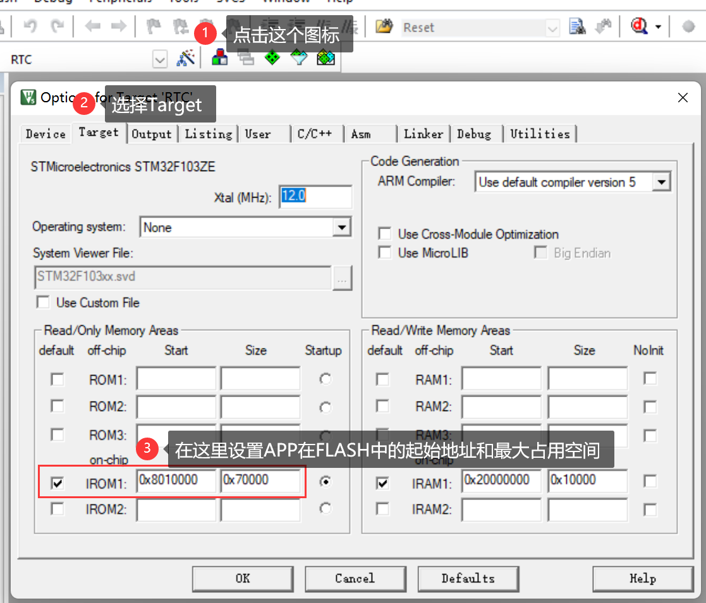
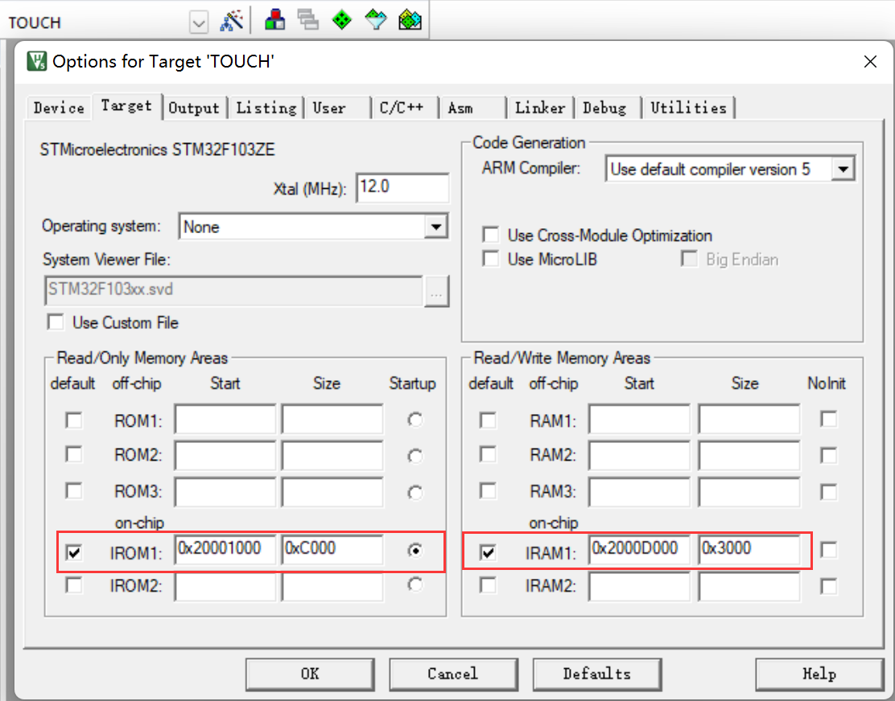
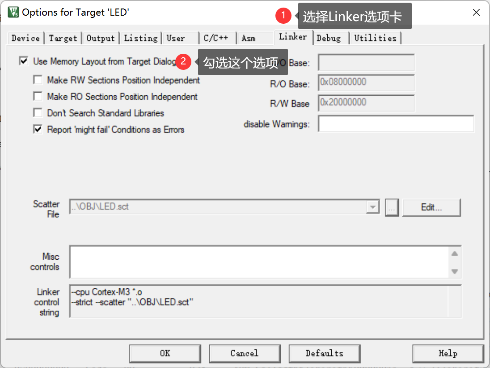
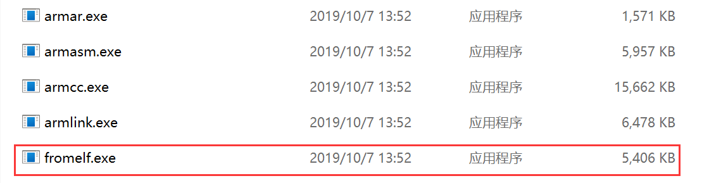
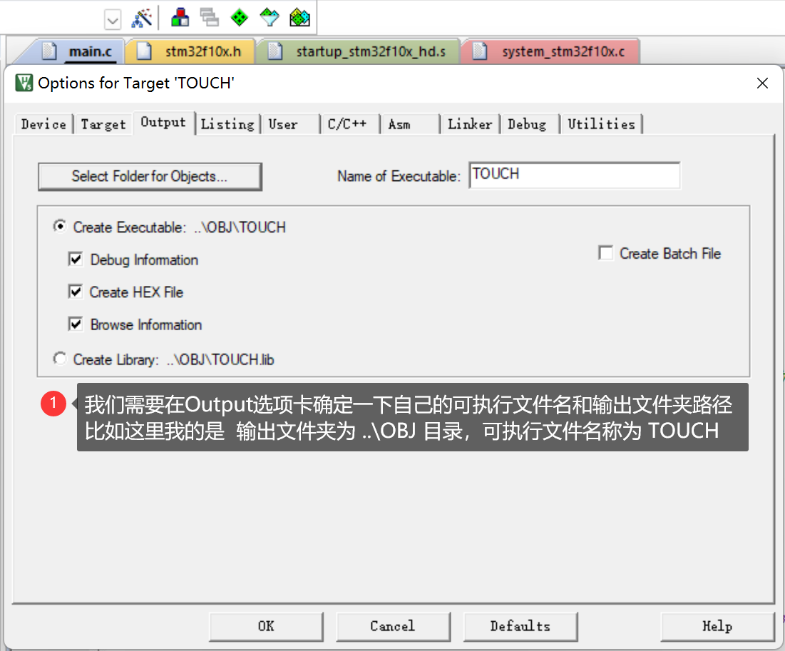
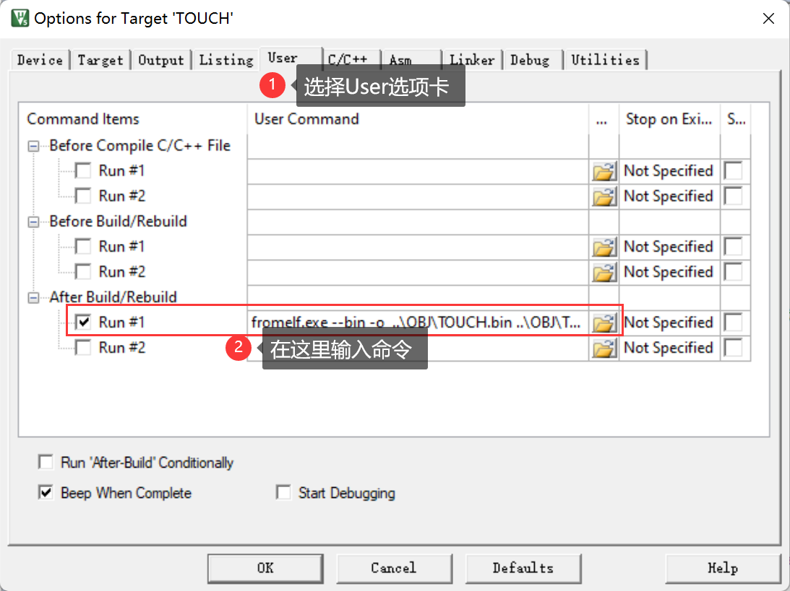
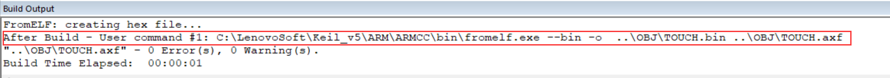

<!-- more -->

## 一、APP应用程序制作

STM32 的 APP 程序不仅可以放到 FLASH 里面运行，也可以放到 SRAM 里面运行，  我们使用的STM32F103ZET6有512KB的FLASH和64KB的SRAM，FLASH的地址为 0x0800 0000 \~ 0x0807 FFFF，内部SRAM的地址为 0x2000 0000 \~ 0x2000 FFFF。

### 1.APP起始地址设置

#### 1.1 FLASH中运行

- 【Options for Target】&rarr;【Target】



默认的条件下，图中 IROM1 的起始地址（Start）一般为 0x0800 0000，大小（Size）为 0x80000，即从 0x08000000 开始的 512K 空间为我们的程序存储（因为我们的 STM32F103ZET6 的 FLASH大小是 512K）。

而当前图中，我们设置IROM1的起始地址（Start）为 0X0801 0000，即偏移量为 0X10000（64K 字节）。因而，留给 APP用的 FLASH 空间（Size）为0x80000 - 0x10000= 0x70000（448K字节）。

设置好 Start 和 Szie，就完成 APP 程序的起始地址设置。这里的 64K 字节，需要我们根据 Bootloader 程序大小进行选择，理论上我们只需要确保 APP 起始地址在 Bootloader 程序之后，并且偏移量为 0x200 的倍数即可（为什么是0x200的倍数？[NVIC的向量表偏移寄存器设置问题(已解决)-OpenEdv-开源电子网](http://www.openedv.com/posts/list/392.htm)）。这里我们选择 64K（0x10000）字节，留了一些余量，可以方便 Bootloader 以后的升级修改。 我们编译完成后，可以看一下它的sct文件：

```c
; *************************************************************
; *** Scatter-Loading Description File generated by uVision ***
; *************************************************************

LR_IROM1 0x08010000 0x00070000  {    ; load region size_region
  ER_IROM1 0x08010000 0x00070000  {  ; load address = execution address
   *.o (RESET, +First)
   *(InRoot$$Sections)
   .ANY (+RO)
   .ANY (+XO)
  }
  RW_IRAM1 0x20000000 0x00010000  {  ; RW data
   .ANY (+RW +ZI)
  }
}
```

#### 1.2 SRAM中运行

若APP在SRAM中运行的话，我们设置的方式也类似：



这里我们将 IROM1 的起始地址（Start）定义为： 0x20001000，大小为 0xC000（48K 字节），即从地址 0x20000000 偏移 0x1000 开始，存放 APP 代码。因为整个 STM32F103ZET6 的 SRAM大小为64K字节，所以 IRAM1（ SRAM ）的起始地址变为 0x2000D000（ 0x20001000 + 0xC000=0x2000D000 ），大小只有 0x3000 （ 12K字节 ）。 

这样，整个STM32F103ZET6 的 SRAM 分配情况为：最开始的 4K 给 Bootloader 程序使用，随后的 48K 存放 APP 程序，最后12K，用作 APP 程序的内存。这个分配关系我们可以根据自己的实际情况修改，不一定和这里的设置一模一样，不过也需要注意，保证偏移量为 0X200 的倍数（我们这里为 0X1000）。我们看一下它的sct文件：

```c
; *************************************************************
; *** Scatter-Loading Description File generated by uVision ***
; *************************************************************

LR_IROM1 0x20001000 0x0000C000  {    ; load region size_region
  ER_IROM1 0x20001000 0x0000C000  {  ; load address = execution address
   *.o (RESET, +First)
   *(InRoot$$Sections)
   .ANY (+RO)
   .ANY (+XO)
  }
  RW_IRAM1 0x2000D000 0x00003000  {  ; RW data
   .ANY (+RW +ZI)
  }
}
```

#### 1.3 设置成功判定

那怎么知道设置后是否成功呢？我们可以看存储器映像中的信息，就是前边学习FLASH时说过的 .map 文件中的 Memory Map of the image 部分：

```shell
Image Entry point : 0x08000131

Load Region LR_IROM1 (Base: 0x08000000, Size: 0x00007770, Max: 0x00080000, ABSOLUTE)

Execution Region ER_IROM1 (Exec base: 0x08000000, Load base: 0x08000000, Size: 0x00007730, Max: 0x00080000, ABSOLUTE)
```

需要注意的是，有时候我们更改了 IROM1 后，这里并没有任何变化，此时我们需要修改这里：



重新设定之后，重新编译查看即可。

### 2. 中断向量表偏移

在系统启动的时候，会首先调用 SystemInit() 函数初始化时钟系统，同时SystemInit() 还完成了中断向量表的设置，我们可以打开 SystemInit() 函数，看看函数体的结尾处有这样几行代码，新版本的库可能不太一样，这里仅供参考。

```c
/**
  * @brief  Setup the microcontroller system
  *         Initialize the Embedded Flash Interface, the PLL and update the 
  *         SystemCoreClock variable.
  * @note   This function should be used only after reset.
  * @param  None
  * @retval None
  */
void SystemInit (void)
{
	// ... ...
#ifdef VECT_TAB_SRAM
  SCB->VTOR = SRAM_BASE | VECT_TAB_OFFSET; /* Vector Table Relocation in Internal SRAM. */
#else
  SCB->VTOR = FLASH_BASE | VECT_TAB_OFFSET; /* Vector Table Relocation in Internal FLASH. */
#endif 
}
```

从这里可以看出VTOR寄存器存放的是中断向量表的起始地址。默认的情况 VECT_TAB_SRAM 是没有定义，所以执行:

```c
SCB->VTOR = FLASH_BASE | VECT_TAB_OFFSET;
```

另外，SystemInit()函数的执行是在启动文件的复位中断中：

```assembly
; Reset handler
Reset_Handler   PROC
                EXPORT  Reset_Handler             [WEAK]
                IMPORT  __main
                IMPORT  SystemInit
                LDR     R0, =SystemInit
                BLX     R0               
                LDR     R0, =__main
                BX      R0
                ENDP
```

【注意】

（1）这里只是举一个例子，看一下中断向量表怎么设置，后边直接设置这个 SCB->VTOR 即可。

（2）FLASH中APP和SRAM中APP的中断向量表地址设置与前边APP偏移地址相关联，注意要跟前边对应。

#### 2.1 FLASH 中运行

对于 FLASH中的APP，我们设置为 FLASH_BASE+偏移量 0x10000，所以我们可以在 FLASH中APP 的 main 函数最开头处添加如下代码实现中断向量表的起始地址的重设：  

```c
SCB->VTOR = FLASH_BASE | 0x10000;
```

#### 2.2 SRAM中运行

当使用 SRAM APP 的时候， 我们设置起始地址为：SRAM_BASE + 0x1000,同样的方法，我们在 SRAM APP 的 main 函数最开始处，添加下面代码：

```c
SCB->VTOR = SRAM_BASE | 0x1000;
```

这样，我们就完成了中断向量表偏移量的设置。  

### 3. bin文件的生成

#### 3.1 生成工具

我们使用的 MDK 默认生成的文件是 .hex 文件，并不方便我们用作 IAP更新，我们希望生成的文件是 .bin 文件，这样可以方便进行 IAP 升级。MDK 自带的格式转换工具 fromelf.exe，可以实现 .axf 文件到 .bin 文件的转换。该工具在 MDK 的安装目录的这个文件夹下：

```shell
# windows 下的路径格式
\ARM\ARMCC\bin
```




fromelf.exe 转换工具的语法格式为： 

```c
fromelf [options] input_file
```

其中 options 有很多选项可以设置 ，其他的没有研究过，这里就直接用下边的命令格式即可（这是我当时安装MDK的路径）：

```shell
C:\LenovoSoft\Keil_v5\ARM\ARMCC\bin\fromelf.exe --bin -o ..\OBJ_dir\xxx.bin ..\OBJ_dir\xxx.axf
```

#### 3.2 MDK配置

- （1）确认生成的可执行文件名和输出文件的文件夹路径



- （2）添加命令



```c
C:\LenovoSoft\Keil_v5\ARM\ARMCC\bin\fromelf.exe --bin -o  ..\OBJ\TOUCH.bin ..\OBJ\TOUCH.axf
```

- （3）编译工程

编译整个工程，编译结束后，我们会看到如下提示：



然后我们就可以看到生成的 .bin 文件啦。

### 4. APP生成总结

- （1）设置 APP 程序的起始地址和存储空间大小。对于在 FLASH 里面运行的 APP 程序和 SRAM 里面运行的 APP 程序，他们的设置类似，但是要注意各个地址。

- （2）设置中断向量表偏移量。主要就是APP的main函数中设置 SCB->VTOR 的值 。

- （3）设置编译后运行 fromelf.exe，生成 .bin 文件。通过在 User 选项卡，设置编译后调用 fromelf.exe，根据.axf 文件生成.bin 文件，用于IAP 更新。  

## 二、Bootloader编写

前边我们已经完成了APP的制作，那么现在要做的就是通过Bootloader程序将APP程序写入到相应的地址，并跳转执行。

### 1. APP程序跳转

#### 1.1 函数指针

```c
typedef  void (*pIAPFunc)(void);				//定义一个函数类型的参数.
pIAPFunc jump2app;  // 定义一个函数指针变量
```

jump2app是一个函数指针变量，可以指向一个不含参数，且无返回值的函数。

#### 1.2 重设栈顶指针

重新设置栈顶指针，因为STM32启动的时候就需要获取栈顶指针，防止堆栈溢出，设置栈顶指针的话需要使用汇编，我们可以自己实现：

```c
/**
  * @brief  设置栈顶指针的地址
  * @note   
  * @param  addr 栈顶指针的地址
  * @retval 
  */
__asm void MSR_MSP(u32 addr)
{
    MSR MSP, r0 // set Main Stack value
    BX r14
}
```

后来发现，其实STM32的核心标准文件中已经为我们实现了相关的设置栈顶指针的函数，它在 cmsis_armcc.h 文件中，函数实现如下：

```c
/**
  \brief   Set Main Stack Pointer
  \details Assigns the given value to the Main Stack Pointer (MSP).
  \param [in]    topOfMainStack  Main Stack Pointer value to set
 */
__STATIC_INLINE void __set_MSP(uint32_t topOfMainStack)
{
  register uint32_t __regMainStackPointer     __ASM("msp");
  __regMainStackPointer = topOfMainStack;
}
```

注意，这个函数在 cmsis_gcc.h 文件中也有一个，注意不要包含错头文件了。

#### 1.3 跳转实现

```c
/**
  * @brief  跳转到应用程序段
  * @note   
  * @param  appxaddr 用户代码起始地址
  * @retval 
  */
void iap_load_app(uint32_t appxaddr)
{
    if (((*(__IO uint32_t *)appxaddr) & 0x2FFE0000) == 0x20000000) // 检查栈顶地址是否合法.
    {
        jump2app = (pIAPFunc) * (__IO uint32_t *)(appxaddr + 4);   // 用户代码区第二个字为程序开始地址(复位地址)
        __set_MSP(*(__IO uint32_t *)appxaddr);                     // 初始化APP堆栈指针(用户代码区的第一个字用于存放栈顶地址)
        jump2app();                                                // 跳转到APP.
    }
}
```

第9行：校验一下即将运行的APP的栈顶指针是否位于内部SRAM区域。

第11行：将函数指针指向应用程序的起始起始地址，这里的起始地址应该是app应用程序的基地址再加4个字节，加上四个字节后，这个函数指针就指向了app应用程序的复位中断向量子程序。

第12行：设置栈顶的地址，为C语言运行提供环境，app的基地址存储的就是栈顶地址。

第13行：就相当于执行函数，执行了复位中断子程序，之后便会进入应用app的main死循环中。

### 2. APP程序接收

我们这里通过串口来接收APP应用程序（.bin）文件。这里只列出部分关键代码。

```c
//注意,读取USARTx->SR能避免莫名其妙的错误
#define USART_REC_LEN 55*1024 //定义最大接收字节数 55K
uint8_t USART_RX_BUF[USART_REC_LEN] __attribute__ ((at(0X20001000))); //接收缓冲,最大USART_REC_LEN个字节,起始地址为0X20001000.

uint32_t USART_RX_CNT=0; // 接收的字节数

// 串口1中断服务程序
void USART1_IRQHandler(void)
{
	uint8_t res;	
	if(USART1->SR & (1<<5))//接收到数据
	{	 
		res = USART1->DR; 
		if(USART_RX_CNT < USART_REC_LEN)
		{
			USART_RX_BUF[USART_RX_CNT] = res;
			USART_RX_CNT++;			 									     
		}
	}
}
```

我们指定 USART_RX_BUF 的地址是从 0X20001000 开始，该地址也就是 SRAM中APP程序的起始地址。 然后串口1的中断服务程序（USART1_IRQHandler() 函数）里面，将串口发送过来的数据，全部接收到 USART_RX_BUF，并通过 USART_RX_CNT 计数，这样接收数据的同时，还可以获取整个文件的大小。不过这里这个55KB太大了，很有可能造成我们的代码内存不够用，编译都通不过，所以Bootloader的代码也不能做太多的功能，只要能完成基本的程序的接收和写入还有跳转就可以了。  

### 3. APP程序写入

#### 3.1 APP写入内部FLASH

若是这是一个FALSH中的APP，我们就还需要将该 .bin 文件写入到FLASH相应的地址中去。

```c
uint16_t iapbuf[1024];

/**
  * @brief  将接收的bin文件写入指定的地址
  * @note   
  * @param  appxaddr 应用程序的起始地址
  * @param  appbuf 应用程序CODE.
  * @param  appsize 应用程序大小(字节).
  * @retval 
  */
void iap_write_appbin(uint32_t appxaddr, uint8_t *appbuf, uint32_t appsize)
{
    uint16_t t;
    uint16_t i = 0;
    uint16_t temp;
    uint32_t fwaddr = appxaddr; // 当前写入的地址
    uint8_t *dfu = appbuf;
    for (t = 0; t < appsize; t += 2)
    {
        temp = (uint16_t)dfu[1] << 8;
        temp += (uint16_t)dfu[0];
        dfu += 2; // 偏移2个字节
        iapbuf[i++] = temp;
        if (i == 1024)
        {
            i = 0;
            InternalFLASH_Write(fwaddr, iapbuf, 1024); 
            fwaddr += 2048; // 偏移2048  16=2*8.所以要乘以2.
        }
    }
    if (i)
    {
        internalFLASH_Write(fwaddr, iapbuf, i); // 将最后的一些内容字节写进去.
    }
}
```

该函数用于将FLASH APP写入到FLASH中指定的区域中。InternalFLASH_Write()函数需要自己实现，具体可以看[35-FLASH/10-iap-bootloader/Drivers/BSP/InternalFlash/bsp_internal_flash.c](https://gitee.com/embedded-devs/scm-dev/blob/master/35-FLASH/10-iap-bootloader/Drivers/BSP/InternalFlash/bsp_internal_flash.c#L43)

#### 3.2 APP写入内部SRAM

由于我们通过串口直接将接收到的数据写入了内部SRAM中，且SRAM中运行的APP我们在设置地址的时候，跟串口接收写入的地址是一致的，所以这里并不需要将 .bin 文件再写入到SRAM，我们可以直接跳转运行。

### 4. APP执行实例

#### 4.1 执行FLASH中的APP

```c
//执行FLASH APP
if(((*(__IO uint32_t *)(0x08010000 + 4)) & 0xFF000000)==0x08000000)//判断是否为0X08XXXXXX.
{	 
    iap_load_app(0x08010000);// 执行FLASH APP代码
}
```

#### 4.2 执行SRAM中的APP

```c
// 执行SRAM APP
if(((*(__IO uint32 *)(0X20001000 + 4)) & 0xFF000000)==0x20000000)//判断是否为0X20XXXXXX.
{	 
    iap_load_app(0X20001000);// SRAM地址
}
```
