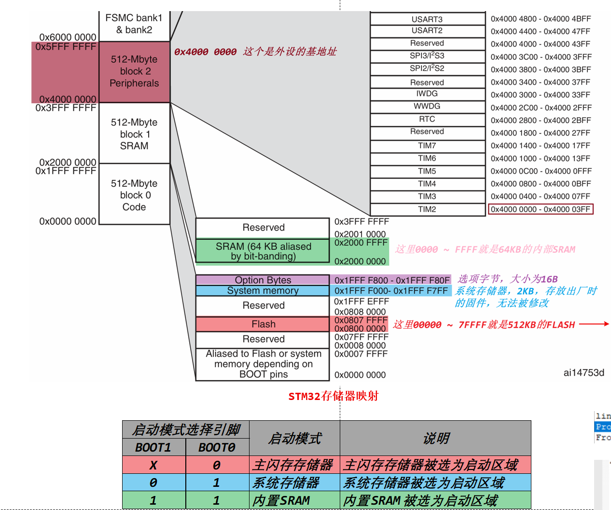
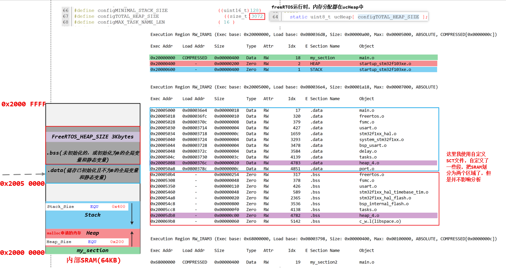
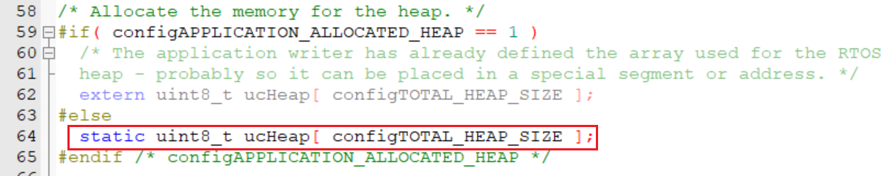
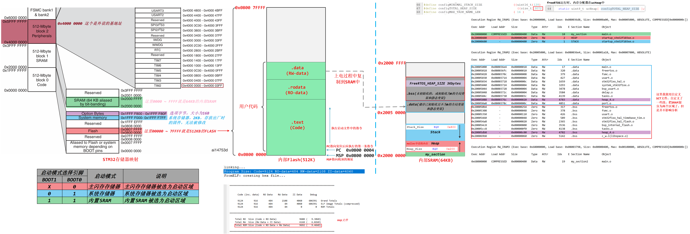

<!-- more -->

其实断断续续的，STM32启动文件、启动方式、程序组成、map文件、sct文件、sram、内部flash都大概已经了解过了，这里进行总结，从stm32启动开始，到程序跑起来，这中间究竟是怎么个过程。

> 测试工程：[scm-dev: 10-free-rtos](https://gitee.com/embedded-devs/scm-dev/tree/master/40-MEMORY/10-free-rtos)

## 一、单片机的启动

关于存储器映像，可以看 [10-基础篇/10-STM32基础/LV045-STM32存储器系统.md](/sdoc/basic/stm32basic/126b08e6840f3457e72c8780)

关于启动方式，我们可以看 [10-基础篇/20-STM32的启动/LV005-启动过程.md](/sdoc/basic/stm32setup/126b08e78de70b59cd9ba362)，单片机根据启动模式选择引脚，可以选择从不同的存储区域启动，当选择不同的模式时，对应区域的起始地址就会被映射到0x0000 0000。

## 二、程序存储和运行

直接看下面这张图吧：

参考 [01-开发工具/01-keil/LV010-程序与编译.md](/sdoc/dev-tool/keil/126b08e6a9c4187125e57a5f)我们知道程序编译完成会有三种属性：

| 类别 | 包含的存储段                      | 存储内容示例                                                 |
| ---- | --------------------------------- | ------------------------------------------------------------ |
| RO   | `.text(Code)`、`.rodata(RO-Data)` | - `.text`：函数代码（如 `func()`、`main()` 的指令）- `.rodata`：只读常量（如 `const int globe_const_var = 30`） |
| RW   | `.data(RW-Data)`                  | 已初始化且非零的全局变量 / 静态变量（如 `int globe_var1 = 10`、`static int static_var1 = 70`） |
| ZI   | `.bss(ZI-Data)`                   | 未初始化或初始化为 0 的全局变量 / 静态变量（如 `int globe_var2`、`static int static_var2`、`static int x = 0`） |

单片机上电后，会把RW-Data复制到内部SRAM中，上图中，我用了之前的SCT分散加载文件，将内部SRAM一分为二了，但是我们主要是根据map文件进行分析，并不影响最终结论。

## 三、FreeRTOS相关内存

- 问题一：对于带有FreeRTOS系统的程序，FreeRTOS分配的内存都在那里？

这里我们找到ucHeap这个数组，直接全局搜索：

这个ucHeap是static类型，并且是没有初始化的区域，它将会被定义在.bss段，在map文件中的名称为heap4，它就是FreeRTOS系统堆所占用的空间。

- 问题二：FreeRTOS系统中，静态创建任务和动态创建任务，任务占用的是哪里的内存？

>**任务控制块（TCB）**： 一个数据结构，用于保存任务的状态、优先级、栈指针等信息。
>
>**任务栈（Stack）**： 用于存储任务执行时的局部变量、函数调用地址、中断上下文等。

[FreeRTOS-Kernel/tasks.c - xTaskCreate()](https://github.com/FreeRTOS/FreeRTOS-Kernel/blob/0030d609a4b99118d9a400340d88c3c3c4816f2b/tasks.c#L1740)是动态创建任务，这个我没有去深究了，问了下DeepSeek，当调用`xTaskCreate()`时，FreeRTOS内核会**自动**从它管理的堆（Heap）中，为我们申请两块内存用于任务控制块（TCB）和任务栈（Stack）。

[FreeRTOS-Kernel/tasks.c - xTaskCreateStatic()](https://github.com/FreeRTOS/FreeRTOS-Kernel/blob/0030d609a4b99118d9a400340d88c3c3c4816f2b/tasks.c#L1331)是静态创建任务，它的内存来源是用户（程序员）预先分配的静态内存，可以是定义的全局变量，将会存在于单片机的**`.data`段**（已初始化的全局/静态变量）或者**`.bss`段**（未初始化的全局/静态变量）。也可以是malloc申请的内存，如果使用标准库的`malloc`申请的话，就位于单片机堆上。

## 四、总结

> 参考资料：
>
> [(8 封私信) freertos为什么要有个动态和静态两种创建任务方式？ - 知乎](https://www.zhihu.com/question/594673950)

