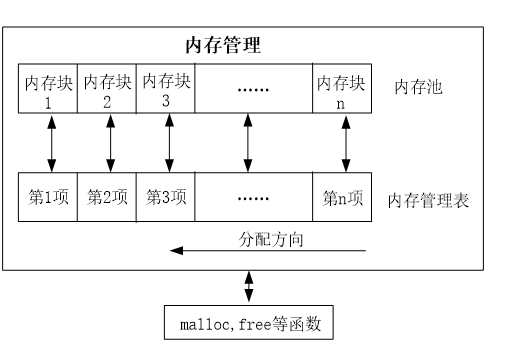

<!-- more -->


我们学习了使用 STM32F1 驱动外部 SRAM，以扩展 STM32F1 的内存，加上STM32F1 本身自带的 64K 字节内存，我们可供使用的内存还是比较多的。如果我们所用的内存都像上一节的 testsram 那样，定义一个数组来使用，显然不是一个好办法。后来在使用Flash做Bootloader实验的时候，就无法在原有工程中定义一个55KB的数组，然后 lcd做字模缩放的时候，数组也是预先定义好的，直接就16KB，再加上一些其他的，STM32内部Flash一共就64KB，直接被我占满，sct文件中定义了SRAM的长度，导致编译都无法通过，所以动态的去管理内存就很有必要了。

# <font size=3>一、内存管理简介</font>

## <font size=3>1. 什么是内存管理</font>

内存管理，是指软件运行时对计算机内存资源的分配和使用的技术。其**最主要的目的**是如何高效，快速的分配，并且在适当的时候释放和回收内存资源。 内存管理的实现方法有很多种，他们其实最终都是要实现 2 个函数： malloc 和 free； malloc 函数用于内存申请， free 函数用于内存释放。  

## <font size=3>2. 两个函数</font>

我们不详细去挖malloc和free是如何申请和释放内存的，这里只学习函数的用法。

### <font size=3>2.1 malloc()</font>

```c
#include <stdlib.h>
extern _ARMABI void *malloc(size_t /*size*/);
   /*
    * allocates space for an object whose size is specified by 'size' and whose
    * value is indeterminate.
    * Returns: either a null pointer or a pointer to the allocated space.
    */
```

**【函数说明】**申请指定字节数的内存空间。

**【函数参数】**

- size_t ：函数的声明中，只有形参类型，我们在keil中追踪这个类型，会发现它其实就是 unsigned int 类型，表示我们要申请的内存空间的字节数。

**【注意事项】**

（1）申请到的内存空间不会自动初始化，我们需要自己去初始化；

（2）函数返回值为void *类型，我们需要做强制类型转换，转换为我们需要的数据类型的指针类型。

### <font size=3>2.2 free()</font>

```c
#include <stdlib.h>
extern _ARMABI void free(void * /*ptr*/);
   /*
    * causes the space pointed to by ptr to be deallocated (i.e., made
    * available for further allocation). If ptr is a null pointer, no action
    * occurs. Otherwise, if ptr does not match a pointer earlier returned by
    * calloc, malloc or realloc or if the space has been deallocated by a call
    * to free or realloc, the behaviour is undefined.
    */
```

**【函数说明】**释放通过malloc申请的内存空间。

**【函数参数】**

- void ：函数的声明中，只有形参类型，这是一个void *类型，表示要释放的内存空间的首地址。

**【注意事项】**

# <font size=3>二、分布式内存管理</font>

我们来学习一种比较简单的办法来实现：分块式内存管理。

## <font size=3>1. 基本原理</font>



分块式内存管理由**内存池**和**内存管理表**两部分组成。内存池被等分为n块，对应的内存管理表，大小也为n，内存管理表的每一个项对应内存池的一块内存。

内存管理表的项值代表的意义：当该项值为0的时候，代表对应的内存块未被占用，当该项值非零的时候，代表该项对应的内存块已经被占用，其数值则代表被连续占用的内存块数。比如某项值为10，那么说明包括本项对应的内存块在内，总共分配了10个内存块给外部的某个指针。

内存分配方向：是从顶到底的分配方向。即首先从最末端开始找空内存。当内存管理刚初始化的时候，内存管理表全部清零，表示没有任何内存块被占用。

## <font size=3>2. 分配原理</font>

当指针p调用malloc申请内存的时候，先判断p要分配的内存块数（m），然后从第n项开始，向下查找，直到找到m块连续的空内存块（即对应内存管理表项为0），然后将这m个内存管理表项的值都设置为m（标记被占用），最后，把最后的这个空内存块的地址返回指针p，完成一次分配。注意，如果当内存不够的时候（找到最后也没找到连续的m块空闲内存），则返回NULL给p，表示分配失败。

## <font size=3>3. 释放原理</font>

当指针p申请的内存用完，需要释放的时候，调用free函数实现。free函数先判断p指向的内存地址所对应的内存块，然后找到对应的内存管理表项目，得到p所占用的内存块数目m（内存管理表项目的值就是所分配内存块的数目），将这m个内存管理表项目的值都清零，标记释放，完成一次内存释放。

# <font size=3>三、函数设计</font>

## <font size=3>1. 内存管理控制结构体</font>

```c
// 内存管理控制器
typedef struct __malloc_dev
{
    int8_t (*init)(uint8_t);       // 初始化
    uint8_t (*perused)(uint8_t); // 内存使用率
    uint8_t *membase[SRAMBANK];  // 内存池 管理SRAMBANK个区域的内存
    uint16_t *memmap[SRAMBANK];  // 内存管理状态表
    uint8_t memrdy[SRAMBANK];    // 内存管理是否就绪
}FUNC_MEM;
```

## <font size=3>2. 其他函数</font>

其他的那些函数这里就没必要写了，可以看这里：[scm-dev: MALLOC](https://gitee.com/embedded-devs/scm-dev/tree/master/40-MEMORY/20-mem-mangement/Drivers/Middlewares/MALLOC)
