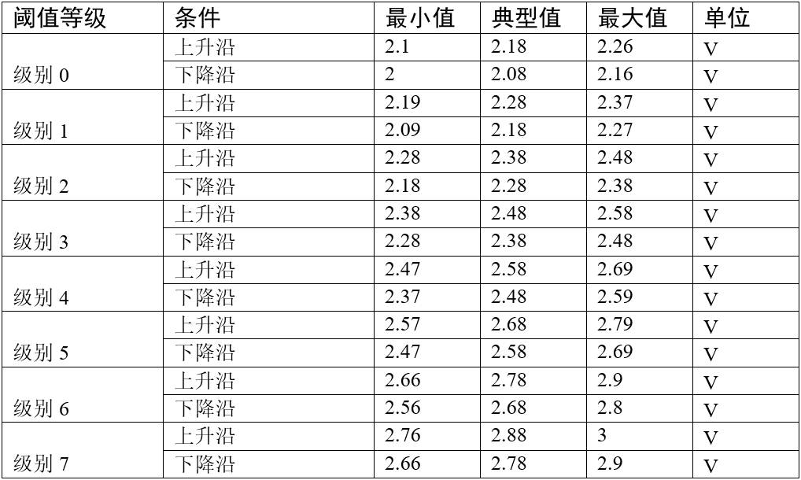
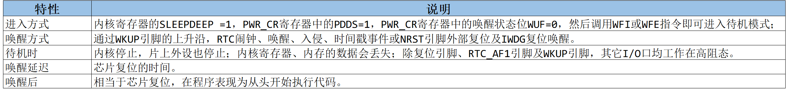

<!-- more -->


## 一、STM32电源管理

### 1. 电源管理简介

电源对电子设备的重要性不言而喻，它是保证系统稳定运行的基础，而保证系统能稳定运行后，又有**低功耗**的要求。

在很多应用场合中都对电子设备的功耗要求非常苛刻，如某些传感器信息采集设备，仅靠小型的电池提供电源，要求工作长达数年之久，且期间不需要任何维护；由于智慧穿戴设备的小型化要求，电池体积不能太大导致容量也比较小，所以也很有必要从控制功耗入手，提高设备的续行时间。

因此， STM32 有专门的电源管理外设监控电源并管理设备的运行模式，确保系统正常运行，并尽量降低器件的功耗。  

### 2. 电源系统结构

为了方便进行电源管理， STM32把它的外设、内核等模块跟据功能划分了供电区域，其内部电源区域划分如图。  我们可以看一下 [STM32中文参考手册](https://www.stmcu.com.cn/Designresource/detail/localization_document%20/710001)的4.1 电源一节：


①、VDDA供电区域： 该部分为ADC、 DAC等部分模拟外设供电。如 ADC的工作电源使用VDDA引脚输入，使用VSSA作为独立的地连接，VREF引脚则为ADC提供测量使用的参考电压。 独立出电源方便添加一些去耦电容进行滤波。 该区域由VDDA输入， VSSA接地， VREF提供参考电压。

②、VDD供电区域： 该部分为I/O、 待机电路、电压调节器供电。 电压调节器可以运行在“运行模式”、“停止模式” 和“待机模式”，为后面的1.8V供电区域供电。 低功耗，实质就是对电压调节器进行配置，使其工作在不同的模式，实现低功耗。 前面学习的IWDG属于VDD供电区域，不受低功耗模式影响，系统处于低功耗模式也能正常工作。

③、1.8V供电区域： 该部分为CPU核心、存储器以及数字部分外设供电。电压调节器为其提供1.8V左右电压，因此本区域被称为1.8V供电区域。电压调节器处于运行模式时，本区域正常运行；处于停止模式时，本区域所有时钟关闭，外设保持“暂停”状态， 会保留内核寄存器以及SRAM内容；处于待机模式时，本区域断电，所有寄存器（后备供电区域的寄存器除外） 和SRAM数据丢失。

④、后备供电区域（备份域电路）： 该部分为LSE 32K晶振、后备寄存器、 RCC BDCR寄存器和RTC供电。 系统正常工作时，由VDD供电；系统突然调电时，由VBAT供电。 本区域不受低功耗模式影响，比如电压调节器处于待机模式， RTC也正常工作， 后备寄存器数据也不会丢失。  一般在实际应用中，这一部分一般会使用3V的钮扣电池对该引脚供电。  

在图中备份域电路的左侧有一个电源开关结构，它的功能类似下图的双二极管，在它的“1”处连接了VBAT电源，“2”处连接了VDD主电源(一般为3.3V)，右侧“3”处引出到备份域电路中。当VDD主电源存在时，由于VDD电压较高，备份域电路通过VDD供电，节省钮扣电池的电源，仅当VDD掉电时，备份域电路由钮扣电池通过VBAT供电，保证电路能持续运行，从而可利用它保留关键数据。  


### 3. 电源监控器

STM32芯片主要通过引脚VDD从外部获取电源，在它的内部具有电源监控器用于检测VDD的电压，以实现复位功能及掉电紧急处理功能，保证系统可靠地运行。  

#### 3.1 上电复位与掉电复位 (POR 与 PDR)  

当检测到 VDD 的电压低于阈值 VPOR 及 VPDR 时，无需外部电路辅助， STM32 芯片会自动保持在复位状态，防止因电压不足强行工作而带来严重的后果。见图 POR 与 PDR ，在刚开始电压低于 VPOR 时 (约 1.92V)， STM32 保持在上电复位状态 (POR， Power On Reset)，当 VDD 电压持续上升至大于 VPOR时，芯片开始正常运行，而在芯片正常运行的时候，当检测到 VDD 电压下降至低于 VPDR 阈值 (约 1.88V)，会进入掉电复位状态 (PDR， Power Down Reset)。  


#### 3.2 可编程电压检测器 PVD  


上述 POR、 PDR 功能是使用其电压阈值与外部供电电压 VDD 比较，当低于工作阈值时，会直接进入复位状态，这可防止电压不足导致的误操作。除此之外， STM32 还提供了可编程电压检测器 PVD，它也是实时检测 VDD 的电压，当检测到电压低于编程的 VPVD 阈值时，会向内核产生一个 PVD 中断 (EXTI16 线中断) 以使内核在复位前进行紧急处理。该电压阈值可通过电源控制寄存器 PWR_CSR 设置。使用 PVD 可配置 8 个等级，见下表：



其中的上升沿和下降沿分别表示类似图 POR与 PDR 中 VDD 电压上升过程及下降过程的阈值。  

### 4. 电压调节器

复位后电压调节器总是使能的。根据应用方式它以3种不同的模式工作：

- 运转模式：调节器以正常功耗模式提供1.8V电源(内核，内存和外设)。

- 停止模式：调节器以低功耗模式提供1.8V电源，以保存寄存器和SRAM的内容。

- 待机模式：调节器停止供电。除了备用电路和备份域外，寄存器和SRAM的内容全部丢失。

## 二、STM32功耗模式

在系统或电源复位以后，微控制器处于运行状态。当CPU不需继续运行时，可以利用多种低功 耗模式来节省功耗，例如等待某个外部事件时。用户需要根据最低电源消耗、最快速启动时间 和可用的唤醒源等条件，选定一个最佳的低功耗模式。

### 1. 三种低功耗模式

按功耗由高到低排列， STM32具有运行、睡眠、停止和待机四种工作模式。上电复位后STM32处于运行状态时，当内核不需要继续运行，就可以选择进入后面的三种低功耗模式降低功耗，这三种模式中，电源消耗不同、唤醒时间不同、唤醒源不同，用户需要根据应用需求，选择最佳的低功耗模式。三种低功耗的模式说明见下表：


这三种低功耗模式层层递进，运行的时钟或芯片功能越来越少，因而功耗越来越低。最低功耗的是待机模式，在此模式下，最低只需要 2uA 左右的电流。停机模式是次低功耗的，其典型的电流消耗在 20uA 左右。最后就是睡眠模式了。用户可以根据自己的需求来决定使用哪种低功耗模式。    

### 2. 三种模式说明

【注意】睡眠模式、停止模式及待机模式中，若备份域电源正常供电，备份域内的RTC都可以正常运行，备份域内的寄存器的数据会被保存，不受功耗模式影响。

#### 2.1 睡眠模式

该模式仅关闭CPU内核时钟，内核停止运行，但其它外设，包括内核外设（ NVIC、 SysTick等）依旧正常运行。 有两种方式进入睡眠模式，它的进入方式决定了从睡眠唤醒的方式 。如果通过“ WFI（ Wait for Interrupt） ”方式进入睡眠模式，则需要中断唤醒； 如果通过“ WFE（ Waitfor Event）” 方式进入睡眠模式，则需要事件唤醒。  睡眠模式的各种特性见下表：  


#### 2.2 停止模式  

该模式进一步关闭HSI和HSE振荡器， 使用高速时钟作为时钟源所有外设都停止运行，也就是说在停止模式中，进一步关闭了其它所有的时钟，于是所有的外设都停止了工作。 电压调节器保持开启或低功耗模式，因此1.8V供电区域没有断电，SRAM、外设寄存器的数据依旧保留，不会消失。所以从停止模式唤醒，并重新开启时钟后，还可以从上次停止处继续执行代码。停止模式可以由任意一个外部中断(EXTI)唤醒，在停止模式中可以选择电压调节器为开模式或低功耗模式。停止模式的各种特性见下表：


停止模式下典型电流为20uA。

#### 2.3 待机模式

待机模式，它除了关闭所有的时钟，进一步关闭电压调节器，因此1.8V区域的电源也完全关闭了，SRAM、外设寄存器的数据全部丢失。也就是说，从待机模式唤醒后，唤醒后效果类似复位。由于没有之前代码的运行记录，只能对芯片复位，重新检测boot条件，从头开始执行程序。它有四种唤醒方式，分别是WKUP(PA0)引脚的上升沿，RTC闹钟事件，NRST引脚的复位和IWDG(独立看门狗)复位。



待机模式理想状态下，只需要2uA电流。待机模式下的输入/输出端口状态 在待机模式下，所有的I/O引脚处于高阻态，除了以下的引脚：

（1）复位引脚(始终有效)  。

（2）当被设置为防侵入或校准输出时的TAMPER引脚 。

（3）被使能的唤醒引脚。

从待机模式唤醒后的代码执行等同于复位后的执行(采样启动模式引脚，读取复位向量等)。电源控制/状态寄存器(PWR_CSR)将会指示内核由待机状态退出。

## 三、相关寄存器

### 1. 电源控制寄存器(PWR_CR) 


（1）设置PDDS位进入深度睡眠时进入待机模式。

（2）设置CWUF位，清除之前的WUF唤醒位。

### 2. 电源控制/状态寄存器(PWR_CSR) 


（1）设置EWUP，使能WKUP引脚用于待机模式唤醒。

（2）WUF唤醒标志，用来判断是否发生唤醒事件。

## 四、库函数与命令

### 1. WFI与WFE命令

我们了解到进入各种低功耗模式时都需要调用 WFI 或 WFE 命令，它们实质上都是内核指令，在库文件 cmsis_armcc.h 中把这些指令封装成了函数 ：

```c
/**
  \brief   Wait For Interrupt
  \details Wait For Interrupt is a hint instruction that suspends execution until one of a number of events occurs.
 */
#define __WFI                             __wfi

/**
  \brief   Wait For Event
  \details Wait For Event is a hint instruction that permits the processor to enter
           a low-power state until one of a number of events occurs.
 */
#define __WFE                             __wfe

```

对于这两个指令，我们应用时一般只需要知道，调用它们都能进入低功耗模式，需要使用函数的格式“\_\_WFI();”和“\_\_WFE();”来调用 (因为 \_\_wfi 及 \_\_wfe 是编译器内置的函数，函数内部调用了相应的汇编指令)。其中 WFI 指令决定了它需要用中断唤醒，而 WFE 则决定了它可用事件来唤醒，关于它们更详细的区别可查阅《cortex-CM3/CM4 权威指南》了解。  

### 2. HAL_PWR_ConfigPVD()

```c
/**
  * @brief  Configures the voltage threshold detected by the Power Voltage Detector(PVD).
  * @param  sConfigPVD: pointer to an PWR_PVDTypeDef structure that contains the configuration
  *         information for the PVD.
  * @note   Refer to the electrical characteristics of your device datasheet for
  *         more details about the voltage threshold corresponding to each
  *         detection level.
  * @retval None
  */
void HAL_PWR_ConfigPVD(PWR_PVDTypeDef *sConfigPVD)
{
    // ......
    assert_param(IS_PWR_PVD_LEVEL(sConfigPVD->PVDLevel));
    // ......
}
```

这个函数是配置PVD (Power voltage Detector)检测的电压阈值。主要是通过函数中的这一句完成阈值的配置：

```c
assert_param(IS_PWR_PVD_LEVEL(sConfigPVD->PVDLevel));

#define IS_PWR_PVD_LEVEL(LEVEL) (((LEVEL) == PWR_PVDLEVEL_0) || ((LEVEL) == PWR_PVDLEVEL_1)|| \
                                 ((LEVEL) == PWR_PVDLEVEL_2) || ((LEVEL) == PWR_PVDLEVEL_3)|| \
                                 ((LEVEL) == PWR_PVDLEVEL_4) || ((LEVEL) == PWR_PVDLEVEL_5)|| \
                                 ((LEVEL) == PWR_PVDLEVEL_6) || ((LEVEL) == PWR_PVDLEVEL_7))
```

不同的等级就可以配置为不同的阈值。

### 3. HAL_PWR_EnterSLEEPMode()

```c
/**
  * @brief Enters Sleep mode.
  * @note  In Sleep mode, all I/O pins keep the same state as in Run mode.
  * @param Regulator: Regulator state as no effect in SLEEP mode -  allows to support portability from legacy software
  * @param SLEEPEntry: Specifies if SLEEP mode is entered with WFI or WFE instruction.
  *           When WFI entry is used, tick interrupt have to be disabled if not desired as 
  *           the interrupt wake up source.
  *           This parameter can be one of the following values:
  *            @arg PWR_SLEEPENTRY_WFI: enter SLEEP mode with WFI instruction
  *            @arg PWR_SLEEPENTRY_WFE: enter SLEEP mode with WFE instruction
  * @retval None
  */
void HAL_PWR_EnterSLEEPMode(uint32_t Regulator, uint8_t SLEEPEntry);
```

这个函数用于进入睡眠模式。

### 4. HAL_PWR_EnterSTOPMode()

```c
/**
  * @brief Enters Stop mode. 
  * @note  In Stop mode, all I/O pins keep the same state as in Run mode.
  * @note  When exiting Stop mode by using an interrupt or a wakeup event,
  *        HSI RC oscillator is selected as system clock.
  * @note  When the voltage regulator operates in low power mode, an additional
  *         startup delay is incurred when waking up from Stop mode. 
  *         By keeping the internal regulator ON during Stop mode, the consumption
  *         is higher although the startup time is reduced.    
  * @param Regulator: Specifies the regulator state in Stop mode.
  *          This parameter can be one of the following values:
  *            @arg PWR_MAINREGULATOR_ON: Stop mode with regulator ON
  *            @arg PWR_LOWPOWERREGULATOR_ON: Stop mode with low power regulator ON
  * @param STOPEntry: Specifies if Stop mode in entered with WFI or WFE instruction.
  *          This parameter can be one of the following values:
  *            @arg PWR_STOPENTRY_WFI: Enter Stop mode with WFI instruction
  *            @arg PWR_STOPENTRY_WFE: Enter Stop mode with WFE instruction   
  * @retval None
  */
void HAL_PWR_EnterSTOPMode(uint32_t Regulator, uint8_t STOPEntry);
```

这个函数用于进入停止模式，这个函数有两个输入参数，分别用于控制调压器的模式及选择使用 WFI 或 WFE 停止，代码中先是根据调压器的模式配置 PWR_CR 寄存器，再把内核寄存器的 SLEEPDEEP 位置 1，这样再调用 WFI 或 WFE 命令时， STM32 就不是睡眠，而是进入停止模式了。函数结尾处的语句用于复位SLEEPDEEP 位的状态，由于它是在 WFI 及 WFE 指令之后的，所以这部分代码是在 STM32 被唤醒的时候才会执行。

要注意的是进入停止模式后， STM32 的所有 I/O 都保持在停止前的状态，而当它被唤醒时， STM32使用 HSI 作为系统时钟 (8MHz) 运行，由于系统时钟会影响很多外设的工作状态，所以一般我们在唤醒后会重新开启 HSE，把系统时钟设置回原来的状态。  

### 5. HAL_PWR_EnterSTANDBYMode()

```c
/**
  * @brief Enters Standby mode.
  * @note  In Standby mode, all I/O pins are high impedance except for:
  *          - Reset pad (still available) 
  *          - TAMPER pin if configured for tamper or calibration out.
  *          - WKUP pin (PA0) if enabled.
  * @retval None
  */
void HAL_PWR_EnterSTANDBYMode(void);
```

该函数中先配置了 PDDS 寄存器位及 SLEEPDEEP 寄存器位，接着调用 \_\_force_stores 函数确保存储操作完毕后再调用 WFI 指令，从而进入待机模式。这里值得注意的是，待机模式也可以使用WFE 指令进入的，如果有需要可以自行修改。

在进入待机模式后，除了被使能了的用于唤醒的 I/O，其余 I/O 都进入高阻态，而从待机模式唤醒后，相当于复位 STM32 芯片，程序重新从头开始执行。 

 
