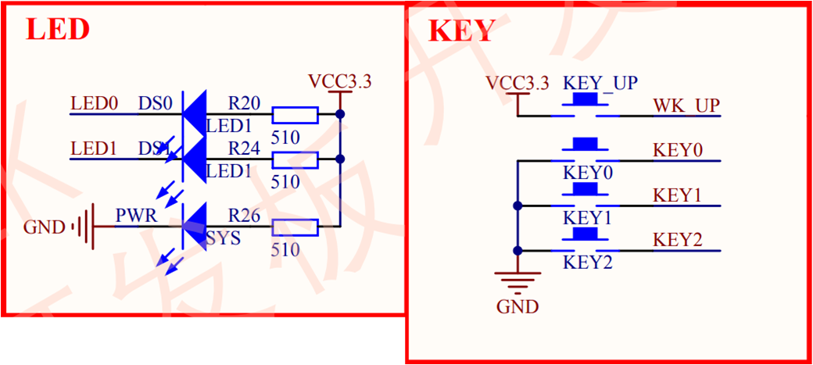
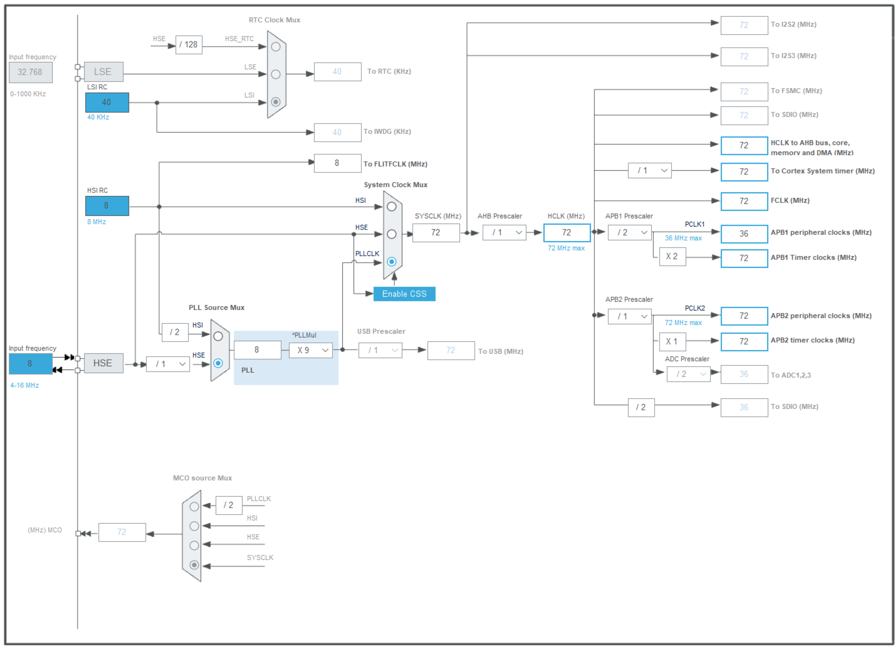
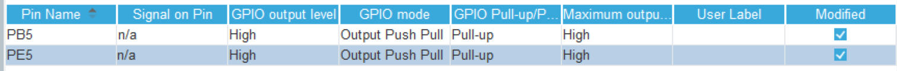
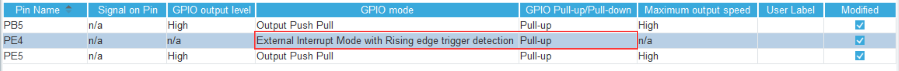
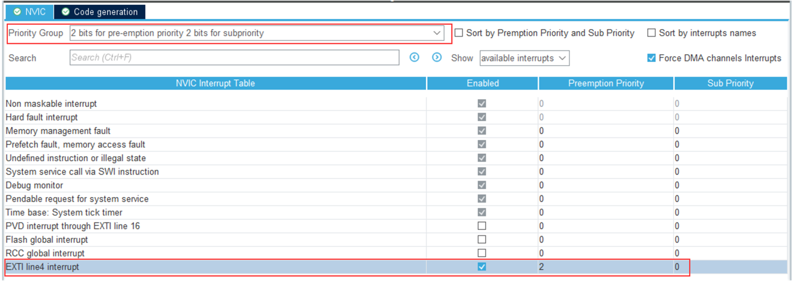
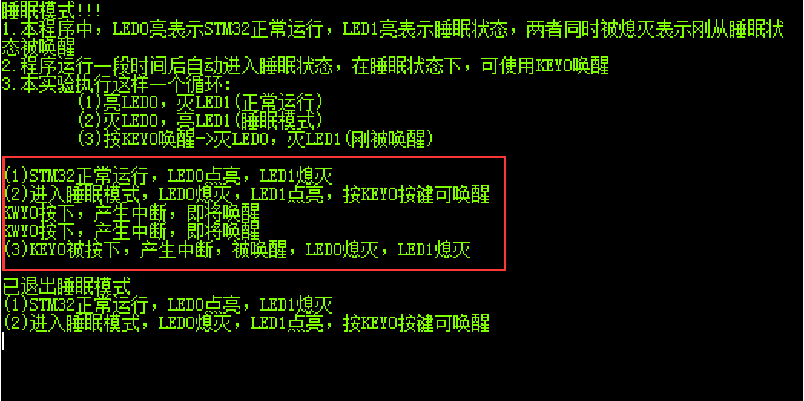
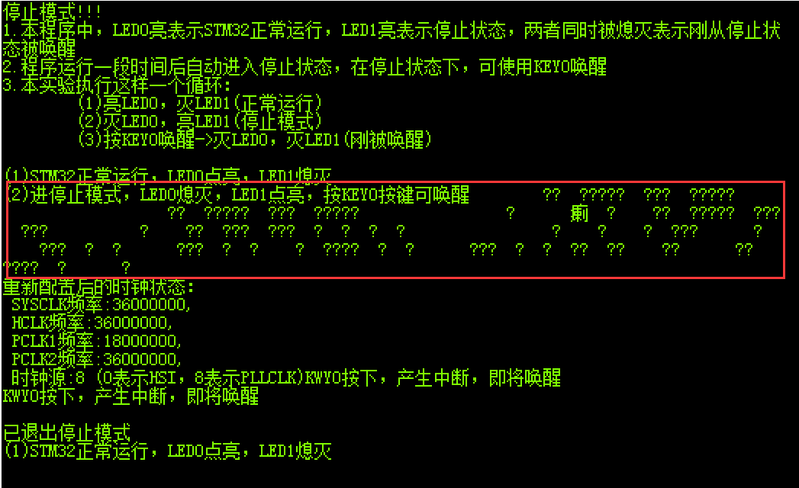
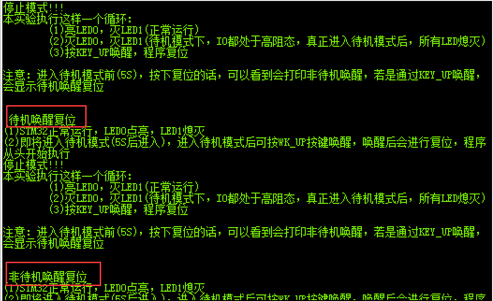

<!-- more -->

## 一、通用配置

### 1. 硬件原理图

硬件主要使用到了按键、 LED 以及使用串口输出调试信息。 



### 2. STM32CubeMX配置

#### 2.1 时钟树



#### 2.2 初始化LED



就是两个LED的初始化。

#### 2.3 初始化按键

这里的按键需要开启中断，这里使用KEY0，按下的时候为低电平，所以配置成中断的时候，对应的GPIO设置为上拉。



#### 2.4 中断配置

接下来配置一下NVIC：



#### 2.5 串口配置

就按正常的打开串口即可，另外需要做一下printf的移植。

### 3. 中断服务函数

实现下边的函数：

```c
void HAL_GPIO_EXTI_Callback(uint16_t GPIO_Pin)
{
    /* Prevent unused argument(s) compilation warning */
    UNUSED(GPIO_Pin);
    /* NOTE: This function Should not be modified, when the callback is needed,
             the HAL_GPIO_EXTI_Callback could be implemented in the user file
     */
	switch(GPIO_Pin)
	{
		case GPIO_PIN_4:
			printf("KWY0按下，产生中断，即将唤醒\r\n");
			
			break;
		default:
			break;
	}

```

### 4. 恢复时钟函数

与睡眠模式不一样，系统从停止模式被唤醒时，是使用 HSI 作为系统时钟的，在 STM32F103 中，HSI 时钟一般为 8MHz，与我们常用的 72MHz 相关太远，它会影响各种外设的工作频率。所以在系统从停止模式唤醒后，若希望各种外设恢复正常的工作状态，就要恢复停止模式前使用的系统时钟，这里定义了一个 SYSCLKConfig_STOP 函数，用于恢复系统时钟 ：

```c
/**
  * @brief  从停止模式唤醒后配置系统时钟:启用HSE、PLL并选择PLL作为系统时钟源。
  */
void SYSCLKConfig_STOP(void)
{
  RCC_ClkInitTypeDef RCC_ClkInitStruct = {0};
  RCC_OscInitTypeDef RCC_OscInitStruct = {0};
  uint32_t pFLatency = 0;

  /* 启用电源控制时钟 */
  __HAL_RCC_PWR_CLK_ENABLE();

  /* 根据内部RCC寄存器获取振荡器配置 */
  HAL_RCC_GetOscConfig(&RCC_OscInitStruct);

  /* 从停止模式唤醒后重新配置系统时钟: 启用HSE和PLL */
  RCC_OscInitStruct.OscillatorType = RCC_OSCILLATORTYPE_HSE;
  RCC_OscInitStruct.HSEState = RCC_HSE_ON;
  RCC_OscInitStruct.PLL.PLLState = RCC_PLL_ON;
  if (HAL_RCC_OscConfig(&RCC_OscInitStruct) != HAL_OK)
  {
    Error_Handler();
  }

  /* 根据内部RCC寄存器获取时钟配置 */
  HAL_RCC_GetClockConfig(&RCC_ClkInitStruct, &pFLatency);

  /* 选择 PLL 作为系统时钟源, 并配置 HCLK、PCLK1 和 PCLK2时钟分频系数 */
  RCC_ClkInitStruct.ClockType = RCC_CLOCKTYPE_SYSCLK;
  RCC_ClkInitStruct.SYSCLKSource = RCC_SYSCLKSOURCE_PLLCLK;
  if (HAL_RCC_ClockConfig(&RCC_ClkInitStruct, pFLatency) != HAL_OK)
  {
    Error_Handler();
  }
}
```


### 5. 无法下载了？

**【注意】**有当系统处于睡眠模式低功耗状态时 (包括后面的停止模式及待机模式)，使用 DAP 下载器是无法给芯片下载程序的，所以下载程序时要先把系统唤醒。或者使用如下方法：按着板子的复位按键，使系统处于复位状态，然后点击电脑端的下载按钮下载程序，这时再释放复位按键，就能正常给板子下载程序了。  但是我用的JLink好像没什么影响，当无法下载程序的时候知道这样操作即可。

## 二、睡眠模式

### 1. 软件设计

（1）初始化用于唤醒的中断按键；

（2）进入睡眠状态；

（3）使用按键中断唤醒芯片； 

### 2. 睡眠模式唤醒实现

```c
int main(void)
{

    HAL_Init();

    SystemClock_Config();

    MX_GPIO_Init();
    MX_USART1_Init();

	printf("睡眠模式!!!\r\n");
	printf("1.本程序中，LED0亮表示STM32正常运行，LED1亮表示睡眠状态，两者同时被熄灭表示刚从睡眠状态被唤醒\r\n");
	printf("2.程序运行一段时间后自动进入睡眠状态，在睡眠状态下，可使用KEY0唤醒\r\n");
	printf("3.本实验执行这样一个循环：\r\n");
	printf("        (1)亮LED0，灭LED1(正常运行)\r\n");
	printf("        (2)灭LED0，亮LED1(睡眠模式)\r\n");
	printf("        (3)按KEY0唤醒->灭LED0，灭LED1(刚被唤醒)\r\n\r\n");
	
	LED0 = 1;
	LED1 = 1;
    while (1)
    {
        // 正常运行程序
        printf("(1)STM32正常运行，LED0点亮，LED1熄灭\r\n");
        LED0 = 0;LED1 = 1;
        HAL_Delay(2000);

        // 进入睡眠模式
        printf("(2)进入睡眠模式，LED0熄灭，LED1点亮，按KEY0按键可唤醒\r\n");
        LED0 = 1;LED1 = 0;         // 使用LED1指示，进入睡眠状态
        HAL_SuspendTick();// 暂停滴答时钟，防止通过滴答时钟中断唤醒
        HAL_PWR_EnterSLEEPMode(PWR_MAINREGULATOR_ON, PWR_SLEEPENTRY_WFI); // 进入睡眠模式

        // 等待中断唤醒  KEY0按键中断
        printf("(3)KEY0被按下，产生中断，被唤醒，LED0熄灭，LED1熄灭\r\n");
        LED0 = 1;
        LED1 = 1;
        HAL_ResumeTick(); // 被唤醒后，恢复滴答时钟	
        HAL_Delay(2000);	
        printf("\r\n已退出睡眠模式\r\n");

        //继续执行while循环

    }
}
```

我们根据上边的提示，可以看到对应的现象，同时串口的输出信息如下：



## 三、停止模式

### 1. 软件设计

（1）初始化用于唤醒的中断按键；

（2）选择电压调节器的工作模式并进入停止状态；

（3）使用按键中断唤醒芯片；  

（4）重启 HSE 时钟，使系统完全恢复停止前的状态。  

### 2. 停止模式唤醒实现

```c
int main(void)
{

  uint32_t SYSCLK_Frequency = 0;
  uint32_t HCLK_Frequency = 0;
  uint32_t PCLK1_Frequency = 0;
  uint32_t PCLK2_Frequency = 0;
  uint32_t SYSCLK_Source = 0;

  HAL_Init();

  SystemClock_Config();

  MX_GPIO_Init();
  MX_USART1_Init();

  printf("停止模式!!!\r\n");
  printf("1.本程序中，LED0亮表示STM32正常运行，LED1亮表示停止状态，两者同时被熄灭表示刚从停止状态被唤醒\r\n");
  printf("2.程序运行一段时间后自动进入停止状态，在停止状态下，可使用KEY0唤醒\r\n");
  printf("3.本实验执行这样一个循环：\r\n");
  printf("        (1)亮LED0，灭LED1(正常运行)\r\n");
  printf("        (2)灭LED0，亮LED1(停止模式)\r\n");
  printf("        (3)按KEY0唤醒->灭LED0，灭LED1(刚被唤醒)\r\n\r\n");

  LED0 = 1;
  LED1 = 1;
  while (1)
  {
      // 正常运行程序
      printf("(1)STM32正常运行，LED0点亮，LED1熄灭\r\n");
      LED0 = 0;
      LED1 = 1;
      HAL_Delay(2000);

      // 进入停止模式
      printf("(2)进停止模式，LED0熄灭，LED1点亮，按KEY0按键可唤醒\r\n");
      LED0 = 1;
      LED1 = 0;                                                       // 使用LED1指示，进入停止状态
      HAL_SuspendTick();                                              // 暂停滴答时钟，防止通过滴答时钟中断唤醒
      HAL_PWR_EnterSTOPMode(PWR_MAINREGULATOR_ON, PWR_STOPENTRY_WFI); // 进入停止模式

      // 等待中断唤醒  KEY0按键中断
      printf("(3)KEY0被按下，产生中断，被唤醒，LED0熄灭，LED1熄灭\r\n");

      SystemCoreClockUpdate(); // 根据时钟寄存器的值更新SystemCoreClock变量
      // 获取唤醒后的时钟状态
      SYSCLK_Frequency = HAL_RCC_GetSysClockFreq();
      HCLK_Frequency = HAL_RCC_GetHCLKFreq();
      PCLK1_Frequency = HAL_RCC_GetPCLK1Freq();
      PCLK2_Frequency = HAL_RCC_GetPCLK2Freq();
      SYSCLK_Source = __HAL_RCC_GET_SYSCLK_SOURCE();
      // 这里由于串口直接使用HSI时钟，不会会影响串口波特率
      printf("\r\n刚唤醒的时钟状态：\r\n");
      printf(" SYSCLK频率:%d,\r\n HCLK频率:%d,\r\n PCLK1频率:%d,\r\n PCLK2频率:%d,\r\n 时钟源:%d (0表示HSI，8表示PLLCLK)\n",
             SYSCLK_Frequency, HCLK_Frequency, PCLK1_Frequency, PCLK2_Frequency, SYSCLK_Source);
      /* 从停止模式唤醒后配置系统时钟:启用HSE、PLL*/
      /* 选择PLL作为系统时钟源(HSE和PLL在停止模式下被禁用)*/
      SYSCLKConfig_STOP();

      LED0 = 1;
      LED1 = 1;
      HAL_ResumeTick(); // 被唤醒后，恢复滴答时钟
      //获取重新配置后的时钟状态
      SYSCLK_Frequency = HAL_RCC_GetSysClockFreq(); 
      HCLK_Frequency   = HAL_RCC_GetHCLKFreq();
      PCLK1_Frequency  = HAL_RCC_GetPCLK1Freq();
      PCLK2_Frequency  = HAL_RCC_GetPCLK2Freq();
      SYSCLK_Source    = __HAL_RCC_GET_SYSCLK_SOURCE();

      //重新配置时钟源后始终状态
      printf("\r\n重新配置后的时钟状态：\r\n");
      printf(" SYSCLK频率:%d,\r\n HCLK频率:%d,\r\n PCLK1频率:%d,\r\n PCLK2频率:%d,\r\n 时钟源:%d (0表示HSI，8表示PLLCLK)\n", 
             SYSCLK_Frequency,HCLK_Frequency,PCLK1_Frequency,PCLK2_Frequency,SYSCLK_Source);

      HAL_Delay(2000);
      printf("\r\n已退出停止模式\r\n");

    // 继续执行while循环
  }
}
```

然后会看到串口有如下的打印：



可以看到，唤醒后的打印都是乱码，当重新配置后，串口恢复正常。

## 四、待机模式

### 1. 软件设计

（1）清除 WUF 标志位；

（2）使能 WKUP 唤醒功能；

（3）进入待机状态。  

【注意】这里其实我们需要用到的是PA0，也就是WK UP唤醒引脚，这个引脚接在了KEY_UP上，当按键按下的时候会产生一个高电平，即便这个引脚不进行初始化，照样可以产生唤醒事件，但是由于没有进行初始化，所以这种情况下不能作为普通按键使用。另外这里KEY0的中断也开着，但是实验中没有什么用。

### 2. 待机模式唤醒实现

```c
int main(void)
{

    HAL_Init();

    SystemClock_Config();

    MX_GPIO_Init();
    MX_USART1_Init();

    printf("停止模式!!!\r\n");
    printf("本实验执行这样一个循环：\r\n");
    printf("        (1)亮LED0，灭LED1(正常运行)\r\n");
    printf("        (2)灭LED0，灭LED1(待机模式下，IO都处于高阻态，真正进入待机模式后，所有LED熄灭)\r\n");
    printf("        (3)按KEY_UP唤醒，程序复位\r\n\r\n");
    printf("注意：进入待机模式前(5S)，按下复位的话，可以看到会打印非待机唤醒，若是通过KEY_UP唤醒，会显示待机唤醒复位\r\n\r\n");
    LED0 = 0; LED1 = 0;
    //检测复位来源
    if(__HAL_PWR_GET_FLAG(PWR_FLAG_SB) == SET)
    {
        __HAL_PWR_CLEAR_FLAG(PWR_FLAG_SB);
        printf("\r\n 待机唤醒复位 \r\n");
    }
    else
    {
        printf("\r\n 非待机唤醒复位 \r\n");
    }
    while (1)
    {
        // 正常运行程序
        printf("(1)STM32正常运行，LED0点亮，LED1熄灭\r\n");
        LED0 = 0; LED1 = 1;
        HAL_Delay(2000);

        printf("(2)即将进入待机模式(5S后进入)，进入待机模式后可按WK_UP按键唤醒，唤醒后会进行复位，程序从头开始执行\r\n");
        LED0 = 1; LED1 = 0; 
        HAL_Delay(5000); // 延时加在这里，是因为，这样会有LED变化的一个状态，当进入待机模式的时候，LED将会全部熄灭
        __HAL_PWR_CLEAR_FLAG(PWR_FLAG_WU); // 清除WU状态位
        HAL_PWR_EnableWakeUpPin(PWR_WAKEUP_PIN1);// 使能WKUP引脚的唤醒功能 ，使能PA0
        HAL_SuspendTick();// 暂停滴答时钟，防止通过滴答时钟中断唤醒
        HAL_PWR_EnterSTANDBYMode(); // 进入待机模式

        printf("(3)程序从头开始执行，这一句将永远不会执行\r\n");
    }
}
```

会看到这样的打印：



按下KEY_UP唤醒一次，然后在下一次进入待机模式前，按下复位，会看到打印出非待机唤醒复位。但是有一个bug，就是按下复位后，进入待机状态，总会自己再产生一次唤醒复位，目前还不清楚原因，可能是逻辑写的有问题，后边知道了再补充修改吧。

## 五、电源监控

我们可以使用 PVD 监控 STM32 芯片的 VDD 引脚，当监测到供电电压低于阈值时会产生 PVD 中断，系统进入中断服务函数进入**紧急处理过程**。  这里我们实现一个掉电检测的程序。

### 1. 软件设计

（1）初始化 PVD 中断；

（2）设置 PVD 电压监控等级并使能 PVD；

（3）编写 PVD 中断服务函数，处理紧急任务。  

### 2. 掉电检测实现

STM32CubeMX中没有相关配置，我们直接使用HAL库自己编写。

#### 2.1 初始化 PVD  

```c
void PVD_Config(void)
{
	PWR_PVDTypeDef sConfigPVD;
	
	/*使能 PWR 时钟 */
	__HAL_RCC_PWR_CLK_ENABLE();
	/* 配置 PVD 中断 */
	/*中断设置，抢占优先级0，子优先级为1，之前配置2位抢占2位子优先级 */
	HAL_NVIC_SetPriority(PVD_IRQn, 0 ,1);
	HAL_NVIC_EnableIRQ(PVD_IRQn);  

	/* 配置PVD级别5 (PVD检测电压的阈值为2.8V，
	   VDD电压低于2.8V时产生PVD中断，具体数据
	   可查询数据手册获知) 具体级别根据自己的
	   实际应用要求配置*/
	sConfigPVD.PVDLevel = PWR_PVDLEVEL_5;
	sConfigPVD.Mode = PWR_PVD_MODE_IT_RISING_FALLING;
	HAL_PWR_ConfigPVD(&sConfigPVD);
	/* 使能PVD输出 */
	HAL_PWR_EnablePVD();
}
```

（1）使能电源管理时钟。

（2）配置 PVD 的中断优先级。由于电压下降是非常危急的状态，所以尽量把它配置成最高优先级。

（3）使用库函数 HAL_PWR_ConfigPVD 设置 PVD 监控的电压阈值等级，各个阈值等级表示的电压值需要查阅 STM32 的数据手册。

（4）最后使用库函数 HAL_PWR_EnablePVD 使能 PVD 功能。  

#### 2.2 PVD 中断服务函数  

我们可以从启动文件中找到这个中断服务函数：

```c
void PendSV_Handler(void)
{
  HAL_PWR_PVD_IRQHandler();
}
```

然后我们需要实现一个回调函数：

```c
void HAL_PWR_PVDCallback(void)
{
    /* 实际应用中应进入紧急状态处理 */
    LED0 = !LED0;
}
```

注意这个中断服务函数的名是 PVD_IRQHandler 而不是 EXTI16_IRQHandler(STM32 没有这样的中断函数名)，示例中我们仅点亮了 LED 红灯，不同的应用中要根据需求进行相应的紧急处理。  

#### 2.3 main函数

```c
int main(void)
{
      HAL_Init();

      SystemClock_Config();

      MX_GPIO_Init();
      MX_USART1_Init();

      while (1)
      {
            LED0 = !LED0;
            HAL_Delay(500);
      }
}
```

### 3. 实验效果

正常来讲，当断电的时候，或者电压低于阈值的时候，会进入中断服务函数，中断服务函数中可以做一些保存数据的操作等，这里例程还没有支持存储设备，就先写在这，后边知道怎么写就行了。
