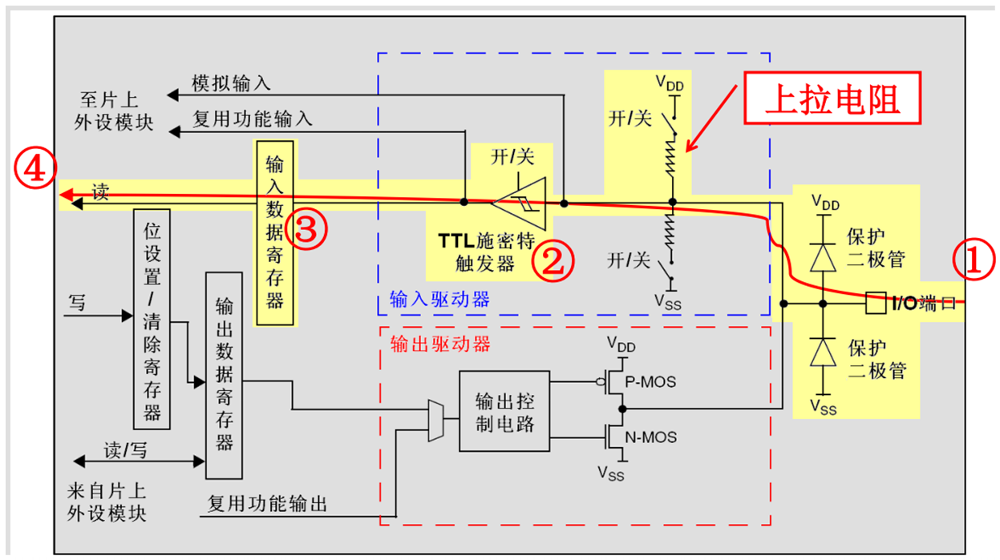
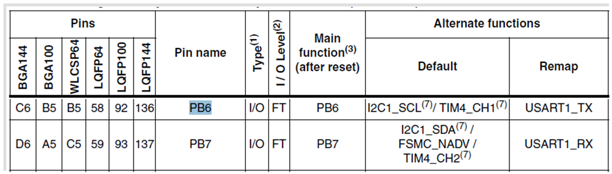

<!-- more -->


## 一、GPIO简介

GPIO是通用输入输出端口的简称，简单来说就是STM32可控制的引脚，STM32芯片的GPIO引脚与外部设备连接起来，从而实现与外部通讯、控制以及数据采集的功能。 STM32芯片的GPIO被分成很多组，每组有16个引脚（也有可能少于16个），如型号为STM32F103ZET6型号的芯片有GPIOA、GPIOB、GPIOC至GPIOG共7组GPIO，一共就有16x7=112个IO，该芯片一共144个引脚，其中GPIO引脚就占了一大部分，所有的GPIO引脚都有基本的输入输出功能。

最基本的输出功能是由STM32控制引脚输出高、低电平，实现开关控制，如把GPIO引脚接入到LED灯，那就可以控制LED灯的亮灭，引脚接入到继电器或三极管，那就可以通过继电器或三极管控制外部大功率电路的通断。

最基本的输入功能是检测外部输入电平，如把GPIO引脚连接到按键，通过电平高低区分按键是否被按下。

### 1. GPIO框图

在《STM32F10xx中文参考手册》的 8.1 GPIO功能描述 中就有GPIO的框图：


通过GPIO硬件结构框图，就可以从整体上深入了解GPIO外设及它的各种应用模式。该图从最右端看起，最右端就是代表STM32芯片引出的GPIO引脚，其余部件都位于芯片内部。

这里需要注意的是，在查看《STM32中文参考手册V10》中的GPIO的表格时，会看到有“FT”一列，这代表着这个GPIO口时兼容3.3V和5V的；如果没有标注“FT”，就代表着不兼容5V。然后VDD和VSS是多少？我们需要查阅一下 [STM32数据手册](https://www.st.com/resource/en/datasheet/stm32f103ze.pdf) 的 2.3.11 Power supply schemes可以知道VDD = 2.0 to 3.6 V，VSS的话其实是接到了GND，作为公共地。


#### 1.1 保护二极管

我们来看一下序号①，序号①是两个保护二极管：


引脚的两个保护二级管可以防止引脚外部过高或过低的电压输入：当引脚电压高于VDD时， 上方的二极管导通；当引脚电压低于VSS时，下方的二极管导通，防止不正常电压引入芯片导致芯片烧毁。

尽管有这样的保护，并不意味着STM32的引脚能直接外接大功率驱动器件，如直接驱动电机，强制驱动要么电机不转，要么导致芯片烧坏，必须要加大功率及隔离电路驱动。

#### 1.2上下拉电阻

我们来看一下序号②：


可以使管脚默认为高电平VDD或者低电平VSS，不配置的时候表示管脚浮空，电平状态未知。

#### 1.3 P-MOS管和N-MOS管

我们再来看一下序号③的部分：GPIO引脚线路经过两个保护二极管后，向上流向“输入模式”结构，向下流向“输出模式”结构。先看输出模式部分，线路经过一个由P-MOS和N-MOS管组成的单元电路。这个结构使GPIO具有了“**推挽输出**”和“**开漏输出**”两种模式。

##### 1.3.1 推挽输出

所谓的**推挽输出模式**，是根据这两个MOS管的工作方式来命名的。推挽结构由两个MOS管按互补对称的方式连接，任意时刻总是其中一个三极管导通，另一个三极管截止。内部由一个P-MOS管和一个N-MOS管组成，两个MOS管的栅极（ Gate， G）接到了左侧“输出控制” ，漏极（ Drain， D）接到外部输出， P-MOS管的源极（ Source， S）接到VDD（ 3.3V） ，N-MOS管的源极接到Vss（ 0V）。


- **对PMOS来说，Vs-Vg > Vgs(th)**，即S极和G极的压差大于一定值，PMOS管会导通。“ 输出控制 ”向两个MOS管栅极加一定电压时，P-MOS导通，此时VDD 经过P-MOS管的S&rarr;G&rarr;D输出， N-MOS管处于高阻态（电阻很大，近似开路） ，整体对外为高电平。（开启电压和其他参数可以看具体器件的SPEC）
- **对NMOS来说，Vg-Vs > Vgs(th)**，即G极和S极的压差大于一定值，NMOS管会导通，但是也不能大太多，否则烧坏MOS管。“输出控制” 取消向两个MOS管栅极施加电压，N-MOS管源极和漏极导通，此时Vss 经过N-MOS管的S&rarr;G&rarr;D输出，整体对外为低电平。 P-MOS管源极和栅极截止， P-MOS管处于高阻态。（开启电压和其他参数可以看具体器件的SPEC）

推挽模式下，让“输出控制” 变为了VDD/Vss输出， 使得输出电流增大， 提高了输出引脚的驱动能力，提高了电路的负载能力和开关的动作速度。  

推挽输出模式时的等效电路如下：


在该结构中输入高电平时，经过反向后，上方的P-MOS导通，下方的N-MOS关闭， 对外输出高电平；而在该结构中输入低电平时，经过反向后，N-MOS管导通，P-MOS关闭，对外输出低电平。当引脚高低电平切换时， 两个管子轮流导通，P管负责灌电流，N管负责拉电流，使其负载能力和开关速度都比普通的方式有很大的提高。

##### 1.3.2 开漏输出

开漏模式下， “输出控制”不会控制P-MOS管， “输出控制” **只会向N-MOS管栅极加一定电压**， 两个MOS管都处于截止状态， 两个漏极处于悬空状态，称之为漏极开路。 “输出控制” 取消栅极的施加电压， PMOS管依旧处于高阻态， N-MOS管导通，整体对外为低电平。  


由于在**开漏输出模式**时，上方的P-MOS管完全不工作，我们可以将其直接忽略掉。如果我们控制输出为0，低电平，则P-MOS管关闭，N-MOS管导通，使输出接地，若控制输出为1 (它无法直接输出高电平)时，则P-MOS管和N-MOS管都关闭，所以引脚既不输出高电平，也不输出低电平，为**高阻态**。为正常使用时必须外部接上拉电阻， 参考下图等效电路中等效电路。它具有“线与”特性，也就是说，若有很多个开漏模式引脚连接到一起时，只有当所有引脚都输出高阻态，才由上拉电阻提供高电平，此高电平的电压为外部上拉电阻所接的电源的电压。若其中一个引脚为低电平，那线路就相当于短路接地，使得整条线路都为低电平，0 V。


##### 1.4 应用

推挽输出模式一般应用在输出电平为0和3.3V而且需要高速切换开关状态的场合。在STM32的应用中，除了必须用开漏模式的场合，我们都习惯使用推挽输出模式。开漏输出一般应用在I2C、SMBUS通讯等需要“线与”功能的总线电路中。除此之外，还用在电平不匹配的场合，如需要输出5伏的高电平， 就可以在外部接一个上拉电阻，上拉电源为5伏，并且把GPIO设置为开漏模式，当输出高阻态时，由上拉电阻和电源向外输出5伏的电平，如下图：


#### 1.4 输出数据寄存器

前面提到的双MOS管结构电路的输入信号，是由GPIO“输出数据寄存器GPIOx_ODR”提供的，因此我们通过修改输出数据寄存器的值就可以修改GPIO引脚的输出电平。而“置位/复位寄存器GPIOx_BSRR”可以通过修改输出数据寄存器④的值从而影响电路的输出。

向该寄存器写入0或者1，可以使普通IO管脚输出高电平或者低电平。

#### 1.5 复用功能输出

⑤这个主要是配置GPIO作为除普通IO输出的其他功能电路的输出。

#### 1.6 输入数据寄存器

⑥可以读取普通IO管脚输入的高电平或者低电平。

#### 1.7 复用功能输入

⑦这个主要是配置GPIO作为除普通IO输入的其他功能电路的输入。

#### 1.8 模拟输入输出

⑧为模拟输入，配置此模式时，可以作为ADC或者DAC的管脚。

#### 1.9 TTL肖特基触发器

⑨是肖特基触发器，信号经过触发器后，模拟信号转化为0和1的数字信号。但是，当GPIO引脚作为ADC采集电压的输入通道时，用其“模拟输入”功能，此时信号不再经过触发器进行TTL电平转换，这是因为ADC外设要采集到的原始的模拟信号。

### 2. GPIO的八种工作模式

我们从参考手册中可以看到，STM32的GPIO共有八种工作模式


这八种工作模式可以分为两类：

- 4种输入模式：输入浮空、输入上拉、输入下拉、模拟输入

- 4种输出模式：开漏输出、开漏复用功能、推挽式输出、推挽式复用功能

| GPIO八种工作模式 | 特点及应用                                   |
| ---------------- | -------------------------------------------- |
| 输入浮空         | 输入用，完全浮空，状态不定                   |
| 输入上拉         | 输入用，使用内部上拉，默认是高电平           |
| 输入下拉         | 输入用，使用内部下拉，默认是低电平           |
| 模拟输入         | ADC、DAC                                     |
| 开漏输出         | 软件模拟I2C的SCL、SDA等                      |
| 开漏复用功能     | 片上外设功能，如硬件I2C的SCL、SDA引脚        |
| 推挽式输出       | 驱动能力强，25mA（max），作为通用输出        |
| 推挽式复用功能   | 片上外设功能，如硬件SPI的SCK、MISO、MOSI引脚 |

#### 2.1 浮空输入模式


浮空输入模式，即Floating Input 。两个上/下拉电阻开关均断开， 既无上拉也无下拉， I/O引脚直接连接TTL肖特基触发器， I/O端口的电平信号将会直接进入输入数据寄存器。如果该**引脚悬空，无信号输入时，读取的电平是不确定的**，外部信号是什么电平， MCU引脚就输入什么电平，**I/O电平状态是完全由外部输入决定**。 MCU复位上电后，默认为浮空输入模式。  

#### 2.2 上拉输入模式



上拉输入模式，即Input Pull-up  。VDD经过开关、 上拉电阻，连接外部I/O引脚。当开关闭合， 外部I/O无输入信号时， 默认输入高电平。该模式的典型应用就是外接按键，当没有按键按下时候， MCU的引脚为确定的高电平，当按键按下时候， 引脚电平被拉为低电平。  

可以看到，输入路径经过施密特触发器后，有两个选择，当端口配置为普通IO输入时，该输入路径进入到输入数据寄存器，因此就可以通过输入数据寄存器读取IO口的电平状态，例如将IO口连接按键，读取外部按键的电平状态。当端口配置成复用功能时，输入路径会直接连接到芯片上具体的外设中去，例如将端口配置成串口USART，那么该IO口就是串口的接收RXD管脚。

#### 2.3 下拉输入模式


下拉输入模式，即 Input Pull-down 。Vss经过开关、 下拉电阻，连接外部I/O引脚。当开关闭合，外部I/O无输入信号时，默认输入低电平，I/O口读取到的就是低电平。在I/O端口输入为高电平的时候，输入端的电平也还是高电平，I/O口读取到的电平就是高电平。  

可以看到，输入路径经过施密特触发器后，当有两个选择：端口配置为普通IO输入时，该输入路径进入到输入数据寄存器，因此就可以通过输入数据寄存器读取I/O口的电平状态，例如将I/O口连接按键，读取外部按键的电平状态。当端口配置成复用功能时，输入路径会直接连接到芯片上具体的外设中去，例如将端口配置成串口USART，那么该IO口就是串口的接收RXD管脚。

#### 2.4 模拟输入模式


模拟输入模式，即Analog mode 。两个上/下拉电阻开关均断开，同时TTL肖特基触发器开关也断开，引脚信号直接连接模拟输入，实现对外部信号的采集。I/O端口的模拟信号（电压信号，而非电平信号）直接模拟输入到片上外设模块，比如ADC模块等等。  

GPIO模拟输入，当 STM32需要进行 AD( 模数 ) 转换采样时，需要把引脚设置为模拟输入模式，模拟输入模式下，不需要连接上拉和下拉电阻，因为GPIO用于模拟功能时，引脚的上、下拉电阻是不起作用的。这个时候即使在配置了上拉或下拉电阻，也不会影响到模拟信号的输入。

同时输入信号不再经过TTL施密特触发器，可将外部电压信号直接输入到内部的ADC 外设中去。因为经过施密特触发器后信号只有0、1两种状态，所以ADC外设要采集到原始的、连续变化的模拟信号，信号源输入必须在施密特触发器之前。

需要注意到的是，由于模拟输入不接上下拉电阻，也不经过输入的TTL施密特触发器，同时不像输出功能需要经过输出控制缓冲器，因此在芯片上少连接了很多器件，当芯片有不用的管脚时，可以考虑配置成模拟输入以节省功耗。

#### 2.5 开漏输出模式


开漏输出，即 Open-Drain， OD  。普通I/O设置为开漏输出模式，就是在输出控制时，不使用双MOS电路中的 P-MOS，这样便**无法输出高电平**，只有在输出低电平时，N-MOS生效。开漏输出时，只有N-MOS工作，这样输出数据寄存器可控制I/O输出高阻态或低电平。如果要输出高电平，则需要在芯片内部配置上拉电阻（弱上拉）或者在芯片IO外部连接上拉电阻。如下图所示：


这里要注意N-MOS管，当设置输出的值为高电平的时候，N-MOS管处于关闭状态，此时I/O端口的电平就不会由输出的高低电平决定，而是由I/O端口外部的上拉或者下拉决定。当设置输出的值为低电平的时候，N-MOS管处于开启状态，此时I/O端口的电平就是低电平。同时，I/O端口的电平也可以通过输入电路进行读取；**注意**，I/O端口的电平不一定是输出的电平，另外此时对输入数据寄存器的读访问可得到I/O状态。

使用开漏输出时，可以实现以下功能：

（1）提高IO驱动能力。MCU的IO口对外驱动的能力很小，即使使用芯片内部的上拉电阻，由于内部上拉阻值很大，驱动能力也有限。因此使用开漏输出时，可以在IO口外部连接上拉电阻，此时驱动电流芯片由外部上拉电阻电源提供，这样提高驱动和带负载能力。

（2）实现电平转换。如果MCU只能对外输出3.3v，但由于GPIO管脚是5V兼容的，输出高电平可以通过外部电源提供，外部电源如果是5V。此时可以对外输出5V。

（3）实现“逻辑与”关系。多个开漏的引脚可以直接并在一起使用，统一接一个合适的上拉电阻，就可以实现“逻辑与”关系，即当所有引脚均输出高电平时，输出才为高电平，若任一引脚输出低电平，则输出低电平。在I2C、 SMBUS等总线电路中经常会用到。  

#### 2.6 复用功能开漏输出模式


复用功能，即 Alternate Function， AF 。这一小节是复用功能开漏输出模式，与开漏输出模式很是类似。只是输出的高低电平的来源，不是让CPU直接写输出数据寄存器，而是通过片上外设模块的复用功能输出来决定。

复用功能开漏输出时，GPIO就不会经过输出数据寄存器输出，而是直接通过芯片上的具体外设功能电路输出到输出控制缓冲器。此时通过读输入数据寄存器可获取I/O实际状态，但一般直接用外设的寄存器来获取该数据信号。

复用功能开漏输出的功能和普通IO开漏输出功能一致，因此GPIO用作复用功能管脚如果要输出高电平，则需要在芯片内部配置上拉电阻（弱上拉）或者在芯片IO外部连接上拉电阻。例如将GPIO配置成I2C信号线的时钟管脚SCL和数据管脚SDA。

#### 2.7 推挽输出模式


推挽输出模式，即Open-Drain， OD 。推挽输出模式下，通过设置位设置/清除寄存器或者输出数据寄存器的值，途经P-MOS管和N-MOS管，最终输出到I/O端口。这里要注意P-MOS管和N-MOS管，输出寄存器上的’0’激活N-MOS，而输出寄存器上的’1’将激活P-MOS，即：

- 当设置输出的值为高电平（1）的时候，P-MOS管处于开启状态，N-MOS管处于关闭状态，电流方向为VDD&rarr;P-MOS&rarr;输出端，对外部引脚输出高电平；

- 当设置输出的值为低电平（0）的时候，P-MOS管处于关闭状态，N-MOS管处于开启状态，电流方向为VSS&rarr;N-MOS&rarr;输出端，对外输出低电平。

同时，这种模式下，I/O端口的电平也可以通过输入电路进行读取；注意，此时I/O端口的电平一定是输出的电平。


#### 2.8 复用功能推挽输出模式


复用功能，即 Alternate Function， AF 。这一小节是复用功能推挽输出模式，与推挽输出模式很是类似。只是输出的高低电平的来源，不是让CPU直接写输出数据寄存器，而是通过片上外设模块的复用功能输出来决定。

GPIO不仅仅可以用作普通的 IO 口输出，还可以作为芯片上其他外设的特殊功能引脚，有些引脚可能可以用作多种不同功能，这种就叫做GPIO的复用，具体用作哪种功能，需要根据使用进行相应的配置，后边会详细再说。使用成复用功能时，GPIO就不会经过输出数据寄存器输出，而是直接通过芯片上的具体外设功能电路输出到输出控制缓冲器。此时通过读输入数据寄存器可获取I/O实际状态，但一般直接用外设的寄存器来获取该数据信号。

使用GPIO复用功能时，当配置成推挽输出，这样片上外设就可以输出高电平或者低电平，例如将GPIO配置成串口USART输出TXD管脚。

需要注意的是，如果需要实现DAC模拟输出，那么也需要将管脚配置成复用功能，但是此时作为“模拟输出”功能，DAC的模拟信号输出就不经过双MOS管结构了，在GPIO结构框图的右下角处，模拟信号直接输出到引脚。

用于复用功能时，可使用上拉、下拉或者浮空模式。在这种情况下，初始化后引脚默认输出低电平，上拉只起到小幅提高输出电流能力，并不会影响引脚的默认状态。具体要配置成什么样子，可以查看《STM32中文参考手册》的8.1.11 外设的GPIO配置 。  

### 3. GPIO 输出速度  

STM32的I/O引脚工作在输出模式下时， 需要配置I/O引脚的输出速度。该输出速度不是输出信号的速度，而是I/O口驱动电路的响应速度。STM32提供三个输出速度： 2MHz、 10MHz、 50MHz。 实际开发中需要结合实际情况选择合适的相应速度，以兼顾信号的稳定性和低功耗。 通常，当设置为高速时， 功耗高、噪声大、电磁干扰强；当设备为低速时， 功耗低、噪声小、电磁干扰弱。

通常简单外设，比如LED灯、蜂鸣器灯，建议使用2MHz的输出速度， 而复用为I2C、 SPI等通信信号引脚时，建议使用10MHz或50MHz以提高响应速度。  

### 4. 几个问题

#### 4.1 什么是推挽结构和推挽电路

**推挽结构**一般是指两个参数相同的三极管或MOS管分别受两互补信号的控制，总是在一个三极管或MOS管导通的时候另一个截止。高低电平由输出电平决定。

**推挽电路**是两个参数相同的三极管或MOSFET，以推挽方式存在于电路中，各负责正负半周的波形放大任务。电路工作时，两只对称的功率开关管每次只有一个导通，所以导通损耗小、效率高。输出既可以向负载灌电流，也可以从负载抽取电流。推拉式输出级既提高电路的负载能力，又提高开关速度。

#### 4.2 开漏输出和推挽输出的区别

- 开漏输出：只可以输出强低电平，高电平得靠外部电阻拉高。输出端相当于三极管的集电极。适合于做电流型的驱动，其吸收电流的能力相对强(一般20mA以内)。
- 推挽输出:可以输出强高、低电平，连接数字器件。


左边的便是推挽输出模式，其中比较器输出高电平时下面的PNP三极管截止，而上面NPN三极管导通，输出电平VS+；当比较器输出低电平时则恰恰相反，PNP三极管导通，输出和地相连，为低电平。

右边的则可以理解为开漏输出形式，需要接上拉。

## 二、寄存器说明

STM32的每个 IO 口可以自由编程， 但 **IO 口寄存器必须要按 32 位字被访问（不允许半字或字节访问）**。 STM32 的很多 IO 口都是 5V 兼容的，这些 IO 口在与 5V 电平的外设连接的时候很有优势，具体哪些 IO 口是 5V 兼容的，可以从该芯片的数据手册管脚描述章节查到（I/O Level 标 FT 的就是 5V 电平兼容的）。  

STM32 的每个 IO 端口都有 7 个寄存器来控制。他们分别是：

- 2 个 32 位的配置模式的端口配置寄存器 CRL 和 CRH； 
- 2 个 32 位的数据寄存器 IDR 和 ODR； 
- 1 个 32 位的置位/复位寄存器BSRR；
- 1个 16 位的复位寄存器 BRR； 
- 1 个 32 位的锁存寄存器 LCKR；

这里就不详细说明寄存器了，STM32有中文参考手册，所以这些我们可以去看中文参考手册，里边有详细说明。

## 三、STM32端口复用和重映射

### 1. 端口复用

#### 1.1 基本概念

STM32有很多的内置外设，这些外设的外部引脚都是与GPIO复用的。也就是说，一个GPIO如果可以复用为内置外设的功能引脚，那么当这个GPIO作为内置外设使用的时候，就叫做复用。

其实所谓复用，就是一些端口不仅仅可以做为通用IO口，还可以复用为一些外设引脚，例如串口1 的发送接收引脚是PA9、PA10，当我们把PA9、PA10不用作GPIO，而用做复用功能串口1的发送接收引脚的时候，叫端口复用。这样做的作用就是可以最大限度的利用端口资源。


#### 1.2 端口复用配置步骤

以PA9、PA10配置为串口1为例（到学习串口的时候会再说）：

（1）lGPIO端口时钟使能

```c
 RCC_APB2PeriphClockCmd(RCC_APB2Periph_GPIOA, ENABLE);
```

（2）复用外设时钟使能

```c
// 比如你要将端口PA9,PA10复用为串口，所以要使能串口时钟
RCC_APB2PeriphClockCmd(RCC_APB2Periph_USART1, ENABLE);
```

（3）端口模式配置，主要是初始化引脚功能

```c
GPIO_Init()
```

这个需要查《STM32中文参考手册V10》P110的表格 “8.1.11外设的GPIO配置”。


#### 1.3 资料查找

我上哪找这个端口可以服用为什么功能？当然还是中文参考手册和数据手册啦。

<table>
    <tbody></tbody>
    <tr><td align="left"><a href="https://www.st.com/resource/en/datasheet/stm32f103ze.pdf" target="_blank">STM32F103xx数据手册</a></td><td align="left">STM32F103xx英文数据手册</td></tr>
    <tr><td align="left"><a href="https://www.stmcu.com.cn/Designresource/detail/localization_document%20/709978" target="_blank">STM32F103xx中文数据手册</a></td><td align="left">STM32F103xx中文数据手册</td></tr>
    <tr><td align="left"><a href="https://www.stmcu.com.cn/Designresource/detail/localization_document%20/710001" target="_blank">STM32F10xxx参考手册（RM0008）</a></td><td align="left">STM32F10xxx单片机的中文参考手册</td></tr>
    <tr><td align="left"><a href="https://www.st.com/resource/en/reference_manual/rm0008-stm32f101xx-stm32f102xx-stm32f103xx-stm32f105xx-and-stm32f107xx-advanced-armbased-32bit-mcus-stmicroelectronics.pdf" target="_blank">STM32F10xxx参考手册（RM0008）</a></td><td align="left">STM32F10xxx单片机的英文参考手册</td></tr>
</table>


- 参考手册——8.1.11 外设的GPIO配置 


- 参考手册——8.3 复用功能I/O和调试配置(AFIO)  


- 数据手册——3 Pinouts and pin descriptions


### 2. 端口重映射

#### 2.1 基本概念

每个内置外设都有若干个输入输出引脚，一般这些引脚的输出端口都是固定不变的，为了让设计工程师可以更好地安排引脚的走向和功能，在STM32中引入了外设引脚重映射的概念，即一个外设的引脚除了具有默认的端口外，还可以通过设置重映射寄存器的方式，把这个外设的引脚映射到其它的端口。

为了使不同器件封装的外设IO功能数量达到最优，可以把一些复用功能重新映射到其他一些引脚上。STM32中有很多内置外设的输入输出引脚都具有重映射(remap)的功能。


#### 2.2 部分重映射 & 完全重映射

- 部分重映射：功能外设的部分引脚重新映射，还有一部分引脚是原来的默认引脚。

- 完全重映射：功能外设的所有引脚都重新映射。

例如，在STM32中，USART3支持部分重映像（STM32中文参考手册的8.3.8 USART复用功能重映射 ）：


#### 2.3 重映射步骤

以PA9、PA10配置为串口1为例：

（1）使能**被重新映射到的**GPIO端口时钟；

（2）使能被重新映射的外设时钟；

（3）使能AFIO功能的时钟，**重映射必须使能AFIO时钟**；

```c
RCC_APB2PeriphClockCmd(RCC_APB2Periph_AFIO, ENABLE);
```

（4）进行重映射

```c
// 根据第一个参数，来确定是部分重映射还是全部重映射
GPIO_PinRemapConfig(GPIO_Remap_USART1, ENABLE);
```

> 哪些情况需要开启AFIO辅助功能时钟？
>
> 对寄存器AFIO_MAPR，AFIO_EXTICRX和AFIO_EVCR进行读写操作前，应当首先打开AFIO时钟。
>
> - AFIO_MAPR：配置复用功能重映射
> - AFIO_EXTICRX:配置外部中断线映射
> - AFIO_EVCR:  配置EVENTOUT事件输出

#### 2.4 资料查找

去哪找资料？比如串口1默认引脚是PA9,PA10可以通过配置重映射映射到PB6、PB7，我们可以找的方向如下：

- 参考手册——8.3 复用功能I/O和调试配置(AFIO)  


- 数据手册——3 Pinouts and pin descriptions



## 四、位带操作

### 1. 相关知识回顾

在笔记《LV16-10-存储器系统-01-CortexM3》中我们详细了解看了位带操作，我们知道在Cortex-M3的SRAM和外设存储区会有位带别名(alias)区和位带区，而STM32是基于Cortex-M3内核的，具体的存储器映射是由芯片厂家进行设置，但是也都是遵循Cotex-M3的映射方式，我们来看一下[STM32中文参考手册](https://www.stmcu.com.cn/Designresource/detail/localization_document%20/710001)的2.3.2 位段一节：

Cortex™-M3存储器映像包括两个位段(bit-band)区。这两个位段区将别名存储器区中的每个字 映射到位段存储器区的一个位，在别名存储区写入一个字具有对位段区的目标位执行读-改-写操 作的相同效果。 在STM32F10xxx里，外设寄存器和SRAM都被映射到一个位段区里，这允许执行单一的位段的 写和读操作。 下面的映射公式给出了别名区中的每个字是如何对应位带区的相应位的：

```c
 bit_word_addr = bit_band_base + (byte_offset×32) + (bit_number×4)
```

其中： bit_word_addr是别名存储器区中字的地址，它映射到某个目标位。 bit_band_base是别名区的起始地址。 byte_offset是包含目标位的字节在位段里的序号 bit_number是目标位所在位置(0-31)  

例子： 下面的例子说明如何映射别名区中SRAM地址为0x20000300的字节中的位2：

```c
0x22006008 = 0x22000000 + (0x300×32) + (2×4)
```

对0x22006008地址的写操作与对SRAM中地址0x20000300字节的位2执行读-改-写操作有着相同的效果。

我看了下STM32的数据手册和中文参考手册，存储器映像中只体现出来了SRAM的位带区和位带别名区，外设区的没体现，不过我们依然可以用，我们可以参考Cortex-M3的：


### 2. 相关宏定义

#### 2.1 宏

当我们配置好GPIO口之后，要想控制某一个管脚输出高低电平的话，需要使用函数，不免有些麻烦，直接操作寄存器实际会快的多，这里进行宏定义，实际上是直接操作寄存器，直接向GPIO的数据寄存器写入数据，下边的定义是基于HAL库的，对应不同的库的话，只需要更改为对应库中各个端口的基址寄存器即可。

```c
#include "stm32f1xx.h"
//位带操作,实现51类似的GPIO控制功能 具体实现思想,参考<<CM3权威指南>>第五章(87页~92页).
//IO口操作宏定义
#define BITBAND(addr, bitnum) ((addr & 0xF0000000)+0x2000000+((addr & 0xFFFFF)<<5)+(bitnum<<2)) 
#define MEM_ADDR(addr)  *((volatile unsigned long  *)(addr)) 
#define BIT_ADDR(addr, bitnum)   MEM_ADDR(BITBAND(addr, bitnum)) 
//IO口地址映射
#define GPIOA_ODR_Addr    (GPIOA_BASE+12) //0x4001080C 
#define GPIOB_ODR_Addr    (GPIOB_BASE+12) //0x40010C0C 
#define GPIOC_ODR_Addr    (GPIOC_BASE+12) //0x4001100C 
#define GPIOD_ODR_Addr    (GPIOD_BASE+12) //0x4001140C 
#define GPIOE_ODR_Addr    (GPIOE_BASE+12) //0x4001180C 
#define GPIOF_ODR_Addr    (GPIOF_BASE+12) //0x40011A0C    
#define GPIOG_ODR_Addr    (GPIOG_BASE+12) //0x40011E0C    

#define GPIOA_IDR_Addr    (GPIOA_BASE+8) //0x40010808 
#define GPIOB_IDR_Addr    (GPIOB_BASE+8) //0x40010C08 
#define GPIOC_IDR_Addr    (GPIOC_BASE+8) //0x40011008 
#define GPIOD_IDR_Addr    (GPIOD_BASE+8) //0x40011408 
#define GPIOE_IDR_Addr    (GPIOE_BASE+8) //0x40011808 
#define GPIOF_IDR_Addr    (GPIOF_BASE+8) //0x40011A08 
#define GPIOG_IDR_Addr    (GPIOG_BASE+8) //0x40011E08 
 
//IO口操作,只对单一的IO口! 确保n的值小于16!
#define PAout(n)   BIT_ADDR(GPIOA_ODR_Addr,n)  //输出 
#define PAin(n)    BIT_ADDR(GPIOA_IDR_Addr,n)  //输入 

#define PBout(n)   BIT_ADDR(GPIOB_ODR_Addr,n)  //输出 
#define PBin(n)    BIT_ADDR(GPIOB_IDR_Addr,n)  //输入 

#define PCout(n)   BIT_ADDR(GPIOC_ODR_Addr,n)  //输出 
#define PCin(n)    BIT_ADDR(GPIOC_IDR_Addr,n)  //输入 

#define PDout(n)   BIT_ADDR(GPIOD_ODR_Addr,n)  //输出 
#define PDin(n)    BIT_ADDR(GPIOD_IDR_Addr,n)  //输入 

#define PEout(n)   BIT_ADDR(GPIOE_ODR_Addr,n)  //输出 
#define PEin(n)    BIT_ADDR(GPIOE_IDR_Addr,n)  //输入

#define PFout(n)   BIT_ADDR(GPIOF_ODR_Addr,n)  //输出 
#define PFin(n)    BIT_ADDR(GPIOF_IDR_Addr,n)  //输入

#define PGout(n)   BIT_ADDR(GPIOG_ODR_Addr,n)  //输出 
#define PGin(n)    BIT_ADDR(GPIOG_IDR_Addr,n)  //输入
```

#### 2.2 分析

我们拿 PAout(2) 来分析一下：

```c
#define PAout(n)   BIT_ADDR(GPIOA_ODR_Addr,n)  //输出
```

- （1）我们先找到 GPIOA_ODR_Addr 是多少：

```c
#define PERIPH_BASE           0x40000000UL /*!< Peripheral base address in the alias region */

#define APB1PERIPH_BASE       PERIPH_BASE
#define APB2PERIPH_BASE       (PERIPH_BASE + 0x00010000UL)

#define GPIOA_BASE            (APB2PERIPH_BASE + 0x00000800UL)

#define GPIOA_ODR_Addr        (GPIOA_BASE+12) //0x4001080C 
```

从这些宏，我们知道：

```c
GPIOA_ODR_Addr = GPIOA_BASE+12
               = APB2PERIPH_BASE + 0x00000800 + 12
               = PERIPH_BASE + 0x00010000 + 0x00000800 + 12
    		   = 0x40000000 + 0x00010000 + 0x00000800 + 12
    		   = 0x40010000 + 0x00000800 + 12
    	       = 0x40010800 + 0x0C
```

我们看一下ODR寄存器地址：


所以 GPIOA_ODR_Addr 实际上就代表了 GPIOA_ODR寄存器的地址。

- （2）位带别名区地址分析

```c
#define BITBAND(addr, bitnum) ((addr & 0xF0000000)+0x2000000+((addr &0xFFFFF)<<5)+(bitnum<<2)) 

bitnum = 2;
addr= 0x40010800 + 0x0C = 0x4001080C
```

所以：

```c
BITBAND(addr, bitnum) = BITBAND(0x4001080C, 2)
    				  = (0x4001080C & 0xF0000000) + 0x2000000 + ((0x4001080C & 0xFFFFF)<<5) + (2<<2)
                      = 0x40000000 + 0x2000000 + (0x1080C) * 32 + 2 * 4
    				  = 0x42000000 + (0x1080C) * 32 + 2 * 4
                      = 0x42000000 + 0x00210180 + 8
                      = 0x42210188
```

- （3）读写分析

```c
PAout(2) = BIT_ADDR(0x4001080C, 2)
         = MEM_ADDR(BITBAND(0x4001080C, 2))
         = MEM_ADDR(0x42210188)
         = *((volatile unsigned long  *)(0x42210188))
```

如此我们便可以直接向某一位写0或者1了。

### 3. 使用实例

假设已经初始化好了GPIOE5为推挽输出，那么：

```c
PEout(5) = 1; // GPIOE_PIN5 会直接输出高电平
PEout(5) = 0; // GPIOE_PIN5 会直接输出低电平
```

## 五、HAL库函数分析

### 1. GPIO_InitTypeDef

```c
typedef struct
{
  uint32_t Pin;     // 控制的 GPIO 引脚
  uint32_t Mode;    // GPIO输出类型
  uint32_t Pull;    // GPIO上下拉配置
  uint32_t Speed;   // GPIO速率
} GPIO_InitTypeDef;
```

### 2. 读写相关函数

```c
GPIO_PinState HAL_GPIO_ReadPin(GPIO_TypeDef *GPIOx, uint16_t GPIO_Pin);
void HAL_GPIO_WritePin(GPIO_TypeDef *GPIOx, uint16_t GPIO_Pin, GPIO_PinState PinState);
void HAL_GPIO_TogglePin(GPIO_TypeDef *GPIOx, uint16_t GPIO_Pin);
```
