<!-- more -->

这篇笔记主要是详细学习一下GPIO输入输出各种模式（推挽、开漏、准双向端口）。

## 一、概述

### 1. IO模式说明

概括地说，IO的功能模式大致可以分为输入、输出以及输入输出双向三大类。其中作为基本输入IO，相对比较简单，主要涉及的知识点就是高阻态；作为输出IO，相比于输入复杂一些，工作模式主要有开漏（Open Drain）模式和推挽（Push-Pull）模式，这一部分涉及的知识点比较多；对于输入输出IO，容易产生疑惑的地方是准双向和双向端口的区别。

### 2. MOS管基础

这里学习一下P-MOS和N-MOS导通的条件，前面后边都给我整糊涂了，这里记录一下，如下图为P-MOS和N-MOS导通时的电流流向：

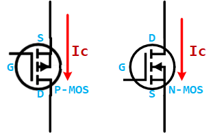

NMOS管的主回路电流方向为D→S，要求VGS>0，即VG-VS>0, 至于VG-VS到底等于多少才能保证MOS管导通，则需要查询MOS管的手册根据参数VGth而定，一般为5~10V（G电位比S电位高）；

PMOS管的主回路电流方向为S→D，要求 VGS<0，即VG-VS<0, 至于VG-VS到底等于多少才能保证MOS管导通，则需要查询MOS管的手册根据参数VGth而定，一般为-5~-10V（S电位比G电位高），下面以导通压差6V为例。

【注意】这里的导通条件是没问题的，但是对于去分析STM32的GPIO的时候就会让人很迷，也许是因为STM32的GPIO框图中有一个我们看不见的输出控制电路吧，反正大概懂原理就是了。

- N-MOS

使用NMOS当下管，S极直接接地（为固定值），只需将G极电压固定值6V即可导通；若使用NMOS当上管，D极接正电源，而S极的电压不固定，无法确定控制NMOS导通的G极电压，因为S极对地的电压有两种状态，MOS管截止时为低电平，导通时接近高电平VCC。当然NMOS也是可以当上管的，只是控制电路复杂，这种情况必须使用隔离电源控制，使用一个PMOS管就能解决的事情一般不会这么干，明显增加电路难度。

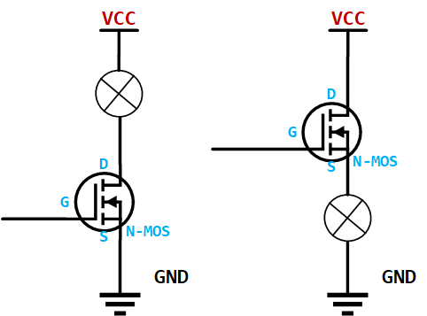

- P-MOS

使用PMOS当上管，S极直接接电源VCC，S极电压固定，只需G极电压比S极低6V即可导通，使用方便；同理若使用PMOS当下管，D极接地，S极的电压不固定（0V或VCC），无法确定控制极G极的电压，使用较麻烦，需采用隔离电压设计。

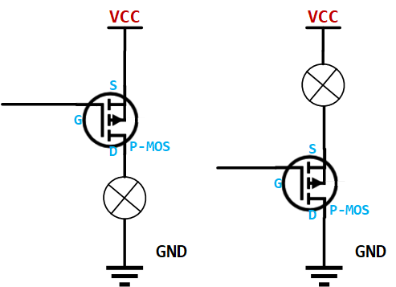

## 二、输入IO

这里所说的输入IO，指的是只作为输入，不具有输出功能。此时对于input引脚的要求就是高阻（高阻与三态是同一个概念）。基本输入电路的类型大致可以分为3类：基本输入IO电路、施密特触发输入电路以及弱上拉输入电路。

### 1. 最基本的输入IO

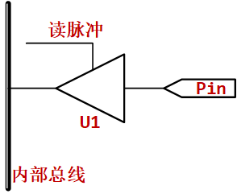

其中的缓冲器U1是具有控制输入端，且具有高阻抗特性的三态缓冲器。通俗地说就是这个缓冲器对外来说是高阻的，相当于在控制输入端不使能的情况下，物理引脚与内部总线之间是完全隔离的，完全不会影响内部电路。而控制输入端的作用就是可以发出读Pin状态的操作指令。其过程如下图所示。

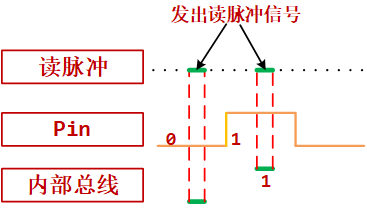

### 2. 抖动？

这种基本电路的一个缺点是在读取外部信号的跳变沿时会出现抖动，如下图所示：

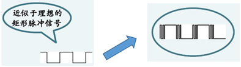

于是施密特触发输入电路就是解决了上述这种抖动的问题，其经过施密特触发器后的信号下图所示。

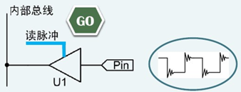

### 3. 电平检测问题

对于输入电路还存在另外一个问题，就是当输入引脚悬空的时候，输入端检测到的电平是高还是低？当输入信号没有被驱动，即悬空（Floating）时，输入引脚上任何的噪声都会改变输入端检测到的电平，如下图所示。

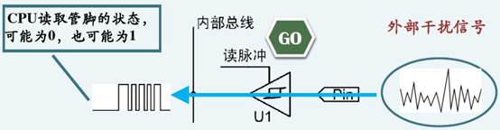

为了解决这个问题，可以在输入引脚处加一个弱上拉电阻，如下图所示。

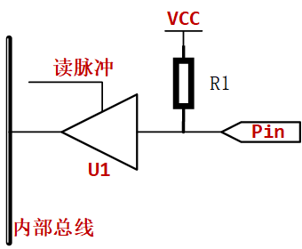

这样，当输入引脚悬空时，会被 R1上拉到高电平，在内部总线上就有确定的状态了。但是这种结构是有一定问题的。首先很明显的一点是，当输入引脚悬空时读到的是 1，当输入引脚被高电平驱动时读到的也是1，只有当输入引脚被低电平驱动时读到的才是0。也就是对于读 1采取的方式是"读取非零"的方式。另一个问题是该电路对外呈现的不是高阻，某种意义上说也在向外输出，当外部驱动电路不同时可能出现错误的检测结果。例如外部驱动电路是如下图所示的结构，该电路结构中通过K打到不同端可以输出高电平或者低电平。

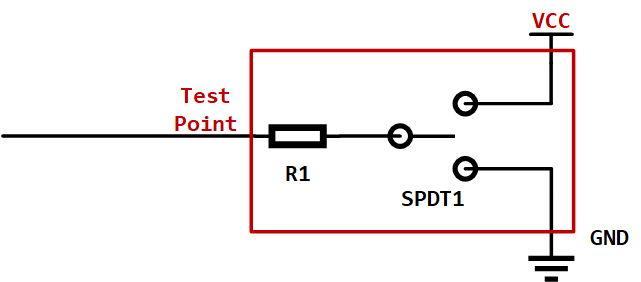

如果将上图所示的电路输出低电平，连接到带有弱上拉电阻的输入引脚，其结构如下所示。

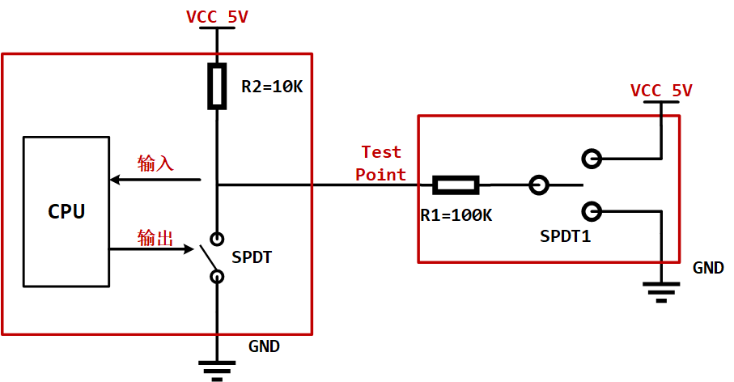

由欧姆定律知，测试点处的电平是$5V * \frac{100K}{10K+100K}=4.545V$于是CPU测得的输入信号为高，而外部驱动电路希望输出的电平为低。这种错误的原因就在于这种结构的输入电路并不是真正的高阻，或者说这个输入IO其实也在输出，而且影响了外部输入电路。

### 4. 高阻

这种情况的发生也说明了：信号前后两级传递，为什么需要输出阻抗小，输入阻抗大的原因。在这个例子中，外围驱动电路的输出阻抗很大，达到了100Kohm；而输入端的阻抗又不够大，只有10Kohm，于是就出现了问题。如果输入端的输入阻抗真正做到高阻（无穷大），如下所示，就不会出现问题。

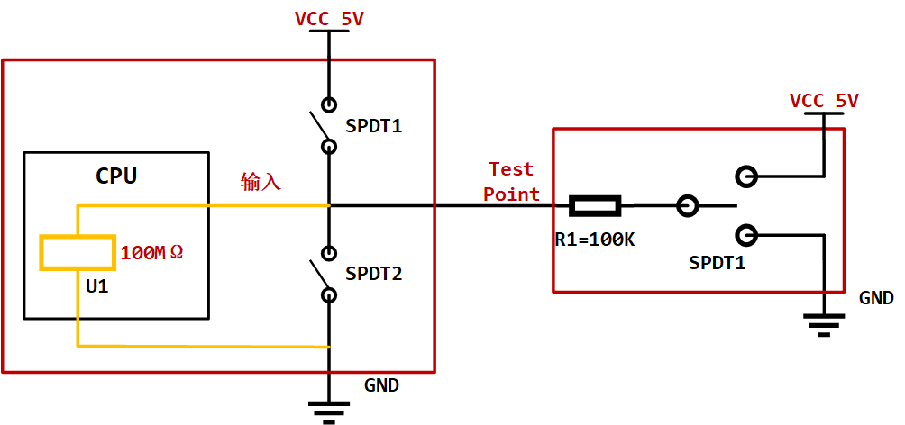

上面提到的这个带弱上拉的输入电路，也就是在后续会提到的准双向端口的情况。

## 三、输出IO

IO输出电路最主要的两种模式分别是推挽输出（Push-Pull Output）和开漏输出（Open Drain Output）。

### 1. 推挽输出(Push-Pull Output)

推挽输出的结构是由两个三极管或者MOS管受到互补信号的控制，两个管子始终保持一个处于截止，另一个处于导通的状态，这里以上一节STM32的GPIO中的推挽输出结构为例：

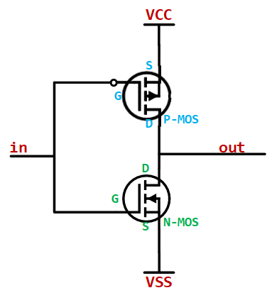

推挽输出的最大特点是可以真正能真正的输出高电平和低电平，在两种电平下都具有驱动能力。

> 所谓的驱动能力，就是指输出电流的能力。对于驱动大负载（即负载内阻越小，负载越大）时，例如IO输出为5V，驱动的负载内阻为10ohm，于是根据欧姆定律可以正常情况下负载上的电流为0.5A（推算出功率为2.5W）。显然一般的IO不可能有这么大的驱动能力，也就是没有办法输出这么大的电流。于是造成的结果就是输出电压会被拉下来，达不到标称的5V。

当然如果只是数字信号的传递，下一级的输入阻抗理论上最好是高阻，也就是只需要传电压，基本没有电流，也就没有功率，于是就不需要很大的驱动能力。

对于推挽输出，输出高、低电平时电流的流向如下图所示。所以相比于后面介绍的开漏输出，输出高电平时的驱动能力强很多。

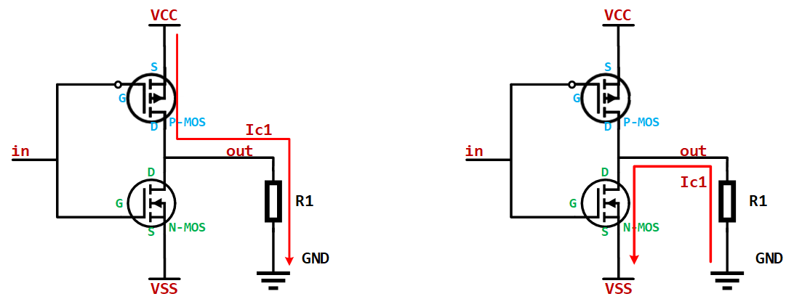

但推挽输出的一个缺点是，如果当两个推挽输出结构相连在一起，推挽输出结构1输出高电平，即上面的MOS导通，下面的MOS闭合时；同时推挽输出结构2输出低电平，即上面的MOS闭合，下面的MOS导通时。电流会从推挽输出结构1的VCC通过上端MOS再经过推挽输出结构2下端MOS直接流向VSS。整个通路上电阻很小，会发生短路，进而可能造成端口的损害。这也是为什么推挽输出不能实现" 线与"的原因。

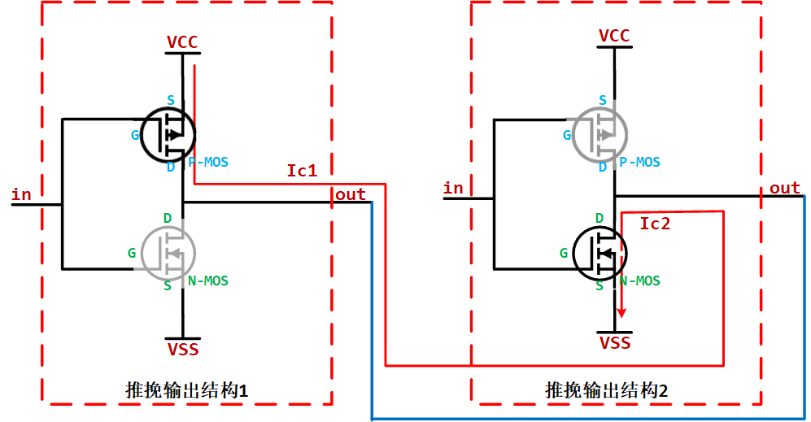

### 2. 开漏输出(Open Drain Output)

#### 2.1 基本电路

常说的与推挽输出相对的就是开漏输出，对于开漏输出和推挽输出的区别最普遍的说法就是开漏输出无法真正输出高电平，即高电平时没有驱动能力，需要借助外部上拉电阻完成对外驱动。下面就从内部结构和原理上说明为什么开漏输出输出高电平时没有驱动能力，以及进一步比较与推挽输出的区别。

首先需要介绍一些开漏输出和开集输出。这两种输出的原理和特性基本是类似的，区别在于一个是使用MOS管，其中的"漏"指的就是MOS管的漏极；另一个使用三极管，其中的"集"指的就是MOS三极管的集电极。

这两者其实都是和推挽输出相对应的输出模式，由于使用MOS管的情况较多，很多时候就用"开漏输出"这个词代替了开漏输出和开集输出。

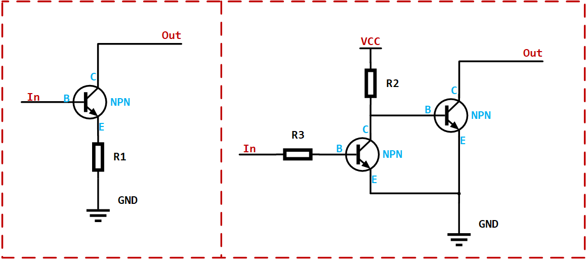

图左边的电路是开集（OC）输出最基本的电路，当输入为高电平时，NPN三极管导通，Output被拉到GND，输出为低电平；当输入为低电平时，NPN三极管闭合，Output相当于开路（输出高阻）。高电平时输出高阻（高阻、三态以及floating说的都是一个意思），此时对外没有任何的驱动能力。

这就是开漏和开集输出最大的特点，如何利用该特点完成各种功能稍后再说。这个电路虽然完成了开集输出的功能，但是会出现input为高，输出为低；input为低，输出为高的情况。

图右边的电路中多使用了一个三极管完成了"反相"。当输入为高电平时，第一个三极管导通，此时第二个三极管的输入端会被拉到GND，于是第二个三极管闭合，输出高阻；当输入为低电平时，第一个三极管闭合，此时第二个三极管的输入端会被上拉电阻拉到高电平，于是第二个三极管导通，输出被拉到GND。这样，这个电路的输入与输出是同相的了。

接下来我们来看开漏输出的电路，如下图所示。原理与开集输出基本相同，只是将三极管换成了MOS而已：

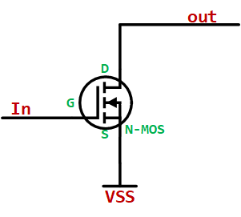

#### 2.2 应用

接着说说开漏、开集输出的特点以及应用，由于两者相似，后边若无特殊说明，则用开漏表示开漏和开集输出电路。

- 开漏输出最主要的特性就是高电平没有驱动能力，需要借助外部上拉电阻才能真正输出高电平，其电路如下图所示。

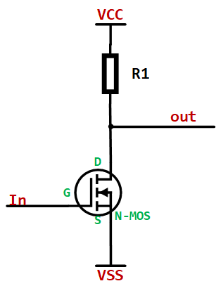

当MOS管闭合时，开漏输出电路输出高电平，且连接着负载时，电流流向是从外部电源，流经上来电阻R1，流进负载，最后进入VSS（一般是公共接地端）。

（1）开漏输出的这一特性一个明显的优势就是可以很方便的调节输出的电平，因为输出电平完全由上拉电阻连接的电源电平决定。所以在需要进行电平转换的地方，非常适合使用开漏输出。

（2）开漏输出的这一特性另一个好处在于可以实现"线与"功能，所谓的"线与"指的是多个信号线直接连接在一起，只有当所有信号全部为高电平时，合在一起的总线为高电平；只要有任意一个或者多个信号为低电平，则总线为低电平。而推挽输出就不行，如果高电平和低电平连在一起，会出现电流倒灌，损坏器件。

### 3. 推挽与开漏对比

| 比较项         | 推挽输出 | 开漏输出                                       |
| -------------- | -------- | ---------------------------------------------- |
| 高电平驱动能力 | 强       | 由外部上拉电阻提供                             |
| 低电平驱动能力 | 强       | 强                                             |
| 电平跳变速度   | 快       | 由外部上拉电阻决定，电阻越小反应越快，功耗越大 |
| 线与功能       | 不支持   | 支持                                           |
| 电平转换       | 不支持   | 支持                                           |

## 三、双向IO

### 1. 基本电路

很多处理器的引脚可以设置为双向端口，双向端口的要求就是既可以输出信号，又可以读回外部信号输入。要同时做到这两点从原理上来说有点困难，首先从处理器的开漏输出IO口的内部结构说起，如下图所示。

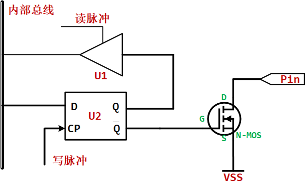

在N-MOS之前加入了一个FF（U2），目的是用于控制输出信号的时间。比较常见的一个应用场合是多个IO作为一个总线时，需要总线上的各个引脚同时将数据输出。对于开漏输出结构，会将FF（U2）的输出Q端连接会输入驱动缓冲器，这样的话执行读操作是读的并不是外部引脚的状态，而是自己输出的状态。

### 2.  双向开漏IO

对上边双向IO的基本电路进行修改：

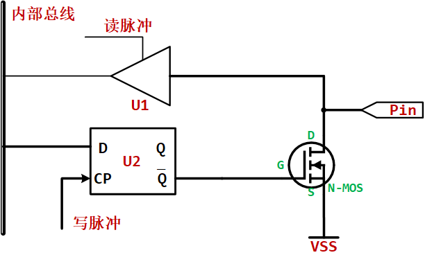

该结构称为双向开漏IO的结构。所做的改动是将输入驱动缓冲器连接到了PIN上。该结构输出为"1"（Q=1）时，N-MOS断开，此时pin对外呈现高阻，作为输入引脚没有任何问题。但是如果该结构输出"0"（Q=0）时，N-MOS导通，此时pin对外短路到地，即无论外部输入什么信号，U1读回的全部是低。所以对于这样的结构，如果需要作为输入引脚使用时，必须给U2输出"1"后才能读取外部引脚数据。

### 3. 准双向开漏IO

准双向端口就是双向IO电路的的结构中加了一个上拉电阻，如下图所示：

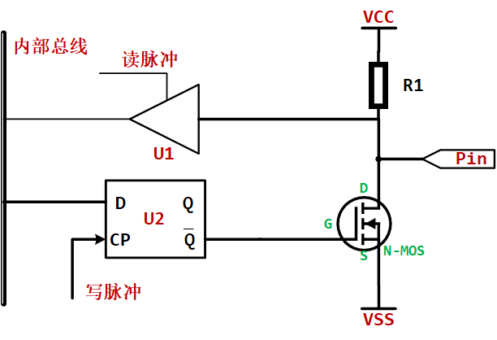

（1）作为输入引脚使用时，也必须先向U2中写"1"，以达到断开N-MOS的目的。所以是否需要提前写"1"并不是双向IO与准双向IO的区别。两者做输入端口时都需要提前写"1"。

（2）双向端口作为输入时是真正的高阻态，而准双向IO作为输入端口时，输入阻抗不为高阻，于是有可能出现《一》中第三小节的3. 电平检测问题。

（3）准双向端口读取输入状态，默认为高。也就是判断外部输入信号的方法是"非低则为高"。即该结构只能准确的识别外部的低电平，无法区分悬空和真正的高。于是只要读到的不是0，都认为外部为1。

### 4. 推挽输出作为双向IO

如果双向端口中的输出部分采用的是推挽输出结构，那么作为输入时必须将上下两个管子全部端口才能成为高阻，作为输入。

## 四、51单片机？

### 1. P0口有哪东西？

在双向端口的讨论中，比较复杂的就是51单片机的P0端口了。P0端口的内部结构如图所示。

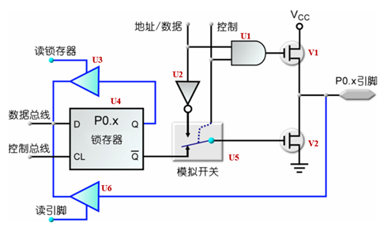

内部结构比较复杂，包括以下这些器件：

（1）U1：与门。一个输入连着控制线，另一个输入连接这地址/数据信号。由于与门的特性，当控制线为1时，与门输出与地址/数据信号的电平保持一致；如果控制线为0，则输出恒为。于是控制信号线相当于与门的使能信号。

（2）U2：反相器，输出信号为地址/数据信号的反相信号。

（3）U3和U6都是具有控制输入端且具有高阻抗特性的三态缓冲器，作用是对于外部呈现高阻态。当控制端使能时可以将外部信号的电平读进数据总线。

（4）U4：为锁存器，目的就是控制引脚输出信号的时间。

（5）U5：模拟开关，可以控制V2的输入信号是来自锁存器U4的Q非输出还是来自于反相器U2的输出。

（6） V1和V2分别是两个MOS管。

### 2. P0用于地址/数据线时

在P0作为地址/数据线时，是地址、数据复用总线，P0需要输出地址，同时需要读回数据信号。当P0需要输出地址信息时，U1的控制信号为0，模拟开关U5接到U2反相器的输出。于是当地址信号线传来的信号为1，与控制线"1"相与之后输出到V1的输入信号为"1"，V1截止。地址信号"1"经反相之后，通过模拟开关输出到V2的输入端为"0"，V2导通，于是情况如下图所示，pin输出"0"。

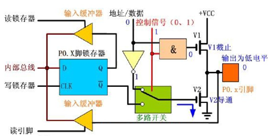

当地址信号线传来的信号为1，与控制线"1"相与之后输出到V1的输入信号为"0"，V1导通。地址信号"0"经反相之后，通过模拟开关输出到V2的输入端为"1"，V2截止，于是情况如图所示，pin输出"1"。

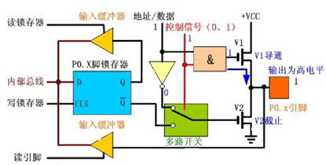

于是在作为地址线输出时，V1、V2两个MOS管均使用了，是推挽输出。当P0在输出低8位地址信息后，将变为数据总线，此时CPU的操作是控制端输出0，模拟开关打到锁存器的Q非端，且向锁存器中打入"1"。于是Q非输出为0，V2截止。同时控制线为0使得与门输出为0，V1截止。由于V1和V2都截止，所以此时pin对外完全呈现高阻，作为输入端口，外部数据通过U6进入内部总线，情况如下图所示。（相当于将推挽输出的两个MOS管全部断开了）此时由于对外呈现高阻，所以是真正的输入引脚。这就解释了为什么说P0是真正的双线端口。

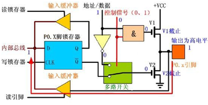

### 3. P0用于普通IO时

在P0作为普通IO并作为输出时，控制信号为0，使V1始终处于截止状态。模拟开关连接到Q非输出，当作为输出时，锁存器的输入端直接输入0或者1，Q非将反相信号输入到V2的输入端。即当输出"0"时，V2输入端为"1"，V2导通，pin输出"0"；当输出"1"时，V2输入端为"0"，V2截止，pin输出高阻的0。即当P0工作在普通IO模式下，输出为开漏输出，且内部没有上拉电阻。

在P0作为普通IO并作为输入时，控制信号为0，使V1始终处于截止状态。模拟开关连接到Q非输出，且CPU自动向锁存器输入端写1，则V2输入端为0，V2截止。与之前在作为地址/数据线，作为输入时一样，也是两个MOS管全部断开，pin直接连接到U6，对外呈现高阻。于是也是真正的输入引脚。

综上P0无论工作在哪种模式下都是真正的双端口IO。

### 4. P1～P3端口

51单片机的其他三个端口的内部结构如下所示，与P0相比简单了很多，没有了顶部的MOS管，也没有了地址/数据信号的选项。作为输出时是带有上拉电阻的的开漏输出，作为输入时是有上拉电阻存在的，于是输入端口对外不是高阻。这就解释了为什么P1～P3只能是准双向端口。

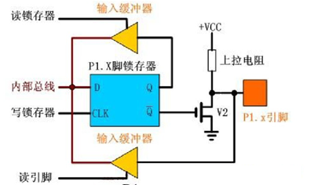
