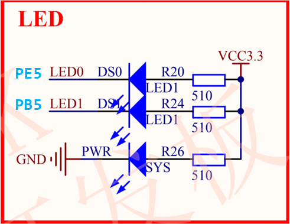
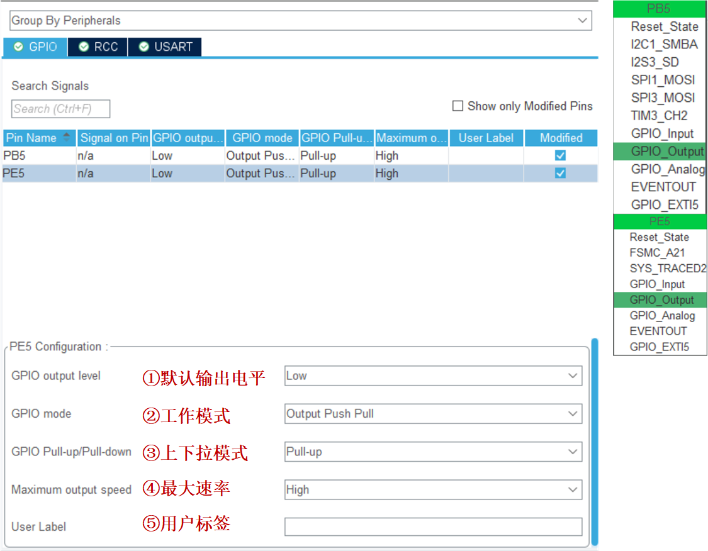

<!-- more -->

## 一、基本步骤

这个实例主要是通过GPIO点亮LED灯。一般步骤如下：

- （1）使能IO口时钟。
- （2）初始化IO口模式，包括GPIO工作模式（输出）、IO口速度。使用STM32CubeMX软件来进行图形化配置的话要注意一下上下拉的设置，不然很可能有莫名其妙的坑。

- （3）操作IO口，输出高低电平。

**【注意】**可以一次初始化一个IO组下的多个IO，前提是这些IO口的配置方式一样。

## 二、硬件原理图



## 三、STM32CubeMX配置



GPIO的配置比较简单，就上边这些选项配好就可以啦。

## 四、LED闪烁

上面的完成工程创建后，LED灯默认会被点亮但是，我们主函数这样写：

```c
int main(void)
{
  HAL_Init();
  SystemClock_Config();
  MX_GPIO_Init();
  while (1)
  {
    HAL_GPIO_WritePin(GPIOB, GPIO_PIN_5, GPIO_PIN_RESET);
    HAL_GPIO_WritePin(GPIOE, GPIO_PIN_5, GPIO_PIN_RESET);
    HAL_Delay(500);
    HAL_GPIO_WritePin(GPIOB, GPIO_PIN_5, GPIO_PIN_SET);
    HAL_GPIO_WritePin(GPIOE, GPIO_PIN_5, GPIO_PIN_SET);
    HAL_Delay(500);
  }
}
```
