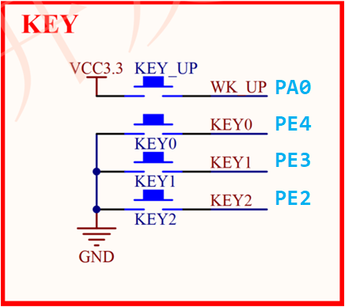
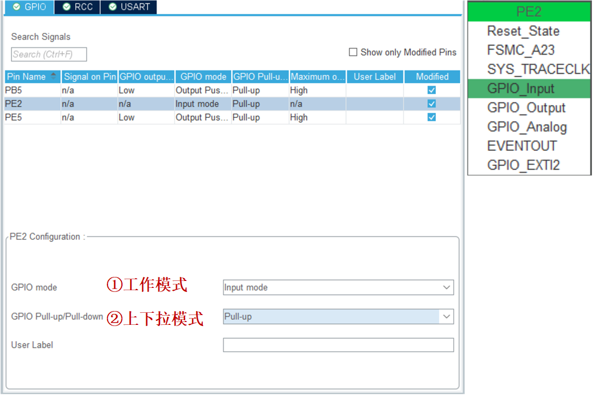
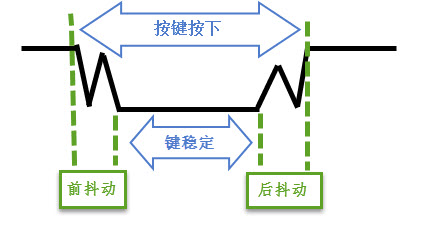
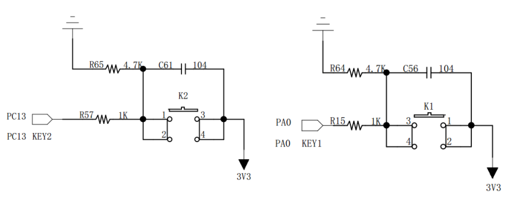

<!-- more -->

## 一、基本步骤

- （1）使能IO口时钟。
- （2）初始化IO口模式，包括GPIO工作模式（输入）、IO口速度。

- （3）循环读取IO电平，判断按键是否按下。

## 二、硬件原理图



## 三、STM32CubeMX配置



这里就以KEY2为例，配置成输入模式，这里上下拉的话配置成上拉，这样按键未按下的时候就是默认高电平，按下为低电平，配置WK_UP按键的时候可以配置成下拉模式，因为WK_UP按键按下时为高电平。

## 四、按键抖动？

按键机械触点断开、闭合时，由于触点的弹性作用，按键开关不会马上稳定接通或一下子断开，使用按键时会产生的带波纹信号，：



需要用软件消抖处理滤波，软件的话一般就是延时，延时10ms左右就可以。但是也有硬件可以直接进行消抖：



## 五、单/多次按下支持

```c
#define KEY0        HAL_GPIO_ReadPin(GPIOE,GPIO_PIN_4)  //KEY0按键PE4
#define KEY1        HAL_GPIO_ReadPin(GPIOE,GPIO_PIN_3)  //KEY1按键PE3
#define KEY2        HAL_GPIO_ReadPin(GPIOE,GPIO_PIN_2)  //KEY2按键PE2
#define WK_UP       HAL_GPIO_ReadPin(GPIOA,GPIO_PIN_0)  //WKUP按键PA0

//mode:0,不支持连续按;1,支持连续按;
//注意此函数有响应优先级,KEY0>KEY1>KEY2>WK_UP!!
uint8_t KEY_Scan(uint8_t mode)
{
    static uint8_t key_up = 1; // 按键松开标志
    if(mode == 1)
    {
        key_up = 1;   // 支持连按
    }
    if(key_up && (KEY0 == 0 || KEY1 == 0 || KEY2 == 0 || WK_UP == 1))
    {
        HAL_Delay(10);      // 延时10ms去抖
        key_up = 0;
        if(KEY0 == 0)       return 1;
        else if(KEY1 == 0)  return 2;
        else if(KEY2 == 0)  return 3;
        else if(WK_UP == 1) return 4;
    } 
	else if(KEY0 == 1 && KEY1 == 1 && KEY2 == 1 && WK_UP == 0)
	{
		key_up = 1;
	}
    return 0;              // 无按键按下
}
```

当 mode 为 0 的时候， KEY_Scan()函数将不支持连续按， 扫描某个按键，该按键按下之后必须要松开，才能第二次触发，否则不会再响应这个按键，这样的好处就是可以防止按一次多次触发，而坏处就是在需要长按的时候比较不合适。

当 mode 为 1 的时候， KEY_Scan()函数将支持连续按，如果某个按键一直按下，则会一直返回这个按键的键值，这样可以方便的实现长按检测。  
