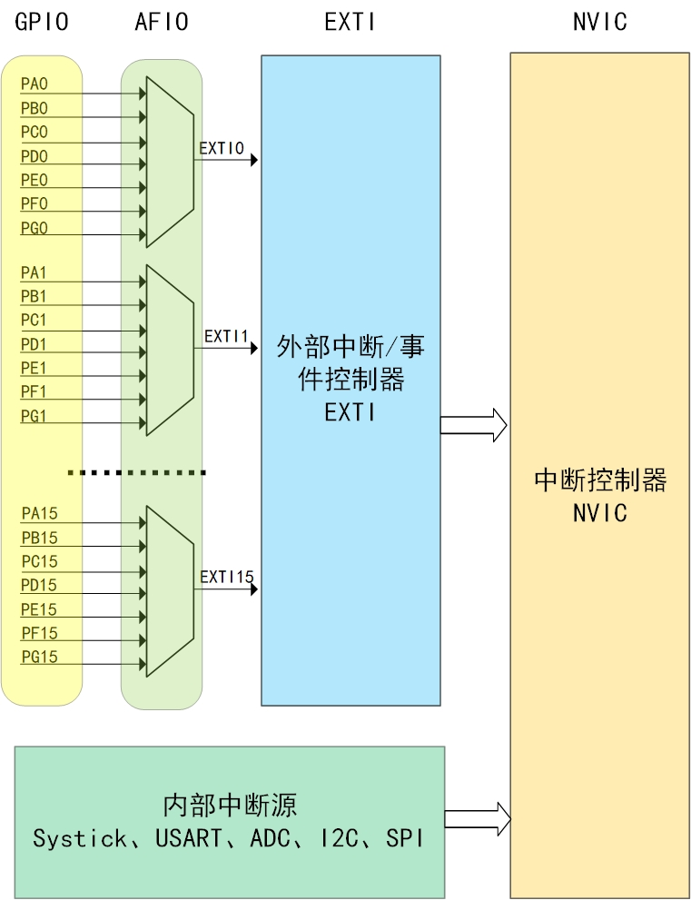
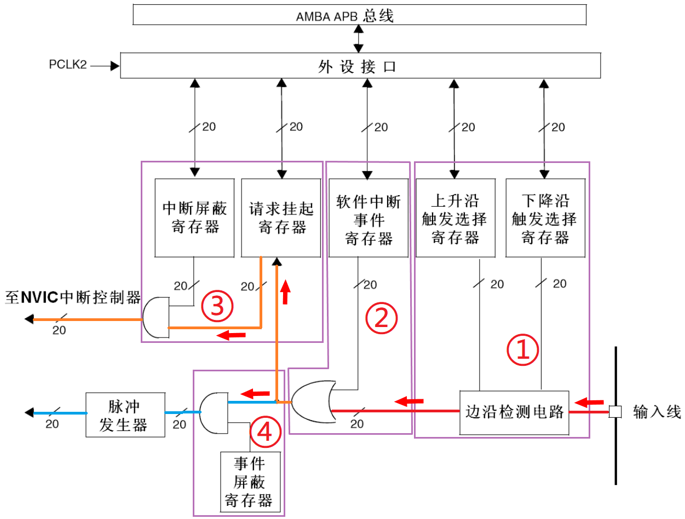
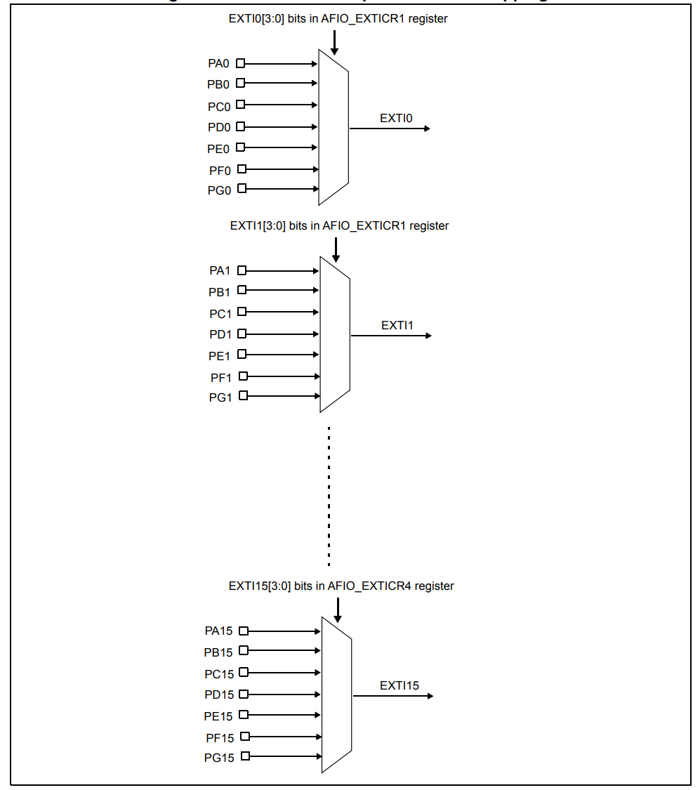
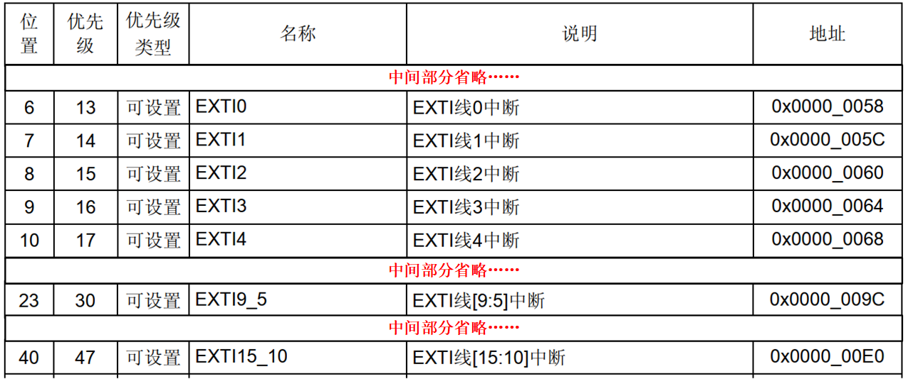

<!-- more -->

>相关笔记：
>
>- [10-基础篇/30-STM32的中断/LV001-STM32中断简介.md](/sdoc/basic/stm32interrupt/126b08f57241322fa604782d)
>- [10-基础篇/01-概述/LV040-CortexM3异常.md](/sdoc/basic/overview/126b08e5d7b911b28ed9ee4c)

## 一、EXTI

### 1. 简介

STM32的中断和中断优先级，知道了所有外设中断都由NVIC管理，比如USART、 ADC、 I2C、 SPI等。 GPIO产生的中断也不例外，但在给NVIC管理之前，还有一个EXTI（ External interrupt/event controller，外部中断/事件控制器） 先处理一下 ：



EXTI，全称就是External interrupt/event controller，也就是外部中断/事件控制器。每个中断/事件线都对应有一个边沿检测器，可以实现输入信号的上升沿检测和下降沿的检测。 STM32F103系列的EXTI支持19个外部中断/事件请求（互联型系列的STM32支持20个） ，每个中断/事件都有独立的触发和屏蔽设置，支持中断模式和事件模式。  

- 中断模式是指外部信号产生电平变化时， EXTI将该信号给NVIC处理， 从而触发中断，执行中断服务函数，完成对应操作。

- 事件模式是指外部信号产生电平变化时， EXTI根据配置， 联动ADC或TIM执行相关操作。  

中断和事件的产生源是一样的，中断需要软件实现相应功能，而事件是由硬件触发后执行相应操作。前者需要CPU参与功能实现，可以实现的功能更多，后者无需CPU参与， 具有更高的响应速度。  

### 2. 框图分析

EXTI的结构我们可以查看《[STM32英文参考手册](https://www.st.com/resource/en/reference_manual/rm0008-stm32f101xx-stm32f102xx-stm32f103xx-stm32f105xx-and-stm32f107xx-advanced-armbased-32bit-mcus-stmicroelectronics.pdf)》的10.2.2 Block diagram一小节， 图中画斜线“ / ”的信号线表示这样的线共有 20 根（但其实这是最多20根，只有互联网型芯片才有第20根线，例如STM32F105/107，线19连接到以太网唤醒事件）。 外部信号输入后，首先经过边缘检测电路，可以实现对上升沿或下降沿信号进行检测， 从而得到硬件触发，也可由软件中断事件寄存器产生软件触发信号。 无论是硬件触发还是软件触发，如果中断屏蔽寄存器允许，则产生中断给NVIC处理（绿色路线）； 如果事件屏蔽寄存器允许，则产生事件， 脉冲发生器产生脉冲供其它模块使用（黄色路线） 。  



对于每个中断线，我们可以设置相应的触发方式（上升沿触发，下降沿触发，边沿触发）以及使能。

下面让我们看一下 EXTI 功能框图的产生中断的线路，最终信号是流入 NVIC 控制器中。输入线是线路的信息输入端，它可以通过配置寄存器设置为任何一个 GPIO 口，或者是一些外设的事件。输入线一般都是存在电平变化的信号。  

标号①是一个边沿检测电路，包括边沿检测电路，上升沿触发选择寄存器(EXTI_RTSR)和下降沿触发选择寄存器(EXTI_FTSR)。边沿检测电路以输入线作为信号输入端，如果检测到有边沿跳变就输出有效信号‘1’，就输出有效信号‘1’到标号②部分电路，否则输出无效信号‘0’。边沿跳变的标准在于开始的时候对于上升沿触发选择寄存器或下降沿触发选择寄存器对应位的设置。  

标号②是一个或门电路，它的两个信号输入端分别是软件中断事件寄存器(EXTI_SWIER)和边沿检测电路的输入信号。或门电路只要输入端有信号‘1’，就会输出‘1’，所以就会输出‘1’到标号③电路和标号④电路。通过对软件中断事件寄存器的读写操作就可以启动中断/事件线，即相当于输出有效信号‘1’到或门电路输入端。  

标号③是一个与门电路，它的两个信号输入端分别是中断屏蔽寄存器(EXTI_IMR)和标号②电路输出信号。与门电路要求输入都为‘1’才输出‘1’，这样子的情况下，如果中断屏蔽寄存器(EXTI_IMR)设置为 0 时，不管从标号②电路输出的信号特性如何，最终标号③电路输出的信号都是 0；假如中断屏蔽寄存器(EXTI_IMR)设置为 1 时，最终标号③电路输出的信号才由标号②电路输出信号决定，这样子就可以简单控制 EXTI_IMR 来实现中断的目的。标号④电路输出‘1’就会把请求挂起寄存器(EXTI_PR)对应位置 1。  

最后，请求挂起寄存器(EXTI_PR)的内容就输出到 NVIC 内，实现系统中断事件的控制。  

接下来我们看看 EXTI 功能框图的产生事件的线路。

产生事件线路是从标号 2 之后与中断线路有所不同，之前的线路都是共用的。标号④是一个与门，输入端来自标号 2 电路以及来自于事件屏蔽寄存器(EXTI_EMR)。如果 EXTI_EMR 寄存器设置为 0，那不管标号 2 电路输出的信号是‘0’还是‘1’，最终标号 4 输出的是‘0’；如果 EXTI_EMR 寄存器设置为 1，最终标号④电路输出信号就由标号③电路输出的信号决定，这样子就可以简单的控制 EXTI_EMR 来实现是否产生事件的目的。      

标号④电路输出有效信号 1 就会使脉冲发生器电路产生一个脉冲，而无效信号就不会使其产生脉冲信号。脉冲信号产生可以给其他外设电路使用，例如定时器，模拟数字转换器等，这样的脉冲信号一般用来触发 TIM 或者 ADC 开始转换。  

> 产生中断线路目的是把输入信号输入到 NVIC，进一步运行中断服务函数，实现功能。而产生事件线路目的是传输一个脉冲信号给其他外设使用，属于硬件级功能。  

## 二、GPIO与EXTI对应情况

STM32F103ZET6有7组GPIO，每组16个引脚，即112个GPIO引脚， 但EXTI只支持19个外部中断/事件请求，因此需要将多个GPIO合成一组，共用一个中断线， STM32F103系列中断线分组如下表所示：

| 中断线 | 描述                               |
| ------ | ---------------------------------- |
| EXIT0  | PA0~PG0， 7 个 GPIO 共享该中断线   |
| EXIT1  | PA1~PG1， 7 个 GPIO 共享该中断线   |
| ...    | ...                                |
| EXIT14 | PA14~PG14， 7 个 GPIO 共享该中断线 |
| EXIT15 | PA15~PG15， 7 个 GPIO 共享该中断线 |
| EXIT16 | PVD 输出                           |
| EXIT17 | RTC 闹钟事件                       |
| EXIT18 | USB 唤醒事件                       |
| EXIT19 | 以太网唤醒事件(仅互联型支持)       |

正常情况下EXTI 支持 19 个外部中断/事件请求，这些都是信息输入端，也就是上面提及到了输入线 。这一部分我们可以查看[STM32中文参考手册](https://www.stmcu.com.cn/Designresource/detail/localization_document%20/710001)的 9.2.5 外部中断/事件线路映像   一小节：



STM32F1 供给 IO 口使用的中断线只有 16 个，但是 STM32F1 的 IO 口却远远不止 16 个，所以 STM32 把 GPIO 管脚 GPIOx.0 \~ GPIOx.15 (x=A,B,C,D,E,F,G)分别对应中断线 0\~15。这样子每个中断线对应了最多 9个 IO 口，以线 0为例：它对应了GPIOA.0、GPIOB.0、GPIOC.0、 GPIOD.0、 GPIOE.0、 GPIOF.0 和 GPIOG.0。而中断线每次只能连接到 1 个 IO 口上，这样就需要通过配置决定对应的中断线配置到哪个 GPIO 上了。  

> Tips：GPIO 和中断线映射关系是在寄存器 AFIO_EXTICR1 ~ AFIO_EXTICR4 中配置的。  

需要注意，EXTI0~EXTI15作为GPIO中断线使用， 同组的GPIO共享一条中断线，比如EXTI0组， PA0作为了中断源， 则此时PB0~PG0不能作为中断源。  

STM32有众多异常和中断，其中内部中断源（ USART、 ADC等）直接由NVIC处理。 GPIO引脚可以产生外部中断或事件，如是中断则交由NVIC处理，如果是事件则产生脉冲信号联动其它模块工作。无论是内部中断源，还是GPIO产生的中断，都由NVIC管理分组，然后根据中断优先级分组确定抢占优先级级数和子优先级级数。GPIO引脚众多，将**引脚数字相同的作为一组，共享一个中断线**。  

既然那么多引脚共享同一个中断线，那怎么区分是哪一个中断？

例如当EXTI0中断发生时，它可能来自于PA0、PB0、PC0等7个引脚中的任何一个。硬件本身**不会**自动告诉我们具体是哪个引脚触发的。因此，区分中断源的工作必须由**软件**来完成。方法就是在中断服务函数中检查GPIO的输入电平或EXTI的挂起标志。具体步骤如下：

（1）**配置原则**：在硬件设计阶段，就要避免将需要同时使用的、需要区分的中断源连接到同一根中断线上。例如，如果PA0和PB0都需要作为中断输入，并且需要区分，那么它们都连接到EXTI0就是不合理的设计，应选择不同的中断线（如PA0用EXTI0，PB0用EXTI1）。

（2）**软件判别**：如果确实无法避免（或者确定它们不会同时触发），可以在中断服务函数中读取对应GPIO引脚的电平状态来判断。

## 三、中断服务函数？

我们产生了中断，就需要有中断服务程序来处理，那么上边是不是16个中断线就可以分配16个中断服务函数呢？当然不是啦，IO口外部中断在中断向量表中只分配了7个中断向量，也就是只能使用7个中断服务函数，我们可以看一下[STM32中文参考手册](https://www.stmcu.com.cn/Designresource/detail/localization_document%20/710001)的9.1.2 中断和异常向量小节的 表55 其它STM32F10xxx产品(小容量、中容量和大容量)的向量表  ：



从表中可以看出，外部中断线5~9分配一个中断向量，共用一个服务函数外部中断线10~15分配一个中断向量，共用一个中断服务函数。我们再来看一下HAL库工程中的启动文件 startup_stm32f103xe.s：

```assembly
__Vectors       DCD     __initial_sp               ; Top of Stack
                DCD     Reset_Handler              ; Reset Handler
                ; 中间部分省略......
                DCD     EXTI0_IRQHandler           ; EXTI Line 0
                DCD     EXTI1_IRQHandler           ; EXTI Line 1
                DCD     EXTI2_IRQHandler           ; EXTI Line 2
                DCD     EXTI3_IRQHandler           ; EXTI Line 3
                DCD     EXTI4_IRQHandler           ; EXTI Line 4
                ; 中间部分省略......
                DCD     EXTI9_5_IRQHandler         ; EXTI Line 9..5
                ; 中间部分省略......
                DCD     EXTI15_10_IRQHandler       ; EXTI Line 15..10
                ; 中间部分省略......
__Vectors_End
```

我们会发现，在启动文件中对应的入口地址也只有7个。3

那么中断发生时如何判断要执行哪个函数？针对共享中断向量，以EXTI15_10_IRQHandler为例，它对应着EXIT[15:10]这6条中断线，这个时候就要用到寄存器EXTI_PR了，具体这个寄存器是干什么的，可以看下一节的笔记，这里就不重复写了。就是


## <font size=3>4. 相关寄存器</font>

这一部分把，就不写笔记了，详细的可以查看 [STM32中文参考手册](https://www.stmcu.com.cn/Designresource/detail/localization_document%20/710001)的 9.3 EXTI 寄存器描述 和  8.4 AFIO寄存器描述  两个小节的笔记，由于这里我后来是使用HAL库，直接使用STM32CubeMX软件直接配置了，所以这里暂时不关心这个。不过
