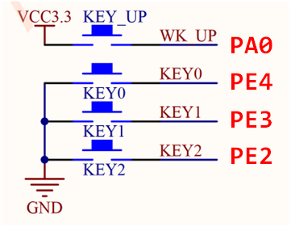
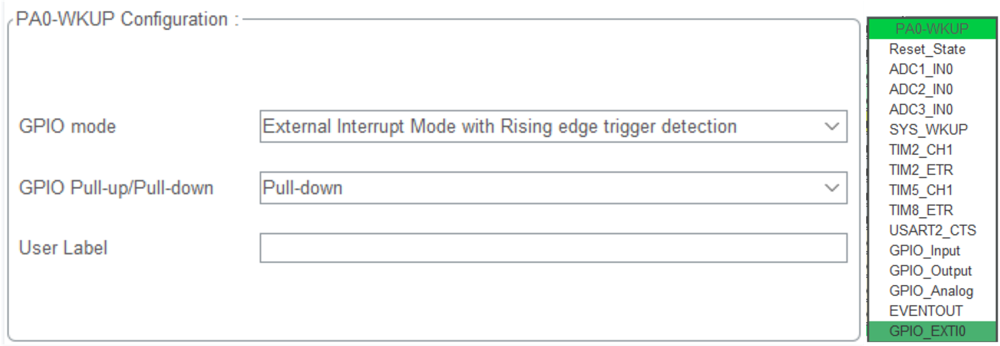
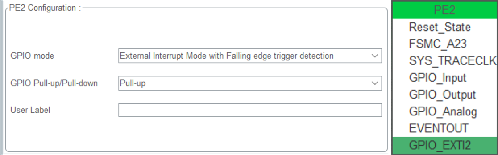
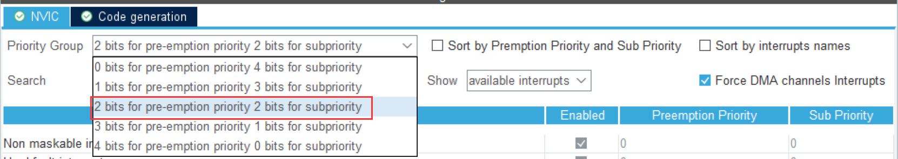
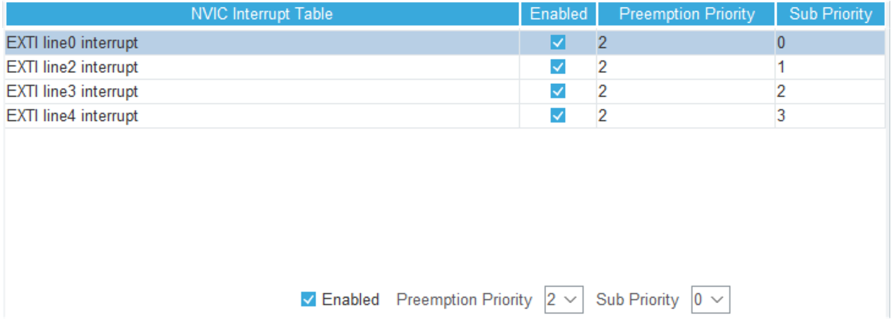
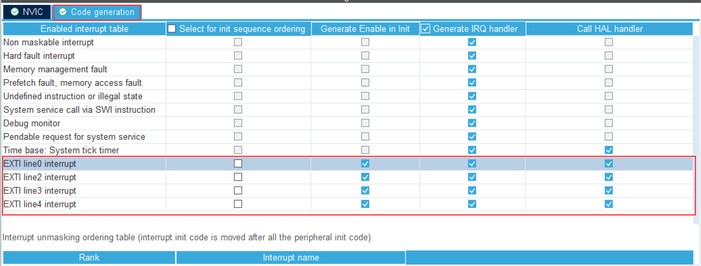

<!-- more -->

## 一、硬件原理图



## 二、STM32CubeMX配置

### 1. GPIO引脚配置

在STM32CubeMX软件中，我们选择好引脚后，GPIO的功能中会自动对应好与EXIT的关系，当然，我们也可以看 [STM32中文参考手册](https://www.stmcu.com.cn/Designresource/detail/localization_document%20/710001)的 9.2.5 外部中断/事件线路映像一节。

（1）PA0 所接按键按下时为高电平，默认时我们设置为下拉，也就是默认时低电平：



（2）PE2、PE3、PE4三个引脚所接按键按下时为低电平，默认时我们设置上拉，也就是默认时为高电平



（3）LED对应的GPIO，设置为对应的输出模式即可。

### 2. NVIC配置

GPIO引脚与EXTI中断线的连接方式如下：

```txt
WK_UP PA0 --- EXTI0
KEY1  PE4 --- EXTI4
KEY2  PE3 --- EXTI3
KEY3  PE2 --- EXTI4
```

（1）NVIC优先级分组：我们选择2位抢占优先级，位子优先级：



（2）各中断优先级设置：



（3）中断服务函数，额这个貌似默认都是勾上的，这个应该是创建中断服务函数之类的，要是不勾选的话，可能就要自己去实现中断服务函数了。具体我们使用的中断线使用的是哪一个中断服务函数，我们可以查看[STM32中文参考手册]([RM0008_STM32F101xx, STM32F102xx, STM32F103xx, STM32F105xx and STM32F107xx单片机参考手册 | STMCU中文官网](https://www.stmcu.com.cn/Designresource/detail/localization_document%20/710001))的9.1.2 中断和异常向量小节的 表55 其它STM32F10xxx产品(小容量、中容量和大容量)的向量表，启动文件一般也都是按照这个向量表来定义的 。



### 3. 导出工程

这里我们直接生成代码就可以了，别的没什么需要配置的。

## 三、函数调用关系

当中断发生的时候，会跳到 启动文件的中断向量表对应的位置，这里以EXIT0为例：

（1）发生异常时，跳到 startup_stm32f103xe.s 中中断异常向量表的下边这一行：

```assembly
DCD     EXTI2_IRQHandler           ; EXTI Line 2
```

（2）到这里之后知道了终端服务程序的函数名叫 EXTI2_IRQHandler ,便会去执行 stm32f1xx_it.c z中的 EXTI0_IRQHandler 这个函数

```c
/**
  * @brief This function handles EXTI line0 interrupt.
  */
void EXTI0_IRQHandler(void)
{
  HAL_GPIO_EXTI_IRQHandler(GPIO_PIN_0);
}
```

（3）显然，在中断服务函数中又去执行了 stm32f1xx_hal_gpio.c 中的 HAL_GPIO_EXTI_IRQHandler 函数：

```c
/**
  * @brief  This function handles EXTI interrupt request.
  * @param  GPIO_Pin: Specifies the pins connected EXTI line
  * @retval None
  */
void HAL_GPIO_EXTI_IRQHandler(uint16_t GPIO_Pin)
{
  /* EXTI line interrupt detected */
  if (__HAL_GPIO_EXTI_GET_IT(GPIO_Pin) != 0x00u)
  {
    __HAL_GPIO_EXTI_CLEAR_IT(GPIO_Pin);
    HAL_GPIO_EXTI_Callback(GPIO_Pin);
  }
}
```

从函数中内容可以看到，首先时判断中断是否发生了，若发生了，则先清除中断标志位，然后再执行一个回调函数 HAL_GPIO_EXTI_Callback。

（4）执行回调函数 HAL_GPIO_EXTI_Callback，同样在 stm32f1xx_hal_gpio.c 文件中，有一个 \_\_weak 修饰的 HAL_GPIO_EXTI_Callback 函数，这说明我们重写这个函数就可以了，我们在重写的函数中实现自己想要实现的功能即可。

```c
/**
  * @brief  EXTI line detection callbacks.
  * @param  GPIO_Pin: Specifies the pins connected EXTI line
  * @retval None
  */
__weak void HAL_GPIO_EXTI_Callback(uint16_t GPIO_Pin)
{
  /* Prevent unused argument(s) compilation warning */
  UNUSED(GPIO_Pin);
  /* NOTE: This function Should not be modified, when the callback is needed,
           the HAL_GPIO_EXTI_Callback could be implemented in the user file
   */
}
```

## 四、功能实现的回调函数

对于EXIT0来说，我们上边分析到，我们需要重写 void HAL_GPIO_EXTI_Callback 函数，在函数内部实现自己的功能即可：

```c
void HAL_GPIO_EXTI_Callback(uint16_t GPIO_Pin)
{
    /* Prevent unused argument(s) compilation warning */
    UNUSED(GPIO_Pin);
    /* NOTE: This function Should not be modified, when the callback is needed,
             the HAL_GPIO_EXTI_Callback could be implemented in the user file
     */
	switch(GPIO_Pin)
	{
		case GPIO_PIN_0:
			// ......
			break;
		case GPIO_PIN_2:
			// ......
			break;
		case GPIO_PIN_3:
			// ......
			break;
		case GPIO_PIN_4:
			// ......
			break;
		default:
			break;
	}

}
```
