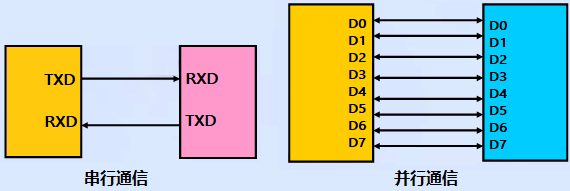
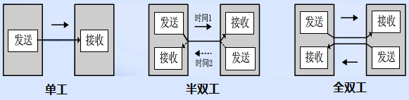
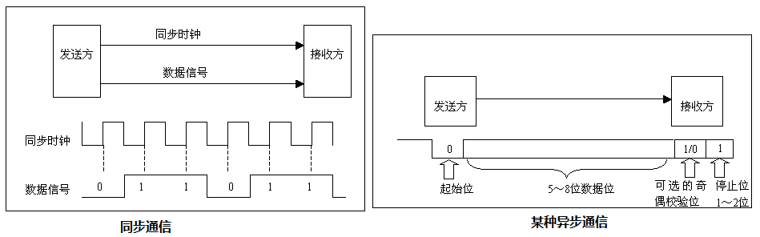
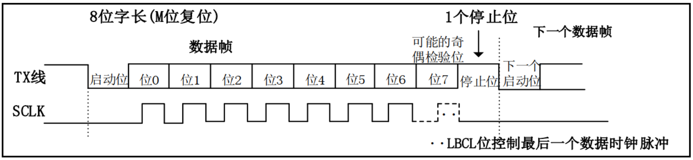

<!-- more -->

## 一、数据通信

在单片机的应用中，数据通信是必不可少的一部分，比如：单片机和上位机、单片机和外围器件之间，它们都有数据通信的需求。由于设备之间的电气特性、传输速率、可靠性要求各不相同，于是就有了各种通信类型、通信协议，我们最常的有： USART、 IIC、 SPI、 CAN、 USB等。

### 1. 数据通信方式

按数据通信方式分类，可分为串行通信和并行通信两种。串行和并行的对比如下图所示：  

串行通信的基本特征是数据逐位顺序依次传输，优点是传输线少、 布线成本低、 灵活度高等优点，一般用于近距离人机交互， 特殊处理后也可以用于远距离， 缺点就是传输速率低。而并行通信是数据各位可以通过多条线同时传输，优点是传输速率高，缺点就是布线成本高，抗干扰能力差因而适用于短距离、高速率的通信。  

### 2. 数据传输方向  

根据数据传输方向，通信又可分为全双工、半双工和单工通信。全双工、半双工和单工通信的比较如下图所示：  

- 单工是指数据传输仅能沿一个方向，不能实现反方向传输，如校园广播。

- 半双工是指数据传输可以沿着两个方向，但是需要分时进行， 如对讲机。

- 全双工是指数据可以同时进行双向传输，日常的打电话属于这种情形。  

这里注意全双工和半双工通信的区别：半双工通信是共用一条线路实现双向通信，而全双工是利用两条线路，一条用于发送数据，另一条用于接收数据。  

### 3. 数据同步方式  

根据数据同步方式，通信又可分为同步通信和异步通信。同步通信和异步通信比较如下图所示：  

同步通信要求通信双方共用同一时钟信号，在总线上保持统一的时序和周期完成信息传输。优点：可以实现高速率、大容量的数据传输，以及点对多点传输。缺点： 要求发送时钟和接收时钟保持严格同步， 收发双方时钟允许的误差较小， 同时硬件复杂。

异步通信不需要时钟信号，而是在数据信号中加入开始位和停止位等一些同步信号，以便使接收端能够正确地将每一个字符接收下来，某些通信中还需要双方约定传输速率。 优点：没有时钟信号硬件简单，双方时钟可允许一定误差。缺点： 通信速率较低，只适用点对点传输。  

### 4. 通信速率  

在数字通信系统中，通信速率（传输速率）指数据在信道中传输的速度，它分为两种：传信率和传码率。  

传信率：每秒钟传输的信息量，即每秒钟传输的二进制位数，单位为 bit/s（即比特每秒），因而又称为比特率。  

传码率：每秒钟传输的码元个数，单位为 Baud（即波特每秒），因而又称为波特率。  

比特率和波特率这两个概念又常常被人们混淆。 比特率很好理解，我们来看看波特率，波特率被传输的是码元，码元是信号被调制后的概念， 每个码元都可以表示一定 bit 的数据信息量。举个例子，在 TTL 电平标准的通信中，用 0V 表示逻辑 0， 5V 表示逻辑 1，这时候这个码元就可以表示两种状态。如果电平信号 0V、 2V、 4V 和 6V 分别表示二进制数 00、 01、 10、 11，这时候每一个码元就可以表示四种状态。  

由上述可以看出，码元携带一定的比特信息，所以比特率和波特率也是有一定的关系的。比特率和波特率的关系可以用以下式子表示：
$$
比特率 = 波特率 · log_{2}{M}
$$
其中 M 表示码元承载的信息量。 我们也可以理解 M 为码元的进制数。举个例子：波特率为 100 Baud，即每秒传输 100 个码元，如果码元采用十六进制编码（即M=2，代入上述式子），那么这时候的比特率就是 400 bit/s。如果码元采用二进制编码（即 M=2，
代入上述式子），那么这时候的比特率就是 100 bit/s。  

可以看出采用二进制的时候， 波特率和比特率数值上相等。 但是这里要注意，它们的相等只是数值相等， 其意义上不同，看波特率和波特率单位就知道。由于我们的所用的数字系统都是二进制的，所以有部分人久而久之就直接把波特率和比特率混淆了。  

## 二、串口通信协议

### 1. 简介

串口通信是一种设备间常用的串行通信方式，串口按位（bit）发送和接收字节。尽管比特字节（byte）的串行通信慢，但是串口可以在使用一根线发送数据的同时用另一根线接收数据。

串口通信协议是指规定了数据包的内容，内容包含了起始位、主体数据、校验位及停止位，双方需要约定一致的数据包格式才能正常收发数据的有关规范。在串口通信中，常用的协议包括RS-232、 RS-422 和 RS-485 等。  

随着科技的发展， RS-232 在工业上还有广泛的使用，但是在商业技术上，已经慢慢的使用USB 转串口取代了 RS-232 串口。我们只需要在电路中添加一个 USB 转串口芯片，就可以实现USB 通信协议和标准 UART 串行通信协议的转换，而我们开发板上的 USB 转串口芯片是
CH340C 这个芯片。  

### 2. 通信协议

串口通信的数据包由发送设备的 TXD 接口传输到接收设备的 RXD 接口。在串口通信的协议层中，规定了数据包的内容，它由起始位、主体数据、校验位以及停止位组成，通讯双方的数据包格式要约定一致才能正常收发数据，其组成如图：

  

串口通信协议数据包组成可以分为波特率和数据帧格式两部分。

#### 2.1 波特率

后面主要是学习串口异步通信，异步通信是不需要时钟信号的，但是这里需要我们约定好两个设备的波特率。 波特率表示每秒钟传送的码元符号的个数，所以它决定了数据帧里面每一个位的时间长度。两个要通信的设备的波特率一定要设置相同，我们常见的波特率是 4800、9600、 115200 等。  

#### 2.2 数据帧格式  

数据帧格式需要我们提前约定好，串口通信的数据帧包括起始位、停止位、有效数据位以及校验位。  

- **起始位和停止位**：串口通信的一个数据帧是从起始位开始，直到停止位。数据帧中的起始位是由一个逻辑 0的数据位表示，而数据帧的停止位可以是 0.5、 1、 1.5 或 2 个逻辑 1 的数据位表示，只要双方约定一致即可。

- **有效数据位**：数据帧的起始位之后，就接着是数据位，也称有效数据位，这就是我们真正需要的数据，有效数据位通常会被约定为 5、 6、 7 或者 8 个位长。有效数据位是低位（LSB）在前，高位（MSB）在后。
- **校验位**：校验位可以认为是一个特殊的数据位。校验位一般用来判断接收的数据位有无错误，检验方法有：奇检验、偶检验、 0 检验、 1 检验以及无检验。  

（1）奇校验是指有效数据为和校验位中“1”的个数为奇数，比如一个 8 位长的有效数据为：10101001，总共有 4 个“1”，为达到奇校验效果，校验位设置为“1”，最后传输的数据是 8 位的有效数据加上 1 位的校验位总共 9 位。  

（2）偶校验与奇校验要求刚好相反，要求帧数据和校验位中“1”的个数为偶数，比如数据帧：11001010，此时数据帧“ 1”的个数为 4 个，所以偶校验位为“0”。  

（3）0 校验是指不管有效数据中的内容是什么，校验位总为“0”， 1 校验是校验位总为“1”。  

（4）无校验是指数据帧中不包含校验位。  
